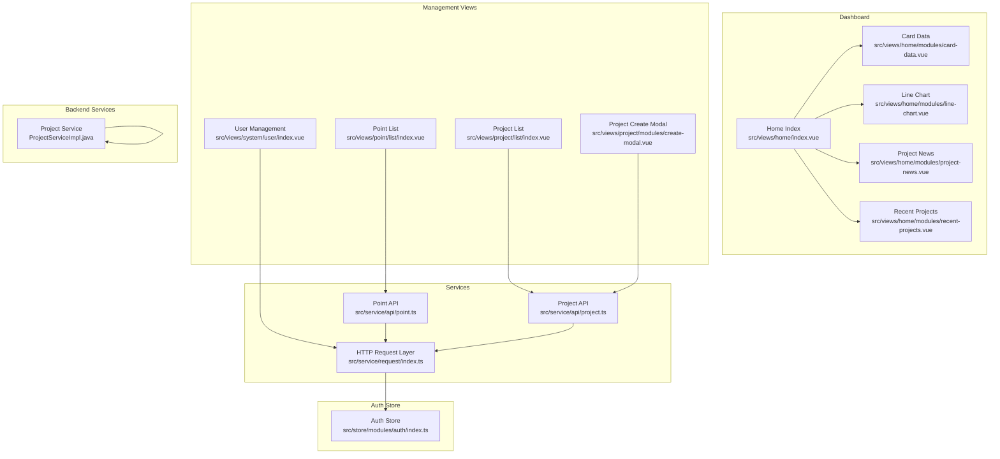
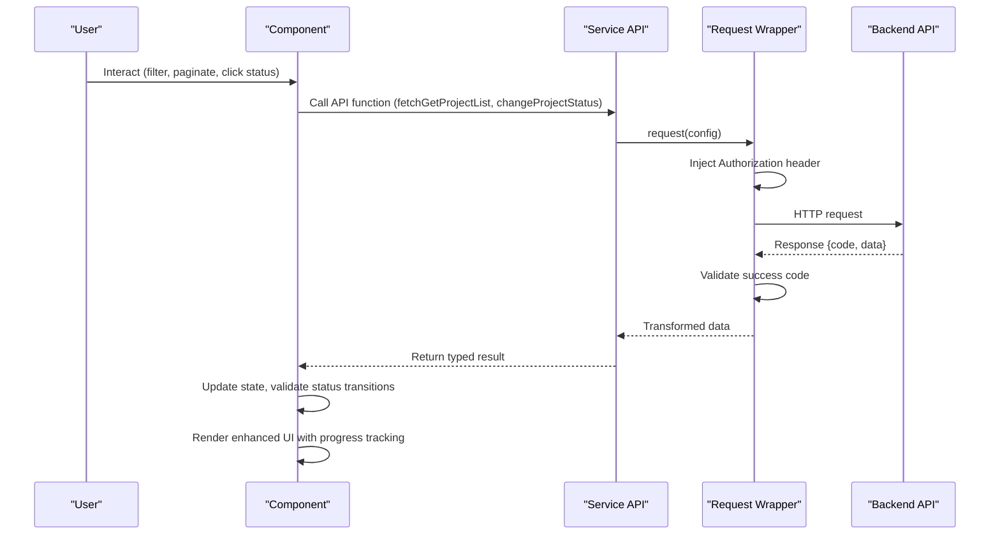
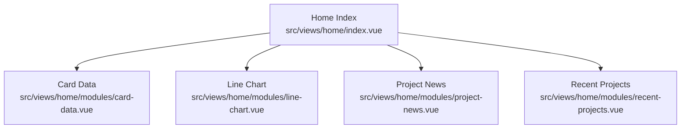
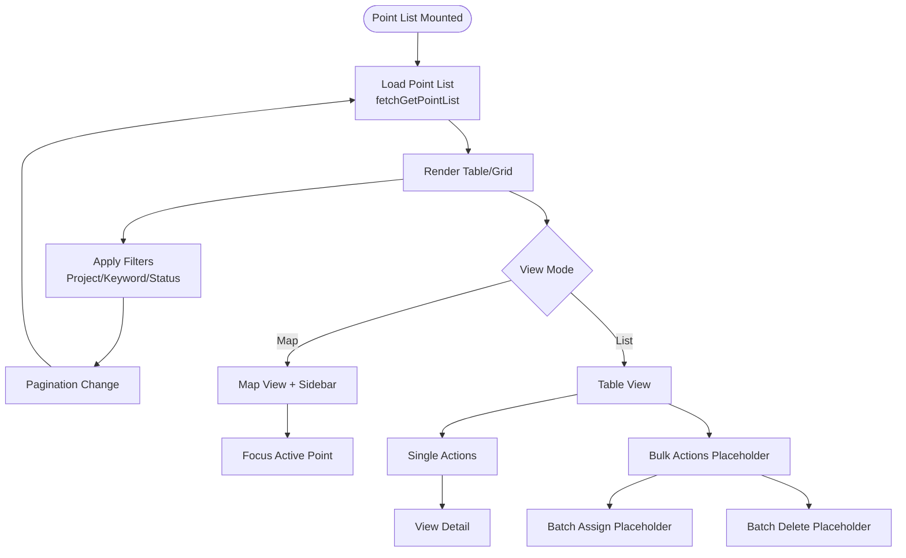
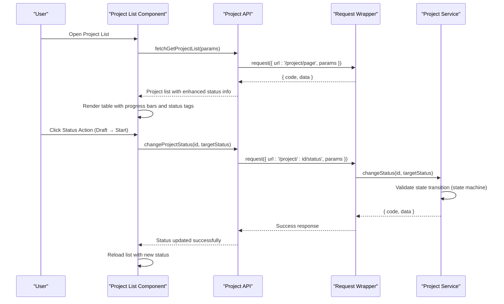
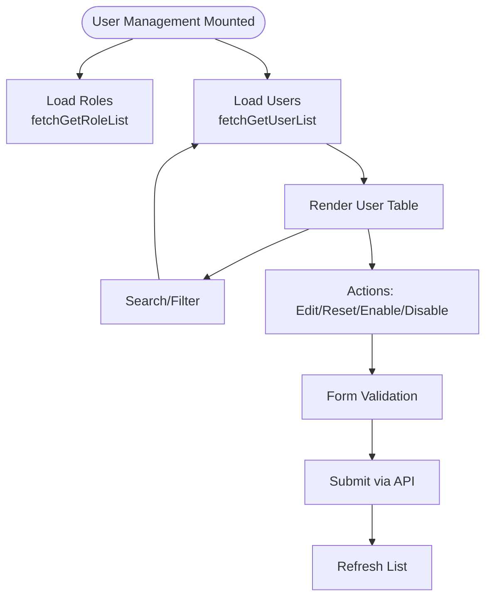
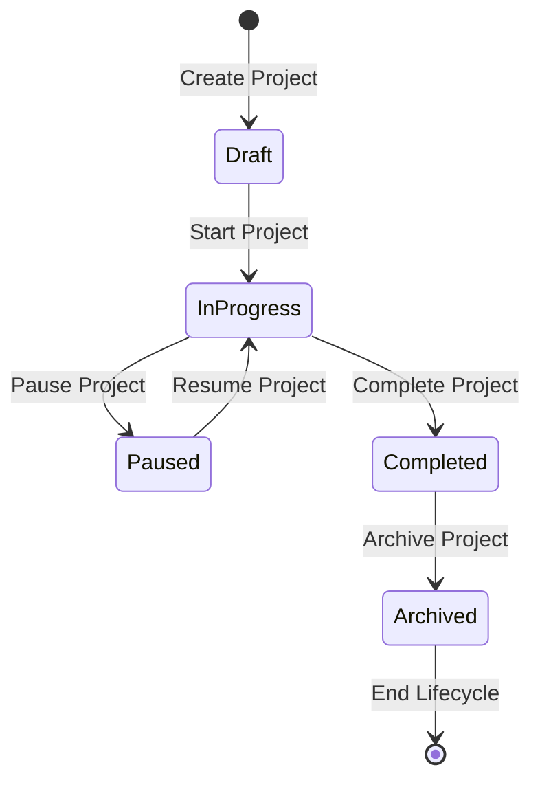
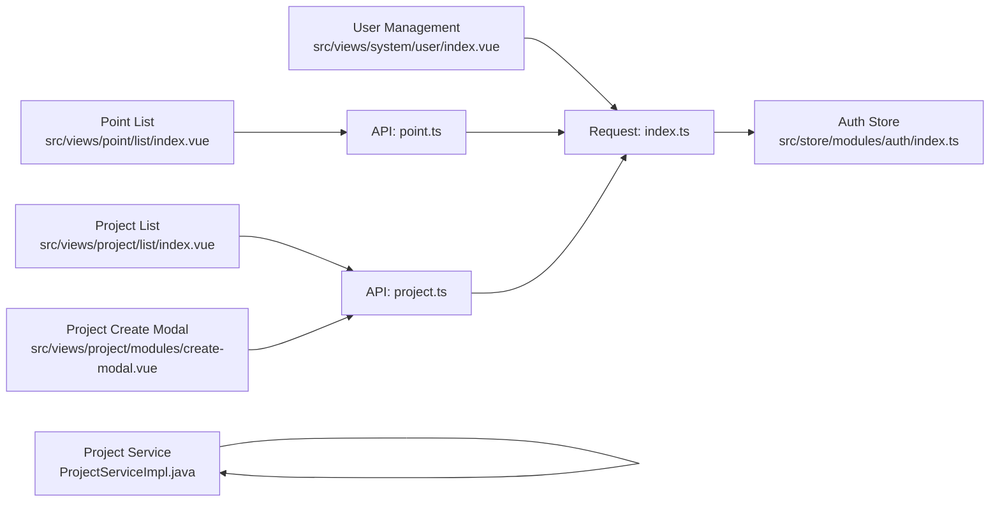

# Desktop Admin Interface

<cite>
**Referenced Files in This Document**
- [README.md](file://admin-web-soybean/README.md)
- [index.vue](file://admin-web-soybean/src/views/home/index.vue)
- [card-data.vue](file://admin-web-soybean/src/views/home/modules/card-data.vue)
- [line-chart.vue](file://admin-web-soybean/src/views/home/modules/line-chart.vue)
- [project-news.vue](file://admin-web-soybean/src/views/home/modules/project-news.vue)
- [recent-projects.vue](file://admin-web-soybean/src/views/home/modules/recent-projects.vue)
- [index.vue](file://admin-web-soybean/src/views/point/list/index.vue)
- [index.vue](file://admin-web-soybean/src/views/project/list/index.vue)
- [index.vue](file://admin-web-soybean/src/views/system/user/index.vue)
- [create-modal.vue](file://admin-web-soybean/src/views/project/modules/create-modal.vue)
- [point.ts](file://admin-web-soybean/src/service/api/point.ts)
- [project.ts](file://admin-web-soybean/src/service/api/project.ts)
- [index.ts](file://admin-web-soybean/src/service/request/index.ts)
- [index.ts](file://admin-web-soybean/src/store/modules/auth/index.ts)
- [ProjectServiceImpl.java](file://admin-backend/src/main/java/com/qhiot/survey/service/impl/ProjectServiceImpl.java)
- [api.d.ts](file://admin-web-soybean/src/typings/api.d.ts)
</cite>

## Update Summary
**Changes Made**
- Enhanced project administration interface with improved status management capabilities
- Added comprehensive status transition validation and state machine enforcement
- Improved responsive design with enhanced user interaction patterns
- Updated project lifecycle management with proper state validation
- Added new project detail and timeline visualization components

## Table of Contents
1. [Introduction](#introduction)
2. [Project Structure](#project-structure)
3. [Core Components](#core-components)
4. [Architecture Overview](#architecture-overview)
5. [Detailed Component Analysis](#detailed-component-analysis)
6. [Enhanced Project Administration Interface](#enhanced-project-administration-interface)
7. [Dependency Analysis](#dependency-analysis)
8. [Performance Considerations](#performance-considerations)
9. [Troubleshooting Guide](#troubleshooting-guide)
10. [Conclusion](#conclusion)

## Introduction
This document describes the desktop admin interface built with the Soybean Admin framework. It focuses on the dashboard analytics widgets, recent activity displays, and system status monitoring; the survey point management interface with filtering, sorting, and bulk operations; the enhanced project administration screens including timeline visualization, member management, progress tracking, and improved status management; and the user management interface with role assignment, permission configuration, and activity monitoring. It also covers form validation, data visualization, responsive layouts, accessibility features, backend API integration, and real-time data updates.

## Project Structure
The admin interface is a Vue 3 + Vite + TypeScript application using Ant Design Vue components and a glass-morphism UI theme. Key areas:
- Home dashboard with analytics cards, charts, recent activity, and recent projects
- Point management with list and map modes, filtering, pagination, and bulk actions
- Enhanced project administration with improved status management, progress tracking, and lifecycle management
- User management with role assignment, permission checks, and CRUD operations
- API service layer abstracting HTTP requests and backend integration
- Authentication store managing tokens, roles, and permissions

**Diagram sources**
- [index.vue:1-50](file://admin-web-soybean/src/views/home/index.vue#L1-L50)
- [card-data.vue:1-127](file://admin-web-soybean/src/views/home/modules/card-data.vue#L1-L127)
- [line-chart.vue:1-214](file://admin-web-soybean/src/views/home/modules/line-chart.vue#L1-L214)
- [project-news.vue:1-269](file://admin-web-soybean/src/views/home/modules/project-news.vue#L1-L269)
- [recent-projects.vue:1-288](file://admin-web-soybean/src/views/home/modules/recent-projects.vue#L1-L288)
- [index.vue:1-506](file://admin-web-soybean/src/views/point/list/index.vue#L1-L506)
- [index.vue:1-803](file://admin-web-soybean/src/views/project/list/index.vue#L1-L803)
- [index.vue:1-586](file://admin-web-soybean/src/views/system/user/index.vue#L1-L586)
- [create-modal.vue](file://admin-web-soybean/src/views/project/modules/create-modal.vue)
- [point.ts:1-84](file://admin-web-soybean/src/service/api/point.ts#L1-L84)
- [project.ts:1-62](file://admin-web-soybean/src/service/api/project.ts#L1-L62)
- [index.ts:1-199](file://admin-web-soybean/src/service/request/index.ts#L1-L199)
- [index.ts:1-203](file://admin-web-soybean/src/store/modules/auth/index.ts#L1-L203)
- [ProjectServiceImpl.java:182-221](file://admin-backend/src/main/java/com/qhiot/survey/service/impl/ProjectServiceImpl.java#L182-L221)

**Section sources**
- [README.md:20-80](file://admin-web-soybean/README.md#L20-L80)
- [index.vue:1-50](file://admin-web-soybean/src/views/home/index.vue#L1-L50)

## Core Components
- Dashboard overview with:
  - Analytics cards for key metrics
  - Interactive line chart for task trends
  - Recent activity feed
  - Recent projects list with status badges
- Point management:
  - List and map modes with toggle
  - Filtering by project, keyword, and status
  - Pagination and selection for bulk actions
  - Map overlay controls and legend
- Enhanced project administration:
  - Project list with comprehensive status management and progress tracking
  - Creation/edit modals with permission-aware actions and enhanced validation
  - Timeline visualization and member management capabilities
  - Status transition validation with state machine enforcement
  - Metrics cards with improved filtering and search capabilities
- User management:
  - User list with role tags and status
  - Add/edit/reset-password modals
  - Role and permission-driven UI controls

**Section sources**
- [index.vue:1-50](file://admin-web-soybean/src/views/home/index.vue#L1-L50)
- [card-data.vue:1-127](file://admin-web-soybean/src/views/home/modules/card-data.vue#L1-L127)
- [line-chart.vue:1-214](file://admin-web-soybean/src/views/home/modules/line-chart.vue#L1-L214)
- [project-news.vue:1-269](file://admin-web-soybean/src/views/home/modules/project-news.vue#L1-L269)
- [recent-projects.vue:1-288](file://admin-web-soybean/src/views/home/modules/recent-projects.vue#L1-L288)
- [index.vue:1-506](file://admin-web-soybean/src/views/point/list/index.vue#L1-L506)
- [index.vue:1-803](file://admin-web-soybean/src/views/project/list/index.vue#L1-L803)
- [index.vue:1-586](file://admin-web-soybean/src/views/system/user/index.vue#L1-L586)

## Architecture Overview
The admin interface follows a layered architecture:
- Presentation layer: Vue components and modules with enhanced project administration capabilities
- Service layer: API modules encapsulate HTTP calls with improved status management
- Request layer: Centralized Axios wrapper with interceptors for auth, error handling, and token refresh
- State management: Pinia stores for auth and routing
- Theme and UI: UnoCSS and Ant Design Vue with custom directives and components
- Backend services: Enhanced project service with state machine validation

**Diagram sources**
- [project.ts:1-62](file://admin-web-soybean/src/service/api/project.ts#L1-L62)
- [index.ts:20-156](file://admin-web-soybean/src/service/request/index.ts#L20-L156)
- [ProjectServiceImpl.java:182-221](file://admin-backend/src/main/java/com/qhiot/survey/service/impl/ProjectServiceImpl.java#L182-L221)

**Section sources**
- [index.ts:1-199](file://admin-web-soybean/src/service/request/index.ts#L1-L199)
- [index.ts:1-203](file://admin-web-soybean/src/store/modules/auth/index.ts#L1-L203)

## Detailed Component Analysis

### Dashboard Components
The dashboard composes four primary widgets:
- Analytics cards: Four metric cards with icons, badges, and hover effects
- Line chart: ECharts-based trend visualization with time range tabs and theme-aware tooltips
- Recent activity: Timeline-like activity feed with quick actions
- Recent projects: Paginated list of projects with status indicators and navigation

**Diagram sources**
- [index.vue:1-50](file://admin-web-soybean/src/views/home/index.vue#L1-L50)
- [card-data.vue:1-127](file://admin-web-soybean/src/views/home/modules/card-data.vue#L1-L127)
- [line-chart.vue:1-214](file://admin-web-soybean/src/views/home/modules/line-chart.vue#L1-L214)
- [project-news.vue:1-269](file://admin-web-soybean/src/views/home/modules/project-news.vue#L1-L269)
- [recent-projects.vue:1-288](file://admin-web-soybean/src/views/home/modules/recent-projects.vue#L1-L288)

**Section sources**
- [index.vue:12-49](file://admin-web-soybean/src/views/home/index.vue#L12-L49)
- [card-data.vue:18-55](file://admin-web-soybean/src/views/home/modules/card-data.vue#L18-L55)
- [line-chart.vue:15-86](file://admin-web-soybean/src/views/home/modules/line-chart.vue#L15-L86)
- [project-news.vue:20-53](file://admin-web-soybean/src/views/home/modules/project-news.vue#L20-L53)
- [recent-projects.vue:14-39](file://admin-web-soybean/src/views/home/modules/recent-projects.vue#L14-L39)

### Survey Point Management
Key capabilities:
- View modes: List and map with toggle
- Stats summary cards
- Filters: Project dropdown, keyword search, status toggle buttons
- Bulk operations: Selection with batch assign/delete placeholders
- Table columns: Name, project, code, coordinates, status, date, actions
- Map view: Sidebar list with active selection, zoom controls, legend
- Modals: Import dialog placeholder with Excel template download

**Diagram sources**
- [index.vue:354-472](file://admin-web-soybean/src/views/point/list/index.vue#L354-L472)
- [point.ts:4-17](file://admin-web-soybean/src/service/api/point.ts#L4-L17)

**Section sources**
- [index.vue:1-506](file://admin-web-soybean/src/views/point/list/index.vue#L1-L506)
- [point.ts:1-84](file://admin-web-soybean/src/service/api/point.ts#L1-L84)

### Enhanced Project Administration Interface
**Updated** Enhanced with improved status management, responsive design, and user interaction capabilities

Key capabilities:
- Comprehensive status management with state machine validation
- Enhanced progress tracking with detailed metrics and visual indicators
- Timeline visualization for project lifecycle management
- Member management with role assignments and activity tracking
- Improved responsive design with enhanced user interaction patterns
- Advanced filtering and search capabilities with project metadata
- Real-time status updates and progress synchronization

**Diagram sources**
- [index.vue:68-137](file://admin-web-soybean/src/views/project/list/index.vue#L68-L137)
- [project.ts:4-61](file://admin-web-soybean/src/service/api/project.ts#L4-L61)
- [index.ts:31-35](file://admin-web-soybean/src/service/request/index.ts#L31-L35)
- [ProjectServiceImpl.java:182-221](file://admin-backend/src/main/java/com/qhiot/survey/service/impl/ProjectServiceImpl.java#L182-L221)

**Section sources**
- [index.vue:1-803](file://admin-web-soybean/src/views/project/list/index.vue#L1-L803)
- [project.ts:1-62](file://admin-web-soybean/src/service/api/project.ts#L1-L62)
- [create-modal.vue](file://admin-web-soybean/src/views/project/modules/create-modal.vue)
- [ProjectServiceImpl.java:182-221](file://admin-backend/src/main/java/com/qhiot/survey/service/impl/ProjectServiceImpl.java#L182-L221)

### User Management Interface
Key capabilities:
- Stats cards: Total users, admin, auditor, collector
- Search and role filter
- User table with avatar initials, role tags, status tag
- Modals: Add user (form validation), Edit user, Reset password (validation)
- Permission-aware UI: Conditional buttons based on role/permission
- Role assignment: Checkbox groups for role selection

**Diagram sources**
- [index.vue:376-581](file://admin-web-soybean/src/views/system/user/index.vue#L376-L581)
- [index.ts:192-201](file://admin-web-soybean/src/store/modules/auth/index.ts#L192-L201)

**Section sources**
- [index.vue:1-586](file://admin-web-soybean/src/views/system/user/index.vue#L1-L586)
- [index.ts:1-203](file://admin-web-soybean/src/store/modules/auth/index.ts#L1-L203)

### Form Validation Examples
- User creation requires username, real name, and password (minimum length)
- Reset password requires matching new and confirm passwords
- Edit user requires real name
- Project creation/validation includes enhanced field validation and status constraints
- Validation messages use Ant Design Vue message prompts

**Section sources**
- [index.vue:455-558](file://admin-web-soybean/src/views/system/user/index.vue#L455-L558)
- [create-modal.vue](file://admin-web-soybean/src/views/project/modules/create-modal.vue)

### Data Visualization
- Dashboard line chart uses ECharts with:
  - Smoothed line series and area fill
  - Dynamic tooltip and grid configuration
  - Theme-aware colors and dark mode watcher
- Project progress bars use Ant Design Vue Progress component with enhanced status indicators
- Status badges use colored tags with pulse animation for active state
- Timeline visualization provides project lifecycle tracking with milestone markers

**Section sources**
- [line-chart.vue:15-86](file://admin-web-soybean/src/views/home/modules/line-chart.vue#L15-L86)
- [index.vue:299-305](file://admin-web-soybean/src/views/project/list/index.vue#L299-L305)
- [index.vue:729-736](file://admin-web-soybean/src/views/project/list/index.vue#L729-L736)

### Responsive Layouts
- CSS Grid and Flexbox for adaptive dashboards with enhanced project administration layouts
- Ant Design Vue components with responsive props (e.g., input heights, pagination)
- Scroll regions for long lists and tables with improved performance
- Breakpoints for lg/grid-cols variants with enhanced mobile responsiveness
- Project cards with flexible layouts and status-responsive styling

**Section sources**
- [index.vue:28-48](file://admin-web-soybean/src/views/home/index.vue#L28-L48)
- [index.vue:108-127](file://admin-web-soybean/src/views/point/list/index.vue#L108-L127)
- [index.vue:1-803](file://admin-web-soybean/src/views/project/list/index.vue#L1-L803)

### Accessibility Features
- Semantic headings and labels with enhanced project administration context
- Focusable controls and keyboard navigable tables with improved ARIA support
- Clear contrast and theme-aware colors with status-specific color schemes
- Tooltip and status text for interactive elements with enhanced descriptions
- Disabled states and loading indicators with improved user feedback
- Screen reader support for project status changes and progress updates

## Enhanced Project Administration Interface

### Status Management System
**Updated** Comprehensive state machine validation and enhanced user interaction

The project administration interface now features a robust status management system with:
- State machine validation ensuring only valid status transitions
- Enhanced user feedback during status changes
- Real-time progress updates synchronized with status changes
- Comprehensive status history tracking and audit trails

**Diagram sources**
- [ProjectServiceImpl.java:204-221](file://admin-backend/src/main/java/com/qhiot/survey/service/impl/ProjectServiceImpl.java#L204-L221)

### Timeline Visualization
**New** Enhanced project lifecycle tracking with timeline interface

The interface now includes comprehensive timeline visualization:
- Project lifecycle milestones with date markers
- Progress tracking with visual timeline indicators
- Member activity timelines with contribution tracking
- Status change history with timestamped events
- Interactive timeline navigation and filtering

### Member Management
**Enhanced** Improved member assignment and role management

Enhanced member management capabilities:
- Team member assignment with role-based permissions
- Activity tracking and contribution metrics
- Member availability and workload visualization
- Role assignment with permission inheritance
- Team collaboration features with real-time updates

### Progress Tracking
**Enhanced** Detailed metrics and visual indicators

Improved progress tracking features:
- Multi-dimensional progress metrics (overall, by section, by task)
- Visual progress indicators with status-specific styling
- Milestone achievement tracking and celebration
- Progress forecasting and timeline adjustments
- Historical progress trends and performance analysis

**Section sources**
- [ProjectServiceImpl.java:182-221](file://admin-backend/src/main/java/com/qhiot/survey/service/impl/ProjectServiceImpl.java#L182-L221)
- [api.d.ts:248-305](file://admin-web-soybean/src/typings/api.d.ts#L248-L305)
- [index.vue:1-803](file://admin-web-soybean/src/views/project/list/index.vue#L1-L803)

## Dependency Analysis
- Components depend on:
  - Service APIs for data fetching with enhanced project administration
  - Request wrapper for HTTP communication with improved error handling
  - Auth store for permissions and tokens with enhanced role checking
  - Backend services with state machine validation for project status management
- Coupling:
  - Low coupling between views and services via API modules
  - Cohesion within modules (e.g., dashboard widgets, enhanced project administration)
- External dependencies:
  - Ant Design Vue for UI primitives with enhanced components
  - ECharts for charts with timeline visualization support
  - UnoCSS for styling with responsive design utilities

**Diagram sources**
- [index.vue:284-286](file://admin-web-soybean/src/views/point/list/index.vue#L284-L286)
- [index.vue:24-27](file://admin-web-soybean/src/views/project/list/index.vue#L24-L27)
- [index.vue:238-239](file://admin-web-soybean/src/views/system/user/index.vue#L238-L239)
- [create-modal.vue](file://admin-web-soybean/src/views/project/modules/create-modal.vue)
- [point.ts:1-84](file://admin-web-soybean/src/service/api/point.ts#L1-L84)
- [project.ts:1-62](file://admin-web-soybean/src/service/api/project.ts#L1-L62)
- [index.ts:1-199](file://admin-web-soybean/src/service/request/index.ts#L1-L199)
- [index.ts:1-203](file://admin-web-soybean/src/store/modules/auth/index.ts#L1-L203)
- [ProjectServiceImpl.java:182-221](file://admin-backend/src/main/java/com/qhiot/survey/service/impl/ProjectServiceImpl.java#L182-L221)

**Section sources**
- [index.ts:20-156](file://admin-web-soybean/src/service/request/index.ts#L20-L156)
- [index.ts:192-201](file://admin-web-soybean/src/store/modules/auth/index.ts#L192-L201)

## Performance Considerations
- Prefer virtualized scrolling for large tables (already using scroll y with calc)
- Debounce search/filter inputs to reduce API calls with enhanced project filtering
- Lazy-load map components when switching to map view
- Cache frequently accessed lists (e.g., projects) and invalidate on mutations with enhanced caching strategies
- Use computed properties for derived data (e.g., progress percentages, status validation)
- Minimize re-renders by using shallow refs for large arrays and deep equality checks
- Implement efficient state machine validation to prevent unnecessary API calls
- Optimize timeline rendering for large project datasets

## Troubleshooting Guide
Common issues and resolutions:
- Authentication errors:
  - Token expiration triggers automatic refresh; if refresh fails, reset store and redirect to login
  - Logout codes and modal logout codes handled centrally
- Network and timeout errors:
  - Friendly messages shown; network errors and timeouts detected and surfaced
- Backend error mapping:
  - Backend codes mapped to user-friendly messages; 403 treated as permission denied
  - Enhanced error handling for invalid status transitions
- UI feedback:
  - Messages and modals guide users through failures and confirm destructive actions
  - Enhanced status change notifications with success/error states
  - Real-time progress updates with loading indicators

**Section sources**
- [index.ts:36-96](file://admin-web-soybean/src/service/request/index.ts#L36-L96)
- [index.ts:100-154](file://admin-web-soybean/src/service/request/index.ts#L100-L154)
- [index.ts:50-64](file://admin-web-soybean/src/store/modules/auth/index.ts#L50-L64)
- [ProjectServiceImpl.java:194-196](file://admin-backend/src/main/java/com/qhiot/survey/service/impl/ProjectServiceImpl.java#L194-L196)

## Conclusion
The desktop admin interface leverages Soybean Admin's modern stack to deliver a responsive, accessible, and feature-rich management experience. The enhanced dashboard provides actionable insights, while the improved management screens streamline point, project, and user administration with comprehensive status management and lifecycle tracking. The service layer abstracts backend integration with robust error handling, authentication, and enhanced state machine validation. The new project administration interface features sophisticated status management, timeline visualization, member management, and progress tracking capabilities. By following the patterns outlined here, teams can extend functionality, maintain consistency, and ensure reliable operation across environments with enhanced project lifecycle management capabilities.