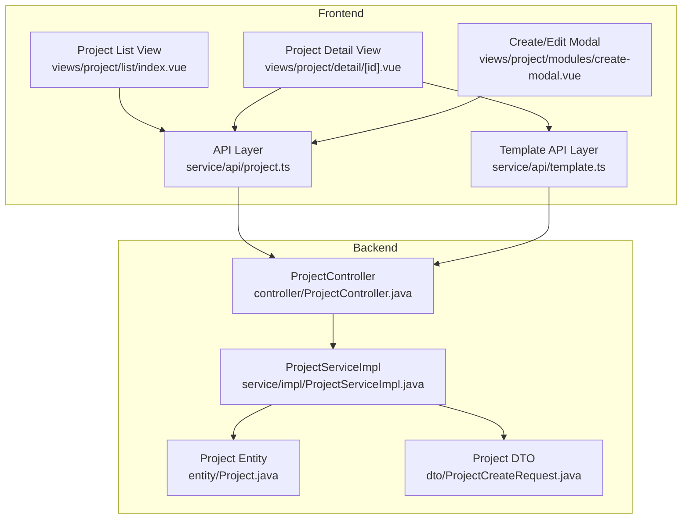
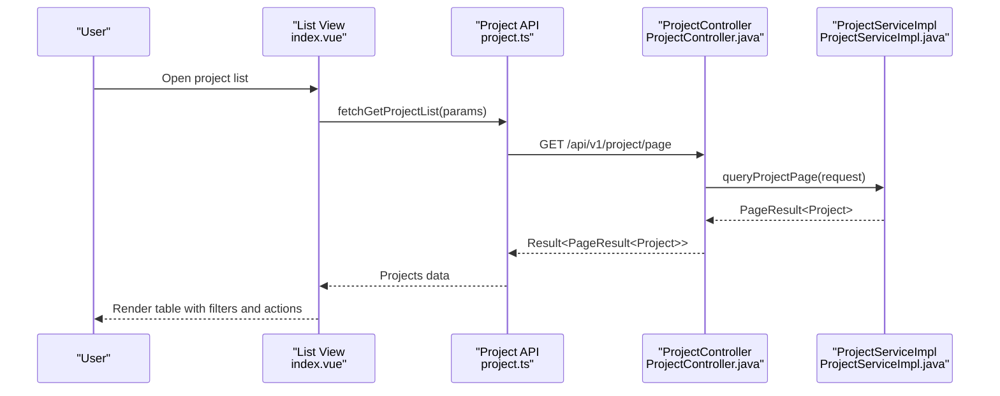
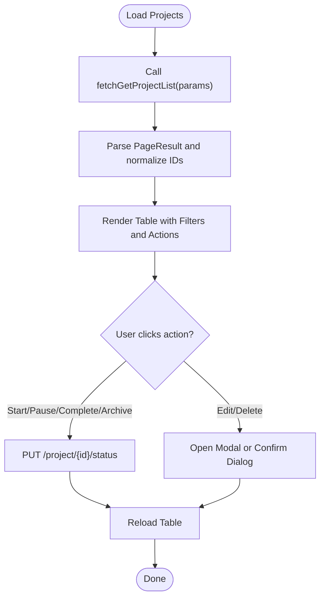
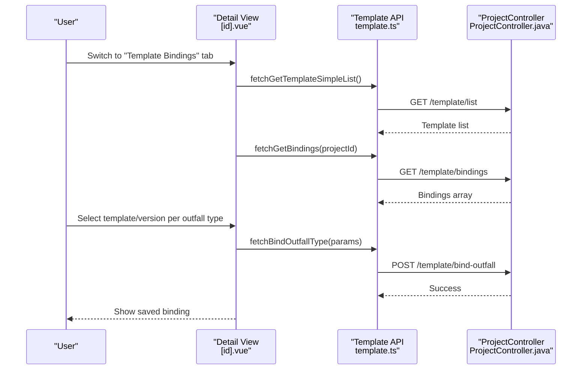
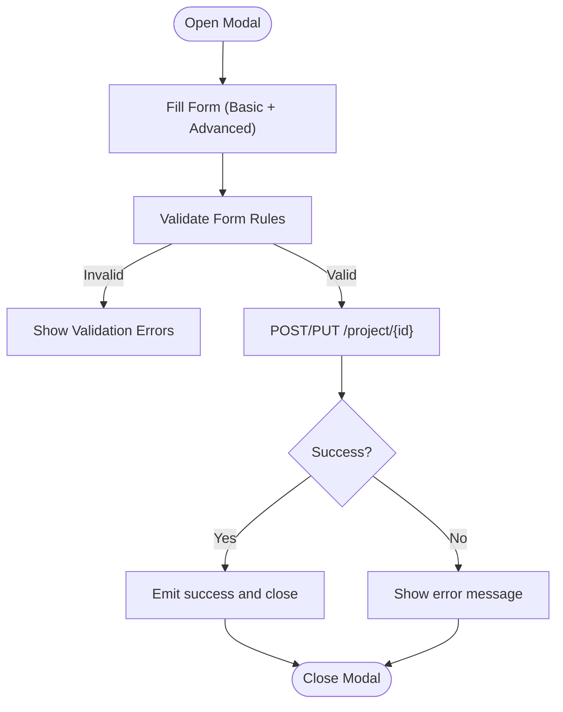
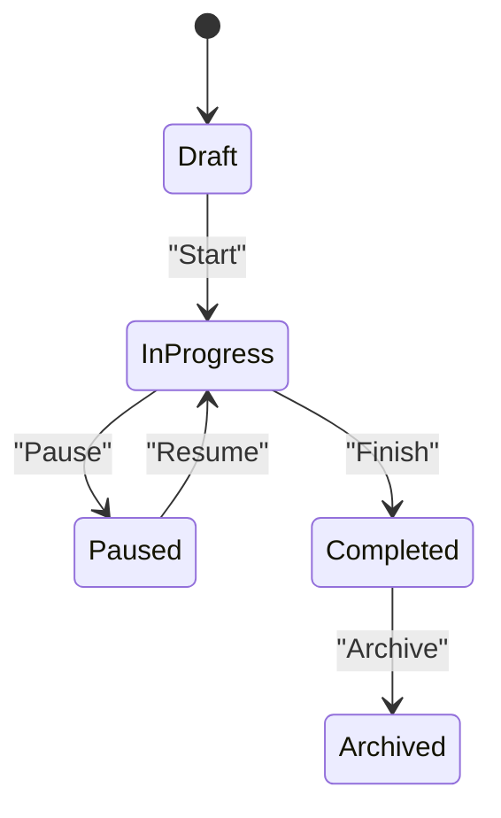
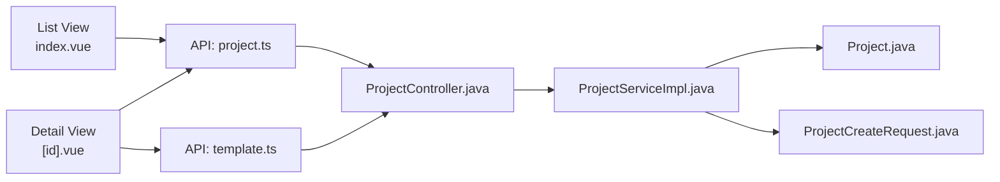

# Project Administration Interface

<cite>
**Referenced Files in This Document**
- [index.vue](file://admin-web-soybean/src/views/project/list/index.vue)
- [index.vue](file://admin-web-soybean/src/views/project/detail/[id].vue)
- [create-modal.vue](file://admin-web-soybean/src/views/project/modules/create-modal.vue)
- [project.ts](file://admin-web-soybean/src/service/api/project.ts)
- [template.ts](file://admin-web-soybean/src/service/api/template.ts)
- [ProjectController.java](file://admin-backend/src/main/java/com/qhiot/survey/controller/ProjectController.java)
- [ProjectServiceImpl.java](file://admin-backend/src/main/java/com/qhiot/survey/service/impl/ProjectServiceImpl.java)
- [ProjectCreateRequest.java](file://admin-backend/src/main/java/com/qhiot/survey/dto/ProjectCreateRequest.java)
- [Project.java](file://admin-backend/src/main/java/com/qhiot/survey/entity/Project.java)
- [index.ts](file://admin-web-soybean/src/service/api/index.ts)
</cite>

## Table of Contents
1. [Introduction](#introduction)
2. [Project Structure](#project-structure)
3. [Core Components](#core-components)
4. [Architecture Overview](#architecture-overview)
5. [Detailed Component Analysis](#detailed-component-analysis)
6. [Dependency Analysis](#dependency-analysis)
7. [Performance Considerations](#performance-considerations)
8. [Troubleshooting Guide](#troubleshooting-guide)
9. [Conclusion](#conclusion)
10. [Appendices](#appendices)

## Introduction
This document describes the project administration interface for managing survey projects. It covers:
- Project list view with filtering by status, timeline visualization, and member assignment indicators
- Project detail view with timeline management, progress tracking, member management, and activity logs
- Project creation modal with form validation, timeline configuration, and member assignment workflows
- Examples of project status transitions, resource allocation, and collaborative features
- Integration touchpoints with template binding and point management
- Responsive design patterns and accessibility considerations

## Project Structure
The interface is implemented as a Vue single-page application with a dedicated backend service. The frontend organizes project-related views under the “project” namespace, while the backend exposes REST endpoints under the “/api/v1/project” path.

**Diagram sources**
- [index.vue:1-196](file://admin-web-soybean/src/views/project/list/index.vue#L1-L196)
- [index.vue:1-287](file://admin-web-soybean/src/views/project/detail/[id].vue#L1-L287)
- [create-modal.vue:1-169](file://admin-web-soybean/src/views/project/modules/create-modal.vue#L1-L169)
- [project.ts:1-62](file://admin-web-soybean/src/service/api/project.ts#L1-L62)
- [template.ts:1-214](file://admin-web-soybean/src/service/api/template.ts#L1-L214)
- [ProjectController.java:1-145](file://admin-backend/src/main/java/com/qhiot/survey/controller/ProjectController.java#L1-L145)
- [ProjectServiceImpl.java:1-200](file://admin-backend/src/main/java/com/qhiot/survey/service/impl/ProjectServiceImpl.java#L1-L200)
- [Project.java:1-84](file://admin-backend/src/main/java/com/qhiot/survey/entity/Project.java#L1-L84)
- [ProjectCreateRequest.java:1-39](file://admin-backend/src/main/java/com/qhiot/survey/dto/ProjectCreateRequest.java#L1-L39)

**Section sources**
- [index.vue:1-196](file://admin-web-soybean/src/views/project/list/index.vue#L1-L196)
- [index.vue:1-287](file://admin-web-soybean/src/views/project/detail/[id].vue#L1-L287)
- [create-modal.vue:1-169](file://admin-web-soybean/src/views/project/modules/create-modal.vue#L1-L169)
- [project.ts:1-62](file://admin-web-soybean/src/service/api/project.ts#L1-L62)
- [template.ts:1-214](file://admin-web-soybean/src/service/api/template.ts#L1-L214)
- [ProjectController.java:1-145](file://admin-backend/src/main/java/com/qhiot/survey/controller/ProjectController.java#L1-L145)
- [ProjectServiceImpl.java:1-200](file://admin-backend/src/main/java/com/qhiot/survey/service/impl/ProjectServiceImpl.java#L1-L200)
- [Project.java:1-84](file://admin-backend/src/main/java/com/qhiot/survey/entity/Project.java#L1-L84)
- [ProjectCreateRequest.java:1-39](file://admin-backend/src/main/java/com/qhiot/survey/dto/ProjectCreateRequest.java#L1-L39)

## Core Components
- Project List View: Displays a paginated table of projects with filters (keyword and status), progress bars, status badges, and quick actions (view, edit, start/pause/complete/archive, delete). It supports status transitions via API calls.
- Project Detail View: Presents project metrics (timeline, total points, approved points), tabs for point list, records, map, template bindings, and logs. Integrates with template binding APIs and point list queries.
- Project Create/Edit Modal: Provides form validation, optional advanced fields (dates, manager), and submission handling for create/update operations.
- Backend Services: Expose REST endpoints for CRUD, status transitions, and statistics; enforce role-based permissions and state-machine validation.

**Section sources**
- [index.vue:57-195](file://admin-web-soybean/src/views/project/list/index.vue#L57-L195)
- [index.vue:27-287](file://admin-web-soybean/src/views/project/detail/[id].vue#L27-L287)
- [create-modal.vue:100-169](file://admin-web-soybean/src/views/project/modules/create-modal.vue#L100-L169)
- [ProjectController.java:32-143](file://admin-backend/src/main/java/com/qhiot/survey/controller/ProjectController.java#L32-L143)
- [ProjectServiceImpl.java:37-197](file://admin-backend/src/main/java/com/qhiot/survey/service/impl/ProjectServiceImpl.java#L37-L197)

## Architecture Overview
The frontend communicates with the backend through typed API modules. The project list and detail views rely on the project API module, while the detail view also integrates template binding APIs. The backend enforces role-based access and validates state transitions.

**Diagram sources**
- [index.vue:68-87](file://admin-web-soybean/src/views/project/list/index.vue#L68-L87)
- [project.ts:4-18](file://admin-web-soybean/src/service/api/project.ts#L4-L18)
- [ProjectController.java:32-37](file://admin-backend/src/main/java/com/qhiot/survey/controller/ProjectController.java#L32-L37)
- [ProjectServiceImpl.java:37-75](file://admin-backend/src/main/java/com/qhiot/survey/service/impl/ProjectServiceImpl.java#L37-L75)

**Section sources**
- [index.vue:68-87](file://admin-web-soybean/src/views/project/list/index.vue#L68-L87)
- [project.ts:4-18](file://admin-web-soybean/src/service/api/project.ts#L4-L18)
- [ProjectController.java:32-37](file://admin-backend/src/main/java/com/qhiot/survey/controller/ProjectController.java#L32-L37)
- [ProjectServiceImpl.java:37-75](file://admin-backend/src/main/java/com/qhiot/survey/service/impl/ProjectServiceImpl.java#L37-L75)

## Detailed Component Analysis

### Project List View
- Filtering and Search
  - Keyword filter on project name or code
  - Status filter toggles for draft, in-progress, paused, completed, archived
- Timeline Visualization
  - Start/end dates displayed per row; progress bar reflects completion percentage derived from counts
- Member Assignment Indicators
  - Manager column shows assigned manager; fallback to “unassigned”
- Actions
  - View details, edit (admin), status transitions (start/pause/complete/archive), delete (admin)
- Pagination and Loading States
  - Ant Design pagination with controlled current/pageSize; loading mask during fetch

**Diagram sources**
- [index.vue:68-137](file://admin-web-soybean/src/views/project/list/index.vue#L68-L137)
- [project.ts:54-61](file://admin-web-soybean/src/service/api/project.ts#L54-L61)

**Section sources**
- [index.vue:36-195](file://admin-web-soybean/src/views/project/list/index.vue#L36-L195)
- [project.ts:4-61](file://admin-web-soybean/src/service/api/project.ts#L4-L61)

### Project Detail View
- Metrics
  - Project period, total points, approved points with completion percentage
- Tabs
  - Point list: filter by point statuses, navigate to manage points, locate on map, view details
  - Records: placeholder for future integration
  - Map: placeholder for map rendering area
  - Template bindings: bind/unbind templates per outfall type; save all bindings
  - Logs: placeholder for activity logs
- Template Binding Workflow
  - Load templates and existing bindings
  - Select template/version per outfall type
  - Save all bindings via batch POST to bind-outfall endpoint
  - Remove binding via DELETE binding endpoint

**Diagram sources**
- [index.vue:161-233](file://admin-web-soybean/src/views/project/detail/[id].vue#L161-L233)
- [template.ts:152-213](file://admin-web-soybean/src/service/api/template.ts#L152-L213)
- [ProjectController.java:108-143](file://admin-backend/src/main/java/com/qhiot/survey/controller/ProjectController.java#L108-L143)

**Section sources**
- [index.vue:27-287](file://admin-web-soybean/src/views/project/detail/[id].vue#L27-L287)
- [template.ts:152-213](file://admin-web-soybean/src/service/api/template.ts#L152-L213)
- [ProjectController.java:108-143](file://admin-backend/src/main/java/com/qhiot/survey/controller/ProjectController.java#L108-L143)

### Project Creation Modal
- Form Fields
  - Basic: project name, code, client
  - Advanced: start/end dates, manager (dropdown populated from users), description
- Validation
  - Required fields and length constraints enforced via Ant Design form rules
- Submission
  - Create vs update based on editData presence
  - On success, emits “success” and closes modal; refreshes parent list/detail

**Diagram sources**
- [create-modal.vue:100-169](file://admin-web-soybean/src/views/project/modules/create-modal.vue#L100-L169)
- [project.ts:28-52](file://admin-web-soybean/src/service/api/project.ts#L28-L52)

**Section sources**
- [create-modal.vue:100-169](file://admin-web-soybean/src/views/project/modules/create-modal.vue#L100-L169)
- [project.ts:28-52](file://admin-web-soybean/src/service/api/project.ts#L28-L52)

### Backend API and State Machine
- REST Endpoints
  - GET /project/page: paginated list with filters
  - GET /project/{id}: project detail
  - POST /project: create project
  - PUT /project/{id}: update project
  - DELETE /project/{id}: delete project
  - PUT /project/{id}/status: change status with validation
- State Machine
  - Draft → In Progress
  - In Progress → Paused or Completed
  - Paused → In Progress
  - Completed → Archived
- Authorization
  - Most operations require ADMIN role

**Diagram sources**
- [ProjectServiceImpl.java:189-197](file://admin-backend/src/main/java/com/qhiot/survey/service/impl/ProjectServiceImpl.java#L189-L197)
- [ProjectController.java:108-118](file://admin-backend/src/main/java/com/qhiot/survey/controller/ProjectController.java#L108-L118)

**Section sources**
- [ProjectController.java:32-143](file://admin-backend/src/main/java/com/qhiot/survey/controller/ProjectController.java#L32-L143)
- [ProjectServiceImpl.java:160-197](file://admin-backend/src/main/java/com/qhiot/survey/service/impl/ProjectServiceImpl.java#L160-L197)
- [ProjectCreateRequest.java:13-38](file://admin-backend/src/main/java/com/qhiot/survey/dto/ProjectCreateRequest.java#L13-L38)
- [Project.java:47-49](file://admin-backend/src/main/java/com/qhiot/survey/entity/Project.java#L47-L49)

## Dependency Analysis
- Frontend API Modules
  - project.ts maps frontend params to backend endpoints
  - template.ts encapsulates template binding operations
- Backend Controllers and Services
  - ProjectController delegates to ProjectServiceImpl
  - ProjectServiceImpl enforces state machine and business rules
- Entities and DTOs
  - Project entity holds project metadata and counters
  - ProjectCreateRequest defines create/update payload shape

**Diagram sources**
- [index.vue:1-196](file://admin-web-soybean/src/views/project/list/index.vue#L1-L196)
- [index.vue:1-287](file://admin-web-soybean/src/views/project/detail/[id].vue#L1-L287)
- [project.ts:1-62](file://admin-web-soybean/src/service/api/project.ts#L1-L62)
- [template.ts:1-214](file://admin-web-soybean/src/service/api/template.ts#L1-L214)
- [ProjectController.java:1-145](file://admin-backend/src/main/java/com/qhiot/survey/controller/ProjectController.java#L1-L145)
- [ProjectServiceImpl.java:1-200](file://admin-backend/src/main/java/com/qhiot/survey/service/impl/ProjectServiceImpl.java#L1-L200)
- [Project.java:1-84](file://admin-backend/src/main/java/com/qhiot/survey/entity/Project.java#L1-L84)
- [ProjectCreateRequest.java:1-39](file://admin-backend/src/main/java/com/qhiot/survey/dto/ProjectCreateRequest.java#L1-L39)

**Section sources**
- [index.ts:1-9](file://admin-web-soybean/src/service/api/index.ts#L1-L9)
- [project.ts:1-62](file://admin-web-soybean/src/service/api/project.ts#L1-L62)
- [template.ts:1-214](file://admin-web-soybean/src/service/api/template.ts#L1-L214)
- [ProjectController.java:1-145](file://admin-backend/src/main/java/com/qhiot/survey/controller/ProjectController.java#L1-L145)
- [ProjectServiceImpl.java:1-200](file://admin-backend/src/main/java/com/qhiot/survey/service/impl/ProjectServiceImpl.java#L1-L200)
- [Project.java:1-84](file://admin-backend/src/main/java/com/qhiot/survey/entity/Project.java#L1-L84)
- [ProjectCreateRequest.java:1-39](file://admin-backend/src/main/java/com/qhiot/survey/dto/ProjectCreateRequest.java#L1-L39)

## Performance Considerations
- Pagination and Lightweight Rendering
  - The list view uses pagination and lightweight progress bars to avoid heavy DOM updates.
- Debounced Filtering
  - Apply debouncing on keyword search to reduce frequent network requests.
- Conditional Data Fetching
  - Detail view lazy-loads point lists and template bindings only when switching tabs.
- Optimistic UI Updates
  - For status transitions, consider optimistic updates with rollback on failure.

## Troubleshooting Guide
- Authentication and Authorization
  - If detail view shows unauthorized errors, redirect to list and notify login expiration.
- Network Failures
  - Catch network errors and display user-friendly messages; retry or suggest refreshing.
- State Transition Errors
  - Backend enforces state machine; ensure UI respects allowed transitions before enabling actions.
- Template Binding Issues
  - Validate template/version selection and handle missing version lists by fetching them on demand.

**Section sources**
- [index.vue:118-125](file://admin-web-soybean/src/views/project/detail/[id].vue#L118-L125)
- [ProjectServiceImpl.java:189-197](file://admin-backend/src/main/java/com/qhiot/survey/service/impl/ProjectServiceImpl.java#L189-L197)
- [template.ts:152-213](file://admin-web-soybean/src/service/api/template.ts#L152-L213)

## Conclusion
The project administration interface combines a responsive Vue frontend with a robust Spring Boot backend. It provides efficient project lifecycle management, integrated template binding, and clear status transitions. The modular API design and state-machine enforcement support safe, scalable collaboration workflows.

## Appendices
- Example Workflows
  - Start a project: Draft → In Progress via status update endpoint
  - Pause a project: In Progress → Paused
  - Complete a project: In Progress → Completed
  - Archive a project: Completed → Archived
- Collaborative Features
  - Assign manager via create/edit modal
  - Bind templates per outfall type for standardized data collection
- Calendar and Gantt Integration Notes
  - The current implementation displays start/end dates and progress percentages. For calendar/Gantt integration, expose project statistics and integrate external libraries or backend scheduling endpoints.
- Accessibility and Responsiveness
  - Use semantic markup, keyboard navigation, and screen-reader-friendly labels. Ensure contrast and focus indicators meet WCAG guidelines. Test on mobile devices and adjust breakpoints for small screens.