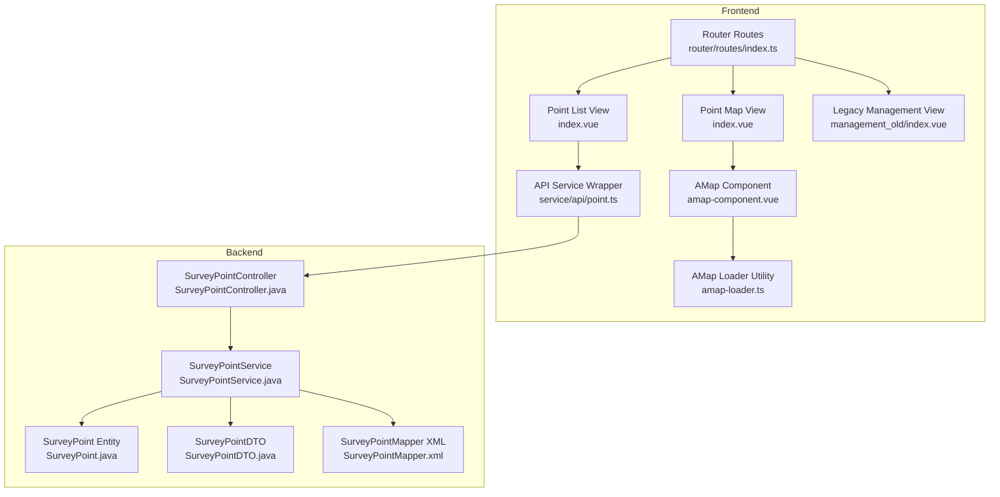
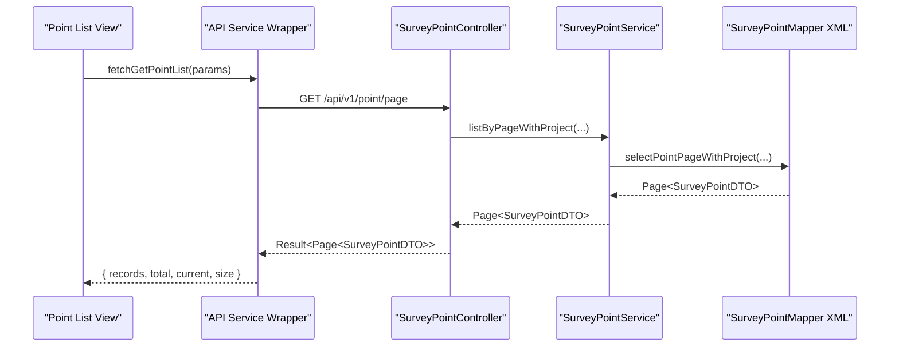
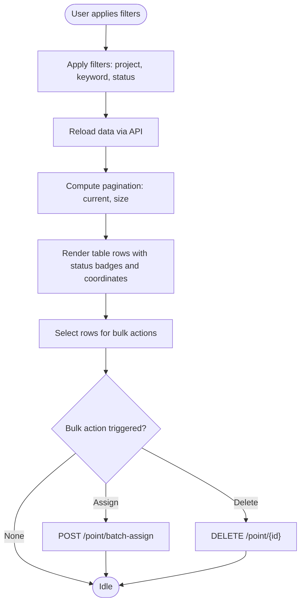
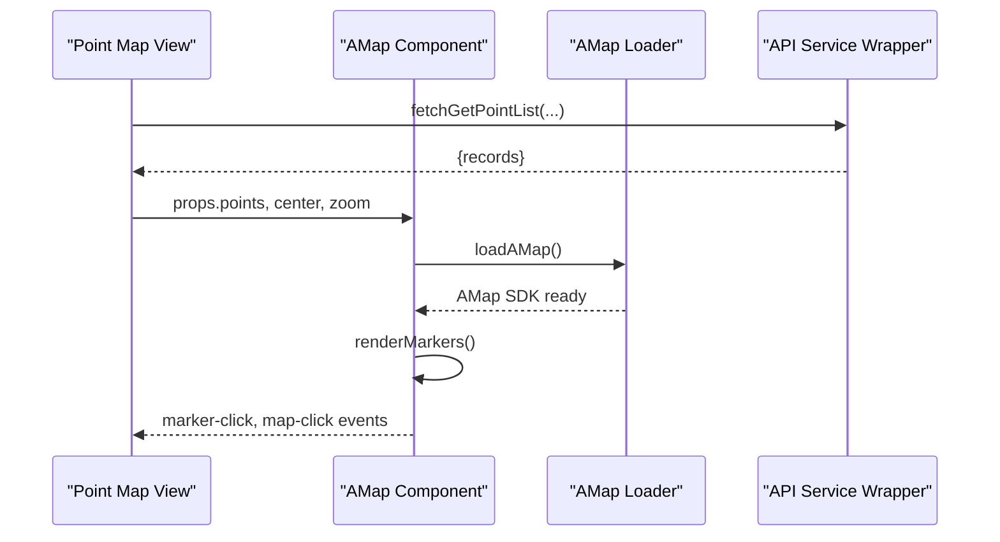
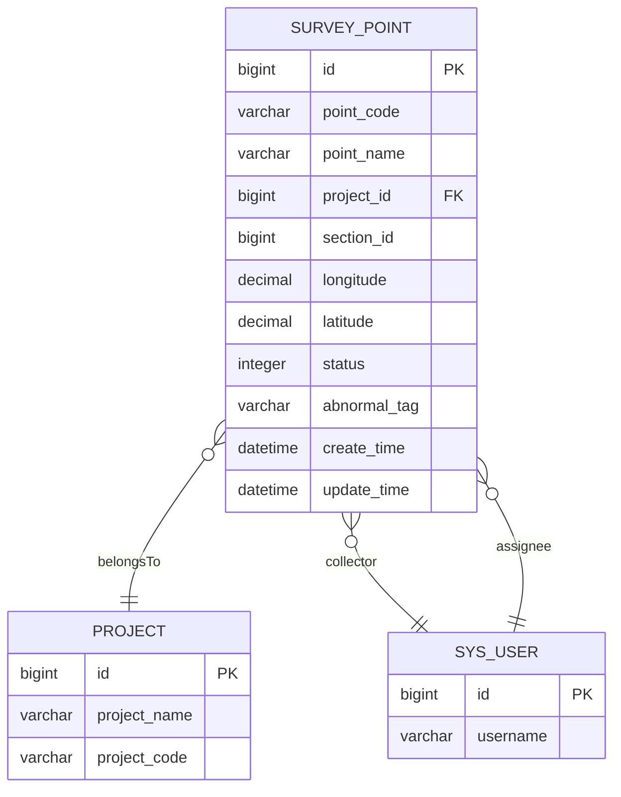
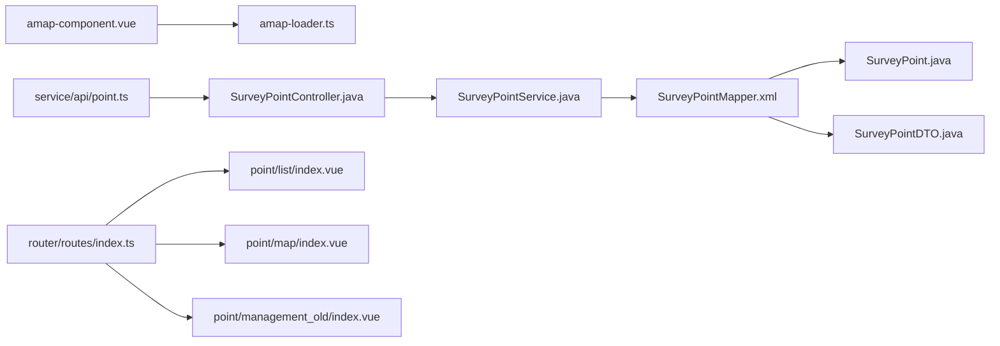

# Survey Point Management Interface

<cite>
**Referenced Files in This Document**
- [index.vue](file://admin-web-soybean/src/views/point/list/index.vue)
- [index.vue](file://admin-web-soybean/src/views/point/map/index.vue)
- [index.vue](file://admin-web-soybean/src/views/point/management_old/index.vue)
- [amap-component.vue](file://admin-web-soybean/src/components/custom/amap-component.vue)
- [amap-loader.ts](file://admin-web-soybean/src/utils/amap-loader.ts)
- [point.ts](file://admin-web-soybean/src/service/api/point.ts)
- [SurveyPointController.java](file://admin-backend/src/main/java/com/qhiot/survey/controller/SurveyPointController.java)
- [SurveyPoint.java](file://admin-backend/src/main/java/com/qhiot/survey/entity/SurveyPoint.java)
- [SurveyPointDTO.java](file://admin-backend/src/main/java/com/qhiot/survey/dto/SurveyPointDTO.java)
- [SurveyPointMapper.xml](file://admin-backend/src/main/resources/mapper/SurveyPointMapper.xml)
- [SurveyPointService.java](file://admin-backend/src/main/java/com/qhiot/survey/service/SurveyPointService.java)
- [PointList.vue](file://admin-web-soybean/src/views/migration/PointList.vue)
- [index.ts](file://admin-web-soybean/src/router/routes/index.ts)
</cite>

## Table of Contents
1. [Introduction](#introduction)
2. [Project Structure](#project-structure)
3. [Core Components](#core-components)
4. [Architecture Overview](#architecture-overview)
5. [Detailed Component Analysis](#detailed-component-analysis)
6. [Dependency Analysis](#dependency-analysis)
7. [Performance Considerations](#performance-considerations)
8. [Troubleshooting Guide](#troubleshooting-guide)
9. [Conclusion](#conclusion)

## Introduction
This document describes the survey point management interface, covering the modern point list view with filtering, sorting, pagination, and bulk operations; the integrated GIS map interface with GPS coordinates and spatial visualization; the legacy management interface for backward compatibility; and the integration with Google Maps API via a high-level wrapper. It also documents point status indicators, location-based filtering, batch actions, coordinate handling, spatial queries, responsive design, and accessibility features for data table navigation.

## Project Structure
The survey point management interface spans both frontend and backend:
- Frontend Vue components under admin-web-soybean implement the list, map, and legacy views, along with a reusable AMap component and API service wrappers.
- Backend Java controllers, services, entities, DTOs, and MyBatis mapper handle data retrieval, filtering, pagination, and spatial-related queries.

**Diagram sources**
- [index.vue:1-506](file://admin-web-soybean/src/views/point/list/index.vue#L1-L506)
- [index.vue:1-1124](file://admin-web-soybean/src/views/point/map/index.vue#L1-L1124)
- [index.vue:1-281](file://admin-web-soybean/src/views/point/management_old/index.vue#L1-L281)
- [amap-component.vue:1-388](file://admin-web-soybean/src/components/custom/amap-component.vue#L1-L388)
- [amap-loader.ts:1-103](file://admin-web-soybean/src/utils/amap-loader.ts#L1-L103)
- [point.ts:1-84](file://admin-web-soybean/src/service/api/point.ts#L1-L84)
- [SurveyPointController.java:1-142](file://admin-backend/src/main/java/com/qhiot/survey/controller/SurveyPointController.java#L1-L142)
- [SurveyPointService.java:1-79](file://admin-backend/src/main/java/com/qhiot/survey/service/SurveyPointService.java#L1-L79)
- [SurveyPoint.java:1-84](file://admin-backend/src/main/java/com/qhiot/survey/entity/SurveyPoint.java#L1-L84)
- [SurveyPointDTO.java:1-49](file://admin-backend/src/main/java/com/qhiot/survey/dto/SurveyPointDTO.java#L1-L49)
- [SurveyPointMapper.xml:1-51](file://admin-backend/src/main/resources/mapper/SurveyPointMapper.xml#L1-L51)
- [index.ts:1-245](file://admin-web-soybean/src/router/routes/index.ts#L1-L245)

**Section sources**
- [index.vue:1-506](file://admin-web-soybean/src/views/point/list/index.vue#L1-L506)
- [index.vue:1-1124](file://admin-web-soybean/src/views/point/map/index.vue#L1-L1124)
- [index.vue:1-281](file://admin-web-soybean/src/views/point/management_old/index.vue#L1-L281)
- [amap-component.vue:1-388](file://admin-web-soybean/src/components/custom/amap-component.vue#L1-L388)
- [amap-loader.ts:1-103](file://admin-web-soybean/src/utils/amap-loader.ts#L1-L103)
- [point.ts:1-84](file://admin-web-soybean/src/service/api/point.ts#L1-L84)
- [SurveyPointController.java:1-142](file://admin-backend/src/main/java/com/qhiot/survey/controller/SurveyPointController.java#L1-L142)
- [SurveyPointService.java:1-79](file://admin-backend/src/main/java/com/qhiot/survey/service/SurveyPointService.java#L1-L79)
- [SurveyPoint.java:1-84](file://admin-backend/src/main/java/com/qhiot/survey/entity/SurveyPoint.java#L1-L84)
- [SurveyPointDTO.java:1-49](file://admin-backend/src/main/java/com/qhiot/survey/dto/SurveyPointDTO.java#L1-L49)
- [SurveyPointMapper.xml:1-51](file://admin-backend/src/main/resources/mapper/SurveyPointMapper.xml#L1-L51)
- [index.ts:1-245](file://admin-web-soybean/src/router/routes/index.ts#L1-L245)

## Core Components
- Point List View: Provides filtering by project, keyword, and status; pagination; selection for bulk actions; and a summary card bar. Coordinates are displayed in a mono-spaced format, and status badges reflect point lifecycle stages.
- Integrated Map View: Offers a dual-pane layout with a point list sidebar and a map canvas. Supports zoom controls, legend, and clustering for dense markers. Clicking a marker or list item focuses the map on the selected point.
- Legacy Management Interface: A simplified, static view for backward compatibility, featuring project filters, status toggles, and a basic table with pagination.
- AMap Component: A reusable wrapper that dynamically loads the AMap SDK, renders point markers with status-specific colors, displays info windows, and supports clustering and fit-view operations.
- API Service Layer: Wraps backend endpoints for fetching point lists, details, creation, updates, deletion, batch assignment, and import.
- Backend Controllers and Services: Implement pagination, filtering, and spatial-aware queries, returning DTOs enriched with project and user metadata.

**Section sources**
- [index.vue:1-506](file://admin-web-soybean/src/views/point/list/index.vue#L1-L506)
- [index.vue:1-1124](file://admin-web-soybean/src/views/point/map/index.vue#L1-L1124)
- [index.vue:1-281](file://admin-web-soybean/src/views/point/management_old/index.vue#L1-L281)
- [amap-component.vue:1-388](file://admin-web-soybean/src/components/custom/amap-component.vue#L1-L388)
- [point.ts:1-84](file://admin-web-soybean/src/service/api/point.ts#L1-L84)
- [SurveyPointController.java:1-142](file://admin-backend/src/main/java/com/qhiot/survey/controller/SurveyPointController.java#L1-L142)
- [SurveyPointService.java:1-79](file://admin-backend/src/main/java/com/qhiot/survey/service/SurveyPointService.java#L1-L79)

## Architecture Overview
The interface follows a layered architecture:
- Presentation Layer: Vue components render the list and map views, manage filters, pagination, and selection state.
- Integration Layer: API service wrappers encapsulate HTTP requests to backend endpoints.
- Domain Layer: Backend controllers expose REST endpoints; services orchestrate data access and business logic.
- Persistence Layer: MyBatis mapper executes SQL queries with dynamic conditions for filtering and pagination.

**Diagram sources**
- [index.vue:354-374](file://admin-web-soybean/src/views/point/list/index.vue#L354-L374)
- [point.ts:4-17](file://admin-web-soybean/src/service/api/point.ts#L4-L17)
- [SurveyPointController.java:30-40](file://admin-backend/src/main/java/com/qhiot/survey/controller/SurveyPointController.java#L30-L40)
- [SurveyPointService.java:50-52](file://admin-backend/src/main/java/com/qhiot/survey/service/SurveyPointService.java#L50-L52)
- [SurveyPointMapper.xml:5-48](file://admin-backend/src/main/resources/mapper/SurveyPointMapper.xml#L5-L48)

## Detailed Component Analysis

### Point List View: Filtering, Sorting, Pagination, Bulk Operations
- Filtering: Supports project selection, keyword search across name/code, and status toggle buttons. Filters are applied client-side in the map view and server-side in the list view.
- Sorting: The backend endpoint accepts pagination parameters; sorting is not explicitly exposed in the current API wrapper.
- Pagination: Uses Ant Design Table with controlled pagination state; page size and current page trigger reloads.
- Bulk Operations: Selection state enables batch actions (e.g., assign, delete) with a visible counter and clear option.
- Status Indicators: Status badges use semantic colors and localized labels mapped from backend statuses.
- Coordinate Display: Coordinates are shown in a mono-spaced format for readability.
- Accessibility: Ant Design Table provides keyboard navigation and screen-reader-friendly markup.

**Diagram sources**
- [index.vue:354-374](file://admin-web-soybean/src/views/point/list/index.vue#L354-L374)
- [point.ts:53-60](file://admin-web-soybean/src/service/api/point.ts#L53-L60)

**Section sources**
- [index.vue:69-172](file://admin-web-soybean/src/views/point/list/index.vue#L69-L172)
- [point.ts:4-17](file://admin-web-soybean/src/service/api/point.ts#L4-L17)

### Integrated Map Interface: GPS Coordinates, Markers, Spatial Visualization
- Dual-Pane Layout: Left pane shows a filtered list of points; right pane displays the map with markers.
- Coordinate Handling: Points include longitude and latitude; displayed in info windows and list entries.
- Status-Based Markers: Markers use distinct colors per status; info windows show status text and coordinates.
- Clustering: Enabled for dense markers to improve performance and UX.
- Interaction: Clicking a marker or list item centers and zooms the map; zoom controls adjust map level.
- Legend: A legend explains status colors for quick interpretation.

**Diagram sources**
- [index.vue:175-214](file://admin-web-soybean/src/views/point/map/index.vue#L175-L214)
- [amap-component.vue:86-164](file://admin-web-soybean/src/components/custom/amap-component.vue#L86-L164)
- [amap-loader.ts:20-75](file://admin-web-soybean/src/utils/amap-loader.ts#L20-L75)
- [point.ts:4-17](file://admin-web-soybean/src/service/api/point.ts#L4-L17)

**Section sources**
- [index.vue:405-487](file://admin-web-soybean/src/views/point/map/index.vue#L405-L487)
- [amap-component.vue:169-218](file://admin-web-soybean/src/components/custom/amap-component.vue#L169-L218)
- [amap-loader.ts:1-103](file://admin-web-soybean/src/utils/amap-loader.ts#L1-L103)

### Legacy Management Interface: Backward Compatibility and Migration
- Purpose: Provides a simplified, static view for legacy workflows during migration.
- Features: Project filters, status toggles, keyword search, and a basic table with pagination.
- Migration Path: Encourages adoption of the modern list and map views while maintaining access to legacy UI.

**Section sources**
- [index.vue:1-281](file://admin-web-soybean/src/views/point/management_old/index.vue#L1-L281)
- [PointList.vue:1-163](file://admin-web-soybean/src/views/migration/PointList.vue#L1-L163)

### Backend Data Model and Queries
- Entities and DTOs: The entity holds core attributes including coordinates and status; the DTO enriches with project and user metadata for rendering.
- Mapper: Implements dynamic filtering by project, section, keyword, and status; orders by creation time.
- Controller: Exposes endpoints for paginated list retrieval, creation, update, deletion, batch assignment, and import.

**Diagram sources**
- [SurveyPoint.java:1-84](file://admin-backend/src/main/java/com/qhiot/survey/entity/SurveyPoint.java#L1-L84)
- [SurveyPointDTO.java:1-49](file://admin-backend/src/main/java/com/qhiot/survey/dto/SurveyPointDTO.java#L1-L49)
- [SurveyPointMapper.xml:23-32](file://admin-backend/src/main/resources/mapper/SurveyPointMapper.xml#L23-L32)

**Section sources**
- [SurveyPoint.java:1-84](file://admin-backend/src/main/java/com/qhiot/survey/entity/SurveyPoint.java#L1-L84)
- [SurveyPointDTO.java:1-49](file://admin-backend/src/main/java/com/qhiot/survey/dto/SurveyPointDTO.java#L1-L49)
- [SurveyPointMapper.xml:1-51](file://admin-backend/src/main/resources/mapper/SurveyPointMapper.xml#L1-L51)
- [SurveyPointController.java:30-40](file://admin-backend/src/main/java/com/qhiot/survey/controller/SurveyPointController.java#L30-L40)

### Responsive Design and Accessibility
- Responsive Layout: Both list and map views adapt to varying screen sizes using flexible containers and grid layouts.
- Accessibility: Ant Design Table provides built-in accessibility features including keyboard navigation, focus management, and screen-reader support for interactive elements.

**Section sources**
- [index.vue:108-254](file://admin-web-soybean/src/views/point/list/index.vue#L108-L254)
- [index.vue:696-701](file://admin-web-soybean/src/views/point/map/index.vue#L696-L701)

## Dependency Analysis
- Frontend Dependencies:
  - AMap Component depends on the AMap loader utility for SDK initialization.
  - API service wrapper depends on backend controller endpoints.
  - Views depend on router configuration for navigation.
- Backend Dependencies:
  - Controller depends on service interface.
  - Service depends on mapper XML for SQL execution.
  - Mapper depends on entity and DTO classes.

**Diagram sources**
- [amap-component.vue:33-34](file://admin-web-soybean/src/components/custom/amap-component.vue#L33-L34)
- [amap-loader.ts:1-103](file://admin-web-soybean/src/utils/amap-loader.ts#L1-L103)
- [point.ts:1-84](file://admin-web-soybean/src/service/api/point.ts#L1-L84)
- [SurveyPointController.java:1-142](file://admin-backend/src/main/java/com/qhiot/survey/controller/SurveyPointController.java#L1-L142)
- [SurveyPointService.java:1-79](file://admin-backend/src/main/java/com/qhiot/survey/service/SurveyPointService.java#L1-L79)
- [SurveyPointMapper.xml:1-51](file://admin-backend/src/main/resources/mapper/SurveyPointMapper.xml#L1-L51)
- [SurveyPoint.java:1-84](file://admin-backend/src/main/java/com/qhiot/survey/entity/SurveyPoint.java#L1-L84)
- [SurveyPointDTO.java:1-49](file://admin-backend/src/main/java/com/qhiot/survey/dto/SurveyPointDTO.java#L1-L49)
- [index.ts:1-245](file://admin-web-soybean/src/router/routes/index.ts#L1-L245)

**Section sources**
- [index.ts:11-22](file://admin-web-soybean/src/router/routes/index.ts#L11-L22)
- [amap-component.vue:33-34](file://admin-web-soybean/src/components/custom/amap-component.vue#L33-L34)
- [point.ts:1-84](file://admin-web-soybean/src/service/api/point.ts#L1-L84)
- [SurveyPointController.java:1-142](file://admin-backend/src/main/java/com/qhiot/survey/controller/SurveyPointController.java#L1-L142)
- [SurveyPointMapper.xml:1-51](file://admin-backend/src/main/resources/mapper/SurveyPointMapper.xml#L1-L51)

## Performance Considerations
- Map Rendering: Enable clustering for dense datasets to reduce DOM nodes and improve interactivity.
- Pagination: Prefer server-side pagination to limit payload sizes and improve responsiveness.
- Filtering: Apply filters on the backend to minimize client-side computation and rendering overhead.
- Lazy Initialization: The AMap loader initializes only when needed, reducing initial bundle size.

[No sources needed since this section provides general guidance]

## Troubleshooting Guide
- Map Loading Failures: Verify the API key and network connectivity; the loader utility reports errors and exposes a retry mechanism.
- Data Fetch Errors: Inspect API responses and error messages; the frontend surfaces user-friendly notifications.
- Pagination Issues: Ensure pagination parameters are correctly passed to the backend endpoint.

**Section sources**
- [amap-loader.ts:63-68](file://admin-web-soybean/src/utils/amap-loader.ts#L63-L68)
- [amap-component.vue:158-163](file://admin-web-soybean/src/components/custom/amap-component.vue#L158-L163)
- [point.ts:4-17](file://admin-web-soybean/src/service/api/point.ts#L4-L17)

## Conclusion
The survey point management interface combines a modern list view with robust filtering and bulk operations, an integrated map view with spatial visualization and clustering, and a legacy interface for backward compatibility. The frontend leverages a reusable AMap component and API service wrappers, while the backend provides efficient pagination, filtering, and DTO enrichment. Together, these components deliver a responsive, accessible, and scalable solution for managing survey points with GPS coordinates and status-driven workflows.