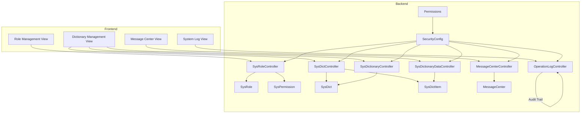
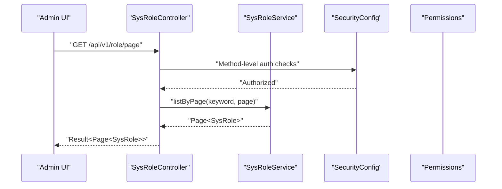
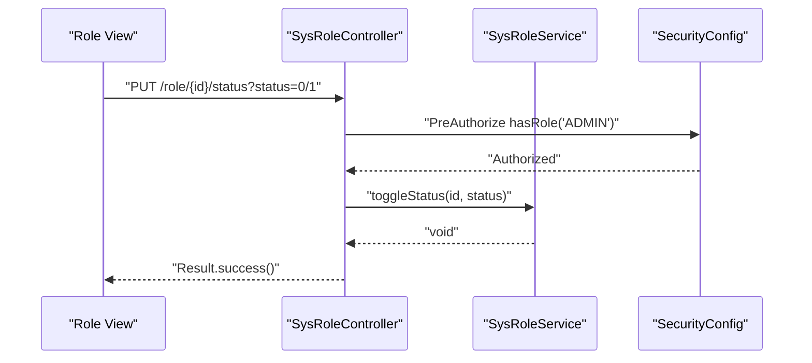
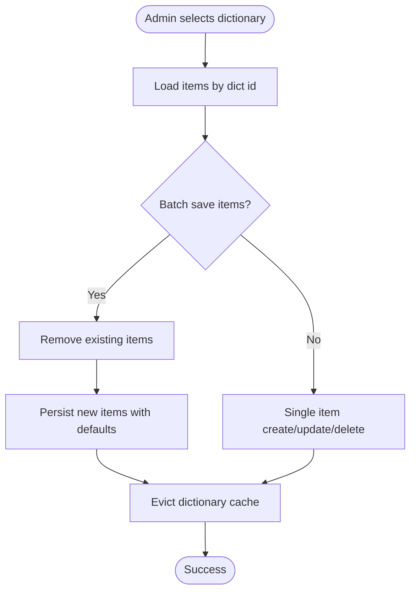
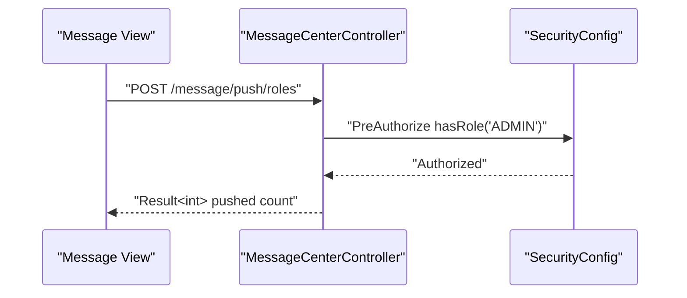
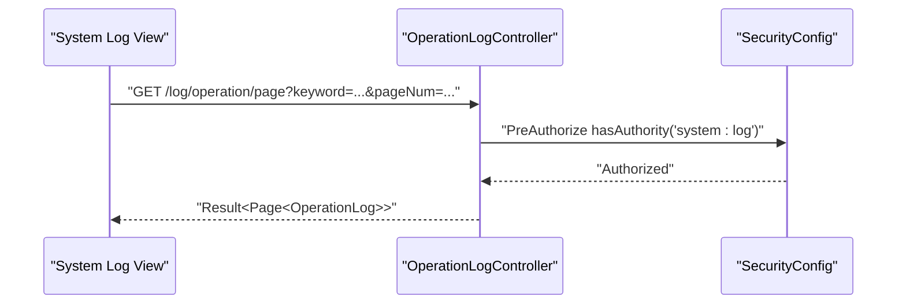
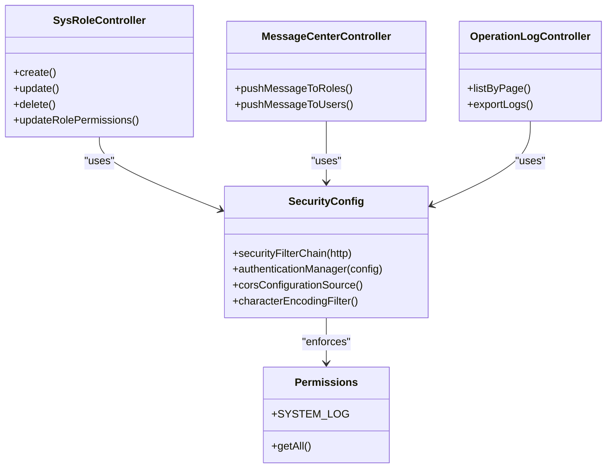
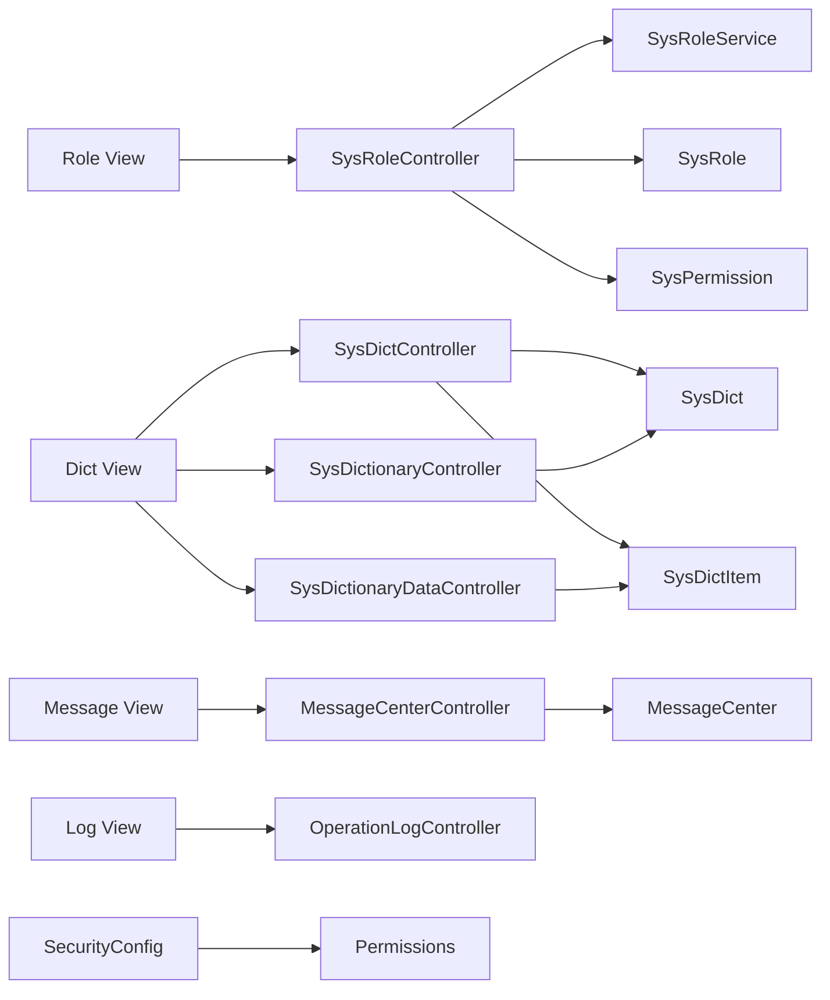

# System Administration Interface

<cite>
**Referenced Files in This Document**
- [SysRoleController.java](file://admin-backend/src/main/java/com/qhiot/survey/controller/SysRoleController.java)
- [SysDictController.java](file://admin-backend/src/main/java/com/qhiot/survey/controller/SysDictController.java)
- [SysDictionaryController.java](file://admin-backend/src/main/java/com/qhiot/survey/controller/SysDictionaryController.java)
- [SysDictionaryDataController.java](file://admin-backend/src/main/java/com/qhiot/survey/controller/SysDictionaryDataController.java)
- [MessageCenterController.java](file://admin-backend/src/main/java/com/qhiot/survey/controller/MessageCenterController.java)
- [OperationLogController.java](file://admin-backend/src/main/java/com/qhiot/survey/controller/OperationLogController.java)
- [SecurityConfig.java](file://admin-backend/src/main/java/com/qhiot/survey/security/SecurityConfig.java)
- [Permissions.java](file://admin-backend/src/main/java/com/qhiot/survey/common/constant/Permissions.java)
- [SysRoleService.java](file://admin-backend/src/main/java/com/qhiot/survey/service/SysRoleService.java)
- [SysRole.java](file://admin-backend/src/main/java/com/qhiot/survey/entity/SysRole.java)
- [SysPermission.java](file://admin-backend/src/main/java/com/qhiot/survey/entity/SysPermission.java)
- [SysDict.java](file://admin-backend/src/main/java/com/qhiot/survey/entity/SysDict.java)
- [SysDictItem.java](file://admin-backend/src/main/java/com/qhiot/survey/entity/SysDictItem.java)
- [MessageCenter.java](file://admin-backend/src/main/java/com/qhiot/survey/entity/MessageCenter.java)
- [index.vue (Role Management)](file://admin-web-soybean/src/views/system/role/index.vue)
- [index.vue (Dictionary Management)](file://admin-web-soybean/src/views/system/dict/index.vue)
- [index.vue (Message Center)](file://admin-web-soybean/src/views/system/message/index.vue)
- [index.vue (System Log)](file://admin-web-soybean/src/views/system/log/index.vue)
</cite>

## Table of Contents
1. [Introduction](#introduction)
2. [Project Structure](#project-structure)
3. [Core Components](#core-components)
4. [Architecture Overview](#architecture-overview)
5. [Detailed Component Analysis](#detailed-component-analysis)
6. [Dependency Analysis](#dependency-analysis)
7. [Performance Considerations](#performance-considerations)
8. [Troubleshooting Guide](#troubleshooting-guide)
9. [Conclusion](#conclusion)
10. [Appendices](#appendices)

## Introduction
This document describes the system administration interface of the Survey Application, focusing on:
- Role management with permission assignment, role hierarchy, and access control configuration
- Dictionary management for system-wide configuration data and lookup tables
- Message center for system notifications, announcements, and user communications
- System log interface with audit trails, error monitoring, and activity tracking
- Help system integration and administrative dashboard components
- Security considerations and access controls for administrative functions

It provides practical examples of permission inheritance, dictionary item management, and notification workflows, along with diagrams and references to the relevant backend controllers and frontend views.

## Project Structure
The administration interface spans two primary modules:
- Backend (Spring Boot): Controllers, services, entities, security configuration, and permission constants
- Frontend (Vue + Soybean Admin): Views and components for role, dictionary, message, and log administration

**Diagram sources**
- [SysRoleController.java:21-137](file://admin-backend/src/main/java/com/qhiot/survey/controller/SysRoleController.java#L21-L137)
- [SysDictController.java:24-195](file://admin-backend/src/main/java/com/qhiot/survey/controller/SysDictController.java#L24-L195)
- [SysDictionaryController.java:20-97](file://admin-backend/src/main/java/com/qhiot/survey/controller/SysDictionaryController.java#L20-L97)
- [SysDictionaryDataController.java:17-100](file://admin-backend/src/main/java/com/qhiot/survey/controller/SysDictionaryDataController.java#L17-L100)
- [MessageCenterController.java:20-112](file://admin-backend/src/main/java/com/qhiot/survey/controller/MessageCenterController.java#L20-L112)
- [OperationLogController.java:19-87](file://admin-backend/src/main/java/com/qhiot/survey/controller/OperationLogController.java#L19-L87)
- [SecurityConfig.java:25-98](file://admin-backend/src/main/java/com/qhiot/survey/security/SecurityConfig.java#L25-L98)
- [Permissions.java:3-80](file://admin-backend/src/main/java/com/qhiot/survey/common/constant/Permissions.java#L3-L80)
- [SysRole.java:10-39](file://admin-backend/src/main/java/com/qhiot/survey/entity/SysRole.java#L10-L39)
- [SysPermission.java:11-55](file://admin-backend/src/main/java/com/qhiot/survey/entity/SysPermission.java#L11-L55)
- [SysDict.java:11-59](file://admin-backend/src/main/java/com/qhiot/survey/entity/SysDict.java#L11-L59)
- [SysDictItem.java:11-73](file://admin-backend/src/main/java/com/qhiot/survey/entity/SysDictItem.java#L11-L73)
- [MessageCenter.java:10-48](file://admin-backend/src/main/java/com/qhiot/survey/entity/MessageCenter.java#L10-L48)
- [index.vue (Role Management):1-396](file://admin-web-soybean/src/views/system/role/index.vue#L1-L396)
- [index.vue (Dictionary Management):1-358](file://admin-web-soybean/src/views/system/dict/index.vue#L1-L358)
- [index.vue (Message Center):1-271](file://admin-web-soybean/src/views/system/message/index.vue#L1-L271)
- [index.vue (System Log):1-464](file://admin-web-soybean/src/views/system/log/index.vue#L1-L464)

**Section sources**
- [SysRoleController.java:21-137](file://admin-backend/src/main/java/com/qhiot/survey/controller/SysRoleController.java#L21-L137)
- [SysDictController.java:24-195](file://admin-backend/src/main/java/com/qhiot/survey/controller/SysDictController.java#L24-L195)
- [SysDictionaryController.java:20-97](file://admin-backend/src/main/java/com/qhiot/survey/controller/SysDictionaryController.java#L20-L97)
- [SysDictionaryDataController.java:17-100](file://admin-backend/src/main/java/com/qhiot/survey/controller/SysDictionaryDataController.java#L17-L100)
- [MessageCenterController.java:20-112](file://admin-backend/src/main/java/com/qhiot/survey/controller/MessageCenterController.java#L20-L112)
- [OperationLogController.java:19-87](file://admin-backend/src/main/java/com/qhiot/survey/controller/OperationLogController.java#L19-L87)
- [SecurityConfig.java:25-98](file://admin-backend/src/main/java/com/qhiot/survey/security/SecurityConfig.java#L25-L98)
- [Permissions.java:3-80](file://admin-backend/src/main/java/com/qhiot/survey/common/constant/Permissions.java#L3-L80)
- [index.vue (Role Management):1-396](file://admin-web-soybean/src/views/system/role/index.vue#L1-L396)
- [index.vue (Dictionary Management):1-358](file://admin-web-soybean/src/views/system/dict/index.vue#L1-L358)
- [index.vue (Message Center):1-271](file://admin-web-soybean/src/views/system/message/index.vue#L1-L271)
- [index.vue (System Log):1-464](file://admin-web-soybean/src/views/system/log/index.vue#L1-L464)

## Core Components
- Role Management
  - Backend: REST endpoints for CRUD, status toggling, assigning roles to users, and updating role permissions
  - Frontend: Role list, creation/editing, status switch, and permission configuration modal
- Dictionary Management
  - Backend: Dictionary and dictionary item management with caching and batch operations
  - Frontend: Dictionary list with filtering, creation/editing, and dictionary item management modal
- Message Center
  - Backend: User-centric message listing, read/unread management, and admin push to roles/users
  - Frontend: Message list with type/status filters and actions
- System Log
  - Backend: Operation log queries, statistics, and export
  - Frontend: Filterable log table with action-type tags and date range
- Security and Access Control
  - Backend: JWT-based stateless security, CORS configuration, and method-level authorization via annotations and permission constants

**Section sources**
- [SysRoleController.java:30-130](file://admin-backend/src/main/java/com/qhiot/survey/controller/SysRoleController.java#L30-L130)
- [SysDictController.java:34-194](file://admin-backend/src/main/java/com/qhiot/survey/controller/SysDictController.java#L34-L194)
- [SysDictionaryController.java:28-89](file://admin-backend/src/main/java/com/qhiot/survey/controller/SysDictionaryController.java#L28-L89)
- [SysDictionaryDataController.java:28-99](file://admin-backend/src/main/java/com/qhiot/survey/controller/SysDictionaryDataController.java#L28-L99)
- [MessageCenterController.java:34-99](file://admin-backend/src/main/java/com/qhiot/survey/controller/MessageCenterController.java#L34-L99)
- [OperationLogController.java:30-86](file://admin-backend/src/main/java/com/qhiot/survey/controller/OperationLogController.java#L30-L86)
- [SecurityConfig.java:39-61](file://admin-backend/src/main/java/com/qhiot/survey/security/SecurityConfig.java#L39-L61)
- [Permissions.java:54-58](file://admin-backend/src/main/java/com/qhiot/survey/common/constant/Permissions.java#L54-L58)
- [index.vue (Role Management):47-206](file://admin-web-soybean/src/views/system/role/index.vue#L47-L206)
- [index.vue (Dictionary Management):75-206](file://admin-web-soybean/src/views/system/dict/index.vue#L75-L206)
- [index.vue (Message Center):1-271](file://admin-web-soybean/src/views/system/message/index.vue#L1-L271)
- [index.vue (System Log):1-464](file://admin-web-soybean/src/views/system/log/index.vue#L1-L464)

## Architecture Overview
The admin interface follows a layered architecture:
- Presentation Layer (Frontend): Vue views and components
- Application Layer (Backend): REST controllers exposing admin APIs
- Domain and Persistence Layers: Services and MyBatis-Plus mappers/entities

**Diagram sources**
- [SysRoleController.java:30-37](file://admin-backend/src/main/java/com/qhiot/survey/controller/SysRoleController.java#L30-L37)
- [SecurityConfig.java:47-56](file://admin-backend/src/main/java/com/qhiot/survey/security/SecurityConfig.java#L47-L56)
- [Permissions.java:54-58](file://admin-backend/src/main/java/com/qhiot/survey/common/constant/Permissions.java#L54-L58)
- [SysRoleService.java:14-17](file://admin-backend/src/main/java/com/qhiot/survey/service/SysRoleService.java#L14-L17)
- [index.vue (Role Management):48-75](file://admin-web-soybean/src/views/system/role/index.vue#L48-L75)

**Section sources**
- [SysRoleController.java:30-37](file://admin-backend/src/main/java/com/qhiot/survey/controller/SysRoleController.java#L30-L37)
- [SecurityConfig.java:47-56](file://admin-backend/src/main/java/com/qhiot/survey/security/SecurityConfig.java#L47-L56)
- [Permissions.java:54-58](file://admin-backend/src/main/java/com/qhiot/survey/common/constant/Permissions.java#L54-L58)
- [SysRoleService.java:14-17](file://admin-backend/src/main/java/com/qhiot/survey/service/SysRoleService.java#L14-L17)
- [index.vue (Role Management):48-75](file://admin-web-soybean/src/views/system/role/index.vue#L48-L75)

## Detailed Component Analysis

### Role Management Interface
- Responsibilities
  - Manage roles (create, update, delete, enable/disable)
  - Assign roles to users
  - Configure role permissions
  - Retrieve role and user role lists
- Key endpoints
  - GET /api/v1/role/page, GET /api/v1/role/list, GET /api/v1/role/{id}
  - POST /api/v1/role, PUT /api/v1/role/{id}, DELETE /api/v1/role/{id}
  - PUT /api/v1/role/{id}/status
  - POST /api/v1/role/assign
  - GET /api/v1/role/{id}/permissions, PUT /api/v1/role/{id}/permissions
  - GET /api/v1/role/user/{userId}
- Access control
  - Creation, update, deletion, and permission updates require ADMIN role
  - Status toggling requires ADMIN role
- Frontend behavior
  - Optimistic UI updates for status toggling with rollback on failure
  - Permission configuration modal bound to selected role

**Diagram sources**
- [SysRoleController.java:92-102](file://admin-backend/src/main/java/com/qhiot/survey/controller/SysRoleController.java#L92-L102)
- [SecurityConfig.java:47-56](file://admin-backend/src/main/java/com/qhiot/survey/security/SecurityConfig.java#L47-L56)
- [index.vue (Role Management):161-181](file://admin-web-soybean/src/views/system/role/index.vue#L161-L181)

**Section sources**
- [SysRoleController.java:30-130](file://admin-backend/src/main/java/com/qhiot/survey/controller/SysRoleController.java#L30-L130)
- [index.vue (Role Management):161-181](file://admin-web-soybean/src/views/system/role/index.vue#L161-L181)

### Dictionary Management System
- Responsibilities
  - Manage dictionaries (categories) and dictionary items (lookup values)
  - Batch save dictionary items
  - Refresh dictionary cache
  - Retrieve dictionary items by code or category
- Key endpoints
  - Dictionaries: GET /api/v1/dict/page, GET /api/v1/dict/enabled, GET /api/v1/dict/{id}
  - Create/Update/Delete dictionary
  - Items: GET /api/v1/dict/{id}/items, GET /api/v1/dict/code/{dictCode}/items
  - Batch save items: POST /api/v1/dict/{id}/items/batch
  - Categories: GET /api/v1/dictionary/page, GET /api/v1/dictionary/enabled, GET /api/v1/dictionary/{id}/items
  - Category data: GET /api/v1/dictionary/all, POST /api/v1/dictionary/refresh-cache
  - Item CRUD: GET/POST/PUT/DELETE /api/v1/dictionary-data/*
  - Item maps and lookups: GET /api/v1/dictionary-data/map/{dictCode}, GET /api/v1/dictionary-data/name/{dictCode}/{dataValue}, GET /api/v1/dictionary-data/value/{dictCode}/{dataName}
- Access control
  - Dictionary and items management require ADMIN role
- Frontend behavior
  - Dictionary list with search and pagination
  - Dictionary item management modal with batch operations

**Diagram sources**
- [SysDictController.java:163-194](file://admin-backend/src/main/java/com/qhiot/survey/controller/SysDictController.java#L163-L194)
- [SysDictionaryDataController.java:51-72](file://admin-backend/src/main/java/com/qhiot/survey/controller/SysDictionaryDataController.java#L51-L72)

**Section sources**
- [SysDictController.java:34-194](file://admin-backend/src/main/java/com/qhiot/survey/controller/SysDictController.java#L34-L194)
- [SysDictionaryController.java:28-89](file://admin-backend/src/main/java/com/qhiot/survey/controller/SysDictionaryController.java#L28-L89)
- [SysDictionaryDataController.java:28-99](file://admin-backend/src/main/java/com/qhiot/survey/controller/SysDictionaryDataController.java#L28-L99)
- [index.vue (Dictionary Management):75-206](file://admin-web-soybean/src/views/system/dict/index.vue#L75-L206)

### Message Center
- Responsibilities
  - List messages for the current user with type filtering
  - Mark messages as read (single or all)
  - Admin push messages to roles or specific users
  - Retrieve unread count
- Key endpoints
  - GET /api/v1/message/page, GET /api/v1/message/unread-count
  - PUT /api/v1/message/{messageId}/read, PUT /api/v1/message/read-all
  - GET /api/v1/message/{id}
  - POST /api/v1/message/push/roles, POST /api/v1/message/push/users
- Access control
  - User operations are user-scoped
  - Admin push requires ADMIN role
- Frontend behavior
  - Filter by type and status, search, and click to navigate to related content

**Diagram sources**
- [MessageCenterController.java:75-86](file://admin-backend/src/main/java/com/qhiot/survey/controller/MessageCenterController.java#L75-L86)
- [SecurityConfig.java:47-56](file://admin-backend/src/main/java/com/qhiot/survey/security/SecurityConfig.java#L47-L56)

**Section sources**
- [MessageCenterController.java:34-99](file://admin-backend/src/main/java/com/qhiot/survey/controller/MessageCenterController.java#L34-L99)
- [index.vue (Message Center):1-271](file://admin-web-soybean/src/views/system/message/index.vue#L1-L271)

### System Log Interface
- Responsibilities
  - Admin query operation logs with pagination and filters
  - Export logs to Excel
  - Statistics: by module, by user, by risk level, and trend over time
- Key endpoints
  - GET /api/v1/log/operation/page
  - GET /api/v1/log/operation/export
  - GET /api/v1/log/operation/statistics/module, /user, /risk-level, /trend
- Access control
  - Requires system:log authority
- Frontend behavior
  - Filter by action type, keyword, and date range; refresh and export

**Diagram sources**
- [OperationLogController.java:30-40](file://admin-backend/src/main/java/com/qhiot/survey/controller/OperationLogController.java#L30-L40)
- [SecurityConfig.java:47-56](file://admin-backend/src/main/java/com/qhiot/survey/security/SecurityConfig.java#L47-L56)

**Section sources**
- [OperationLogController.java:30-86](file://admin-backend/src/main/java/com/qhiot/survey/controller/OperationLogController.java#L30-L86)
- [index.vue (System Log):1-464](file://admin-web-soybean/src/views/system/log/index.vue#L1-L464)

### Security and Access Controls
- Authentication and Authorization
  - Stateless JWT filter integrated before Spring Security’s default filter
  - Public endpoints (auth, health, docs, actuator) permitted without authentication
  - Method-level security enforced via @PreAuthorize and @OperationLog annotations
- Permission Codes
  - Centralized permission constants for modules such as system:log
- Role-Based Access
  - Administrative operations restricted to ADMIN role
  - User-scoped operations validated against current user context

**Diagram sources**
- [SecurityConfig.java:39-61](file://admin-backend/src/main/java/com/qhiot/survey/security/SecurityConfig.java#L39-L61)
- [Permissions.java:54-58](file://admin-backend/src/main/java/com/qhiot/survey/common/constant/Permissions.java#L54-L58)
- [SysRoleController.java:51-84](file://admin-backend/src/main/java/com/qhiot/survey/controller/SysRoleController.java#L51-L84)
- [MessageCenterController.java:75-99](file://admin-backend/src/main/java/com/qhiot/survey/controller/MessageCenterController.java#L75-L99)
- [OperationLogController.java:30-46](file://admin-backend/src/main/java/com/qhiot/survey/controller/OperationLogController.java#L30-L46)

**Section sources**
- [SecurityConfig.java:39-61](file://admin-backend/src/main/java/com/qhiot/survey/security/SecurityConfig.java#L39-L61)
- [Permissions.java:54-58](file://admin-backend/src/main/java/com/qhiot/survey/common/constant/Permissions.java#L54-L58)
- [SysRoleController.java:51-84](file://admin-backend/src/main/java/com/qhiot/survey/controller/SysRoleController.java#L51-L84)
- [MessageCenterController.java:75-99](file://admin-backend/src/main/java/com/qhiot/survey/controller/MessageCenterController.java#L75-L99)
- [OperationLogController.java:30-46](file://admin-backend/src/main/java/com/qhiot/survey/controller/OperationLogController.java#L30-L46)

## Dependency Analysis
- Controllers depend on services and entities
- Frontend views call backend endpoints and render results
- Security configuration centralizes CORS and method-level authorization
- Permission constants define the canonical set of authorities used across the system

**Diagram sources**
- [SysRoleController.java:27-28](file://admin-backend/src/main/java/com/qhiot/survey/controller/SysRoleController.java#L27-L28)
- [SysDictController.java:31-32](file://admin-backend/src/main/java/com/qhiot/survey/controller/SysDictController.java#L31-L32)
- [SysDictionaryController.java:25-26](file://admin-backend/src/main/java/com/qhiot/survey/controller/SysDictionaryController.java#L25-L26)
- [SysDictionaryDataController.java:25-26](file://admin-backend/src/main/java/com/qhiot/survey/controller/SysDictionaryDataController.java#L25-L26)
- [MessageCenterController.java:28-32](file://admin-backend/src/main/java/com/qhiot/survey/controller/MessageCenterController.java#L28-L32)
- [OperationLogController.java:27-28](file://admin-backend/src/main/java/com/qhiot/survey/controller/OperationLogController.java#L27-L28)
- [SysRoleService.java:12-63](file://admin-backend/src/main/java/com/qhiot/survey/service/SysRoleService.java#L12-L63)
- [SysRole.java:14-39](file://admin-backend/src/main/java/com/qhiot/survey/entity/SysRole.java#L14-L39)
- [SysPermission.java:14-55](file://admin-backend/src/main/java/com/qhiot/survey/entity/SysPermission.java#L14-L55)
- [SysDict.java:14-59](file://admin-backend/src/main/java/com/qhiot/survey/entity/SysDict.java#L14-L59)
- [SysDictItem.java:14-73](file://admin-backend/src/main/java/com/qhiot/survey/entity/SysDictItem.java#L14-L73)
- [MessageCenter.java:13-48](file://admin-backend/src/main/java/com/qhiot/survey/entity/MessageCenter.java#L13-L48)
- [SecurityConfig.java:39-61](file://admin-backend/src/main/java/com/qhiot/survey/security/SecurityConfig.java#L39-L61)
- [Permissions.java:54-58](file://admin-backend/src/main/java/com/qhiot/survey/common/constant/Permissions.java#L54-L58)

**Section sources**
- [SysRoleController.java:27-28](file://admin-backend/src/main/java/com/qhiot/survey/controller/SysRoleController.java#L27-L28)
- [SysDictController.java:31-32](file://admin-backend/src/main/java/com/qhiot/survey/controller/SysDictController.java#L31-L32)
- [SysDictionaryController.java:25-26](file://admin-backend/src/main/java/com/qhiot/survey/controller/SysDictionaryController.java#L25-L26)
- [SysDictionaryDataController.java:25-26](file://admin-backend/src/main/java/com/qhiot/survey/controller/SysDictionaryDataController.java#L25-L26)
- [MessageCenterController.java:28-32](file://admin-backend/src/main/java/com/qhiot/survey/controller/MessageCenterController.java#L28-L32)
- [OperationLogController.java:27-28](file://admin-backend/src/main/java/com/qhiot/survey/controller/OperationLogController.java#L27-L28)
- [SysRoleService.java:12-63](file://admin-backend/src/main/java/com/qhiot/survey/service/SysRoleService.java#L12-L63)
- [SysRole.java:14-39](file://admin-backend/src/main/java/com/qhiot/survey/entity/SysRole.java#L14-L39)
- [SysPermission.java:14-55](file://admin-backend/src/main/java/com/qhiot/survey/entity/SysPermission.java#L14-L55)
- [SysDict.java:14-59](file://admin-backend/src/main/java/com/qhiot/survey/entity/SysDict.java#L14-L59)
- [SysDictItem.java:14-73](file://admin-backend/src/main/java/com/qhiot/survey/entity/SysDictItem.java#L14-L73)
- [MessageCenter.java:13-48](file://admin-backend/src/main/java/com/qhiot/survey/entity/MessageCenter.java#L13-L48)
- [SecurityConfig.java:39-61](file://admin-backend/src/main/java/com/qhiot/survey/security/SecurityConfig.java#L39-L61)
- [Permissions.java:54-58](file://admin-backend/src/main/java/com/qhiot/survey/common/constant/Permissions.java#L54-L58)

## Performance Considerations
- Pagination
  - All list endpoints support pagination to avoid large payloads
- Caching
  - Dictionary cache eviction after create/update/delete/batch operations to ensure immediate consistency
- Export
  - Operation log export supports server-side generation and streaming response headers
- UI responsiveness
  - Optimistic updates for role status toggling reduce perceived latency; rollback on failure

[No sources needed since this section provides general guidance]

## Troubleshooting Guide
- Role Management
  - If enabling/disabling a role fails, the UI reverts the change due to optimistic updates; retry after verifying backend logs
  - Permission updates require ADMIN role; ensure the current user has ADMIN
- Dictionary Management
  - Batch save clears existing items before writing new ones; verify dictCode and status defaults are applied
  - Cache refresh ensures immediate visibility of changes
- Message Center
  - Admin push requires ADMIN role; verify role assignment
  - Unread counts reflect current user context; ensure correct user is authenticated
- System Log
  - Statistics endpoints require system:log authority; verify permissions
  - Export generates an Excel attachment; confirm browser download settings

**Section sources**
- [SysRoleController.java:92-102](file://admin-backend/src/main/java/com/qhiot/survey/controller/SysRoleController.java#L92-L102)
- [SysDictController.java:163-194](file://admin-backend/src/main/java/com/qhiot/survey/controller/SysDictController.java#L163-L194)
- [MessageCenterController.java:75-99](file://admin-backend/src/main/java/com/qhiot/survey/controller/MessageCenterController.java#L75-L99)
- [OperationLogController.java:30-46](file://admin-backend/src/main/java/com/qhiot/survey/controller/OperationLogController.java#L30-L46)

## Conclusion
The system administration interface provides robust capabilities for managing roles, dictionaries, messages, and operational logs. It enforces strict access controls via method-level security and centralized permission constants, while offering responsive UI interactions and efficient data management workflows. Administrators can configure permissions, maintain system-wide lookup tables, monitor activities, and communicate with users effectively.

[No sources needed since this section summarizes without analyzing specific files]

## Appendices

### Examples Index
- Permission inheritance
  - Roles inherit permissions configured via role permission endpoints
  - Example path: [SysRoleController.java:115-130](file://admin-backend/src/main/java/com/qhiot/survey/controller/SysRoleController.java#L115-L130)
- Dictionary item management
  - Batch save items under a dictionary; cache evicted automatically
  - Example path: [SysDictController.java:163-194](file://admin-backend/src/main/java/com/qhiot/survey/controller/SysDictController.java#L163-L194)
- Notification workflows
  - Admin pushes messages to roles/users; user marks as read
  - Example path: [MessageCenterController.java:75-99](file://admin-backend/src/main/java/com/qhiot/survey/controller/MessageCenterController.java#L75-L99)

**Section sources**
- [SysRoleController.java:115-130](file://admin-backend/src/main/java/com/qhiot/survey/controller/SysRoleController.java#L115-L130)
- [SysDictController.java:163-194](file://admin-backend/src/main/java/com/qhiot/survey/controller/SysDictController.java#L163-L194)
- [MessageCenterController.java:75-99](file://admin-backend/src/main/java/com/qhiot/survey/controller/MessageCenterController.java#L75-L99)