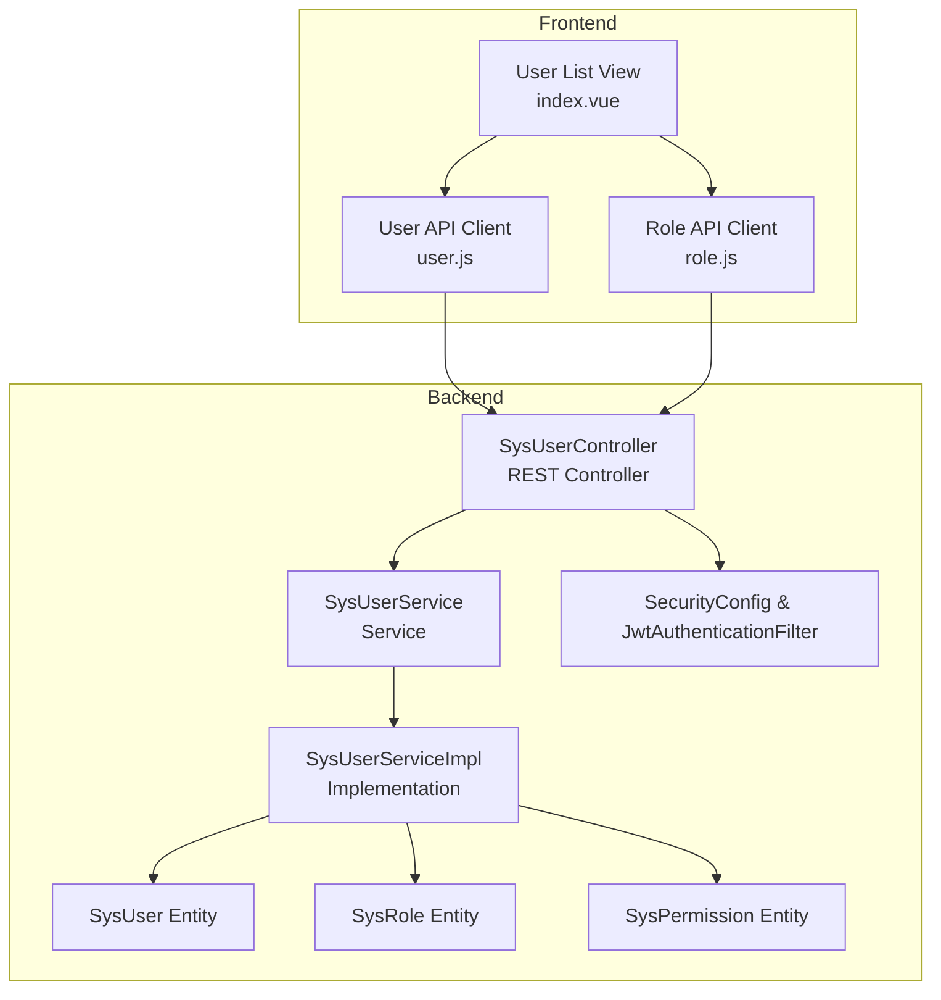
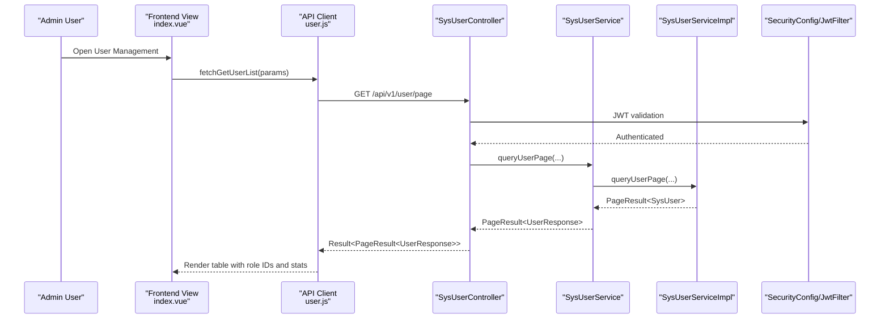
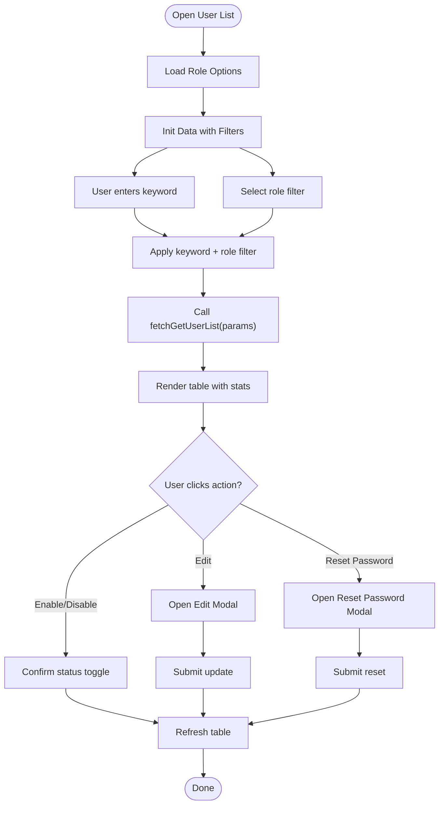
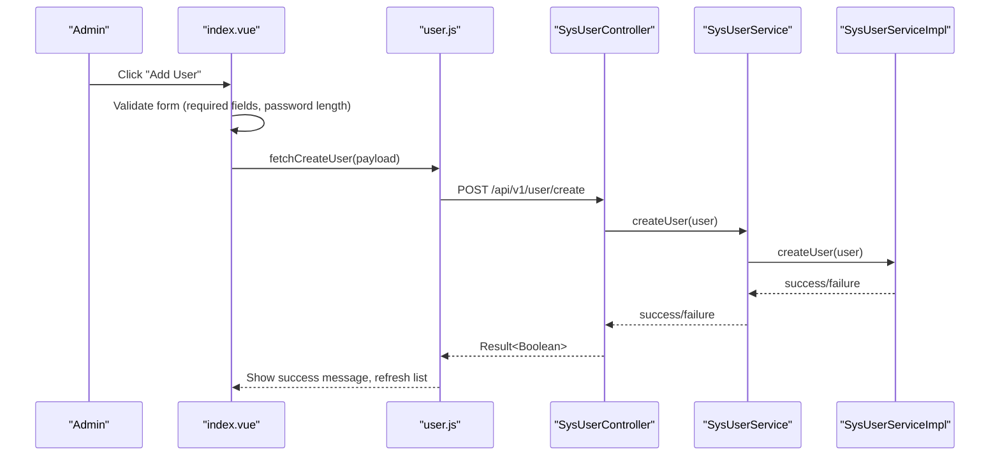
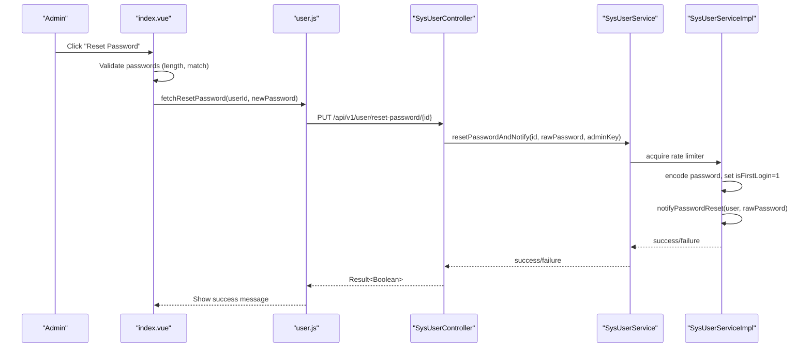
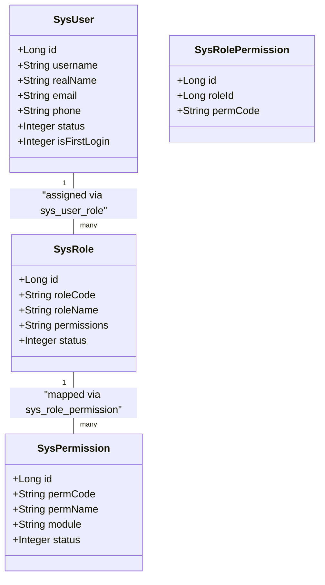
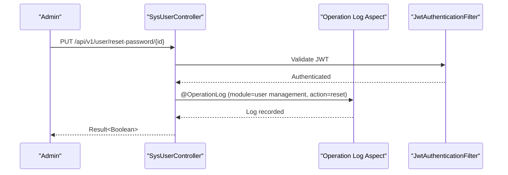
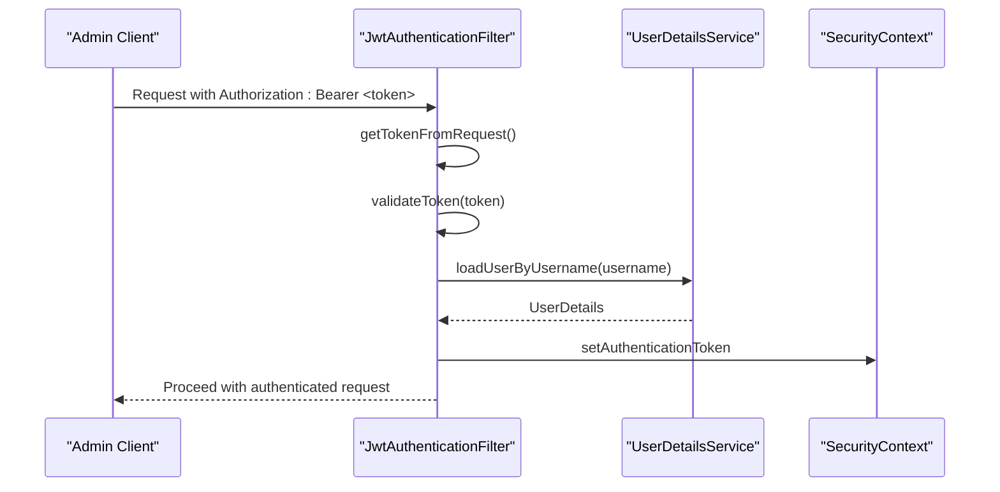
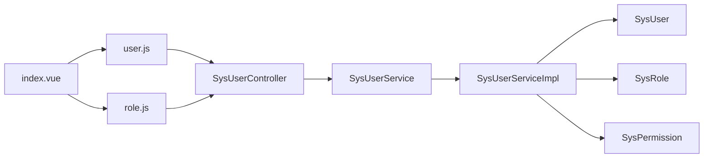

# User Management Interface

<cite>
**Referenced Files in This Document**
- [index.vue](file://admin-web-soybean/src/views/system/user/index.vue)
- [UserManagement.vue](file://admin-web-soybean/src/views/migration/UserManagement.vue)
- [user.js](file://admin-web-soybean/src/api/user.js)
- [role.js](file://admin-web-soybean/src/api/role.js)
- [SysUserController.java](file://admin-backend/src/main/java/com/qhiot/survey/controller/SysUserController.java)
- [SysUserService.java](file://admin-backend/src/main/java/com/qhiot/survey/service/SysUserService.java)
- [SysUserServiceImpl.java](file://admin-backend/src/main/java/com/qhiot/survey/service/impl/SysUserServiceImpl.java)
- [SysUser.java](file://admin-backend/src/main/java/com/qhiot/survey/entity/SysUser.java)
- [CreateUserRequest.java](file://admin-backend/src/main/java/com/qhiot/survey/dto/CreateUserRequest.java)
- [UpdateUserRequest.java](file://admin-backend/src/main/java/com/qhiot/survey/dto/UpdateUserRequest.java)
- [ChangePasswordRequest.java](file://admin-backend/src/main/java/com/qhiot/survey/dto/ChangePasswordRequest.java)
- [SysRole.java](file://admin-backend/src/main/java/com/qhiot/survey/entity/SysRole.java)
- [SysRolePermission.java](file://admin-backend/src/main/java/com/qhiot/survey/entity/SysRolePermission.java)
- [SysPermission.java](file://admin-backend/src/main/java/com/qhiot/survey/entity/SysPermission.java)
- [SecurityConfig.java](file://admin-backend/src/main/java/com/qhiot/survey/security/SecurityConfig.java)
- [JwtAuthenticationFilter.java](file://admin-backend/src/main/java/com/qhiot/survey/security/JwtAuthenticationFilter.java)
</cite>

## Table of Contents
1. [Introduction](#introduction)
2. [Project Structure](#project-structure)
3. [Core Components](#core-components)
4. [Architecture Overview](#architecture-overview)
5. [Detailed Component Analysis](#detailed-component-analysis)
6. [Dependency Analysis](#dependency-analysis)
7. [Performance Considerations](#performance-considerations)
8. [Troubleshooting Guide](#troubleshooting-guide)
9. [Conclusion](#conclusion)
10. [Appendices](#appendices)

## Introduction
This document describes the user management interface for administrators, covering the user list view, role-based filtering, status indicators, and activity monitoring. It also documents the user profile management interface for editing personal information, assigning roles, and managing account settings. The password change functionality is explained with validation rules, security requirements, and confirmation workflows. Examples of role assignment, permission management, and activity audit trails are included. The integration with authentication systems, session management, and user preferences is covered, along with responsive design patterns and accessibility features tailored for user administration tasks.

## Project Structure
The user management feature spans the frontend Vue application and the backend Spring Boot API:

- Frontend (admin-web-soybean):
  - User list view and modals for add/edit/reset-password actions
  - API clients for user and role operations
- Backend (admin-backend):
  - REST controllers for user CRUD, status updates, and password resets
  - Services for user operations, role assignment, and password notifications
  - Entities and DTOs representing users, roles, and permissions
  - Security configuration for JWT-based stateless authentication

**Diagram sources**
- [index.vue:1-586](file://admin-web-soybean/src/views/system/user/index.vue#L1-L586)
- [user.js:1-102](file://admin-web-soybean/src/api/user.js#L1-L102)
- [role.js:1-78](file://admin-web-soybean/src/api/role.js#L1-L78)
- [SysUserController.java:1-263](file://admin-backend/src/main/java/com/qhiot/survey/controller/SysUserController.java#L1-L263)
- [SysUserService.java:1-101](file://admin-backend/src/main/java/com/qhiot/survey/service/SysUserService.java#L1-L101)
- [SysUserServiceImpl.java:1-486](file://admin-backend/src/main/java/com/qhiot/survey/service/impl/SysUserServiceImpl.java#L1-L486)
- [SysUser.java:1-95](file://admin-backend/src/main/java/com/qhiot/survey/entity/SysUser.java#L1-L95)
- [SysRole.java:1-40](file://admin-backend/src/main/java/com/qhiot/survey/entity/SysRole.java#L1-L40)
- [SysPermission.java:1-56](file://admin-backend/src/main/java/com/qhiot/survey/entity/SysPermission.java#L1-L56)
- [SecurityConfig.java:1-99](file://admin-backend/src/main/java/com/qhiot/survey/security/SecurityConfig.java#L1-L99)
- [JwtAuthenticationFilter.java:1-135](file://admin-backend/src/main/java/com/qhiot/survey/security/JwtAuthenticationFilter.java#L1-L135)

**Section sources**
- [index.vue:1-586](file://admin-web-soybean/src/views/system/user/index.vue#L1-L586)
- [user.js:1-102](file://admin-web-soybean/src/api/user.js#L1-L102)
- [role.js:1-78](file://admin-web-soybean/src/api/role.js#L1-L78)
- [SysUserController.java:1-263](file://admin-backend/src/main/java/com/qhiot/survey/controller/SysUserController.java#L1-L263)
- [SysUserService.java:1-101](file://admin-backend/src/main/java/com/qhiot/survey/service/SysUserService.java#L1-L101)
- [SysUserServiceImpl.java:1-486](file://admin-backend/src/main/java/com/qhiot/survey/service/impl/SysUserServiceImpl.java#L1-L486)
- [SysUser.java:1-95](file://admin-backend/src/main/java/com/qhiot/survey/entity/SysUser.java#L1-L95)
- [SysRole.java:1-40](file://admin-backend/src/main/java/com/qhiot/survey/entity/SysRole.java#L1-L40)
- [SysPermission.java:1-56](file://admin-backend/src/main/java/com/qhiot/survey/entity/SysPermission.java#L1-L56)
- [SecurityConfig.java:1-99](file://admin-backend/src/main/java/com/qhiot/survey/security/SecurityConfig.java#L1-L99)
- [JwtAuthenticationFilter.java:1-135](file://admin-backend/src/main/java/com/qhiot/survey/security/JwtAuthenticationFilter.java#L1-L135)

## Core Components
- User list view with:
  - Search by username or account
  - Role-based filtering
  - Status indicators (enabled/disabled)
  - Pagination and statistics cards
  - Action buttons: edit, reset password, enable/disable
- Modals for:
  - Add user (username, real name, initial password, contact info, roles)
  - Edit user (personal info, contact info, roles)
  - Reset password (new password confirmation)
- Backend endpoints:
  - Paginated user listing with role IDs and project names
  - Create, update, delete, update status, reset password
  - Export/import users
- Authentication and security:
  - Stateless JWT filter
  - Pre-authorize endpoints by role
  - Operation logging for sensitive actions

**Section sources**
- [index.vue:1-586](file://admin-web-soybean/src/views/system/user/index.vue#L1-L586)
- [user.js:1-102](file://admin-web-soybean/src/api/user.js#L1-L102)
- [SysUserController.java:1-263](file://admin-backend/src/main/java/com/qhiot/survey/controller/SysUserController.java#L1-L263)
- [SysUserServiceImpl.java:1-486](file://admin-backend/src/main/java/com/qhiot/survey/service/impl/SysUserServiceImpl.java#L1-L486)
- [SecurityConfig.java:1-99](file://admin-backend/src/main/java/com/qhiot/survey/security/SecurityConfig.java#L1-L99)
- [JwtAuthenticationFilter.java:1-135](file://admin-backend/src/main/java/com/qhiot/survey/security/JwtAuthenticationFilter.java#L1-L135)

## Architecture Overview
The user management interface follows a layered architecture:
- Presentation layer (Vue components) handles UI logic and user interactions
- API client layer encapsulates HTTP requests to backend endpoints
- Business logic layer (Spring controllers) validates inputs and delegates to services
- Persistence layer manages entities and relationships via MyBatis-Plus

**Diagram sources**
- [index.vue:376-406](file://admin-web-soybean/src/views/system/user/index.vue#L376-L406)
- [user.js:17-23](file://admin-web-soybean/src/api/user.js#L17-L23)
- [SysUserController.java:48-90](file://admin-backend/src/main/java/com/qhiot/survey/controller/SysUserController.java#L48-L90)
- [SysUserService.java:34-35](file://admin-backend/src/main/java/com/qhiot/survey/service/SysUserService.java#L34-L35)
- [SysUserServiceImpl.java:131-156](file://admin-backend/src/main/java/com/qhiot/survey/service/impl/SysUserServiceImpl.java#L131-L156)
- [SecurityConfig.java:39-61](file://admin-backend/src/main/java/com/qhiot/survey/security/SecurityConfig.java#L39-L61)
- [JwtAuthenticationFilter.java:44-81](file://admin-backend/src/main/java/com/qhiot/survey/security/JwtAuthenticationFilter.java#L44-L81)

## Detailed Component Analysis

### User List View and Filtering
- Features:
  - Search box filters by keyword
  - Role dropdown filters by role value
  - Pagination controls
  - Statistics cards for total users and role counts
  - Action buttons per row (edit, reset password, enable/disable)
- Columns:
  - User info (avatar initials, real name, username)
  - Roles (display up to two with overflow indicator)
  - Contact info (email, phone)
  - Status (tag color-coded)
  - Creation time
  - Actions (fixed right)
- Role filtering:
  - Populated from role list endpoint
  - Selected role passed as query param to user list

**Diagram sources**
- [index.vue:414-431](file://admin-web-soybean/src/views/system/user/index.vue#L414-L431)
- [index.vue:375-406](file://admin-web-soybean/src/views/system/user/index.vue#L375-L406)
- [index.vue:441-521](file://admin-web-soybean/src/views/system/user/index.vue#L441-L521)
- [index.vue:531-558](file://admin-web-soybean/src/views/system/user/index.vue#L531-L558)
- [index.vue:560-576](file://admin-web-soybean/src/views/system/user/index.vue#L560-L576)
- [user.js:17-23](file://admin-web-soybean/src/api/user.js#L17-L23)

**Section sources**
- [index.vue:1-586](file://admin-web-soybean/src/views/system/user/index.vue#L1-L586)
- [user.js:1-102](file://admin-web-soybean/src/api/user.js#L1-L102)

### User Profile Management
- Add User modal:
  - Fields: username, real name, initial password, email, phone, roles
  - Validation: required fields, password length
  - Submission triggers creation endpoint
- Edit User modal:
  - Fields: real name, email, phone, roles
  - Validation: required real name
  - Submission triggers update endpoint
- Role assignment:
  - Multi-select checkbox group bound to role options
  - Backend supports multi-role assignment

**Diagram sources**
- [index.vue:441-476](file://admin-web-soybean/src/views/system/user/index.vue#L441-L476)
- [user.js:42-48](file://admin-web-soybean/src/api/user.js#L42-L48)
- [SysUserController.java:124-159](file://admin-backend/src/main/java/com/qhiot/survey/controller/SysUserController.java#L124-L159)
- [SysUserServiceImpl.java:82-93](file://admin-backend/src/main/java/com/qhiot/survey/service/impl/SysUserServiceImpl.java#L82-L93)

**Section sources**
- [index.vue:131-231](file://admin-web-soybean/src/views/system/user/index.vue#L131-L231)
- [user.js:37-61](file://admin-web-soybean/src/api/user.js#L37-L61)
- [SysUserController.java:124-159](file://admin-backend/src/main/java/com/qhiot/survey/controller/SysUserController.java#L124-L159)
- [CreateUserRequest.java:1-38](file://admin-backend/src/main/java/com/qhiot/survey/dto/CreateUserRequest.java#L1-L38)
- [UpdateUserRequest.java:1-37](file://admin-backend/src/main/java/com/qhiot/survey/dto/UpdateUserRequest.java#L1-L37)

### Password Change and Reset Workflows
- Reset Password modal:
  - Validates new password length and confirmation match
  - Calls reset-password endpoint with target user ID
- Backend password reset:
  - Encodes new password
  - Marks user as requiring first login after reset
  - Asynchronously notifies via SMS/email
  - Enforces rate limiting per user/admin

**Diagram sources**
- [index.vue:531-558](file://admin-web-soybean/src/views/system/user/index.vue#L531-L558)
- [user.js:75-87](file://admin-web-soybean/src/api/user.js#L75-L87)
- [SysUserController.java:219-236](file://admin-backend/src/main/java/com/qhiot/survey/controller/SysUserController.java#L219-L236)
- [SysUserServiceImpl.java:194-236](file://admin-backend/src/main/java/com/qhiot/survey/service/impl/SysUserServiceImpl.java#L194-L236)

**Section sources**
- [index.vue:205-231](file://admin-web-soybean/src/views/system/user/index.vue#L205-L231)
- [user.js:75-87](file://admin-web-soybean/src/api/user.js#L75-L87)
- [SysUserController.java:219-236](file://admin-backend/src/main/java/com/qhiot/survey/controller/SysUserController.java#L219-L236)
- [SysUserServiceImpl.java:194-236](file://admin-backend/src/main/java/com/qhiot/survey/service/impl/SysUserServiceImpl.java#L194-L236)

### Role Assignment and Permission Management
- Role options are loaded from the backend and displayed in modals
- Users can be assigned multiple roles via checkbox groups
- Backend supports multi-role assignment during create/update
- Permissions are stored as role-permission associations

**Diagram sources**
- [SysUser.java:1-95](file://admin-backend/src/main/java/com/qhiot/survey/entity/SysUser.java#L1-L95)
- [SysRole.java:1-40](file://admin-backend/src/main/java/com/qhiot/survey/entity/SysRole.java#L1-L40)
- [SysRolePermission.java:1-34](file://admin-backend/src/main/java/com/qhiot/survey/entity/SysRolePermission.java#L1-L34)
- [SysPermission.java:1-56](file://admin-backend/src/main/java/com/qhiot/survey/entity/SysPermission.java#L1-L56)

**Section sources**
- [index.vue:414-431](file://admin-web-soybean/src/views/system/user/index.vue#L414-L431)
- [role.js:21-27](file://admin-web-soybean/src/api/role.js#L21-L27)
- [SysUserController.java:124-159](file://admin-backend/src/main/java/com/qhiot/survey/controller/SysUserController.java#L124-L159)
- [SysUserServiceImpl.java:82-93](file://admin-backend/src/main/java/com/qhiot/survey/service/impl/SysUserServiceImpl.java#L82-L93)

### Activity Monitoring and Audit Trails
- Operation logging:
  - Controllers annotate sensitive operations with operation logs
  - Logs include module, action, and risk level
- Access control:
  - Endpoints secured with role-based authorization
  - JWT filter extracts token and sets authentication context

**Diagram sources**
- [SysUserController.java:127-128](file://admin-backend/src/main/java/com/qhiot/survey/controller/SysUserController.java#L127-L128)
- [SysUserController.java:220-222](file://admin-backend/src/main/java/com/qhiot/survey/controller/SysUserController.java#L220-L222)
- [JwtAuthenticationFilter.java:44-81](file://admin-backend/src/main/java/com/qhiot/survey/security/JwtAuthenticationFilter.java#L44-L81)

**Section sources**
- [SysUserController.java:124-159](file://admin-backend/src/main/java/com/qhiot/survey/controller/SysUserController.java#L124-L159)
- [SysUserController.java:219-236](file://admin-backend/src/main/java/com/qhiot/survey/controller/SysUserController.java#L219-L236)
- [SecurityConfig.java:39-61](file://admin-backend/src/main/java/com/qhiot/survey/security/SecurityConfig.java#L39-L61)
- [JwtAuthenticationFilter.java:44-81](file://admin-backend/src/main/java/com/qhiot/survey/security/JwtAuthenticationFilter.java#L44-L81)

### Integration with Authentication Systems and Session Management
- Stateless JWT filter:
  - Extracts Authorization header token
  - Validates token and loads user details
  - Supports collaboration tokens with separate access rules
- CORS configuration:
  - Configured for cross-origin requests with credentials support
- Session policy:
  - Session creation policy is stateless (recommended for admin APIs)

**Diagram sources**
- [JwtAuthenticationFilter.java:44-81](file://admin-backend/src/main/java/com/qhiot/survey/security/JwtAuthenticationFilter.java#L44-L81)
- [SecurityConfig.java:46-58](file://admin-backend/src/main/java/com/qhiot/survey/security/SecurityConfig.java#L46-L58)

**Section sources**
- [SecurityConfig.java:39-99](file://admin-backend/src/main/java/com/qhiot/survey/security/SecurityConfig.java#L39-L99)
- [JwtAuthenticationFilter.java:1-135](file://admin-backend/src/main/java/com/qhiot/survey/security/JwtAuthenticationFilter.java#L1-L135)

### Responsive Design Patterns and Accessibility Features
- Responsive layout:
  - Grid-based statistics cards adapt to screen width
  - Table columns adjust with sticky action column
  - Search and filter controls stack on smaller screens
- Accessibility:
  - Semantic HTML and proper labeling for inputs and buttons
  - Keyboard navigation support via Ant Design components
  - Focus management in modals and dialogs
  - Sufficient color contrast for status tags and actions

[No sources needed since this section provides general guidance]

## Dependency Analysis
- Frontend dependencies:
  - index.vue depends on user.js and role.js for data fetching
  - Uses Ant Design Vue components for forms, tables, and modals
- Backend dependencies:
  - SysUserController depends on SysUserService and PasswordEncoder
  - SysUserServiceImpl depends on Redis, notification services, and rate limiter
  - Entities define relationships for roles and permissions

**Diagram sources**
- [index.vue:234-240](file://admin-web-soybean/src/views/system/user/index.vue#L234-L240)
- [user.js:1-102](file://admin-web-soybean/src/api/user.js#L1-L102)
- [role.js:1-78](file://admin-web-soybean/src/api/role.js#L1-L78)
- [SysUserController.java:1-263](file://admin-backend/src/main/java/com/qhiot/survey/controller/SysUserController.java#L1-L263)
- [SysUserServiceImpl.java:1-486](file://admin-backend/src/main/java/com/qhiot/survey/service/impl/SysUserServiceImpl.java#L1-L486)
- [SysUser.java:1-95](file://admin-backend/src/main/java/com/qhiot/survey/entity/SysUser.java#L1-L95)
- [SysRole.java:1-40](file://admin-backend/src/main/java/com/qhiot/survey/entity/SysRole.java#L1-L40)
- [SysPermission.java:1-56](file://admin-backend/src/main/java/com/qhiot/survey/entity/SysPermission.java#L1-L56)

**Section sources**
- [index.vue:234-240](file://admin-web-soybean/src/views/system/user/index.vue#L234-L240)
- [user.js:1-102](file://admin-web-soybean/src/api/user.js#L1-L102)
- [role.js:1-78](file://admin-web-soybean/src/api/role.js#L1-L78)
- [SysUserController.java:1-263](file://admin-backend/src/main/java/com/qhiot/survey/controller/SysUserController.java#L1-L263)
- [SysUserServiceImpl.java:1-486](file://admin-backend/src/main/java/com/qhiot/survey/service/impl/SysUserServiceImpl.java#L1-L486)

## Performance Considerations
- Pagination:
  - Backend supports pageNum/pageSize to avoid large payloads
- Caching:
  - User lookup cached by username to reduce DB hits
- Asynchronous notifications:
  - Password reset notifications are offloaded to prevent blocking
- Rate limiting:
  - Password reset operations are rate-limited to mitigate abuse

[No sources needed since this section provides general guidance]

## Troubleshooting Guide
- Authentication failures:
  - Unauthorized responses indicate invalid/expired JWT or missing credentials
- Authorization failures:
  - Forbidden responses occur when insufficient roles or permissions
- Validation errors:
  - Password length or confirmation mismatch triggers frontend warnings
  - Required fields missing cause submission to abort
- Backend exceptions:
  - User not found, username exists, or rate limit exceeded raise business exceptions

**Section sources**
- [JwtAuthenticationFilter.java:72-78](file://admin-backend/src/main/java/com/qhiot/survey/security/JwtAuthenticationFilter.java#L72-L78)
- [SysUserServiceImpl.java:86-93](file://admin-backend/src/main/java/com/qhiot/survey/service/impl/SysUserServiceImpl.java#L86-L93)
- [SysUserServiceImpl.java:194-236](file://admin-backend/src/main/java/com/qhiot/survey/service/impl/SysUserServiceImpl.java#L194-L236)
- [index.vue:456-463](file://admin-web-soybean/src/views/system/user/index.vue#L456-L463)
- [index.vue:534-541](file://admin-web-soybean/src/views/system/user/index.vue#L534-L541)

## Conclusion
The user management interface provides a comprehensive administrative solution with role-based filtering, status management, and robust password handling. The frontend integrates seamlessly with backend endpoints, while the backend enforces security, auditing, and operational safeguards. The design emphasizes responsiveness and accessibility, ensuring efficient administration across devices.

## Appendices
- Example scenarios:
  - Assigning multiple roles to a user during creation
  - Resetting a user’s password with confirmation and notification
  - Enabling/disabling a user account with confirmation dialog
- Best practices:
  - Always validate inputs on both frontend and backend
  - Use role-based authorization for sensitive endpoints
  - Leverage asynchronous notifications for non-blocking UX
  - Monitor operation logs for compliance and auditing

[No sources needed since this section provides general guidance]