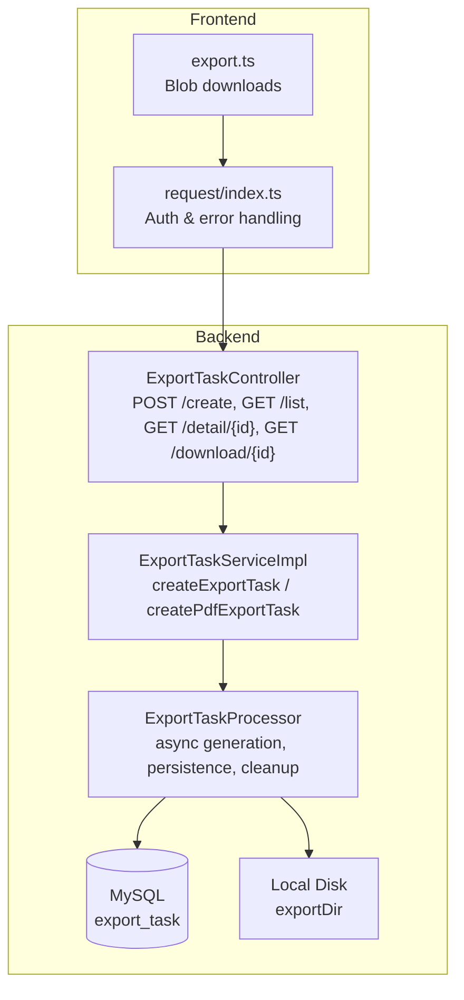
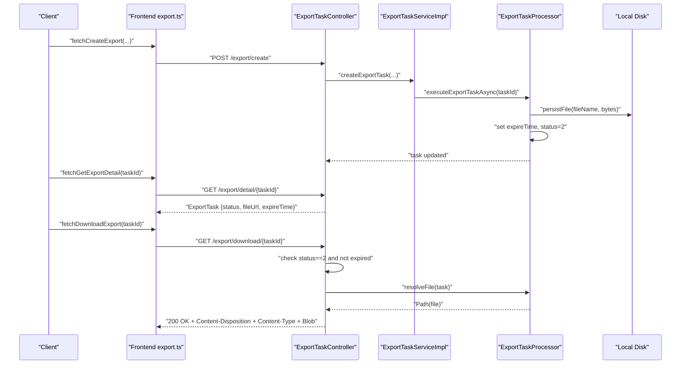
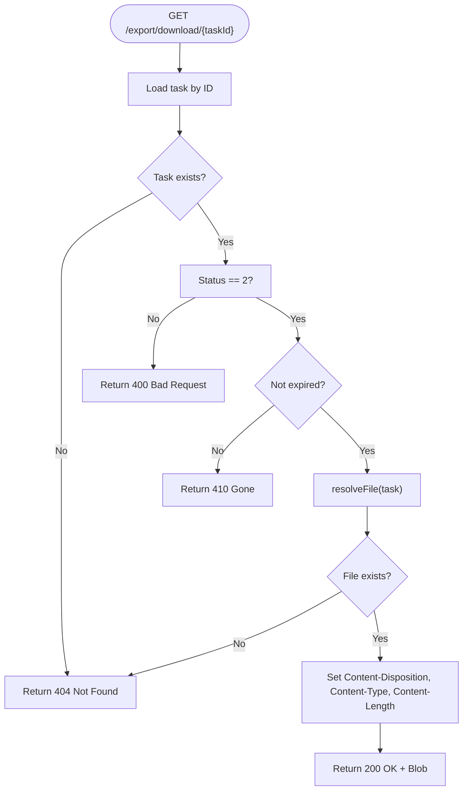
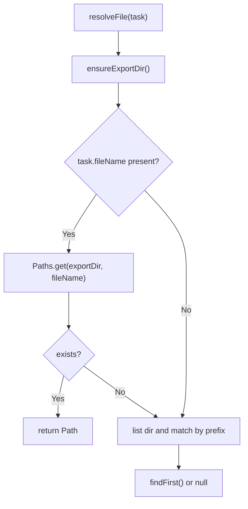
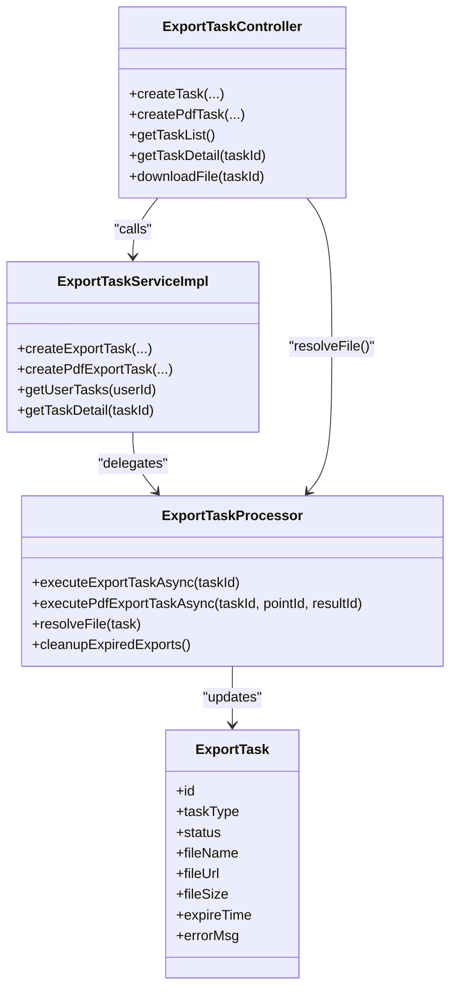
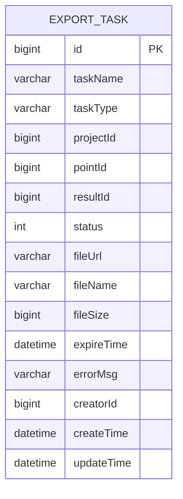
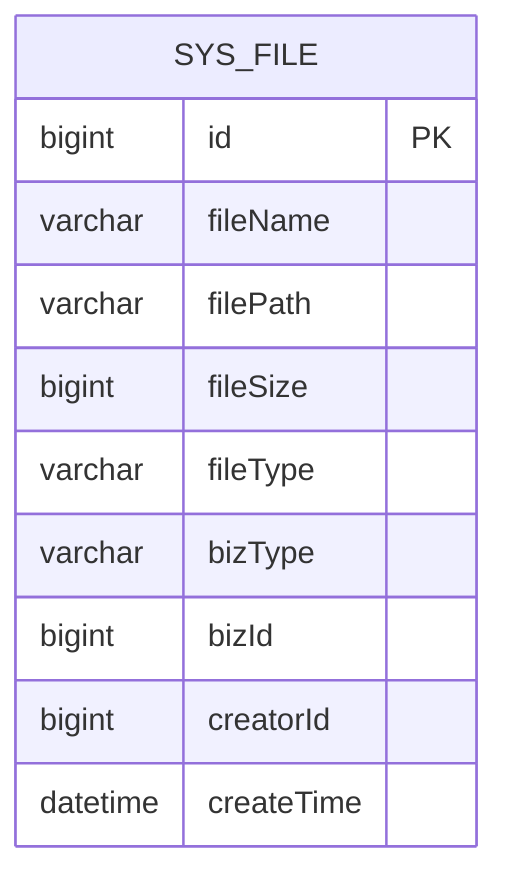

# Delivery & Distribution

<cite>
**Referenced Files in This Document**
- [ExportTaskController.java](file://admin-backend/src/main/java/com/qhiot/survey/controller/ExportTaskController.java)
- [ExportTaskProcessor.java](file://admin-backend/src/main/java/com/qhiot/survey/service/ExportTaskProcessor.java)
- [ExportTaskServiceImpl.java](file://admin-backend/src/main/java/com/qhiot/survey/service/impl/ExportTaskServiceImpl.java)
- [ExportTask.java](file://admin-backend/src/main/java/com/qhiot/survey/entity/ExportTask.java)
- [export.ts](file://admin-web-soybean/src/service/api/export.ts)
- [index.ts](file://admin-web-soybean/src/service/request/index.ts)
- [RateLimitInterceptor.java](file://admin-backend/src/main/java/com/qhiot/survey/common/RateLimitInterceptor.java)
- [JwtAuthenticationFilter.java](file://admin-backend/src/main/java/com/qhiot/survey/security/JwtAuthenticationFilter.java)
- [application.yml](file://admin-backend/src/main/resources/application.yml)
- [01-init.sql](file://admin-backend/init-data/01-init.sql)
- [SysFile.java](file://admin-backend/src/main/java/com/qhiot/survey/entity/SysFile.java)
- [SysFileMapper.java](file://admin-backend/src/main/java/com/qhiot/survey/mapper/SysFileMapper.java)
- [FileUploadService.java](file://admin-backend/src/main/java/com/qhiot/survey/service/FileUploadService.java)
- [FileUploadController.java](file://admin-backend/src/main/java/com/qhiot/survey/controller/FileUploadController.java)
</cite>

## Table of Contents
1. [Introduction](#introduction)
2. [Project Structure](#project-structure)
3. [Core Components](#core-components)
4. [Architecture Overview](#architecture-overview)
5. [Detailed Component Analysis](#detailed-component-analysis)
6. [Dependency Analysis](#dependency-analysis)
7. [Performance Considerations](#performance-considerations)
8. [Troubleshooting Guide](#troubleshooting-guide)
9. [Conclusion](#conclusion)
10. [Appendices](#appendices)

## Introduction
This document describes the export delivery and distribution system, focusing on how asynchronous export tasks are generated, stored, and delivered securely. It covers:
- Secure download endpoints with access control and expiration handling
- HTTP headers, content type detection, and browser compatibility
- File storage strategies (local disk and cloud), retention, and cleanup
- Retry mechanisms for failed downloads and error handling for expired or missing files
- Programmatic retrieval and integration patterns for external systems
- Security considerations, rate limiting, and monitoring approaches

## Project Structure
The delivery pipeline spans backend controllers, services, processors, and frontend APIs:
- Controllers expose endpoints for creating tasks, polling status, and downloading files
- Services orchestrate task creation and delegate heavy work to processors
- Processors generate files asynchronously, persist them, and manage retention/cleanup
- Frontend integrates via typed API modules and shared request utilities

**Diagram sources**
- [ExportTaskController.java:35-141](file://admin-backend/src/main/java/com/qhiot/survey/controller/ExportTaskController.java#L35-L141)
- [ExportTaskServiceImpl.java:25-88](file://admin-backend/src/main/java/com/qhiot/survey/service/impl/ExportTaskServiceImpl.java#L25-L88)
- [ExportTaskProcessor.java:44-442](file://admin-backend/src/main/java/com/qhiot/survey/service/ExportTaskProcessor.java#L44-L442)
- [export.ts:1-78](file://admin-web-soybean/src/service/api/export.ts#L1-L78)
- [index.ts:20-156](file://admin-web-soybean/src/service/request/index.ts#L20-L156)

**Section sources**
- [ExportTaskController.java:35-141](file://admin-backend/src/main/java/com/qhiot/survey/controller/ExportTaskController.java#L35-L141)
- [ExportTaskServiceImpl.java:25-88](file://admin-backend/src/main/java/com/qhiot/survey/service/impl/ExportTaskServiceImpl.java#L25-L88)
- [ExportTaskProcessor.java:44-442](file://admin-backend/src/main/java/com/qhiot/survey/service/ExportTaskProcessor.java#L44-L442)
- [export.ts:1-78](file://admin-web-soybean/src/service/api/export.ts#L1-L78)
- [index.ts:20-156](file://admin-web-soybean/src/service/request/index.ts#L20-L156)

## Core Components
- ExportTaskController: Exposes endpoints to create tasks, poll status, and download files. Enforces access control and expiration checks before serving files.
- ExportTaskServiceImpl: Creates tasks and delegates asynchronous execution to ExportTaskProcessor.
- ExportTaskProcessor: Generates Excel/PDF content, persists files locally, sets metadata (fileUrl, fileName, fileSize, expireTime), and schedules cleanup.
- Frontend export.ts: Provides typed API methods for creating tasks, fetching details, and downloading blobs.
- Frontend request/index.ts: Adds Authorization headers, handles backend response codes, token refresh, and error messaging.

**Section sources**
- [ExportTaskController.java:35-141](file://admin-backend/src/main/java/com/qhiot/survey/controller/ExportTaskController.java#L35-L141)
- [ExportTaskServiceImpl.java:25-88](file://admin-backend/src/main/java/com/qhiot/survey/service/impl/ExportTaskServiceImpl.java#L25-L88)
- [ExportTaskProcessor.java:44-442](file://admin-backend/src/main/java/com/qhiot/survey/service/ExportTaskProcessor.java#L44-L442)
- [export.ts:1-78](file://admin-web-soybean/src/service/api/export.ts#L1-L78)
- [index.ts:20-156](file://admin-web-soybean/src/service/request/index.ts#L20-L156)

## Architecture Overview
The system uses asynchronous processing to generate export files and serves them via a dedicated download endpoint with strict access control and expiration enforcement.

**Diagram sources**
- [ExportTaskController.java:48-117](file://admin-backend/src/main/java/com/qhiot/survey/controller/ExportTaskController.java#L48-L117)
- [ExportTaskServiceImpl.java:30-66](file://admin-backend/src/main/java/com/qhiot/survey/service/impl/ExportTaskServiceImpl.java#L30-L66)
- [ExportTaskProcessor.java:71-124](file://admin-backend/src/main/java/com/qhiot/survey/service/ExportTaskProcessor.java#L71-L124)
- [export.ts:17-41](file://admin-web-soybean/src/service/api/export.ts#L17-L41)

## Detailed Component Analysis

### Download Endpoint and Access Control
- Endpoint: GET /api/v1/export/download/{taskId}
- Access control:
  - Requires authenticated user (via JWT filter)
  - Only allows downloads for tasks with status=2 (completed)
  - Rejects downloads for expired tasks (returns 410 Gone)
  - Returns 404 if task not found or resolved file does not exist
- HTTP headers:
  - Content-Disposition: attachment with UTF-8 encoded filename
  - Content-Type: derived from file extension (.pdf/.xlsx/.xls)
  - Content-Length: file size
- Browser compatibility:
  - Filename encoding uses RFC 5987 with UTF-8''
  - Supports modern browsers’ blob downloads

**Diagram sources**
- [ExportTaskController.java:82-117](file://admin-backend/src/main/java/com/qhiot/survey/controller/ExportTaskController.java#L82-L117)
- [ExportTaskProcessor.java:160-182](file://admin-backend/src/main/java/com/qhiot/survey/service/ExportTaskProcessor.java#L160-L182)

**Section sources**
- [ExportTaskController.java:82-141](file://admin-backend/src/main/java/com/qhiot/survey/controller/ExportTaskController.java#L82-L141)

### File Serving Mechanism
- File resolution:
  - Uses processor’s resolveFile(task) to locate persisted file by stored fileName or fallback pattern matching
- Storage:
  - Files are written to exportDir configured via export.storage.path
- Cleanup:
  - Scheduled cleanup at 03:30 daily deletes expired files and marks tasks as expired
- Retention:
  - Controlled by export.retention-days property (default 7 days)

**Diagram sources**
- [ExportTaskProcessor.java:160-182](file://admin-backend/src/main/java/com/qhiot/survey/service/ExportTaskProcessor.java#L160-L182)
- [ExportTaskProcessor.java:243-257](file://admin-backend/src/main/java/com/qhiot/survey/service/ExportTaskProcessor.java#L243-L257)

**Section sources**
- [ExportTaskProcessor.java:62-66](file://admin-backend/src/main/java/com/qhiot/survey/service/ExportTaskProcessor.java#L62-L66)
- [ExportTaskProcessor.java:184-212](file://admin-backend/src/main/java/com/qhiot/survey/service/ExportTaskProcessor.java#L184-L212)

### Download API Endpoints and HTTP Behavior
- Creation:
  - POST /export/create: Creates a task (Excel/PDF) and triggers async processing
  - POST /export/create-pdf: Creates a single-point PDF task
- Status:
  - GET /export/list: Lists user’s recent tasks
  - GET /export/detail/{taskId}: Polls task status and metadata
- Download:
  - GET /export/download/{taskId}: Returns file as Blob with appropriate headers

Frontend integration:
- export.ts defines typed methods returning Blob responses for downloads
- request/index.ts injects Authorization and handles backend response codes and token refresh

**Section sources**
- [ExportTaskController.java:48-80](file://admin-backend/src/main/java/com/qhiot/survey/controller/ExportTaskController.java#L48-L80)
- [ExportTaskController.java:119-141](file://admin-backend/src/main/java/com/qhiot/survey/controller/ExportTaskController.java#L119-L141)
- [export.ts:17-78](file://admin-web-soybean/src/service/api/export.ts#L17-L78)
- [index.ts:20-156](file://admin-web-soybean/src/service/request/index.ts#L20-L156)

### File Storage Strategies and Cleanup Policies
- Local disk storage:
  - exportDir is ensured and used to persist generated files
  - resolveFile supports both explicit fileName and fallback prefix matching
- Cleanup policy:
  - Daily scheduled job removes expired files and updates task status to expired
- Retention management:
  - Tasks get expireTime = now + retentionDays (default 7)
- Cloud storage note:
  - The current download flow serves from local disk; cloud storage is used elsewhere (e.g., photos) and not integrated into export downloads

**Section sources**
- [ExportTaskProcessor.java:243-257](file://admin-backend/src/main/java/com/qhiot/survey/service/ExportTaskProcessor.java#L243-L257)
- [ExportTaskProcessor.java:184-212](file://admin-backend/src/main/java/com/qhiot/survey/service/ExportTaskProcessor.java#L184-L212)
- [application.yml:139-148](file://admin-backend/src/main/resources/application.yml#L139-L148)

### Retry Mechanisms and Error Handling
- Task failure:
  - Processor catches exceptions during generation and marks task as failed with truncated error message
- Download errors:
  - 404 Not Found when task absent or file missing
  - 410 Gone when task expired
  - 400 Bad Request when task not completed
- Frontend resilience:
  - request/index.ts retries token-refreshed requests automatically when encountering expired tokens
  - Displays friendly messages for network timeouts and backend errors

**Section sources**
- [ExportTaskProcessor.java:120-123](file://admin-backend/src/main/java/com/qhiot/survey/service/ExportTaskProcessor.java#L120-L123)
- [ExportTaskController.java:84-103](file://admin-backend/src/main/java/com/qhiot/survey/controller/ExportTaskController.java#L84-L103)
- [index.ts:82-96](file://admin-web-soybean/src/service/request/index.ts#L82-L96)

### Programmatic Retrieval and Integration Examples
- Create export task:
  - Use export.ts fetchCreateExport(...) to submit task creation
- Poll status:
  - Use export.ts fetchGetExportDetail(taskId) to check status and fileUrl
- Download file:
  - Use export.ts fetchDownloadExport(taskId) to receive Blob
- External system integration:
  - Call POST /export/create or POST /export/create-pdf from external clients
  - Poll GET /export/detail/{taskId} until status=2
  - Download via GET /export/download/{taskId} when ready

**Section sources**
- [export.ts:17-41](file://admin-web-soybean/src/service/api/export.ts#L17-L41)
- [ExportTaskController.java:48-80](file://admin-backend/src/main/java/com/qhiot/survey/controller/ExportTaskController.java#L48-L80)

### Security Considerations
- Authentication:
  - JwtAuthenticationFilter validates tokens and supports collaboration tokens
- Authorization:
  - Download endpoint relies on authenticated user context; ensure only creators or authorized users access tasks
- Rate limiting:
  - RateLimitInterceptor applies per-IP rate limiting for most endpoints except public/auth endpoints
- CORS:
  - Configure allowed origins in application.yml for production deployments
- Content type and filename:
  - Content-Type is derived from file extension; filename is UTF-8 encoded in Content-Disposition

**Section sources**
- [JwtAuthenticationFilter.java:34-134](file://admin-backend/src/main/java/com/qhiot/survey/security/JwtAuthenticationFilter.java#L34-L134)
- [RateLimitInterceptor.java:17-73](file://admin-backend/src/main/java/com/qhiot/survey/common/RateLimitInterceptor.java#L17-L73)
- [application.yml:134-136](file://admin-backend/src/main/resources/application.yml#L134-L136)
- [ExportTaskController.java:131-140](file://admin-backend/src/main/java/com/qhiot/survey/controller/ExportTaskController.java#L131-L140)

### Monitoring Download Statistics
- Current implementation:
  - No explicit download counters or metrics are recorded in the export pipeline
- Recommended additions:
  - Track successful downloads per taskId with timestamps and user agent
  - Log failures (404, 410, 400) with reasons
  - Expose metrics endpoint or integrate with APM for latency and error rates

[No sources needed since this section provides general guidance]

## Dependency Analysis

**Diagram sources**
- [ExportTaskController.java:35-141](file://admin-backend/src/main/java/com/qhiot/survey/controller/ExportTaskController.java#L35-L141)
- [ExportTaskServiceImpl.java:25-88](file://admin-backend/src/main/java/com/qhiot/survey/service/impl/ExportTaskServiceImpl.java#L25-L88)
- [ExportTaskProcessor.java:44-442](file://admin-backend/src/main/java/com/qhiot/survey/service/ExportTaskProcessor.java#L44-L442)
- [ExportTask.java:14-63](file://admin-backend/src/main/java/com/qhiot/survey/entity/ExportTask.java#L14-L63)

**Section sources**
- [ExportTaskController.java:35-141](file://admin-backend/src/main/java/com/qhiot/survey/controller/ExportTaskController.java#L35-L141)
- [ExportTaskServiceImpl.java:25-88](file://admin-backend/src/main/java/com/qhiot/survey/service/impl/ExportTaskServiceImpl.java#L25-L88)
- [ExportTaskProcessor.java:44-442](file://admin-backend/src/main/java/com/qhiot/survey/service/ExportTaskProcessor.java#L44-L442)
- [ExportTask.java:14-63](file://admin-backend/src/main/java/com/qhiot/survey/entity/ExportTask.java#L14-L63)

## Performance Considerations
- Asynchronous generation:
  - Dedicated thread pool exportTaskExecutor prevents blocking and isolates export work
- File I/O:
  - Large exports may consume memory and disk; consider streaming and compression where applicable
- Cleanup cadence:
  - Daily cleanup reduces disk pressure; tune cron schedule based on traffic
- Rate limiting:
  - Default 10 permits/second per IP helps protect backend under load

**Section sources**
- [AsyncConfig.java:52-71](file://admin-backend/src/main/java/com/qhiot/survey/config/AsyncConfig.java#L52-L71)
- [RateLimitInterceptor.java:17-73](file://admin-backend/src/main/java/com/qhiot/survey/common/RateLimitInterceptor.java#L17-L73)
- [ExportTaskProcessor.java:184-212](file://admin-backend/src/main/java/com/qhiot/survey/service/ExportTaskProcessor.java#L184-L212)

## Troubleshooting Guide
- Download returns 404:
  - Task not found or file was cleaned up after expiration
- Download returns 410:
  - Task expired; regenerate the export
- Download returns 400:
  - Task not completed; poll until status=2
- Network or timeout errors:
  - Frontend request/index.ts surfaces friendly messages and retries on token expiry
- Rate-limited:
  - Expect 429 responses; reduce client-side polling frequency

**Section sources**
- [ExportTaskController.java:84-103](file://admin-backend/src/main/java/com/qhiot/survey/controller/ExportTaskController.java#L84-L103)
- [index.ts:100-154](file://admin-web-soybean/src/service/request/index.ts#L100-L154)
- [RateLimitInterceptor.java:45-51](file://admin-backend/src/main/java/com/qhiot/survey/common/RateLimitInterceptor.java#L45-L51)

## Conclusion
The export delivery system provides a robust, asynchronous pipeline for generating and distributing export files with built-in access control, expiration handling, and cleanup. By leveraging authenticated endpoints, structured task lifecycle management, and frontend-friendly Blob downloads, it supports reliable integrations and scalable usage. For production hardening, consider adding download metrics, optional cloud-backed downloads, and stricter per-user quotas.

## Appendices

### Data Model: ExportTask

**Diagram sources**
- [ExportTask.java:14-63](file://admin-backend/src/main/java/com/qhiot/survey/entity/ExportTask.java#L14-L63)

### Data Model: SysFile (for reference)

**Diagram sources**
- [SysFile.java:14-46](file://admin-backend/src/main/java/com/qhiot/survey/entity/SysFile.java#L14-L46)

### File Upload Storage Reference
- FileUploadService supports OSS and local fallback; export downloads serve from local disk
- SysFile table stores metadata for other file types (e.g., photos)

**Section sources**
- [FileUploadService.java:39-96](file://admin-backend/src/main/java/com/qhiot/survey/service/FileUploadService.java#L39-L96)
- [FileUploadController.java:25-80](file://admin-backend/src/main/java/com/qhiot/survey/controller/FileUploadController.java#L25-L80)
- [SysFileMapper.java:10-12](file://admin-backend/src/main/java/com/qhiot/survey/mapper/SysFileMapper.java#L10-L12)
- [01-init.sql:415-427](file://admin-backend/init-data/01-init.sql#L415-L427)