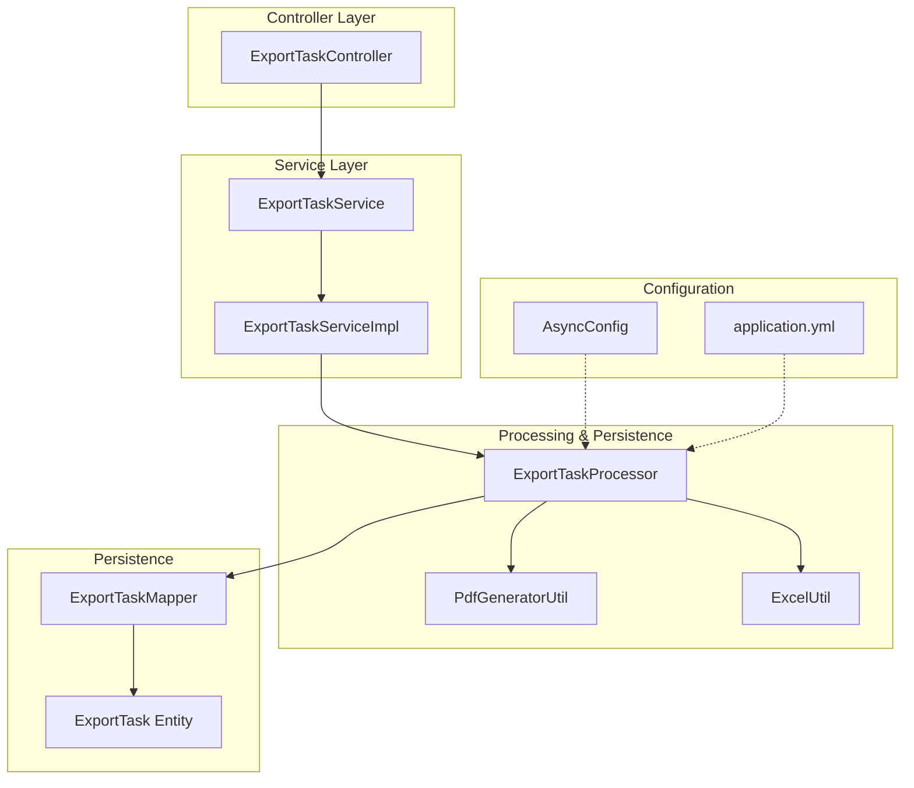
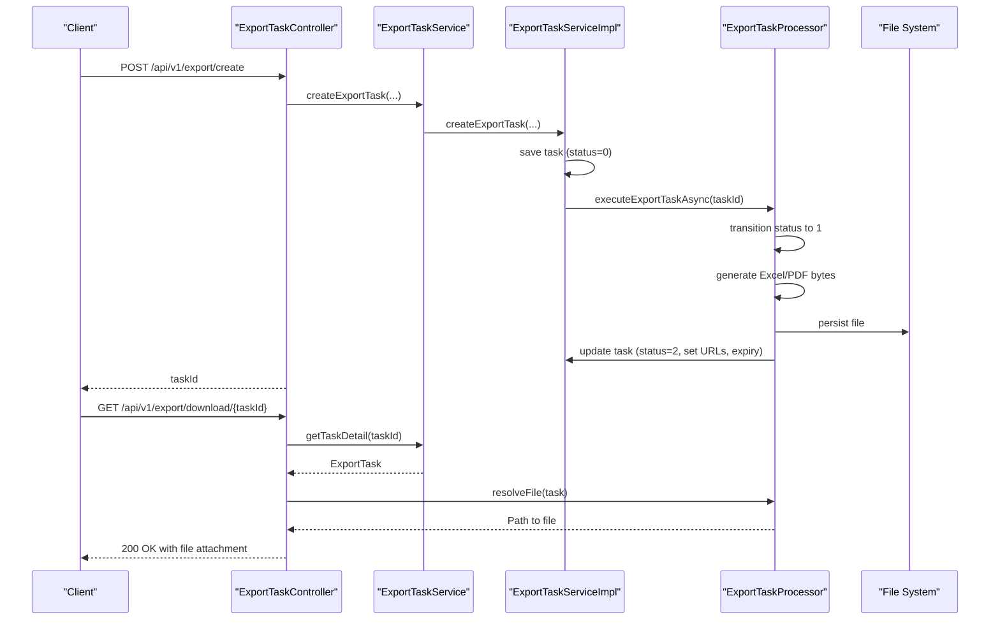
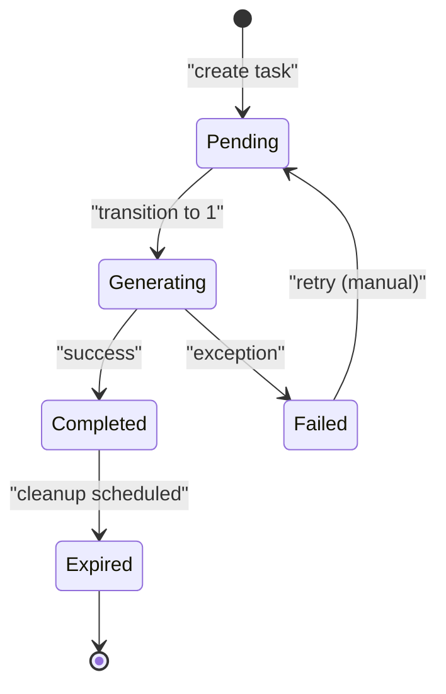
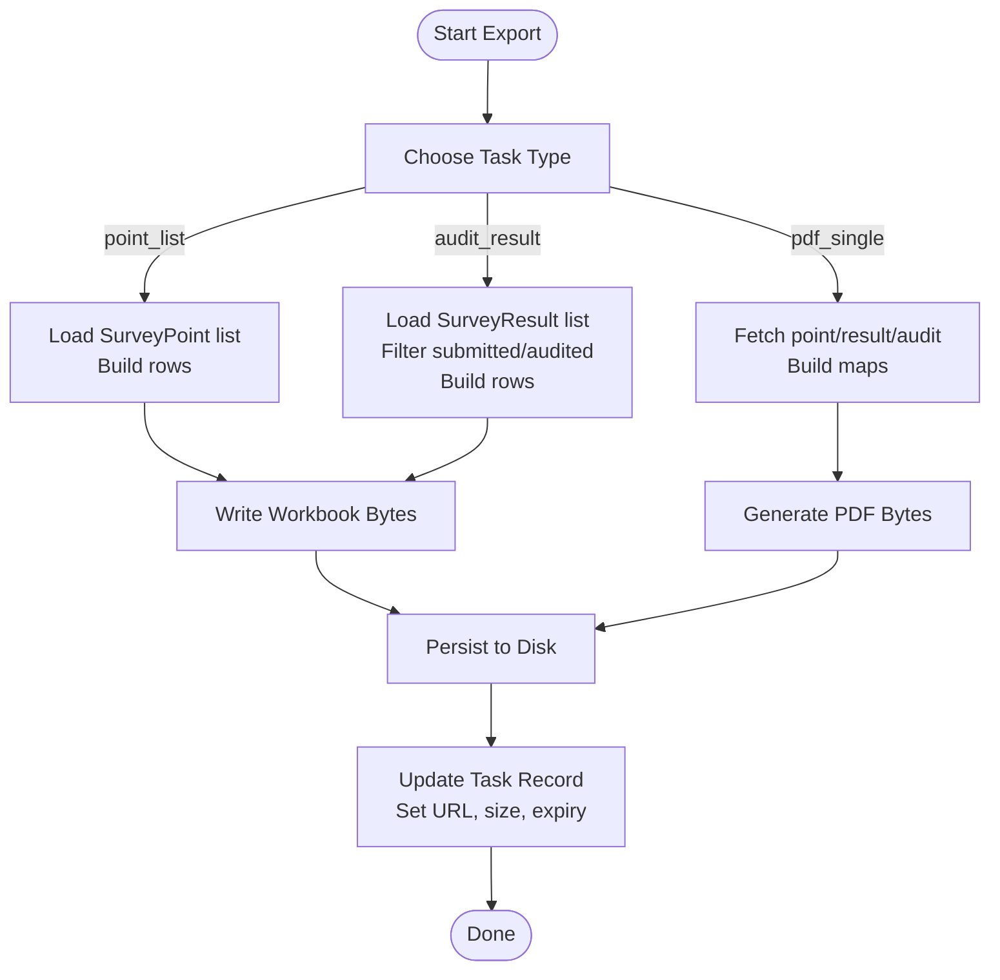
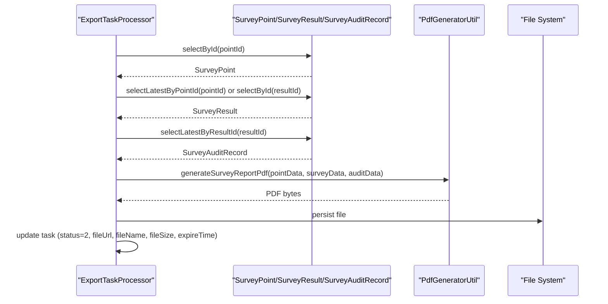
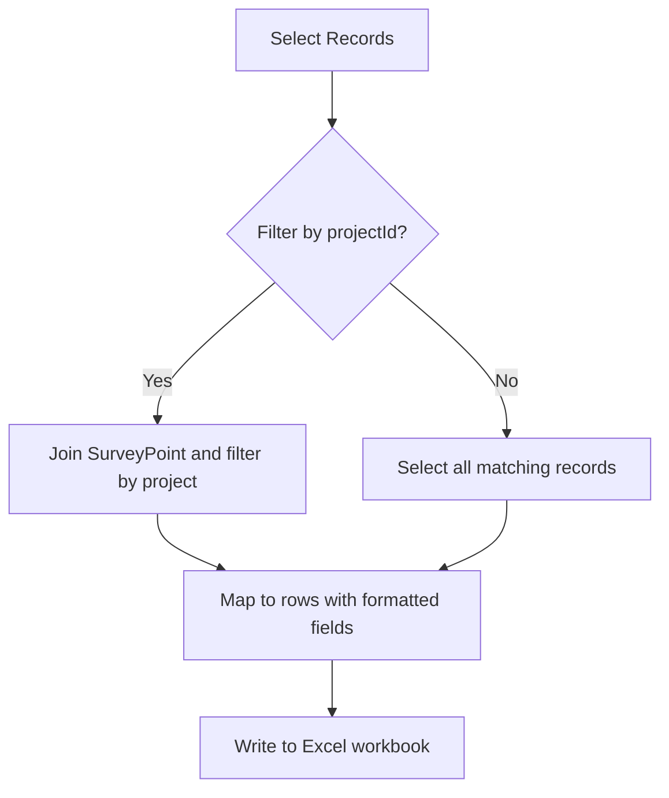
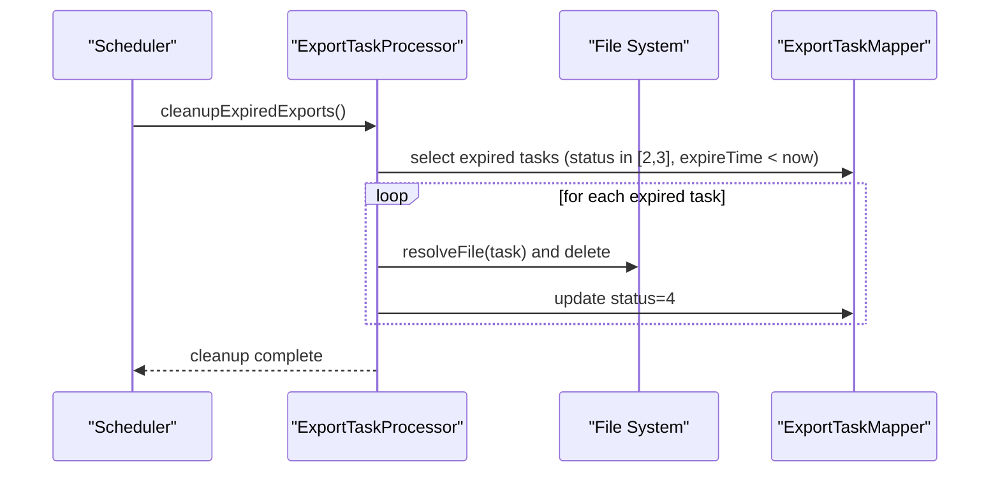
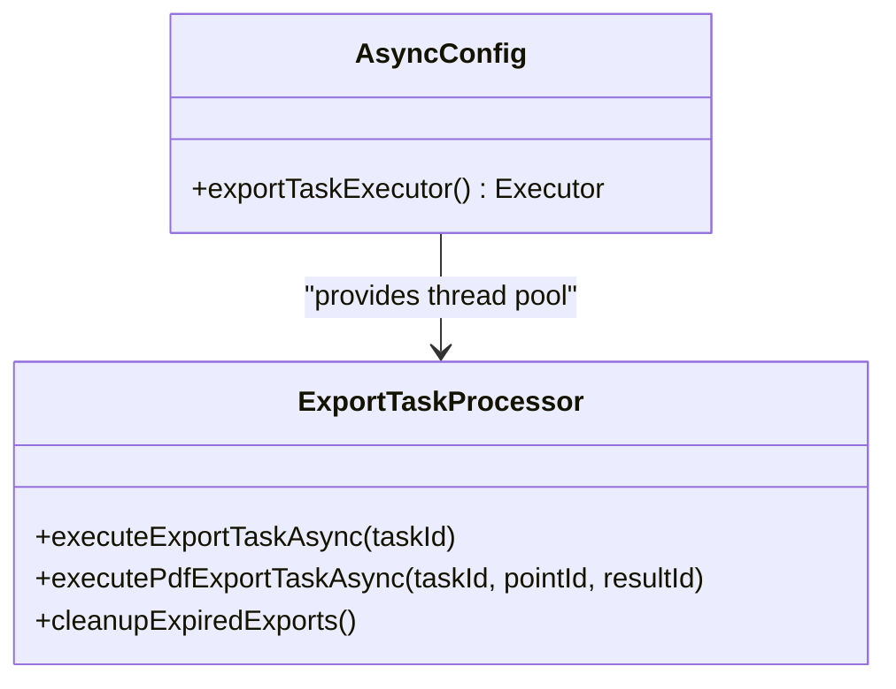
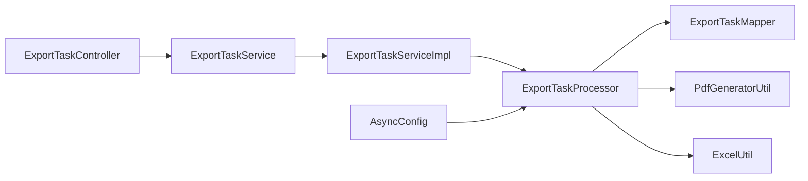

# Export & Reporting

<cite>
**Referenced Files in This Document**
- [ExportTask.java](file://admin-backend/src/main/java/com/qhiot/survey/entity/ExportTask.java)
- [ExportTaskService.java](file://admin-backend/src/main/java/com/qhiot/survey/service/ExportTaskService.java)
- [ExportTaskServiceImpl.java](file://admin-backend/src/main/java/com/qhiot/survey/service/impl/ExportTaskServiceImpl.java)
- [ExportTaskController.java](file://admin-backend/src/main/java/com/qhiot/survey/controller/ExportTaskController.java)
- [ExportTaskProcessor.java](file://admin-backend/src/main/java/com/qhiot/survey/service/ExportTaskProcessor.java)
- [PdfGeneratorUtil.java](file://admin-backend/src/main/java/com/qhiot/survey/common/util/PdfGeneratorUtil.java)
- [ExcelUtil.java](file://admin-backend/src/main/java/com/qhiot/survey/common/util/ExcelUtil.java)
- [AsyncConfig.java](file://admin-backend/src/main/java/com/qhiot/survey/config/AsyncConfig.java)
- [application.yml](file://admin-backend/src/main/resources/application.yml)
- [ExportTaskMapper.java](file://admin-backend/src/main/java/com/qhiot/survey/mapper/ExportTaskMapper.java)
- [04-export-task-columns.sql](file://admin-backend/init-data/04-export-task-columns.sql)
</cite>

## Table of Contents
1. [Introduction](#introduction)
2. [Project Structure](#project-structure)
3. [Core Components](#core-components)
4. [Architecture Overview](#architecture-overview)
5. [Detailed Component Analysis](#detailed-component-analysis)
6. [Dependency Analysis](#dependency-analysis)
7. [Performance Considerations](#performance-considerations)
8. [Troubleshooting Guide](#troubleshooting-guide)
9. [Conclusion](#conclusion)
10. [Appendices](#appendices)

## Introduction
This document describes the export and reporting system responsible for asynchronous export tasks, format conversion, and delivery. It covers:
- Task lifecycle and asynchronous processing
- Generation of multiple formats (PDF, Excel)
- Data aggregation and filtering for analytics
- Delivery via file storage and HTTP download
- Scheduling for cleanup and retention
- Examples of task creation, format selection, customization, and delivery
- Performance optimization and failure handling strategies

## Project Structure
The export/reporting subsystem centers around a dedicated entity, service, controller, processor, and utility classes. Asynchronous execution is isolated in a separate processor bean to avoid AOP proxy pitfalls. Export artifacts are persisted to a configurable directory and served via HTTP.

**Diagram sources**
- [ExportTaskController.java:33-142](file://admin-backend/src/main/java/com/qhiot/survey/controller/ExportTaskController.java#L33-L142)
- [ExportTaskService.java:12-55](file://admin-backend/src/main/java/com/qhiot/survey/service/ExportTaskService.java#L12-L55)
- [ExportTaskServiceImpl.java:25-88](file://admin-backend/src/main/java/com/qhiot/survey/service/impl/ExportTaskServiceImpl.java#L25-L88)
- [ExportTaskProcessor.java:44-442](file://admin-backend/src/main/java/com/qhiot/survey/service/ExportTaskProcessor.java#L44-L442)
- [PdfGeneratorUtil.java:27-259](file://admin-backend/src/main/java/com/qhiot/survey/common/util/PdfGeneratorUtil.java#L27-L259)
- [ExcelUtil.java:17-123](file://admin-backend/src/main/java/com/qhiot/survey/common/util/ExcelUtil.java#L17-L123)
- [ExportTaskMapper.java:8-9](file://admin-backend/src/main/java/com/qhiot/survey/mapper/ExportTaskMapper.java#L8-L9)
- [ExportTask.java:15-63](file://admin-backend/src/main/java/com/qhiot/survey/entity/ExportTask.java#L15-L63)
- [AsyncConfig.java:19-95](file://admin-backend/src/main/java/com/qhiot/survey/config/AsyncConfig.java#L19-L95)
- [application.yml:1-149](file://admin-backend/src/main/resources/application.yml#L1-L149)

**Section sources**
- [ExportTaskController.java:33-142](file://admin-backend/src/main/java/com/qhiot/survey/controller/ExportTaskController.java#L33-L142)
- [ExportTaskService.java:12-55](file://admin-backend/src/main/java/com/qhiot/survey/service/ExportTaskService.java#L12-L55)
- [ExportTaskServiceImpl.java:25-88](file://admin-backend/src/main/java/com/qhiot/survey/service/impl/ExportTaskServiceImpl.java#L25-L88)
- [ExportTaskProcessor.java:44-442](file://admin-backend/src/main/java/com/qhiot/survey/service/ExportTaskProcessor.java#L44-L442)
- [PdfGeneratorUtil.java:27-259](file://admin-backend/src/main/java/com/qhiot/survey/common/util/PdfGeneratorUtil.java#L27-L259)
- [ExcelUtil.java:17-123](file://admin-backend/src/main/java/com/qhiot/survey/common/util/ExcelUtil.java#L17-L123)
- [AsyncConfig.java:19-95](file://admin-backend/src/main/java/com/qhiot/survey/config/AsyncConfig.java#L19-L95)
- [application.yml:1-149](file://admin-backend/src/main/resources/application.yml#L1-L149)

## Core Components
- ExportTask entity: stores task metadata, status, file references, and optional point/result linkage for PDF exports.
- ExportTaskService: defines task creation APIs (generic and PDF single), retrieval, and PDF generation helpers.
- ExportTaskServiceImpl: persists tasks, triggers asynchronous processing, and exposes PDF generation entry points.
- ExportTaskController: exposes REST endpoints for creating tasks, listing, retrieving details, and downloading files.
- ExportTaskProcessor: performs asynchronous work, generates Excel/PDF, persists files, updates task records, and schedules cleanup.
- PdfGeneratorUtil: creates PDFs from structured data.
- ExcelUtil: builds Excel workbooks from arrays of headers and rows.
- AsyncConfig: configures dedicated thread pools for export tasks.
- application.yml: export storage path and retention days are configured via properties.

Key responsibilities:
- Asynchronous task execution and status transitions
- Format-specific generation (Excel and PDF)
- File persistence and controlled delivery
- Scheduled cleanup of expired exports

**Section sources**
- [ExportTask.java:15-63](file://admin-backend/src/main/java/com/qhiot/survey/entity/ExportTask.java#L15-L63)
- [ExportTaskService.java:12-55](file://admin-backend/src/main/java/com/qhiot/survey/service/ExportTaskService.java#L12-L55)
- [ExportTaskServiceImpl.java:25-88](file://admin-backend/src/main/java/com/qhiot/survey/service/impl/ExportTaskServiceImpl.java#L25-L88)
- [ExportTaskController.java:33-142](file://admin-backend/src/main/java/com/qhiot/survey/controller/ExportTaskController.java#L33-L142)
- [ExportTaskProcessor.java:44-442](file://admin-backend/src/main/java/com/qhiot/survey/service/ExportTaskProcessor.java#L44-L442)
- [PdfGeneratorUtil.java:27-259](file://admin-backend/src/main/java/com/qhiot/survey/common/util/PdfGeneratorUtil.java#L27-L259)
- [ExcelUtil.java:17-123](file://admin-backend/src/main/java/com/qhiot/survey/common/util/ExcelUtil.java#L17-L123)
- [AsyncConfig.java:55-71](file://admin-backend/src/main/java/com/qhiot/survey/config/AsyncConfig.java#L55-L71)
- [application.yml:58-67](file://admin-backend/src/main/resources/application.yml#L58-L67)

## Architecture Overview
The system follows a layered architecture:
- REST API layer (controller) accepts requests and delegates to services.
- Service layer validates inputs, persists tasks, and triggers asynchronous processing.
- Processor layer executes heavy workloads off the main request thread.
- Utilities handle format-specific generation.
- Persistence layer stores task metadata and resolves files on disk.

**Diagram sources**
- [ExportTaskController.java:48-117](file://admin-backend/src/main/java/com/qhiot/survey/controller/ExportTaskController.java#L48-L117)
- [ExportTaskService.java:14-54](file://admin-backend/src/main/java/com/qhiot/survey/service/ExportTaskService.java#L14-L54)
- [ExportTaskServiceImpl.java:30-87](file://admin-backend/src/main/java/com/qhiot/survey/service/impl/ExportTaskServiceImpl.java#L30-L87)
- [ExportTaskProcessor.java:71-124](file://admin-backend/src/main/java/com/qhiot/survey/service/ExportTaskProcessor.java#L71-L124)

## Detailed Component Analysis

### Export Task Management
- Creation:
  - Generic export: POST /api/v1/export/create with taskName, taskType (point_list, audit_result, pdf_single), and optional projectId.
  - Single PDF export: POST /api/v1/export/create-pdf with pointId and optional resultId.
- Status machine:
  - 0: pending
  - 1: generating
  - 2: completed
  - 3: failed
  - 4: expired
- Download:
  - GET /api/v1/export/download/{taskId} serves the file if status is 2 and not expired.

**Diagram sources**
- [ExportTaskProcessor.java:216-234](file://admin-backend/src/main/java/com/qhiot/survey/service/ExportTaskProcessor.java#L216-L234)
- [ExportTaskController.java:82-117](file://admin-backend/src/main/java/com/qhiot/survey/controller/ExportTaskController.java#L82-L117)

**Section sources**
- [ExportTaskController.java:48-117](file://admin-backend/src/main/java/com/qhiot/survey/controller/ExportTaskController.java#L48-L117)
- [ExportTaskService.java:14-54](file://admin-backend/src/main/java/com/qhiot/survey/service/ExportTaskService.java#L14-L54)
- [ExportTaskServiceImpl.java:30-87](file://admin-backend/src/main/java/com/qhiot/survey/service/impl/ExportTaskServiceImpl.java#L30-L87)
- [ExportTaskProcessor.java:71-124](file://admin-backend/src/main/java/com/qhiot/survey/service/ExportTaskProcessor.java#L71-L124)

### Format Conversion Pipeline
- Excel generation:
  - Uses headers and rows to produce a workbook via ExcelUtil.
  - Supported generic types: point_list, audit_result.
- PDF generation:
  - Single-point PDF built from point, survey, and audit data.
  - Uses PdfGeneratorUtil to assemble sections and tables.

**Diagram sources**
- [ExportTaskProcessor.java:288-351](file://admin-backend/src/main/java/com/qhiot/survey/service/ExportTaskProcessor.java#L288-L351)
- [PdfGeneratorUtil.java:39-127](file://admin-backend/src/main/java/com/qhiot/survey/common/util/PdfGeneratorUtil.java#L39-L127)

**Section sources**
- [ExportTaskProcessor.java:288-351](file://admin-backend/src/main/java/com/qhiot/survey/service/ExportTaskProcessor.java#L288-L351)
- [PdfGeneratorUtil.java:39-127](file://admin-backend/src/main/java/com/qhiot/survey/common/util/PdfGeneratorUtil.java#L39-L127)
- [ExcelUtil.java:59-91](file://admin-backend/src/main/java/com/qhiot/survey/common/util/ExcelUtil.java#L59-L91)

### Report Generation Pipeline (PDF)
- Data aggregation:
  - SurveyPoint, SurveyResult, SurveyAuditRecord are joined to construct report data.
- Customization:
  - Dynamic form data embedded from survey result JSON.
  - Optional audit section included when present.
- Delivery:
  - File stored under exportDir with a generated filename and URL recorded in the task.

**Diagram sources**
- [ExportTaskProcessor.java:262-283](file://admin-backend/src/main/java/com/qhiot/survey/service/ExportTaskProcessor.java#L262-L283)
- [PdfGeneratorUtil.java:39-127](file://admin-backend/src/main/java/com/qhiot/survey/common/util/PdfGeneratorUtil.java#L39-L127)

**Section sources**
- [ExportTaskProcessor.java:262-283](file://admin-backend/src/main/java/com/qhiot/survey/service/ExportTaskProcessor.java#L262-L283)
- [PdfGeneratorUtil.java:39-127](file://admin-backend/src/main/java/com/qhiot/survey/common/util/PdfGeneratorUtil.java#L39-L127)

### Data Aggregation and Filtering
- Point list export:
  - Loads SurveyPoint entries, optionally filtered by projectId.
  - Builds rows with key attributes and formatted timestamps.
- Audit result export:
  - Filters SurveyResult by submission/audit statuses.
  - Optionally filters by associated point’s projectId.
  - Produces a consolidated audit report.

**Diagram sources**
- [ExportTaskProcessor.java:288-351](file://admin-backend/src/main/java/com/qhiot/survey/service/ExportTaskProcessor.java#L288-L351)

**Section sources**
- [ExportTaskProcessor.java:288-351](file://admin-backend/src/main/java/com/qhiot/survey/service/ExportTaskProcessor.java#L288-L351)

### Delivery Mechanisms
- Storage:
  - Export directory configurable via property; defaults to a local exports folder.
- Expiry:
  - Tasks marked with an expiry time derived from retention-days property.
- Cleanup:
  - Daily scheduled job deletes expired files and marks tasks as expired.
- Download:
  - Only tasks with status=2 and unexpired are downloadable.
  - Content-Type determined by extension (.pdf, .xlsx, .xls).

**Diagram sources**
- [ExportTaskProcessor.java:187-212](file://admin-backend/src/main/java/com/qhiot/survey/service/ExportTaskProcessor.java#L187-L212)

**Section sources**
- [ExportTaskProcessor.java:58-67](file://admin-backend/src/main/java/com/qhiot/survey/service/ExportTaskProcessor.java#L58-L67)
- [ExportTaskProcessor.java:187-212](file://admin-backend/src/main/java/com/qhiot/survey/service/ExportTaskProcessor.java#L187-L212)
- [ExportTaskController.java:82-117](file://admin-backend/src/main/java/com/qhiot/survey/controller/ExportTaskController.java#L82-L117)
- [application.yml:58-67](file://admin-backend/src/main/resources/application.yml#L58-L67)

### Integration and Scheduling
- Asynchronous execution:
  - Dedicated exportTaskExecutor thread pool configured with bounded concurrency and queue capacity.
- Scheduling:
  - cleanupExpiredExports runs daily at a fixed time to maintain disk hygiene.
- External systems:
  - No direct integrations are implemented in the analyzed code; the system is self-contained for export generation and delivery.

**Diagram sources**
- [AsyncConfig.java:55-71](file://admin-backend/src/main/java/com/qhiot/survey/config/AsyncConfig.java#L55-L71)
- [ExportTaskProcessor.java:71-124](file://admin-backend/src/main/java/com/qhiot/survey/service/ExportTaskProcessor.java#L71-L124)
- [ExportTaskProcessor.java:187-212](file://admin-backend/src/main/java/com/qhiot/survey/service/ExportTaskProcessor.java#L187-L212)

**Section sources**
- [AsyncConfig.java:55-71](file://admin-backend/src/main/java/com/qhiot/survey/config/AsyncConfig.java#L55-L71)
- [ExportTaskProcessor.java:187-212](file://admin-backend/src/main/java/com/qhiot/survey/service/ExportTaskProcessor.java#L187-L212)

### Examples

- Create a generic export task (Excel):
  - Endpoint: POST /api/v1/export/create
  - Parameters: taskName, taskType (point_list or audit_result), projectId (optional)
  - Returns: taskId

- Create a single PDF export:
  - Endpoint: POST /api/v1/export/create-pdf
  - Parameters: pointId, resultId (optional)
  - Returns: taskId

- Poll task status:
  - Endpoint: GET /api/v1/export/detail/{taskId}

- Download exported file:
  - Endpoint: GET /api/v1/export/download/{taskId}
  - Only available for completed and non-expired tasks

Note: The above examples reference the controller endpoints and their parameters.

**Section sources**
- [ExportTaskController.java:48-117](file://admin-backend/src/main/java/com/qhiot/survey/controller/ExportTaskController.java#L48-L117)

## Dependency Analysis
- ExportTaskController depends on ExportTaskService and ExportTaskProcessor.
- ExportTaskServiceImpl depends on ExportTaskProcessor and persists tasks via ExportTaskMapper.
- ExportTaskProcessor depends on mappers for SurveyPoint, SurveyResult, and SurveyAuditRecord, and on utility classes for PDF and Excel generation.
- Thread pool configuration is injected into ExportTaskProcessor via AsyncConfig.

**Diagram sources**
- [ExportTaskController.java:39-46](file://admin-backend/src/main/java/com/qhiot/survey/controller/ExportTaskController.java#L39-L46)
- [ExportTaskService.java:12-55](file://admin-backend/src/main/java/com/qhiot/survey/service/ExportTaskService.java#L12-L55)
- [ExportTaskServiceImpl.java:27-28](file://admin-backend/src/main/java/com/qhiot/survey/service/impl/ExportTaskServiceImpl.java#L27-L28)
- [ExportTaskProcessor.java:47-57](file://admin-backend/src/main/java/com/qhiot/survey/service/ExportTaskProcessor.java#L47-L57)
- [AsyncConfig.java:55-71](file://admin-backend/src/main/java/com/qhiot/survey/config/AsyncConfig.java#L55-L71)

**Section sources**
- [ExportTaskController.java:39-46](file://admin-backend/src/main/java/com/qhiot/survey/controller/ExportTaskController.java#L39-L46)
- [ExportTaskServiceImpl.java:27-28](file://admin-backend/src/main/java/com/qhiot/survey/service/impl/ExportTaskServiceImpl.java#L27-L28)
- [ExportTaskProcessor.java:47-57](file://admin-backend/src/main/java/com/qhiot/survey/service/ExportTaskProcessor.java#L47-L57)
- [AsyncConfig.java:55-71](file://admin-backend/src/main/java/com/qhiot/survey/config/AsyncConfig.java#L55-L71)

## Performance Considerations
- Asynchronous execution:
  - Dedicated exportTaskExecutor prevents blocking the main request threads.
- Bounded concurrency:
  - Core/max pool size and queue capacity limit resource consumption during bursts.
- Large dataset handling:
  - Excel generation builds workbooks in memory; consider pagination or streaming for very large datasets if needed.
- File I/O:
  - Export directory is configurable; ensure adequate disk space and I/O throughput.
- Cleanup:
  - Scheduled cleanup reduces storage overhead and keeps the system responsive.

[No sources needed since this section provides general guidance]

## Troubleshooting Guide
- Task remains pending:
  - Verify asynchronous configuration and thread pool health.
- Export fails:
  - Check processor logs for exceptions; task status transitions to failed and error message is stored.
- Download returns 410:
  - Task expired; trigger a new export.
- Download returns 400:
  - Task not completed yet; poll until status=2.
- Missing file:
  - resolveFile fallback scans by task prefix; confirm export directory permissions and path.

**Section sources**
- [ExportTaskProcessor.java:216-234](file://admin-backend/src/main/java/com/qhiot/survey/service/ExportTaskProcessor.java#L216-L234)
- [ExportTaskController.java:82-117](file://admin-backend/src/main/java/com/qhiot/survey/controller/ExportTaskController.java#L82-L117)

## Conclusion
The export and reporting system provides a robust, asynchronous pipeline for generating Excel and PDF reports from survey data. It supports task lifecycle management, scheduled cleanup, and controlled delivery. The modular design isolates processing concerns and enables future enhancements such as additional formats, external integrations, and improved performance for large datasets.

[No sources needed since this section summarizes without analyzing specific files]

## Appendices

### Configuration Options
- Export storage path: export.storage.path (default: user.dir + /exports)
- Retention days: export.retention-days (default: 7)

**Section sources**
- [ExportTaskProcessor.java:58-67](file://admin-backend/src/main/java/com/qhiot/survey/service/ExportTaskProcessor.java#L58-L67)
- [application.yml:58-67](file://admin-backend/src/main/resources/application.yml#L58-L67)

### Database Schema Notes
- Additional columns for PDF export support were added to the export_task table:
  - point_id
  - result_id
  - file_name

**Section sources**
- [04-export-task-columns.sql:1-7](file://admin-backend/init-data/04-export-task-columns.sql#L1-L7)