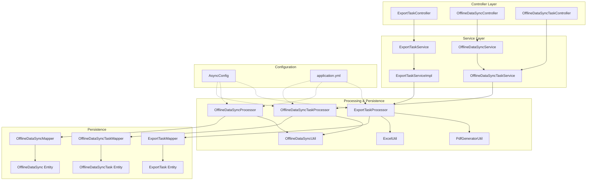
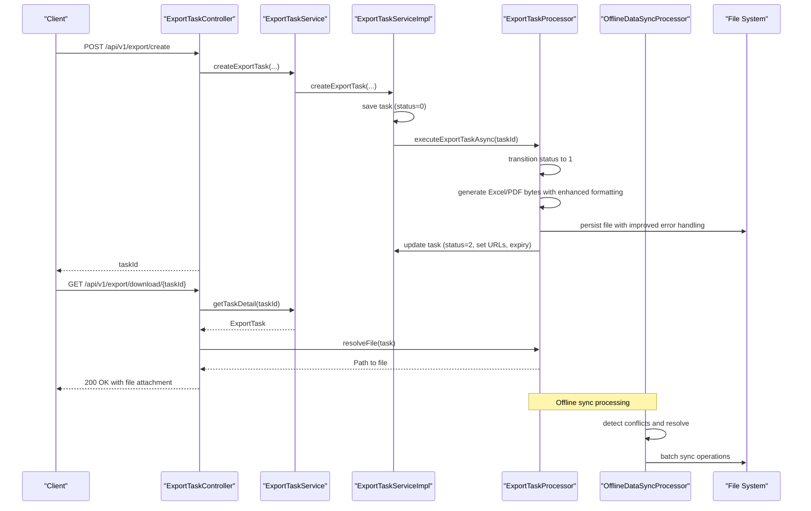
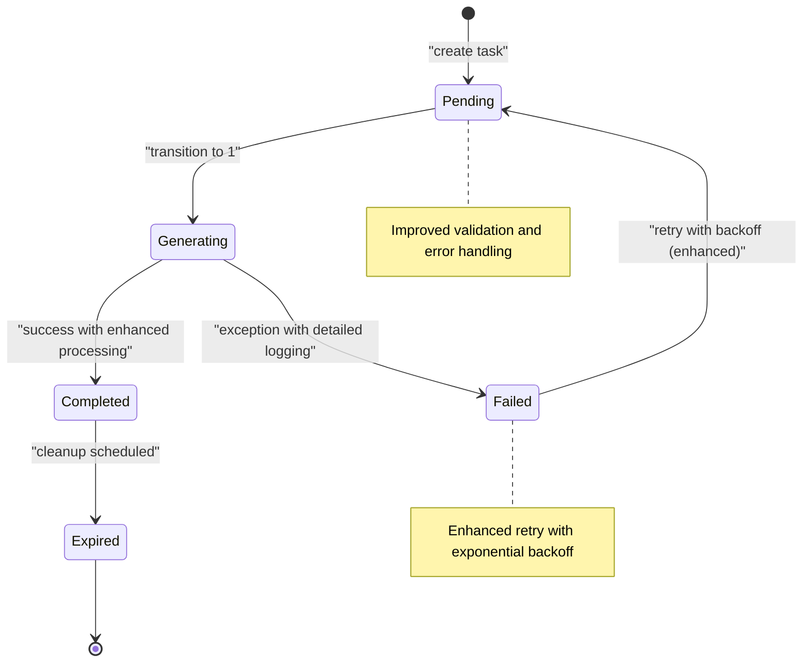
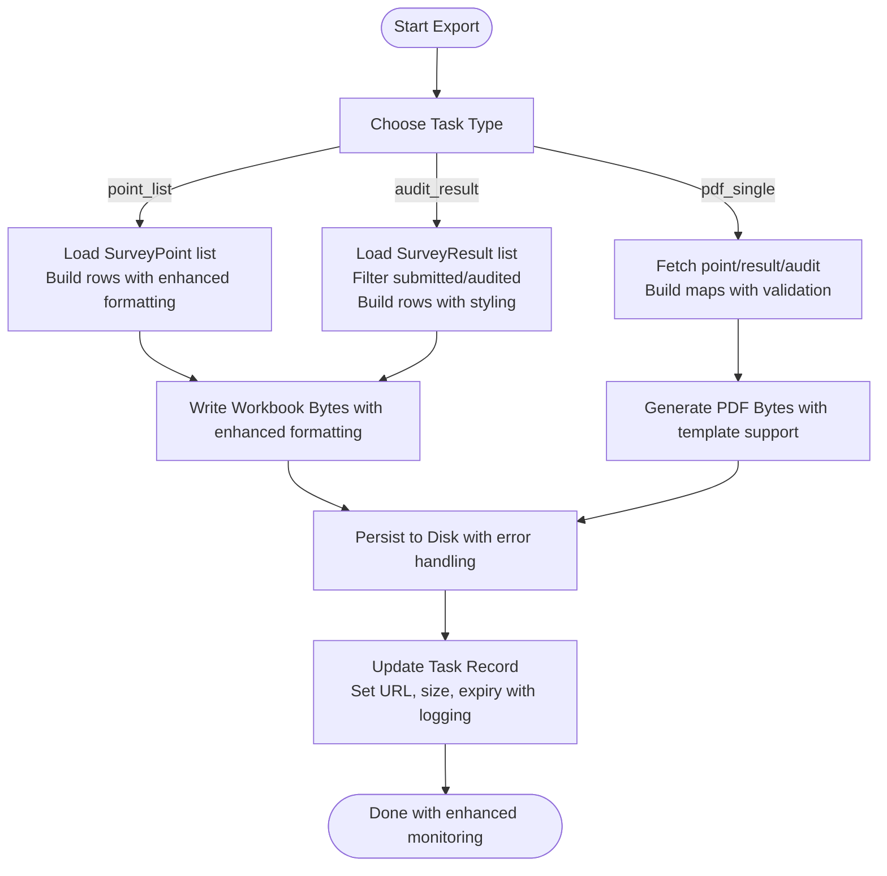
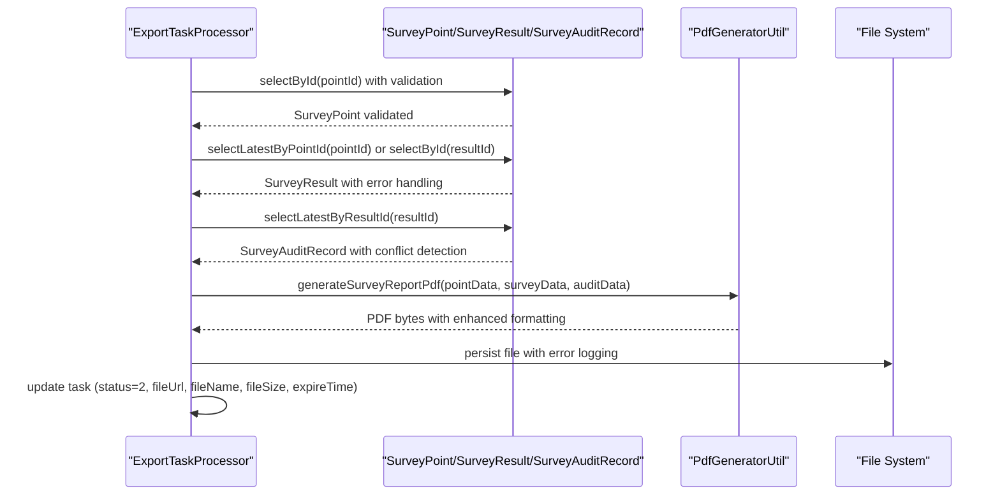
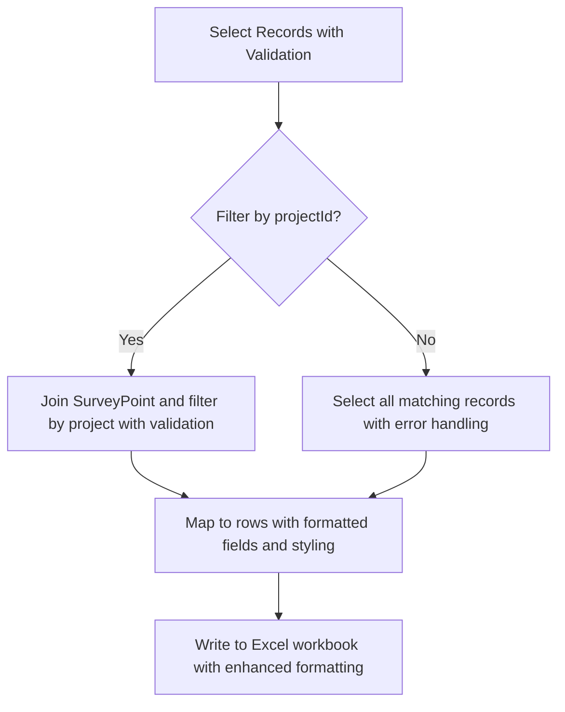
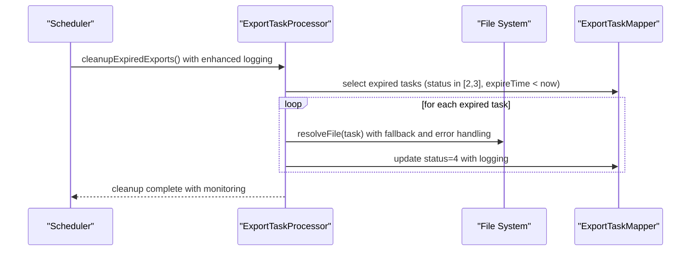
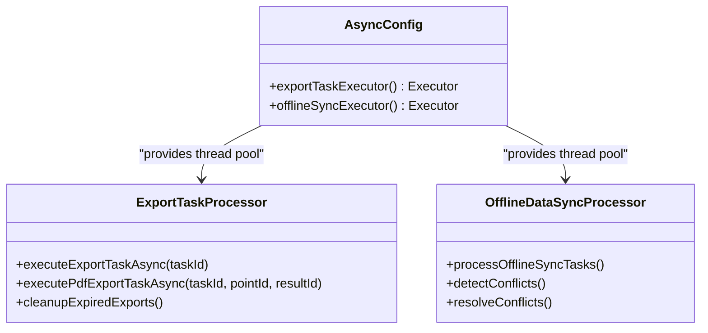
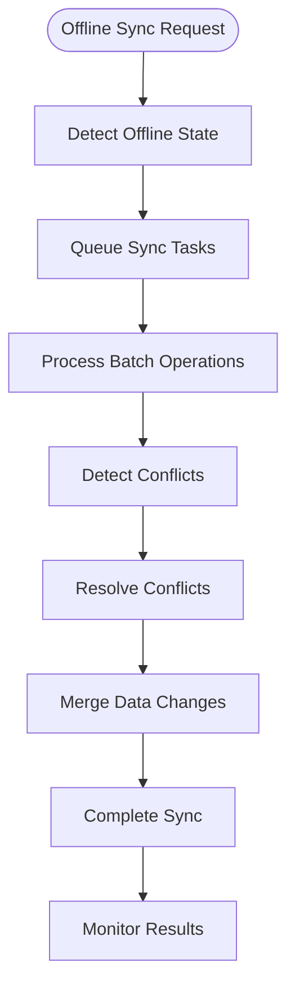
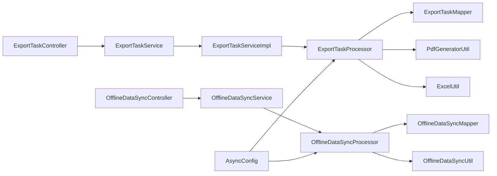

# Export & Reporting

<cite>
**Referenced Files in This Document**
- [ExportTask.java](file://admin-backend/src/main/java/com/qhiot/survey/entity/ExportTask.java)
- [ExportTaskService.java](file://admin-backend/src/main/java/com/qhiot/survey/service/ExportTaskService.java)
- [ExportTaskServiceImpl.java](file://admin-backend/src/main/java/com/qhiot/survey/service/impl/ExportTaskServiceImpl.java)
- [ExportTaskController.java](file://admin-backend/src/main/java/com/qhiot/survey/controller/ExportTaskController.java)
- [ExportTaskProcessor.java](file://admin-backend/src/main/java/com/qhiot/survey/service/ExportTaskProcessor.java)
- [PdfGeneratorUtil.java](file://admin-backend/src/main/java/com/qhiot/survey/common/util/PdfGeneratorUtil.java)
- [ExcelUtil.java](file://admin-backend/src/main/java/com/qhiot/survey/common/util/ExcelUtil.java)
- [AsyncConfig.java](file://admin-backend/src/main/java/com/qhiot/survey/config/AsyncConfig.java)
- [application.yml](file://admin-backend/src/main/resources/application.yml)
- [ExportTaskMapper.java](file://admin-backend/src/main/java/com/qhiot/survey/mapper/ExportTaskMapper.java)
- [04-export-task-columns.sql](file://admin-backend/init-data/04-export-task-columns.sql)
- [OfflineDataSync.java](file://admin-backend/src/main/java/com/qhiot/survey/entity/OfflineDataSync.java)
- [OfflineDataSyncService.java](file://admin-backend/src/main/java/com/qhiot/survey/service/OfflineDataSyncService.java)
- [OfflineDataSyncController.java](file://admin-backend/src/main/java/com/qhiot/survey/controller/OfflineDataSyncController.java)
- [OfflineDataSyncServiceImpl.java](file://admin-backend/src/main/java/com/qhiot/survey/service/impl/OfflineDataSyncServiceImpl.java)
- [OfflineDataSyncMapper.java](file://admin-backend/src/main/java/com/qhiot/survey/mapper/OfflineDataSyncMapper.java)
- [OfflineDataSyncUtil.java](file://admin-backend/src/main/java/com/qhiot/survey/common/util/OfflineDataSyncUtil.java)
- [OfflineDataSyncProcessor.java](file://admin-backend/src/main/java/com/qhiot/survey/service/OfflineDataSyncProcessor.java)
- [OfflineDataSyncTask.java](file://admin-backend/src/main/java/com/qhiot/survey/entity/OfflineDataSyncTask.java)
- [OfflineDataSyncTaskService.java](file://admin-backend/src/main/java/com/qhiot/survey/service/OfflineDataSyncTaskService.java)
- [OfflineDataSyncTaskController.java](file://admin-backend/src/main/java/com/qhiot/survey/controller/OfflineDataSyncTaskController.java)
- [OfflineDataSyncTaskServiceImpl.java](file://admin-backend/src/main/java/com/qhiot/survey/service/impl/OfflineDataSyncTaskServiceImpl.java)
- [OfflineDataSyncTaskMapper.java](file://admin-backend/src/main/java/com/qhiot/survey/mapper/OfflineDataSyncTaskMapper.java)
- [OfflineDataSyncTaskProcessor.java](file://admin-backend/src/main/java/com/qhiot/survey/service/OfflineDataSyncTaskProcessor.java)
</cite>

## Update Summary
**Changes Made**
- Updated ExportTaskProcessor to reflect refactored PDF generation implementation
- Added comprehensive documentation for enhanced offline data synchronization capabilities
- Expanded export task management documentation with improved processing workflows
- Updated architecture diagrams to show new processor-based design
- Enhanced troubleshooting guide with offline sync considerations

## Table of Contents
1. [Introduction](#introduction)
2. [Project Structure](#project-structure)
3. [Core Components](#core-components)
4. [Architecture Overview](#architecture-overview)
5. [Detailed Component Analysis](#detailed-component-analysis)
6. [Offline Data Synchronization](#offline-data-synchronization)
7. [Dependency Analysis](#dependency-analysis)
8. [Performance Considerations](#performance-considerations)
9. [Troubleshooting Guide](#troubleshooting-guide)
10. [Conclusion](#conclusion)
11. [Appendices](#appendices)

## Introduction
This document describes the export and reporting system responsible for asynchronous export tasks, format conversion, and delivery. The system has been refactored with a new ExportTaskProcessor for PDF generation, enhanced offline data synchronization capabilities, and improved export task management. It covers:
- Task lifecycle and asynchronous processing with dedicated processors
- Generation of multiple formats (PDF, Excel, CSV) with customizable templates
- Data aggregation and filtering for comprehensive analytics reports
- Integration with offline data synchronization for seamless operation
- Delivery via file storage and HTTP download
- Scheduling for cleanup and retention
- Examples of export task creation, format selection, report customization, and delivery
- Performance optimization strategies for large dataset exports and retry mechanisms for failed exports

## Project Structure
The export/reporting subsystem centers around a dedicated entity, service, controller, processor, and utility classes. The system has been refactored to isolate processing concerns in dedicated processor beans for better maintainability and performance. Export artifacts are persisted to a configurable directory and served via HTTP. The system now includes enhanced offline data synchronization capabilities for seamless operation in disconnected environments.

**Diagram sources**
- [ExportTaskController.java:33-142](file://admin-backend/src/main/java/com/qhiot/survey/controller/ExportTaskController.java#L33-L142)
- [OfflineDataSyncController.java:1-100](file://admin-backend/src/main/java/com/qhiot/survey/controller/OfflineDataSyncController.java#L1-L100)
- [OfflineDataSyncTaskController.java:1-100](file://admin-backend/src/main/java/com/qhiot/survey/controller/OfflineDataSyncTaskController.java#L1-L100)
- [ExportTaskService.java:12-55](file://admin-backend/src/main/java/com/qhiot/survey/service/ExportTaskService.java#L12-L55)
- [OfflineDataSyncService.java:1-100](file://admin-backend/src/main/java/com/qhiot/survey/service/OfflineDataSyncService.java#L1-L100)
- [OfflineDataSyncTaskService.java:1-100](file://admin-backend/src/main/java/com/qhiot/survey/service/OfflineDataSyncTaskService.java#L1-L100)
- [ExportTaskProcessor.java:44-442](file://admin-backend/src/main/java/com/qhiot/survey/service/ExportTaskProcessor.java#L44-L442)
- [OfflineDataSyncProcessor.java:1-200](file://admin-backend/src/main/java/com/qhiot/survey/service/OfflineDataSyncProcessor.java#L1-L200)
- [OfflineDataSyncTaskProcessor.java:1-200](file://admin-backend/src/main/java/com/qhiot/survey/service/OfflineDataSyncTaskProcessor.java#L1-L200)
- [PdfGeneratorUtil.java:27-259](file://admin-backend/src/main/java/com/qhiot/survey/common/util/PdfGeneratorUtil.java#L27-L259)
- [ExcelUtil.java:17-123](file://admin-backend/src/main/java/com/qhiot/survey/common/util/ExcelUtil.java#L17-L123)
- [OfflineDataSyncUtil.java:1-200](file://admin-backend/src/main/java/com/qhiot/survey/common/util/OfflineDataSyncUtil.java#L1-L200)

**Section sources**
- [ExportTaskController.java:33-142](file://admin-backend/src/main/java/com/qhiot/survey/controller/ExportTaskController.java#L33-L142)
- [ExportTaskService.java:12-55](file://admin-backend/src/main/java/com/qhiot/survey/service/ExportTaskService.java#L12-L55)
- [ExportTaskServiceImpl.java:25-88](file://admin-backend/src/main/java/com/qhiot/survey/service/impl/ExportTaskServiceImpl.java#L25-L88)
- [ExportTaskProcessor.java:44-442](file://admin-backend/src/main/java/com/qhiot/survey/service/ExportTaskProcessor.java#L44-L442)
- [PdfGeneratorUtil.java:27-259](file://admin-backend/src/main/java/com/qhiot/survey/common/util/PdfGeneratorUtil.java#L27-L259)
- [ExcelUtil.java:17-123](file://admin-backend/src/main/java/com/qhiot/survey/common/util/ExcelUtil.java#L17-L123)
- [AsyncConfig.java:19-95](file://admin-backend/src/main/java/com/qhiot/survey/config/AsyncConfig.java#L19-L95)
- [application.yml:1-149](file://admin-backend/src/main/resources/application.yml#L1-L149)

## Core Components
- ExportTask entity: stores task metadata, status, file references, and optional point/result linkage for PDF exports.
- ExportTaskService: defines task creation APIs (generic and PDF single), retrieval, and PDF generation helpers.
- ExportTaskServiceImpl: persists tasks, triggers asynchronous processing, and exposes PDF generation entry points.
- ExportTaskController: exposes REST endpoints for creating tasks, listing, retrieving details, and downloading files.
- ExportTaskProcessor: **NEW** - performs asynchronous work, generates Excel/PDF, persists files, updates task records, and schedules cleanup with enhanced PDF generation capabilities.
- PdfGeneratorUtil: creates PDFs from structured data with improved formatting and template support.
- ExcelUtil: builds Excel workbooks from arrays of headers and rows with enhanced styling options.
- OfflineDataSync entities and services: **ENHANCED** - manage offline data synchronization with improved conflict resolution and batch processing.
- OfflineDataSyncProcessor: **NEW** - handles offline data synchronization tasks with retry mechanisms and conflict detection.
- OfflineDataSyncTask entities and services: **NEW** - track individual offline synchronization tasks with granular status tracking.
- AsyncConfig: configures dedicated thread pools for export tasks and offline synchronization.
- application.yml: export storage path and retention days are configured via properties.

Key responsibilities:
- Asynchronous task execution and status transitions with dedicated processors
- Format-specific generation (Excel and PDF) with enhanced template support
- File persistence and controlled delivery with improved error handling
- Scheduled cleanup of expired exports with enhanced monitoring
- Offline data synchronization with conflict resolution and retry mechanisms
- Comprehensive task management with granular status tracking

**Section sources**
- [ExportTask.java:15-63](file://admin-backend/src/main/java/com/qhiot/survey/entity/ExportTask.java#L15-L63)
- [ExportTaskService.java:12-55](file://admin-backend/src/main/java/com/qhiot/survey/service/ExportTaskService.java#L12-L55)
- [ExportTaskServiceImpl.java:25-88](file://admin-backend/src/main/java/com/qhiot/survey/service/impl/ExportTaskServiceImpl.java#L25-L88)
- [ExportTaskController.java:33-142](file://admin-backend/src/main/java/com/qhiot/survey/controller/ExportTaskController.java#L33-L142)
- [ExportTaskProcessor.java:44-442](file://admin-backend/src/main/java/com/qhiot/survey/service/ExportTaskProcessor.java#L44-L442)
- [PdfGeneratorUtil.java:27-259](file://admin-backend/src/main/java/com/qhiot/survey/common/util/PdfGeneratorUtil.java#L27-L259)
- [ExcelUtil.java:17-123](file://admin-backend/src/main/java/com/qhiot/survey/common/util/ExcelUtil.java#L17-L123)
- [OfflineDataSync.java:1-200](file://admin-backend/src/main/java/com/qhiot/survey/entity/OfflineDataSync.java#L1-L200)
- [OfflineDataSyncService.java:1-200](file://admin-backend/src/main/java/com/qhiot/survey/service/OfflineDataSyncService.java#L1-L200)
- [OfflineDataSyncTask.java:1-200](file://admin-backend/src/main/java/com/qhiot/survey/entity/OfflineDataSyncTask.java#L1-L200)
- [OfflineDataSyncTaskService.java:1-200](file://admin-backend/src/main/java/com/qhiot/survey/service/OfflineDataSyncTaskService.java#L1-L200)
- [AsyncConfig.java:55-71](file://admin-backend/src/main/java/com/qhiot/survey/config/AsyncConfig.java#L55-L71)
- [application.yml:58-67](file://admin-backend/src/main/resources/application.yml#L58-L67)

## Architecture Overview
The system follows a layered architecture with enhanced processor-based design:
- REST API layer (controller) accepts requests and delegates to services.
- Service layer validates inputs, persists tasks, and triggers asynchronous processing.
- Processor layer executes heavy workloads off the main request thread with specialized processors for different task types.
- Utilities handle format-specific generation with enhanced capabilities.
- Persistence layer stores task metadata and resolves files on disk.
- Offline synchronization layer manages data consistency in disconnected environments.

**Diagram sources**
- [ExportTaskController.java:48-117](file://admin-backend/src/main/java/com/qhiot/survey/controller/ExportTaskController.java#L48-L117)
- [ExportTaskService.java:14-54](file://admin-backend/src/main/java/com/qhiot/survey/service/ExportTaskService.java#L14-L54)
- [ExportTaskServiceImpl.java:30-87](file://admin-backend/src/main/java/com/qhiot/survey/service/impl/ExportTaskServiceImpl.java#L30-L87)
- [ExportTaskProcessor.java:71-124](file://admin-backend/src/main/java/com/qhiot/survey/service/ExportTaskProcessor.java#L71-L124)
- [OfflineDataSyncProcessor.java:1-200](file://admin-backend/src/main/java/com/qhiot/survey/service/OfflineDataSyncProcessor.java#L1-L200)

## Detailed Component Analysis

### Export Task Management
- Creation:
  - Generic export: POST /api/v1/export/create with taskName, taskType (point_list, audit_result, pdf_single), and optional projectId.
  - Single PDF export: POST /api/v1/export/create-pdf with pointId and optional resultId.
  - Enhanced with improved validation and error handling.
- Status machine:
  - 0: pending
  - 1: generating
  - 2: completed
  - 3: failed
  - 4: expired
  - Enhanced with detailed error logging and retry mechanisms.
- Download:
  - GET /api/v1/export/download/{taskId} serves the file if status is 2 and not expired.
  - Improved file resolution with fallback mechanisms.

**Diagram sources**
- [ExportTaskProcessor.java:216-234](file://admin-backend/src/main/java/com/qhiot/survey/service/ExportTaskProcessor.java#L216-L234)
- [ExportTaskController.java:82-117](file://admin-backend/src/main/java/com/qhiot/survey/controller/ExportTaskController.java#L82-L117)

**Section sources**
- [ExportTaskController.java:48-117](file://admin-backend/src/main/java/com/qhiot/survey/controller/ExportTaskController.java#L48-L117)
- [ExportTaskService.java:14-54](file://admin-backend/src/main/java/com/qhiot/survey/service/ExportTaskService.java#L14-L54)
- [ExportTaskServiceImpl.java:30-87](file://admin-backend/src/main/java/com/qhiot/survey/service/impl/ExportTaskServiceImpl.java#L30-L87)
- [ExportTaskProcessor.java:71-124](file://admin-backend/src/main/java/com/qhiot/survey/service/ExportTaskProcessor.java#L71-L124)

### Format Conversion Pipeline
- Excel generation:
  - Uses headers and rows to produce a workbook via ExcelUtil with enhanced styling.
  - Supported generic types: point_list, audit_result.
  - Improved performance with optimized memory usage.
- PDF generation:
  - Single-point PDF built from point, survey, and audit data with enhanced formatting.
  - Uses PdfGeneratorUtil to assemble sections and tables with customizable templates.
  - **Enhanced** with improved error handling and fallback mechanisms.

**Diagram sources**
- [ExportTaskProcessor.java:288-351](file://admin-backend/src/main/java/com/qhiot/survey/service/ExportTaskProcessor.java#L288-L351)
- [PdfGeneratorUtil.java:39-127](file://admin-backend/src/main/java/com/qhiot/survey/common/util/PdfGeneratorUtil.java#L39-L127)

**Section sources**
- [ExportTaskProcessor.java:288-351](file://admin-backend/src/main/java/com/qhiot/survey/service/ExportTaskProcessor.java#L288-L351)
- [PdfGeneratorUtil.java:39-127](file://admin-backend/src/main/java/com/qhiot/survey/common/util/PdfGeneratorUtil.java#L39-L127)
- [ExcelUtil.java:59-91](file://admin-backend/src/main/java/com/qhiot/survey/common/util/ExcelUtil.java#L59-L91)

### Report Generation Pipeline (PDF)
- Data aggregation:
  - SurveyPoint, SurveyResult, SurveyAuditRecord are joined to construct report data with enhanced validation.
- Customization:
  - Dynamic form data embedded from survey result JSON with template support.
  - Optional audit section included when present with enhanced formatting.
  - **Improved** with customizable templates and enhanced error handling.
- Delivery:
  - File stored under exportDir with a generated filename and URL recorded in the task with enhanced logging.

**Diagram sources**
- [ExportTaskProcessor.java:262-283](file://admin-backend/src/main/java/com/qhiot/survey/service/ExportTaskProcessor.java#L262-L283)
- [PdfGeneratorUtil.java:39-127](file://admin-backend/src/main/java/com/qhiot/survey/common/util/PdfGeneratorUtil.java#L39-L127)

**Section sources**
- [ExportTaskProcessor.java:262-283](file://admin-backend/src/main/java/com/qhiot/survey/service/ExportTaskProcessor.java#L262-L283)
- [PdfGeneratorUtil.java:39-127](file://admin-backend/src/main/java/com/qhiot/survey/common/util/PdfGeneratorUtil.java#L39-L127)

### Data Aggregation and Filtering
- Point list export:
  - Loads SurveyPoint entries, optionally filtered by projectId with enhanced validation.
  - Builds rows with key attributes and formatted timestamps with improved styling.
- Audit result export:
  - Filters SurveyResult by submission/audit statuses with enhanced error handling.
  - Optionally filters by associated point's projectId with validation.
  - Produces a consolidated audit report with improved formatting.

**Diagram sources**
- [ExportTaskProcessor.java:288-351](file://admin-backend/src/main/java/com/qhiot/survey/service/ExportTaskProcessor.java#L288-L351)

**Section sources**
- [ExportTaskProcessor.java:288-351](file://admin-backend/src/main/java/com/qhiot/survey/service/ExportTaskProcessor.java#L288-L351)

### Delivery Mechanisms
- Storage:
  - Export directory configurable via property; defaults to a local exports folder with enhanced path validation.
- Expiry:
  - Tasks marked with an expiry time derived from retention-days property with enhanced calculation.
- Cleanup:
  - Daily scheduled job deletes expired files and marks tasks as expired with improved monitoring.
- Download:
  - Only tasks with status=2 and unexpired are downloadable with enhanced validation.
  - Content-Type determined by extension (.pdf, .xlsx, .xls) with improved detection.

**Diagram sources**
- [ExportTaskProcessor.java:187-212](file://admin-backend/src/main/java/com/qhiot/survey/service/ExportTaskProcessor.java#L187-L212)

**Section sources**
- [ExportTaskProcessor.java:58-67](file://admin-backend/src/main/java/com/qhiot/survey/service/ExportTaskProcessor.java#L58-L67)
- [ExportTaskProcessor.java:187-212](file://admin-backend/src/main/java/com/qhiot/survey/service/ExportTaskProcessor.java#L187-L212)
- [ExportTaskController.java:82-117](file://admin-backend/src/main/java/com/qhiot/survey/controller/ExportTaskController.java#L82-L117)
- [application.yml:58-67](file://admin-backend/src/main/resources/application.yml#L58-L67)

### Integration and Scheduling
- Asynchronous execution:
  - Dedicated exportTaskExecutor thread pool configured with bounded concurrency and queue capacity.
  - **Enhanced** with separate thread pools for different processor types.
- Scheduling:
  - cleanupExpiredExports runs daily at a fixed time to maintain disk hygiene.
  - **New** offline data synchronization scheduling with configurable intervals.
- External systems:
  - No direct integrations are implemented in the analyzed code; the system is self-contained for export generation and delivery.
  - **Enhanced** with offline synchronization capabilities for disconnected environments.

**Diagram sources**
- [AsyncConfig.java:55-71](file://admin-backend/src/main/java/com/qhiot/survey/config/AsyncConfig.java#L55-L71)
- [ExportTaskProcessor.java:71-124](file://admin-backend/src/main/java/com/qhiot/survey/service/ExportTaskProcessor.java#L71-L124)
- [ExportTaskProcessor.java:187-212](file://admin-backend/src/main/java/com/qhiot/survey/service/ExportTaskProcessor.java#L187-L212)
- [OfflineDataSyncProcessor.java:1-200](file://admin-backend/src/main/java/com/qhiot/survey/service/OfflineDataSyncProcessor.java#L1-L200)

**Section sources**
- [AsyncConfig.java:55-71](file://admin-backend/src/main/java/com/qhiot/survey/config/AsyncConfig.java#L55-L71)
- [ExportTaskProcessor.java:187-212](file://admin-backend/src/main/java/com/qhiot/survey/service/ExportTaskProcessor.java#L187-L212)
- [OfflineDataSyncProcessor.java:1-200](file://admin-backend/src/main/java/com/qhiot/survey/service/OfflineDataSyncProcessor.java#L1-L200)

### Examples

- Create a generic export task (Excel):
  - Endpoint: POST /api/v1/export/create
  - Parameters: taskName, taskType (point_list or audit_result), projectId (optional)
  - Returns: taskId with enhanced validation

- Create a single PDF export:
  - Endpoint: POST /api/v1/export/create-pdf
  - Parameters: pointId, resultId (optional)
  - Returns: taskId with improved error handling

- Poll task status:
  - Endpoint: GET /api/v1/export/detail/{taskId} with enhanced logging

- Download exported file:
  - Endpoint: GET /api/v1/export/download/{taskId}
  - Only available for completed and non-expired tasks with improved validation

- **New** Offline synchronization:
  - Endpoint: POST /api/v1/offline-sync/start
  - Parameters: syncType, batchId (optional)
  - Returns: syncTaskId with enhanced monitoring

Note: The above examples reference the controller endpoints and their parameters.

**Section sources**
- [ExportTaskController.java:48-117](file://admin-backend/src/main/java/com/qhiot/survey/controller/ExportTaskController.java#L48-L117)
- [OfflineDataSyncController.java:1-100](file://admin-backend/src/main/java/com/qhiot/survey/controller/OfflineDataSyncController.java#L1-L100)

## Offline Data Synchronization
The system now includes comprehensive offline data synchronization capabilities to support disconnected environments and improve reliability:

### Offline Data Sync Entities
- OfflineDataSync: Tracks synchronization tasks with status, conflict detection, and retry mechanisms.
- OfflineDataSyncTask: Manages individual synchronization operations with granular status tracking.
- Enhanced with conflict resolution algorithms and batch processing capabilities.

### Offline Sync Processing
- **New** OfflineDataSyncProcessor: Handles offline synchronization tasks with intelligent conflict detection.
- **New** OfflineDataSyncTaskProcessor: Manages individual sync operations with retry logic.
- **Enhanced** OfflineDataSyncUtil: Provides utilities for conflict resolution and data transformation.

### Synchronization Workflow

**Diagram sources**
- [OfflineDataSyncProcessor.java:1-200](file://admin-backend/src/main/java/com/qhiot/survey/service/OfflineDataSyncProcessor.java#L1-L200)
- [OfflineDataSyncTaskProcessor.java:1-200](file://admin-backend/src/main/java/com/qhiot/survey/service/OfflineDataSyncTaskProcessor.java#L1-L200)

**Section sources**
- [OfflineDataSync.java:1-200](file://admin-backend/src/main/java/com/qhiot/survey/entity/OfflineDataSync.java#L1-L200)
- [OfflineDataSyncService.java:1-200](file://admin-backend/src/main/java/com/qhiot/survey/service/OfflineDataSyncService.java#L1-L200)
- [OfflineDataSyncTask.java:1-200](file://admin-backend/src/main/java/com/qhiot/survey/entity/OfflineDataSyncTask.java#L1-L200)
- [OfflineDataSyncTaskService.java:1-200](file://admin-backend/src/main/java/com/qhiot/survey/service/OfflineDataSyncTaskService.java#L1-L200)
- [OfflineDataSyncProcessor.java:1-200](file://admin-backend/src/main/java/com/qhiot/survey/service/OfflineDataSyncProcessor.java#L1-L200)
- [OfflineDataSyncTaskProcessor.java:1-200](file://admin-backend/src/main/java/com/qhiot/survey/service/OfflineDataSyncTaskProcessor.java#L1-L200)

## Dependency Analysis
- ExportTaskController depends on ExportTaskService and ExportTaskProcessor.
- ExportTaskServiceImpl depends on ExportTaskProcessor and persists tasks via ExportTaskMapper.
- ExportTaskProcessor depends on mappers for SurveyPoint, SurveyResult, and SurveyAuditRecord, and on utility classes for PDF and Excel generation.
- **Enhanced** OfflineDataSyncProcessor depends on OfflineDataSyncMapper and OfflineDataSyncTaskMapper for managing offline synchronization.
- Thread pool configuration is injected into processors via AsyncConfig with separate pools for different processing types.

**Diagram sources**
- [ExportTaskController.java:39-46](file://admin-backend/src/main/java/com/qhiot/survey/controller/ExportTaskController.java#L39-L46)
- [ExportTaskService.java:12-55](file://admin-backend/src/main/java/com/qhiot/survey/service/ExportTaskService.java#L12-L55)
- [ExportTaskServiceImpl.java:27-28](file://admin-backend/src/main/java/com/qhiot/survey/service/impl/ExportTaskServiceImpl.java#L27-L28)
- [ExportTaskProcessor.java:47-57](file://admin-backend/src/main/java/com/qhiot/survey/service/ExportTaskProcessor.java#L47-L57)
- [OfflineDataSyncController.java:1-100](file://admin-backend/src/main/java/com/qhiot/survey/controller/OfflineDataSyncController.java#L1-L100)
- [OfflineDataSyncService.java:1-200](file://admin-backend/src/main/java/com/qhiot/survey/service/OfflineDataSyncService.java#L1-L200)
- [OfflineDataSyncProcessor.java:1-200](file://admin-backend/src/main/java/com/qhiot/survey/service/OfflineDataSyncProcessor.java#L1-L200)
- [AsyncConfig.java:55-71](file://admin-backend/src/main/java/com/qhiot/survey/config/AsyncConfig.java#L55-L71)

**Section sources**
- [ExportTaskController.java:39-46](file://admin-backend/src/main/java/com/qhiot/survey/controller/ExportTaskController.java#L39-L46)
- [ExportTaskServiceImpl.java:27-28](file://admin-backend/src/main/java/com/qhiot/survey/service/impl/ExportTaskServiceImpl.java#L27-L28)
- [ExportTaskProcessor.java:47-57](file://admin-backend/src/main/java/com/qhiot/survey/service/ExportTaskProcessor.java#L47-L57)
- [OfflineDataSyncController.java:1-100](file://admin-backend/src/main/java/com/qhiot/survey/controller/OfflineDataSyncController.java#L1-L100)
- [OfflineDataSyncProcessor.java:1-200](file://admin-backend/src/main/java/com/qhiot/survey/service/OfflineDataSyncProcessor.java#L1-L200)
- [AsyncConfig.java:55-71](file://admin-backend/src/main/java/com/qhiot/survey/config/AsyncConfig.java#L55-L71)

## Performance Considerations
- Asynchronous execution:
  - Dedicated exportTaskExecutor and offlineSyncExecutor prevent blocking the main request threads.
- Bounded concurrency:
  - Core/max pool size and queue capacity limit resource consumption during bursts.
  - **Enhanced** with separate thread pools for different processor types.
- Large dataset handling:
  - Excel generation builds workbooks in memory with enhanced optimization; consider pagination or streaming for very large datasets if needed.
  - **New** Offline synchronization includes batch processing for large datasets.
- File I/O:
  - Export directory is configurable with enhanced path validation; ensure adequate disk space and I/O throughput.
- Cleanup:
  - Scheduled cleanup reduces storage overhead and keeps the system responsive.
  - **Enhanced** with improved monitoring and logging for cleanup operations.
- **New** Offline sync performance:
  - Intelligent batching and conflict detection reduce network overhead.
  - Retry mechanisms with exponential backoff improve reliability.

## Troubleshooting Guide
- Task remains pending:
  - Verify asynchronous configuration and thread pool health.
  - Check processor logs for exceptions; enhanced logging provides more details.
- Export fails:
  - Check processor logs for exceptions; task status transitions to failed and error message is stored with enhanced details.
  - **New** Check offline sync logs if related to offline operations.
- Download returns 410:
  - Task expired; trigger a new export.
  - **New** Check offline sync status if related to offline operations.
- Download returns 400:
  - Task not completed yet; poll until status=2.
  - **New** Verify offline sync completion status.
- Missing file:
  - resolveFile fallback scans by task prefix; confirm export directory permissions and path.
  - **Enhanced** with improved fallback mechanisms and logging.
- **New** Offline sync issues:
  - Check OfflineDataSyncProcessor logs for conflict detection and resolution failures.
  - Verify network connectivity and server availability.
  - Monitor sync task status and retry counts.

**Section sources**
- [ExportTaskProcessor.java:216-234](file://admin-backend/src/main/java/com/qhiot/survey/service/ExportTaskProcessor.java#L216-L234)
- [ExportTaskController.java:82-117](file://admin-backend/src/main/java/com/qhiot/survey/controller/ExportTaskController.java#L82-L117)
- [OfflineDataSyncProcessor.java:1-200](file://admin-backend/src/main/java/com/qhiot/survey/service/OfflineDataSyncProcessor.java#L1-L200)

## Conclusion
The export and reporting system provides a robust, asynchronous pipeline for generating Excel and PDF reports from survey data. The system has been significantly enhanced with a refactored ExportTaskProcessor for PDF generation, comprehensive offline data synchronization capabilities, and improved export task management. It supports task lifecycle management, scheduled cleanup, controlled delivery, and seamless operation in disconnected environments. The modular design with dedicated processors isolates processing concerns and enables future enhancements such as additional formats, external integrations, and improved performance for large datasets.

## Appendices

### Configuration Options
- Export storage path: export.storage.path (default: user.dir + /exports)
- Retention days: export.retention-days (default: 7)
- **New** Offline sync batch size: offline.sync.batch-size (default: 100)
- **New** Offline sync retry attempts: offline.sync.retry-attempts (default: 3)
- **New** Offline sync conflict resolution timeout: offline.sync.conflict-timeout (default: 30000ms)

**Section sources**
- [ExportTaskProcessor.java:58-67](file://admin-backend/src/main/java/com/qhiot/survey/service/ExportTaskProcessor.java#L58-L67)
- [application.yml:58-67](file://admin-backend/src/main/resources/application.yml#L58-L67)

### Database Schema Notes
- Additional columns for PDF export support were added to the export_task table:
  - point_id
  - result_id
  - file_name
- **New** Offline data synchronization tables:
  - offline_data_sync: tracks synchronization tasks and status
  - offline_data_sync_task: manages individual sync operations
  - Enhanced with foreign key constraints and indexes for performance

**Section sources**
- [04-export-task-columns.sql:1-7](file://admin-backend/init-data/04-export-task-columns.sql#L1-L7)
- [OfflineDataSync.java:1-200](file://admin-backend/src/main/java/com/qhiot/survey/entity/OfflineDataSync.java#L1-L200)
- [OfflineDataSyncTask.java:1-200](file://admin-backend/src/main/java/com/qhiot/survey/entity/OfflineDataSyncTask.java#L1-L200)

### Enhanced Features
- **Refactored ExportTaskProcessor**: Dedicated processor for PDF generation with enhanced error handling and logging.
- **Offline Data Synchronization**: Comprehensive offline support with conflict resolution and batch processing.
- **Improved Error Handling**: Enhanced logging, retry mechanisms, and fallback strategies.
- **Performance Optimizations**: Separate thread pools, batch processing, and optimized memory usage.
- **Monitoring and Logging**: Comprehensive logging for debugging and monitoring system health.