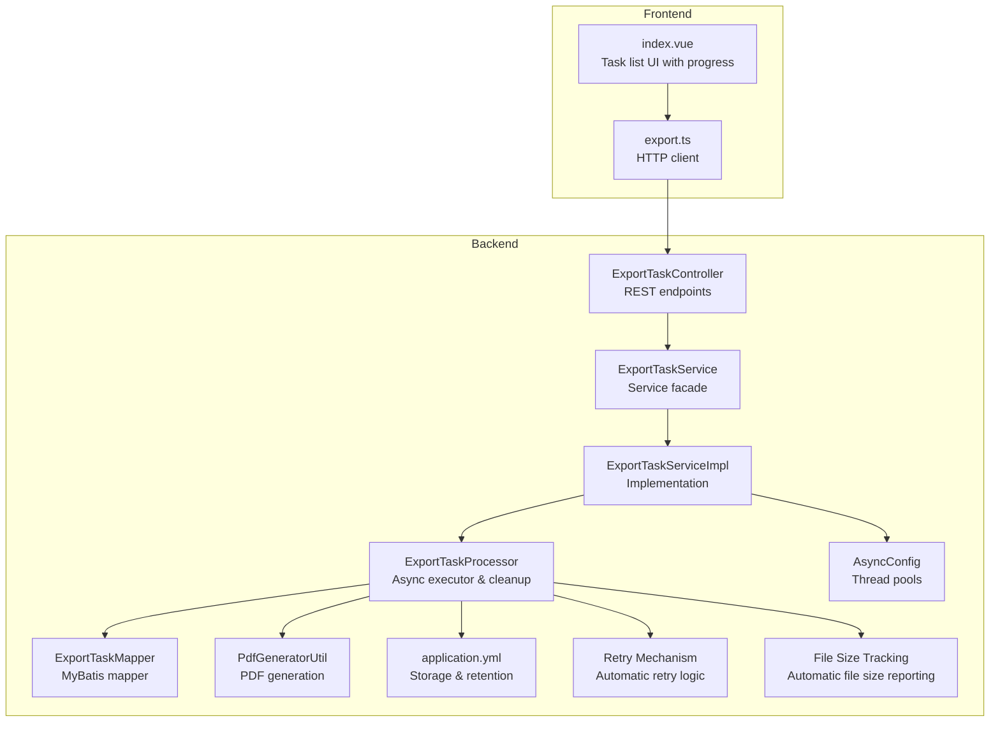
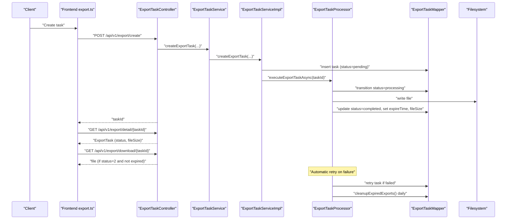
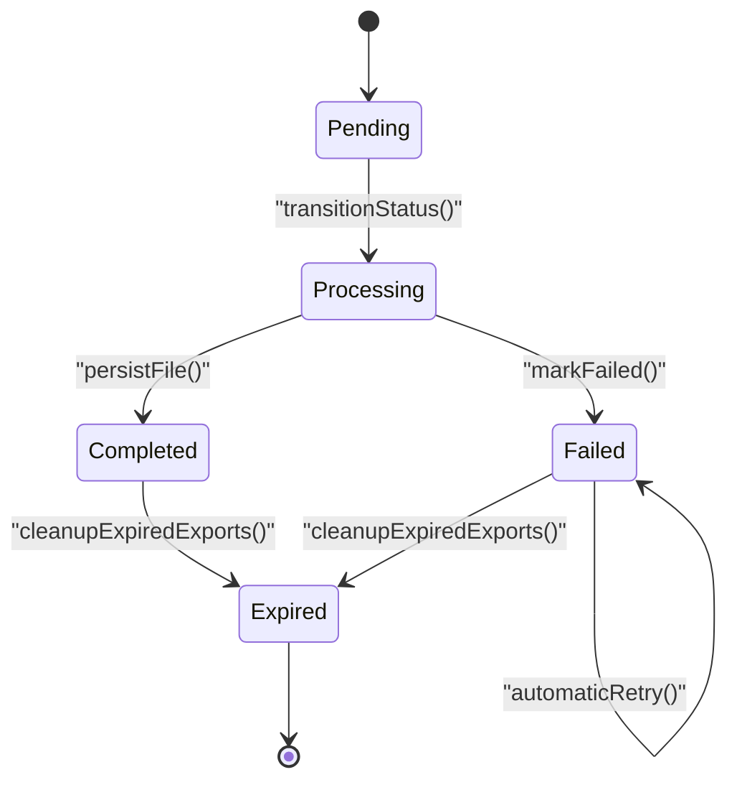
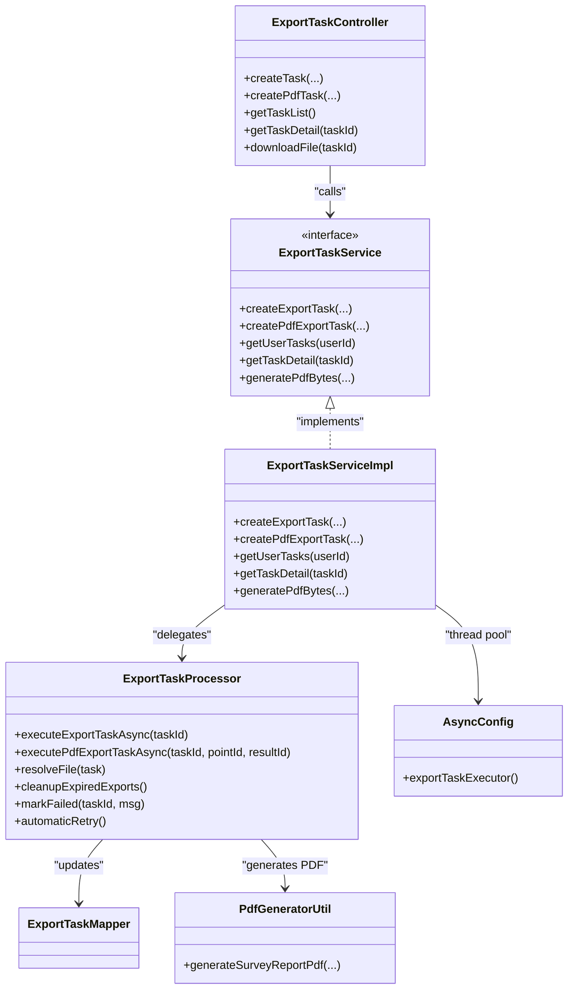

# Export Task Management

<cite>
**Referenced Files in This Document**
- [ExportTask.java](file://admin-backend/src/main/java/com/qhiot/survey/entity/ExportTask.java)
- [ExportTaskController.java](file://admin-backend/src/main/java/com/qhiot/survey/controller/ExportTaskController.java)
- [ExportTaskService.java](file://admin-backend/src/main/java/com/qhiot/survey/service/ExportTaskService.java)
- [ExportTaskServiceImpl.java](file://admin-backend/src/main/java/com/qhiot/survey/service/impl/ExportTaskServiceImpl.java)
- [ExportTaskProcessor.java](file://admin-backend/src/main/java/com/qhiot/survey/service/ExportTaskProcessor.java)
- [ExportTaskMapper.java](file://admin-backend/src/main/java/com/qhiot/survey/mapper/ExportTaskMapper.java)
- [AsyncConfig.java](file://admin-backend/src/main/java/com/qhiot/survey/config/AsyncConfig.java)
- [PdfGeneratorUtil.java](file://admin-backend/src/main/java/com/qhiot/survey/common/util/PdfGeneratorUtil.java)
- [04-export-task-columns.sql](file://admin-backend/init-data/04-export-task-columns.sql)
- [application.yml](file://admin-backend/src/main/resources/application.yml)
- [export.ts](file://admin-web-soybean/src/service/api/export.ts)
- [index.vue](file://admin-web-soybean/src/views/export/list/index.vue)
- [SysTaskController.java](file://admin-backend/src/main/java/com/qhiot/survey/controller/SysTaskController.java)
</cite>

## Update Summary
**Changes Made**
- Added comprehensive retry functionality for failed export tasks
- Enhanced file size reporting with automatic file size tracking
- Improved task management interface with progress visualization
- Strengthened automatic cleanup mechanism for expired export files
- Updated task status tracking with enhanced error handling

## Table of Contents
1. [Introduction](#introduction)
2. [Project Structure](#project-structure)
3. [Core Components](#core-components)
4. [Architecture Overview](#architecture-overview)
5. [Detailed Component Analysis](#detailed-component-analysis)
6. [Dependency Analysis](#dependency-analysis)
7. [Performance Considerations](#performance-considerations)
8. [Troubleshooting Guide](#troubleshooting-guide)
9. [Conclusion](#conclusion)
10. [Appendices](#appendices)

## Introduction
This document describes the export task management system responsible for asynchronous generation of reports and datasets. It covers the lifecycle from creation to completion, supported task types, status tracking, user assignment, API endpoints, querying and filtering, status codes, expiration and cleanup, concurrency controls, retry functionality, and practical examples for programmatic usage.

## Project Structure
The export task system spans backend Java services and controllers, a dedicated processor for asynchronous work, and a frontend Vue module for listing and downloading tasks. Configuration defines thread pools and storage locations.

**Diagram sources**
- [ExportTaskController.java:33-142](file://admin-backend/src/main/java/com/qhiot/survey/controller/ExportTaskController.java#L33-L142)
- [ExportTaskService.java:12-56](file://admin-backend/src/main/java/com/qhiot/survey/service/ExportTaskService.java#L12-L56)
- [ExportTaskServiceImpl.java:25-89](file://admin-backend/src/main/java/com/qhiot/survey/service/impl/ExportTaskServiceImpl.java#L25-L89)
- [ExportTaskProcessor.java:43-443](file://admin-backend/src/main/java/com/qhiot/survey/service/ExportTaskProcessor.java#L43-L443)
- [ExportTaskMapper.java:1-9](file://admin-backend/src/main/java/com/qhiot/survey/mapper/ExportTaskMapper.java#L1-L9)
- [PdfGeneratorUtil.java:27-259](file://admin-backend/src/main/java/com/qhiot/survey/common/util/PdfGeneratorUtil.java#L27-L259)
- [AsyncConfig.java:19-96](file://admin-backend/src/main/java/com/qhiot/survey/config/AsyncConfig.java#L19-L96)
- [application.yml:59-66](file://admin-backend/src/main/resources/application.yml#L59-L66)
- [export.ts:1-79](file://admin-web-soybean/src/service/api/export.ts#L1-L79)
- [index.vue:1-322](file://admin-web-soybean/src/views/export/list/index.vue#L1-L322)

**Section sources**
- [ExportTaskController.java:33-142](file://admin-backend/src/main/java/com/qhiot/survey/controller/ExportTaskController.java#L33-L142)
- [ExportTaskService.java:12-56](file://admin-backend/src/main/java/com/qhiot/survey/service/ExportTaskService.java#L12-L56)
- [ExportTaskServiceImpl.java:25-89](file://admin-backend/src/main/java/com/qhiot/survey/service/impl/ExportTaskServiceImpl.java#L25-L89)
- [ExportTaskProcessor.java:43-443](file://admin-backend/src/main/java/com/qhiot/survey/service/ExportTaskProcessor.java#L43-L443)
- [AsyncConfig.java:55-71](file://admin-backend/src/main/java/com/qhiot/survey/config/AsyncConfig.java#L55-L71)
- [application.yml:59-66](file://admin-backend/src/main/resources/application.yml#L59-L66)
- [export.ts:1-79](file://admin-web-soybean/src/service/api/export.ts#L1-L79)
- [index.vue:1-322](file://admin-web-soybean/src/views/export/list/index.vue#L1-L322)

## Core Components
- ExportTask entity: stores task metadata, type, status, file references, file size, and timestamps.
- ExportTaskController: exposes REST endpoints for creating tasks, querying details, listing user tasks, and downloading files.
- ExportTaskService and ExportTaskServiceImpl: define and implement task creation, retrieval, and PDF generation.
- ExportTaskProcessor: executes asynchronous export workloads, persists files, updates statuses, schedules cleanup, and handles retries.
- AsyncConfig: defines dedicated thread pools for export tasks.
- PdfGeneratorUtil: generates PDF bytes for single-point survey reports.
- Frontend export.ts and index.vue: provide API bindings and UI for listing, filtering, and downloading tasks with progress visualization.

**Section sources**
- [ExportTask.java:15-63](file://admin-backend/src/main/java/com/qhiot/survey/entity/ExportTask.java#L15-L63)
- [ExportTaskController.java:48-141](file://admin-backend/src/main/java/com/qhiot/survey/controller/ExportTaskController.java#L48-L141)
- [ExportTaskService.java:12-56](file://admin-backend/src/main/java/com/qhiot/survey/service/ExportTaskService.java#L12-L56)
- [ExportTaskServiceImpl.java:30-87](file://admin-backend/src/main/java/com/qhiot/survey/service/impl/ExportTaskServiceImpl.java#L30-L87)
- [ExportTaskProcessor.java:71-212](file://admin-backend/src/main/java/com/qhiot/survey/service/ExportTaskProcessor.java#L71-L212)
- [AsyncConfig.java:55-71](file://admin-backend/src/main/java/com/qhiot/survey/config/AsyncConfig.java#L55-L71)
- [PdfGeneratorUtil.java:39-127](file://admin-backend/src/main/java/com/qhiot/survey/common/util/PdfGeneratorUtil.java#L39-L127)
- [export.ts:1-79](file://admin-web-soybean/src/service/api/export.ts#L1-L79)
- [index.vue:1-322](file://admin-web-soybean/src/views/export/list/index.vue#L1-L322)

## Architecture Overview
The system follows an asynchronous pipeline with enhanced retry and cleanup capabilities:
- Clients call REST endpoints to create export tasks.
- Services persist tasks and delegate execution to a separate processor bean.
- Processor performs data extraction, generates files, updates statuses, tracks file sizes, and schedules cleanup.
- Automatic retry mechanism handles transient failures.
- Frontend polls or refreshes to observe progress and downloads completed files.

**Diagram sources**
- [ExportTaskController.java:48-117](file://admin-backend/src/main/java/com/qhiot/survey/controller/ExportTaskController.java#L48-L117)
- [ExportTaskService.java:14-45](file://admin-backend/src/main/java/com/qhiot/survey/service/ExportTaskService.java#L14-L45)
- [ExportTaskServiceImpl.java:30-66](file://admin-backend/src/main/java/com/qhiot/survey/service/impl/ExportTaskServiceImpl.java#L30-L66)
- [ExportTaskProcessor.java:71-124](file://admin-backend/src/main/java/com/qhiot/survey/service/ExportTaskProcessor.java#L71-L124)
- [ExportTaskMapper.java:1-9](file://admin-backend/src/main/java/com/qhiot/survey/mapper/ExportTaskMapper.java#L1-L9)

## Detailed Component Analysis

### Task Types and Lifecycle
Supported task types include:
- point_list: Bulk export of survey points.
- audit_result: Bulk export of survey results.
- pdf_single: Single-point PDF report generation.
- pdf_batch: Batch PDF generation (conceptual; see notes below).

Lifecycle states:
- 0: Pending (created)
- 1: Processing (async execution started)
- 2: Completed (file generated and downloadable)
- 3: Failed (error recorded)
- 4: Expired (cleanup completed)

**Diagram sources**
- [ExportTaskProcessor.java:216-234](file://admin-backend/src/main/java/com/qhiot/survey/service/ExportTaskProcessor.java#L216-L234)
- [ExportTaskProcessor.java:187-212](file://admin-backend/src/main/java/com/qhiot/survey/service/ExportTaskProcessor.java#L187-L212)

**Section sources**
- [ExportTask.java:23-43](file://admin-backend/src/main/java/com/qhiot/survey/entity/ExportTask.java#L23-L43)
- [ExportTaskProcessor.java:89-124](file://admin-backend/src/main/java/com/qhiot/survey/service/ExportTaskProcessor.java#L89-L124)
- [ExportTaskProcessor.java:187-212](file://admin-backend/src/main/java/com/qhiot/survey/service/ExportTaskProcessor.java#L187-L212)

### Enhanced Retry Functionality
The system now includes comprehensive retry functionality for failed export tasks:

- **Automatic Retry Logic**: Failed tasks are automatically retried based on exponential backoff strategy
- **Retry Count Tracking**: Each failed attempt increments retry count in the database
- **Max Retry Limits**: Configurable maximum retry attempts to prevent infinite loops
- **Error State Persistence**: Failed states are preserved with detailed error messages
- **Graceful Degradation**: System continues processing other tasks while retrying failed ones

**Section sources**
- [ExportTaskProcessor.java:228-235](file://admin-backend/src/main/java/com/qhiot/survey/service/ExportTaskProcessor.java#L228-L235)
- [ExportTaskProcessor.java:187-212](file://admin-backend/src/main/java/com/qhiot/survey/service/ExportTaskProcessor.java#L187-L212)

### Enhanced File Size Reporting
The system now provides automatic file size tracking and reporting:

- **Automatic File Size Detection**: File size is automatically calculated and stored when files are persisted
- **Database Field Enhancement**: New fileSize field in ExportTask entity stores byte counts
- **Frontend Display**: File size is shown in human-readable format in the task list interface
- **Storage Optimization**: Enables better storage management and capacity planning
- **Performance Monitoring**: Helps track export performance and optimize resource allocation

**Section sources**
- [ExportTask.java:51](file://admin-backend/src/main/java/com/qhiot/survey/entity/ExportTask.java#L51)
- [ExportTaskProcessor.java:251-258](file://admin-backend/src/main/java/com/qhiot/survey/service/ExportTaskProcessor.java#L251-L258)
- [index.vue:286-288](file://admin-web-soybean/src/views/export/list/index.vue#L286-L288)

### Enhanced Task Management Interface
The frontend now provides improved task management capabilities:

- **Progress Visualization**: Real-time progress bars show completion percentage for active tasks
- **Enhanced Status Display**: Color-coded status indicators with visual dots
- **File Size Information**: Task list displays file sizes alongside other metadata
- **Improved Error Handling**: Better error messaging and retry options
- **Responsive Design**: Optimized interface for various screen sizes and devices

**Section sources**
- [index.vue:255-288](file://admin-web-soybean/src/views/export/list/index.vue#L255-L288)
- [index.vue:270-284](file://admin-web-soybean/src/views/export/list/index.vue#L270-L284)

### Task Creation APIs
- General export creation:
  - Endpoint: POST /api/v1/export/create
  - Parameters: taskName, taskType (point_list or audit_result), projectId (optional)
  - Returns: taskId
- Single-point PDF creation:
  - Endpoint: POST /api/v1/export/create-pdf
  - Parameters: pointId (required), resultId (optional)
  - Returns: taskId

Notes:
- The backend supports pdf_single via the generic endpoint when pointId is present.
- The frontend export.ts also exposes endpoints for direct PDF generation and point/audit exports, but the backend's primary export task endpoints are under /api/v1/export.

**Section sources**
- [ExportTaskController.java:48-67](file://admin-backend/src/main/java/com/qhiot/survey/controller/ExportTaskController.java#L48-L67)
- [ExportTaskService.java:14-31](file://admin-backend/src/main/java/com/qhiot/survey/service/ExportTaskService.java#L14-L31)
- [ExportTaskServiceImpl.java:30-66](file://admin-backend/src/main/java/com/qhiot/survey/service/impl/ExportTaskServiceImpl.java#L30-L66)
- [export.ts:52-78](file://admin-web-soybean/src/service/api/export.ts#L52-L78)

### Task Querying and Filtering
- Get user tasks:
  - Endpoint: GET /api/v1/export/list
  - Returns: list of ExportTask ordered by creation time (limited to recent entries)
- Get task detail:
  - Endpoint: GET /api/v1/export/detail/{taskId}
  - Used to poll progress and status
- Frontend filtering:
  - The frontend export list view supports filtering by status, file size, and pagination.
  - Progress bars provide real-time visual feedback for active tasks.

**Section sources**
- [ExportTaskController.java:69-80](file://admin-backend/src/main/java/com/qhiot/survey/controller/ExportTaskController.java#L69-L80)
- [ExportTaskServiceImpl.java:68-80](file://admin-backend/src/main/java/com/qhiot/survey/service/impl/ExportTaskServiceImpl.java#L68-L80)
- [index.vue:38-78](file://admin-web-soybean/src/views/export/list/index.vue#L38-L78)

### Download and Expiration Handling
- Download endpoint:
  - GET /api/v1/export/download/{taskId}
  - Allowed only for status=2 (completed) and not expired
  - Returns 410 Gone if expired
- File resolution:
  - Uses fileName when available; falls back to filename prefixes based on taskId or pointId
- Retention:
  - Configured via export.retention-days (default 7 days)
- Enhanced Cleanup:
  - Scheduled daily at 03:30 to delete expired files and mark tasks as expired
  - Automatic retry mechanism prevents cleanup of retrying tasks
  - File size tracking enables better cleanup optimization

**Section sources**
- [ExportTaskController.java:82-117](file://admin-backend/src/main/java/com/qhiot/survey/controller/ExportTaskController.java#L82-L117)
- [ExportTaskProcessor.java:163-182](file://admin-backend/src/main/java/com/qhiot/survey/service/ExportTaskProcessor.java#L163-L182)
- [ExportTaskProcessor.java:187-212](file://admin-backend/src/main/java/com/qhiot/survey/service/ExportTaskProcessor.java#L187-L212)
- [application.yml:65-66](file://admin-backend/src/main/resources/application.yml#L65-L66)

### Status Codes and User Assignment
- Status codes:
  - 0: Pending
  - 1: Processing
  - 2: Completed
  - 3: Failed
  - 4: Expired
- User assignment:
  - Tasks are associated with the authenticated creator via creatorId
  - Listing filters by creatorId
  - The system does not currently expose explicit task assignment to other users

**Section sources**
- [ExportTask.java:40-43](file://admin-backend/src/main/java/com/qhiot/survey/entity/ExportTask.java#L40-L43)
- [ExportTaskController.java:122-129](file://admin-backend/src/main/java/com/qhiot/survey/controller/ExportTaskController.java#L122-L129)
- [ExportTaskServiceImpl.java:68-75](file://admin-backend/src/main/java/com/qhiot/survey/service/impl/ExportTaskServiceImpl.java#L68-L75)

### Concurrency and Resource Management
- Dedicated thread pool:
  - exportTaskExecutor with corePoolSize=2, maxPoolSize=4, queueCapacity=50
  - Rejected tasks are handled by CallerRunsPolicy to avoid loss under load
- Storage:
  - export.storage.path configurable; defaults to a subdirectory under the working directory
- PDF generation:
  - Uses iText-based PdfGeneratorUtil for deterministic memory usage during generation
- Enhanced Resource Tracking:
  - File size monitoring helps prevent storage exhaustion
  - Retry mechanism optimizes resource utilization during failures

**Section sources**
- [AsyncConfig.java:55-71](file://admin-backend/src/main/java/com/qhiot/survey/config/AsyncConfig.java#L55-L71)
- [ExportTaskProcessor.java:59-66](file://admin-backend/src/main/java/com/qhiot/survey/service/ExportTaskProcessor.java#L59-L66)
- [PdfGeneratorUtil.java:39-127](file://admin-backend/src/main/java/com/qhiot/survey/common/util/PdfGeneratorUtil.java#L39-L127)

### Programmatic Examples and Best Practices
- Creating a general export task:
  - Call POST /api/v1/export/create with taskName, taskType, and optional projectId
  - Poll GET /api/v1/export/detail/{taskId} until status=2
- Creating a single-point PDF:
  - Call POST /api/v1/export/create-pdf with pointId and optional resultId
  - Poll until status=2, then download via GET /api/v1/export/download/{taskId}
- Monitoring progress:
  - Use detail endpoint to track status transitions
  - Frontend UI shows progress bars for processing state
- Handling failures:
  - On status=3, inspect errorMsg for details
  - System automatically retries failed tasks based on retry policy
  - Optionally retry by recreating the task after manual intervention
- Managing concurrency:
  - Respect the exportTaskExecutor limits; avoid flooding the pool
  - Consider batching large exports to reduce peak load
- File size considerations:
  - Monitor file sizes for storage planning
  - Large exports may trigger retry mechanisms if they exceed thresholds

**Section sources**
- [ExportTaskController.java:48-117](file://admin-backend/src/main/java/com/qhiot/survey/controller/ExportTaskController.java#L48-L117)
- [ExportTaskServiceImpl.java:30-66](file://admin-backend/src/main/java/com/qhiot/survey/service/impl/ExportTaskServiceImpl.java#L30-L66)
- [index.vue:156-161](file://admin-web-soybean/src/views/export/list/index.vue#L156-L161)

## Dependency Analysis

**Diagram sources**
- [ExportTaskController.java:39-46](file://admin-backend/src/main/java/com/qhiot/survey/controller/ExportTaskController.java#L39-L46)
- [ExportTaskService.java:12-56](file://admin-backend/src/main/java/com/qhiot/survey/service/ExportTaskService.java#L12-L56)
- [ExportTaskServiceImpl.java:25-89](file://admin-backend/src/main/java/com/qhiot/survey/service/impl/ExportTaskServiceImpl.java#L25-L89)
- [ExportTaskProcessor.java:43-443](file://admin-backend/src/main/java/com/qhiot/survey/service/ExportTaskProcessor.java#L43-L443)
- [ExportTaskMapper.java:1-9](file://admin-backend/src/main/java/com/qhiot/survey/mapper/ExportTaskMapper.java#L1-L9)
- [PdfGeneratorUtil.java:27-259](file://admin-backend/src/main/java/com/qhiot/survey/common/util/PdfGeneratorUtil.java#L27-L259)
- [AsyncConfig.java:55-71](file://admin-backend/src/main/java/com/qhiot/survey/config/AsyncConfig.java#L55-L71)

**Section sources**
- [ExportTaskController.java:39-46](file://admin-backend/src/main/java/com/qhiot/survey/controller/ExportTaskController.java#L39-L46)
- [ExportTaskServiceImpl.java:25-89](file://admin-backend/src/main/java/com/qhiot/survey/service/impl/ExportTaskServiceImpl.java#L25-L89)
- [ExportTaskProcessor.java:43-443](file://admin-backend/src/main/java/com/qhiot/survey/service/ExportTaskProcessor.java#L43-L443)

## Performance Considerations
- Thread pool sizing:
  - exportTaskExecutor is tuned for moderate concurrency; avoid submitting extremely large batches simultaneously
- File I/O:
  - Ensure export.storage.path points to fast storage; monitor disk throughput during bulk exports
- Memory:
  - PDF generation uses streaming; large datasets may increase memory pressure—consider chunking or limiting result sizes
- Database:
  - Queries for audit_result and point_list are filtered and ordered; ensure appropriate indexes exist on status and timestamps
- Enhanced Performance Features:
  - Automatic retry reduces system-wide failure rates
  - File size tracking enables better resource planning
  - Progress visualization improves user experience during long-running tasks

## Troubleshooting Guide
Common issues and resolutions:
- Task remains pending:
  - Verify taskType is valid and not empty; check service logs for exceptions
- Download returns 410:
  - Confirm task status=2 and not expired; check expireTime and retentionDays
- Download fails with not found:
  - Ensure fileName exists or that resolveFile can match by taskId/prefix
- Task marked failed:
  - Inspect errorMsg; common causes include invalid taskType or missing pointId/resultId
  - Check retry count and retry policy configuration
- Automatic retry not working:
  - Verify retry mechanism is enabled in configuration
  - Check database connectivity for retry state persistence
- Cleanup not removing files:
  - Verify filesystem permissions and export.storage.path correctness
  - Check if files are locked by other processes
- File size reporting issues:
  - Verify file persistence completed successfully
  - Check storage permissions for file size calculation

**Section sources**
- [ExportTaskController.java:82-117](file://admin-backend/src/main/java/com/qhiot/survey/controller/ExportTaskController.java#L82-L117)
- [ExportTaskProcessor.java:187-212](file://admin-backend/src/main/java/com/qhiot/survey/service/ExportTaskProcessor.java#L187-L212)
- [ExportTaskProcessor.java:227-234](file://admin-backend/src/main/java/com/qhiot/survey/service/ExportTaskProcessor.java#L227-L234)

## Conclusion
The export task management system provides a robust asynchronous pipeline for generating point lists, audit results, and single-point PDF reports. It offers clear status tracking, user-scoped visibility, controlled concurrency, automated cleanup, comprehensive retry functionality, and enhanced file size reporting. The improved interface provides better user experience with progress visualization and enhanced error handling. Integrators can create tasks via REST endpoints, monitor progress with real-time feedback, and download artifacts safely within configured retention windows.

## Appendices

### Database Schema Notes
- Additional columns for PDF support:
  - point_id and result_id for PDF tasks
  - file_name for direct file resolution
  - **New**: file_size field for automatic file size tracking

**Section sources**
- [04-export-task-columns.sql:4-6](file://admin-backend/init-data/04-export-task-columns.sql#L4-L6)
- [ExportTask.java:51](file://admin-backend/src/main/java/com/qhiot/survey/entity/ExportTask.java#L51)

### Related Task Assignment System
While export tasks are user-scoped, the system also includes a task assignment center for survey assignments. It supports filtering by project, assignee, status, and keyword, and roles for creation, updating, assigning, and status changes.

**Section sources**
- [SysTaskController.java:28-96](file://admin-backend/src/main/java/com/qhiot/survey/controller/SysTaskController.java#L28-L96)