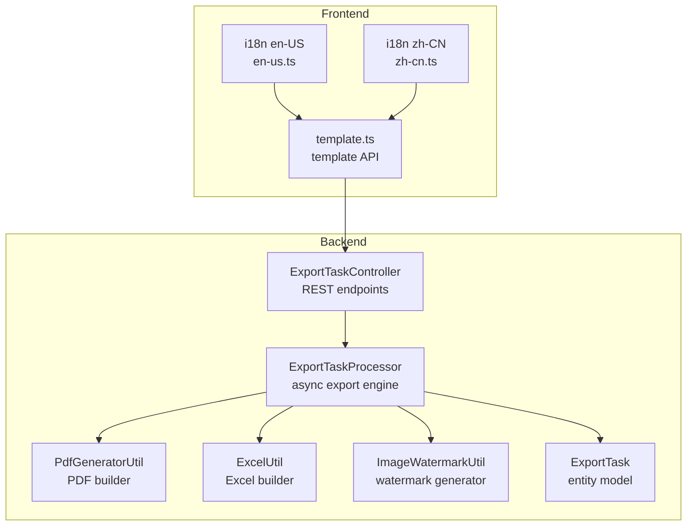
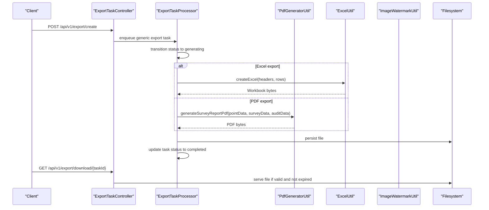
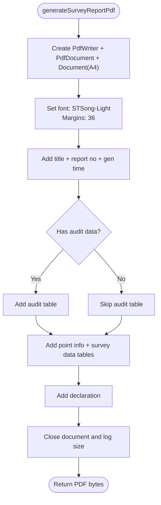
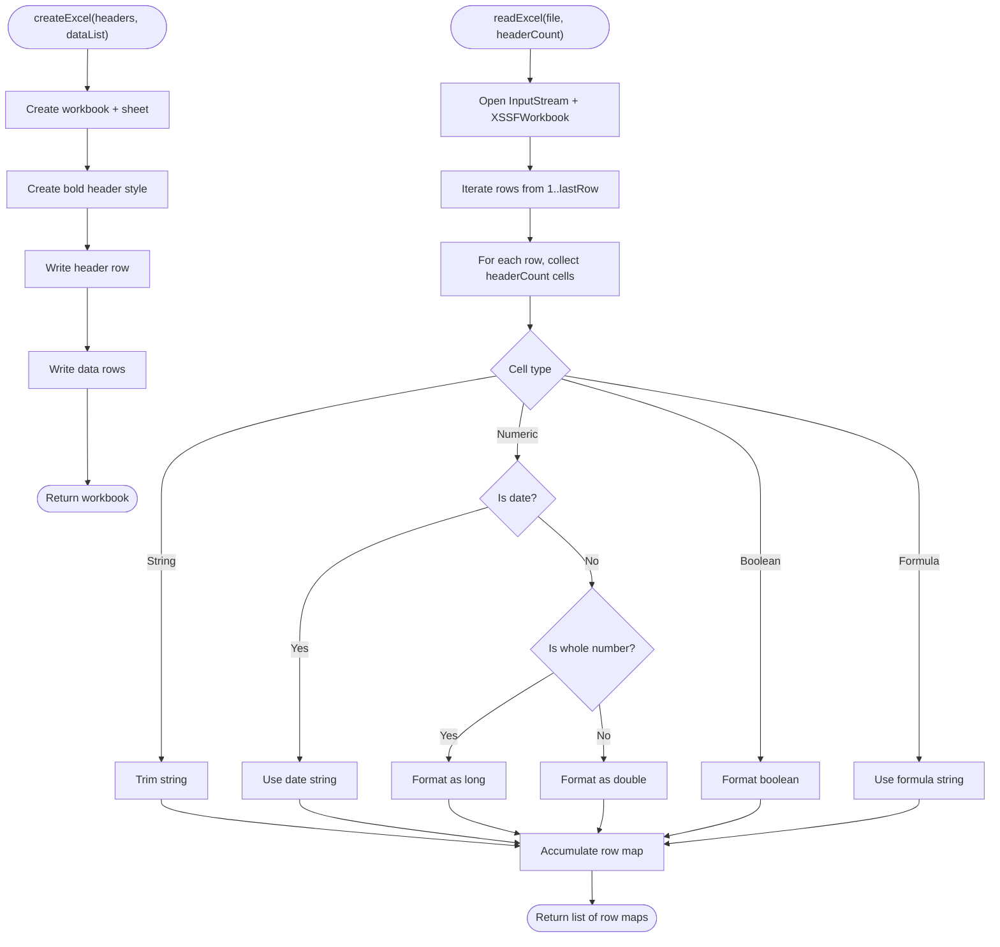
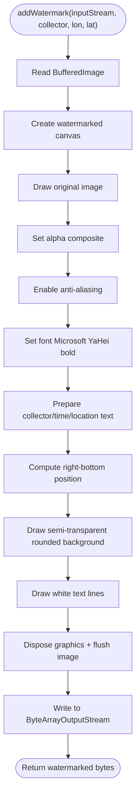
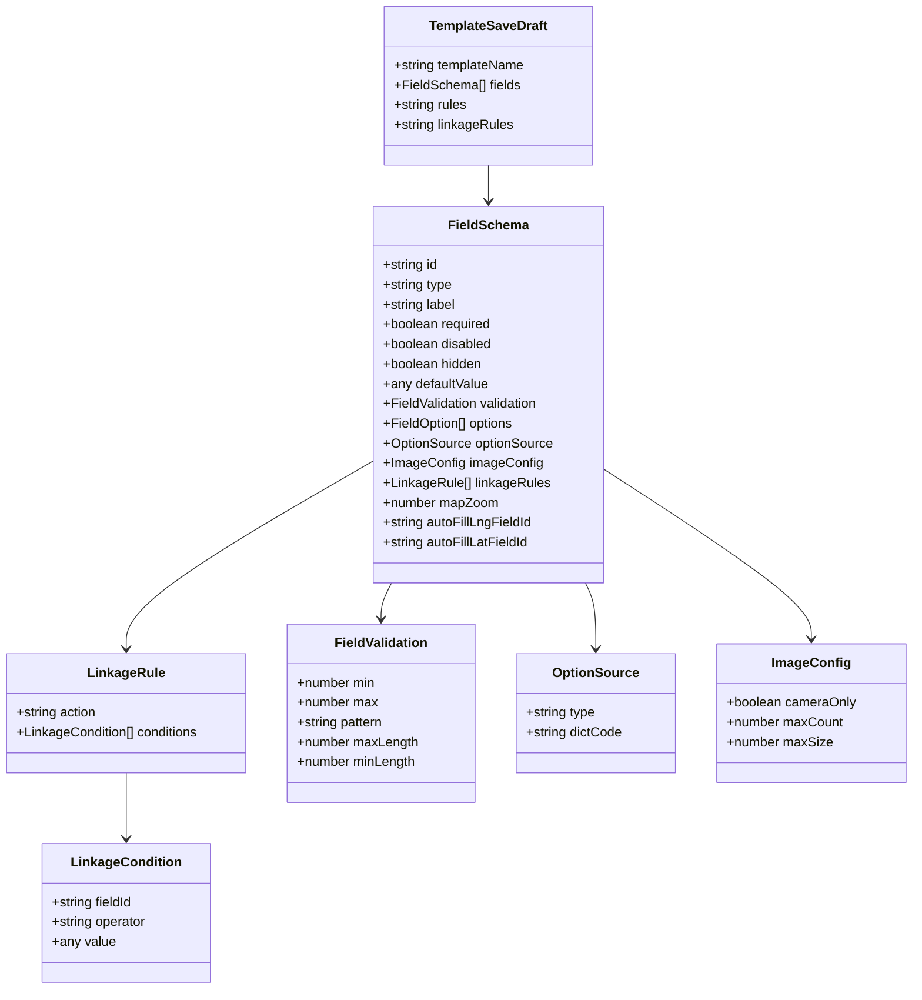
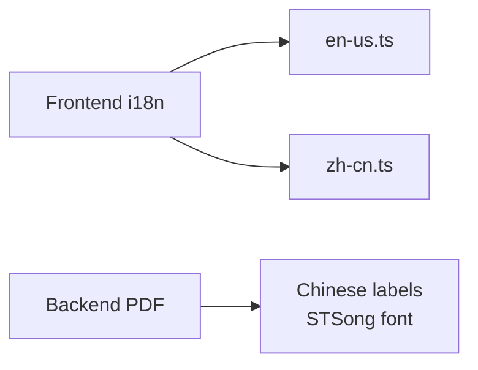
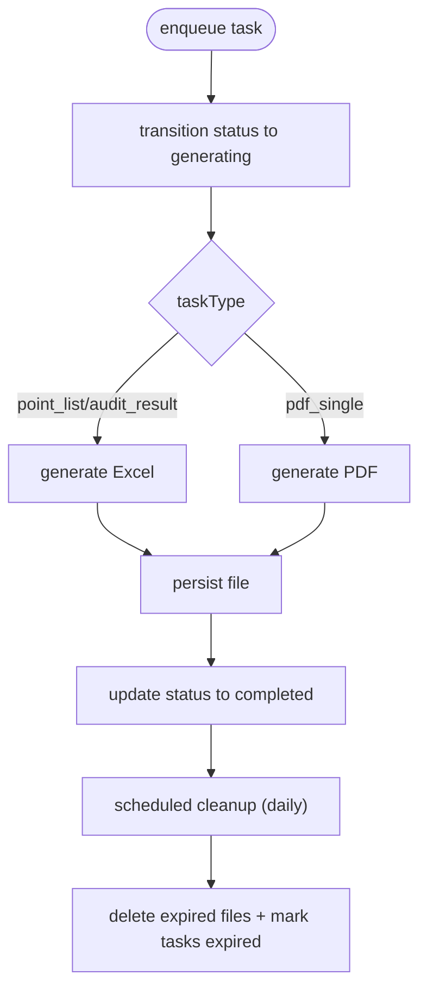
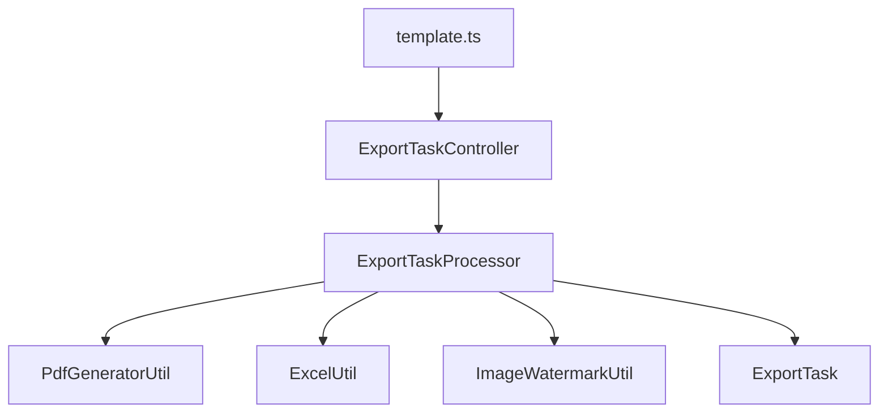

# Format Processing & Templates

<cite>
**Referenced Files in This Document**
- [PdfGeneratorUtil.java](file://admin-backend/src/main/java/com/qhiot/survey/common/util/PdfGeneratorUtil.java)
- [ExcelUtil.java](file://admin-backend/src/main/java/com/qhiot/survey/common/util/ExcelUtil.java)
- [ImageWatermarkUtil.java](file://admin-backend/src/main/java/com/qhiot/survey/common/util/ImageWatermarkUtil.java)
- [ExportTaskProcessor.java](file://admin-backend/src/main/java/com/qhiot/survey/service/ExportTaskProcessor.java)
- [ExportTaskController.java](file://admin-backend/src/main/java/com/qhiot/survey/controller/ExportTaskController.java)
- [ExportTask.java](file://admin-backend/src/main/java/com/qhiot/survey/entity/ExportTask.java)
- [template.ts](file://admin-web-soybean/src/service/api/template.ts)
- [en-us.ts](file://admin-web-soybean/src/locales/langs/en-us.ts)
- [zh-cn.ts](file://admin-web-soybean/src/locales/langs/zh-cn.ts)
- [logback-spring.xml](file://admin-backend/src/main/resources/logback-spring.xml)
</cite>

## Table of Contents
1. [Introduction](#introduction)
2. [Project Structure](#project-structure)
3. [Core Components](#core-components)
4. [Architecture Overview](#architecture-overview)
5. [Detailed Component Analysis](#detailed-component-analysis)
6. [Dependency Analysis](#dependency-analysis)
7. [Performance Considerations](#performance-considerations)
8. [Troubleshooting Guide](#troubleshooting-guide)
9. [Conclusion](#conclusion)
10. [Appendices](#appendices)

## Introduction
This document explains the format processing and template management capabilities of the system, focusing on:
- PDF generation utilities with watermark integration, page layout configuration, and multi-language support
- Excel processing with dynamic column sizing, data formatting, and chart generation considerations
- Template system for customizing report appearance and content structure
- Image handling for adding logos, signatures, and visual elements
- Examples of template customization, format-specific styling options, and batch processing optimizations
- Quality settings, compression options, and output size management for efficient report delivery

## Project Structure
The format processing and templates span backend utilities and controllers for generating and exporting reports, and frontend APIs and localization for template design and presentation.

**Diagram sources**
- [ExportTaskController.java:33-142](file://admin-backend/src/main/java/com/qhiot/survey/controller/ExportTaskController.java#L33-L142)
- [ExportTaskProcessor.java:43-443](file://admin-backend/src/main/java/com/qhiot/survey/service/ExportTaskProcessor.java#L43-L443)
- [PdfGeneratorUtil.java:26-259](file://admin-backend/src/main/java/com/qhiot/survey/common/util/PdfGeneratorUtil.java#L26-L259)
- [ExcelUtil.java:17-123](file://admin-backend/src/main/java/com/qhiot/survey/common/util/ExcelUtil.java#L17-L123)
- [ImageWatermarkUtil.java:20-218](file://admin-backend/src/main/java/com/qhiot/survey/common/util/ImageWatermarkUtil.java#L20-L218)
- [ExportTask.java:13-63](file://admin-backend/src/main/java/com/qhiot/survey/entity/ExportTask.java#L13-L63)
- [template.ts:1-214](file://admin-web-soybean/src/service/api/template.ts#L1-L214)
- [en-us.ts:1-512](file://admin-web-soybean/src/locales/langs/en-us.ts#L1-L512)
- [zh-cn.ts:1-513](file://admin-web-soybean/src/locales/langs/zh-cn.ts#L1-L513)

**Section sources**
- [ExportTaskController.java:33-142](file://admin-backend/src/main/java/com/qhiot/survey/controller/ExportTaskController.java#L33-L142)
- [ExportTaskProcessor.java:43-443](file://admin-backend/src/main/java/com/qhiot/survey/service/ExportTaskProcessor.java#L43-L443)
- [template.ts:1-214](file://admin-web-soybean/src/service/api/template.ts#L1-L214)

## Core Components
- PDF generation: Centralized builder for single-point survey reports with structured sections, fonts, margins, and optional audit data.
- Excel processing: Utilities for reading and writing Excel files with robust cell-type handling and numeric formatting.
- Image watermarking: Adds metadata-based watermarks to images with configurable transparency and font sizes.
- Export pipeline: Asynchronous export tasks with status transitions, persistence, scheduled cleanup, and secure downloads.
- Template system: JSON schema for designing forms with field types, validations, linkage rules, and image constraints; published versions per outfall type.
- Localization: i18n support for English and Chinese across UI and export-related labels.

**Section sources**
- [PdfGeneratorUtil.java:26-259](file://admin-backend/src/main/java/com/qhiot/survey/common/util/PdfGeneratorUtil.java#L26-L259)
- [ExcelUtil.java:17-123](file://admin-backend/src/main/java/com/qhiot/survey/common/util/ExcelUtil.java#L17-L123)
- [ImageWatermarkUtil.java:20-218](file://admin-backend/src/main/java/com/qhiot/survey/common/util/ImageWatermarkUtil.java#L20-L218)
- [ExportTaskProcessor.java:43-443](file://admin-backend/src/main/java/com/qhiot/survey/service/ExportTaskProcessor.java#L43-L443)
- [ExportTaskController.java:33-142](file://admin-backend/src/main/java/com/qhiot/survey/controller/ExportTaskController.java#L33-L142)
- [template.ts:1-214](file://admin-web-soybean/src/service/api/template.ts#L1-L214)
- [en-us.ts:1-512](file://admin-web-soybean/src/locales/langs/en-us.ts#L1-L512)
- [zh-cn.ts:1-513](file://admin-web-soybean/src/locales/langs/zh-cn.ts#L1-L513)

## Architecture Overview
End-to-end export flow from request to persisted file and download.

**Diagram sources**
- [ExportTaskController.java:48-117](file://admin-backend/src/main/java/com/qhiot/survey/controller/ExportTaskController.java#L48-L117)
- [ExportTaskProcessor.java:71-124](file://admin-backend/src/main/java/com/qhiot/survey/service/ExportTaskProcessor.java#L71-L124)
- [PdfGeneratorUtil.java:39-127](file://admin-backend/src/main/java/com/qhiot/survey/common/util/PdfGeneratorUtil.java#L39-L127)
- [ExcelUtil.java:59-91](file://admin-backend/src/main/java/com/qhiot/survey/common/util/ExcelUtil.java#L59-L91)
- [ImageWatermarkUtil.java:69-152](file://admin-backend/src/main/java/com/qhiot/survey/common/util/ImageWatermarkUtil.java#L69-L152)

## Detailed Component Analysis

### PDF Generation Utilities
- Page layout: A4 page size, centered titles, gray subtitles, 36pt margins, and STSong-Light font for Chinese text.
- Sections: Point info table, survey data table, optional audit table, and a standardized declaration paragraph.
- Watermark integration: The PDF builder does not embed raster watermarks; use the image watermark utility for photos and integrate watermarked images via external flows.

**Diagram sources**
- [PdfGeneratorUtil.java:39-127](file://admin-backend/src/main/java/com/qhiot/survey/common/util/PdfGeneratorUtil.java#L39-L127)

**Section sources**
- [PdfGeneratorUtil.java:26-259](file://admin-backend/src/main/java/com/qhiot/survey/common/util/PdfGeneratorUtil.java#L26-L259)

### Excel Processing Capabilities
- Reading: Loads XLSX, iterates rows starting from the second row, trims strings, formats dates, avoids scientific notation for integers, and preserves booleans and formulas.
- Writing: Creates a header row with bold font, fills data rows, and writes to a workbook byte array for export.
- Dynamic column sizing: The current implementation sets headers and writes data but does not auto-fit column widths. To optimize output size and readability, consider adding column width calculations based on content length.

**Diagram sources**
- [ExcelUtil.java:25-51](file://admin-backend/src/main/java/com/qhiot/survey/common/util/ExcelUtil.java#L25-L51)
- [ExcelUtil.java:59-91](file://admin-backend/src/main/java/com/qhiot/survey/common/util/ExcelUtil.java#L59-L91)
- [ExcelUtil.java:96-122](file://admin-backend/src/main/java/com/qhiot/survey/common/util/ExcelUtil.java#L96-L122)

**Section sources**
- [ExcelUtil.java:17-123](file://admin-backend/src/main/java/com/qhiot/survey/common/util/ExcelUtil.java#L17-L123)

### Image Handling and Watermark Integration
- Metadata watermark: Adds a semi-transparent rounded text block with collector name, timestamp, and location coordinates to images.
- Text watermark: Centers a white watermark text on the image with adjustable alpha.
- Format detection: Simplified detection returning a default format; production deployments should infer formats from streams.
- Integration: Use the watermark utility to process images prior to embedding into PDFs or reports.

**Diagram sources**
- [ImageWatermarkUtil.java:69-152](file://admin-backend/src/main/java/com/qhiot/survey/common/util/ImageWatermarkUtil.java#L69-L152)

**Section sources**
- [ImageWatermarkUtil.java:1-218](file://admin-backend/src/main/java/com/qhiot/survey/common/util/ImageWatermarkUtil.java#L1-L218)

### Template System for Customizing Reports
- Field schema: Supports input, textarea, number, select, radio, checkbox, switch, date, image, location, divider with validation, options, linkage rules, and image constraints.
- Lifecycle: Draft saving, publishing to create versions, previewing, and binding templates to outfall types per project/section.
- API surface: Listing, creation, updates, deletion, drafts, publishing, versions, preview, and binding management.

**Diagram sources**
- [template.ts:42-62](file://admin-web-soybean/src/service/api/template.ts#L42-L62)
- [template.ts:64-69](file://admin-web-soybean/src/service/api/template.ts#L64-L69)
- [template.ts:12-21](file://admin-web-soybean/src/service/api/template.ts#L12-L21)
- [template.ts:23-29](file://admin-web-soybean/src/service/api/template.ts#L23-L29)
- [template.ts:31-40](file://admin-web-soybean/src/service/api/template.ts#L31-L40)

**Section sources**
- [template.ts:1-214](file://admin-web-soybean/src/service/api/template.ts#L1-L214)

### Multi-Language Support
- Backend: Uses Chinese fonts and date formatting; PDF titles and labels are in Chinese.
- Frontend: i18n configuration supports English and Chinese locales, with dayjs locale setup and runtime switching.

**Diagram sources**
- [en-us.ts:1-512](file://admin-web-soybean/src/locales/langs/en-us.ts#L1-L512)
- [zh-cn.ts:1-513](file://admin-web-soybean/src/locales/langs/zh-cn.ts#L1-L513)
- [PdfGeneratorUtil.java:50-53](file://admin-backend/src/main/java/com/qhiot/survey/common/util/PdfGeneratorUtil.java#L50-L53)

**Section sources**
- [en-us.ts:1-512](file://admin-web-soybean/src/locales/langs/en-us.ts#L1-L512)
- [zh-cn.ts:1-513](file://admin-web-soybean/src/locales/langs/zh-cn.ts#L1-L513)
- [PdfGeneratorUtil.java:26-127](file://admin-backend/src/main/java/com/qhiot/survey/common/util/PdfGeneratorUtil.java#L26-L127)

### Batch Processing Optimizations
- Asynchronous execution: Export tasks are executed asynchronously to avoid blocking requests.
- Scheduled cleanup: Daily cleanup removes expired files and updates task statuses.
- Status transitions: Robust state machine ensures consistent progress tracking and error reporting.
- Storage path and retention: Configurable export directory and retention days.

**Diagram sources**
- [ExportTaskProcessor.java:71-124](file://admin-backend/src/main/java/com/qhiot/survey/service/ExportTaskProcessor.java#L71-L124)
- [ExportTaskProcessor.java:187-212](file://admin-backend/src/main/java/com/qhiot/survey/service/ExportTaskProcessor.java#L187-L212)
- [ExportTaskController.java:82-117](file://admin-backend/src/main/java/com/qhiot/survey/controller/ExportTaskController.java#L82-L117)

**Section sources**
- [ExportTaskProcessor.java:43-443](file://admin-backend/src/main/java/com/qhiot/survey/service/ExportTaskProcessor.java#L43-L443)
- [ExportTaskController.java:33-142](file://admin-backend/src/main/java/com/qhiot/survey/controller/ExportTaskController.java#L33-L142)
- [ExportTask.java:13-63](file://admin-backend/src/main/java/com/qhiot/survey/entity/ExportTask.java#L13-L63)

## Dependency Analysis
- ExportTaskController depends on ExportTaskService and ExportTaskProcessor for orchestration.
- ExportTaskProcessor depends on PdfGeneratorUtil, ExcelUtil, ImageWatermarkUtil, and persistence for file storage.
- Frontend template API communicates with backend endpoints to manage templates and versions.

**Diagram sources**
- [ExportTaskController.java:33-142](file://admin-backend/src/main/java/com/qhiot/survey/controller/ExportTaskController.java#L33-L142)
- [ExportTaskProcessor.java:43-443](file://admin-backend/src/main/java/com/qhiot/survey/service/ExportTaskProcessor.java#L43-L443)
- [PdfGeneratorUtil.java:26-259](file://admin-backend/src/main/java/com/qhiot/survey/common/util/PdfGeneratorUtil.java#L26-L259)
- [ExcelUtil.java:17-123](file://admin-backend/src/main/java/com/qhiot/survey/common/util/ExcelUtil.java#L17-L123)
- [ImageWatermarkUtil.java:20-218](file://admin-backend/src/main/java/com/qhiot/survey/common/util/ImageWatermarkUtil.java#L20-L218)
- [ExportTask.java:13-63](file://admin-backend/src/main/java/com/qhiot/survey/entity/ExportTask.java#L13-L63)
- [template.ts:1-214](file://admin-web-soybean/src/service/api/template.ts#L1-L214)

**Section sources**
- [ExportTaskController.java:33-142](file://admin-backend/src/main/java/com/qhiot/survey/controller/ExportTaskController.java#L33-L142)
- [ExportTaskProcessor.java:43-443](file://admin-backend/src/main/java/com/qhiot/survey/service/ExportTaskProcessor.java#L43-L443)

## Performance Considerations
- Asynchronous exports: Offload heavy workloads to background threads to improve responsiveness.
- Logging throughput: Async logging appender configured with queue size and discarding thresholds to reduce contention under load.
- Output size management:
  - Excel: Consider adding column auto-fit and content-based width calculation to reduce file size.
  - PDF: Keep embedded images compressed; avoid unnecessary rasterization of vector-like content.
  - Watermarks: Use minimal text overlays and appropriate alpha blending to balance visibility and performance.
- Retention and cleanup: Scheduled cleanup prevents disk bloat and maintains predictable storage usage.

**Section sources**
- [logback-spring.xml:77-83](file://admin-backend/src/main/resources/logback-spring.xml#L77-L83)
- [ExportTaskProcessor.java:187-212](file://admin-backend/src/main/java/com/qhiot/survey/service/ExportTaskProcessor.java#L187-L212)

## Troubleshooting Guide
- Export task failures:
  - Verify task status transitions and error messages stored in the task entity.
  - Check filesystem permissions and configured export directory existence.
- Download errors:
  - Ensure tasks are completed and not expired; otherwise, the server returns appropriate HTTP status codes.
- Watermark issues:
  - Confirm input streams are readable and supported image formats; adjust alpha and font size for visibility.
- Excel parsing anomalies:
  - Validate numeric formatting and date handling; ensure headers match expected counts.

**Section sources**
- [ExportTaskProcessor.java:216-241](file://admin-backend/src/main/java/com/qhiot/survey/service/ExportTaskProcessor.java#L216-L241)
- [ExportTaskController.java:82-117](file://admin-backend/src/main/java/com/qhiot/survey/controller/ExportTaskController.java#L82-L117)
- [ImageWatermarkUtil.java:72-76](file://admin-backend/src/main/java/com/qhiot/survey/common/util/ImageWatermarkUtil.java#L72-L76)
- [ExcelUtil.java:104-114](file://admin-backend/src/main/java/com/qhiot/survey/common/util/ExcelUtil.java#L104-L114)

## Conclusion
The system provides a robust foundation for generating formatted reports (PDF and Excel), integrating watermarks into images, and managing customizable templates. By leveraging asynchronous processing, scheduled cleanup, and i18n support, it balances performance and usability. Extending column sizing and chart generation would further enhance output quality and delivery efficiency.

## Appendices
- Example template customization:
  - Define fields with linkage rules to conditionally show/hide or require dependent inputs.
  - Configure image constraints (camera-only, max count, max size) for photo submissions.
  - Publish versions and bind templates to outfall types for project-specific workflows.
- Format-specific styling options:
  - PDF: Adjust fonts, margins, and section headers; consider adding page numbering and logos via external image watermarking.
  - Excel: Implement column auto-fit and apply conditional formatting post-write for richer visuals.
- Batch processing optimizations:
  - Increase thread pool capacity for export executor if throughput demands grow.
  - Monitor logback async appender metrics to tune queue size and discard thresholds.