# Report Generation Engine

<cite>
**Referenced Files in This Document**
- [ExportTaskController.java](file://admin-backend/src/main/java/com/qhiot/survey/controller/ExportTaskController.java)
- [ExportTaskService.java](file://admin-backend/src/main/java/com/qhiot/survey/service/ExportTaskService.java)
- [ExportTaskServiceImpl.java](file://admin-backend/src/main/java/com/qhiot/survey/service/impl/ExportTaskServiceImpl.java)
- [ExportTaskProcessor.java](file://admin-backend/src/main/java/com/qhiot/survey/service/ExportTaskProcessor.java)
- [ExportTask.java](file://admin-backend/src/main/java/com/qhiot/survey/entity/ExportTask.java)
- [PdfGeneratorUtil.java](file://admin-backend/src/main/java/com/qhiot/survey/common/util/PdfGeneratorUtil.java)
- [ExcelUtil.java](file://admin-backend/src/main/java/com/qhiot/survey/common/util/ExcelUtil.java)
- [ImageWatermarkUtil.java](file://admin-backend/src/main/java/com/qhiot/survey/common/util/ImageWatermarkUtil.java)
</cite>

## Table of Contents
1. [Introduction](#introduction)
2. [Project Structure](#project-structure)
3. [Core Components](#core-components)
4. [Architecture Overview](#architecture-overview)
5. [Detailed Component Analysis](#detailed-component-analysis)
6. [Dependency Analysis](#dependency-analysis)
7. [Performance Considerations](#performance-considerations)
8. [Troubleshooting Guide](#troubleshooting-guide)
9. [Conclusion](#conclusion)
10. [Appendices](#appendices)

## Introduction
This document describes the report generation engine responsible for transforming raw survey data into standardized, downloadable reports. It covers the asynchronous processing pipeline, supported output formats (PDF and Excel), data aggregation and filtering, template rendering, and operational controls such as retention and cleanup. It also provides guidance on memory management and performance tuning for large datasets.

## Project Structure
The report generation engine is implemented in the backend module under the admin-backend package. The primary components are:
- Controller: exposes REST endpoints to create tasks, poll status, and download outputs.
- Service: orchestrates task creation and delegates execution to the processor.
- Processor: executes asynchronous export jobs, aggregates data, and generates outputs.
- Utilities: provide PDF generation and Excel creation helpers.
- Entity: defines the export task model persisted in the database.

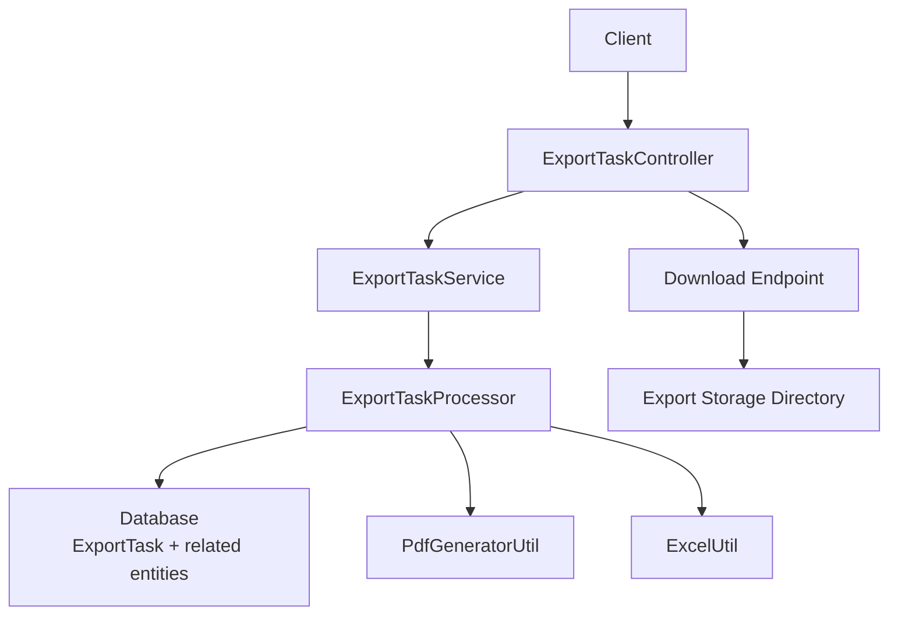

**Diagram sources**
- [ExportTaskController.java:37-141](file://admin-backend/src/main/java/com/qhiot/survey/controller/ExportTaskController.java#L37-L141)
- [ExportTaskService.java:12-55](file://admin-backend/src/main/java/com/qhiot/survey/service/ExportTaskService.java#L12-L55)
- [ExportTaskServiceImpl.java:25-88](file://admin-backend/src/main/java/com/qhiot/survey/service/impl/ExportTaskServiceImpl.java#L25-L88)
- [ExportTaskProcessor.java:45-442](file://admin-backend/src/main/java/com/qhiot/survey/service/ExportTaskProcessor.java#L45-L442)
- [PdfGeneratorUtil.java:27-258](file://admin-backend/src/main/java/com/qhiot/survey/common/util/PdfGeneratorUtil.java#L27-L258)
- [ExcelUtil.java:17-122](file://admin-backend/src/main/java/com/qhiot/survey/common/util/ExcelUtil.java#L17-L122)

**Section sources**
- [ExportTaskController.java:37-141](file://admin-backend/src/main/java/com/qhiot/survey/controller/ExportTaskController.java#L37-L141)
- [ExportTaskService.java:12-55](file://admin-backend/src/main/java/com/qhiot/survey/service/ExportTaskService.java#L12-L55)
- [ExportTaskServiceImpl.java:25-88](file://admin-backend/src/main/java/com/qhiot/survey/service/impl/ExportTaskServiceImpl.java#L25-L88)
- [ExportTaskProcessor.java:45-442](file://admin-backend/src/main/java/com/qhiot/survey/service/ExportTaskProcessor.java#L45-L442)

## Core Components
- ExportTaskController: REST endpoints to create export tasks (Excel and PDF), list tasks, fetch details, and download outputs. Implements content-type negotiation and file retrieval from the export storage directory.
- ExportTaskService: defines the contract for creating tasks and generating PDF bytes via the utility.
- ExportTaskServiceImpl: persists tasks, sets initial status, and triggers asynchronous execution via ExportTaskProcessor.
- ExportTaskProcessor: performs asynchronous export work, aggregates data from survey entities, writes outputs to disk, updates task metadata, and schedules periodic cleanup of expired files.
- PdfGeneratorUtil: renders PDFs with structured sections, tables, and metadata using iText.
- ExcelUtil: creates Excel workbooks from arrays of headers and rows, applies basic header styling, and serializes to bytes.

**Section sources**
- [ExportTaskController.java:37-141](file://admin-backend/src/main/java/com/qhiot/survey/controller/ExportTaskController.java#L37-L141)
- [ExportTaskService.java:12-55](file://admin-backend/src/main/java/com/qhiot/survey/service/ExportTaskService.java#L12-L55)
- [ExportTaskServiceImpl.java:25-88](file://admin-backend/src/main/java/com/qhiot/survey/service/impl/ExportTaskServiceImpl.java#L25-L88)
- [ExportTaskProcessor.java:45-442](file://admin-backend/src/main/java/com/qhiot/survey/service/ExportTaskProcessor.java#L45-L442)
- [PdfGeneratorUtil.java:27-258](file://admin-backend/src/main/java/com/qhiot/survey/common/util/PdfGeneratorUtil.java#L27-L258)
- [ExcelUtil.java:17-122](file://admin-backend/src/main/java/com/qhiot/survey/common/util/ExcelUtil.java#L17-L122)

## Architecture Overview
The engine follows an asynchronous task pattern:
- Clients submit export requests via REST endpoints.
- Services persist tasks and trigger asynchronous processing.
- Processors fetch related survey data, aggregate it into report-ready structures, and render outputs.
- Outputs are written to a configured export directory with metadata stored in the database.
- Clients poll task status and download completed files.

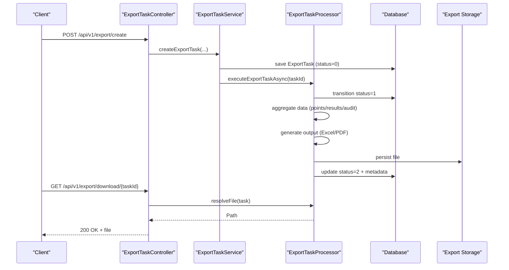

**Diagram sources**
- [ExportTaskController.java:48-117](file://admin-backend/src/main/java/com/qhiot/survey/controller/ExportTaskController.java#L48-L117)
- [ExportTaskServiceImpl.java:30-66](file://admin-backend/src/main/java/com/qhiot/survey/service/impl/ExportTaskServiceImpl.java#L30-L66)
- [ExportTaskProcessor.java:71-124](file://admin-backend/src/main/java/com/qhiot/survey/service/ExportTaskProcessor.java#L71-L124)
- [ExportTask.java:15-63](file://admin-backend/src/main/java/com/qhiot/survey/entity/ExportTask.java#L15-L63)

## Detailed Component Analysis

### Export Task Model
The ExportTask entity captures task metadata, including type, associated identifiers, status, file metadata, expiration, and timestamps.

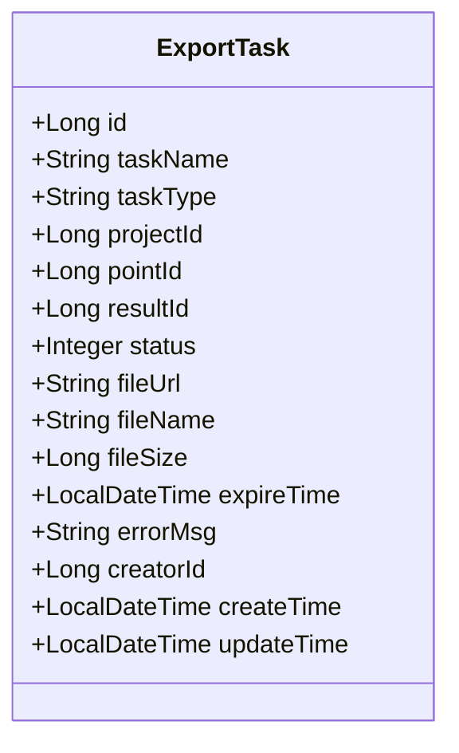

**Diagram sources**
- [ExportTask.java:15-63](file://admin-backend/src/main/java/com/qhiot/survey/entity/ExportTask.java#L15-L63)

**Section sources**
- [ExportTask.java:15-63](file://admin-backend/src/main/java/com/qhiot/survey/entity/ExportTask.java#L15-L63)

### Controller: Task Lifecycle and Download
- Creates export tasks for Excel and PDF.
- Lists and retrieves task details for polling.
- Downloads completed outputs with content-type detection and expiration checks.

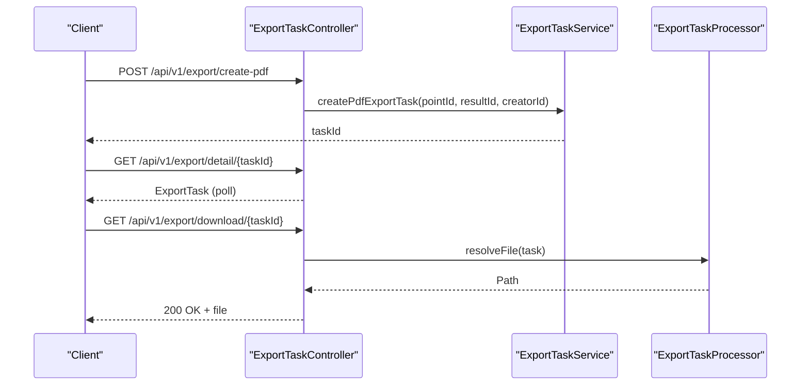

**Diagram sources**
- [ExportTaskController.java:48-117](file://admin-backend/src/main/java/com/qhiot/survey/controller/ExportTaskController.java#L48-L117)
- [ExportTaskServiceImpl.java:49-66](file://admin-backend/src/main/java/com/qhiot/survey/service/impl/ExportTaskServiceImpl.java#L49-L66)
- [ExportTaskProcessor.java:163-182](file://admin-backend/src/main/java/com/qhiot/survey/service/ExportTaskProcessor.java#L163-L182)

**Section sources**
- [ExportTaskController.java:48-117](file://admin-backend/src/main/java/com/qhiot/survey/controller/ExportTaskController.java#L48-L117)

### Service Layer: Task Orchestration
- Validates inputs and persists tasks with initial status.
- Triggers asynchronous execution via the processor bean to ensure proper proxy behavior for @Async.

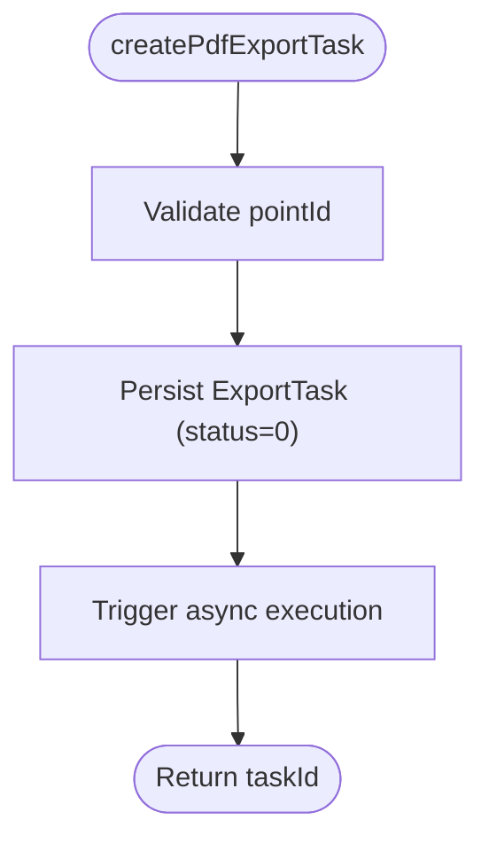

**Diagram sources**
- [ExportTaskServiceImpl.java:49-66](file://admin-backend/src/main/java/com/qhiot/survey/service/impl/ExportTaskServiceImpl.java#L49-L66)

**Section sources**
- [ExportTaskService.java:12-55](file://admin-backend/src/main/java/com/qhiot/survey/service/ExportTaskService.java#L12-L55)
- [ExportTaskServiceImpl.java:25-88](file://admin-backend/src/main/java/com/qhiot/survey/service/impl/ExportTaskServiceImpl.java#L25-L88)

### Processor: Asynchronous Execution and Data Aggregation
- Transitions task status to “generating” and handles failures by marking “failed” with truncated error messages.
- Generates outputs for:
  - Point list Excel
  - Audit result Excel
  - Single-point PDF
- Persists files to the configured export directory and updates task metadata.
- Schedules daily cleanup of expired files and updates task status to “expired”.

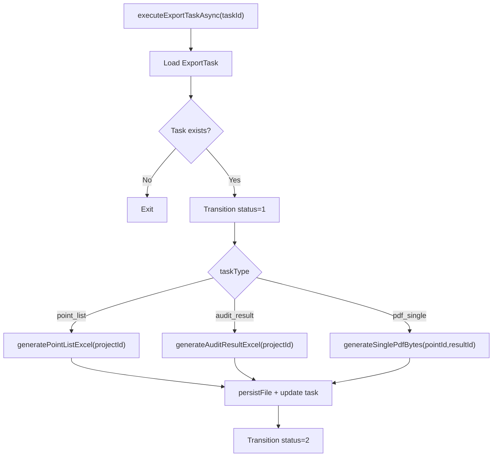

**Diagram sources**
- [ExportTaskProcessor.java:71-124](file://admin-backend/src/main/java/com/qhiot/survey/service/ExportTaskProcessor.java#L71-L124)
- [ExportTaskProcessor.java:288-351](file://admin-backend/src/main/java/com/qhiot/survey/service/ExportTaskProcessor.java#L288-L351)
- [ExportTaskProcessor.java:262-283](file://admin-backend/src/main/java/com/qhiot/survey/service/ExportTaskProcessor.java#L262-L283)

**Section sources**
- [ExportTaskProcessor.java:71-124](file://admin-backend/src/main/java/com/qhiot/survey/service/ExportTaskProcessor.java#L71-L124)
- [ExportTaskProcessor.java:187-212](file://admin-backend/src/main/java/com/qhiot/survey/service/ExportTaskProcessor.java#L187-L212)

### PDF Generation Pipeline
- Uses iText to create A4 documents with centered title, report number, and generation time.
- Renders three sections: point info, survey data, and optional audit info.
- Applies consistent fonts, margins, and table layouts with light-gray headers.

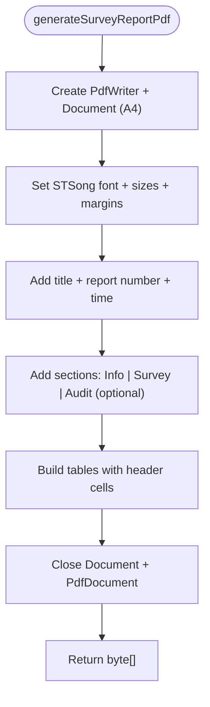

**Diagram sources**
- [PdfGeneratorUtil.java:39-127](file://admin-backend/src/main/java/com/qhiot/survey/common/util/PdfGeneratorUtil.java#L39-L127)
- [PdfGeneratorUtil.java:143-207](file://admin-backend/src/main/java/com/qhiot/survey/common/util/PdfGeneratorUtil.java#L143-L207)

**Section sources**
- [PdfGeneratorUtil.java:27-258](file://admin-backend/src/main/java/com/qhiot/survey/common/util/PdfGeneratorUtil.java#L27-L258)

### Excel Generation Pipeline
- Creates an XSSF workbook with a single sheet.
- Writes headers with bold styling and populates rows from a list of maps keyed by header strings.
- Serializes workbook to bytes for persistence and download.

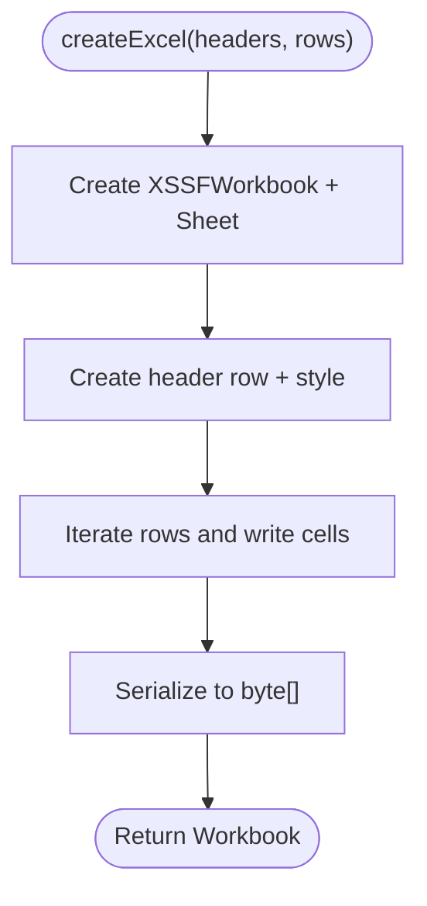

**Diagram sources**
- [ExcelUtil.java:59-91](file://admin-backend/src/main/java/com/qhiot/survey/common/util/ExcelUtil.java#L59-L91)

**Section sources**
- [ExcelUtil.java:17-122](file://admin-backend/src/main/java/com/qhiot/survey/common/util/ExcelUtil.java#L17-L122)

### Data Aggregation and Filtering
- Point list Excel: queries points optionally filtered by project, ordered by creation time, and mapped to a fixed set of fields.
- Audit result Excel: filters results by submission/audit statuses, optionally scoped by project via point lookup, and maps status codes to human-readable labels.
- Survey data: deserializes JSON form data into a flat map for rendering.

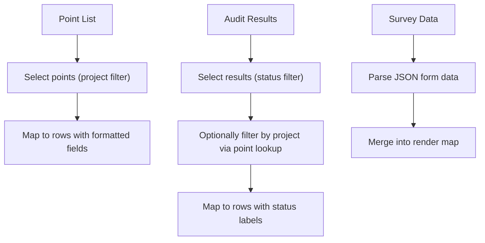

**Diagram sources**
- [ExportTaskProcessor.java:288-313](file://admin-backend/src/main/java/com/qhiot/survey/service/ExportTaskProcessor.java#L288-L313)
- [ExportTaskProcessor.java:318-351](file://admin-backend/src/main/java/com/qhiot/survey/service/ExportTaskProcessor.java#L318-L351)
- [ExportTaskProcessor.java:376-393](file://admin-backend/src/main/java/com/qhiot/survey/service/ExportTaskProcessor.java#L376-L393)

**Section sources**
- [ExportTaskProcessor.java:288-351](file://admin-backend/src/main/java/com/qhiot/survey/service/ExportTaskProcessor.java#L288-L351)
- [ExportTaskProcessor.java:376-393](file://admin-backend/src/main/java/com/qhiot/survey/service/ExportTaskProcessor.java#L376-L393)

### Watermarking for Images
- Provides utilities to add semi-transparent, rounded-background watermarks to images with collector, time, and location details.
- Also supports simplified text watermark overlays.

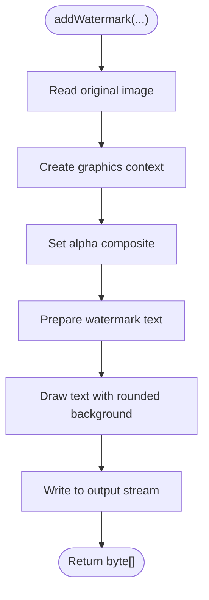

**Diagram sources**
- [ImageWatermarkUtil.java:52-151](file://admin-backend/src/main/java/com/qhiot/survey/common/util/ImageWatermarkUtil.java#L52-L151)

**Section sources**
- [ImageWatermarkUtil.java:21-218](file://admin-backend/src/main/java/com/qhiot/survey/common/util/ImageWatermarkUtil.java#L21-L218)

## Dependency Analysis
- ExportTaskController depends on ExportTaskService and ExportTaskProcessor for orchestration and file resolution.
- ExportTaskService delegates to ExportTaskProcessor for asynchronous execution.
- ExportTaskProcessor depends on mappers for survey entities and utilities for PDF and Excel generation.
- Utilities are standalone and encapsulate third-party integrations (iText for PDF, Apache POI for Excel).

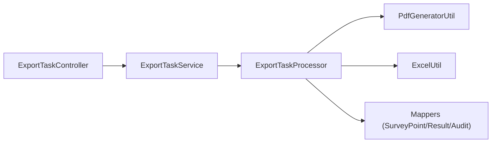

**Diagram sources**
- [ExportTaskController.java:39-46](file://admin-backend/src/main/java/com/qhiot/survey/controller/ExportTaskController.java#L39-L46)
- [ExportTaskServiceImpl.java:27-28](file://admin-backend/src/main/java/com/qhiot/survey/service/impl/ExportTaskServiceImpl.java#L27-L28)
- [ExportTaskProcessor.java:47-57](file://admin-backend/src/main/java/com/qhiot/survey/service/ExportTaskProcessor.java#L47-L57)
- [PdfGeneratorUtil.java:27-27](file://admin-backend/src/main/java/com/qhiot/survey/common/util/PdfGeneratorUtil.java#L27-L27)
- [ExcelUtil.java:17-17](file://admin-backend/src/main/java/com/qhiot/survey/common/util/ExcelUtil.java#L17-L17)

**Section sources**
- [ExportTaskController.java:39-46](file://admin-backend/src/main/java/com/qhiot/survey/controller/ExportTaskController.java#L39-L46)
- [ExportTaskServiceImpl.java:27-28](file://admin-backend/src/main/java/com/qhiot/survey/service/impl/ExportTaskServiceImpl.java#L27-L28)
- [ExportTaskProcessor.java:47-57](file://admin-backend/src/main/java/com/qhiot/survey/service/ExportTaskProcessor.java#L47-L57)

## Performance Considerations
- Asynchronous execution: Tasks are executed asynchronously to avoid blocking the request thread. Ensure the executor configuration supports concurrent export workloads.
- Memory management:
  - Excel generation streams data into a workbook and serializes to a byte array; keep row counts reasonable or consider pagination for very large datasets.
  - PDF generation builds content in memory; for multi-page documents, consider chunking or streaming approaches if memory pressure occurs.
- I/O and disk:
  - Persist outputs to a dedicated export directory; ensure sufficient disk space and appropriate permissions.
  - Schedule cleanup to remove expired files and update task status to prevent accumulation.
- Filtering and pagination:
  - Apply filters early (e.g., status, project ID) to reduce dataset size.
  - Consider paginating large result sets when aggregating survey results.
- Concurrency:
  - Tune thread pool sizes for the export executor to match CPU and I/O capacity.
- Monitoring:
  - Track task durations, failure rates, and file sizes to identify bottlenecks.

[No sources needed since this section provides general guidance]

## Troubleshooting Guide
- Task remains pending:
  - Verify task status transitions from “pending” to “generating” and confirm asynchronous executor is enabled.
- Download returns 410 (Gone):
  - Confirm task status is “completed” and not expired; check retention days configuration.
- Download returns 400 (Bad Request):
  - Ensure task status equals “completed”; tasks that failed remain unavailable for download.
- Missing file during download:
  - Confirm export directory path and file naming conventions; the resolver matches filenames by task ID or point ID prefix.
- Cleanup not removing files:
  - Ensure scheduled cleanup runs at the configured cron time and that filesystem permissions allow deletion.

**Section sources**
- [ExportTaskController.java:82-117](file://admin-backend/src/main/java/com/qhiot/survey/controller/ExportTaskController.java#L82-L117)
- [ExportTaskProcessor.java:187-212](file://admin-backend/src/main/java/com/qhiot/survey/service/ExportTaskProcessor.java#L187-L212)
- [ExportTaskProcessor.java:163-182](file://admin-backend/src/main/java/com/qhiot/survey/service/ExportTaskProcessor.java#L163-L182)

## Conclusion
The report generation engine provides a robust, asynchronous pipeline for exporting survey data to PDF and Excel. It integrates cleanly with the existing domain model, offers configurable retention and cleanup, and leverages established libraries for PDF and spreadsheet rendering. By applying the recommended performance and troubleshooting practices, teams can scale exports to handle larger datasets reliably.

[No sources needed since this section summarizes without analyzing specific files]

## Appendices

### Supported Output Formats and Generation Processes
- PDF:
  - Single-point survey report with sections for point info, survey data, and optional audit info.
  - Uses iText for layout, fonts, and A4 formatting.
- Excel:
  - Point list and audit result exports with styled headers and serialized workbook bytes.

**Section sources**
- [PdfGeneratorUtil.java:27-258](file://admin-backend/src/main/java/com/qhiot/survey/common/util/PdfGeneratorUtil.java#L27-L258)
- [ExcelUtil.java:17-122](file://admin-backend/src/main/java/com/qhiot/survey/common/util/ExcelUtil.java#L17-L122)
- [ExportTaskProcessor.java:288-351](file://admin-backend/src/main/java/com/qhiot/survey/service/ExportTaskProcessor.java#L288-L351)

### Data Transformation Rules
- Status codes are translated to human-readable labels for display.
- Survey form data is parsed from JSON into a flat map for rendering.
- Date/time fields are formatted consistently for reports.

**Section sources**
- [ExportTaskProcessor.java:406-441](file://admin-backend/src/main/java/com/qhiot/survey/service/ExportTaskProcessor.java#L406-L441)
- [ExportTaskProcessor.java:376-393](file://admin-backend/src/main/java/com/qhiot/survey/service/ExportTaskProcessor.java#L376-L393)

### Format-Specific Optimizations
- PDF:
  - Centered title and metadata for professional presentation.
  - Fixed A4 page size and margins for consistent printing.
- Excel:
  - Bold header styling for readability.
  - Efficient row/column iteration for moderate-sized datasets.

**Section sources**
- [PdfGeneratorUtil.java:44-116](file://admin-backend/src/main/java/com/qhiot/survey/common/util/PdfGeneratorUtil.java#L44-L116)
- [ExcelUtil.java:63-88](file://admin-backend/src/main/java/com/qhiot/survey/common/util/ExcelUtil.java#L63-L88)