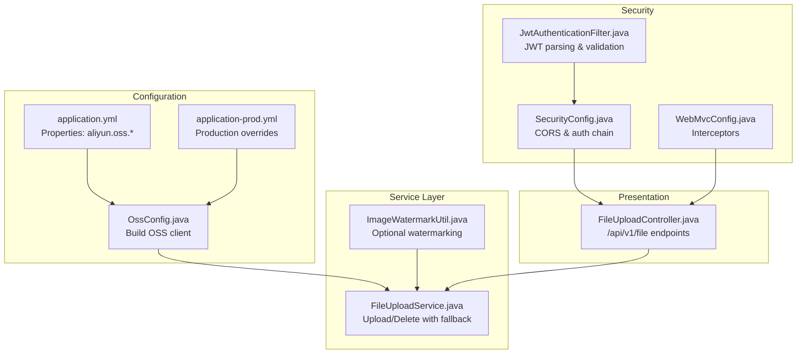
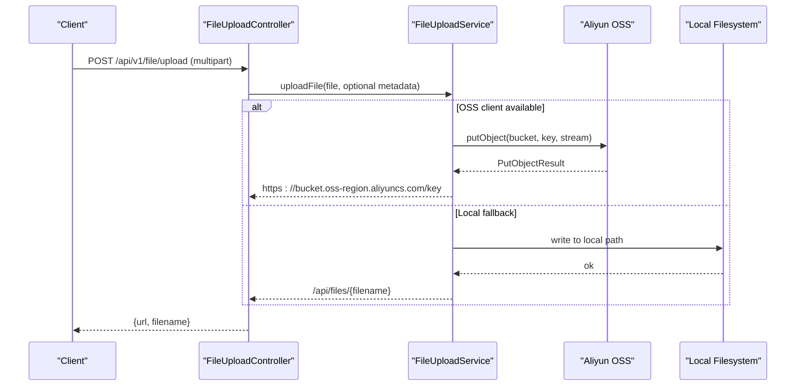
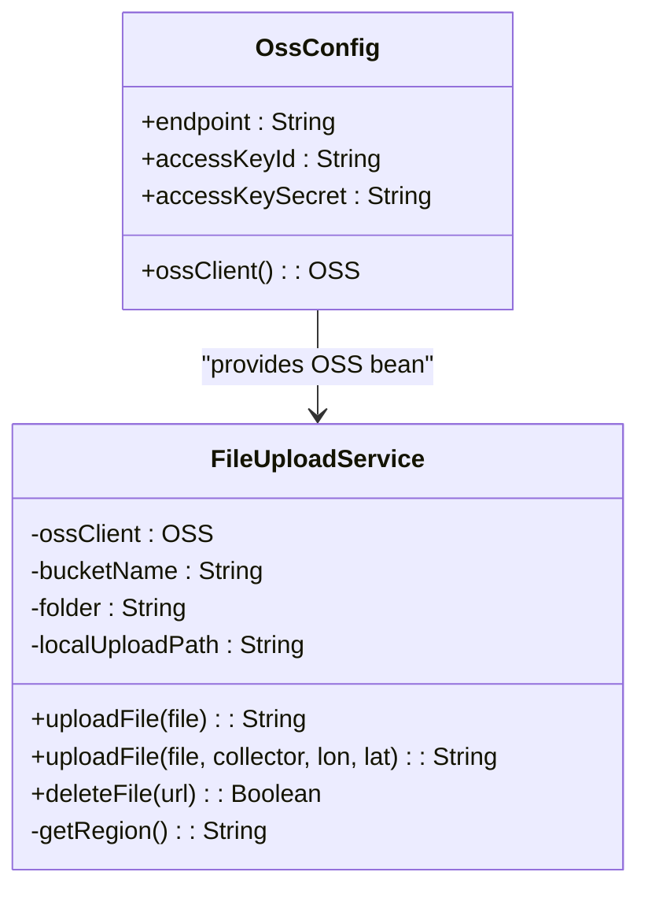
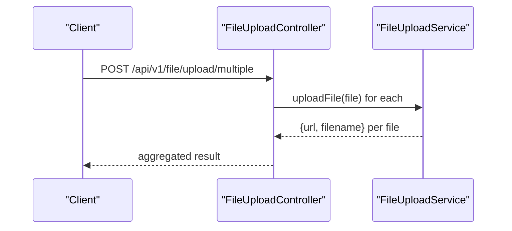
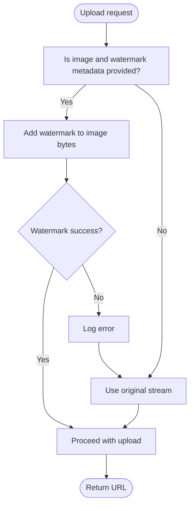
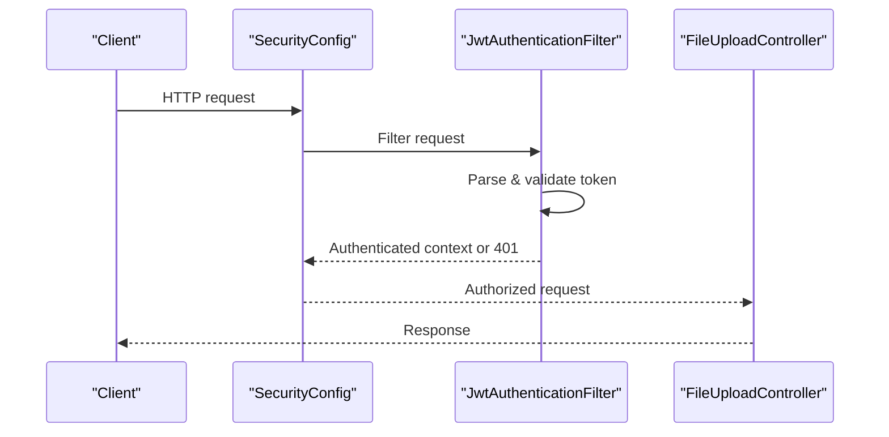
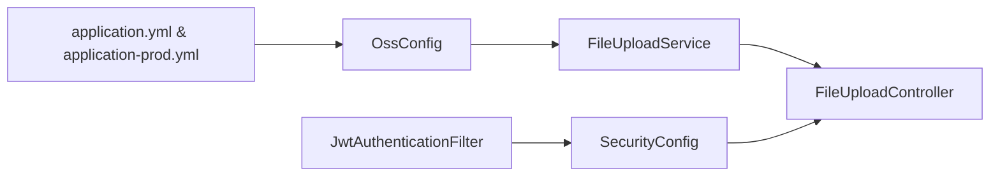

# Cloud Storage Integration

<cite>
**Referenced Files in This Document**
- [OssConfig.java](file://admin-backend/src/main/java/com/qhiot/survey/config/OssConfig.java)
- [FileUploadService.java](file://admin-backend/src/main/java/com/qhiot/survey/service/FileUploadService.java)
- [FileUploadController.java](file://admin-backend/src/main/java/com/qhiot/survey/controller/FileUploadController.java)
- [application.yml](file://admin-backend/src/main/resources/application.yml)
- [application-prod.yml](file://admin-backend/src/main/resources/application-prod.yml)
- [ImageWatermarkUtil.java](file://admin-backend/src/main/java/com/qhiot/survey/common/util/ImageWatermarkUtil.java)
- [SecurityConfig.java](file://admin-backend/src/main/java/com/qhiot/survey/security/SecurityConfig.java)
- [JwtAuthenticationFilter.java](file://admin-backend/src/main/java/com/qhiot/survey/security/JwtAuthenticationFilter.java)
- [WebMvcConfig.java](file://admin-backend/src/main/java/com/qhiot/survey/config/WebMvcConfig.java)
</cite>

## Table of Contents
1. [Introduction](#introduction)
2. [Project Structure](#project-structure)
3. [Core Components](#core-components)
4. [Architecture Overview](#architecture-overview)
5. [Detailed Component Analysis](#detailed-component-analysis)
6. [Dependency Analysis](#dependency-analysis)
7. [Performance Considerations](#performance-considerations)
8. [Troubleshooting Guide](#troubleshooting-guide)
9. [Conclusion](#conclusion)
10. [Appendices](#appendices)

## Introduction
This document explains the Aliyun OSS cloud storage integration in the backend module. It covers configuration setup (access keys, bucket management, endpoint), client initialization with authentication fallback, upload and deletion operations, optional image watermarking, and security considerations including CORS and access control. Monitoring and logging are addressed via Spring Boot Actuator and application logs.

## Project Structure
The cloud storage integration spans configuration, service, controller, and security layers:
- Configuration: Aliyun OSS client bean and environment-driven properties
- Service: File upload and deletion logic with local fallback
- Controller: Public upload and delete endpoints
- Security: CORS policy and JWT-based access control
- Utilities: Optional image watermarking for uploaded photos

**Diagram sources**
- [OssConfig.java:15-33](file://admin-backend/src/main/java/com/qhiot/survey/config/OssConfig.java#L15-L33)
- [application.yml:97-104](file://admin-backend/src/main/resources/application.yml#L97-L104)
- [application-prod.yml:85-92](file://admin-backend/src/main/resources/application-prod.yml#L85-L92)
- [FileUploadService.java:24-34](file://admin-backend/src/main/java/com/qhiot/survey/service/FileUploadService.java#L24-L34)
- [ImageWatermarkUtil.java:20-21](file://admin-backend/src/main/java/com/qhiot/survey/common/util/ImageWatermarkUtil.java#L20-L21)
- [FileUploadController.java:17-20](file://admin-backend/src/main/java/com/qhiot/survey/controller/FileUploadController.java#L17-L20)
- [SecurityConfig.java:32-61](file://admin-backend/src/main/java/com/qhiot/survey/security/SecurityConfig.java#L32-L61)
- [JwtAuthenticationFilter.java:34-81](file://admin-backend/src/main/java/com/qhiot/survey/security/JwtAuthenticationFilter.java#L34-L81)
- [WebMvcConfig.java:12-28](file://admin-backend/src/main/java/com/qhiot/survey/config/WebMvcConfig.java#L12-L28)

**Section sources**
- [OssConfig.java:15-33](file://admin-backend/src/main/java/com/qhiot/survey/config/OssConfig.java#L15-L33)
- [application.yml:97-104](file://admin-backend/src/main/resources/application.yml#L97-L104)
- [application-prod.yml:85-92](file://admin-backend/src/main/resources/application-prod.yml#L85-L92)
- [FileUploadService.java:24-34](file://admin-backend/src/main/java/com/qhiot/survey/service/FileUploadService.java#L24-L34)
- [ImageWatermarkUtil.java:20-21](file://admin-backend/src/main/java/com/qhiot/survey/common/util/ImageWatermarkUtil.java#L20-L21)
- [FileUploadController.java:17-20](file://admin-backend/src/main/java/com/qhiot/survey/controller/FileUploadController.java#L17-L20)
- [SecurityConfig.java:32-61](file://admin-backend/src/main/java/com/qhiot/survey/security/SecurityConfig.java#L32-L61)
- [JwtAuthenticationFilter.java:34-81](file://admin-backend/src/main/java/com/qhiot/survey/security/JwtAuthenticationFilter.java#L34-L81)
- [WebMvcConfig.java:12-28](file://admin-backend/src/main/java/com/qhiot/survey/config/WebMvcConfig.java#L12-L28)

## Core Components
- OSS configuration and client creation
- File upload service with optional watermarking and local fallback
- Upload/delete REST endpoints
- Security configuration for CORS and JWT-based access control

Key responsibilities:
- OssConfig: Builds an OSS client when credentials are present; otherwise returns null to enable local storage fallback.
- FileUploadService: Generates unique filenames, optionally adds watermarks to images, uploads to OSS or falls back to local disk, and deletes files from either backend.
- FileUploadController: Exposes upload and delete endpoints returning structured results.
- SecurityConfig + JwtAuthenticationFilter: Enforces authentication and CORS policy.
- WebMvcConfig: Registers interceptors excluding file upload endpoints.

**Section sources**
- [OssConfig.java:24-33](file://admin-backend/src/main/java/com/qhiot/survey/config/OssConfig.java#L24-L33)
- [FileUploadService.java:39-96](file://admin-backend/src/main/java/com/qhiot/survey/service/FileUploadService.java#L39-L96)
- [FileUploadController.java:25-43](file://admin-backend/src/main/java/com/qhiot/survey/controller/FileUploadController.java#L25-L43)
- [SecurityConfig.java:68-89](file://admin-backend/src/main/java/com/qhiot/survey/security/SecurityConfig.java#L68-L89)
- [JwtAuthenticationFilter.java:43-81](file://admin-backend/src/main/java/com/qhiot/survey/security/JwtAuthenticationFilter.java#L43-L81)
- [WebMvcConfig.java:18-27](file://admin-backend/src/main/java/com/qhiot/survey/config/WebMvcConfig.java#L18-L27)

## Architecture Overview
The integration follows a layered design:
- Properties drive configuration for endpoint, credentials, bucket, and folder.
- The OSS client is conditionally created; when absent, uploads fall back to local disk.
- Uploads support optional watermarking for images.
- Controllers expose endpoints secured by JWT; CORS is configured centrally.

**Diagram sources**
- [FileUploadController.java:25-43](file://admin-backend/src/main/java/com/qhiot/survey/controller/FileUploadController.java#L25-L43)
- [FileUploadService.java:79-96](file://admin-backend/src/main/java/com/qhiot/survey/service/FileUploadService.java#L79-L96)

**Section sources**
- [FileUploadController.java:25-43](file://admin-backend/src/main/java/com/qhiot/survey/controller/FileUploadController.java#L25-L43)
- [FileUploadService.java:79-96](file://admin-backend/src/main/java/com/qhiot/survey/service/FileUploadService.java#L79-L96)

## Detailed Component Analysis

### Configuration Setup
- Endpoint and credentials:
  - Default endpoint and credentials are defined in application.yml.
  - Production overrides are provided in application-prod.yml with environment variable injection.
- Bucket and folder:
  - Bucket name and folder prefix are configurable via properties.
- OSS client creation:
  - OssConfig builds the client only when credentials are present and not placeholders.

Operational notes:
- If OSS credentials are missing or placeholder-like, the OSS client bean is null, enabling local fallback.
- Region extraction in the service defaults to a fixed region; endpoint parsing is simplified.

**Section sources**
- [application.yml:97-104](file://admin-backend/src/main/resources/application.yml#L97-L104)
- [application-prod.yml:85-92](file://admin-backend/src/main/resources/application-prod.yml#L85-L92)
- [OssConfig.java:15-33](file://admin-backend/src/main/java/com/qhiot/survey/config/OssConfig.java#L15-L33)
- [FileUploadService.java:118-121](file://admin-backend/src/main/java/com/qhiot/survey/service/FileUploadService.java#L118-L121)

### Storage Client Implementation
- Authentication:
  - Client built via OSSClientBuilder using endpoint, accessKeyId, and accessKeySecret.
  - Null client indicates no cloud storage; service falls back to local disk.
- Retry and error handling:
  - No explicit retry logic is implemented in the current code.
  - Exceptions during upload or deletion are surfaced to the controller, which returns error responses.
- URL generation:
  - When uploading to OSS, the service constructs a public URL using bucket, region, and object key.

**Diagram sources**
- [OssConfig.java:24-33](file://admin-backend/src/main/java/com/qhiot/survey/config/OssConfig.java#L24-L33)
- [FileUploadService.java:24-34](file://admin-backend/src/main/java/com/qhiot/survey/service/FileUploadService.java#L24-L34)

**Section sources**
- [OssConfig.java:24-33](file://admin-backend/src/main/java/com/qhiot/survey/config/OssConfig.java#L24-L33)
- [FileUploadService.java:79-96](file://admin-backend/src/main/java/com/qhiot/survey/service/FileUploadService.java#L79-L96)

### Upload and Download Operations
- Upload:
  - Single and batch upload endpoints accept multipart/form-data.
  - Watermarking is applied to images when collector metadata is provided.
  - Returns a URL pointing to OSS or local fallback.
- Delete:
  - Supports deleting files from OSS or local filesystem depending on URL scheme.
- Download:
  - The current codebase does not expose a dedicated OSS signed URL endpoint.
  - Local export downloads are supported elsewhere in the system (not part of OSS).

**Diagram sources**
- [FileUploadController.java:45-71](file://admin-backend/src/main/java/com/qhiot/survey/controller/FileUploadController.java#L45-L71)
- [FileUploadService.java:39-96](file://admin-backend/src/main/java/com/qhiot/survey/service/FileUploadService.java#L39-L96)

**Section sources**
- [FileUploadController.java:25-71](file://admin-backend/src/main/java/com/qhiot/survey/controller/FileUploadController.java#L25-L71)
- [FileUploadService.java:39-96](file://admin-backend/src/main/java/com/qhiot/survey/service/FileUploadService.java#L39-L96)

### Image Watermarking
- When uploading images with collector name and geolocation, the service attempts to add a semi-transparent watermark with采集人, 时间, and 位置.
- Failure to add watermark falls back to original image.
- Watermarking is performed in-memory and then uploaded.

**Diagram sources**
- [FileUploadService.java:63-77](file://admin-backend/src/main/java/com/qhiot/survey/service/FileUploadService.java#L63-L77)
- [ImageWatermarkUtil.java:52-152](file://admin-backend/src/main/java/com/qhiot/survey/common/util/ImageWatermarkUtil.java#L52-L152)

**Section sources**
- [FileUploadService.java:63-77](file://admin-backend/src/main/java/com/qhiot/survey/service/FileUploadService.java#L63-L77)
- [ImageWatermarkUtil.java:52-152](file://admin-backend/src/main/java/com/qhiot/survey/common/util/ImageWatermarkUtil.java#L52-L152)

### Security Considerations
- CORS:
  - Configured centrally with allowed origins, methods, headers, credentials, and max age.
  - Allowed origins can be set to wildcard or a specific list via environment variable.
- Access Control:
  - JWT filter extracts tokens from Authorization header and validates them.
  - Security filter chain permits anonymous access to specific paths and requires authentication for others.
- Signed URLs:
  - Not implemented in the current codebase. To securely serve files from OSS, implement server-side signed URL generation and pass short-lived URLs to clients.

**Diagram sources**
- [SecurityConfig.java:39-61](file://admin-backend/src/main/java/com/qhiot/survey/security/SecurityConfig.java#L39-L61)
- [JwtAuthenticationFilter.java:43-81](file://admin-backend/src/main/java/com/qhiot/survey/security/JwtAuthenticationFilter.java#L43-L81)
- [FileUploadController.java:25-43](file://admin-backend/src/main/java/com/qhiot/survey/controller/FileUploadController.java#L25-L43)

**Section sources**
- [SecurityConfig.java:68-89](file://admin-backend/src/main/java/com/qhiot/survey/security/SecurityConfig.java#L68-L89)
- [JwtAuthenticationFilter.java:43-81](file://admin-backend/src/main/java/com/qhiot/survey/security/JwtAuthenticationFilter.java#L43-L81)
- [application.yml:134-136](file://admin-backend/src/main/resources/application.yml#L134-L136)

## Dependency Analysis
- OssConfig depends on environment properties to construct an OSS client.
- FileUploadService depends on the OSS client bean (optional), bucket/folder configuration, and local path.
- FileUploadController depends on FileUploadService and exposes REST endpoints.
- SecurityConfig and JwtAuthenticationFilter enforce CORS and JWT-based authorization.

**Diagram sources**
- [application.yml:97-104](file://admin-backend/src/main/resources/application.yml#L97-L104)
- [application-prod.yml:85-92](file://admin-backend/src/main/resources/application-prod.yml#L85-L92)
- [OssConfig.java:24-33](file://admin-backend/src/main/java/com/qhiot/survey/config/OssConfig.java#L24-L33)
- [FileUploadService.java:24-34](file://admin-backend/src/main/java/com/qhiot/survey/service/FileUploadService.java#L24-L34)
- [FileUploadController.java:22-23](file://admin-backend/src/main/java/com/qhiot/survey/controller/FileUploadController.java#L22-L23)
- [SecurityConfig.java:39-61](file://admin-backend/src/main/java/com/qhiot/survey/security/SecurityConfig.java#L39-L61)
- [JwtAuthenticationFilter.java:34-81](file://admin-backend/src/main/java/com/qhiot/survey/security/JwtAuthenticationFilter.java#L34-L81)

**Section sources**
- [OssConfig.java:24-33](file://admin-backend/src/main/java/com/qhiot/survey/config/OssConfig.java#L24-L33)
- [FileUploadService.java:24-34](file://admin-backend/src/main/java/com/qhiot/survey/service/FileUploadService.java#L24-L34)
- [FileUploadController.java:22-23](file://admin-backend/src/main/java/com/qhiot/survey/controller/FileUploadController.java#L22-L23)
- [SecurityConfig.java:39-61](file://admin-backend/src/main/java/com/qhiot/survey/security/SecurityConfig.java#L39-L61)
- [JwtAuthenticationFilter.java:34-81](file://admin-backend/src/main/java/com/qhiot/survey/security/JwtAuthenticationFilter.java#L34-L81)

## Performance Considerations
- Streaming uploads:
  - Current implementation reads streams into memory for watermarking; large images may increase memory pressure.
  - Consider streaming watermarking or offloading to a worker for heavy processing.
- Retry and timeouts:
  - No explicit retry is implemented for OSS operations; consider adding retry with exponential backoff for transient failures.
- Local fallback:
  - Local disk writes are synchronous; ensure adequate disk throughput and space.
- Monitoring:
  - Enable Spring Boot Actuator metrics and integrate with external monitoring systems.

[No sources needed since this section provides general guidance]

## Troubleshooting Guide
Common issues and resolutions:
- OSS credentials missing or placeholder:
  - Symptom: Local fallback used for uploads.
  - Resolution: Set OSS endpoint, access-key-id, and access-key-secret via environment variables or production YAML.
- Upload failures:
  - Symptom: Controller returns error messages.
  - Resolution: Check OSS bucket permissions, network connectivity, and service logs.
- Watermarking errors:
  - Symptom: Original image uploaded when watermarking fails.
  - Resolution: Verify image format compatibility and logging for exceptions.
- CORS errors:
  - Symptom: Browser blocks requests.
  - Resolution: Configure allowed-origins appropriately for your frontend domain.

**Section sources**
- [OssConfig.java:26-30](file://admin-backend/src/main/java/com/qhiot/survey/config/OssConfig.java#L26-L30)
- [FileUploadController.java:40-42](file://admin-backend/src/main/java/com/qhiot/survey/controller/FileUploadController.java#L40-L42)
- [FileUploadService.java:71-74](file://admin-backend/src/main/java/com/qhiot/survey/service/FileUploadService.java#L71-L74)
- [SecurityConfig.java:68-89](file://admin-backend/src/main/java/com/qhiot/survey/security/SecurityConfig.java#L68-L89)

## Conclusion
The system integrates Aliyun OSS with a clean fallback to local storage when credentials are unavailable. Uploads support optional watermarking for images, and security is enforced via JWT and CORS. For production, consider implementing signed URLs for secure object retrieval, adding retry logic, and optimizing streaming and memory usage for large files.

[No sources needed since this section summarizes without analyzing specific files]

## Appendices

### Configuration Reference
- Aliyun OSS properties:
  - endpoint: OSS endpoint hostname
  - access-key-id: OSS access key ID
  - access-key-secret: OSS access key secret
  - bucket-name: Target bucket
  - folder: Prefix for uploaded objects
- CORS:
  - allowed-origins: Comma-separated list or wildcard

**Section sources**
- [application.yml:97-104](file://admin-backend/src/main/resources/application.yml#L97-L104)
- [application-prod.yml:85-92](file://admin-backend/src/main/resources/application-prod.yml#L85-L92)
- [SecurityConfig.java:68-89](file://admin-backend/src/main/java/com/qhiot/survey/security/SecurityConfig.java#L68-L89)