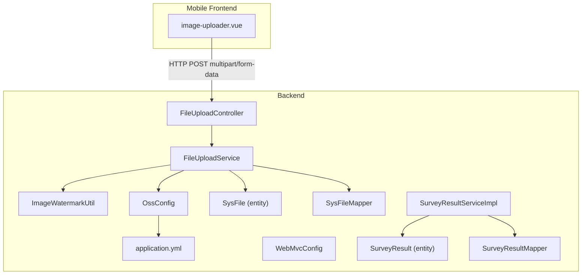
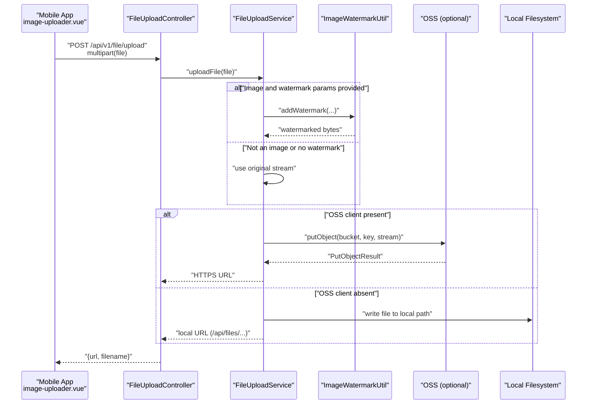
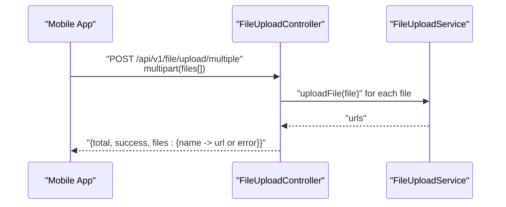
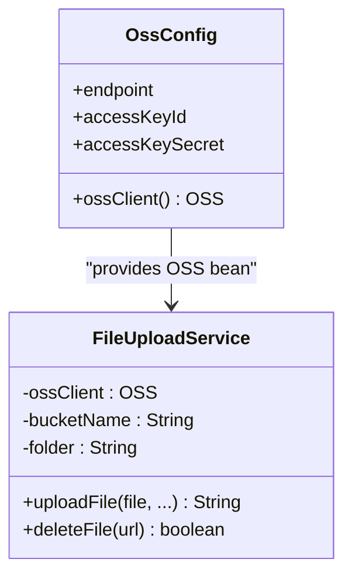
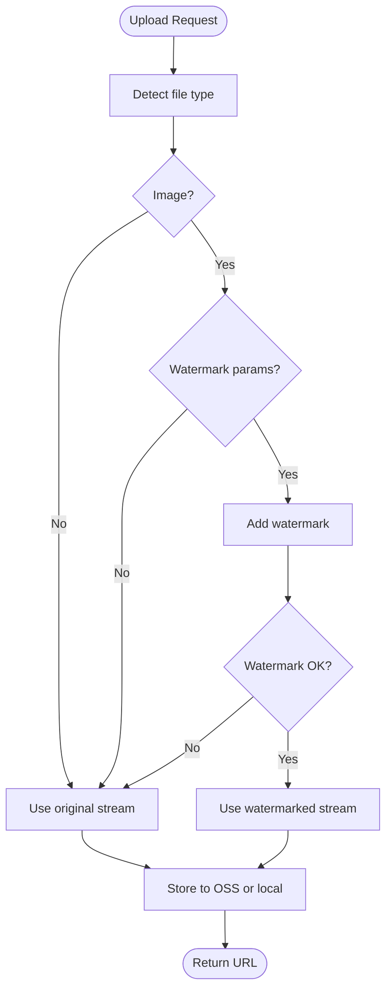
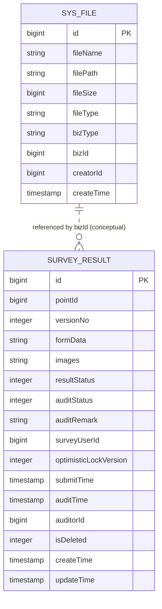
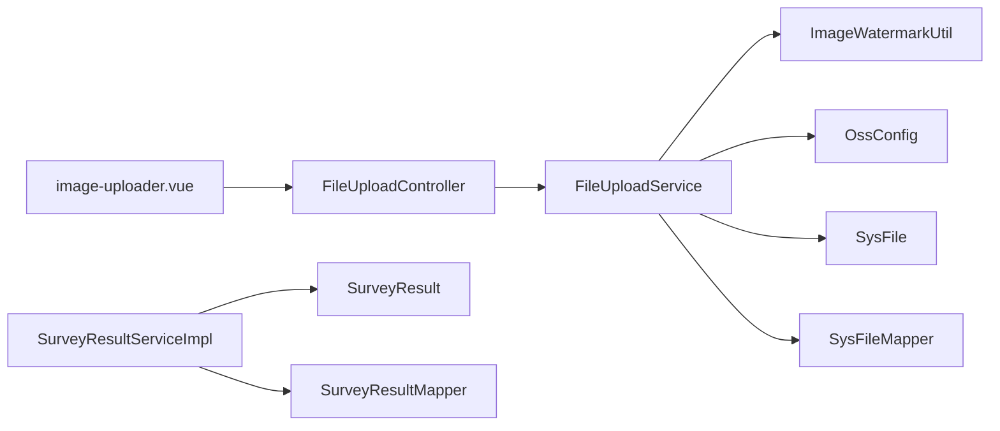

# File Management

<cite>
**Referenced Files in This Document**
- [FileUploadController.java](file://admin-backend/src/main/java/com/qhiot/survey/controller/FileUploadController.java)
- [FileUploadService.java](file://admin-backend/src/main/java/com/qhiot/survey/service/FileUploadService.java)
- [ImageWatermarkUtil.java](file://admin-backend/src/main/java/com/qhiot/survey/common/util/ImageWatermarkUtil.java)
- [OssConfig.java](file://admin-backend/src/main/java/com/qhiot/survey/config/OssConfig.java)
- [application.yml](file://admin-backend/src/main/resources/application.yml)
- [WebMvcConfig.java](file://admin-backend/src/main/java/com/qhiot/survey/config/WebMvcConfig.java)
- [SysFile.java](file://admin-backend/src/main/java/com/qhiot/survey/entity/SysFile.java)
- [SysFileMapper.java](file://admin-backend/src/main/java/com/qhiot/survey/mapper/SysFileMapper.java)
- [SurveyResult.java](file://admin-backend/src/main/java/com/qhiot/survey/entity/SurveyResult.java)
- [SurveyResultServiceImpl.java](file://admin-backend/src/main/java/com/qhiot/survey/service/impl/SurveyResultServiceImpl.java)
- [SurveyResultMapper.java](file://admin-backend/src/main/java/com/qhiot/survey/mapper/SurveyResultMapper.java)
- [image-uploader.vue](file://mobile-app/src/components/image-uploader/image-uploader.vue)
</cite>

## Table of Contents
1. [Introduction](#introduction)
2. [Project Structure](#project-structure)
3. [Core Components](#core-components)
4. [Architecture Overview](#architecture-overview)
5. [Detailed Component Analysis](#detailed-component-analysis)
6. [Dependency Analysis](#dependency-analysis)
7. [Performance Considerations](#performance-considerations)
8. [Troubleshooting Guide](#troubleshooting-guide)
9. [Conclusion](#conclusion)
10. [Appendices](#appendices)

## Introduction
This document explains the file management and cloud storage integration system for the Survey App. It covers the file upload architecture (multipart handling, size limits, and format considerations), Aliyun OSS integration (scalable object storage with security and access control), the image processing pipeline (watermarking, resizing, optimization), metadata management and retrieval, and integration with survey results for associated media files. It also includes practical examples for upload workflows, thumbnail generation, batch operations, and cleanup procedures.

## Project Structure
The file management subsystem spans backend controllers, services, utilities, configuration, and entities, plus a mobile frontend component that drives uploads.

**Diagram sources**
- [FileUploadController.java:1-80](file://admin-backend/src/main/java/com/qhiot/survey/controller/FileUploadController.java#L1-L80)
- [FileUploadService.java:1-122](file://admin-backend/src/main/java/com/qhiot/survey/service/FileUploadService.java#L1-L122)
- [ImageWatermarkUtil.java:1-218](file://admin-backend/src/main/java/com/qhiot/survey/common/util/ImageWatermarkUtil.java#L1-L218)
- [OssConfig.java:1-34](file://admin-backend/src/main/java/com/qhiot/survey/config/OssConfig.java#L1-L34)
- [application.yml:1-149](file://admin-backend/src/main/resources/application.yml#L1-L149)
- [WebMvcConfig.java:1-29](file://admin-backend/src/main/java/com/qhiot/survey/config/WebMvcConfig.java#L1-L29)
- [SysFile.java:1-46](file://admin-backend/src/main/java/com/qhiot/survey/entity/SysFile.java#L1-L46)
- [SysFileMapper.java:1-12](file://admin-backend/src/main/java/com/qhiot/survey/mapper/SysFileMapper.java#L1-L12)
- [SurveyResult.java:1-93](file://admin-backend/src/main/java/com/qhiot/survey/entity/SurveyResult.java#L1-L93)
- [SurveyResultServiceImpl.java:1-364](file://admin-backend/src/main/java/com/qhiot/survey/service/impl/SurveyResultServiceImpl.java#L1-L364)
- [SurveyResultMapper.java:1-22](file://admin-backend/src/main/java/com/qhiot/survey/mapper/SurveyResultMapper.java#L1-L22)
- [image-uploader.vue:1-319](file://mobile-app/src/components/image-uploader/image-uploader.vue#L1-L319)

**Section sources**
- [FileUploadController.java:1-80](file://admin-backend/src/main/java/com/qhiot/survey/controller/FileUploadController.java#L1-L80)
- [FileUploadService.java:1-122](file://admin-backend/src/main/java/com/qhiot/survey/service/FileUploadService.java#L1-L122)
- [OssConfig.java:1-34](file://admin-backend/src/main/java/com/qhiot/survey/config/OssConfig.java#L1-L34)
- [application.yml:1-149](file://admin-backend/src/main/resources/application.yml#L1-L149)
- [WebMvcConfig.java:1-29](file://admin-backend/src/main/java/com/qhiot/survey/config/WebMvcConfig.java#L1-L29)
- [SysFile.java:1-46](file://admin-backend/src/main/java/com/qhiot/survey/entity/SysFile.java#L1-L46)
- [SysFileMapper.java:1-12](file://admin-backend/src/main/java/com/qhiot/survey/mapper/SysFileMapper.java#L1-L12)
- [SurveyResult.java:1-93](file://admin-backend/src/main/java/com/qhiot/survey/entity/SurveyResult.java#L1-L93)
- [SurveyResultServiceImpl.java:1-364](file://admin-backend/src/main/java/com/qhiot/survey/service/impl/SurveyResultServiceImpl.java#L1-L364)
- [SurveyResultMapper.java:1-22](file://admin-backend/src/main/java/com/qhiot/survey/mapper/SurveyResultMapper.java#L1-L22)
- [image-uploader.vue:1-319](file://mobile-app/src/components/image-uploader/image-uploader.vue#L1-L319)

## Core Components
- FileUploadController: Exposes REST endpoints for single and multiple file uploads, and deletion. It delegates to FileUploadService and logs operations.
- FileUploadService: Implements upload logic with optional watermarking, OSS or local fallback, and deletion. It generates unique filenames and constructs URLs.
- ImageWatermarkUtil: Adds semi-transparent, rounded-label watermarks to images with collector, timestamp, and location data.
- OssConfig: Creates an OSS client bean conditionally based on configured credentials; returns null to fall back to local storage when missing.
- application.yml: Defines multipart limits, OSS endpoint and credentials, and other runtime settings.
- SysFile: Entity representing persisted file metadata for auditing and lifecycle management.
- SysFileMapper: MyBatis mapper for SysFile persistence.
- SurveyResult: Entity storing survey-related media as JSON array of URLs; integrates with file management via upload service.
- SurveyResultServiceImpl: Business service for survey results, including versioning and audit workflows; persists media URLs with results.
- SurveyResultMapper: MyBatis mapper for survey result queries.
- image-uploader.vue: Mobile component that selects images, compresses them, and uploads via multipart/form-data to the backend.

**Section sources**
- [FileUploadController.java:1-80](file://admin-backend/src/main/java/com/qhiot/survey/controller/FileUploadController.java#L1-L80)
- [FileUploadService.java:1-122](file://admin-backend/src/main/java/com/qhiot/survey/service/FileUploadService.java#L1-L122)
- [ImageWatermarkUtil.java:1-218](file://admin-backend/src/main/java/com/qhiot/survey/common/util/ImageWatermarkUtil.java#L1-L218)
- [OssConfig.java:1-34](file://admin-backend/src/main/java/com/qhiot/survey/config/OssConfig.java#L1-L34)
- [application.yml:1-149](file://admin-backend/src/main/resources/application.yml#L1-L149)
- [SysFile.java:1-46](file://admin-backend/src/main/java/com/qhiot/survey/entity/SysFile.java#L1-L46)
- [SysFileMapper.java:1-12](file://admin-backend/src/main/java/com/qhiot/survey/mapper/SysFileMapper.java#L1-L12)
- [SurveyResult.java:1-93](file://admin-backend/src/main/java/com/qhiot/survey/entity/SurveyResult.java#L1-L93)
- [SurveyResultServiceImpl.java:1-364](file://admin-backend/src/main/java/com/qhiot/survey/service/impl/SurveyResultServiceImpl.java#L1-L364)
- [SurveyResultMapper.java:1-22](file://admin-backend/src/main/java/com/qhiot/survey/mapper/SurveyResultMapper.java#L1-L22)
- [image-uploader.vue:1-319](file://mobile-app/src/components/image-uploader/image-uploader.vue#L1-L319)

## Architecture Overview
The system supports two storage backends:
- Cloud (Aliyun OSS): Primary storage when credentials are configured; returns HTTPS URLs.
- Local fallback: Used when OSS client is unavailable; stores files under a configurable path and serves via a local route.

Upload flow:
- Frontend sends multipart/form-data with a file field.
- Controller validates and invokes service.
- Service optionally adds watermarks for images, then uploads to OSS or falls back to local disk.
- On success, the service returns a URL; on failure, an error response is returned.

**Diagram sources**
- [image-uploader.vue:163-180](file://mobile-app/src/components/image-uploader/image-uploader.vue#L163-L180)
- [FileUploadController.java:25-43](file://admin-backend/src/main/java/com/qhiot/survey/controller/FileUploadController.java#L25-L43)
- [FileUploadService.java:39-96](file://admin-backend/src/main/java/com/qhiot/survey/service/FileUploadService.java#L39-L96)
- [ImageWatermarkUtil.java:52-152](file://admin-backend/src/main/java/com/qhiot/survey/common/util/ImageWatermarkUtil.java#L52-L152)
- [OssConfig.java:24-33](file://admin-backend/src/main/java/com/qhiot/survey/config/OssConfig.java#L24-L33)

**Section sources**
- [FileUploadController.java:1-80](file://admin-backend/src/main/java/com/qhiot/survey/controller/FileUploadController.java#L1-L80)
- [FileUploadService.java:1-122](file://admin-backend/src/main/java/com/qhiot/survey/service/FileUploadService.java#L1-L122)
- [ImageWatermarkUtil.java:1-218](file://admin-backend/src/main/java/com/qhiot/survey/common/util/ImageWatermarkUtil.java#L1-L218)
- [OssConfig.java:1-34](file://admin-backend/src/main/java/com/qhiot/survey/config/OssConfig.java#L1-L34)
- [application.yml:18-24](file://admin-backend/src/main/resources/application.yml#L18-L24)
- [image-uploader.vue:1-319](file://mobile-app/src/components/image-uploader/image-uploader.vue#L1-L319)

## Detailed Component Analysis

### Upload Endpoints and Workflows
- Single upload: Accepts a multipart file and returns the generated URL and original filename.
- Multiple upload: Iterates over provided files, aggregates per-file results, and returns totals and successes.
- Delete: Removes a file by URL, supporting both OSS and local paths.

**Diagram sources**
- [FileUploadController.java:45-71](file://admin-backend/src/main/java/com/qhiot/survey/controller/FileUploadController.java#L45-L71)
- [FileUploadService.java:39-96](file://admin-backend/src/main/java/com/qhiot/survey/service/FileUploadService.java#L39-L96)

**Section sources**
- [FileUploadController.java:25-80](file://admin-backend/src/main/java/com/qhiot/survey/controller/FileUploadController.java#L25-L80)
- [FileUploadService.java:39-116](file://admin-backend/src/main/java/com/qhiot/survey/service/FileUploadService.java#L39-L116)

### Multipart Handling, Size Limits, and Validation
- Multipart limits are configured in application.yml:
  - Max file size: 10 MB
  - Max request size: 50 MB
  - Threshold for writing to disk: 2 KB
- These constraints apply to all multipart uploads, including file uploads and any other multipart requests.
- Validation occurs automatically by Spring Boot’s multipart resolver; oversized files will trigger exceptions surfaced to the caller.

**Section sources**
- [application.yml:18-24](file://admin-backend/src/main/resources/application.yml#L18-L24)

### Aliyun OSS Integration and Access Control
- OSS client creation is controlled by environment variables and configuration:
  - Endpoint, Access Key ID, Access Key Secret, Bucket Name, Folder
- If credentials are missing or defaulted, the OSS client bean is null, triggering local storage fallback.
- Access control:
  - Objects are stored under a configurable folder prefix.
  - Returned URLs are HTTPS and publicly accessible unless bucket policies restrict access.
  - For private access, consider generating signed URLs or using server-side proxying.

**Diagram sources**
- [OssConfig.java:1-34](file://admin-backend/src/main/java/com/qhiot/survey/config/OssConfig.java#L1-L34)
- [FileUploadService.java:24-34](file://admin-backend/src/main/java/com/qhiot/survey/service/FileUploadService.java#L24-L34)

**Section sources**
- [OssConfig.java:1-34](file://admin-backend/src/main/java/com/qhiot/survey/config/OssConfig.java#L1-L34)
- [application.yml:97-105](file://admin-backend/src/main/resources/application.yml#L97-L105)

### Image Processing Pipeline: Watermarking, Resizing, Optimization
- Watermarking:
  - Applied only to images with recognized extensions.
  - Adds a semi-transparent, rounded black background label containing collector name, timestamp, and formatted coordinates.
  - Falls back to original image on watermark errors.
- Resizing and optimization:
  - No explicit resizing or compression is performed in the current implementation.
  - Images are written to the target format using the original format name detected during watermarking.

**Diagram sources**
- [FileUploadService.java:52-96](file://admin-backend/src/main/java/com/qhiot/survey/service/FileUploadService.java#L52-L96)
- [ImageWatermarkUtil.java:52-152](file://admin-backend/src/main/java/com/qhiot/survey/common/util/ImageWatermarkUtil.java#L52-L152)

**Section sources**
- [FileUploadService.java:52-96](file://admin-backend/src/main/java/com/qhiot/survey/service/FileUploadService.java#L52-L96)
- [ImageWatermarkUtil.java:16-152](file://admin-backend/src/main/java/com/qhiot/survey/common/util/ImageWatermarkUtil.java#L16-L152)

### Metadata Management and Retrieval
- SysFile entity:
  - Stores filename, path, size, type, business type, business ID, creator ID, and timestamps.
  - Intended for audit trails and lifecycle management of uploaded artifacts.
- SysFileMapper:
  - Provides CRUD operations for SysFile records.
- SurveyResult integration:
  - SurveyResult stores media as a JSON array of URLs in the images field.
  - Business logic persists and retrieves media URLs alongside form data and audit states.

**Diagram sources**
- [SysFile.java:1-46](file://admin-backend/src/main/java/com/qhiot/survey/entity/SysFile.java#L1-L46)
- [SurveyResult.java:1-93](file://admin-backend/src/main/java/com/qhiot/survey/entity/SurveyResult.java#L1-L93)

**Section sources**
- [SysFile.java:1-46](file://admin-backend/src/main/java/com/qhiot/survey/entity/SysFile.java#L1-L46)
- [SysFileMapper.java:1-12](file://admin-backend/src/main/java/com/qhiot/survey/mapper/SysFileMapper.java#L1-L12)
- [SurveyResult.java:39-42](file://admin-backend/src/main/java/com/qhiot/survey/entity/SurveyResult.java#L39-L42)
- [SurveyResultServiceImpl.java:344-363](file://admin-backend/src/main/java/com/qhiot/survey/service/impl/SurveyResultServiceImpl.java#L344-L363)

### Cleanup Procedures
- Delete endpoint:
  - Supports both OSS and local files by parsing the URL scheme and extracting the filename.
  - Returns success/failure based on underlying operation outcome.
- Recommendation:
  - Combine deletion with SysFile record updates to maintain auditability.
  - For OSS, consider lifecycle policies or scheduled cleanup jobs for orphaned objects.

**Section sources**
- [FileUploadController.java:73-80](file://admin-backend/src/main/java/com/qhiot/survey/controller/FileUploadController.java#L73-L80)
- [FileUploadService.java:98-116](file://admin-backend/src/main/java/com/qhiot/survey/service/FileUploadService.java#L98-L116)

### Examples and Workflows

#### Single File Upload Workflow
- Frontend:
  - Uses the image uploader component to capture or select images.
  - Compressed images are sent via multipart/form-data.
- Backend:
  - Controller receives the file and delegates to FileUploadService.
  - Optional watermarking is applied for images.
  - File is uploaded to OSS or saved locally.
  - URL and filename are returned.

**Section sources**
- [image-uploader.vue:145-180](file://mobile-app/src/components/image-uploader/image-uploader.vue#L145-L180)
- [FileUploadController.java:25-43](file://admin-backend/src/main/java/com/qhiot/survey/controller/FileUploadController.java#L25-L43)
- [FileUploadService.java:39-96](file://admin-backend/src/main/java/com/qhiot/survey/service/FileUploadService.java#L39-L96)

#### Batch Upload Workflow
- Frontend:
  - Selects multiple images; each is uploaded individually with immediate feedback.
- Backend:
  - Controller iterates over files, invoking FileUploadService for each.
  - Aggregates results and returns counts and per-file outcomes.

**Section sources**
- [FileUploadController.java:45-71](file://admin-backend/src/main/java/com/qhiot/survey/controller/FileUploadController.java#L45-L71)
- [FileUploadService.java:39-96](file://admin-backend/src/main/java/com/qhiot/survey/service/FileUploadService.java#L39-L96)

#### Thumbnail Generation
- Current implementation does not generate thumbnails.
- To add thumbnails:
  - Introduce a dedicated resize operation in the image processing pipeline.
  - Store thumbnails separately (e.g., under a “thumbs” subfolder) and persist their URLs in SysFile or alongside media URLs in SurveyResult.

[No sources needed since this section provides general guidance]

#### Integration with Survey Results
- Media association:
  - Uploaded image URLs are collected and stored in the SurveyResult.images JSON array.
  - Versioning and audit workflows operate independently of file storage; media URLs are part of the result payload.
- Retrieval:
  - Latest approved result can be fetched via SurveyResultMapper’s latest query.
  - Media URLs are included in the result’s images field.

**Section sources**
- [SurveyResult.java:39-42](file://admin-backend/src/main/java/com/qhiot/survey/entity/SurveyResult.java#L39-L42)
- [SurveyResultMapper.java:17-20](file://admin-backend/src/main/java/com/qhiot/survey/mapper/SurveyResultMapper.java#L17-L20)
- [SurveyResultServiceImpl.java:344-363](file://admin-backend/src/main/java/com/qhiot/survey/service/impl/SurveyResultServiceImpl.java#L344-L363)

## Dependency Analysis
- Controller depends on FileUploadService.
- FileUploadService depends on:
  - OSS client (optional) via OssConfig.
  - ImageWatermarkUtil for image processing.
  - Local filesystem for fallback storage.
- Entities and mappers support metadata and audit trails.
- Frontend component depends on backend endpoints for upload.

**Diagram sources**
- [image-uploader.vue:1-319](file://mobile-app/src/components/image-uploader/image-uploader.vue#L1-L319)
- [FileUploadController.java:1-80](file://admin-backend/src/main/java/com/qhiot/survey/controller/FileUploadController.java#L1-L80)
- [FileUploadService.java:1-122](file://admin-backend/src/main/java/com/qhiot/survey/service/FileUploadService.java#L1-L122)
- [ImageWatermarkUtil.java:1-218](file://admin-backend/src/main/java/com/qhiot/survey/common/util/ImageWatermarkUtil.java#L1-L218)
- [OssConfig.java:1-34](file://admin-backend/src/main/java/com/qhiot/survey/config/OssConfig.java#L1-L34)
- [SysFile.java:1-46](file://admin-backend/src/main/java/com/qhiot/survey/entity/SysFile.java#L1-L46)
- [SysFileMapper.java:1-12](file://admin-backend/src/main/java/com/qhiot/survey/mapper/SysFileMapper.java#L1-L12)
- [SurveyResult.java:1-93](file://admin-backend/src/main/java/com/qhiot/survey/entity/SurveyResult.java#L1-L93)
- [SurveyResultServiceImpl.java:1-364](file://admin-backend/src/main/java/com/qhiot/survey/service/impl/SurveyResultServiceImpl.java#L1-L364)
- [SurveyResultMapper.java:1-22](file://admin-backend/src/main/java/com/qhiot/survey/mapper/SurveyResultMapper.java#L1-L22)

**Section sources**
- [FileUploadController.java:1-80](file://admin-backend/src/main/java/com/qhiot/survey/controller/FileUploadController.java#L1-L80)
- [FileUploadService.java:1-122](file://admin-backend/src/main/java/com/qhiot/survey/service/FileUploadService.java#L1-L122)
- [OssConfig.java:1-34](file://admin-backend/src/main/java/com/qhiot/survey/config/OssConfig.java#L1-L34)
- [SysFile.java:1-46](file://admin-backend/src/main/java/com/qhiot/survey/entity/SysFile.java#L1-L46)
- [SurveyResult.java:1-93](file://admin-backend/src/main/java/com/qhiot/survey/entity/SurveyResult.java#L1-L93)
- [SurveyResultServiceImpl.java:1-364](file://admin-backend/src/main/java/com/qhiot/survey/service/impl/SurveyResultServiceImpl.java#L1-L364)
- [SurveyResultMapper.java:1-22](file://admin-backend/src/main/java/com/qhiot/survey/mapper/SurveyResultMapper.java#L1-L22)
- [image-uploader.vue:1-319](file://mobile-app/src/components/image-uploader/image-uploader.vue#L1-L319)

## Performance Considerations
- Multipart thresholds and sizes:
  - Tune max-file-size and max-request-size to balance memory usage and upload reliability.
- Watermarking cost:
  - Image processing increases CPU and memory usage; consider offloading to async workers or limiting concurrent watermark operations.
- OSS vs local:
  - Prefer OSS for scalability and durability; local fallback is suitable for development or low-volume scenarios.
- CDN and caching:
  - Serve OSS URLs through a CDN for improved global latency and bandwidth efficiency.

[No sources needed since this section provides general guidance]

## Troubleshooting Guide
- OSS client not initialized:
  - Symptom: Fallback to local storage despite OSS being configured.
  - Cause: Missing or empty credentials cause OssConfig to return null.
  - Resolution: Set proper OSS credentials and endpoint in environment variables.
- Upload failures:
  - Validate multipart limits and network stability.
  - Check service logs for watermark exceptions; the system falls back to original images on watermark errors.
- Deleting files:
  - Ensure the URL format matches either OSS HTTPS or local route; otherwise deletion will fail silently.

**Section sources**
- [OssConfig.java:24-33](file://admin-backend/src/main/java/com/qhiot/survey/config/OssConfig.java#L24-L33)
- [FileUploadService.java:65-77](file://admin-backend/src/main/java/com/qhiot/survey/service/FileUploadService.java#L65-L77)
- [FileUploadController.java:73-80](file://admin-backend/src/main/java/com/qhiot/survey/controller/FileUploadController.java#L73-L80)

## Conclusion
The file management system provides a robust, extensible foundation for uploading, processing, and retrieving media. It seamlessly integrates Aliyun OSS with a safe local fallback, supports watermarking for image authenticity, and maintains metadata for auditability. By leveraging SurveyResult’s media field and the provided APIs, applications can efficiently manage associated media within survey workflows.

## Appendices

### API Definitions
- Upload single file
  - Method: POST
  - Path: /api/v1/file/upload
  - Body: multipart/form-data with field file
  - Response: { url, filename }
- Upload multiple files
  - Method: POST
  - Path: /api/v1/file/upload/multiple
  - Body: multipart/form-data with field files[]
  - Response: { total, success, files: { name -> url or error } }
- Delete file
  - Method: DELETE
  - Path: /api/v1/file/delete
  - Query: fileUrl
  - Response: boolean

**Section sources**
- [FileUploadController.java:25-80](file://admin-backend/src/main/java/com/qhiot/survey/controller/FileUploadController.java#L25-L80)