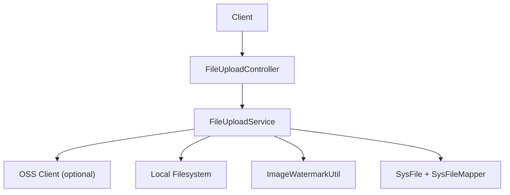
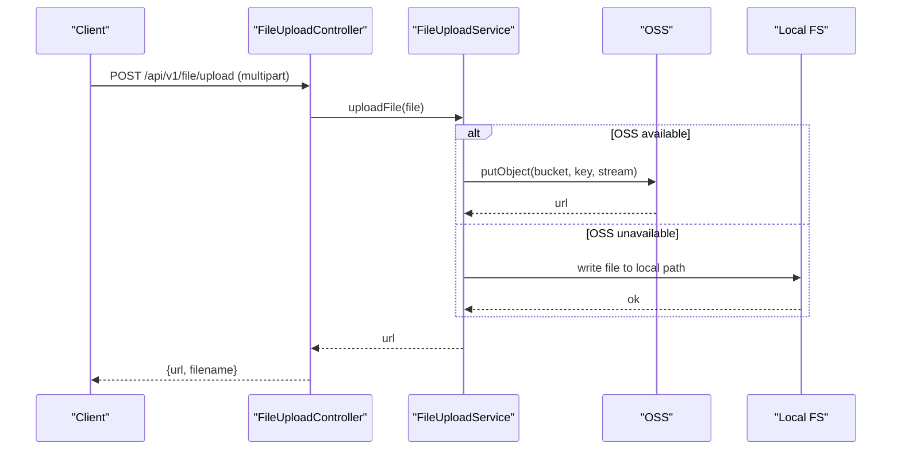
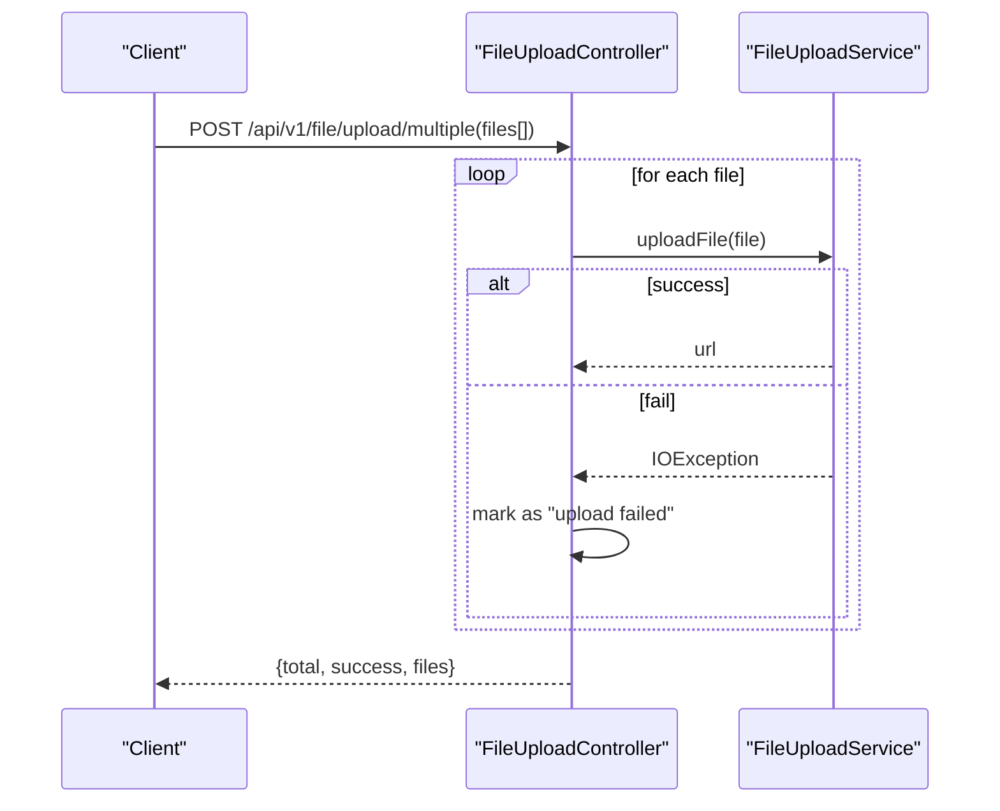
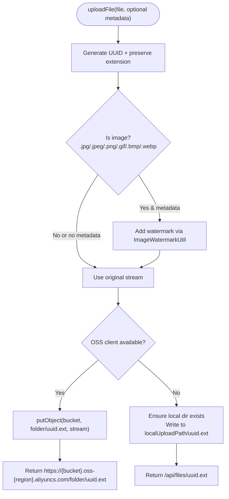
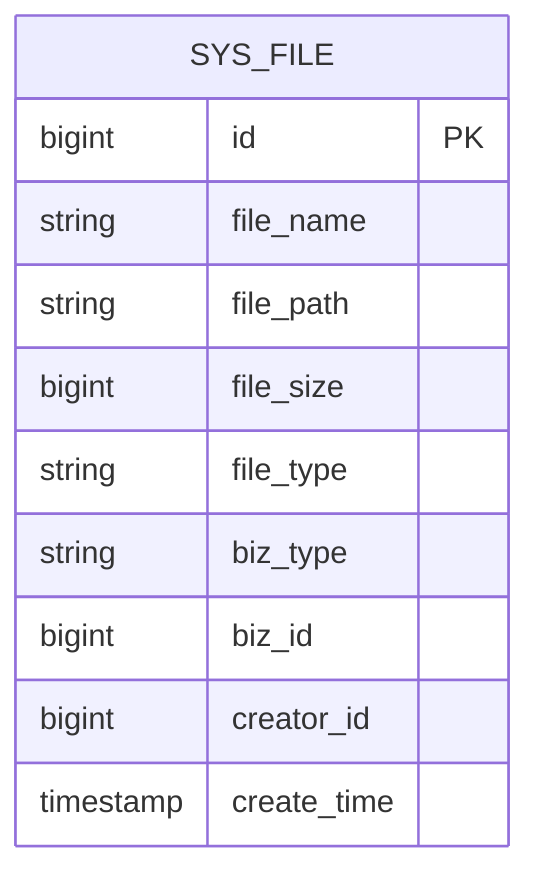
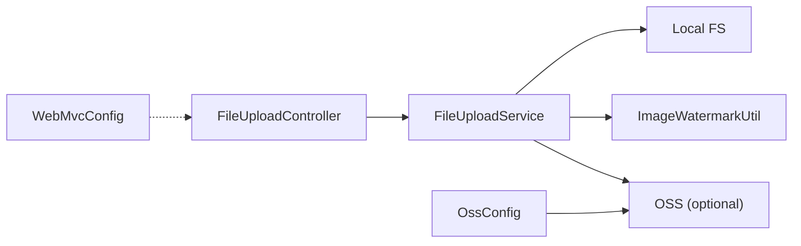

# File Upload System

<cite>
**Referenced Files in This Document**
- [FileUploadController.java](file://admin-backend/src/main/java/com/qhiot/survey/controller/FileUploadController.java)
- [FileUploadService.java](file://admin-backend/src/main/java/com/qhiot/survey/service/FileUploadService.java)
- [OssConfig.java](file://admin-backend/src/main/java/com/qhiot/survey/config/OssConfig.java)
- [WebMvcConfig.java](file://admin-backend/src/main/java/com/qhiot/survey/config/WebMvcConfig.java)
- [application.yml](file://admin-backend/src/main/resources/application.yml)
- [SysFile.java](file://admin-backend/src/main/java/com/qhiot/survey/entity/SysFile.java)
- [SysFileMapper.java](file://admin-backend/src/main/java/com/qhiot/survey/mapper/SysFileMapper.java)
- [ImageWatermarkUtil.java](file://admin-backend/src/main/java/com/qhiot/survey/common/util/ImageWatermarkUtil.java)
</cite>

## Table of Contents
1. [Introduction](#introduction)
2. [Project Structure](#project-structure)
3. [Core Components](#core-components)
4. [Architecture Overview](#architecture-overview)
5. [Detailed Component Analysis](#detailed-component-analysis)
6. [Dependency Analysis](#dependency-analysis)
7. [Performance Considerations](#performance-considerations)
8. [Troubleshooting Guide](#troubleshooting-guide)
9. [Conclusion](#conclusion)
10. [Appendices](#appendices)

## Introduction
This document describes the file upload system architecture, focusing on multipart file handling, validation, format restrictions, security checks, controller endpoints, service layer implementation, storage strategies, and operational patterns. It also covers naming conventions, path organization, access control mechanisms, and performance considerations.

## Project Structure
The file upload system spans the controller, service, configuration, utilities, and persistence layers:
- Controller exposes REST endpoints for single and batch uploads and deletion.
- Service handles multipart file processing, optional watermarks, and storage to OSS or local fallback.
- Configuration defines OSS client availability and Spring Boot multipart limits.
- Utility adds watermarks to images when provided metadata.
- Persistence model stores file metadata for audit and retrieval.

**Diagram sources**
- [FileUploadController.java:19-80](file://admin-backend/src/main/java/com/qhiot/survey/controller/FileUploadController.java#L19-L80)
- [FileUploadService.java:22-122](file://admin-backend/src/main/java/com/qhiot/survey/service/FileUploadService.java#L22-L122)
- [OssConfig.java:12-34](file://admin-backend/src/main/java/com/qhiot/survey/config/OssConfig.java#L12-L34)
- [SysFile.java:14-46](file://admin-backend/src/main/java/com/qhiot/survey/entity/SysFile.java#L14-L46)
- [SysFileMapper.java:10-12](file://admin-backend/src/main/java/com/qhiot/survey/mapper/SysFileMapper.java#L10-L12)
- [ImageWatermarkUtil.java:20-218](file://admin-backend/src/main/java/com/qhiot/survey/common/util/ImageWatermarkUtil.java#L20-L218)

**Section sources**
- [FileUploadController.java:19-80](file://admin-backend/src/main/java/com/qhiot/survey/controller/FileUploadController.java#L19-L80)
- [FileUploadService.java:22-122](file://admin-backend/src/main/java/com/qhiot/survey/service/FileUploadService.java#L22-L122)
- [OssConfig.java:12-34](file://admin-backend/src/main/java/com/qhiot/survey/config/OssConfig.java#L12-L34)
- [application.yml:18-24](file://admin-backend/src/main/resources/application.yml#L18-L24)
- [SysFile.java:14-46](file://admin-backend/src/main/java/com/qhiot/survey/entity/SysFile.java#L14-L46)
- [SysFileMapper.java:10-12](file://admin-backend/src/main/java/com/qhiot/survey/mapper/SysFileMapper.java#L10-L12)
- [ImageWatermarkUtil.java:20-218](file://admin-backend/src/main/java/com/qhiot/survey/common/util/ImageWatermarkUtil.java#L20-L218)

## Core Components
- FileUploadController: Exposes endpoints for single upload, batch upload, and delete. Returns standardized Result envelopes.
- FileUploadService: Orchestrates multipart processing, optional watermarks, OSS/local storage, and deletion.
- OssConfig: Conditional OSS client creation based on configured credentials.
- WebMvcConfig: Registers interceptors and excludes file upload from idempotency enforcement.
- application.yml: Defines multipart limits and OSS defaults.
- SysFile/SysFileMapper: Persist file metadata for audit and linkage to business entities.
- ImageWatermarkUtil: Adds watermarks to images with configurable transparency and font size.

**Section sources**
- [FileUploadController.java:19-80](file://admin-backend/src/main/java/com/qhiot/survey/controller/FileUploadController.java#L19-L80)
- [FileUploadService.java:22-122](file://admin-backend/src/main/java/com/qhiot/survey/service/FileUploadService.java#L22-L122)
- [OssConfig.java:12-34](file://admin-backend/src/main/java/com/qhiot/survey/config/OssConfig.java#L12-L34)
- [WebMvcConfig.java:14-29](file://admin-backend/src/main/java/com/qhiot/survey/config/WebMvcConfig.java#L14-L29)
- [application.yml:18-24](file://admin-backend/src/main/resources/application.yml#L18-L24)
- [SysFile.java:14-46](file://admin-backend/src/main/java/com/qhiot/survey/entity/SysFile.java#L14-L46)
- [SysFileMapper.java:10-12](file://admin-backend/src/main/java/com/qhiot/survey/mapper/SysFileMapper.java#L10-L12)
- [ImageWatermarkUtil.java:20-218](file://admin-backend/src/main/java/com/qhiot/survey/common/util/ImageWatermarkUtil.java#L20-L218)

## Architecture Overview
The system supports two storage backends:
- Primary: Alibaba Cloud OSS when credentials are configured.
- Fallback: Local filesystem when OSS is unavailable.

Upload flow:
- Single upload endpoint accepts a multipart file and returns a URL and filename.
- Batch upload endpoint iterates over multiple files and aggregates results.
- Optional watermarks are applied to images when collector metadata is provided.
- Deletion removes files from OSS or local storage based on URL scheme.

**Diagram sources**
- [FileUploadController.java:26-43](file://admin-backend/src/main/java/com/qhiot/survey/controller/FileUploadController.java#L26-L43)
- [FileUploadService.java:39-96](file://admin-backend/src/main/java/com/qhiot/survey/service/FileUploadService.java#L39-L96)
- [OssConfig.java:24-33](file://admin-backend/src/main/java/com/qhiot/survey/config/OssConfig.java#L24-L33)

## Detailed Component Analysis

### Controller Endpoints and Schemas
- Endpoint: POST /api/v1/file/upload
  - Request: multipart/form-data with field file (MultipartFile)
  - Response: Result envelope containing url and filename
  - Error handling: Returns error Result on IO exceptions
- Endpoint: POST /api/v1/file/upload/multiple
  - Request: multipart/form-data with field files (MultipartFile[])
  - Response: Result envelope with total, success count, and files map
  - Error handling: Per-file failure recorded as “upload failed”
- Endpoint: DELETE /api/v1/file/delete
  - Request: query param fileUrl (String)
  - Response: Result<Boolean> indicating success

**Diagram sources**
- [FileUploadController.java:46-71](file://admin-backend/src/main/java/com/qhiot/survey/controller/FileUploadController.java#L46-L71)
- [FileUploadService.java:39-96](file://admin-backend/src/main/java/com/qhiot/survey/service/FileUploadService.java#L39-L96)

**Section sources**
- [FileUploadController.java:25-80](file://admin-backend/src/main/java/com/qhiot/survey/controller/FileUploadController.java#L25-L80)

### Service Layer Implementation
- Watermarking: When uploading images with collector metadata, watermarks are added via ImageWatermarkUtil. On watermark failure, the original stream is used.
- Storage Strategy:
  - OSS: If OSS client exists, upload to configured bucket/folder and return public URL.
  - Local: Otherwise, write to configured local path and return relative URL.
- Naming and Path Organization:
  - Unique filenames generated using UUID with preserved extension.
  - OSS keys: folder/uuid.ext
  - Local URLs: /api/files/{uuid.ext}
- Deletion:
  - OSS: Parse filename from URL and delete from bucket.
  - Local: Resolve path under localUploadPath and delete.

**Diagram sources**
- [FileUploadService.java:52-96](file://admin-backend/src/main/java/com/qhiot/survey/service/FileUploadService.java#L52-L96)
- [ImageWatermarkUtil.java:52-152](file://admin-backend/src/main/java/com/qhiot/survey/common/util/ImageWatermarkUtil.java#L52-L152)

**Section sources**
- [FileUploadService.java:39-122](file://admin-backend/src/main/java/com/qhiot/survey/service/FileUploadService.java#L39-L122)
- [ImageWatermarkUtil.java:52-152](file://admin-backend/src/main/java/com/qhiot/survey/common/util/ImageWatermarkUtil.java#L52-L152)

### Validation, Size Limits, and Format Restrictions
- Size validation and thresholds:
  - Max file size: 10 MB
  - Max request size: 50 MB
  - Threshold to flush to disk: 2 KB
- Format restrictions:
  - Images eligible for watermarking: jpg/jpeg/png/gif/bmp/webp
  - Non-image uploads fall back to original stream
- Notes:
  - No explicit MIME whitelist is enforced in the service; downstream validation can be added if required.

**Section sources**
- [application.yml:18-24](file://admin-backend/src/main/resources/application.yml#L18-L24)
- [FileUploadService.java:63-77](file://admin-backend/src/main/java/com/qhiot/survey/service/FileUploadService.java#L63-L77)

### Security Checks and Access Control
- Idempotency:
  - File upload endpoint excluded from idempotency interceptor to avoid issues with multipart semantics.
- OSS availability:
  - OSS client is conditionally created; if credentials are missing or placeholder, OSS is disabled and local storage is used.
- Watermarking failures:
  - Fail-open behavior: on watermark errors, original image is uploaded.

**Section sources**
- [WebMvcConfig.java:18-27](file://admin-backend/src/main/java/com/qhiot/survey/config/WebMvcConfig.java#L18-L27)
- [OssConfig.java:24-33](file://admin-backend/src/main/java/com/qhiot/survey/config/OssConfig.java#L24-L33)
- [FileUploadService.java:67-77](file://admin-backend/src/main/java/com/qhiot/survey/service/FileUploadService.java#L67-L77)

### Persistence and Metadata
- SysFile captures file metadata including filename, path, size, type, business type/id, and creator.
- SysFileMapper provides persistence operations for file records.

**Diagram sources**
- [SysFile.java:14-46](file://admin-backend/src/main/java/com/qhiot/survey/entity/SysFile.java#L14-L46)
- [SysFileMapper.java:10-12](file://admin-backend/src/main/java/com/qhiot/survey/mapper/SysFileMapper.java#L10-L12)

**Section sources**
- [SysFile.java:14-46](file://admin-backend/src/main/java/com/qhiot/survey/entity/SysFile.java#L14-L46)
- [SysFileMapper.java:10-12](file://admin-backend/src/main/java/com/qhiot/survey/mapper/SysFileMapper.java#L10-L12)

## Dependency Analysis
- Controller depends on FileUploadService.
- Service depends on OSS client (optional), ImageWatermarkUtil, and filesystem APIs.
- OSS client bean is conditionally created based on environment variables.
- Interceptor configuration excludes upload endpoint from idempotency checks.

**Diagram sources**
- [FileUploadController.java:19-80](file://admin-backend/src/main/java/com/qhiot/survey/controller/FileUploadController.java#L19-L80)
- [FileUploadService.java:22-122](file://admin-backend/src/main/java/com/qhiot/survey/service/FileUploadService.java#L22-L122)
- [OssConfig.java:12-34](file://admin-backend/src/main/java/com/qhiot/survey/config/OssConfig.java#L12-L34)
- [WebMvcConfig.java:14-29](file://admin-backend/src/main/java/com/qhiot/survey/config/WebMvcConfig.java#L14-L29)

**Section sources**
- [FileUploadController.java:19-80](file://admin-backend/src/main/java/com/qhiot/survey/controller/FileUploadController.java#L19-L80)
- [FileUploadService.java:22-122](file://admin-backend/src/main/java/com/qhiot/survey/service/FileUploadService.java#L22-L122)
- [OssConfig.java:12-34](file://admin-backend/src/main/java/com/qhiot/survey/config/OssConfig.java#L12-L34)
- [WebMvcConfig.java:14-29](file://admin-backend/src/main/java/com/qhiot/survey/config/WebMvcConfig.java#L14-L29)

## Performance Considerations
- Streaming uploads: Service reads streams and writes to OSS or filesystem without loading entire files into memory unnecessarily.
- Disk threshold: Spring’s multipart threshold (2 KB) ensures large parts are flushed to disk.
- Concurrency: No explicit concurrency limit is enforced in the controller/service; consider adding rate limiting or queueing at the infrastructure layer if needed.
- Watermarking cost: Image processing occurs per upload; consider caching or offloading to async tasks for high throughput.
- Local vs OSS: OSS offers better scalability and CDN distribution; local storage is suitable for development or small deployments.

[No sources needed since this section provides general guidance]

## Troubleshooting Guide
- OSS not configured:
  - Symptom: Upload falls back to local storage.
  - Cause: Missing or placeholder credentials lead to a null OSS client.
  - Action: Set OSS credentials or rely on local storage.
- Watermark errors:
  - Symptom: Original image uploaded despite watermark failure.
  - Cause: Exception during watermarking triggers fail-open behavior.
  - Action: Verify image readability and logging.
- File size exceeded:
  - Symptom: Upload rejected by framework.
  - Cause: Single file exceeds 10 MB or total request exceeds 50 MB.
  - Action: Reduce payload or adjust multipart limits in application.yml.
- Delete failures:
  - Symptom: Deletion returns false.
  - Cause: Incorrect URL format or missing OSS credentials for remote files.
  - Action: Ensure URL matches expected scheme and OSS configuration is valid.

**Section sources**
- [OssConfig.java:24-33](file://admin-backend/src/main/java/com/qhiot/survey/config/OssConfig.java#L24-L33)
- [FileUploadService.java:67-77](file://admin-backend/src/main/java/com/qhiot/survey/service/FileUploadService.java#L67-L77)
- [application.yml:18-24](file://admin-backend/src/main/resources/application.yml#L18-L24)
- [FileUploadService.java:98-116](file://admin-backend/src/main/java/com/qhiot/survey/service/FileUploadService.java#L98-L116)

## Conclusion
The file upload system provides a robust, dual-storage solution with optional image watermarking, graceful degradation to local storage, and standardized REST endpoints. It leverages Spring’s multipart support and integrates with Alibaba Cloud OSS when configured. For production, consider adding explicit MIME validation, rate limiting, and asynchronous processing for heavy workloads.

[No sources needed since this section summarizes without analyzing specific files]

## Appendices

### Endpoint Reference
- POST /api/v1/file/upload
  - Body: multipart/form-data; file: MultipartFile
  - Response: { url, filename }
- POST /api/v1/file/upload/multiple
  - Body: multipart/form-data; files: MultipartFile[]
  - Response: { total, success, files }
- DELETE /api/v1/file/delete
  - Query: fileUrl: String
  - Response: Boolean

**Section sources**
- [FileUploadController.java:25-80](file://admin-backend/src/main/java/com/qhiot/survey/controller/FileUploadController.java#L25-L80)

### Practical Examples and Workflows
- Single upload:
  - Client sends a single image or document; server returns a URL and filename.
- Batch upload:
  - Client sends multiple files; server returns aggregated counts and per-file outcomes.
- Watermarked images:
  - Provide collector name and coordinates; server attempts to add a watermark before upload.
- Cleanup:
  - Use delete endpoint with either OSS or local URL to remove files.

**Section sources**
- [FileUploadController.java:25-80](file://admin-backend/src/main/java/com/qhiot/survey/controller/FileUploadController.java#L25-L80)
- [FileUploadService.java:52-96](file://admin-backend/src/main/java/com/qhiot/survey/service/FileUploadService.java#L52-L96)
- [ImageWatermarkUtil.java:52-152](file://admin-backend/src/main/java/com/qhiot/survey/common/util/ImageWatermarkUtil.java#L52-L152)