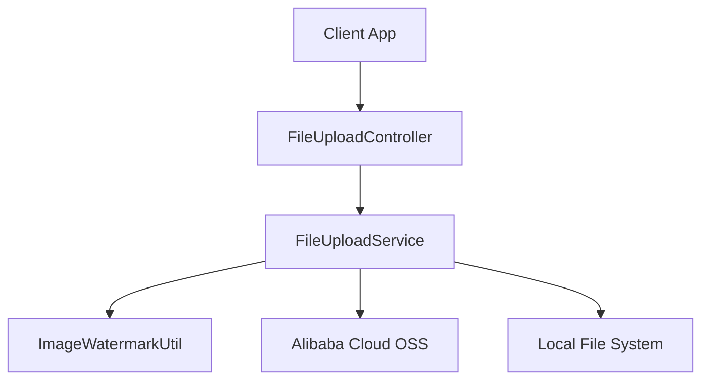
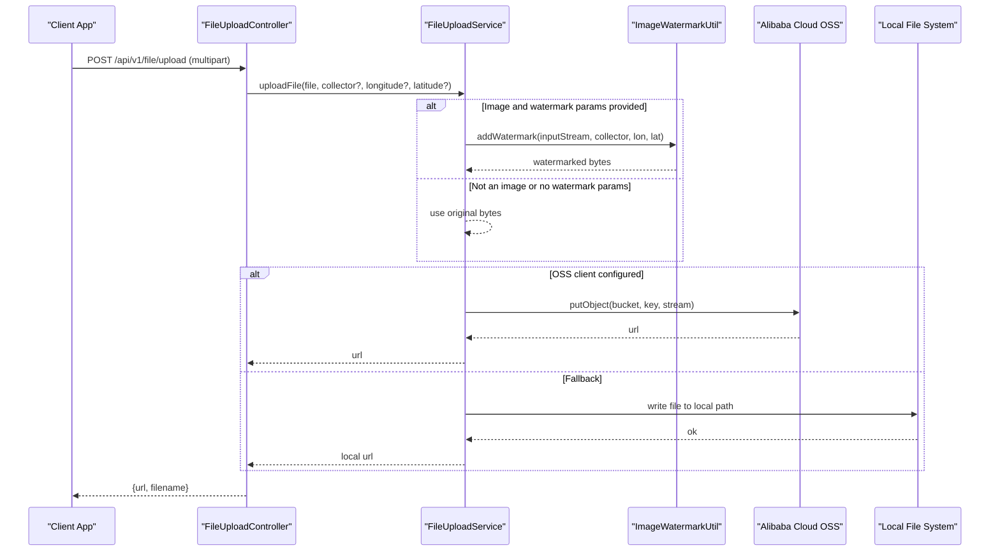
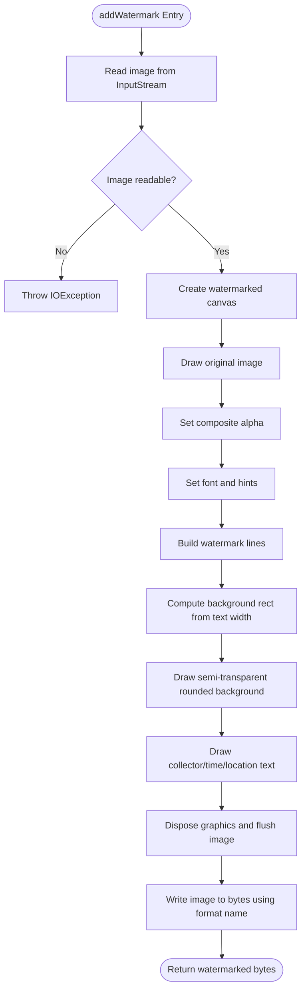
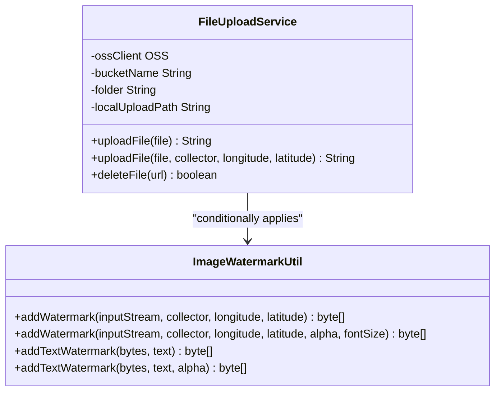
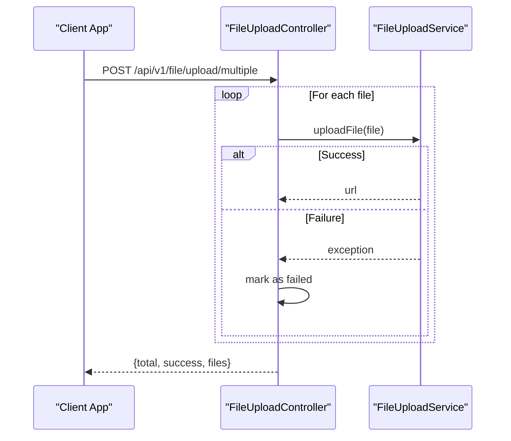
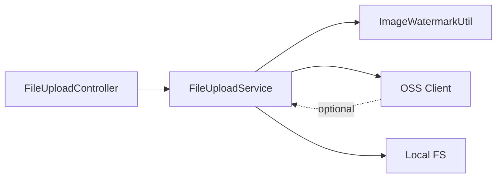

# Image Processing Pipeline

<cite>
**Referenced Files in This Document**
- [ImageWatermarkUtil.java](file://admin-backend/src/main/java/com/qhiot/survey/common/util/ImageWatermarkUtil.java)
- [FileUploadService.java](file://admin-backend/src/main/java/com/qhiot/survey/service/FileUploadService.java)
- [FileUploadController.java](file://admin-backend/src/main/java/com/qhiot/survey/controller/FileUploadController.java)
- [OssConfig.java](file://admin-backend/src/main/java/com/qhiot/survey/config/OssConfig.java)
- [CacheConfig.java](file://admin-backend/src/main/java/com/qhiot/survey/config/CacheConfig.java)
</cite>

## Table of Contents
1. [Introduction](#introduction)
2. [Project Structure](#project-structure)
3. [Core Components](#core-components)
4. [Architecture Overview](#architecture-overview)
5. [Detailed Component Analysis](#detailed-component-analysis)
6. [Dependency Analysis](#dependency-analysis)
7. [Performance Considerations](#performance-considerations)
8. [Troubleshooting Guide](#troubleshooting-guide)
9. [Conclusion](#conclusion)
10. [Appendices](#appendices)

## Introduction
This document describes the image processing and optimization pipeline used for survey-related image uploads. It focuses on watermarking (positioning, transparency, and batch processing), image format handling, and the integration with the file upload system. The pipeline supports adding metadata-based watermarks to images (collector, timestamp, and optional GPS coordinates) and integrates with Alibaba Cloud OSS for scalable storage, falling back to local storage when OSS is unavailable. The current implementation does not include resizing, format conversion, or thumbnail generation; this is noted as a gap and future enhancement area.

## Project Structure
The image pipeline spans three primary backend components:
- Controller: exposes upload endpoints for single and batch file uploads.
- Service: orchestrates file handling, optional watermarking, and storage to OSS or local disk.
- Utility: performs watermark rendering onto images using Java’s AWT APIs.

**Diagram sources**
- [FileUploadController.java:25-71](file://admin-backend/src/main/java/com/qhiot/survey/controller/FileUploadController.java#L25-L71)
- [FileUploadService.java:39-96](file://admin-backend/src/main/java/com/qhiot/survey/service/FileUploadService.java#L39-L96)
- [ImageWatermarkUtil.java:52-152](file://admin-backend/src/main/java/com/qhiot/survey/common/util/ImageWatermarkUtil.java#L52-L152)
- [OssConfig.java:24-31](file://admin-backend/src/main/java/com/qhiot/survey/config/OssConfig.java#L24-L31)

**Section sources**
- [FileUploadController.java:25-71](file://admin-backend/src/main/java/com/qhiot/survey/controller/FileUploadController.java#L25-L71)
- [FileUploadService.java:39-96](file://admin-backend/src/main/java/com/qhiot/survey/service/FileUploadService.java#L39-L96)
- [ImageWatermarkUtil.java:52-152](file://admin-backend/src/main/java/com/qhiot/survey/common/util/ImageWatermarkUtil.java#L52-L152)
- [OssConfig.java:24-31](file://admin-backend/src/main/java/com/qhiot/survey/config/OssConfig.java#L24-L31)

## Core Components
- Watermark utility: adds a semi-transparent, rounded-text-background watermark with collector, timestamp, and optional GPS coordinates to images. Supports configurable transparency and font size.
- Upload service: generates unique filenames, optionally applies watermarks for images, and stores files to OSS or local storage.
- Upload controller: exposes REST endpoints for single and batch uploads, returning URLs and metadata.

Key behaviors:
- Watermark placement is fixed to the lower-right corner with dynamic background sizing based on text metrics.
- Transparency is adjustable via parameters; defaults are applied when not specified.
- Batch processing is supported at the controller level; the service applies watermarking per-file.
- Storage fallback: if OSS client is not configured, files are saved locally under a configured path.

**Section sources**
- [ImageWatermarkUtil.java:52-152](file://admin-backend/src/main/java/com/qhiot/survey/common/util/ImageWatermarkUtil.java#L52-L152)
- [FileUploadService.java:52-96](file://admin-backend/src/main/java/com/qhiot/survey/service/FileUploadService.java#L52-L96)
- [FileUploadController.java:45-71](file://admin-backend/src/main/java/com/qhiot/survey/controller/FileUploadController.java#L45-L71)

## Architecture Overview
The pipeline integrates with Alibaba Cloud OSS when available, otherwise falls back to local storage. Watermarking is applied only when the uploaded file is an image and watermark parameters are provided.

**Diagram sources**
- [FileUploadController.java:28-43](file://admin-backend/src/main/java/com/qhiot/survey/controller/FileUploadController.java#L28-L43)
- [FileUploadService.java:52-96](file://admin-backend/src/main/java/com/qhiot/survey/service/FileUploadService.java#L52-L96)
- [ImageWatermarkUtil.java:52-152](file://admin-backend/src/main/java/com/qhiot/survey/common/util/ImageWatermarkUtil.java#L52-L152)
- [OssConfig.java:24-31](file://admin-backend/src/main/java/com/qhiot/survey/config/OssConfig.java#L24-L31)

## Detailed Component Analysis

### Watermark Utility
Responsibilities:
- Read input image streams into memory.
- Render a semi-transparent rounded rectangle behind watermark text.
- Draw three lines: collector, timestamp, and optional GPS coordinates.
- Write the resulting image back to bytes using a fixed format.

Positioning and layout:
- Text block is positioned near the lower-right corner.
- Background width is computed from the longest line’s width plus margins.
- Line height and margins are constants enabling consistent spacing.

Transparency and typography:
- Composite alpha controls overall watermark translucency.
- A secondary composite is used for the background fill.
- Font is set to a bold sans-serif with a configurable size.

Format handling:
- The utility writes the final image using a fixed format name derived from the input stream.
- This implies the output format is determined by the input stream’s detected type.

Batch processing:
- The utility operates on a single image stream; batch processing is handled by the caller.

**Diagram sources**
- [ImageWatermarkUtil.java:72-152](file://admin-backend/src/main/java/com/qhiot/survey/common/util/ImageWatermarkUtil.java#L72-L152)

**Section sources**
- [ImageWatermarkUtil.java:52-152](file://admin-backend/src/main/java/com/qhiot/survey/common/util/ImageWatermarkUtil.java#L52-L152)

### Upload Service
Responsibilities:
- Generate unique filenames with preserved extensions.
- Detect image types and conditionally apply watermarks.
- Upload to OSS when configured; otherwise save to local path.
- Delete files from either OSS or local storage.

Watermark integration:
- If the file is an image and watermark parameters are present, the service invokes the watermark utility and streams the watermarked bytes to storage.
- On watermark failure, the service logs and falls back to uploading the original bytes.

Storage selection:
- OSS is used when the OSS client bean exists; the URL is constructed from endpoint, bucket, and region.
- Local storage is used as a fallback when OSS is unavailable; the URL is a local path.

**Diagram sources**
- [FileUploadService.java:52-96](file://admin-backend/src/main/java/com/qhiot/survey/service/FileUploadService.java#L52-L96)
- [ImageWatermarkUtil.java:52-152](file://admin-backend/src/main/java/com/qhiot/survey/common/util/ImageWatermarkUtil.java#L52-L152)

**Section sources**
- [FileUploadService.java:52-96](file://admin-backend/src/main/java/com/qhiot/survey/service/FileUploadService.java#L52-L96)

### Upload Controller
Endpoints:
- Single upload: accepts a multipart file and returns the stored URL and filename.
- Multiple upload: iterates over an array of files, collecting results and counts of successes.
- Delete: removes a file by URL, delegating to the service.

Batch processing:
- The controller loops through provided files and aggregates results, including total count, success count, and per-file outcomes.

**Diagram sources**
- [FileUploadController.java:48-71](file://admin-backend/src/main/java/com/qhiot/survey/controller/FileUploadController.java#L48-L71)

**Section sources**
- [FileUploadController.java:28-71](file://admin-backend/src/main/java/com/qhiot/survey/controller/FileUploadController.java#L28-L71)

### Storage Configuration (OSS)
- The OSS client is conditionally created; if credentials are missing, the client is null and the service falls back to local storage.
- The service constructs public URLs using the bucket name and a region derived from the endpoint.

**Section sources**
- [OssConfig.java:24-31](file://admin-backend/src/main/java/com/qhiot/survey/config/OssConfig.java#L24-L31)
- [FileUploadService.java:80-86](file://admin-backend/src/main/java/com/qhiot/survey/service/FileUploadService.java#L80-L86)

## Dependency Analysis
- Controller depends on the service for all upload logic.
- Service depends on the watermark utility for image processing and on OSS for cloud storage.
- OSS configuration is optional; absence triggers local storage behavior.
- No explicit caching is implemented for processed images; cache configuration exists for general application caches.

**Diagram sources**
- [FileUploadController.java:28-71](file://admin-backend/src/main/java/com/qhiot/survey/controller/FileUploadController.java#L28-L71)
- [FileUploadService.java:52-96](file://admin-backend/src/main/java/com/qhiot/survey/service/FileUploadService.java#L52-L96)
- [ImageWatermarkUtil.java:52-152](file://admin-backend/src/main/java/com/qhiot/survey/common/util/ImageWatermarkUtil.java#L52-L152)
- [OssConfig.java:24-31](file://admin-backend/src/main/java/com/qhiot/survey/config/OssConfig.java#L24-L31)

**Section sources**
- [FileUploadController.java:28-71](file://admin-backend/src/main/java/com/qhiot/survey/controller/FileUploadController.java#L28-L71)
- [FileUploadService.java:52-96](file://admin-backend/src/main/java/com/qhiot/survey/service/FileUploadService.java#L52-L96)
- [ImageWatermarkUtil.java:52-152](file://admin-backend/src/main/java/com/qhiot/survey/common/util/ImageWatermarkUtil.java#L52-L152)
- [OssConfig.java:24-31](file://admin-backend/src/main/java/com/qhiot/survey/config/OssConfig.java#L24-L31)

## Performance Considerations
- Memory usage: Images are loaded into memory during watermarking; large images increase heap usage. Consider streaming or limiting input sizes.
- CPU cost: Rendering text and compositing introduces CPU overhead; batch operations process images sequentially.
- Network I/O: OSS uploads occur after watermarking; network latency affects end-to-end throughput.
- Storage choice: OSS offers scalability and global distribution; local storage avoids network but lacks CDN-like performance.
- Recommendations:
  - Validate image dimensions and reject oversized inputs.
  - Add asynchronous processing for batch uploads to improve responsiveness.
  - Introduce caching for frequently accessed images if applicable to your workload.
  - Monitor garbage collection impact during heavy image processing.

[No sources needed since this section provides general guidance]

## Troubleshooting Guide
Common issues and resolutions:
- Watermark fails silently: The service catches exceptions during watermarking and falls back to the original image. Check logs for the underlying cause.
- OSS upload failures: Verify OSS credentials and endpoint configuration. If absent, the service writes to local storage.
- Incorrect image format: The utility writes using a fixed format name derived from the input stream. Ensure the input stream corresponds to a supported image type.
- Batch upload inconsistencies: The controller records failures per file; inspect the returned map to identify problematic uploads.

Operational checks:
- Confirm OSS client bean creation and endpoint configuration.
- Validate local upload path permissions and existence.
- Review controller logs for exceptions thrown during upload.

**Section sources**
- [FileUploadService.java:64-77](file://admin-backend/src/main/java/com/qhiot/survey/service/FileUploadService.java#L64-L77)
- [FileUploadController.java:48-71](file://admin-backend/src/main/java/com/qhiot/survey/controller/FileUploadController.java#L48-L71)
- [OssConfig.java:24-31](file://admin-backend/src/main/java/com/qhiot/survey/config/OssConfig.java#L24-L31)

## Conclusion
The current pipeline provides robust watermarking for survey images with configurable transparency and position, integrated storage to OSS with local fallback, and basic batch upload support. While the system does not include resizing, format conversion, or thumbnail generation, it offers a solid foundation for image processing. Future enhancements could include dimension checks, resizing, and dedicated thumbnail generation to optimize bandwidth and rendering performance.

[No sources needed since this section summarizes without analyzing specific files]

## Appendices

### Supported Image Formats and Behavior
- Detection and writing: The watermark utility reads images via a stream and writes the final image using a format name derived from the input stream. The current detection method returns a fixed format name, implying output format is determined by the input stream’s type.
- Practical note: Ensure the incoming image stream corresponds to a supported image type recognized by the runtime environment.

**Section sources**
- [ImageWatermarkUtil.java:147-152](file://admin-backend/src/main/java/com/qhiot/survey/common/util/ImageWatermarkUtil.java#L147-L152)
- [ImageWatermarkUtil.java:157-160](file://admin-backend/src/main/java/com/qhiot/survey/common/util/ImageWatermarkUtil.java#L157-L160)

### Watermark Positioning and Transparency
- Position: Lower-right corner with dynamic background sizing based on text metrics.
- Transparency: Composite alpha controls overall watermark translucency; a separate composite is used for the background.
- Typography: Bold sans-serif font with configurable size; anti-aliasing is enabled for crisp rendering.

**Section sources**
- [ImageWatermarkUtil.java:111-140](file://admin-backend/src/main/java/com/qhiot/survey/common/util/ImageWatermarkUtil.java#L111-L140)
- [ImageWatermarkUtil.java:90-102](file://admin-backend/src/main/java/com/qhiot/survey/common/util/ImageWatermarkUtil.java#L90-L102)

### Batch Processing Workflow
- Controller-level batching: Iterates over provided files, invoking the service for each.
- Per-file watermarking: If the file is an image and watermark parameters are provided, the service applies the watermark before upload.
- Aggregated results: Returns total count, success count, and per-file outcomes.

**Section sources**
- [FileUploadController.java:48-71](file://admin-backend/src/main/java/com/qhiot/survey/controller/FileUploadController.java#L48-L71)
- [FileUploadService.java:64-77](file://admin-backend/src/main/java/com/qhiot/survey/service/FileUploadService.java#L64-L77)

### Cache Management Strategies
- General application caching: Redis-backed cache manager with TTLs for specific namespaces.
- Image-specific caching: Not implemented in the current pipeline; consider caching thumbnails or resized images if frequently accessed.

**Section sources**
- [CacheConfig.java:75-92](file://admin-backend/src/main/java/com/qhiot/survey/config/CacheConfig.java#L75-L92)