# Metadata Management

<cite>
**Referenced Files in This Document**
- [SysFile.java](file://admin-backend/src/main/java/com/qhiot/survey/entity/SysFile.java)
- [SysFileMapper.java](file://admin-backend/src/main/java/com/qhiot/survey/mapper/SysFileMapper.java)
- [FileUploadController.java](file://admin-backend/src/main/java/com/qhiot/survey/controller/FileUploadController.java)
- [FileUploadService.java](file://admin-backend/src/main/java/com/qhiot/survey/service/FileUploadService.java)
- [SurveyResult.java](file://admin-backend/src/main/java/com/qhiot/survey/entity/SurveyResult.java)
- [OfflineDataSync.java](file://admin-backend/src/main/java/com/qhiot/survey/entity/OfflineDataSync.java)
- [OfflineDataSyncServiceImpl.java](file://admin-backend/src/main/java/com/qhiot/survey/service/impl/OfflineDataSyncServiceImpl.java)
- [01-init.sql](file://admin-backend/init-data/01-init.sql)
- [05-database-indexes.sql](file://admin-backend/init-data/05-database-indexes.sql)
</cite>

## Table of Contents
1. [Introduction](#introduction)
2. [Project Structure](#project-structure)
3. [Core Components](#core-components)
4. [Architecture Overview](#architecture-overview)
5. [Detailed Component Analysis](#detailed-component-analysis)
6. [Dependency Analysis](#dependency-analysis)
7. [Performance Considerations](#performance-considerations)
8. [Troubleshooting Guide](#troubleshooting-guide)
9. [Conclusion](#conclusion)
10. [Appendices](#appendices)

## Introduction
This document describes the file metadata management system used by the survey application. It covers the metadata schema for files, the database entity mapping and repository operations, persistence and retrieval mechanisms, search and indexing strategies, and the relationship between file metadata and survey results. It also documents update workflows, bulk operations, cleanup procedures, and integration with file storage systems for consistency.

## Project Structure
The metadata management system spans three primary areas:
- File metadata model and persistence: entity, mapper, and MyBatis integration
- File storage and retrieval: controller and service for uploads, downloads, and deletions
- Association with survey results: offline sync pipeline that creates metadata and links images to results

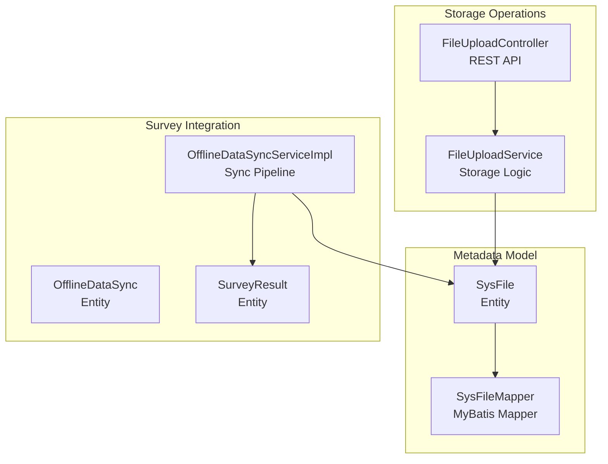

**Diagram sources**
- [SysFile.java:14-46](file://admin-backend/src/main/java/com/qhiot/survey/entity/SysFile.java#L14-L46)
- [SysFileMapper.java:10-12](file://admin-backend/src/main/java/com/qhiot/survey/mapper/SysFileMapper.java#L10-L12)
- [FileUploadController.java:17-80](file://admin-backend/src/main/java/com/qhiot/survey/controller/FileUploadController.java#L17-L80)
- [FileUploadService.java:20-122](file://admin-backend/src/main/java/com/qhiot/survey/service/FileUploadService.java#L20-L122)
- [OfflineDataSync.java:15-97](file://admin-backend/src/main/java/com/qhiot/survey/entity/OfflineDataSync.java#L15-L97)
- [OfflineDataSyncServiceImpl.java:448-516](file://admin-backend/src/main/java/com/qhiot/survey/service/impl/OfflineDataSyncServiceImpl.java#L448-L516)
- [SurveyResult.java:14-93](file://admin-backend/src/main/java/com/qhiot/survey/entity/SurveyResult.java#L14-L93)

**Section sources**
- [SysFile.java:14-46](file://admin-backend/src/main/java/com/qhiot/survey/entity/SysFile.java#L14-L46)
- [SysFileMapper.java:10-12](file://admin-backend/src/main/java/com/qhiot/survey/mapper/SysFileMapper.java#L10-L12)
- [FileUploadController.java:17-80](file://admin-backend/src/main/java/com/qhiot/survey/controller/FileUploadController.java#L17-L80)
- [FileUploadService.java:20-122](file://admin-backend/src/main/java/com/qhiot/survey/service/FileUploadService.java#L20-L122)
- [OfflineDataSync.java:15-97](file://admin-backend/src/main/java/com/qhiot/survey/entity/OfflineDataSync.java#L15-L97)
- [OfflineDataSyncServiceImpl.java:448-516](file://admin-backend/src/main/java/com/qhiot/survey/service/impl/OfflineDataSyncServiceImpl.java#L448-L516)
- [SurveyResult.java:14-93](file://admin-backend/src/main/java/com/qhiot/survey/entity/SurveyResult.java#L14-L93)

## Core Components
- SysFile: file metadata entity persisted in sys_file
- SysFileMapper: MyBatis mapper for SysFile CRUD
- FileUploadController: REST endpoints for single and batch uploads, deletion
- FileUploadService: storage backend abstraction (OSS or local), watermarking for images
- OfflineDataSync and OfflineDataSyncServiceImpl: offline sync pipeline that ingests photos, creates SysFile entries, and updates SurveyResult.images
- SurveyResult: survey result entity that stores image URLs as JSON array

Key responsibilities:
- Persist file metadata (name, path, size, type, business association, creator)
- Provide upload, batch upload, and delete operations
- Maintain referential consistency between files and survey results
- Support efficient querying via database indexes

**Section sources**
- [SysFile.java:14-46](file://admin-backend/src/main/java/com/qhiot/survey/entity/SysFile.java#L14-L46)
- [SysFileMapper.java:10-12](file://admin-backend/src/main/java/com/qhiot/survey/mapper/SysFileMapper.java#L10-L12)
- [FileUploadController.java:25-80](file://admin-backend/src/main/java/com/qhiot/survey/controller/FileUploadController.java#L25-L80)
- [FileUploadService.java:36-122](file://admin-backend/src/main/java/com/qhiot/survey/service/FileUploadService.java#L36-L122)
- [OfflineDataSync.java:15-97](file://admin-backend/src/main/java/com/qhiot/survey/entity/OfflineDataSync.java#L15-L97)
- [OfflineDataSyncServiceImpl.java:448-516](file://admin-backend/src/main/java/com/qhiot/survey/service/impl/OfflineDataSyncServiceImpl.java#L448-L516)
- [SurveyResult.java:14-93](file://admin-backend/src/main/java/com/qhiot/survey/entity/SurveyResult.java#L14-L93)

## Architecture Overview
The system integrates three layers:
- Storage Layer: FileUploadService handles upload to OSS or local fallback and deletion
- Persistence Layer: SysFile and SysFileMapper manage metadata persistence
- Business Layer: OfflineDataSyncServiceImpl orchestrates ingestion, de-duplication, and result linking

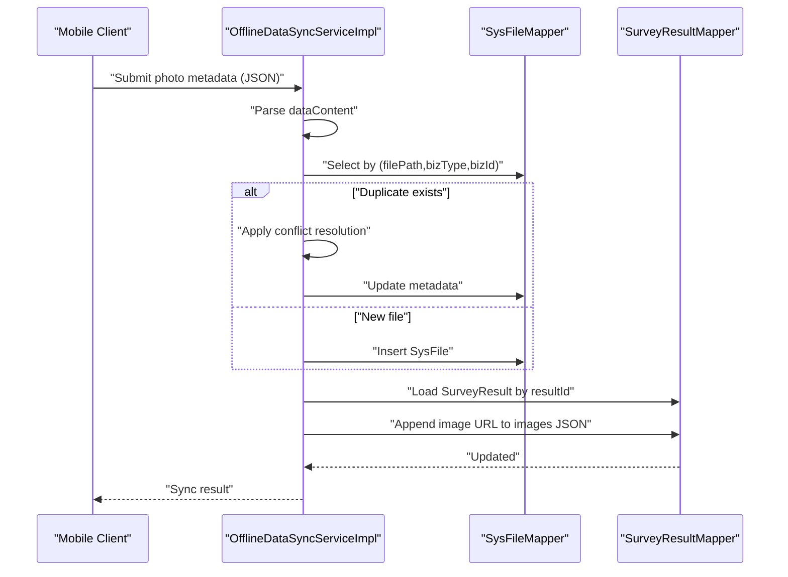

**Diagram sources**
- [OfflineDataSyncServiceImpl.java:448-516](file://admin-backend/src/main/java/com/qhiot/survey/service/impl/OfflineDataSyncServiceImpl.java#L448-L516)
- [SysFileMapper.java:10-12](file://admin-backend/src/main/java/com/qhiot/survey/mapper/SysFileMapper.java#L10-L12)
- [SurveyResult.java:14-93](file://admin-backend/src/main/java/com/qhiot/survey/entity/SurveyResult.java#L14-L93)

## Detailed Component Analysis

### Metadata Schema: SysFile
SysFile defines the canonical file metadata schema persisted in sys_file:
- Identity: id (auto-increment)
- File identity: fileName, filePath, fileSize, fileType
- Business association: bizType, bizId
- Ownership and audit: creatorId, createTime

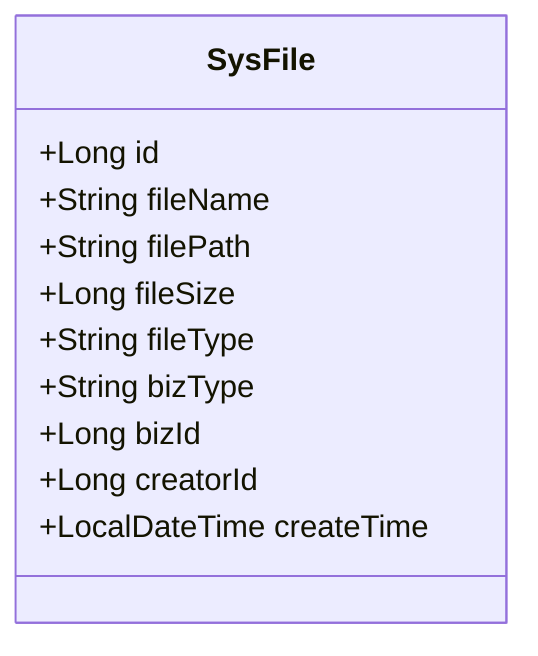

**Diagram sources**
- [SysFile.java:14-46](file://admin-backend/src/main/java/com/qhiot/survey/entity/SysFile.java#L14-L46)

**Section sources**
- [SysFile.java:14-46](file://admin-backend/src/main/java/com/qhiot/survey/entity/SysFile.java#L14-L46)
- [01-init.sql:415-427](file://admin-backend/init-data/01-init.sql#L415-L427)

### Entity Mapping and Repository Operations
- Entity: SysFile mapped to sys_file
- Mapper: SysFileMapper extends BaseMapper for standard CRUD
- Indexes: Composite index on (biz_type, biz_id) and index on creator_id support efficient lookups

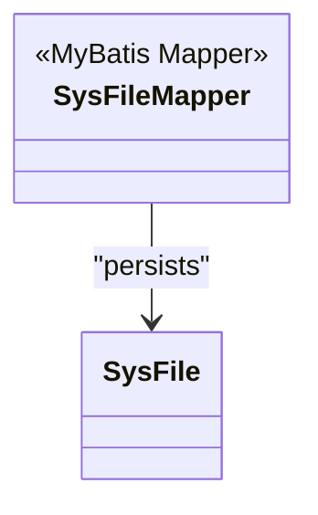

**Diagram sources**
- [SysFileMapper.java:10-12](file://admin-backend/src/main/java/com/qhiot/survey/mapper/SysFileMapper.java#L10-L12)
- [SysFile.java:14-46](file://admin-backend/src/main/java/com/qhiot/survey/entity/SysFile.java#L14-L46)

**Section sources**
- [SysFileMapper.java:10-12](file://admin-backend/src/main/java/com/qhiot/survey/mapper/SysFileMapper.java#L10-L12)
- [01-init.sql:415-427](file://admin-backend/init-data/01-init.sql#L415-L427)
- [05-database-indexes.sql:40-62](file://admin-backend/init-data/05-database-indexes.sql#L40-L62)

### File Upload and Deletion APIs
- Single upload: returns url and filename
- Batch upload: iterates files, collects successes and failures
- Delete: supports both OSS and local paths

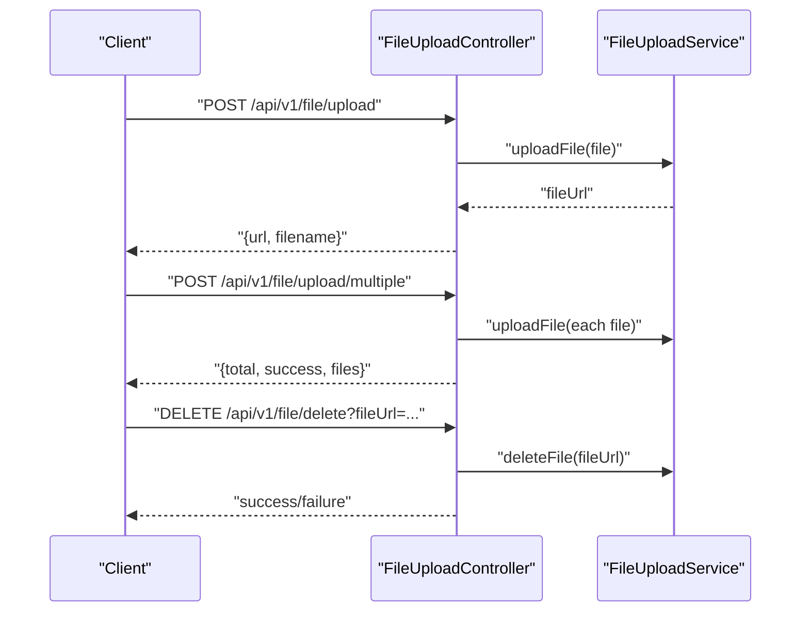

**Diagram sources**
- [FileUploadController.java:25-80](file://admin-backend/src/main/java/com/qhiot/survey/controller/FileUploadController.java#L25-L80)
- [FileUploadService.java:36-122](file://admin-backend/src/main/java/com/qhiot/survey/service/FileUploadService.java#L36-L122)

**Section sources**
- [FileUploadController.java:25-80](file://admin-backend/src/main/java/com/qhiot/survey/controller/FileUploadController.java#L25-L80)
- [FileUploadService.java:36-122](file://admin-backend/src/main/java/com/qhiot/survey/service/FileUploadService.java#L36-L122)

### Metadata Retrieval and Search Capabilities
- By business association: select by (biz_type, biz_id) composite index
- By creator: select by creator_id index
- De-duplication during offline sync: detect duplicates by filePath + bizId before insert/update

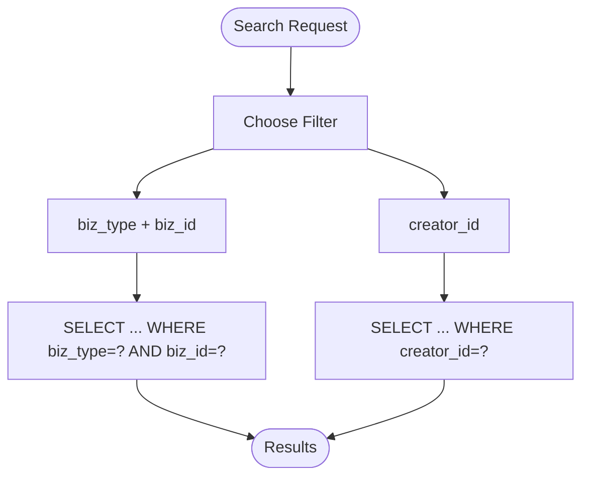

**Diagram sources**
- [01-init.sql:425-426](file://admin-backend/init-data/01-init.sql#L425-L426)
- [OfflineDataSyncServiceImpl.java:463-498](file://admin-backend/src/main/java/com/qhiot/survey/service/impl/OfflineDataSyncServiceImpl.java#L463-L498)

**Section sources**
- [01-init.sql:425-426](file://admin-backend/init-data/01-init.sql#L425-L426)
- [OfflineDataSyncServiceImpl.java:463-498](file://admin-backend/src/main/java/com/qhiot/survey/service/impl/OfflineDataSyncServiceImpl.java#L463-L498)

### Updates, Bulk Operations, and Cleanup Procedures
- Updates: During offline photo sync, metadata is updated when duplicates are detected based on conflict resolution
- Bulk operations: Batch upload endpoint aggregates per-file outcomes
- Cleanup: OfflineDataSyncServiceImpl provides cleanupExpiredRecords to remove old completed records

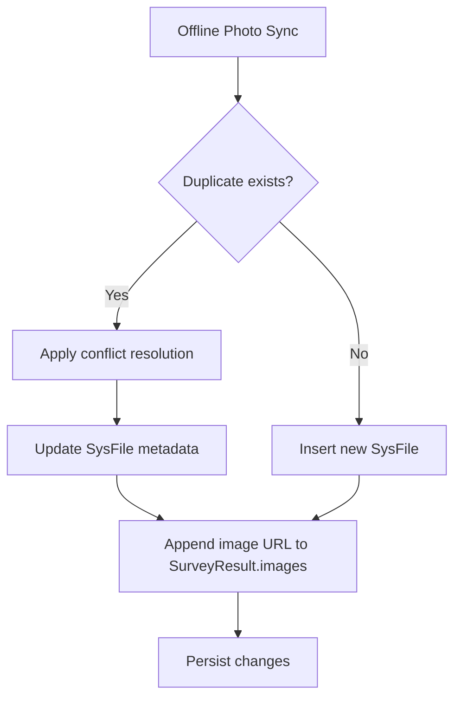

**Diagram sources**
- [OfflineDataSyncServiceImpl.java:448-516](file://admin-backend/src/main/java/com/qhiot/survey/service/impl/OfflineDataSyncServiceImpl.java#L448-L516)

**Section sources**
- [OfflineDataSyncServiceImpl.java:448-516](file://admin-backend/src/main/java/com/qhiot/survey/service/impl/OfflineDataSyncServiceImpl.java#L448-L516)
- [FileUploadController.java:45-71](file://admin-backend/src/main/java/com/qhiot/survey/controller/FileUploadController.java#L45-L71)

### Relationship Between File Metadata and Survey Results
- Association: Offline sync associates photos with survey results by resultId
- Linking: SurveyResult.images stores a JSON array of image URLs; sync appends new URLs if not present
- Cascade considerations: No ORM cascade is defined; the service ensures referential consistency by updating the images field

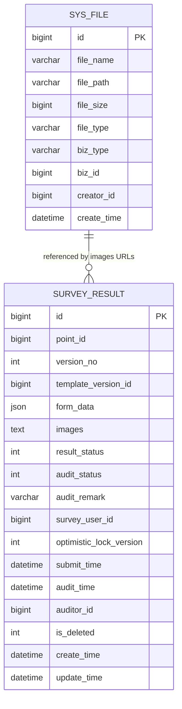

**Diagram sources**
- [01-init.sql:415-427](file://admin-backend/init-data/01-init.sql#L415-L427)
- [SurveyResult.java:14-93](file://admin-backend/src/main/java/com/qhiot/survey/entity/SurveyResult.java#L14-L93)
- [OfflineDataSyncServiceImpl.java:500-515](file://admin-backend/src/main/java/com/qhiot/survey/service/impl/OfflineDataSyncServiceImpl.java#L500-L515)

**Section sources**
- [SurveyResult.java:14-93](file://admin-backend/src/main/java/com/qhiot/survey/entity/SurveyResult.java#L14-L93)
- [OfflineDataSyncServiceImpl.java:500-515](file://admin-backend/src/main/java/com/qhiot/survey/service/impl/OfflineDataSyncServiceImpl.java#L500-L515)

### Indexing Strategy for Efficient Queries
- sys_file: (biz_type, biz_id) and creator_id indexes enable fast lookup by business association and uploader
- Additional indexes exist for related entities (survey_result, operation_log, etc.) to optimize list endpoints and filters

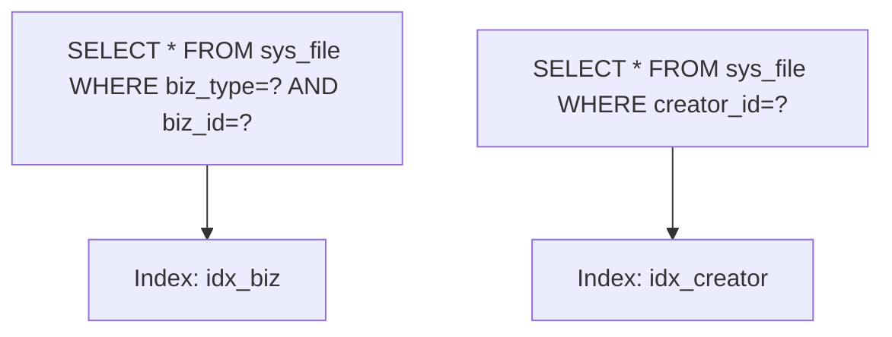

**Diagram sources**
- [01-init.sql:425-426](file://admin-backend/init-data/01-init.sql#L425-L426)
- [05-database-indexes.sql:40-62](file://admin-backend/init-data/05-database-indexes.sql#L40-L62)

**Section sources**
- [01-init.sql:425-426](file://admin-backend/init-data/01-init.sql#L425-L426)
- [05-database-indexes.sql:40-62](file://admin-backend/init-data/05-database-indexes.sql#L40-L62)

### Integration with File Storage Systems
- Storage backends: OSS (primary) and local filesystem (fallback)
- Watermarking: Optional image watermarking for photos with collector and geolocation info
- Consistency: De-duplication by filePath + bizId prevents redundant metadata; deletion removes both metadata and physical file

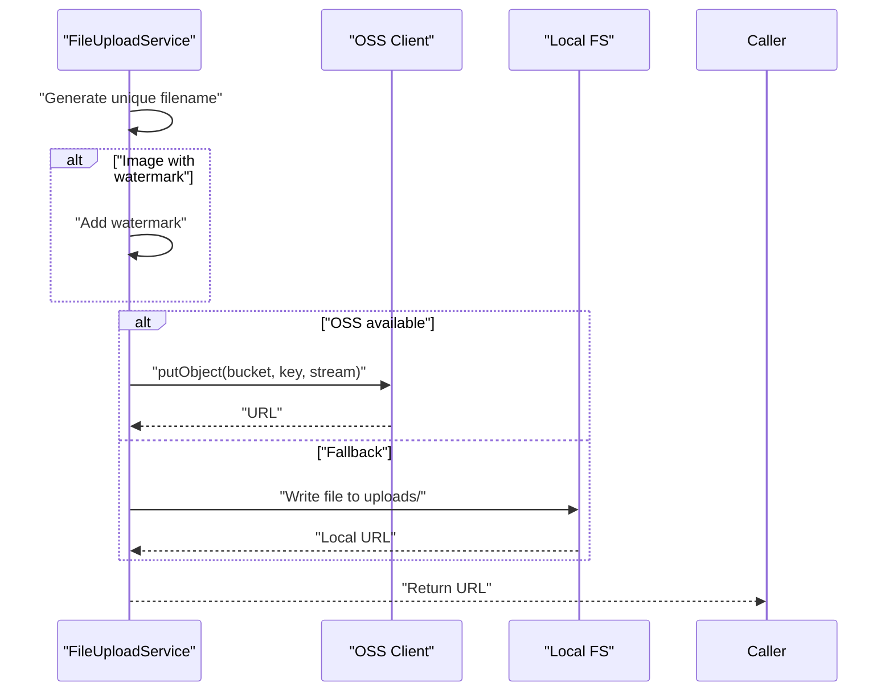

**Diagram sources**
- [FileUploadService.java:36-122](file://admin-backend/src/main/java/com/qhiot/survey/service/FileUploadService.java#L36-L122)

**Section sources**
- [FileUploadService.java:36-122](file://admin-backend/src/main/java/com/qhiot/survey/service/FileUploadService.java#L36-L122)

## Dependency Analysis
- FileUploadController depends on FileUploadService
- FileUploadService depends on OSS client (optional) and local filesystem
- OfflineDataSyncServiceImpl depends on SysFileMapper and SurveyResultMapper
- SysFileMapper persists SysFile entities
- SurveyResult stores image URLs as JSON and is updated by OfflineDataSyncServiceImpl

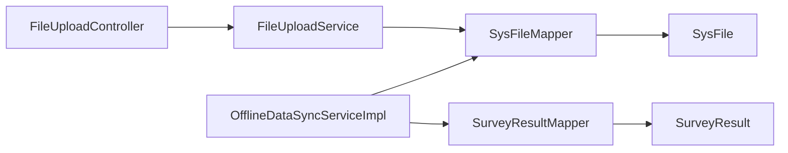

**Diagram sources**
- [FileUploadController.java:17-80](file://admin-backend/src/main/java/com/qhiot/survey/controller/FileUploadController.java#L17-L80)
- [FileUploadService.java:20-122](file://admin-backend/src/main/java/com/qhiot/survey/service/FileUploadService.java#L20-L122)
- [OfflineDataSyncServiceImpl.java:448-516](file://admin-backend/src/main/java/com/qhiot/survey/service/impl/OfflineDataSyncServiceImpl.java#L448-L516)
- [SysFileMapper.java:10-12](file://admin-backend/src/main/java/com/qhiot/survey/mapper/SysFileMapper.java#L10-L12)
- [SurveyResult.java:14-93](file://admin-backend/src/main/java/com/qhiot/survey/entity/SurveyResult.java#L14-L93)

**Section sources**
- [FileUploadController.java:17-80](file://admin-backend/src/main/java/com/qhiot/survey/controller/FileUploadController.java#L17-L80)
- [FileUploadService.java:20-122](file://admin-backend/src/main/java/com/qhiot/survey/service/FileUploadService.java#L20-L122)
- [OfflineDataSyncServiceImpl.java:448-516](file://admin-backend/src/main/java/com/qhiot/survey/service/impl/OfflineDataSyncServiceImpl.java#L448-L516)
- [SysFileMapper.java:10-12](file://admin-backend/src/main/java/com/qhiot/survey/mapper/SysFileMapper.java#L10-L12)
- [SurveyResult.java:14-93](file://admin-backend/src/main/java/com/qhiot/survey/entity/SurveyResult.java#L14-L93)

## Performance Considerations
- Prefer composite indexes for business association lookups to avoid full scans
- Batch uploads reduce round-trips; consider chunking large batches
- De-duplication during offline sync avoids redundant inserts and maintains referential integrity
- Use cleanup procedures to prune stale offline sync records and reclaim storage

## Troubleshooting Guide
Common issues and resolutions:
- Upload failures: Verify OSS credentials and bucket configuration; fallback to local path if configured
- Duplicate metadata: Ensure filePath + bizId uniqueness; offline sync applies conflict resolution
- Missing image URLs in results: Confirm OfflineDataSyncServiceImpl appended URLs to SurveyResult.images
- Cleanup not removing records: Confirm the cleanup criteria (status=completed and retention threshold)

**Section sources**
- [FileUploadService.java:98-122](file://admin-backend/src/main/java/com/qhiot/survey/service/FileUploadService.java#L98-L122)
- [OfflineDataSyncServiceImpl.java:308-324](file://admin-backend/src/main/java/com/qhiot/survey/service/impl/OfflineDataSyncServiceImpl.java#L308-L324)
- [OfflineDataSyncServiceImpl.java:448-516](file://admin-backend/src/main/java/com/qhiot/survey/service/impl/OfflineDataSyncServiceImpl.java#L448-L516)

## Conclusion
The metadata management system provides robust file metadata persistence, flexible storage backends, and tight integration with survey results. Its indexing strategy, de-duplication logic, and offline sync pipeline ensure consistency and performance. The documented APIs and procedures support everyday operations, bulk tasks, and maintenance routines.

## Appendices
- Example operations:
  - Upload a single file: POST /api/v1/file/upload
  - Upload multiple files: POST /api/v1/file/upload/multiple
  - Delete a file: DELETE /api/v1/file/delete?fileUrl=...
  - Cleanup offline sync records older than N days: invoke cleanupExpiredRecords(N)

[No sources needed since this section summarizes without analyzing specific files]