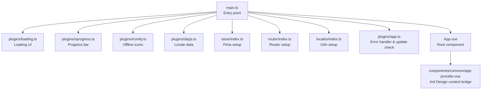
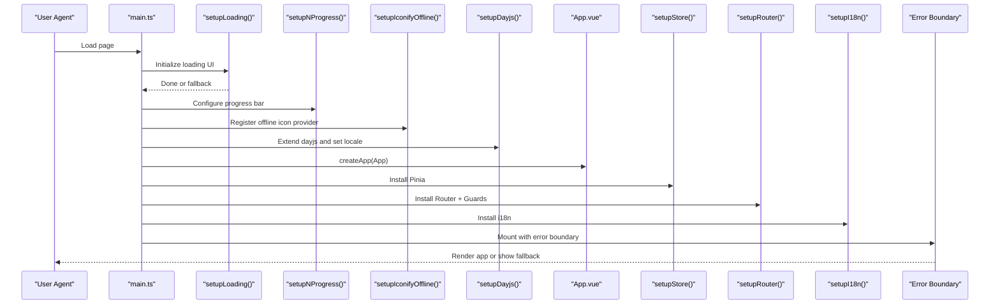
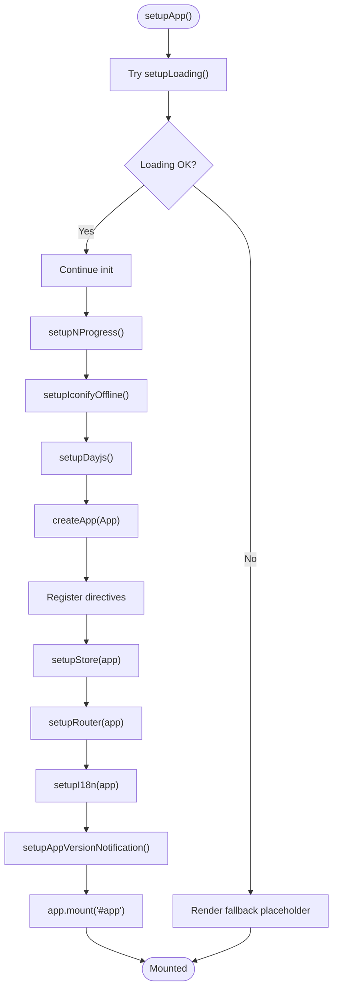
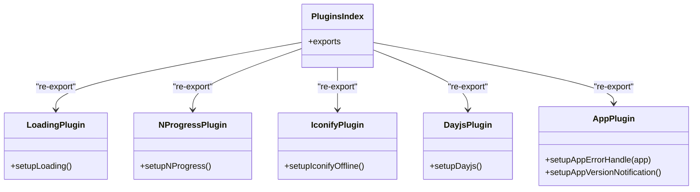
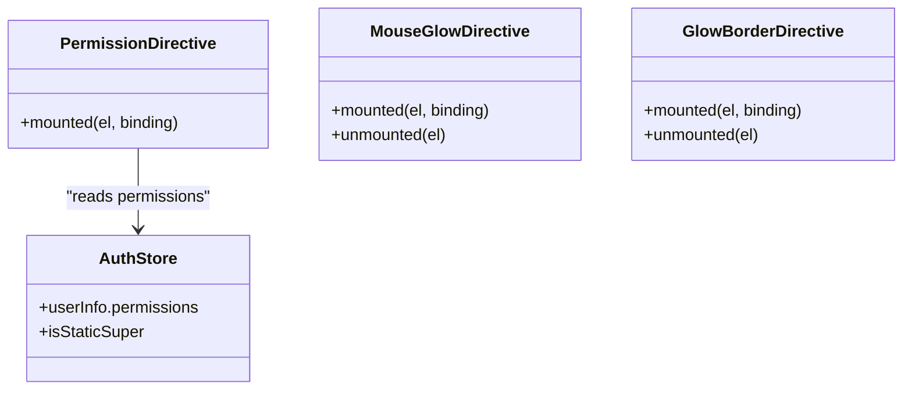
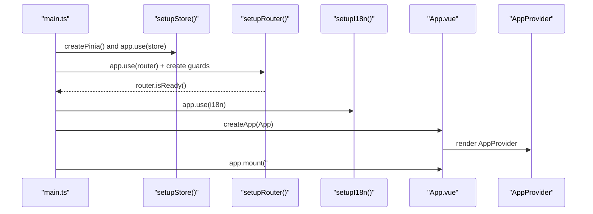
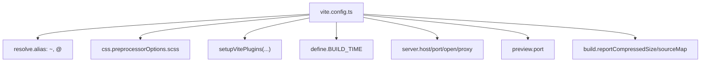
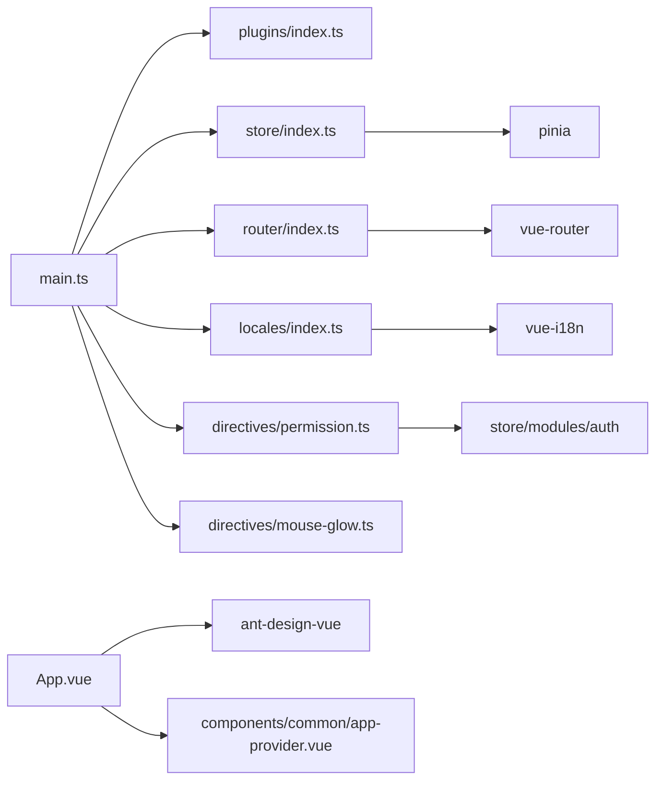

# Application Structure

<cite>
**Referenced Files in This Document**
- [main.ts](file://admin-web-soybean/src/main.ts)
- [App.vue](file://admin-web-soybean/src/App.vue)
- [vite.config.ts](file://admin-web-soybean/vite.config.ts)
- [package.json](file://admin-web-soybean/package.json)
- [plugins/index.ts](file://admin-web-soybean/src/plugins/index.ts)
- [plugins/loading.ts](file://admin-web-soybean/src/plugins/loading.ts)
- [plugins/nprogress.ts](file://admin-web-soybean/src/plugins/nprogress.ts)
- [plugins/iconify.ts](file://admin-web-soybean/src/plugins/iconify.ts)
- [plugins/dayjs.ts](file://admin-web-soybean/src/plugins/dayjs.ts)
- [plugins/app.ts](file://admin-web-soybean/src/plugins/app.ts)
- [directives/permission.ts](file://admin-web-soybean/src/directives/permission.ts)
- [directives/mouse-glow.ts](file://admin-web-soybean/src/directives/mouse-glow.ts)
- [store/index.ts](file://admin-web-soybean/src/store/index.ts)
- [router/index.ts](file://admin-web-soybean/src/router/index.ts)
- [locales/index.ts](file://admin-web-soybean/src/locales/index.ts)
- [components/common/app-provider.vue](file://admin-web-soybean/src/components/common/app-provider.vue)
</cite>

## Table of Contents
1. [Introduction](#introduction)
2. [Project Structure](#project-structure)
3. [Core Components](#core-components)
4. [Architecture Overview](#architecture-overview)
5. [Detailed Component Analysis](#detailed-component-analysis)
6. [Dependency Analysis](#dependency-analysis)
7. [Performance Considerations](#performance-considerations)
8. [Troubleshooting Guide](#troubleshooting-guide)
9. [Conclusion](#conclusion)
10. [Appendices](#appendices)

## Introduction
This document explains the Vue.js application structure and initialization process for the admin-web-soybean frontend. It covers the modern bootstrap sequence, plugin registration system, global directive setup, error boundary and fallback mechanisms, application lifecycle, plugin initialization order, dependency injection patterns, and build configuration with Vite. Practical examples illustrate plugin registration, global directive usage, and application mounting patterns, along with common initialization issues and debugging techniques.

## Project Structure
The frontend is a Vue 3 + TypeScript application built with Vite. The entry point initializes plugins, registers global directives, sets up Pinia, Vue Router, and vue-i18n, then mounts the root component. Vite handles aliases, CSS preprocessing, dev server, proxy, and production builds.

**Diagram sources**
- [main.ts:15-75](file://admin-web-soybean/src/main.ts#L15-L75)
- [plugins/loading.ts:6-62](file://admin-web-soybean/src/plugins/loading.ts#L6-L62)
- [plugins/nprogress.ts:4-9](file://admin-web-soybean/src/plugins/nprogress.ts#L4-L9)
- [plugins/iconify.ts:4-10](file://admin-web-soybean/src/plugins/iconify.ts#L4-L10)
- [plugins/dayjs.ts:5-9](file://admin-web-soybean/src/plugins/dayjs.ts#L5-L9)
- [store/index.ts:6-12](file://admin-web-soybean/src/store/index.ts#L6-L12)
- [router/index.ts:87-91](file://admin-web-soybean/src/router/index.ts#L87-L91)
- [locales/index.ts:18-20](file://admin-web-soybean/src/locales/index.ts#L18-L20)
- [plugins/app.ts:6-11](file://admin-web-soybean/src/plugins/app.ts#L6-L11)
- [App.vue:37-48](file://admin-web-soybean/src/App.vue#L37-L48)
- [components/common/app-provider.vue:27-32](file://admin-web-soybean/src/components/common/app-provider.vue#L27-L32)

**Section sources**
- [main.ts:1-75](file://admin-web-soybean/src/main.ts#L1-L75)
- [vite.config.ts:1-52](file://admin-web-soybean/vite.config.ts#L1-L52)
- [package.json:1-117](file://admin-web-soybean/package.json#L1-L117)

## Core Components
- Entry point and bootstrap: Initializes loading UI, plugins, stores, router, i18n, and mounts the app with robust error boundaries and fallbacks.
- Plugin system: Centralized exports and individual setup functions for loading animation, progress bar, offline icon provider, dayjs locale, and app-level error handling/version checks.
- Global directives: Permission-based element visibility control and interactive mouse glow effects.
- Store and router: Pinia setup with a reset plugin; Vue Router configured with history modes and guards.
- Internationalization: vue-i18n setup with locale persistence and Ant Design locale mapping.
- Root component: Ant Design ConfigProvider wrapper with watermark rendering and AppProvider for UI service registration.

**Section sources**
- [main.ts:15-75](file://admin-web-soybean/src/main.ts#L15-L75)
- [plugins/index.ts:1-6](file://admin-web-soybean/src/plugins/index.ts#L1-L6)
- [directives/permission.ts:18-55](file://admin-web-soybean/src/directives/permission.ts#L18-L55)
- [directives/mouse-glow.ts:26-90](file://admin-web-soybean/src/directives/mouse-glow.ts#L26-L90)
- [store/index.ts:6-12](file://admin-web-soybean/src/store/index.ts#L6-L12)
- [router/index.ts:87-91](file://admin-web-soybean/src/router/index.ts#L87-L91)
- [locales/index.ts:18-27](file://admin-web-soybean/src/locales/index.ts#L18-L27)
- [App.vue:37-48](file://admin-web-soybean/src/App.vue#L37-L48)

## Architecture Overview
The application follows a layered initialization pattern:
- Pre-mount phase: Loading UI, progress bar, offline icon provider, dayjs locale.
- Core framework: Pinia store, Vue Router with guards, vue-i18n.
- Runtime enhancements: Global directives, error handler, automatic update notifications.
- Mount phase: Root component with Ant Design provider and watermark.

**Diagram sources**
- [main.ts:15-75](file://admin-web-soybean/src/main.ts#L15-L75)
- [plugins/loading.ts:6-62](file://admin-web-soybean/src/plugins/loading.ts#L6-L62)
- [plugins/nprogress.ts:4-9](file://admin-web-soybean/src/plugins/nprogress.ts#L4-L9)
- [plugins/iconify.ts:4-10](file://admin-web-soybean/src/plugins/iconify.ts#L4-L10)
- [plugins/dayjs.ts:5-9](file://admin-web-soybean/src/plugins/dayjs.ts#L5-L9)
- [store/index.ts:6-12](file://admin-web-soybean/src/store/index.ts#L6-L12)
- [router/index.ts:87-91](file://admin-web-soybean/src/router/index.ts#L87-L91)
- [locales/index.ts:18-20](file://admin-web-soybean/src/locales/index.ts#L18-L20)
- [App.vue:37-48](file://admin-web-soybean/src/App.vue#L37-L48)

## Detailed Component Analysis

### Entry Point and Bootstrap Sequence
- Purpose: Centralize initialization, enforce error boundaries, and ensure graceful fallbacks.
- Key steps:
  - Pre-initialize loading UI with theme-aware CSS variables and animated dots.
  - Configure NProgress and offline Iconify provider.
  - Extend dayjs with locale data and set locale.
  - Create the Vue app instance and register global directives.
  - Install Pinia, Router, and i18n.
  - Trigger app version update check.
  - Mount to the DOM with error handling and fallback HTML.

**Diagram sources**
- [main.ts:15-75](file://admin-web-soybean/src/main.ts#L15-L75)
- [plugins/loading.ts:6-62](file://admin-web-soybean/src/plugins/loading.ts#L6-L62)
- [plugins/nprogress.ts:4-9](file://admin-web-soybean/src/plugins/nprogress.ts#L4-L9)
- [plugins/iconify.ts:4-10](file://admin-web-soybean/src/plugins/iconify.ts#L4-L10)
- [plugins/dayjs.ts:5-9](file://admin-web-soybean/src/plugins/dayjs.ts#L5-L9)
- [store/index.ts:6-12](file://admin-web-soybean/src/store/index.ts#L6-L12)
- [router/index.ts:87-91](file://admin-web-soybean/src/router/index.ts#L87-L91)
- [locales/index.ts:18-20](file://admin-web-soybean/src/locales/index.ts#L18-L20)
- [plugins/app.ts:13-91](file://admin-web-soybean/src/plugins/app.ts#L13-L91)

**Section sources**
- [main.ts:15-75](file://admin-web-soybean/src/main.ts#L15-L75)

### Plugin Registration System
- Central exports: Plugins are re-exported via a single index for easy imports.
- Individual setup functions:
  - Loading: Injects theme-aware CSS variables and renders a spinner UI into the app container.
  - NProgress: Configures progress bar behavior and exposes a global handle.
  - Iconify offline: Registers an offline API provider when a URL is configured.
  - Dayjs: Extends dayjs with locale data and sets the current locale.
  - App-level: Sets a global error handler and optional auto-update notifications.

**Diagram sources**
- [plugins/index.ts:1-6](file://admin-web-soybean/src/plugins/index.ts#L1-L6)
- [plugins/loading.ts:6-62](file://admin-web-soybean/src/plugins/loading.ts#L6-L62)
- [plugins/nprogress.ts:4-9](file://admin-web-soybean/src/plugins/nprogress.ts#L4-L9)
- [plugins/iconify.ts:4-10](file://admin-web-soybean/src/plugins/iconify.ts#L4-L10)
- [plugins/dayjs.ts:5-9](file://admin-web-soybean/src/plugins/dayjs.ts#L5-L9)
- [plugins/app.ts:6-11](file://admin-web-soybean/src/plugins/app.ts#L6-L11)

**Section sources**
- [plugins/index.ts:1-6](file://admin-web-soybean/src/plugins/index.ts#L1-L6)
- [plugins/loading.ts:6-62](file://admin-web-soybean/src/plugins/loading.ts#L6-L62)
- [plugins/nprogress.ts:4-9](file://admin-web-soybean/src/plugins/nprogress.ts#L4-L9)
- [plugins/iconify.ts:4-10](file://admin-web-soybean/src/plugins/iconify.ts#L4-L10)
- [plugins/dayjs.ts:5-9](file://admin-web-soybean/src/plugins/dayjs.ts#L5-L9)
- [plugins/app.ts:6-11](file://admin-web-soybean/src/plugins/app.ts#L6-L11)

### Global Directive Setup
- v-permission: Removes DOM nodes when the current user lacks required permissions. Supports single string or array of permissions and respects super-admin bypass.
- v-mouse-glow and v-glow-border: Add interactive glow effects under the cursor with customizable color, size, and intensity. Uses WeakMap to track cleanup functions per element.

**Diagram sources**
- [directives/permission.ts:18-55](file://admin-web-soybean/src/directives/permission.ts#L18-L55)
- [directives/mouse-glow.ts:26-90](file://admin-web-soybean/src/directives/mouse-glow.ts#L26-L90)
- [directives/mouse-glow.ts:100-157](file://admin-web-soybean/src/directives/mouse-glow.ts#L100-L157)

**Section sources**
- [directives/permission.ts:18-55](file://admin-web-soybean/src/directives/permission.ts#L18-L55)
- [directives/mouse-glow.ts:26-90](file://admin-web-soybean/src/directives/mouse-glow.ts#L26-L90)
- [directives/mouse-glow.ts:100-157](file://admin-web-soybean/src/directives/mouse-glow.ts#L100-L157)

### Application Lifecycle and Mounting
- Lifecycle stages:
  - Pre-mount: Loading UI injection and plugin initialization.
  - Framework setup: Store, router, i18n installation.
  - Runtime: Global directives, error handler, update checks.
  - Mount: Render the root component inside AppProvider.
- Dependency injection:
  - Pinia store is created and registered globally.
  - Router is installed and guarded; router readiness is awaited before proceeding.
  - i18n is installed after store/router to avoid timing issues.
  - AppProvider exposes UI services to the window for imperative usage.

**Diagram sources**
- [store/index.ts:6-12](file://admin-web-soybean/src/store/index.ts#L6-L12)
- [router/index.ts:87-91](file://admin-web-soybean/src/router/index.ts#L87-L91)
- [locales/index.ts:18-20](file://admin-web-soybean/src/locales/index.ts#L18-L20)
- [App.vue:37-48](file://admin-web-soybean/src/App.vue#L37-L48)
- [components/common/app-provider.vue:27-32](file://admin-web-soybean/src/components/common/app-provider.vue#L27-L32)

**Section sources**
- [store/index.ts:6-12](file://admin-web-soybean/src/store/index.ts#L6-L12)
- [router/index.ts:87-91](file://admin-web-soybean/src/router/index.ts#L87-L91)
- [locales/index.ts:18-20](file://admin-web-soybean/src/locales/index.ts#L18-L20)
- [App.vue:37-48](file://admin-web-soybean/src/App.vue#L37-L48)
- [components/common/app-provider.vue:27-32](file://admin-web-soybean/src/components/common/app-provider.vue#L27-L32)

### Build Configuration with Vite
- Aliases: ~ and @ mapped to project root and src respectively.
- CSS: SCSS modern compiler with global imports.
- Dev server: Host, port, auto-open, and proxy enabled in serve mode.
- Preview: Separate port for preview builds.
- Build: Optional source maps, CommonJS options, and compressed size reporting disabled.
- Environment: loadEnv applied to mode, with BUILD_TIME injected.

**Diagram sources**
- [vite.config.ts:14-50](file://admin-web-soybean/vite.config.ts#L14-L50)

**Section sources**
- [vite.config.ts:1-52](file://admin-web-soybean/vite.config.ts#L1-L52)
- [package.json:34-49](file://admin-web-soybean/package.json#L34-L49)

## Dependency Analysis
- Internal dependencies:
  - main.ts depends on plugin setup functions, store, router, i18n, and directives.
  - store/index.ts depends on Pinia and a reset plugin.
  - router/index.ts depends on Vue Router and guard creation.
  - locales/index.ts depends on vue-i18n and locale data.
  - directives depend on store modules for runtime decisions.
- External dependencies:
  - Vue 3, Pinia, Vue Router, vue-i18n, Ant Design Vue, dayjs, nprogress, @iconify/vue.
- Coupling and cohesion:
  - Strong cohesion within plugin modules; low coupling via function exports.
  - Clear separation between initialization order and runtime behavior.

**Diagram sources**
- [main.ts:1-10](file://admin-web-soybean/src/main.ts#L1-L10)
- [plugins/index.ts:1-6](file://admin-web-soybean/src/plugins/index.ts#L1-L6)
- [store/index.ts:2](file://admin-web-soybean/src/store/index.ts#L2)
- [router/index.ts:1-11](file://admin-web-soybean/src/router/index.ts#L1-L11)
- [locales/index.ts:2](file://admin-web-soybean/src/locales/index.ts#L2)
- [directives/permission.ts:2](file://admin-web-soybean/src/directives/permission.ts#L2)
- [App.vue:3](file://admin-web-soybean/src/App.vue#L3)
- [components/common/app-provider.vue:3](file://admin-web-soybean/src/components/common/app-provider.vue#L3)

**Section sources**
- [main.ts:1-10](file://admin-web-soybean/src/main.ts#L1-L10)
- [store/index.ts:2](file://admin-web-soybean/src/store/index.ts#L2)
- [router/index.ts:1-11](file://admin-web-soybean/src/router/index.ts#L1-L11)
- [locales/index.ts:2](file://admin-web-soybean/src/locales/index.ts#L2)
- [directives/permission.ts:2](file://admin-web-soybean/src/directives/permission.ts#L2)
- [App.vue:3](file://admin-web-soybean/src/App.vue#L3)
- [components/common/app-provider.vue:3](file://admin-web-soybean/src/components/common/app-provider.vue#L3)

## Performance Considerations
- Keep plugin initialization lightweight; defer heavy work until after mount if possible.
- Use lazy-loaded route components to reduce initial bundle size.
- Enable source maps only in development; disable compressed size reporting in development for faster builds.
- Prefer CSS-in-JS or CSS variables for theming to minimize runtime computations.
- Avoid unnecessary reactivity in directives; cache computed values and clean up event listeners.

[No sources needed since this section provides general guidance]

## Troubleshooting Guide
Common initialization issues and debugging techniques:
- Black screen or white screen on startup:
  - Cause: Unhandled exceptions during plugin initialization.
  - Fix: The error boundary catches failures and renders a user-friendly fallback with actionable steps.
- Loading UI not appearing:
  - Cause: setupLoading failed or app container missing.
  - Fix: Verify the app element exists and theme storage is readable.
- Progress bar not working:
  - Cause: NProgress not configured or conflicts with other loaders.
  - Fix: Ensure setupNProgress runs before navigation starts.
- Icons not rendering offline:
  - Cause: Missing VITE_ICONIFY_URL or network errors.
  - Fix: Set the environment variable and confirm resource availability.
- Locale mismatch:
  - Cause: i18n locale not persisted or Ant Design locale not set.
  - Fix: Confirm storage locale and antdLocales mapping.
- Permission directive not hiding elements:
  - Cause: Missing permissions in store or incorrect binding.
  - Fix: Inspect auth store permissions and directive usage.
- Mouse glow effects not cleaning up:
  - Cause: Element removed without proper lifecycle.
  - Fix: Ensure directive unmounted hook is triggered.

**Section sources**
- [main.ts:15-75](file://admin-web-soybean/src/main.ts#L15-L75)
- [plugins/loading.ts:6-62](file://admin-web-soybean/src/plugins/loading.ts#L6-L62)
- [plugins/nprogress.ts:4-9](file://admin-web-soybean/src/plugins/nprogress.ts#L4-L9)
- [plugins/iconify.ts:4-10](file://admin-web-soybean/src/plugins/iconify.ts#L4-L10)
- [locales/index.ts:18-27](file://admin-web-soybean/src/locales/index.ts#L18-L27)
- [directives/permission.ts:18-55](file://admin-web-soybean/src/directives/permission.ts#L18-L55)
- [directives/mouse-glow.ts:85-89](file://admin-web-soybean/src/directives/mouse-glow.ts#L85-L89)

## Conclusion
The application employs a robust, layered initialization strategy with strong error boundaries, modular plugin registration, and global directives. The Vite configuration supports efficient development and optimized production builds. Following the documented patterns ensures predictable lifecycle behavior, maintainable plugin ordering, and resilient fallback mechanisms.

[No sources needed since this section summarizes without analyzing specific files]

## Appendices

### Practical Examples Index
- Plugin registration:
  - Import and call setup functions in main.ts in the documented order.
  - Example paths: [main.ts:15-47](file://admin-web-soybean/src/main.ts#L15-L47)
- Global directive usage:
  - Permission: [directives/permission.ts:18-55](file://admin-web-soybean/src/directives/permission.ts#L18-L55)
  - Mouse glow: [directives/mouse-glow.ts:26-90](file://admin-web-soybean/src/directives/mouse-glow.ts#L26-L90)
  - Glow border: [directives/mouse-glow.ts:100-157](file://admin-web-soybean/src/directives/mouse-glow.ts#L100-L157)
- Application mounting:
  - Root component and provider: [App.vue:37-48](file://admin-web-soybean/src/App.vue#L37-L48), [components/common/app-provider.vue:27-32](file://admin-web-soybean/src/components/common/app-provider.vue#L27-L32)
- Build and scripts:
  - Vite config: [vite.config.ts:14-50](file://admin-web-soybean/vite.config.ts#L14-L50)
  - Package scripts: [package.json:34-49](file://admin-web-soybean/package.json#L34-L49)

[No sources needed since this section indexes previously cited paths]