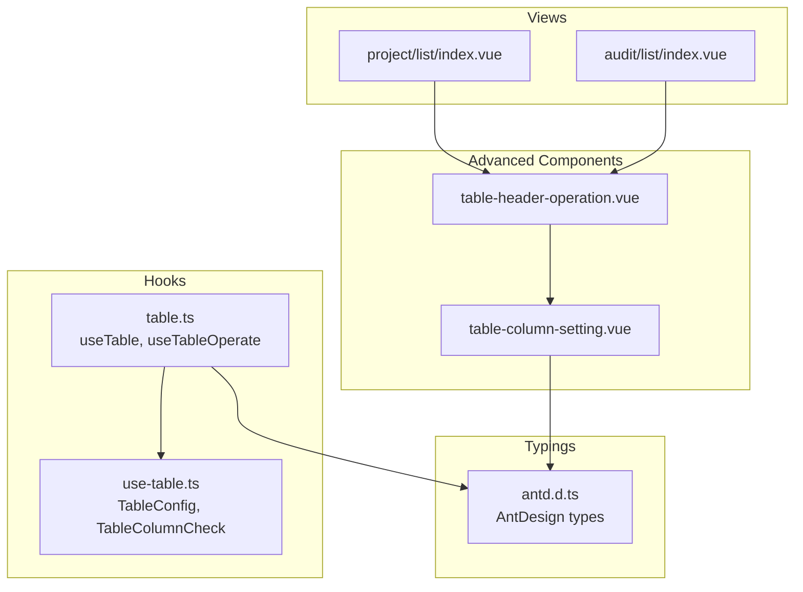
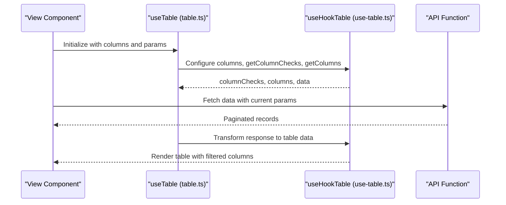
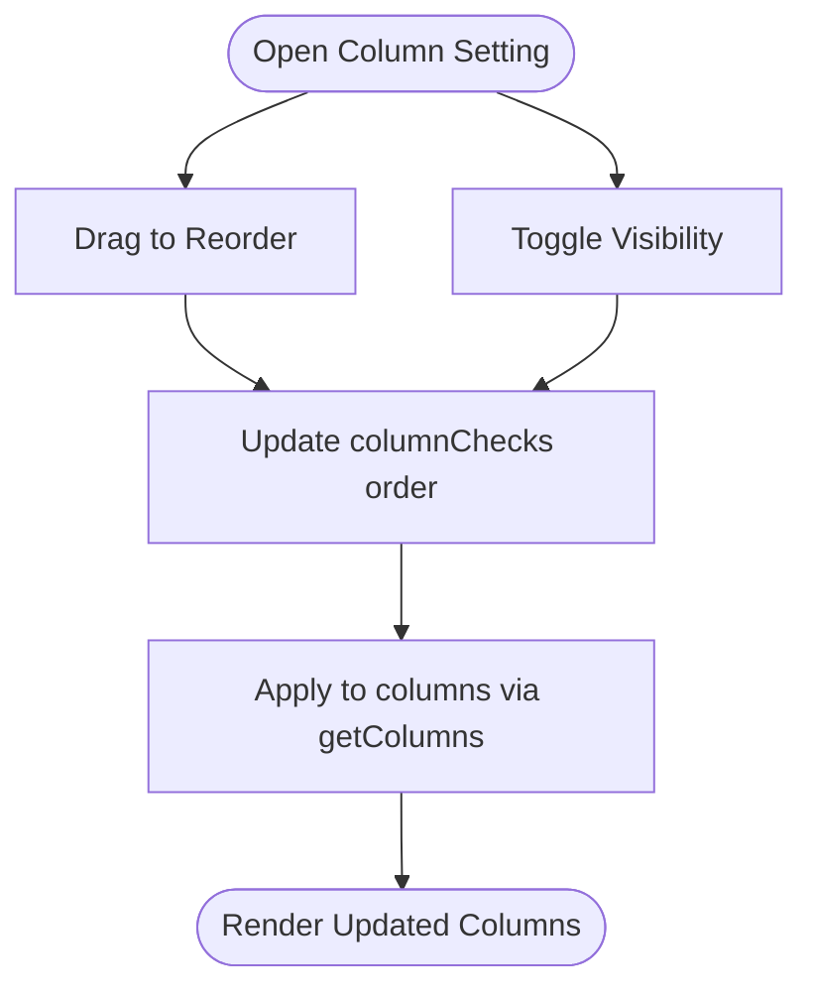
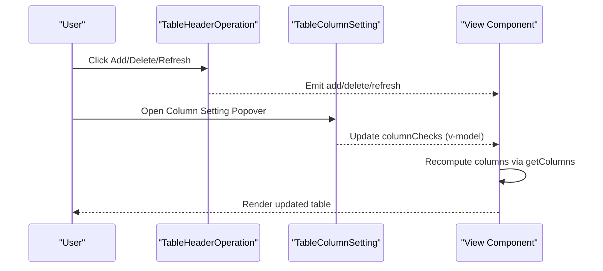
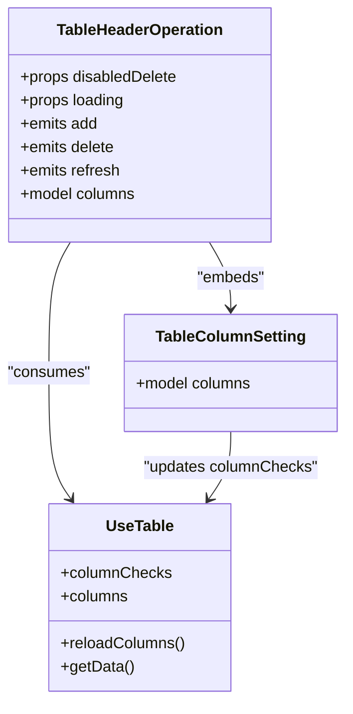
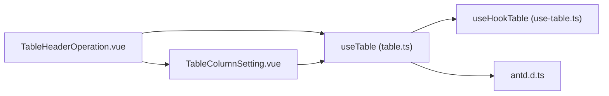

# Advanced Components

<cite>
**Referenced Files in This Document**
- [table-column-setting.vue](file://admin-web-soybean/src/components/advanced/table-column-setting.vue)
- [table-header-operation.vue](file://admin-web-soybean/src/components/advanced/table-header-operation.vue)
- [table.ts](file://admin-web-soybean/src/hooks/common/table.ts)
- [use-table.ts](file://admin-web-soybean/packages/hooks/src/use-table.ts)
- [antd.d.ts](file://admin-web-soybean/src/typings/antd.d.ts)
- [index.vue](file://admin-web-soybean/src/views/project/list/index.vue)
- [index.vue](file://admin-web-soybean/src/views/audit/list/index.vue)
</cite>

## Table of Contents
1. [Introduction](#introduction)
2. [Project Structure](#project-structure)
3. [Core Components](#core-components)
4. [Architecture Overview](#architecture-overview)
5. [Detailed Component Analysis](#detailed-component-analysis)
6. [Dependency Analysis](#dependency-analysis)
7. [Performance Considerations](#performance-considerations)
8. [Troubleshooting Guide](#troubleshooting-guide)
9. [Conclusion](#conclusion)
10. [Appendices](#appendices)

## Introduction
This document explains two advanced table components that enable dynamic table configuration and advanced header interactions:
- Table Column Setting: allows users to toggle column visibility and reorder columns via drag-and-drop.
- Table Header Operation: provides header-level actions such as add, delete, refresh, and integrates the column setting popover.

These components work together with a reusable table hook that manages column checks, pagination, and data fetching. The documentation covers architecture, state management, integration patterns, and practical examples for configuration, events, and user interactions. It also includes guidance for persistence, responsiveness, accessibility, and extension.

## Project Structure
The advanced components are located under the frontend project’s advanced components directory and integrate with shared hooks and typing definitions.

**Diagram sources**
- [table-column-setting.vue:1-40](file://admin-web-soybean/src/components/advanced/table-column-setting.vue#L1-L40)
- [table-header-operation.vue:1-72](file://admin-web-soybean/src/components/advanced/table-header-operation.vue#L1-L72)
- [table.ts:15-177](file://admin-web-soybean/src/hooks/common/table.ts#L15-L177)
- [use-table.ts:11-90](file://admin-web-soybean/packages/hooks/src/use-table.ts#L11-L90)
- [antd.d.ts:1-41](file://admin-web-soybean/src/typings/antd.d.ts#L1-L41)
- [index.vue:1-803](file://admin-web-soybean/src/views/project/list/index.vue#L1-L803)
- [index.vue:1-318](file://admin-web-soybean/src/views/audit/list/index.vue#L1-L318)

**Section sources**
- [table-column-setting.vue:1-40](file://admin-web-soybean/src/components/advanced/table-column-setting.vue#L1-L40)
- [table-header-operation.vue:1-72](file://admin-web-soybean/src/components/advanced/table-header-operation.vue#L1-L72)
- [table.ts:15-177](file://admin-web-soybean/src/hooks/common/table.ts#L15-L177)
- [use-table.ts:11-90](file://admin-web-soybean/packages/hooks/src/use-table.ts#L11-L90)
- [antd.d.ts:1-41](file://admin-web-soybean/src/typings/antd.d.ts#L1-L41)
- [index.vue:1-803](file://admin-web-soybean/src/views/project/list/index.vue#L1-L803)
- [index.vue:1-318](file://admin-web-soybean/src/views/audit/list/index.vue#L1-L318)

## Core Components
- Table Column Setting
  - Purpose: Presents a popover with draggable column entries to toggle visibility and reorder columns.
  - Key behaviors: Uses a model binding for column checks, drag-and-drop reordering, and checkbox toggles per column.
  - Integration: Consumes Ant Design column check type and internationalized labels.

- Table Header Operation
  - Purpose: Provides header-level actions (add, delete, refresh) and exposes a slot-based extensibility point.
  - Key behaviors: Emits events for add/delete/refresh, binds column checks for the integrated column setting, and supports loading state.
  - Integration: Works with Ant Design buttons, popconfirm, and the column setting component.

**Section sources**
- [table-column-setting.vue:1-40](file://admin-web-soybean/src/components/advanced/table-column-setting.vue#L1-L40)
- [table-header-operation.vue:1-72](file://admin-web-soybean/src/components/advanced/table-header-operation.vue#L1-L72)

## Architecture Overview
The advanced components rely on a shared table hook that encapsulates column management, data fetching, and pagination. The hook defines the column check model and transforms columns based on user selections.

**Diagram sources**
- [table.ts:15-96](file://admin-web-soybean/src/hooks/common/table.ts#L15-L96)
- [use-table.ts:63-108](file://admin-web-soybean/packages/hooks/src/use-table.ts#L63-L108)

**Section sources**
- [table.ts:15-177](file://admin-web-soybean/src/hooks/common/table.ts#L15-L177)
- [use-table.ts:11-108](file://admin-web-soybean/packages/hooks/src/use-table.ts#L11-L108)
- [antd.d.ts:1-41](file://admin-web-soybean/src/typings/antd.d.ts#L1-L41)

## Detailed Component Analysis

### Table Column Setting Component
- Responsibilities
  - Expose a popover-triggered UI for column configuration.
  - Allow drag-and-drop reordering of columns.
  - Toggle column visibility via checkboxes.
- Implementation highlights
  - Uses a generic script setup with a typed model for column checks.
  - Integrates a draggable list to reorder column checks.
  - Checkbox toggles update the checked state of each column check.
- Data model
  - Consumes Ant Design column check type for consistent typing.
- Accessibility and UX
  - Popover trigger and drag handles provide clear affordances.
  - Internationalization applied to labels.

**Diagram sources**
- [table-column-setting.vue:14-36](file://admin-web-soybean/src/components/advanced/table-column-setting.vue#L14-L36)
- [use-table.ts:79-90](file://admin-web-soybean/packages/hooks/src/use-table.ts#L79-L90)

**Section sources**
- [table-column-setting.vue:1-40](file://admin-web-soybean/src/components/advanced/table-column-setting.vue#L1-L40)
- [use-table.ts:11-90](file://admin-web-soybean/packages/hooks/src/use-table.ts#L11-L90)

### Table Header Operation Component
- Responsibilities
  - Provide header-level actions: add, delete, refresh.
  - Support disabled states for delete and loading states for refresh.
  - Expose slots for prefix, default, and suffix content.
  - Integrate the column setting component for dynamic column configuration.
- Implementation highlights
  - Emits custom events for add, delete, and refresh.
  - Accepts props for disabledDelete and loading.
  - Uses Ant Design components for buttons and confirm dialogs.
- Event handling
  - Add: triggers creation flow.
  - Delete: emits batch delete event after confirmation.
  - Refresh: emits refresh event with optional spinner animation.

**Diagram sources**
- [table-header-operation.vue:23-37](file://admin-web-soybean/src/components/advanced/table-header-operation.vue#L23-L37)
- [table-column-setting.vue:9-11](file://admin-web-soybean/src/components/advanced/table-column-setting.vue#L9-L11)

**Section sources**
- [table-header-operation.vue:1-72](file://admin-web-soybean/src/components/advanced/table-header-operation.vue#L1-L72)

### Integration with Views and Hooks
- View integration pattern
  - Views define columns and pass them to the table rendering logic.
  - The header operation component is placed above the table to provide actions.
  - Column setting is embedded within the header operation.
- Hook-driven column management
  - The table hook generates column checks from initial columns.
  - It filters visible columns based on checked states and rebuilds the column list.
  - It updates pagination and triggers data reloads on changes.

**Diagram sources**
- [table-header-operation.vue:8-37](file://admin-web-soybean/src/components/advanced/table-header-operation.vue#L8-L37)
- [table-column-setting.vue:9-11](file://admin-web-soybean/src/components/advanced/table-column-setting.vue#L9-L11)
- [table.ts:15-96](file://admin-web-soybean/src/hooks/common/table.ts#L15-L96)

**Section sources**
- [index.vue:57-66](file://admin-web-soybean/src/views/project/list/index.vue#L57-L66)
- [index.vue:265-307](file://admin-web-soybean/src/views/audit/list/index.vue#L265-L307)
- [table.ts:56-96](file://admin-web-soybean/src/hooks/common/table.ts#L56-L96)

## Dependency Analysis
- Internal dependencies
  - Table Header Operation depends on Table Column Setting for column configuration.
  - Both components depend on Ant Design types and icons.
  - The table hook provides the column checks and column computation logic.
- External dependencies
  - vue-draggable-plus for drag-and-drop reordering.
  - Ant Design Vue for UI primitives (buttons, popovers, popconfirm).
- Coupling and cohesion
  - Components are cohesive around table configuration concerns.
  - Low coupling through typed models and emitted events.

**Diagram sources**
- [table-header-operation.vue:1-72](file://admin-web-soybean/src/components/advanced/table-header-operation.vue#L1-L72)
- [table-column-setting.vue:1-40](file://admin-web-soybean/src/components/advanced/table-column-setting.vue#L1-L40)
- [table.ts:15-177](file://admin-web-soybean/src/hooks/common/table.ts#L15-L177)
- [use-table.ts:63-108](file://admin-web-soybean/packages/hooks/src/use-table.ts#L63-L108)
- [antd.d.ts:1-41](file://admin-web-soybean/src/typings/antd.d.ts#L1-L41)

**Section sources**
- [table-header-operation.vue:1-72](file://admin-web-soybean/src/components/advanced/table-header-operation.vue#L1-L72)
- [table-column-setting.vue:1-40](file://admin-web-soybean/src/components/advanced/table-column-setting.vue#L1-L40)
- [table.ts:15-177](file://admin-web-soybean/src/hooks/common/table.ts#L15-L177)
- [use-table.ts:63-108](file://admin-web-soybean/packages/hooks/src/use-table.ts#L63-L108)
- [antd.d.ts:1-41](file://admin-web-soybean/src/typings/antd.d.ts#L1-L41)

## Performance Considerations
- Efficient column filtering
  - Column filtering and recomputation occur via a map lookup and filter operation, ensuring O(n + m) complexity for n columns and m checks.
- Minimal reactivity overhead
  - The column checks array is reactive and updated directly; avoid unnecessary deep cloning of large datasets.
- Rendering optimization
  - Prefer virtualization or pagination for large datasets to reduce DOM nodes.
  - Debounce heavy operations like search and refresh to prevent excessive API calls.

[No sources needed since this section provides general guidance]

## Troubleshooting Guide
- Columns not updating after drag-and-drop
  - Ensure the v-model binding for columns is properly passed down to the column setting component and that the parent view triggers a column reload.
- Drag-and-drop not working
  - Verify the draggable library is installed and configured; ensure the filter class matches the intended non-draggable elements.
- Popover not opening
  - Confirm the popover trigger is visible and not overlapped by other elements; check for z-index conflicts.
- Events not firing
  - Ensure the header operation component emits the correct events and the parent view listens and handles them appropriately.

**Section sources**
- [table-column-setting.vue:23-34](file://admin-web-soybean/src/components/advanced/table-column-setting.vue#L23-L34)
- [table-header-operation.vue:27-37](file://admin-web-soybean/src/components/advanced/table-header-operation.vue#L27-L37)

## Conclusion
The advanced table components provide a flexible, user-friendly way to configure table columns and manage header-level operations. They integrate seamlessly with a robust table hook that manages column checks, pagination, and data fetching. By following the provided patterns and best practices, teams can extend functionality, customize behavior, and maintain accessibility and responsiveness across devices.

[No sources needed since this section summarizes without analyzing specific files]

## Appendices

### Practical Examples and Patterns
- Basic configuration
  - Define columns in the view and pass them to the table rendering logic.
  - Embed the header operation component above the table and include the column setting component within it.
- Event handling
  - Listen for add, delete, and refresh events from the header operation component and implement corresponding handlers in the view.
- User interaction patterns
  - Use the column setting popover to toggle visibility and reorder columns; apply changes immediately to reflect updated column sets.

**Section sources**
- [index.vue:57-66](file://admin-web-soybean/src/views/project/list/index.vue#L57-L66)
- [index.vue:265-307](file://admin-web-soybean/src/views/audit/list/index.vue#L265-L307)
- [table-header-operation.vue:27-37](file://admin-web-soybean/src/components/advanced/table-header-operation.vue#L27-L37)
- [table-column-setting.vue:23-34](file://admin-web-soybean/src/components/advanced/table-column-setting.vue#L23-L34)

### Advanced Features and Guidelines
- Column persistence
  - Store column checks in local storage or user preferences; restore them on initialization to maintain user preferences across sessions.
- Responsive behavior
  - Adjust column widths and hide less important columns on smaller screens; consider a mobile-first pagination strategy.
- Accessibility compliance
  - Ensure keyboard navigation for drag-and-drop, proper focus management for popovers, and ARIA labels for buttons and confirm dialogs.
- Extending functionality
  - Add new header actions via slots; introduce additional filters or export options; customize column setting behavior with additional metadata.

[No sources needed since this section provides general guidance]