# Common Components

<cite>
**Referenced Files in This Document**
- [app-provider.vue](file://admin-web-soybean/src/components/common/app-provider.vue)
- [dark-mode-container.vue](file://admin-web-soybean/src/components/common/dark-mode-container.vue)
- [exception-base.vue](file://admin-web-soybean/src/components/common/exception-base.vue)
- [lang-switch.vue](file://admin-web-soybean/src/components/common/lang-switch.vue)
- [menu-toggler.vue](file://admin-web-soybean/src/components/common/menu-toggler.vue)
- [theme-schema-switch.vue](file://admin-web-soybean/src/components/common/theme-schema-switch.vue)
- [full-screen.vue](file://admin-web-soybean/src/components/common/full-screen.vue)
- [pin-toggler.vue](file://admin-web-soybean/src/components/common/pin-toggler.vue)
- [reload-button.vue](file://admin-web-soybean/src/components/common/reload-button.vue)
- [system-logo.vue](file://admin-web-soybean/src/components/common/system-logo.vue)
- [button-icon.vue](file://admin-web-soybean/src/components/custom/button-icon.vue)
- [App.vue](file://admin-web-soybean/src/App.vue)
- [settings.ts](file://admin-web-soybean/src/theme/settings.ts)
- [vars.ts](file://admin-web-soybean/src/theme/vars.ts)
- [app store](file://admin-web-soybean/src/store/modules/app/index.ts)
- [theme store](file://admin-web-soybean/src/store/modules/theme/index.ts)
</cite>

## Table of Contents
1. [Introduction](#introduction)
2. [Project Structure](#project-structure)
3. [Core Components](#core-components)
4. [Architecture Overview](#architecture-overview)
5. [Detailed Component Analysis](#detailed-component-analysis)
6. [Dependency Analysis](#dependency-analysis)
7. [Performance Considerations](#performance-considerations)
8. [Troubleshooting Guide](#troubleshooting-guide)
9. [Conclusion](#conclusion)
10. [Appendices](#appendices)

## Introduction
This document describes the common component library used across the admin web application. It focuses on reusable UI primitives that provide global configuration, theme management, error handling scaffolding, and utility controls such as language switching, menu toggling, and theme schema switching. For each component, we explain purpose, props, emitted events, usage patterns, lifecycle considerations, styling approaches, accessibility features, and performance tips. Practical integration examples are included via file references and sequence diagrams.

## Project Structure
The common components live under the common directory and are complemented by a shared button wrapper and theme stores. The application bootstraps global providers and theme configuration in the root App component.

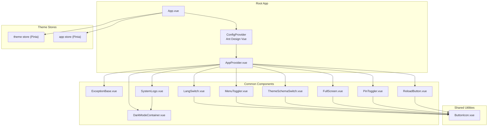

**Diagram sources**
- [App.vue:37-47](file://admin-web-soybean/src/App.vue#L37-L47)
- [app-provider.vue:27-32](file://admin-web-soybean/src/components/common/app-provider.vue#L27-L32)
- [button-icon.vue:37-46](file://admin-web-soybean/src/components/custom/button-icon.vue#L37-L46)
- [app store:14-169](file://admin-web-soybean/src/store/modules/app/index.ts#L14-L169)
- [theme store:18-221](file://admin-web-soybean/src/store/modules/theme/index.ts#L18-L221)

**Section sources**
- [App.vue:1-51](file://admin-web-soybean/src/App.vue#L1-L51)
- [app-provider.vue:1-35](file://admin-web-soybean/src/components/common/app-provider.vue#L1-L35)

## Core Components
This section summarizes the purpose, props, events, and usage patterns for each common component.

- AppProvider
  - Purpose: Registers Ant Design global UI services (message, modal, notification) onto the window for global use and wraps children with the Ant Design App container.
  - Props: None
  - Events: None
  - Usage pattern: Wrap the root RouterView with AppProvider to enable global UI services.
  - Accessibility: N/A
  - Performance: Minimal overhead; runs once during mount.

- DarkModeContainer
  - Purpose: Provides a themed container with background and text color transitions, optionally inverted for dark mode contrast.
  - Props:
    - inverted: boolean — invert background/text colors for dark mode contrast.
  - Events: None
  - Usage pattern: Wrap content inside layout containers to align with current theme tokens.
  - Accessibility: Uses theme-aware color tokens; supports inverted mode for readability.
  - Performance: Stateless functional component with minimal DOM cost.

- ExceptionBase
  - Purpose: Renders standardized exception pages (403, 404, 500) with localized messages and navigation actions.
  - Props:
    - type: '403' | '404' | '500'
    - title: string (optional)
    - description: string (optional)
  - Events: None
  - Usage pattern: Render within a route guard or error boundary to present friendly error screens.
  - Accessibility: Uses semantic headings and buttons; integrates with router push helpers.
  - Performance: Stateless component; renders quickly.

- LangSwitch
  - Purpose: Dropdown language switcher with tooltip and selection feedback.
  - Props:
    - lang: App.I18n.LangType — currently selected language.
    - langOptions: App.I18n.LangOption[] — available languages.
    - showTooltip: boolean (default true)
  - Events:
    - changeLang(lang: App.I18n.LangType): emitted when a language is selected.
  - Usage pattern: Bind to app store locale state and dispatch change actions.
  - Accessibility: Tooltip content is localized; dropdown keyboard navigation supported by Ant Design.
  - Performance: Lightweight dropdown with memoized tooltip content.

- MenuToggler
  - Purpose: Toggles menu collapse state with contextual icons (fold/unfold or caret styles).
  - Props:
    - collapsed: boolean — indicates current collapsed state.
    - arrowIcon: boolean — switches to arrow-style icons.
  - Events: None
  - Usage pattern: Pass current collapsed state and toggle handler from layout store.
  - Accessibility: Tooltip reflects expand/collapse intent; icon is descriptive.
  - Performance: Computed icon mapping; re-renders only on prop changes.

- ThemeSchemaSwitch
  - Purpose: Switches between light, dark, and auto theme modes.
  - Props:
    - themeSchema: UnionKey.ThemeScheme — current theme mode.
    - showTooltip: boolean (default true)
    - tooltipPlacement: Ant Design Tooltip placement (default bottom)
  - Events:
    - switch(): emitted when the user clicks the control.
  - Usage pattern: Bind to theme store toggle function and reflect current mode.
  - Accessibility: Tooltip content is localized; icon is descriptive.
  - Performance: Stateless with computed icon mapping.

- FullScreen
  - Purpose: Toggles fullscreen state with appropriate icons.
  - Props:
    - full: boolean — indicates fullscreen state.
  - Events: None
  - Usage pattern: Controlled by layout/fullscreen store/state; updates tooltip dynamically.
  - Accessibility: Tooltip content is localized; icon is descriptive.
  - Performance: Stateless component.

- PinToggler
  - Purpose: Pins/unpins a UI element (e.g., sidebar) with appropriate icons.
  - Props:
    - pin: boolean — indicates pinned state.
  - Events: None
  - Usage pattern: Controlled by layout store; updates tooltip dynamically.
  - Accessibility: Tooltip content is localized; icon is descriptive.
  - Performance: Stateless component.

- ReloadButton
  - Purpose: Triggers reload action with optional loading animation.
  - Props:
    - loading: boolean — animates the reload icon when true.
  - Events: None
  - Usage pattern: Used in conjunction with a reload action; animates while reloading.
  - Accessibility: Tooltip content is localized; icon is descriptive.
  - Performance: Stateless component with conditional animation class.

- SystemLogo
  - Purpose: Displays a styled SVG logo using theme-aware CSS variables.
  - Props: None
  - Events: None
  - Usage pattern: Rendered in header or branding areas; color adapts to theme.
  - Accessibility: Purely decorative; no interactive semantics.
  - Performance: Static SVG; minimal rendering cost.

**Section sources**
- [app-provider.vue:1-35](file://admin-web-soybean/src/components/common/app-provider.vue#L1-L35)
- [dark-mode-container.vue:1-18](file://admin-web-soybean/src/components/common/dark-mode-container.vue#L1-L18)
- [exception-base.vue:1-88](file://admin-web-soybean/src/components/common/exception-base.vue#L1-L88)
- [lang-switch.vue:1-55](file://admin-web-soybean/src/components/common/lang-switch.vue#L1-L55)
- [menu-toggler.vue:1-49](file://admin-web-soybean/src/components/common/menu-toggler.vue#L1-L49)
- [theme-schema-switch.vue:1-57](file://admin-web-soybean/src/components/common/theme-schema-switch.vue#L1-L57)
- [full-screen.vue:1-23](file://admin-web-soybean/src/components/common/full-screen.vue#L1-L23)
- [pin-toggler.vue:1-23](file://admin-web-soybean/src/components/common/pin-toggler.vue#L1-L23)
- [reload-button.vue:1-22](file://admin-web-soybean/src/components/common/reload-button.vue#L1-L22)
- [system-logo.vue:1-161](file://admin-web-soybean/src/components/common/system-logo.vue#L1-L161)

## Architecture Overview
The common components integrate with global providers and stores to deliver consistent theming, localization, and UI behavior.

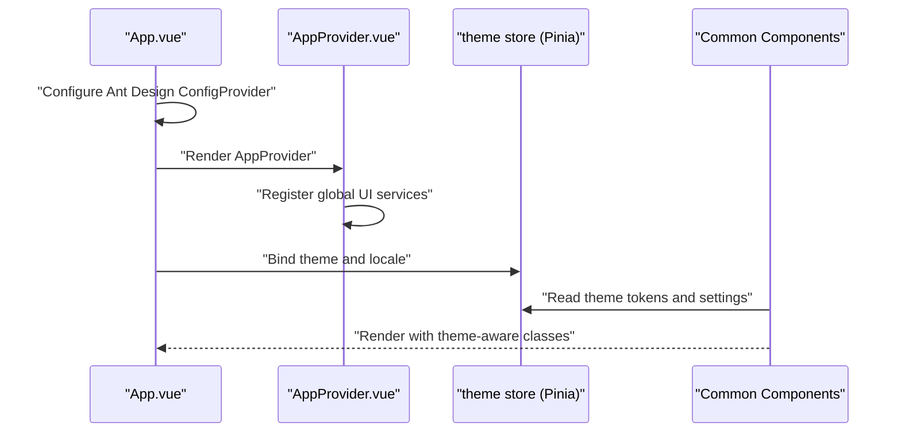

**Diagram sources**
- [App.vue:37-47](file://admin-web-soybean/src/App.vue#L37-L47)
- [app-provider.vue:27-32](file://admin-web-soybean/src/components/common/app-provider.vue#L27-L32)
- [theme store:18-221](file://admin-web-soybean/src/store/modules/theme/index.ts#L18-L221)

## Detailed Component Analysis

### AppProvider
- Purpose: Centralizes global UI service registration and ensures Ant Design App container wraps the application.
- Implementation highlights:
  - Uses Ant Design App.useApp() to obtain message, modal, and notification instances.
  - Exposes them globally via window.$message, window.$modal, window.$notification.
  - Wraps children with an App container and a slot for downstream components.
- Lifecycle: Runs once during mount to register services; no teardown required.
- Accessibility: N/A.
- Performance: Minimal runtime cost; executed once per app initialization.

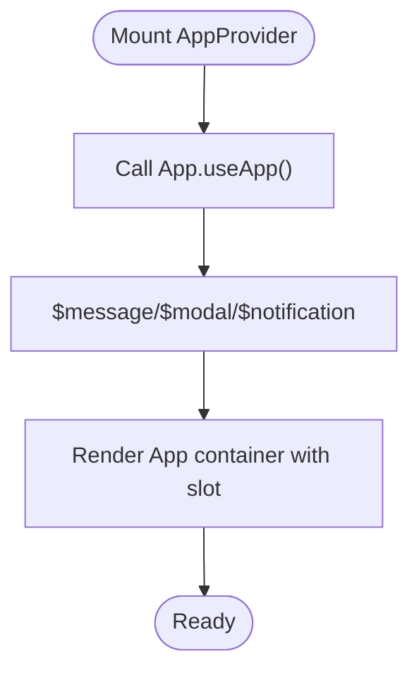

**Diagram sources**
- [app-provider.vue:9-24](file://admin-web-soybean/src/components/common/app-provider.vue#L9-L24)

**Section sources**
- [app-provider.vue:1-35](file://admin-web-soybean/src/components/common/app-provider.vue#L1-L35)

### DarkModeContainer
- Purpose: Provides a theme-aware container with smooth transitions and optional inversion for improved readability.
- Implementation highlights:
  - Accepts an inverted prop to swap background and text colors.
  - Uses CSS classes with theme tokens for dynamic color application.
- Accessibility: Supports inverted mode for better contrast in dark themes.
- Performance: Stateless; renders quickly with minimal DOM.

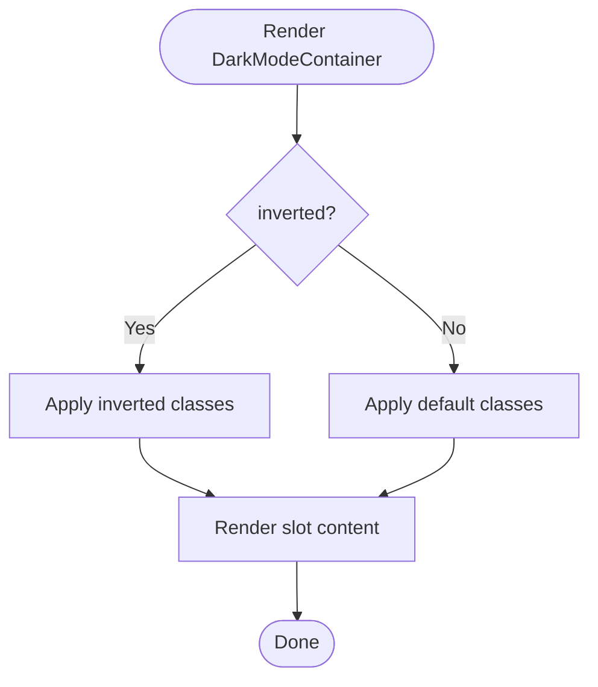

**Diagram sources**
- [dark-mode-container.vue:11-14](file://admin-web-soybean/src/components/common/dark-mode-container.vue#L11-L14)

**Section sources**
- [dark-mode-container.vue:1-18](file://admin-web-soybean/src/components/common/dark-mode-container.vue#L1-L18)

### ExceptionBase
- Purpose: Standardizes error pages with localized messages and navigational actions.
- Implementation highlights:
  - Maps exception types to icons, titles, and descriptions.
  - Provides navigation actions: go home and go back.
  - Integrates with router push helpers and localization.
- Accessibility: Uses headings and buttons; localized tooltips and labels.
- Performance: Stateless component; fast render.

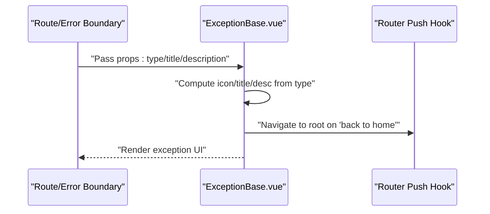

**Diagram sources**
- [exception-base.vue:34-84](file://admin-web-soybean/src/components/common/exception-base.vue#L34-L84)

**Section sources**
- [exception-base.vue:1-88](file://admin-web-soybean/src/components/common/exception-base.vue#L1-L88)

### LangSwitch
- Purpose: Allows users to switch languages via a dropdown with localized tooltip.
- Implementation highlights:
  - Emits changeLang with the selected language.
  - Uses ButtonIcon for consistent styling and tooltip behavior.
- Accessibility: Tooltip content is localized; dropdown supports keyboard navigation.
- Performance: Lightweight; tooltip content is computed and cached.

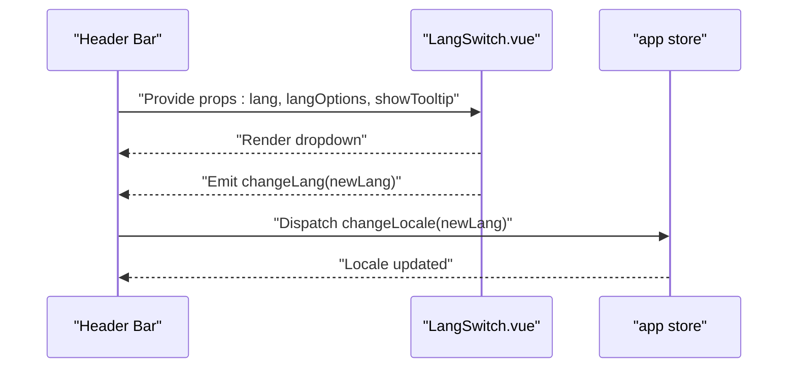

**Diagram sources**
- [lang-switch.vue:34-36](file://admin-web-soybean/src/components/common/lang-switch.vue#L34-L36)
- [app store:68-72](file://admin-web-soybean/src/store/modules/app/index.ts#L68-L72)

**Section sources**
- [lang-switch.vue:1-55](file://admin-web-soybean/src/components/common/lang-switch.vue#L1-L55)
- [app store:55-72](file://admin-web-soybean/src/store/modules/app/index.ts#L55-L72)

### MenuToggler
- Purpose: Toggles menu collapsed state with contextual icons.
- Implementation highlights:
  - Computes icon based on collapsed and arrowIcon props.
  - Uses ButtonIcon for consistent tooltip and styling.
- Accessibility: Tooltip content is localized; icon is descriptive.
- Performance: Computed icon mapping; efficient re-rendering.

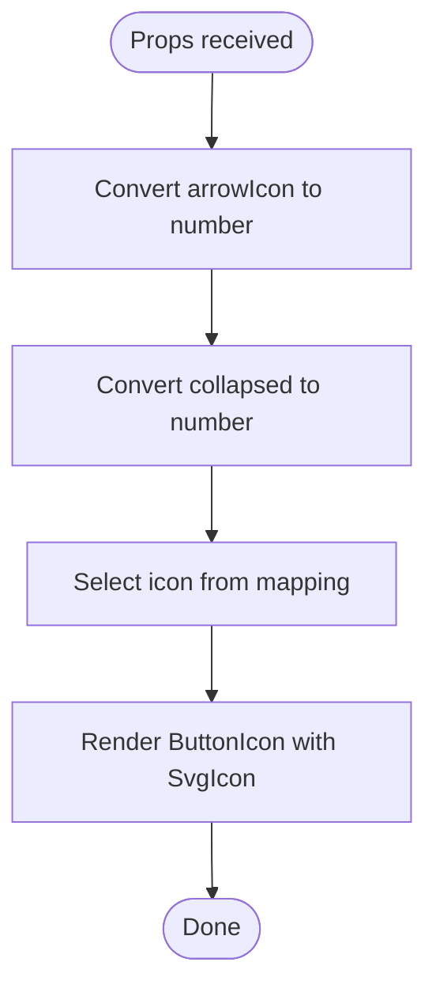

**Diagram sources**
- [menu-toggler.vue:18-35](file://admin-web-soybean/src/components/common/menu-toggler.vue#L18-L35)

**Section sources**
- [menu-toggler.vue:1-49](file://admin-web-soybean/src/components/common/menu-toggler.vue#L1-L49)

### ThemeSchemaSwitch
- Purpose: Switches between light, dark, and auto theme modes.
- Implementation highlights:
  - Emits switch event to notify parent to cycle theme scheme.
  - Uses ButtonIcon with computed icon and localized tooltip.
- Accessibility: Tooltip content is localized; icon is descriptive.
- Performance: Stateless with computed icon mapping.

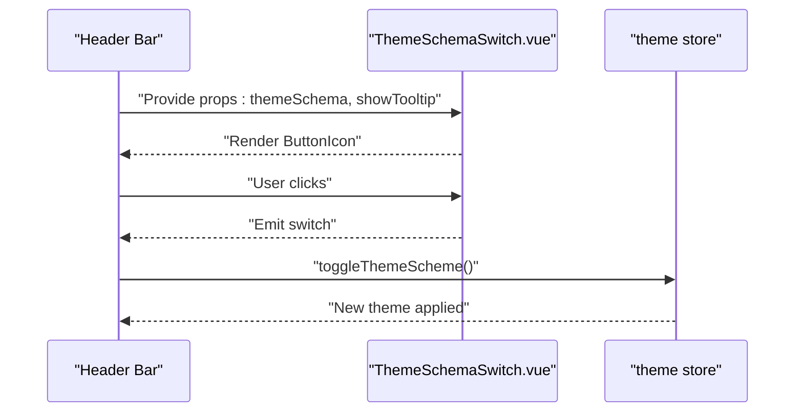

**Diagram sources**
- [theme-schema-switch.vue:28-30](file://admin-web-soybean/src/components/common/theme-schema-switch.vue#L28-L30)
- [theme store:94-105](file://admin-web-soybean/src/store/modules/theme/index.ts#L94-L105)

**Section sources**
- [theme-schema-switch.vue:1-57](file://admin-web-soybean/src/components/common/theme-schema-switch.vue#L1-L57)
- [theme store:94-105](file://admin-web-soybean/src/store/modules/theme/index.ts#L94-L105)

### FullScreen, PinToggler, ReloadButton
- Purpose: Utility controls for fullscreen, pinning, and reload actions.
- Implementation highlights:
  - All three components wrap ButtonIcon to ensure consistent styling and tooltips.
  - FullScreen toggles icon based on full prop; PinToggler toggles pin state; ReloadButton conditionally animates.
- Accessibility: Tooltip content is localized; icons are descriptive.
- Performance: Stateless components with minimal re-renders.

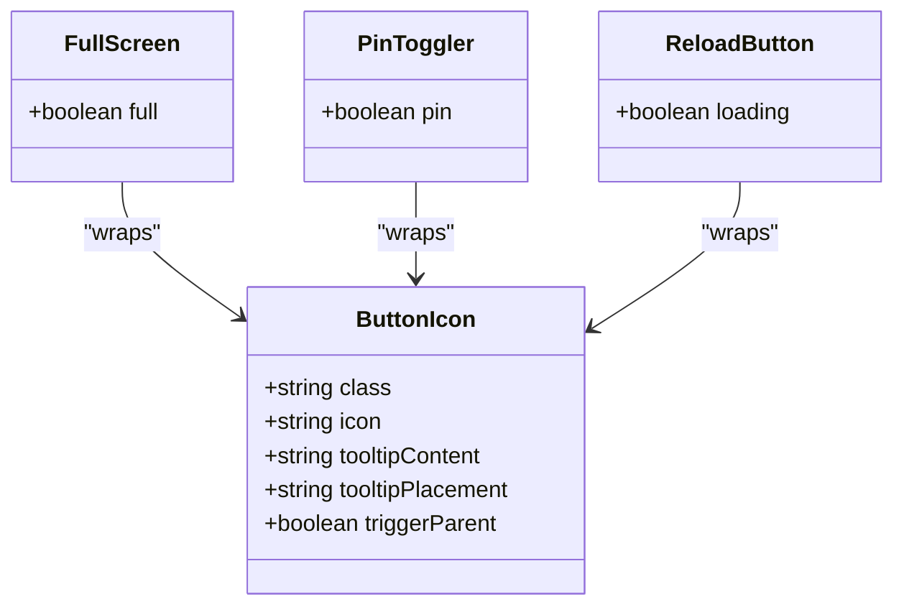

**Diagram sources**
- [full-screen.vue:15-20](file://admin-web-soybean/src/components/common/full-screen.vue#L15-L20)
- [pin-toggler.vue:16-19](file://admin-web-soybean/src/components/common/pin-toggler.vue#L16-L19)
- [reload-button.vue:15-18](file://admin-web-soybean/src/components/common/reload-button.vue#L15-L18)
- [button-icon.vue:37-46](file://admin-web-soybean/src/components/custom/button-icon.vue#L37-L46)

**Section sources**
- [full-screen.vue:1-23](file://admin-web-soybean/src/components/common/full-screen.vue#L1-L23)
- [pin-toggler.vue:1-23](file://admin-web-soybean/src/components/common/pin-toggler.vue#L1-L23)
- [reload-button.vue:1-22](file://admin-web-soybean/src/components/common/reload-button.vue#L1-L22)
- [button-icon.vue:1-49](file://admin-web-soybean/src/components/custom/button-icon.vue#L1-L49)

### SystemLogo
- Purpose: Displays a themed SVG logo using CSS variables derived from theme tokens.
- Implementation highlights:
  - Defines gradients using CSS variables (--primary-300-color, etc.) that reflect current theme.
  - No props; relies on global theme variables.
- Accessibility: Decorative; no interactive semantics.
- Performance: Static SVG; minimal rendering cost.

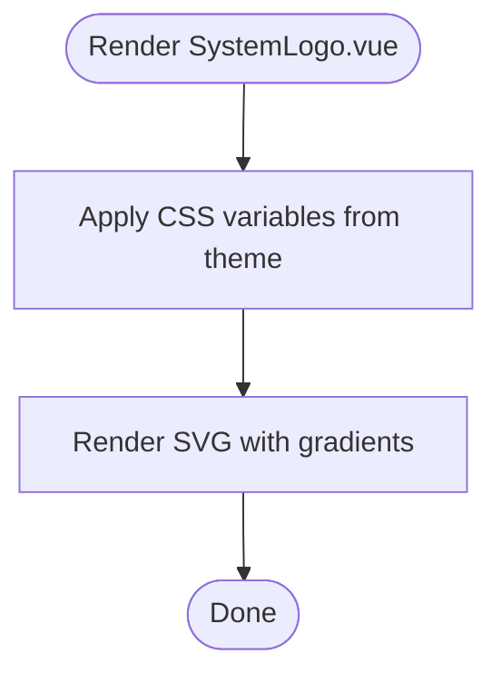

**Diagram sources**
- [system-logo.vue:152-159](file://admin-web-soybean/src/components/common/system-logo.vue#L152-L159)
- [vars.ts:21-35](file://admin-web-soybean/src/theme/vars.ts#L21-L35)

**Section sources**
- [system-logo.vue:1-161](file://admin-web-soybean/src/components/common/system-logo.vue#L1-L161)
- [vars.ts:1-36](file://admin-web-soybean/src/theme/vars.ts#L1-L36)

## Dependency Analysis
Common components depend on shared utilities and stores for consistent behavior and theming.

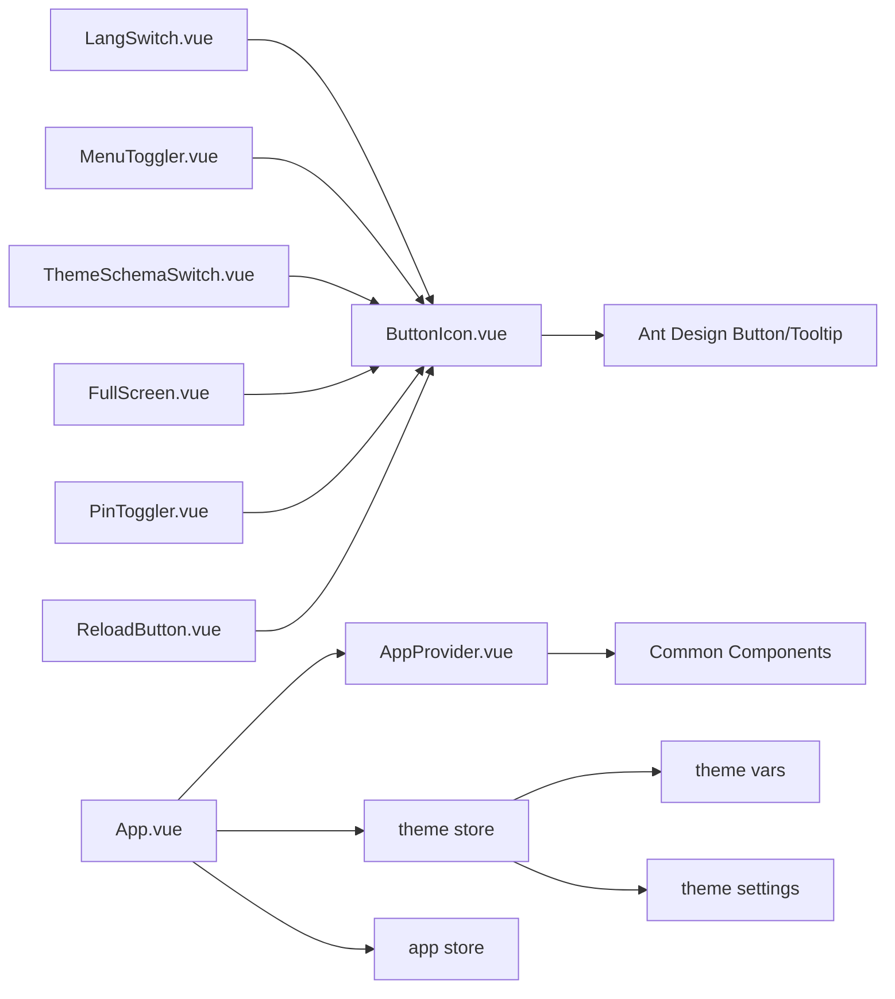

**Diagram sources**
- [lang-switch.vue:40-51](file://admin-web-soybean/src/components/common/lang-switch.vue#L40-L51)
- [menu-toggler.vue:39-45](file://admin-web-soybean/src/components/common/menu-toggler.vue#L39-L45)
- [theme-schema-switch.vue:48-53](file://admin-web-soybean/src/components/common/theme-schema-switch.vue#L48-L53)
- [full-screen.vue:15-19](file://admin-web-soybean/src/components/common/full-screen.vue#L15-L19)
- [pin-toggler.vue:16-19](file://admin-web-soybean/src/components/common/pin-toggler.vue#L16-L19)
- [reload-button.vue:15-18](file://admin-web-soybean/src/components/common/reload-button.vue#L15-L18)
- [button-icon.vue:37-46](file://admin-web-soybean/src/components/custom/button-icon.vue#L37-L46)
- [App.vue:37-47](file://admin-web-soybean/src/App.vue#L37-L47)
- [theme store:18-221](file://admin-web-soybean/src/store/modules/theme/index.ts#L18-L221)
- [app store:14-169](file://admin-web-soybean/src/store/modules/app/index.ts#L14-L169)
- [settings.ts:1-87](file://admin-web-soybean/src/theme/settings.ts#L1-L87)
- [vars.ts:21-35](file://admin-web-soybean/src/theme/vars.ts#L21-L35)

**Section sources**
- [lang-switch.vue:1-55](file://admin-web-soybean/src/components/common/lang-switch.vue#L1-L55)
- [menu-toggler.vue:1-49](file://admin-web-soybean/src/components/common/menu-toggler.vue#L1-L49)
- [theme-schema-switch.vue:1-57](file://admin-web-soybean/src/components/common/theme-schema-switch.vue#L1-L57)
- [full-screen.vue:1-23](file://admin-web-soybean/src/components/common/full-screen.vue#L1-L23)
- [pin-toggler.vue:1-23](file://admin-web-soybean/src/components/common/pin-toggler.vue#L1-L23)
- [reload-button.vue:1-22](file://admin-web-soybean/src/components/common/reload-button.vue#L1-L22)
- [button-icon.vue:1-49](file://admin-web-soybean/src/components/custom/button-icon.vue#L1-L49)
- [App.vue:1-51](file://admin-web-soybean/src/App.vue#L1-L51)
- [theme store:18-221](file://admin-web-soybean/src/store/modules/theme/index.ts#L18-L221)
- [app store:14-169](file://admin-web-soybean/src/store/modules/app/index.ts#L14-L169)
- [settings.ts:1-87](file://admin-web-soybean/src/theme/settings.ts#L1-L87)
- [vars.ts:1-36](file://admin-web-soybean/src/theme/vars.ts#L1-L36)

## Performance Considerations
- Prefer stateless components for UI primitives to minimize re-renders.
- Use computed properties for icon and tooltip content to avoid recomputation.
- Avoid heavy watchers in common components; rely on store-driven props.
- Leverage CSS variables for theme tokens to reduce style recalculation.
- Defer animations to conditional classes (e.g., loading spin) to avoid unnecessary work.
- Keep slots minimal and avoid deep nesting in common containers.

## Troubleshooting Guide
- Global UI services not available:
  - Ensure AppProvider is wrapping the application root and services are registered during mount.
  - Verify that Ant Design ConfigProvider is configured with theme and locale.
- Theme not applying to components:
  - Confirm theme store is initialized and theme tokens are injected into global CSS variables.
  - Check that theme settings include valid color tokens and layout configuration.
- Language switch not updating:
  - Ensure the app store locale is updated and watchers propagate to menus and tabs.
  - Verify that dayjs locale is also updated alongside the UI locale.
- Tooltip not appearing:
  - Confirm ButtonIcon is receiving tooltipContent and placement props.
  - Ensure the tooltip container is correctly resolved (triggerParent flag if needed).

**Section sources**
- [app-provider.vue:14-20](file://admin-web-soybean/src/components/common/app-provider.vue#L14-L20)
- [App.vue:37-47](file://admin-web-soybean/src/App.vue#L37-L47)
- [theme store:138-146](file://admin-web-soybean/src/store/modules/theme/index.ts#L138-L146)
- [app store:119-132](file://admin-web-soybean/src/store/modules/app/index.ts#L119-L132)
- [button-icon.vue:30-32](file://admin-web-soybean/src/components/custom/button-icon.vue#L30-L32)

## Conclusion
The common component library provides a cohesive set of UI primitives that integrate with global providers and stores to deliver consistent theming, localization, and behavior. By leveraging shared utilities like ButtonIcon and store-driven props, developers can compose reliable interfaces with predictable performance and accessibility characteristics.

## Appendices
- Theming tokens and defaults:
  - Theme settings define default scheme, colors, layout, page animations, and token maps.
  - Theme vars expose CSS variables for colors and shadows derived from theme tokens.
- Store integration:
  - App store manages locale, layout state, and reload behavior.
  - Theme store manages theme scheme, colors, Ant Design theme, and CSS variable injection.

**Section sources**
- [settings.ts:1-87](file://admin-web-soybean/src/theme/settings.ts#L1-L87)
- [vars.ts:1-36](file://admin-web-soybean/src/theme/vars.ts#L1-L36)
- [app store:14-169](file://admin-web-soybean/src/store/modules/app/index.ts#L14-L169)
- [theme store:18-221](file://admin-web-soybean/src/store/modules/theme/index.ts#L18-L221)