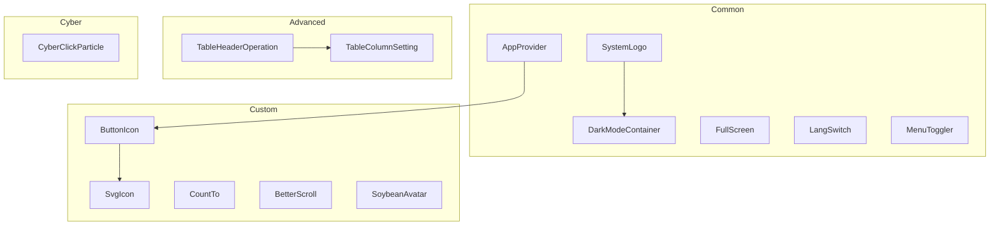
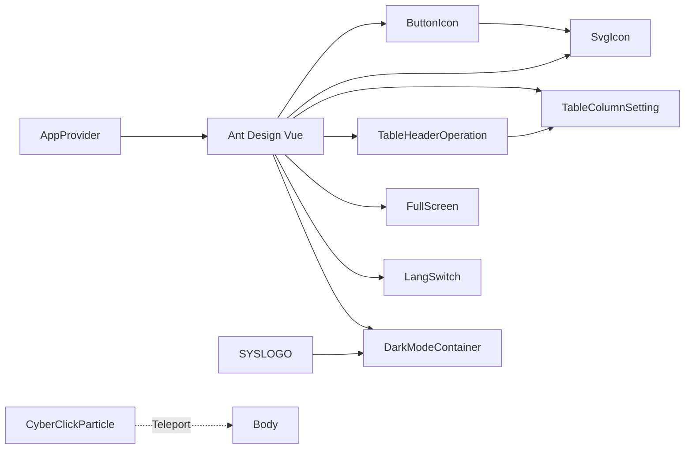
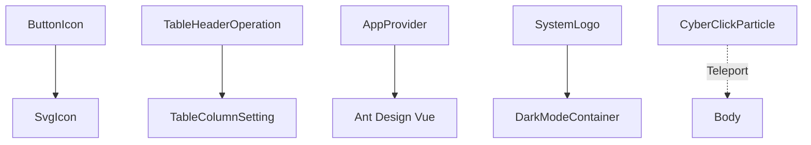

# Component System

<cite>
**Referenced Files in This Document**
- [app-provider.vue](file://admin-web-soybean/src/components/common/app-provider.vue)
- [button-icon.vue](file://admin-web-soybean/src/components/custom/button-icon.vue)
- [CyberClickParticle.vue](file://admin-web-soybean/src/components/cyber/CyberClickParticle.vue)
- [table-column-setting.vue](file://admin-web-soybean/src/components/advanced/table-column-setting.vue)
- [dark-mode-container.vue](file://admin-web-soybean/src/components/common/dark-mode-container.vue)
- [svg-icon.vue](file://admin-web-soybean/src/components/custom/svg-icon.vue)
- [count-to.vue](file://admin-web-soybean/src/components/custom/count-to.vue)
- [full-screen.vue](file://admin-web-soybean/src/components/common/full-screen.vue)
- [lang-switch.vue](file://admin-web-soybean/src/components/common/lang-switch.vue)
- [table-header-operation.vue](file://admin-web-soybean/src/components/advanced/table-header-operation.vue)
- [better-scroll.vue](file://admin-web-soybean/src/components/custom/better-scroll.vue)
- [menu-toggler.vue](file://admin-web-soybean/src/components/common/menu-toggler.vue)
- [system-logo.vue](file://admin-web-soybean/src/components/common/system-logo.vue)
- [soybean-avatar.vue](file://admin-web-soybean/src/components/custom/soybean-avatar.vue)
</cite>

## Table of Contents
1. [Introduction](#introduction)
2. [Project Structure](#project-structure)
3. [Core Components](#core-components)
4. [Architecture Overview](#architecture-overview)
5. [Detailed Component Analysis](#detailed-component-analysis)
6. [Dependency Analysis](#dependency-analysis)
7. [Performance Considerations](#performance-considerations)
8. [Troubleshooting Guide](#troubleshooting-guide)
9. [Conclusion](#conclusion)
10. [Appendices](#appendices)

## Introduction
This document describes the component architecture and design system of the frontend application. It explains the organization of common, custom, and advanced components, their composition patterns, prop interfaces, event handling strategies, and integration with Ant Design Vue. It also covers styling approaches, responsive design patterns, naming conventions, documentation standards, and performance optimization guidelines for component-heavy applications.

## Project Structure
The component system is organized by category:
- Common: foundational UI primitives and layout helpers used across the app
- Custom: reusable widgets and utilities that extend Ant Design Vue
- Advanced: higher-order components for specialized workflows (e.g., table operations)
- Cyber: themed components implementing a cyberpunk aesthetic

**Diagram sources**
- [app-provider.vue:1-35](file://admin-web-soybean/src/components/common/app-provider.vue#L1-L35)
- [button-icon.vue:1-50](file://admin-web-soybean/src/components/custom/button-icon.vue#L1-L50)
- [CyberClickParticle.vue:1-133](file://admin-web-soybean/src/components/cyber/CyberClickParticle.vue#L1-L133)
- [table-column-setting.vue:1-40](file://admin-web-soybean/src/components/advanced/table-column-setting.vue#L1-L40)
- [dark-mode-container.vue:1-18](file://admin-web-soybean/src/components/common/dark-mode-container.vue#L1-L18)
- [svg-icon.vue:1-55](file://admin-web-soybean/src/components/custom/svg-icon.vue#L1-L55)
- [count-to.vue:1-89](file://admin-web-soybean/src/components/custom/count-to.vue#L1-L89)
- [full-screen.vue:1-23](file://admin-web-soybean/src/components/common/full-screen.vue#L1-L23)
- [lang-switch.vue:1-55](file://admin-web-soybean/src/components/common/lang-switch.vue#L1-L55)
- [table-header-operation.vue:1-72](file://admin-web-soybean/src/components/advanced/table-header-operation.vue#L1-L72)
- [better-scroll.vue:1-54](file://admin-web-soybean/src/components/custom/better-scroll.vue#L1-L54)
- [menu-toggler.vue:1-49](file://admin-web-soybean/src/components/common/menu-toggler.vue#L1-L49)
- [system-logo.vue:1-161](file://admin-web-soybean/src/components/common/system-logo.vue#L1-L161)
- [soybean-avatar.vue:1-14](file://admin-web-soybean/src/components/custom/soybean-avatar.vue#L1-L14)

**Section sources**
- [app-provider.vue:1-35](file://admin-web-soybean/src/components/common/app-provider.vue#L1-L35)
- [button-icon.vue:1-50](file://admin-web-soybean/src/components/custom/button-icon.vue#L1-L50)
- [CyberClickParticle.vue:1-133](file://admin-web-soybean/src/components/cyber/CyberClickParticle.vue#L1-L133)
- [table-column-setting.vue:1-40](file://admin-web-soybean/src/components/advanced/table-column-setting.vue#L1-L40)
- [dark-mode-container.vue:1-18](file://admin-web-soybean/src/components/common/dark-mode-container.vue#L1-L18)
- [svg-icon.vue:1-55](file://admin-web-soybean/src/components/custom/svg-icon.vue#L1-L55)
- [count-to.vue:1-89](file://admin-web-soybean/src/components/custom/count-to.vue#L1-L89)
- [full-screen.vue:1-23](file://admin-web-soybean/src/components/common/full-screen.vue#L1-L23)
- [lang-switch.vue:1-55](file://admin-web-soybean/src/components/common/lang-switch.vue#L1-L55)
- [table-header-operation.vue:1-72](file://admin-web-soybean/src/components/advanced/table-header-operation.vue#L1-L72)
- [better-scroll.vue:1-54](file://admin-web-soybean/src/components/custom/better-scroll.vue#L1-L54)
- [menu-toggler.vue:1-49](file://admin-web-soybean/src/components/common/menu-toggler.vue#L1-L49)
- [system-logo.vue:1-161](file://admin-web-soybean/src/components/common/system-logo.vue#L1-L161)
- [soybean-avatar.vue:1-14](file://admin-web-soybean/src/components/custom/soybean-avatar.vue#L1-L14)

## Core Components
This section summarizes the primary building blocks and their roles.

- AppProvider: Wraps the app with Ant Design Vue’s provider and exposes global UI services to the window for imperative usage.
- ButtonIcon: A thin wrapper around an Ant Design button with integrated tooltip, supporting slots and forwarding attributes.
- SvgIcon: Renders either a local SVG symbol or an Iconify icon, with attribute forwarding and environment-driven prefixing.
- CountTo: Animated numeric counter with configurable easing, formatting, and transitions.
- BetterScroll: A composable wrapper around the BetterScroll library for scrollable containers.
- TableColumnSetting: Draggable column visibility toggler for tables.
- TableHeaderOperation: Composite toolbar for table actions, including add, delete, refresh, and column settings.
- DarkModeContainer: A container that switches background/text themes with optional inversion.
- FullScreen: Toggle for fullscreen mode with localized tooltips.
- LangSwitch: Dropdown language switcher emitting a change event.
- MenuToggler: Icon toggle for collapsing/expanding menus with dual presentation modes.
- SystemLogo: SVG-based logo with theme-aware gradients.
- CyberClickParticle: Cyberpunk-style click particle effect using Teleport and CSS animations.

**Section sources**
- [app-provider.vue:1-35](file://admin-web-soybean/src/components/common/app-provider.vue#L1-L35)
- [button-icon.vue:1-50](file://admin-web-soybean/src/components/custom/button-icon.vue#L1-L50)
- [svg-icon.vue:1-55](file://admin-web-soybean/src/components/custom/svg-icon.vue#L1-L55)
- [count-to.vue:1-89](file://admin-web-soybean/src/components/custom/count-to.vue#L1-L89)
- [better-scroll.vue:1-54](file://admin-web-soybean/src/components/custom/better-scroll.vue#L1-L54)
- [table-column-setting.vue:1-40](file://admin-web-soybean/src/components/advanced/table-column-setting.vue#L1-L40)
- [table-header-operation.vue:1-72](file://admin-web-soybean/src/components/advanced/table-header-operation.vue#L1-L72)
- [dark-mode-container.vue:1-18](file://admin-web-soybean/src/components/common/dark-mode-container.vue#L1-L18)
- [full-screen.vue:1-23](file://admin-web-soybean/src/components/common/full-screen.vue#L1-L23)
- [lang-switch.vue:1-55](file://admin-web-soybean/src/components/common/lang-switch.vue#L1-L55)
- [menu-toggler.vue:1-49](file://admin-web-soybean/src/components/common/menu-toggler.vue#L1-L49)
- [system-logo.vue:1-161](file://admin-web-soybean/src/components/common/system-logo.vue#L1-L161)
- [CyberClickParticle.vue:1-133](file://admin-web-soybean/src/components/cyber/CyberClickParticle.vue#L1-L133)
- [soybean-avatar.vue:1-14](file://admin-web-soybean/src/components/custom/soybean-avatar.vue#L1-L14)

## Architecture Overview
The component architecture follows a layered pattern:
- Common components provide low-level UI primitives and theming helpers
- Custom components extend Ant Design Vue with additional UX behaviors
- Advanced components encapsulate complex workflows (e.g., table operations)
- Cyber components deliver thematic experiences

**Diagram sources**
- [app-provider.vue:1-35](file://admin-web-soybean/src/components/common/app-provider.vue#L1-L35)
- [button-icon.vue:1-50](file://admin-web-soybean/src/components/custom/button-icon.vue#L1-L50)
- [svg-icon.vue:1-55](file://admin-web-soybean/src/components/custom/svg-icon.vue#L1-L55)
- [table-column-setting.vue:1-40](file://admin-web-soybean/src/components/advanced/table-column-setting.vue#L1-L40)
- [table-header-operation.vue:1-72](file://admin-web-soybean/src/components/advanced/table-header-operation.vue#L1-L72)
- [full-screen.vue:1-23](file://admin-web-soybean/src/components/common/full-screen.vue#L1-L23)
- [lang-switch.vue:1-55](file://admin-web-soybean/src/components/common/lang-switch.vue#L1-L55)
- [dark-mode-container.vue:1-18](file://admin-web-soybean/src/components/common/dark-mode-container.vue#L1-L18)
- [CyberClickParticle.vue:1-133](file://admin-web-soybean/src/components/cyber/CyberClickParticle.vue#L1-L133)
- [system-logo.vue:1-161](file://admin-web-soybean/src/components/common/system-logo.vue#L1-L161)

## Detailed Component Analysis

### Common Components
- AppProvider
  - Purpose: Provide Ant Design Vue UI services globally and expose them via window for imperative usage.
  - Composition: Uses Ant Design Vue’s App provider and registers message, modal, and notification instances on the window.
  - Slots: Exposes a default slot for rendering child components.
  - Integration: Typically wraps the root App component.

- DarkModeContainer
  - Purpose: Theme-aware container with optional inverted text/background.
  - Props: inverted (boolean)
  - Slots: default slot for content.

- FullScreen
  - Purpose: Toggle icon for fullscreen mode with localized tooltip.
  - Props: full (boolean)
  - Composition: Renders ButtonIcon with appropriate icons depending on state.

- LangSwitch
  - Purpose: Language selection dropdown with tooltip and change event emission.
  - Props: lang (current language), langOptions (options array), showTooltip (boolean)
  - Events: changeLang(lang)

- MenuToggler
  - Purpose: Collapse/expand menu toggle with dual icon sets.
  - Props: collapsed (boolean), arrowIcon (boolean)
  - Composition: Computes icon based on props and renders ButtonIcon.

- SystemLogo
  - Purpose: SVG-based logo with theme-aware gradients using CSS variables.
  - Styling: Defines CSS variables mapped to theme tokens.

**Section sources**
- [app-provider.vue:1-35](file://admin-web-soybean/src/components/common/app-provider.vue#L1-L35)
- [dark-mode-container.vue:1-18](file://admin-web-soybean/src/components/common/dark-mode-container.vue#L1-L18)
- [full-screen.vue:1-23](file://admin-web-soybean/src/components/common/full-screen.vue#L1-L23)
- [lang-switch.vue:1-55](file://admin-web-soybean/src/components/common/lang-switch.vue#L1-L55)
- [menu-toggler.vue:1-49](file://admin-web-soybean/src/components/common/menu-toggler.vue#L1-L49)
- [system-logo.vue:1-161](file://admin-web-soybean/src/components/common/system-logo.vue#L1-L161)

### Custom Components
- ButtonIcon
  - Purpose: Button with integrated tooltip and optional slot content.
  - Props: class (string), icon (string), tooltipContent (string), tooltipPlacement (TooltipPlacement), triggerParent (boolean)
  - Attributes: Forwards non-prop attributes to the underlying button.
  - Slots: default slot for custom content; falls back to SvgIcon if empty.
  - Integration: Uses Ant Design Vue’s AButton and ATooltip.

- SvgIcon
  - Purpose: Unified icon renderer supporting local SVG symbols and Iconify.
  - Props: icon (string), localIcon (string)
  - Behavior: Prefers localIcon; resolves symbol ID using an environment prefix; forwards attributes to the SVG element.

- CountTo
  - Purpose: Animated numeric counter with formatting and easing.
  - Props: startValue, endValue, duration, autoplay, decimals, prefix, suffix, separator, decimal, useEasing, transition
  - Behavior: Watches prop changes and triggers transitions; formats output with separators and suffix/prefix.

- BetterScroll
  - Purpose: Scroll container wrapper around BetterScroll with reactive sizing.
  - Props: options (BetterScroll options)
  - Behavior: Initializes BetterScroll on mount; refreshes on size changes; exposes internal instance via defineExpose.

- SoybeanAvatar
  - Purpose: Simple avatar image container with rounded corners.

**Section sources**
- [button-icon.vue:1-50](file://admin-web-soybean/src/components/custom/button-icon.vue#L1-L50)
- [svg-icon.vue:1-55](file://admin-web-soybean/src/components/custom/svg-icon.vue#L1-L55)
- [count-to.vue:1-89](file://admin-web-soybean/src/components/custom/count-to.vue#L1-L89)
- [better-scroll.vue:1-54](file://admin-web-soybean/src/components/custom/better-scroll.vue#L1-L54)
- [soybean-avatar.vue:1-14](file://admin-web-soybean/src/components/custom/soybean-avatar.vue#L1-L14)

### Advanced Components
- TableColumnSetting
  - Purpose: Draggable popover for toggling table column visibility and reordering.
  - Props: columns (model with Ant Design table column checks)
  - Behavior: Uses VueDraggable for drag-and-drop; integrates with Ant Design popover and checkbox.

- TableHeaderOperation
  - Purpose: Toolbar for table actions with slots and model binding for columns.
  - Props: disabledDelete (boolean), loading (boolean)
  - Events: add, delete, refresh
  - Slots: prefix, default, suffix
  - Composition: Includes Add/Delete/Refresh buttons, a Column Setting popover, and passes through slots.

**Section sources**
- [table-column-setting.vue:1-40](file://admin-web-soybean/src/components/advanced/table-column-setting.vue#L1-L40)
- [table-header-operation.vue:1-72](file://admin-web-soybean/src/components/advanced/table-header-operation.vue#L1-L72)

### Cyber Components
- CyberClickParticle
  - Purpose: Adds interactive click particle effects with a cyberpunk aesthetic.
  - Behavior: Creates a set of animated particles on click, animates them using CSS transforms and variables, and cleans up after a short delay.
  - Integration: Uses Teleport to render into the document body.

**Section sources**
- [CyberClickParticle.vue:1-133](file://admin-web-soybean/src/components/cyber/CyberClickParticle.vue#L1-L133)

### Component Composition Patterns
- Slot-based composition: Many components expose named slots (prefix/default/suffix) to allow flexible customization of content and actions.
- Model binding: Advanced components use defineModel for two-way binding of complex structures (e.g., table columns).
- Event emission: Components emit typed events for parent orchestration (e.g., language switching, table actions).
- Attribute forwarding: Custom components forward non-prop attributes to underlying Ant Design Vue components to preserve styling and behavior.

**Section sources**
- [table-header-operation.vue:1-72](file://admin-web-soybean/src/components/advanced/table-header-operation.vue#L1-L72)
- [table-column-setting.vue:1-40](file://admin-web-soybean/src/components/advanced/table-column-setting.vue#L1-L40)
- [button-icon.vue:1-50](file://admin-web-soybean/src/components/custom/button-icon.vue#L1-L50)
- [lang-switch.vue:1-55](file://admin-web-soybean/src/components/common/lang-switch.vue#L1-L55)

### Prop Interfaces and Event Handling Strategies
- Props: Strongly typed interfaces define component contracts; defaults are provided for optional props.
- Events: Typed emits define the event signatures; parents subscribe to these events to react to user interactions.
- Models: defineModel is used for advanced components to manage complex state (e.g., table column settings).

**Section sources**
- [table-header-operation.vue:1-72](file://admin-web-soybean/src/components/advanced/table-header-operation.vue#L1-L72)
- [table-column-setting.vue:1-40](file://admin-web-soybean/src/components/advanced/table-column-setting.vue#L1-L40)
- [lang-switch.vue:1-55](file://admin-web-soybean/src/components/common/lang-switch.vue#L1-L55)
- [count-to.vue:1-89](file://admin-web-soybean/src/components/custom/count-to.vue#L1-L89)

### Reusable Component Implementation Examples
- ButtonIcon with SvgIcon fallback: Render a button with tooltip and optional slot content; if no slot is provided, render an SvgIcon based on props.
- BetterScroll for scrollable content: Wrap arbitrary content in a scrollable container with reactive sizing and exposed instance for programmatic control.
- TableHeaderOperation with slots and model: Provide a toolbar with add/delete/refresh actions, integrate column settings, and allow customization via slots.

**Section sources**
- [button-icon.vue:1-50](file://admin-web-soybean/src/components/custom/button-icon.vue#L1-L50)
- [svg-icon.vue:1-55](file://admin-web-soybean/src/components/custom/svg-icon.vue#L1-L55)
- [better-scroll.vue:1-54](file://admin-web-soybean/src/components/custom/better-scroll.vue#L1-L54)
- [table-header-operation.vue:1-72](file://admin-web-soybean/src/components/advanced/table-header-operation.vue#L1-L72)

### Slot Usage
- Default slot: Used for custom content inside ButtonIcon and other components.
- Named slots: TableHeaderOperation exposes prefix, default, and suffix slots to inject action buttons and additional controls.

**Section sources**
- [button-icon.vue:1-50](file://admin-web-soybean/src/components/custom/button-icon.vue#L1-L50)
- [table-header-operation.vue:1-72](file://admin-web-soybean/src/components/advanced/table-header-operation.vue#L1-L72)

### Component Inheritance
- No explicit inheritance is used. Instead, components compose behavior through:
  - Mixins of Ant Design Vue primitives
  - Composition via slots and model bindings
  - Utility wrappers around third-party libraries (e.g., BetterScroll)

**Section sources**
- [button-icon.vue:1-50](file://admin-web-soybean/src/components/custom/button-icon.vue#L1-L50)
- [better-scroll.vue:1-54](file://admin-web-soybean/src/components/custom/better-scroll.vue#L1-L54)

### Integration with Ant Design Vue
- Components consistently use Ant Design Vue primitives (e.g., AButton, ATooltip, APopover, ADropdown, AMenu, ACheckbox).
- AppProvider centralizes UI service registration for message, modal, and notification.
- Props and events align with Ant Design Vue conventions for seamless integration.

**Section sources**
- [app-provider.vue:1-35](file://admin-web-soybean/src/components/common/app-provider.vue#L1-L35)
- [button-icon.vue:1-50](file://admin-web-soybean/src/components/custom/button-icon.vue#L1-L50)
- [table-column-setting.vue:1-40](file://admin-web-soybean/src/components/advanced/table-column-setting.vue#L1-L40)
- [table-header-operation.vue:1-72](file://admin-web-soybean/src/components/advanced/table-header-operation.vue#L1-L72)
- [lang-switch.vue:1-55](file://admin-web-soybean/src/components/common/lang-switch.vue#L1-L55)

### Styling Approaches and Responsive Design
- Tailwind classes are used extensively for spacing, alignment, and responsive breakpoints (e.g., lt-sm).
- Scoped styles keep component styles isolated.
- CSS variables and theme tokens are used for dynamic theming (e.g., SystemLogo defines CSS variables mapped to theme colors).
- Responsive patterns leverage Tailwind’s breakpoint utilities.

**Section sources**
- [table-header-operation.vue:1-72](file://admin-web-soybean/src/components/advanced/table-header-operation.vue#L1-L72)
- [system-logo.vue:1-161](file://admin-web-soybean/src/components/common/system-logo.vue#L1-L161)
- [dark-mode-container.vue:1-18](file://admin-web-soybean/src/components/common/dark-mode-container.vue#L1-L18)

### Naming Conventions and Documentation Standards
- Component names are PascalCase and descriptive (e.g., ButtonIcon, TableHeaderOperation).
- Props are camelCase with clear semantic names.
- Events follow kebab-case naming conventions in templates and are typed in script setup.
- Documentation is inline via JSDoc comments for props and behavior.
- Slots are documented with names and intended usage.

**Section sources**
- [button-icon.vue:1-50](file://admin-web-soybean/src/components/custom/button-icon.vue#L1-L50)
- [table-header-operation.vue:1-72](file://admin-web-soybean/src/components/advanced/table-header-operation.vue#L1-L72)
- [svg-icon.vue:1-55](file://admin-web-soybean/src/components/custom/svg-icon.vue#L1-L55)

## Dependency Analysis
The following diagram shows key component dependencies and relationships:

**Diagram sources**
- [button-icon.vue:1-50](file://admin-web-soybean/src/components/custom/button-icon.vue#L1-L50)
- [svg-icon.vue:1-55](file://admin-web-soybean/src/components/custom/svg-icon.vue#L1-L55)
- [table-header-operation.vue:1-72](file://admin-web-soybean/src/components/advanced/table-header-operation.vue#L1-L72)
- [table-column-setting.vue:1-40](file://admin-web-soybean/src/components/advanced/table-column-setting.vue#L1-L40)
- [app-provider.vue:1-35](file://admin-web-soybean/src/components/common/app-provider.vue#L1-L35)
- [system-logo.vue:1-161](file://admin-web-soybean/src/components/common/system-logo.vue#L1-L161)
- [dark-mode-container.vue:1-18](file://admin-web-soybean/src/components/common/dark-mode-container.vue#L1-L18)
- [CyberClickParticle.vue:1-133](file://admin-web-soybean/src/components/cyber/CyberClickParticle.vue#L1-L133)

**Section sources**
- [button-icon.vue:1-50](file://admin-web-soybean/src/components/custom/button-icon.vue#L1-L50)
- [svg-icon.vue:1-55](file://admin-web-soybean/src/components/custom/svg-icon.vue#L1-L55)
- [table-header-operation.vue:1-72](file://admin-web-soybean/src/components/advanced/table-header-operation.vue#L1-L72)
- [table-column-setting.vue:1-40](file://admin-web-soybean/src/components/advanced/table-column-setting.vue#L1-L40)
- [app-provider.vue:1-35](file://admin-web-soybean/src/components/common/app-provider.vue#L1-L35)
- [system-logo.vue:1-161](file://admin-web-soybean/src/components/common/system-logo.vue#L1-L161)
- [dark-mode-container.vue:1-18](file://admin-web-soybean/src/components/common/dark-mode-container.vue#L1-L18)
- [CyberClickParticle.vue:1-133](file://admin-web-soybean/src/components/cyber/CyberClickParticle.vue#L1-L133)

## Performance Considerations
- Prefer scoped slots and minimal DOM nesting to reduce render overhead.
- Use defineModel for complex state to avoid excessive prop drilling.
- Leverage reactive sizing and refresh mechanisms (e.g., BetterScroll) to prevent unnecessary computations.
- Avoid heavy computations in render functions; compute derived values with watchers or composables.
- Use Teleport judiciously (e.g., CyberClickParticle) to avoid impacting the main component tree.

[No sources needed since this section provides general guidance]

## Troubleshooting Guide
- Tooltip not appearing: Verify tooltip placement and popup container configuration in ButtonIcon.
- Icons not rendering: Confirm icon names and ensure local icon prefix is configured correctly in SvgIcon.
- Scroll not updating: Ensure BetterScroll is initialized after DOM is ready and refresh is triggered on size changes.
- Table column settings not working: Confirm columns model binding and draggable list configuration.
- Theme not applied: Check CSS variable definitions and DarkModeContainer usage.

**Section sources**
- [button-icon.vue:1-50](file://admin-web-soybean/src/components/custom/button-icon.vue#L1-L50)
- [svg-icon.vue:1-55](file://admin-web-soybean/src/components/custom/svg-icon.vue#L1-L55)
- [better-scroll.vue:1-54](file://admin-web-soybean/src/components/custom/better-scroll.vue#L1-L54)
- [table-column-setting.vue:1-40](file://admin-web-soybean/src/components/advanced/table-column-setting.vue#L1-L40)
- [dark-mode-container.vue:1-18](file://admin-web-soybean/src/components/common/dark-mode-container.vue#L1-L18)

## Conclusion
The component system is structured to promote reuse, maintainability, and theme consistency. By composing Ant Design Vue primitives with custom utilities and advanced workflows, the system supports rapid development while preserving flexibility. Following the documented patterns ensures consistent behavior, predictable styling, and scalable performance.

[No sources needed since this section summarizes without analyzing specific files]

## Appendices
- Example usage patterns:
  - Wrap the app with AppProvider at the root.
  - Use ButtonIcon with SvgIcon for unified icon rendering and tooltips.
  - Integrate BetterScroll for scrollable content requiring enhanced gestures.
  - Use TableHeaderOperation to standardize table action bars with slots and model binding.
  - Apply DarkModeContainer for theme-aware containers.
  - Add CyberClickParticle for interactive cyber-themed effects.

[No sources needed since this section provides general guidance]