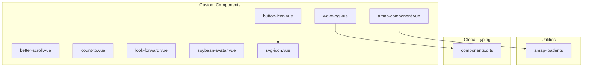
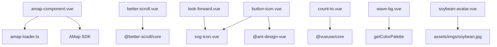
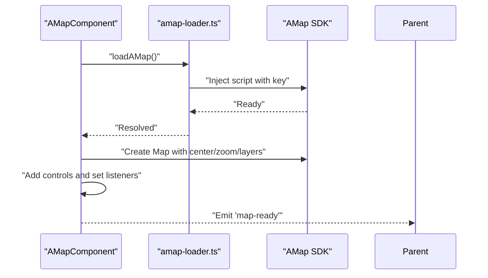
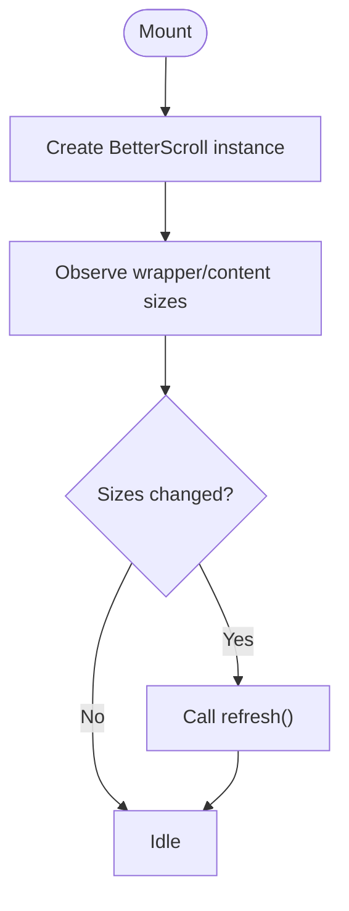
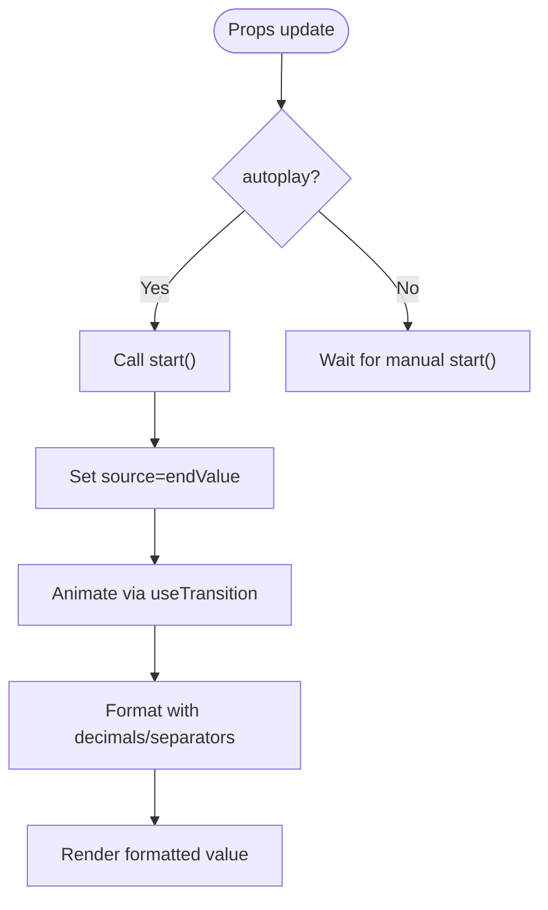
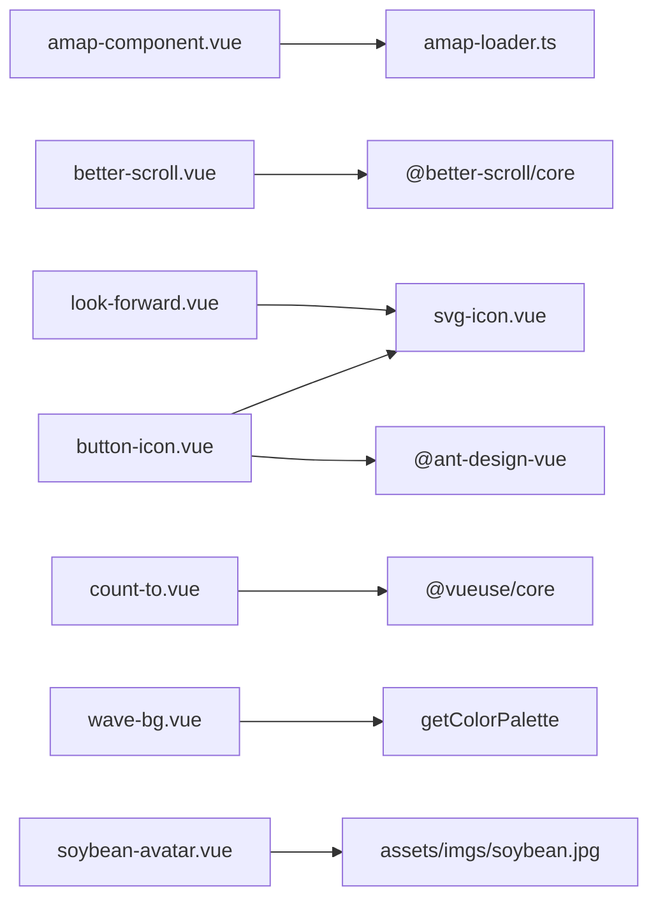

# Custom Components

<cite>
**Referenced Files in This Document**
- [amap-component.vue](file://admin-web-soybean/src/components/custom/amap-component.vue)
- [better-scroll.vue](file://admin-web-soybean/src/components/custom/better-scroll.vue)
- [button-icon.vue](file://admin-web-soybean/src/components/custom/button-icon.vue)
- [count-to.vue](file://admin-web-soybean/src/components/custom/count-to.vue)
- [look-forward.vue](file://admin-web-soybean/src/components/custom/look-forward.vue)
- [soybean-avatar.vue](file://admin-web-soybean/src/components/custom/soybean-avatar.vue)
- [svg-icon.vue](file://admin-web-soybean/src/components/custom/svg-icon.vue)
- [wave-bg.vue](file://admin-web-soybean/src/components/custom/wave-bg.vue)
- [amap-loader.ts](file://admin-web-soybean/src/utils/amap-loader.ts)
- [components.d.ts](file://admin-web-soybean/typings/components.d.ts)
- [index.vue](file://admin-web-soybean/src/views/point/list/index.vue)
- [index.vue](file://admin-web-soybean/src/views/point/map/index.vue)
</cite>

## Table of Contents
1. [Introduction](#introduction)
2. [Project Structure](#project-structure)
3. [Core Components](#core-components)
4. [Architecture Overview](#architecture-overview)
5. [Detailed Component Analysis](#detailed-component-analysis)
6. [Dependency Analysis](#dependency-analysis)
7. [Performance Considerations](#performance-considerations)
8. [Troubleshooting Guide](#troubleshooting-guide)
9. [Conclusion](#conclusion)
10. [Appendices](#appendices)

## Introduction
This document describes the custom component library used in the admin-web-soybean frontend. It focuses on eight specialized components: AMap component for map integration, BetterScroll for enhanced scrolling, ButtonIcon for icon-button combinations, CountTo for animated number displays, LookForward for interactive elements, SoybeanAvatar for user avatars, SVGIcon for scalable vector graphics, and WaveBg for animated backgrounds. For each component, we document the API, configuration options, events, integration patterns, examples, prop validation, and performance optimization techniques. We also cover component composition, styling approaches, and responsive design considerations.

## Project Structure
The custom components live under the custom folder and are globally typed for TypeScript support. They integrate with Ant Design Vue and Iconify for icons, and leverage external libraries such as BetterScroll and AMap SDK.

**Diagram sources**
- [amap-component.vue:1-388](file://admin-web-soybean/src/components/custom/amap-component.vue#L1-L388)
- [better-scroll.vue:1-54](file://admin-web-soybean/src/components/custom/better-scroll.vue#L1-L54)
- [button-icon.vue:1-50](file://admin-web-soybean/src/components/custom/button-icon.vue#L1-L50)
- [count-to.vue:1-89](file://admin-web-soybean/src/components/custom/count-to.vue#L1-L89)
- [look-forward.vue:1-21](file://admin-web-soybean/src/components/custom/look-forward.vue#L1-L21)
- [soybean-avatar.vue:1-14](file://admin-web-soybean/src/components/custom/soybean-avatar.vue#L1-L14)
- [svg-icon.vue:1-55](file://admin-web-soybean/src/components/custom/svg-icon.vue#L1-L55)
- [wave-bg.vue:1-60](file://admin-web-soybean/src/components/custom/wave-bg.vue#L1-L60)
- [amap-loader.ts:1-103](file://admin-web-soybean/src/utils/amap-loader.ts#L1-L103)
- [components.d.ts:149-173](file://admin-web-soybean/typings/components.d.ts#L149-L173)

**Section sources**
- [components.d.ts:149-173](file://admin-web-soybean/typings/components.d.ts#L149-L173)

## Core Components
Below is a concise overview of each component’s purpose and primary capabilities.

- AMap component: Renders a satellite-style map with point markers, clustering, and click interactions. Exposes lifecycle and rendering helpers.
- BetterScroll: A wrapper around BetterScroll core to enable smooth, customizable scrolling with automatic sizing adjustments.
- ButtonIcon: A styled icon button with optional tooltips and flexible slot content, backed by SvgIcon.
- CountTo: An animated counter with easing, formatting, and configurable transitions.
- LookForward: A placeholder layout component with an expectation icon and optional slot content.
- SoybeanAvatar: A fixed avatar image container for branding.
- SVGIcon: A flexible icon renderer supporting both Iconify and local SVG symbols.
- WaveBg: A decorative animated background using gradient-filled SVG waves.

**Section sources**
- [amap-component.vue:1-388](file://admin-web-soybean/src/components/custom/amap-component.vue#L1-L388)
- [better-scroll.vue:1-54](file://admin-web-soybean/src/components/custom/better-scroll.vue#L1-L54)
- [button-icon.vue:1-50](file://admin-web-soybean/src/components/custom/button-icon.vue#L1-L50)
- [count-to.vue:1-89](file://admin-web-soybean/src/components/custom/count-to.vue#L1-L89)
- [look-forward.vue:1-21](file://admin-web-soybean/src/components/custom/look-forward.vue#L1-L21)
- [soybean-avatar.vue:1-14](file://admin-web-soybean/src/components/custom/soybean-avatar.vue#L1-L14)
- [svg-icon.vue:1-55](file://admin-web-soybean/src/components/custom/svg-icon.vue#L1-L55)
- [wave-bg.vue:1-60](file://admin-web-soybean/src/components/custom/wave-bg.vue#L1-L60)

## Architecture Overview
The components are designed to be self-contained and composable. Some components depend on external utilities (e.g., AMap loader), while others rely on shared UI primitives (e.g., SvgIcon, Ant Design Vue).

**Diagram sources**
- [amap-component.vue:1-388](file://admin-web-soybean/src/components/custom/amap-component.vue#L1-L388)
- [amap-loader.ts:1-103](file://admin-web-soybean/src/utils/amap-loader.ts#L1-L103)
- [better-scroll.vue:1-54](file://admin-web-soybean/src/components/custom/better-scroll.vue#L1-L54)
- [button-icon.vue:1-50](file://admin-web-soybean/src/components/custom/button-icon.vue#L1-L50)
- [svg-icon.vue:1-55](file://admin-web-soybean/src/components/custom/svg-icon.vue#L1-L55)
- [count-to.vue:1-89](file://admin-web-soybean/src/components/custom/count-to.vue#L1-L89)
- [look-forward.vue:1-21](file://admin-web-soybean/src/components/custom/look-forward.vue#L1-L21)
- [soybean-avatar.vue:1-14](file://admin-web-soybean/src/components/custom/soybean-avatar.vue#L1-L14)
- [wave-bg.vue:1-60](file://admin-web-soybean/src/components/custom/wave-bg.vue#L1-L60)

## Detailed Component Analysis

### AMap Component
Purpose: Render a satellite map, place point markers with status colors, show info windows, and support clustering and click interactions.

Key API
- Props
  - points: array of point markers with id, name, longitude, latitude, optional status and extra fields
  - center: initial map center coordinates
  - zoom: initial zoom level
  - enableCluster: whether to enable clustering for large datasets
- Emits
  - marker-click: emits clicked point data
  - map-click: emits lng/lat of clicked map location
  - map-ready: emits the underlying map instance
- Methods (exposed via defineExpose)
  - fitView(): adjust viewport to fit all markers
  - getMap(): returns the map instance
- Events
  - Click on map fires map-click
  - Click on marker opens info window and emits marker-click

Implementation highlights
- Dynamically loads AMap SDK via a dedicated loader utility and applies security configuration
- Creates a 3D satellite-style map with scale, toolbar, and map type controls
- Renders markers with custom SVG icons colored by status
- Supports marker clustering for performance with large datasets
- Handles loading and error states with retry capability

Usage example
- Import the component and pass an array of points with coordinates and status
- Listen to marker-click and map-click to integrate with selection and navigation logic
- Call fitView() to center the map on all points

Prop validation
- Validates presence of container and AMap availability before initialization
- Skips rendering markers when coordinates are missing

Performance tips
- Enable clustering for datasets larger than a threshold
- Destroy the map instance on unmount to free memory
- Debounce or batch updates when props.points changes frequently

**Section sources**
- [amap-component.vue:1-388](file://admin-web-soybean/src/components/custom/amap-component.vue#L1-L388)
- [amap-loader.ts:1-103](file://admin-web-soybean/src/utils/amap-loader.ts#L1-L103)

#### AMap Initialization Flow

**Diagram sources**
- [amap-component.vue:86-164](file://admin-web-soybean/src/components/custom/amap-component.vue#L86-L164)
- [amap-loader.ts:20-75](file://admin-web-soybean/src/utils/amap-loader.ts#L20-L75)

### BetterScroll
Purpose: Provide a wrapper around BetterScroll core to enable smooth scrolling with automatic size refresh.

Key API
- Props
  - options: BetterScroll options object controlling scroll direction, momentum, bounce, etc.
- Slots
  - default slot for scrollable content
- Exposed instance
  - instance: the BetterScroll instance for programmatic control

Implementation highlights
- Uses VueUse to track wrapper and content sizes
- Automatically refreshes BetterScroll when sizes change
- Initializes BetterScroll on mount

Usage example
- Wrap scrollable content inside BetterScroll and pass scroll options
- Use the exposed instance to refresh or manipulate scroll behavior

Prop validation
- Requires a valid wrapper element to instantiate BetterScroll

Performance tips
- Prefer virtualization for very long lists
- Avoid frequent re-initialization; rely on refresh()

**Section sources**
- [better-scroll.vue:1-54](file://admin-web-soybean/src/components/custom/better-scroll.vue#L1-L54)

#### BetterScroll Refresh Flow

**Diagram sources**
- [better-scroll.vue:28-40](file://admin-web-soybean/src/components/custom/better-scroll.vue#L28-L40)
- [better-scroll.vue:34-36](file://admin-web-soybean/src/components/custom/better-scroll.vue#L34-L36)

### ButtonIcon
Purpose: A text-styled button with an icon and optional tooltip, integrating SvgIcon for flexible icon rendering.

Key API
- Props
  - class: additional button classes
  - icon: Iconify icon name
  - tooltipContent: tooltip text
  - tooltipPlacement: tooltip placement
  - triggerParent: attach tooltip to parent element
- Slots
  - default slot to override icon rendering
- Attributes
  - Inherits non-prop attributes to the button

Implementation highlights
- Uses Tailwind merge to combine default and custom classes
- Integrates ATooltip and AButton from Ant Design Vue
- Delegates icon rendering to SvgIcon

Usage example
- Place ButtonIcon inside toolbars or action bars
- Pass icon and tooltipContent for discoverability

Styling approach
- Defaults to a fixed icon button size and centered layout
- Supports custom classes via the class prop

**Section sources**
- [button-icon.vue:1-50](file://admin-web-soybean/src/components/custom/button-icon.vue#L1-L50)
- [svg-icon.vue:1-55](file://admin-web-soybean/src/components/custom/svg-icon.vue#L1-L55)

### CountTo
Purpose: Animate numeric transitions with easing, formatting, and configurable units.

Key API
- Props
  - startValue, endValue, duration, autoplay
  - decimals, prefix, suffix, separator, decimal
  - useEasing, transition (from TransitionPresets)
- Methods
  - start(): programmatically trigger animation

Implementation highlights
- Uses @vueuse/core transitions for smooth animations
- Formats numbers with thousands separators, decimals, and custom prefix/suffix
- Watches prop changes and auto-starts animation when autoplay is enabled

Usage example
- Display KPIs, counters, or metrics with smooth transitions
- Combine with autoplay off and manual start() for user-triggered animations

**Section sources**
- [count-to.vue:1-89](file://admin-web-soybean/src/components/custom/count-to.vue#L1-L89)

#### CountTo Animation Flow

**Diagram sources**
- [count-to.vue:68-81](file://admin-web-soybean/src/components/custom/count-to.vue#L68-L81)
- [count-to.vue:49-66](file://admin-web-soybean/src/components/custom/count-to.vue#L49-L66)

### LookForward
Purpose: A placeholder layout component with an expectation icon and optional slot content.

Key API
- Slots
  - default slot to customize the message or actions

Implementation highlights
- Uses SvgIcon with a local expectation icon
- Provides a centered layout suitable for empty or future states

Usage example
- Show “coming soon” or “feature under construction” placeholders
- Compose with buttons or links for user guidance

**Section sources**
- [look-forward.vue:1-21](file://admin-web-soybean/src/components/custom/look-forward.vue#L1-L21)
- [svg-icon.vue:1-55](file://admin-web-soybean/src/components/custom/svg-icon.vue#L1-L55)

### SoybeanAvatar
Purpose: A branded avatar image container.

Key API
- No props; renders a fixed-size circular image

Implementation highlights
- Fixed size and rounded corners
- Uses a local asset for the avatar image

Usage example
- Display user avatars in profiles or menus
- Replace the asset for different branding

**Section sources**
- [soybean-avatar.vue:1-14](file://admin-web-soybean/src/components/custom/soybean-avatar.vue#L1-L14)

### SVGIcon
Purpose: Flexible icon renderer supporting both Iconify and local SVG symbols.

Key API
- Props
  - icon: Iconify icon name
  - localIcon: Local SVG symbol name
- Behavior
  - If localIcon is provided or icon is absent, renders local SVG via symbol
  - Otherwise renders Iconify icon
  - Inherits class/style via attrs

Implementation highlights
- Reads a local icon prefix from environment
- Binds attributes to the rendered SVG element

Usage example
- Use localIcon for internal icons and icon for third-party icons
- Apply consistent sizing and coloring via inherited classes

**Section sources**
- [svg-icon.vue:1-55](file://admin-web-soybean/src/components/custom/svg-icon.vue#L1-L55)

### WaveBg
Purpose: Decorative animated background using gradient-filled SVG waves.

Key API
- Props
  - themeColor: base theme color used to compute palette variants

Implementation highlights
- Computes light and dark palette variants from the theme color
- Renders two large SVG waves positioned absolutely behind content
- Responsive positioning via media queries

Usage example
- Apply as a background layer in landing or onboarding screens
- Pair with themed content for cohesive visuals

**Section sources**
- [wave-bg.vue:1-60](file://admin-web-soybean/src/components/custom/wave-bg.vue#L1-L60)

## Dependency Analysis
The components have minimal coupling and rely on shared utilities and UI libraries.

**Diagram sources**
- [amap-component.vue:1-388](file://admin-web-soybean/src/components/custom/amap-component.vue#L1-L388)
- [amap-loader.ts:1-103](file://admin-web-soybean/src/utils/amap-loader.ts#L1-L103)
- [better-scroll.vue:1-54](file://admin-web-soybean/src/components/custom/better-scroll.vue#L1-L54)
- [button-icon.vue:1-50](file://admin-web-soybean/src/components/custom/button-icon.vue#L1-L50)
- [svg-icon.vue:1-55](file://admin-web-soybean/src/components/custom/svg-icon.vue#L1-L55)
- [count-to.vue:1-89](file://admin-web-soybean/src/components/custom/count-to.vue#L1-L89)
- [look-forward.vue:1-21](file://admin-web-soybean/src/components/custom/look-forward.vue#L1-L21)
- [soybean-avatar.vue:1-14](file://admin-web-soybean/src/components/custom/soybean-avatar.vue#L1-L14)
- [wave-bg.vue:1-60](file://admin-web-soybean/src/components/custom/wave-bg.vue#L1-L60)

**Section sources**
- [components.d.ts:149-173](file://admin-web-soybean/typings/components.d.ts#L149-L173)

## Performance Considerations
- AMap
  - Enable clustering for large datasets to reduce DOM nodes and improve rendering performance
  - Destroy the map instance on unmount to prevent memory leaks
  - Debounce or batch updates to props.points to avoid frequent re-renders
- BetterScroll
  - Rely on automatic refresh triggered by size watchers; avoid manual refresh unless necessary
  - For very long lists, consider virtualization strategies outside the component
- ButtonIcon
  - Keep tooltip content concise; avoid heavy DOM in tooltip containers
- CountTo
  - Limit frequent prop changes; throttle updates if animating many counters simultaneously
  - Choose appropriate easing and duration to balance smoothness and responsiveness
- LookForward
  - Keep default slot minimal to avoid layout thrashing
- SoybeanAvatar
  - Preload or lazy-load avatar images appropriately
- SVGIcon
  - Prefer local SVG symbols for frequently used icons to reduce network requests
- WaveBg
  - Keep gradients simple; avoid excessive SVG complexity for low-end devices

## Troubleshooting Guide
- AMap component
  - If the map does not render, verify the container element exists and AMap SDK is loaded
  - Check for API key validity and network connectivity
  - Use the retry mechanism to recover from transient failures
- BetterScroll
  - If scrolling does not work, ensure the wrapper element is visible and has dimensions
  - Confirm that the content inside the component has explicit sizing
- ButtonIcon
  - If tooltips do not appear, verify tooltip placement and popup container settings
- CountTo
  - If animation does not start, ensure autoplay is enabled or call start() manually
- LookForward
  - If the layout appears misaligned, adjust slot content or container classes
- SoybeanAvatar
  - If the image does not show, confirm the asset path is correct
- SVGIcon
  - If icons do not render, check the icon/localIcon props and environment prefix
- WaveBg
  - If waves are not visible, verify themeColor and palette computation

**Section sources**
- [amap-component.vue:86-164](file://admin-web-soybean/src/components/custom/amap-component.vue#L86-L164)
- [amap-loader.ts:20-75](file://admin-web-soybean/src/utils/amap-loader.ts#L20-L75)
- [better-scroll.vue:28-40](file://admin-web-soybean/src/components/custom/better-scroll.vue#L28-L40)
- [button-icon.vue:30-32](file://admin-web-soybean/src/components/custom/button-icon.vue#L30-L32)
- [count-to.vue:68-81](file://admin-web-soybean/src/components/custom/count-to.vue#L68-L81)
- [svg-icon.vue:29-41](file://admin-web-soybean/src/components/custom/svg-icon.vue#L29-L41)
- [wave-bg.vue:12-13](file://admin-web-soybean/src/components/custom/wave-bg.vue#L12-L13)

## Conclusion
The custom component library provides robust, reusable UI building blocks tailored for maps, scrolling, icons, counters, placeholders, avatars, and decorative backgrounds. By leveraging typed globals, shared utilities, and established UI libraries, these components offer predictable APIs, strong composability, and practical performance strategies. Integrating them into real-world scenarios requires careful attention to prop validation, event handling, and responsive design.

## Appendices

### Real-World Usage Scenarios
- AMap component
  - Point list view: render points on a map and allow selection via marker clicks
  - Map view: display survey locations with status-based markers and clustering
- BetterScroll
  - Long dropdowns or sidebars requiring smooth scrolling
- ButtonIcon
  - Toolbar actions with tooltips and icon-only presentation
- CountTo
  - Dashboard metrics with animated transitions
- LookForward
  - Feature placeholders and onboarding messaging
- SoybeanAvatar
  - User profile and navigation menus
- SVGIcon
  - Unified icon system across the application
- WaveBg
  - Landing page or onboarding backgrounds

**Section sources**
- [index.vue:285-290](file://admin-web-soybean/src/views/point/list/index.vue#L285-L290)
- [index.vue:15-20](file://admin-web-soybean/src/views/point/map/index.vue#L15-L20)
- [button-icon.vue:1-50](file://admin-web-soybean/src/components/custom/button-icon.vue#L1-L50)
- [svg-icon.vue:1-55](file://admin-web-soybean/src/components/custom/svg-icon.vue#L1-L55)
- [count-to.vue:1-89](file://admin-web-soybean/src/components/custom/count-to.vue#L1-L89)
- [look-forward.vue:1-21](file://admin-web-soybean/src/components/custom/look-forward.vue#L1-L21)
- [soybean-avatar.vue:1-14](file://admin-web-soybean/src/components/custom/soybean-avatar.vue#L1-L14)
- [wave-bg.vue:1-60](file://admin-web-soybean/src/components/custom/wave-bg.vue#L1-L60)