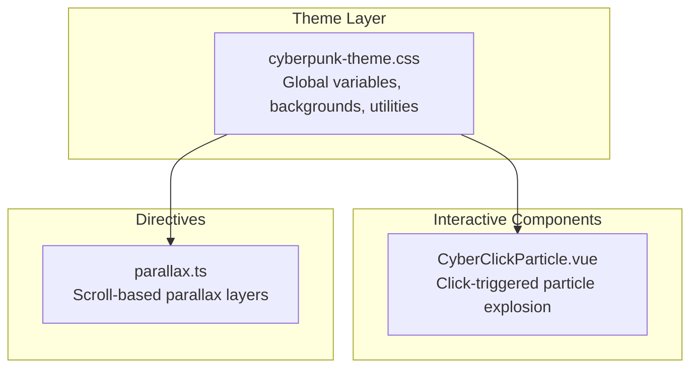
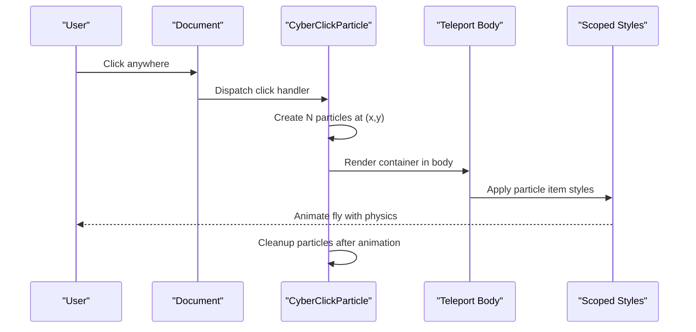
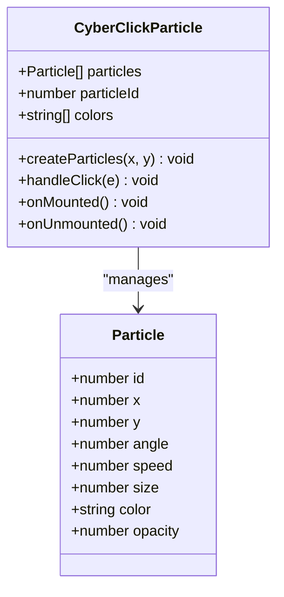
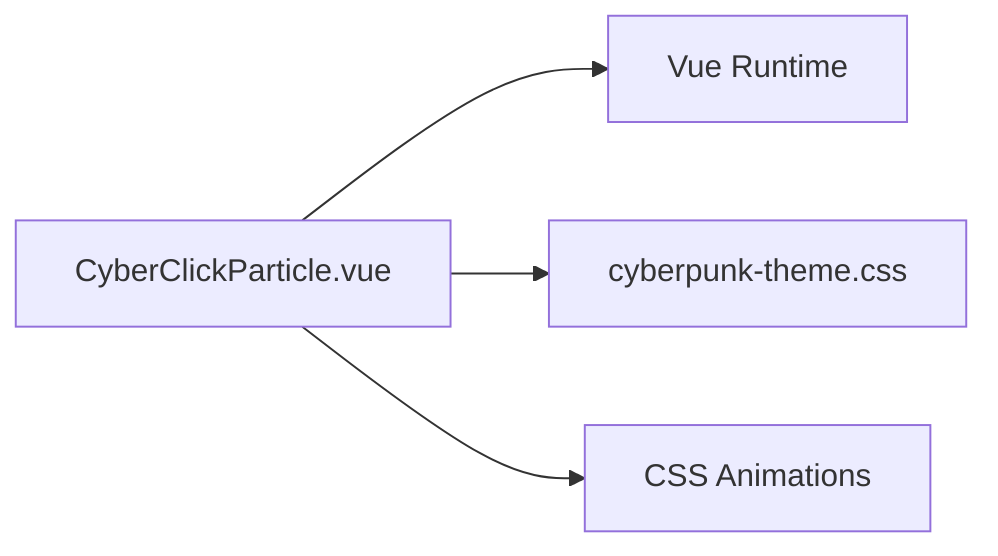

# Cyber Components

<cite>
**Referenced Files in This Document**
- [CyberClickParticle.vue](file://admin-web-soybean/src/components/cyber/CyberClickParticle.vue)
- [cyberpunk-theme.css](file://admin-web-soybean/src/styles/css/cyberpunk-theme.css)
- [CYBERPUNK-UI-GUIDE.md](file://admin-web-soybean/CYBERPUNK-UI-GUIDE.md)
- [parallax.ts](file://admin-web-soybean/src/directives/parallax.ts)
</cite>

## Table of Contents
1. [Introduction](#introduction)
2. [Project Structure](#project-structure)
3. [Core Components](#core-components)
4. [Architecture Overview](#architecture-overview)
5. [Detailed Component Analysis](#detailed-component-analysis)
6. [Dependency Analysis](#dependency-analysis)
7. [Performance Considerations](#performance-considerations)
8. [Troubleshooting Guide](#troubleshooting-guide)
9. [Conclusion](#conclusion)
10. [Appendices](#appendices)

## Introduction
This document provides comprehensive documentation for the cyber-themed component system, with a focus on the CyberClickParticle component. It explains configuration options for particle behavior, visual styling, and animation parameters; describes integration patterns, performance optimization strategies, and browser compatibility considerations; and offers practical examples for customization, event-driven activation, and responsive behavior. It also covers lifecycle management, memory optimization, accessibility features, and guidelines for creating similar cyber-themed components that integrate with the overall design system.

## Project Structure
The cyber-themed UI system is organized around a cohesive theme and a small set of interactive components and directives:
- Theme CSS defines global variables, backgrounds, animations, and reusable utilities.
- The CyberClickParticle component provides interactive particle effects on click events.
- The parallax directive adds scroll-based depth effects.

**Diagram sources**
- [cyberpunk-theme.css:1-709](file://admin-web-soybean/src/styles/css/cyberpunk-theme.css#L1-L709)
- [CyberClickParticle.vue:1-133](file://admin-web-soybean/src/components/cyber/CyberClickParticle.vue#L1-L133)
- [parallax.ts:1-56](file://admin-web-soybean/src/directives/parallax.ts#L1-L56)

**Section sources**
- [CYBERPUNK-UI-GUIDE.md:20-31](file://admin-web-soybean/CYBERPUNK-UI-GUIDE.md#L20-L31)
- [cyberpunk-theme.css:1-74](file://admin-web-soybean/src/styles/css/cyberpunk-theme.css#L1-L74)

## Core Components
- CyberClickParticle: A Vue component that listens to global click events and renders a burst of animated particles at the click coordinates. Particles are ephemeral and cleaned up automatically after animation completes.
- Theme CSS: Provides global variables, background patterns, and motion primitives used by components and directives.
- Parallax Directive: Adds scroll-triggered movement to DOM nodes for depth effects.

Key integration points:
- Register the component and directive in the application entry.
- Apply the cyber background class to the root layout to enable grid and scanline effects.
- Use the component inside the root layout to render particle overlays.

**Section sources**
- [CYBERPUNK-UI-GUIDE.md:33-66](file://admin-web-soybean/CYBERPUNK-UI-GUIDE.md#L33-L66)
- [CyberClickParticle.vue:50-56](file://admin-web-soybean/src/components/cyber/CyberClickParticle.vue#L50-L56)
- [cyberpunk-theme.css:79-123](file://admin-web-soybean/src/styles/css/cyberpunk-theme.css#L79-L123)

## Architecture Overview
The cyber component system follows a layered approach:
- Theme layer: CSS variables and animations define the visual identity and motion vocabulary.
- Component layer: Vue components encapsulate interactive behaviors (e.g., particle explosions).
- Directive layer: Scroll-aware behaviors (e.g., parallax) enhance depth perception.

**Diagram sources**
- [CyberClickParticle.vue:46-56](file://admin-web-soybean/src/components/cyber/CyberClickParticle.vue#L46-L56)
- [CyberClickParticle.vue:59-78](file://admin-web-soybean/src/components/cyber/CyberClickParticle.vue#L59-L78)
- [CyberClickParticle.vue:97-131](file://admin-web-soybean/src/components/cyber/CyberClickParticle.vue#L97-L131)

## Detailed Component Analysis

### CyberClickParticle Component
CyberClickParticle is a self-contained Vue component that:
- Listens to global click events during mount and removes listeners on unmount.
- Generates a burst of particles at the click location with randomized angles, speeds, sizes, and colors.
- Renders each particle as an absolutely positioned element with CSS animations.
- Cleans up finished particles after a short delay.

**Diagram sources**
- [CyberClickParticle.vue:4-18](file://admin-web-soybean/src/components/cyber/CyberClickParticle.vue#L4-L18)
- [CyberClickParticle.vue:20-44](file://admin-web-soybean/src/components/cyber/CyberClickParticle.vue#L20-L44)
- [CyberClickParticle.vue:46-56](file://admin-web-soybean/src/components/cyber/CyberClickParticle.vue#L46-L56)

Behavioral highlights:
- Event-driven activation: A single global click listener triggers particle bursts.
- Physics-based animation: Particles move radially outward using trigonometric calculations driven by CSS custom properties.
- Fallback support: Uses a fallback animation when advanced CSS transforms are unsupported.
- Cleanup: Removes particles from state after animation completes to prevent memory accumulation.

Configuration options:
- Colors: Predefined palette influences particle color selection.
- Count: Randomized number of particles per burst.
- Size: Randomized radius per particle.
- Speed: Randomized travel distance per particle.
- Angle: Evenly distributed around the burst circle.

Visual styling:
- Particles are rendered as circles with rounded corners and a short-duration easing animation.
- The container is fixed and covers the viewport, ensuring particles appear above page content.

Animation parameters:
- Duration: 0.6 seconds.
- Easing: ease-out.
- Scaling: particles shrink to zero at the end of the animation.
- Opacity: fades out alongside scaling.

Lifecycle management:
- Mount: attaches a click listener to the document.
- Unmount: detaches the listener to prevent leaks.
- Cleanup: filters out finished particles after a timeout.

Accessibility considerations:
- Pointer events are disabled on the container to avoid interfering with page interactions.
- No forced motion defaults are enforced; users can disable animations globally if needed.

Browser compatibility:
- Uses CSS custom properties for angle and speed to drive transforms.
- Includes a fallback animation when advanced transform syntax is not supported.
- Backdrop-filter is used in other parts of the theme; vendor prefixes are handled in theme CSS.

Responsive behavior:
- Particles are positioned absolutely at client coordinates, so they adapt to viewport size and zoom level.
- Animation duration and easing remain consistent across devices.

Integration patterns:
- Place the component inside a root layout that applies the cyber background class.
- Register the component globally or locally as needed.
- Combine with other cyber effects (e.g., glow utilities) for a cohesive look.

**Section sources**
- [CyberClickParticle.vue:1-133](file://admin-web-soybean/src/components/cyber/CyberClickParticle.vue#L1-L133)
- [CYBERPUNK-UI-GUIDE.md:214-221](file://admin-web-soybean/CYBERPUNK-UI-GUIDE.md#L214-L221)

### Theme CSS and Utilities
The theme CSS provides:
- Global variables for colors, gradients, blur effects, and transitions.
- Background patterns (grid and scanline) for the cyber aesthetic.
- Motion primitives (e.g., breathing buttons, loader slides, spinner rotations).
- Utility classes for glow effects, gradients, and hover lifts.

These utilities complement the CyberClickParticle component by establishing a consistent visual language and motion vocabulary.

**Section sources**
- [cyberpunk-theme.css:10-74](file://admin-web-soybean/src/styles/css/cyberpunk-theme.css#L10-L74)
- [cyberpunk-theme.css:79-123](file://admin-web-soybean/src/styles/css/cyberpunk-theme.css#L79-L123)
- [cyberpunk-theme.css:212-229](file://admin-web-soybean/src/styles/css/cyberpunk-theme.css#L212-L229)
- [cyberpunk-theme.css:536-573](file://admin-web-soybean/src/styles/css/cyberpunk-theme.css#L536-L573)

### Parallax Directive
The parallax directive enables scroll-based depth effects:
- Tracks elements and their scroll speed.
- Applies transform-based vertical displacement during scroll.
- Uses passive scroll listeners and will-change hints for smoothness.

Integration with CyberClickParticle:
- While parallax enhances depth, it does not conflict with particle rendering.
- Both rely on CSS transforms and are designed to coexist.

**Section sources**
- [parallax.ts:1-56](file://admin-web-soybean/src/directives/parallax.ts#L1-L56)
- [cyberpunk-theme.css:601-612](file://admin-web-soybean/src/styles/css/cyberpunk-theme.css#L601-L612)

## Dependency Analysis
The CyberClickParticle component depends on:
- Vue runtime (refs, lifecycle hooks, Teleport).
- Scoped styles for positioning and animation.
- Theme CSS for color tokens and motion timing.

**Diagram sources**
- [CyberClickParticle.vue:1-56](file://admin-web-soybean/src/components/cyber/CyberClickParticle.vue#L1-L56)
- [cyberpunk-theme.css:10-74](file://admin-web-soybean/src/styles/css/cyberpunk-theme.css#L10-L74)

**Section sources**
- [CyberClickParticle.vue:1-56](file://admin-web-soybean/src/components/cyber/CyberClickParticle.vue#L1-L56)
- [CYBERPUNK-UI-GUIDE.md:43-52](file://admin-web-soybean/CYBERPUNK-UI-GUIDE.md#L43-L52)

## Performance Considerations
- Particle burst count: The number of particles per click is randomized but bounded, reducing peak workload.
- Cleanup strategy: Finished particles are removed after animation, preventing long-term accumulation.
- CSS transforms: Using transforms for particle movement ensures GPU acceleration where supported.
- Passive scroll: The parallax directive uses passive scroll listeners to minimize layout thrashing.
- Motion preferences: Encourage users to reduce motion via OS/browser settings; provide a way to disable animations globally if needed.
- Device targeting: On low-end devices, consider disabling or limiting particle effects.

[No sources needed since this section provides general guidance]

## Troubleshooting Guide
Common issues and resolutions:
- Particles not appearing:
  - Ensure the component is placed inside a layout that applies the cyber background class.
  - Verify the component is registered and included in the root layout.
- Excessive CPU usage:
  - Limit particle bursts by adjusting counts or adding throttling logic.
  - Disable animations for users who prefer reduced motion.
- Animation glitches:
  - Confirm CSS custom property usage is supported; the component includes a fallback animation for older browsers.
- Interference with page interactions:
  - The container disables pointer events, but confirm no other overlays are capturing clicks unintentionally.

**Section sources**
- [CYBERPUNK-UI-GUIDE.md:256-261](file://admin-web-soybean/CYBERPUNK-UI-GUIDE.md#L256-L261)
- [CyberClickParticle.vue:81-89](file://admin-web-soybean/src/components/cyber/CyberClickParticle.vue#L81-L89)
- [CyberClickParticle.vue:108-131](file://admin-web-soybean/src/components/cyber/CyberClickParticle.vue#L108-L131)

## Conclusion
The CyberClickParticle component delivers an immersive, event-driven particle effect that integrates seamlessly with the cyber-themed design system. By leveraging CSS animations, scoped styles, and lifecycle hooks, it balances visual richness with performance. Combined with the theme’s color tokens, motion primitives, and utilities, it forms a cohesive cyber aesthetic suitable for modern web applications.

[No sources needed since this section summarizes without analyzing specific files]

## Appendices

### Practical Examples and Patterns
- Event-driven activation:
  - Place the component in the root layout and rely on the global click listener.
- Customization:
  - Adjust colors, sizes, and speeds by overriding theme variables or extending the component’s internal arrays.
- Responsive behavior:
  - Particles adapt to viewport size and zoom; keep animation durations reasonable for mobile devices.
- Accessibility:
  - Provide a user setting to disable animations; avoid relying solely on motion for critical UI feedback.

**Section sources**
- [CYBERPUNK-UI-GUIDE.md:214-221](file://admin-web-soybean/CYBERPUNK-UI-GUIDE.md#L214-L221)
- [CYBERPUNK-UI-GUIDE.md:256-261](file://admin-web-soybean/CYBERPUNK-UI-GUIDE.md#L256-L261)

### Creating Similar Cyber-Themed Components
Guidelines:
- Use theme CSS variables for consistent colors and motion timing.
- Prefer CSS animations and transforms for performance.
- Implement lifecycle cleanup to avoid memory leaks.
- Provide fallbacks for unsupported CSS features.
- Keep accessibility in mind by respecting user motion preferences.

**Section sources**
- [cyberpunk-theme.css:10-74](file://admin-web-soybean/src/styles/css/cyberpunk-theme.css#L10-L74)
- [CYBERPUNK-UI-GUIDE.md:256-261](file://admin-web-soybean/CYBERPUNK-UI-GUIDE.md#L256-L261)