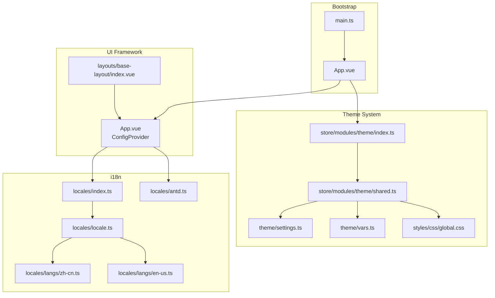
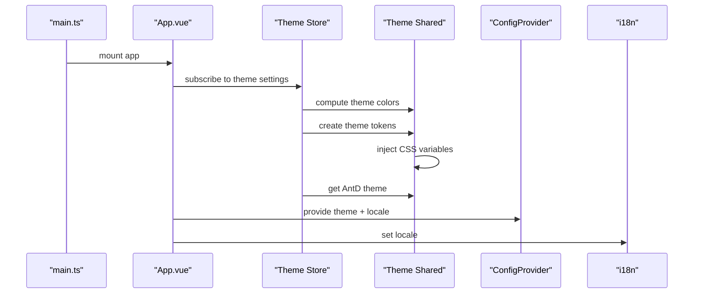
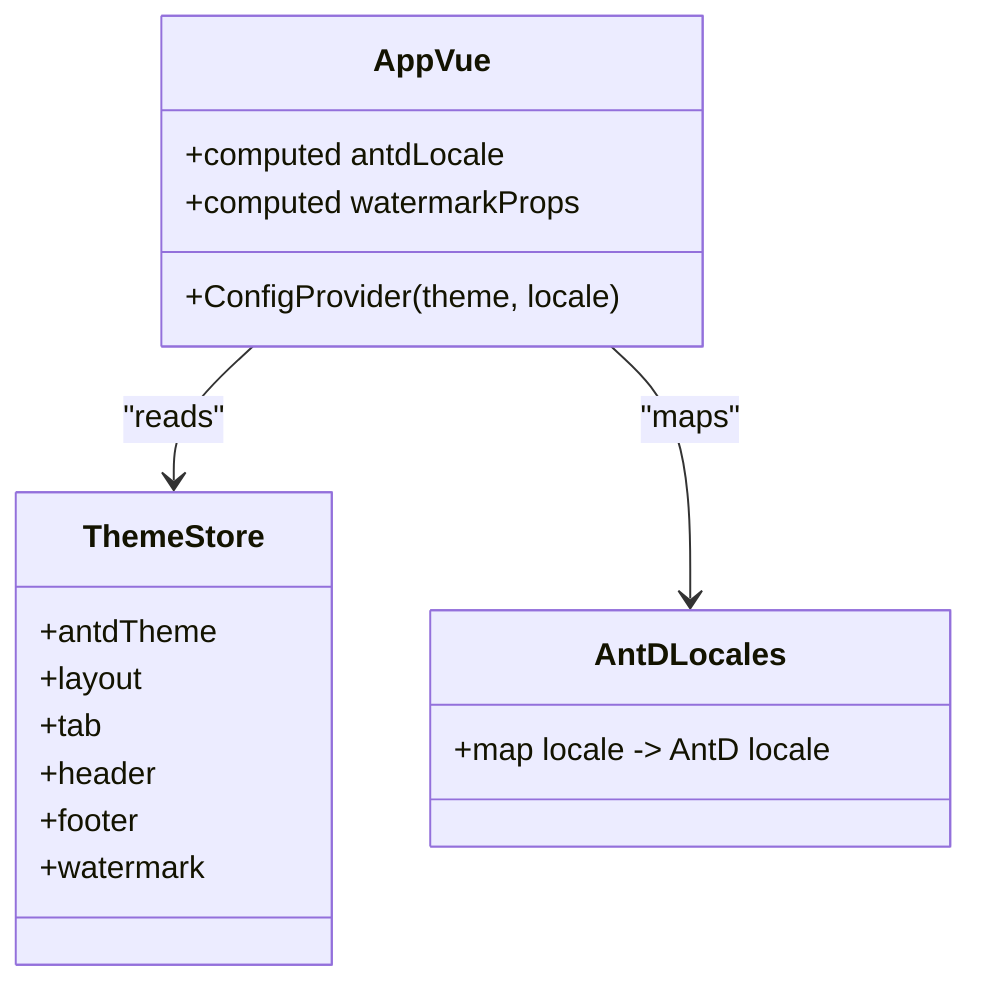
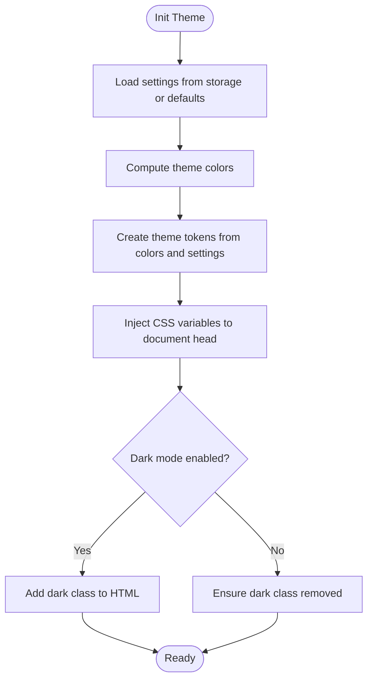
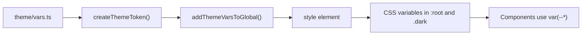
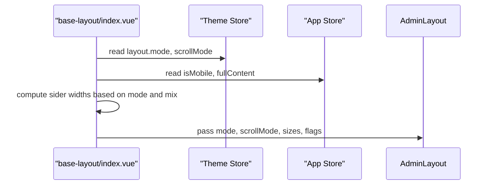
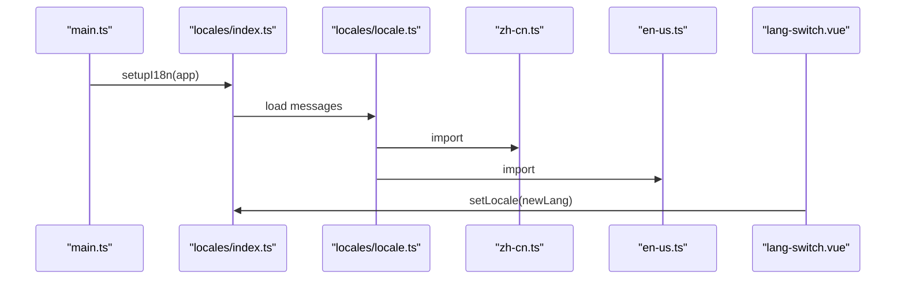
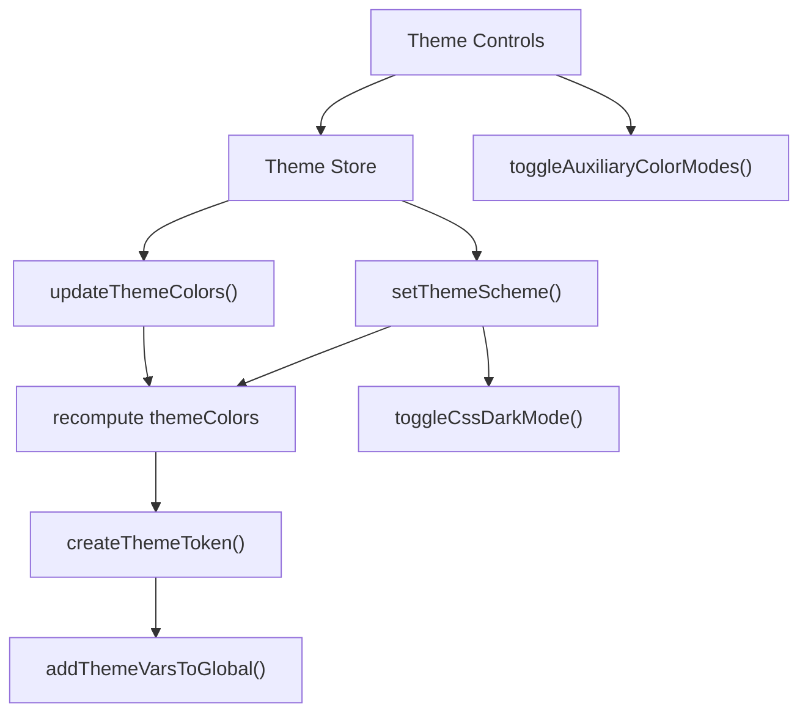
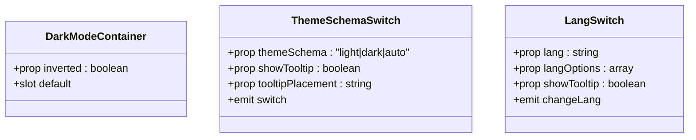
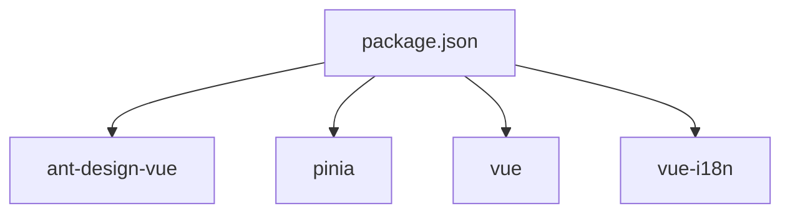

# Design Integration

<cite>
**Referenced Files in This Document**
- [main.ts](file://admin-web-soybean/src/main.ts)
- [App.vue](file://admin-web-soybean/src/App.vue)
- [index.vue](file://admin-web-soybean/src/layouts/base-layout/index.vue)
- [settings.ts](file://admin-web-soybean/src/theme/settings.ts)
- [vars.ts](file://admin-web-soybean/src/theme/vars.ts)
- [shared.ts](file://admin-web-soybean/src/store/modules/theme/shared.ts)
- [index.ts](file://admin-web-soybean/src/store/modules/theme/index.ts)
- [global.css](file://admin-web-soybean/src/styles/css/global.css)
- [index.ts](file://admin-web-soybean/src/locales/index.ts)
- [locale.ts](file://admin-web-soybean/src/locales/locale.ts)
- [zh-cn.ts](file://admin-web-soybean/src/locales/langs/zh-cn.ts)
- [en-us.ts](file://admin-web-soybean/src/locales/langs/en-us.ts)
- [antd.ts](file://admin-web-soybean/src/locales/antd.ts)
- [lang-switch.vue](file://admin-web-soybean/src/components/common/lang-switch.vue)
- [theme-schema-switch.vue](file://admin-web-soybean/src/components/common/theme-schema-switch.vue)
- [dark-mode-container.vue](file://admin-web-soybean/src/components/common/dark-mode-container.vue)
- [antd.d.ts](file://admin-web-soybean/src/typings/antd.d.ts)
- [package.json](file://admin-web-soybean/package.json)
</cite>

## Table of Contents
1. [Introduction](#introduction)
2. [Project Structure](#project-structure)
3. [Core Components](#core-components)
4. [Architecture Overview](#architecture-overview)
5. [Detailed Component Analysis](#detailed-component-analysis)
6. [Dependency Analysis](#dependency-analysis)
7. [Performance Considerations](#performance-considerations)
8. [Troubleshooting Guide](#troubleshooting-guide)
9. [Conclusion](#conclusion)

## Introduction
This document explains the design system integration and theming architecture of the admin frontend. It covers Ant Design Vue integration, custom theme configuration, design token management, global styling, CSS-in-JS patterns, responsive design, internationalization and locale-specific formatting, theme customization and color palette management, dark mode implementation, usage examples, component styling patterns, accessibility considerations, performance optimization, browser compatibility, and design consistency.

## Project Structure
The design system spans several layers:
- Application bootstrap and providers
- Theme store and token generation
- Ant Design Vue integration via ConfigProvider
- Internationalization setup with vue-i18n
- Global CSS variables and dark mode toggling
- Layout composition and responsive behavior

**Diagram sources**
- [main.ts:1-75](file://admin-web-soybean/src/main.ts#L1-L75)
- [App.vue:1-51](file://admin-web-soybean/src/App.vue#L1-L51)
- [index.ts:1-222](file://admin-web-soybean/src/store/modules/theme/index.ts#L1-L222)
- [shared.ts:1-233](file://admin-web-soybean/src/store/modules/theme/shared.ts#L1-L233)
- [settings.ts:1-87](file://admin-web-soybean/src/theme/settings.ts#L1-L87)
- [vars.ts:1-36](file://admin-web-soybean/src/theme/vars.ts#L1-L36)
- [global.css:1-77](file://admin-web-soybean/src/styles/css/global.css#L1-L77)
- [index.ts:1-27](file://admin-web-soybean/src/locales/index.ts#L1-L27)
- [locale.ts:1-10](file://admin-web-soybean/src/locales/locale.ts#L1-L10)
- [zh-cn.ts:1-513](file://admin-web-soybean/src/locales/langs/zh-cn.ts#L1-L513)
- [en-us.ts:1-512](file://admin-web-soybean/src/locales/langs/en-us.ts#L1-L512)
- [antd.ts](file://admin-web-soybean/src/locales/antd.ts)
- [index.vue:1-149](file://admin-web-soybean/src/layouts/base-layout/index.vue#L1-L149)

**Section sources**
- [main.ts:1-75](file://admin-web-soybean/src/main.ts#L1-L75)
- [App.vue:1-51](file://admin-web-soybean/src/App.vue#L1-L51)
- [index.vue:1-149](file://admin-web-soybean/src/layouts/base-layout/index.vue#L1-L149)

## Core Components
- Theme store: Manages theme settings, computes derived values (colors, dark mode), and applies CSS variables and Ant Design theme.
- Theme settings and tokens: Centralized theme defaults and token overrides.
- Ant Design Vue integration: ConfigProvider wraps the app and supplies theme and locale.
- Internationalization: vue-i18n setup with language switching and Ant Design locale mapping.
- Global CSS and CSS variables: Base design tokens and dark mode styles.

**Section sources**
- [index.ts:1-222](file://admin-web-soybean/src/store/modules/theme/index.ts#L1-L222)
- [shared.ts:1-233](file://admin-web-soybean/src/store/modules/theme/shared.ts#L1-L233)
- [settings.ts:1-87](file://admin-web-soybean/src/theme/settings.ts#L1-L87)
- [vars.ts:1-36](file://admin-web-soybean/src/theme/vars.ts#L1-L36)
- [App.vue:1-51](file://admin-web-soybean/src/App.vue#L1-L51)
- [index.ts:1-27](file://admin-web-soybean/src/locales/index.ts#L1-L27)

## Architecture Overview
The theming pipeline:
- Theme store initializes settings and watches reactive changes.
- Tokens are generated from theme colors and settings, then injected as CSS variables.
- Ant Design theme is computed and applied via ConfigProvider.
- Dark mode toggles a root HTML class to switch dark tokens.
- i18n drives both UI text and Ant Design component locale.

**Diagram sources**
- [main.ts:1-75](file://admin-web-soybean/src/main.ts#L1-L75)
- [App.vue:1-51](file://admin-web-soybean/src/App.vue#L1-L51)
- [index.ts:1-222](file://admin-web-soybean/src/store/modules/theme/index.ts#L1-L222)
- [shared.ts:1-233](file://admin-web-soybean/src/store/modules/theme/shared.ts#L1-L233)
- [index.ts:1-27](file://admin-web-soybean/src/locales/index.ts#L1-L27)

## Detailed Component Analysis

### Ant Design Vue Integration
- App wraps the application with ConfigProvider, passing computed AntD theme and Ant Design locale.
- AntD locale is selected based on the current UI locale.
- AntD component-level overrides are configured in the theme algorithm.

**Diagram sources**
- [App.vue:1-51](file://admin-web-soybean/src/App.vue#L1-L51)
- [index.ts:1-222](file://admin-web-soybean/src/store/modules/theme/index.ts#L1-L222)
- [antd.ts](file://admin-web-soybean/src/locales/antd.ts)

**Section sources**
- [App.vue:1-51](file://admin-web-soybean/src/App.vue#L1-L51)
- [shared.ts:207-232](file://admin-web-soybean/src/store/modules/theme/shared.ts#L207-L232)

### Custom Theme Configuration and Token Management
- Default theme settings define color palettes, layout modes, page animations, header/tab/footer sizes, and token maps for light/dark.
- Theme store computes derived theme colors and dark mode state.
- Tokens are generated from theme colors and merged with base tokens; CSS variables are injected into the document head.
- Dark mode toggles a root HTML class to activate dark token values.

**Diagram sources**
- [shared.ts:13-36](file://admin-web-soybean/src/store/modules/theme/shared.ts#L13-L36)
- [shared.ts:45-80](file://admin-web-soybean/src/store/modules/theme/shared.ts#L45-L80)
- [shared.ts:146-171](file://admin-web-soybean/src/store/modules/theme/shared.ts#L146-L171)
- [shared.ts:178-186](file://admin-web-soybean/src/store/modules/theme/shared.ts#L178-L186)
- [settings.ts:1-87](file://admin-web-soybean/src/theme/settings.ts#L1-L87)

**Section sources**
- [settings.ts:1-87](file://admin-web-soybean/src/theme/settings.ts#L1-L87)
- [vars.ts:1-36](file://admin-web-soybean/src/theme/vars.ts#L1-L36)
- [shared.ts:1-233](file://admin-web-soybean/src/store/modules/theme/shared.ts#L1-L233)
- [index.ts:1-222](file://admin-web-soybean/src/store/modules/theme/index.ts#L1-L222)

### Global Styling Approach and CSS-in-JS Patterns
- Global CSS defines base typography, color tokens, and glass panel utilities.
- CSS variables are dynamically generated from theme tokens and injected at runtime.
- Dark mode switches a root HTML class to apply dark token values.

**Diagram sources**
- [vars.ts:1-36](file://admin-web-soybean/src/theme/vars.ts#L1-L36)
- [shared.ts:45-80](file://admin-web-soybean/src/store/modules/theme/shared.ts#L45-L80)
- [shared.ts:146-171](file://admin-web-soybean/src/store/modules/theme/shared.ts#L146-L171)
- [global.css:1-77](file://admin-web-soybean/src/styles/css/global.css#L1-L77)

**Section sources**
- [global.css:1-77](file://admin-web-soybean/src/styles/css/global.css#L1-L77)
- [shared.ts:146-171](file://admin-web-soybean/src/store/modules/theme/shared.ts#L146-L171)

### Responsive Design Implementation
- Layout composes AdminLayout with mode, scroll mode, mobile flag, fixed header/tab, and configurable dimensions.
- Scroll behavior is controlled via layout scroll mode and a dedicated scroll element ID.
- Sider widths and collapsed widths adapt to layout modes and mix configurations.

**Diagram sources**
- [index.vue:1-149](file://admin-web-soybean/src/layouts/base-layout/index.vue#L1-L149)
- [index.ts:1-222](file://admin-web-soybean/src/store/modules/theme/index.ts#L1-L222)

**Section sources**
- [index.vue:1-149](file://admin-web-soybean/src/layouts/base-layout/index.vue#L1-L149)

### Internationalization Setup and Locale-Specific Formatting
- i18n is initialized with a default locale from storage and a fallback locale.
- Language switching updates the i18n locale and can be integrated with Ant Design locale mapping.
- UI components expose language options and tooltips for switching.

**Diagram sources**
- [main.ts:1-75](file://admin-web-soybean/src/main.ts#L1-L75)
- [index.ts:1-27](file://admin-web-soybean/src/locales/index.ts#L1-L27)
- [locale.ts:1-10](file://admin-web-soybean/src/locales/locale.ts#L1-L10)
- [zh-cn.ts:1-513](file://admin-web-soybean/src/locales/langs/zh-cn.ts#L1-L513)
- [en-us.ts:1-512](file://admin-web-soybean/src/locales/langs/en-us.ts#L1-L512)
- [lang-switch.vue:1-55](file://admin-web-soybean/src/components/common/lang-switch.vue#L1-L55)

**Section sources**
- [index.ts:1-27](file://admin-web-soybean/src/locales/index.ts#L1-L27)
- [locale.ts:1-10](file://admin-web-soybean/src/locales/locale.ts#L1-L10)
- [zh-cn.ts:1-513](file://admin-web-soybean/src/locales/langs/zh-cn.ts#L1-L513)
- [en-us.ts:1-512](file://admin-web-soybean/src/locales/langs/en-us.ts#L1-L512)
- [lang-switch.vue:1-55](file://admin-web-soybean/src/components/common/lang-switch.vue#L1-L55)

### Theme Customization System, Color Palette Management, and Dark Mode
- Theme store exposes setters for scheme, layout, and colors; recomputes tokens and persists settings.
- Color palette generation produces multiple tints/shades per semantic color.
- Dark mode toggling updates CSS variables and HTML class for seamless theme switching.
- Auxiliary modes (grayscale, colour weakness) are applied via filter.

**Diagram sources**
- [index.ts:1-222](file://admin-web-soybean/src/store/modules/theme/index.ts#L1-L222)
- [shared.ts:178-199](file://admin-web-soybean/src/store/modules/theme/shared.ts#L178-L199)
- [shared.ts:207-232](file://admin-web-soybean/src/store/modules/theme/shared.ts#L207-L232)

**Section sources**
- [index.ts:1-222](file://admin-web-soybean/src/store/modules/theme/index.ts#L1-L222)
- [shared.ts:178-199](file://admin-web-soybean/src/store/modules/theme/shared.ts#L178-L199)

### Examples of Design System Usage and Component Styling Patterns
- Dark mode container component demonstrates applying base background/text tokens with optional inverted variant.
- Theme schema switch integrates with Ant Design icons and emits events for toggling.
- Language switch component uses Ant Design Dropdown and Menu to present language options.

**Diagram sources**
- [dark-mode-container.vue:1-18](file://admin-web-soybean/src/components/common/dark-mode-container.vue#L1-L18)
- [theme-schema-switch.vue:1-57](file://admin-web-soybean/src/components/common/theme-schema-switch.vue#L1-L57)
- [lang-switch.vue:1-55](file://admin-web-soybean/src/components/common/lang-switch.vue#L1-L55)

**Section sources**
- [dark-mode-container.vue:1-18](file://admin-web-soybean/src/components/common/dark-mode-container.vue#L1-L18)
- [theme-schema-switch.vue:1-57](file://admin-web-soybean/src/components/common/theme-schema-switch.vue#L1-L57)
- [lang-switch.vue:1-55](file://admin-web-soybean/src/components/common/lang-switch.vue#L1-L55)

### Accessibility Compliance
- Semantic layout and header/tab/footer sizing improve keyboard navigation and focus management.
- Ant Design’s built-in accessibility is preserved via ConfigProvider.
- Color modes (grayscale, colour weakness) support users with visual accessibility needs.

**Section sources**
- [shared.ts:194-199](file://admin-web-soybean/src/store/modules/theme/shared.ts#L194-L199)
- [index.vue:1-149](file://admin-web-soybean/src/layouts/base-layout/index.vue#L1-L149)

## Dependency Analysis
- Ant Design Vue is a core dependency for UI components and theming.
- The theme store depends on color utilities and CSS variable injection helpers.
- i18n depends on locale dictionaries and Ant Design locale mapping.

**Diagram sources**
- [package.json:51-74](file://admin-web-soybean/package.json#L51-L74)

**Section sources**
- [package.json:51-74](file://admin-web-soybean/package.json#L51-L74)

## Performance Considerations
- CSS variable injection avoids expensive reflows by batching updates and targeting the document head once per theme change.
- Theme settings caching reduces initialization overhead in production environments.
- AntD theme recomputation is minimized by watching only necessary reactive signals.
- Avoid unnecessary deep watchers and ensure watchers are disposed on scope teardown.

[No sources needed since this section provides general guidance]

## Troubleshooting Guide
- If dark mode does not apply, verify the dark class is toggled on the HTML element and dark tokens are injected.
- If Ant Design components appear unstyled, ensure ConfigProvider receives a valid theme object and locale mapping.
- If language switching does not update Ant Design components, confirm the Ant Design locale mapping is set correctly.

**Section sources**
- [shared.ts:178-186](file://admin-web-soybean/src/store/modules/theme/shared.ts#L178-L186)
- [shared.ts:207-232](file://admin-web-soybean/src/store/modules/theme/shared.ts#L207-L232)
- [App.vue:16-18](file://admin-web-soybean/src/App.vue#L16-L18)

## Conclusion
The design system integrates Ant Design Vue with a robust theming engine that generates CSS variables from configurable tokens, supports dark mode and auxiliary color modes, and provides a responsive layout. Internationalization is centralized with locale-specific formatting and Ant Design locale mapping. The architecture balances flexibility and performance while maintaining design consistency across the application.