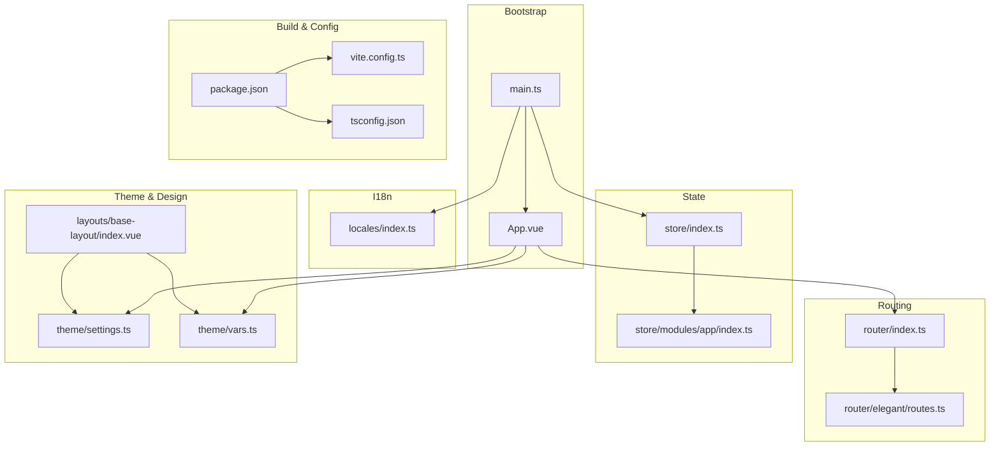
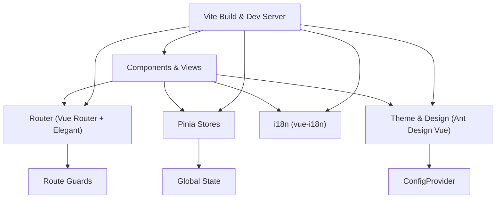
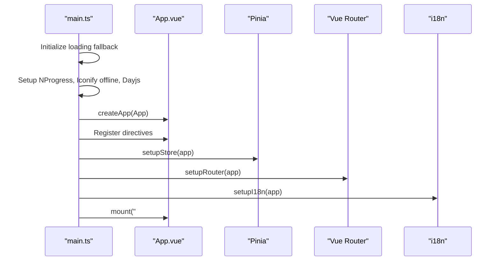
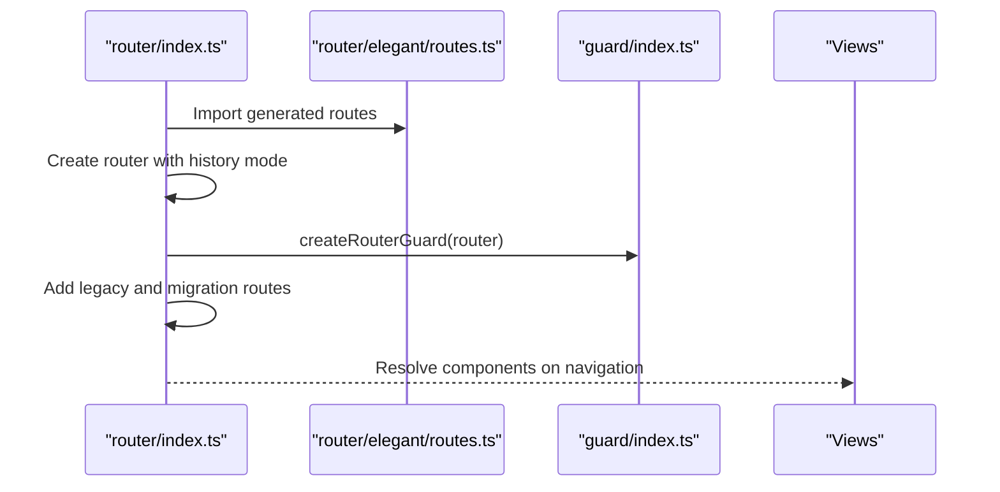
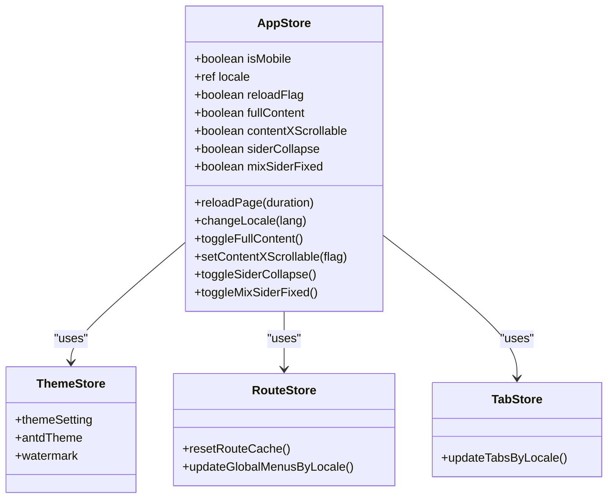
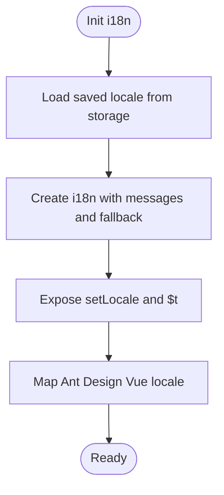
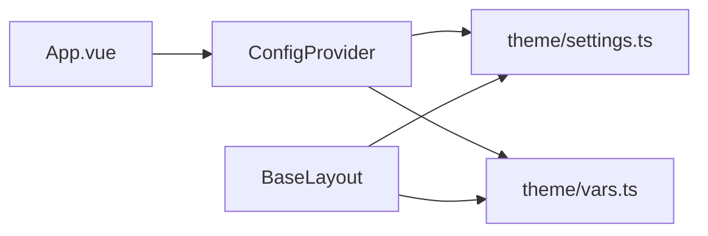
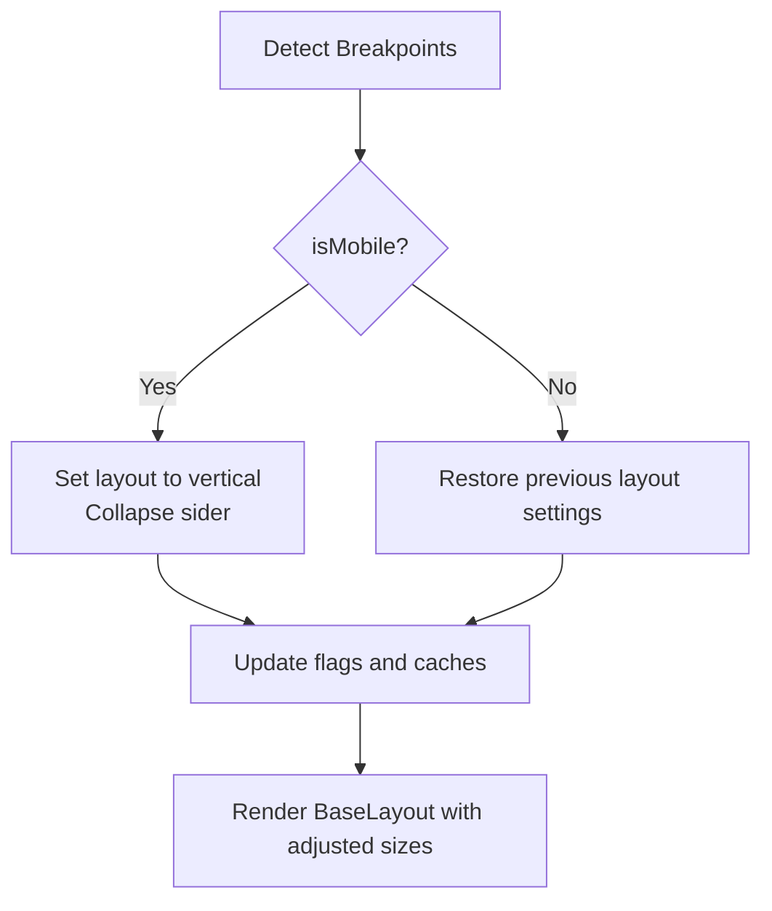
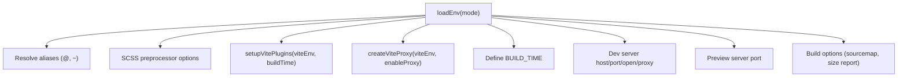
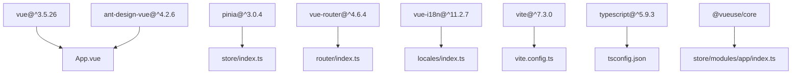

# Frontend Architecture

<cite>
**Referenced Files in This Document**
- [package.json](file://admin-web-soybean/package.json)
- [vite.config.ts](file://admin-web-soybean/vite.config.ts)
- [tsconfig.json](file://admin-web-soybean/tsconfig.json)
- [main.ts](file://admin-web-soybean/src/main.ts)
- [App.vue](file://admin-web-soybean/src/App.vue)
- [router/index.ts](file://admin-web-soybean/src/router/index.ts)
- [router/elegant/routes.ts](file://admin-web-soybean/src/router/elegant/routes.ts)
- [store/index.ts](file://admin-web-soybean/src/store/index.ts)
- [store/modules/app/index.ts](file://admin-web-soybean/src/store/modules/app/index.ts)
- [locales/index.ts](file://admin-web-soybean/src/locales/index.ts)
- [theme/settings.ts](file://admin-web-soybean/src/theme/settings.ts)
- [theme/vars.ts](file://admin-web-soybean/src/theme/vars.ts)
- [layouts/base-layout/index.vue](file://admin-web-soybean/src/layouts/base-layout/index.vue)
- [styles/scss/global.scss](file://admin-web-soybean/src/styles/scss/global.scss)
</cite>

## Table of Contents
1. [Introduction](#introduction)
2. [Project Structure](#project-structure)
3. [Core Components](#core-components)
4. [Architecture Overview](#architecture-overview)
5. [Detailed Component Analysis](#detailed-component-analysis)
6. [Dependency Analysis](#dependency-analysis)
7. [Performance Considerations](#performance-considerations)
8. [Troubleshooting Guide](#troubleshooting-guide)
9. [Conclusion](#conclusion)
10. [Appendices](#appendices)

## Introduction
This document describes the modern frontend architecture of the Survey-App’s Vue 3 administration web application. It covers the technology stack (Vue 3, TypeScript, Pinia, Vite), component organization, routing strategy with elegant-router, global state management, design system integration with Ant Design Vue, internationalization, theming and responsive design, build configuration, deployment pipeline signals, and performance optimization strategies. The goal is to provide a clear, accessible guide for developers and stakeholders to understand how the frontend is structured and how to extend or maintain it effectively.

## Project Structure
The frontend is organized around a modular, feature-centric structure under the admin-web-soybean package. Key areas include:
- Application bootstrap and plugin setup
- Routing with elegant-router and guards
- Global state via Pinia stores
- Internationalization with vue-i18n
- Theming and design system integration
- Build tooling with Vite and TypeScript configuration
- Styles and responsive layout components

**Diagram sources**
- [main.ts:1-75](file://admin-web-soybean/src/main.ts#L1-L75)
- [App.vue:1-51](file://admin-web-soybean/src/App.vue#L1-L51)
- [router/index.ts:1-92](file://admin-web-soybean/src/router/index.ts#L1-L92)
- [router/elegant/routes.ts:1-313](file://admin-web-soybean/src/router/elegant/routes.ts#L1-L313)
- [store/index.ts:1-13](file://admin-web-soybean/src/store/index.ts#L1-L13)
- [store/modules/app/index.ts:1-170](file://admin-web-soybean/src/store/modules/app/index.ts#L1-L170)
- [locales/index.ts:1-27](file://admin-web-soybean/src/locales/index.ts#L1-L27)
- [theme/settings.ts:1-87](file://admin-web-soybean/src/theme/settings.ts#L1-L87)
- [theme/vars.ts:1-36](file://admin-web-soybean/src/theme/vars.ts#L1-L36)
- [layouts/base-layout/index.vue:1-149](file://admin-web-soybean/src/layouts/base-layout/index.vue#L1-L149)
- [package.json:1-117](file://admin-web-soybean/package.json#L1-L117)
- [vite.config.ts:1-52](file://admin-web-soybean/vite.config.ts#L1-L52)
- [tsconfig.json:1-27](file://admin-web-soybean/tsconfig.json#L1-L27)

**Section sources**
- [package.json:1-117](file://admin-web-soybean/package.json#L1-L117)
- [vite.config.ts:1-52](file://admin-web-soybean/vite.config.ts#L1-L52)
- [tsconfig.json:1-27](file://admin-web-soybean/tsconfig.json#L1-L27)
- [main.ts:1-75](file://admin-web-soybean/src/main.ts#L1-L75)
- [App.vue:1-51](file://admin-web-soybean/src/App.vue#L1-L51)

## Core Components
- Application bootstrap: Initializes plugins, registers directives, sets up Pinia, router, i18n, and mounts the root component.
- Router: Uses Vue Router with configurable history modes and integrates elegant-router-generated routes and guards.
- State Management: Pinia-based stores with app, theme, route, and tab modules; includes store reset plugin.
- Internationalization: vue-i18n with locale persistence and Ant Design Vue locale mapping.
- Theming: Centralized theme settings and CSS variables; Ant Design Vue ConfigProvider integration.
- Build Tooling: Vite with plugins, environment-based proxy, aliases, and SCSS preprocessor configuration.

**Section sources**
- [main.ts:1-75](file://admin-web-soybean/src/main.ts#L1-L75)
- [router/index.ts:1-92](file://admin-web-soybean/src/router/index.ts#L1-L92)
- [store/index.ts:1-13](file://admin-web-soybean/src/store/index.ts#L1-L13)
- [locales/index.ts:1-27](file://admin-web-soybean/src/locales/index.ts#L1-L27)
- [theme/settings.ts:1-87](file://admin-web-soybean/src/theme/settings.ts#L1-L87)
- [theme/vars.ts:1-36](file://admin-web-soybean/src/theme/vars.ts#L1-L36)
- [vite.config.ts:1-52](file://admin-web-soybean/vite.config.ts#L1-L52)

## Architecture Overview
The frontend follows a layered architecture:
- Presentation Layer: Vue components, layouts, and views
- Routing Layer: Elegant-router driven route definitions and guards
- State Layer: Pinia stores for app-wide state
- Services Layer: Axios-based API client and request utilities
- Infrastructure Layer: Vite build tooling, TypeScript, and design system integrations

**Diagram sources**
- [router/index.ts:1-92](file://admin-web-soybean/src/router/index.ts#L1-L92)
- [router/elegant/routes.ts:1-313](file://admin-web-soybean/src/router/elegant/routes.ts#L1-L313)
- [store/index.ts:1-13](file://admin-web-soybean/src/store/index.ts#L1-L13)
- [locales/index.ts:1-27](file://admin-web-soybean/src/locales/index.ts#L1-L27)
- [App.vue:1-51](file://admin-web-soybean/src/App.vue#L1-L51)
- [vite.config.ts:1-52](file://admin-web-soybean/vite.config.ts#L1-L52)

## Detailed Component Analysis

### Application Bootstrap and Plugin Setup
The application bootstraps by initializing essential plugins and mounting the root component. It ensures graceful error handling during initialization and sets up global directives and providers.

**Diagram sources**
- [main.ts:1-75](file://admin-web-soybean/src/main.ts#L1-L75)
- [App.vue:1-51](file://admin-web-soybean/src/App.vue#L1-L51)

**Section sources**
- [main.ts:1-75](file://admin-web-soybean/src/main.ts#L1-L75)
- [App.vue:1-51](file://admin-web-soybean/src/App.vue#L1-L51)

### Routing Strategy with Elegant-Router
The router integrates elegant-router to generate typed route definitions and supports multiple history modes. Guards manage navigation, title updates, and progress indicators. Legacy routes and migration routes are included for backward compatibility.

**Diagram sources**
- [router/index.ts:1-92](file://admin-web-soybean/src/router/index.ts#L1-L92)
- [router/elegant/routes.ts:1-313](file://admin-web-soybean/src/router/elegant/routes.ts#L1-L313)

**Section sources**
- [router/index.ts:1-92](file://admin-web-soybean/src/router/index.ts#L1-L92)
- [router/elegant/routes.ts:1-313](file://admin-web-soybean/src/router/elegant/routes.ts#L1-L313)

### Global State Management with Pinia
Pinia is configured globally and extended with a reset plugin. The app store coordinates locale, responsive behavior, layout toggles, and integrates with theme and route stores. It also manages reload flags and mobile-specific layout backups.

**Diagram sources**
- [store/modules/app/index.ts:1-170](file://admin-web-soybean/src/store/modules/app/index.ts#L1-L170)

**Section sources**
- [store/index.ts:1-13](file://admin-web-soybean/src/store/index.ts#L1-L13)
- [store/modules/app/index.ts:1-170](file://admin-web-soybean/src/store/modules/app/index.ts#L1-L170)

### Internationalization Setup
The i18n setup initializes vue-i18n with persisted locale, fallback to English, and exposes helpers for locale switching and translation. Ant Design Vue locale is mapped based on the current app locale.

**Diagram sources**
- [locales/index.ts:1-27](file://admin-web-soybean/src/locales/index.ts#L1-L27)
- [App.vue:16-18](file://admin-web-soybean/src/App.vue#L16-L18)

**Section sources**
- [locales/index.ts:1-27](file://admin-web-soybean/src/locales/index.ts#L1-L27)
- [App.vue:16-18](file://admin-web-soybean/src/App.vue#L16-L18)

### Design System Integration and Theming
Ant Design Vue is integrated via ConfigProvider, enabling theme and locale propagation. Theme settings define color schemes, layout modes, animations, and token overrides. CSS variables are generated for consistent theming across components.

**Diagram sources**
- [App.vue:38-47](file://admin-web-soybean/src/App.vue#L38-L47)
- [theme/settings.ts:1-87](file://admin-web-soybean/src/theme/settings.ts#L1-L87)
- [theme/vars.ts:1-36](file://admin-web-soybean/src/theme/vars.ts#L1-L36)
- [layouts/base-layout/index.vue:1-149](file://admin-web-soybean/src/layouts/base-layout/index.vue#L1-L149)

**Section sources**
- [App.vue:1-51](file://admin-web-soybean/src/App.vue#L1-L51)
- [theme/settings.ts:1-87](file://admin-web-soybean/src/theme/settings.ts#L1-L87)
- [theme/vars.ts:1-36](file://admin-web-soybean/src/theme/vars.ts#L1-L36)
- [layouts/base-layout/index.vue:1-149](file://admin-web-soybean/src/layouts/base-layout/index.vue#L1-L149)

### Responsive Design Approach
Responsive behavior is managed through breakpoints and reactive flags in the app store. On mobile, the layout switches to vertical and collapses the sider, while restoring previous settings on desktop. The base layout adapts widths and visibility based on layout mode and mixins.

**Diagram sources**
- [store/modules/app/index.ts:31-133](file://admin-web-soybean/src/store/modules/app/index.ts#L31-L133)
- [layouts/base-layout/index.vue:25-102](file://admin-web-soybean/src/layouts/base-layout/index.vue#L25-L102)

**Section sources**
- [store/modules/app/index.ts:1-170](file://admin-web-soybean/src/store/modules/app/index.ts#L1-L170)
- [layouts/base-layout/index.vue:1-149](file://admin-web-soybean/src/layouts/base-layout/index.vue#L1-L149)

### Build Configuration and Environment
Vite is configured with environment-based base URL, aliases, SCSS preprocessor, and a plugin system. TypeScript is configured for strictness and bundler resolution. Development and preview ports are defined, and proxy settings support backend integration.

**Diagram sources**
- [vite.config.ts:7-51](file://admin-web-soybean/vite.config.ts#L7-L51)
- [tsconfig.json:1-27](file://admin-web-soybean/tsconfig.json#L1-L27)
- [package.json:34-48](file://admin-web-soybean/package.json#L34-L48)

**Section sources**
- [vite.config.ts:1-52](file://admin-web-soybean/vite.config.ts#L1-L52)
- [tsconfig.json:1-27](file://admin-web-soybean/tsconfig.json#L1-L27)
- [package.json:1-117](file://admin-web-soybean/package.json#L1-L117)

### Deployment Pipeline Signals
Scripts in package.json indicate supported environments and build modes (development, production, test). Preview and cleanup tasks are available. These signals inform CI/CD decisions for building and serving the application.

**Section sources**
- [package.json:34-48](file://admin-web-soybean/package.json#L34-L48)

## Dependency Analysis
The frontend relies on a cohesive set of libraries and tools:
- Vue 3 ecosystem: Vue Router, Pinia, vue-i18n
- Design system: Ant Design Vue with ConfigProvider
- Styling: UnoCSS, SCSS, CSS variables
- Build: Vite with plugins and TypeScript
- Utilities: @vueuse/core, clipboard, dayjs, echarts, nprogress

**Diagram sources**
- [package.json:51-74](file://admin-web-soybean/package.json#L51-L74)
- [vite.config.ts:1-52](file://admin-web-soybean/vite.config.ts#L1-L52)
- [tsconfig.json:1-27](file://admin-web-soybean/tsconfig.json#L1-L27)
- [store/index.ts:1-13](file://admin-web-soybean/src/store/index.ts#L1-L13)
- [router/index.ts:1-92](file://admin-web-soybean/src/router/index.ts#L1-L92)
- [locales/index.ts:1-27](file://admin-web-soybean/src/locales/index.ts#L1-L27)
- [App.vue:1-51](file://admin-web-soybean/src/App.vue#L1-L51)

**Section sources**
- [package.json:51-74](file://admin-web-soybean/package.json#L51-L74)

## Performance Considerations
- Lazy-load views and components to reduce initial bundle size.
- Enable source maps selectively for production debugging.
- Use keep-alive and route-level caching where appropriate.
- Minimize heavy third-party dependencies and tree-shake unused features.
- Optimize asset loading and leverage Vite’s built-in optimizations.

[No sources needed since this section provides general guidance]

## Troubleshooting Guide
Common startup and runtime issues:
- Application fails to mount: The bootstrap function includes a fallback DOM element and error messaging to aid diagnosis.
- Locale or date locale mismatch: Ensure persisted locale is valid and dayjs locale is set accordingly.
- Router navigation errors: Verify route guards and history mode configuration.
- Theme or layout anomalies: Confirm theme settings and CSS variable generation.

**Section sources**
- [main.ts:15-72](file://admin-web-soybean/src/main.ts#L15-L72)
- [locales/index.ts:18-26](file://admin-web-soybean/src/locales/index.ts#L18-L26)
- [router/index.ts:13-19](file://admin-web-soybean/src/router/index.ts#L13-L19)
- [theme/settings.ts:1-87](file://admin-web-soybean/src/theme/settings.ts#L1-L87)

## Conclusion
The frontend architecture leverages Vue 3, TypeScript, Pinia, and Vite to deliver a scalable, maintainable admin interface. Elegant-router streamlines routing, Pinia centralizes state, Ant Design Vue provides a robust design system, and the theming system ensures consistent visuals across environments. With clear separation of concerns, strong typing, and modular components, the system supports efficient development and reliable operation.

[No sources needed since this section summarizes without analyzing specific files]

## Appendices

### Appendix A: Key Paths and Responsibilities
- Application bootstrap and mounting: [main.ts:1-75](file://admin-web-soybean/src/main.ts#L1-L75), [App.vue:1-51](file://admin-web-soybean/src/App.vue#L1-L51)
- Routing and guards: [router/index.ts:1-92](file://admin-web-soybean/src/router/index.ts#L1-L92), [router/elegant/routes.ts:1-313](file://admin-web-soybean/src/router/elegant/routes.ts#L1-L313)
- State management: [store/index.ts:1-13](file://admin-web-soybean/src/store/index.ts#L1-L13), [store/modules/app/index.ts:1-170](file://admin-web-soybean/src/store/modules/app/index.ts#L1-L170)
- Internationalization: [locales/index.ts:1-27](file://admin-web-soybean/src/locales/index.ts#L1-L27)
- Theming and design: [theme/settings.ts:1-87](file://admin-web-soybean/src/theme/settings.ts#L1-L87), [theme/vars.ts:1-36](file://admin-web-soybean/src/theme/vars.ts#L1-L36), [layouts/base-layout/index.vue:1-149](file://admin-web-soybean/src/layouts/base-layout/index.vue#L1-L149)
- Build and configuration: [vite.config.ts:1-52](file://admin-web-soybean/vite.config.ts#L1-L52), [tsconfig.json:1-27](file://admin-web-soybean/tsconfig.json#L1-L27), [package.json:1-117](file://admin-web-soybean/package.json#L1-L117)

[No sources needed since this section lists references already cited above]