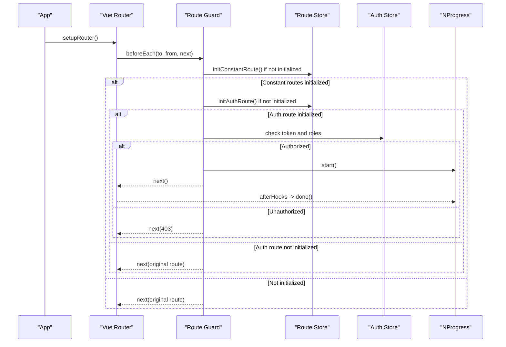
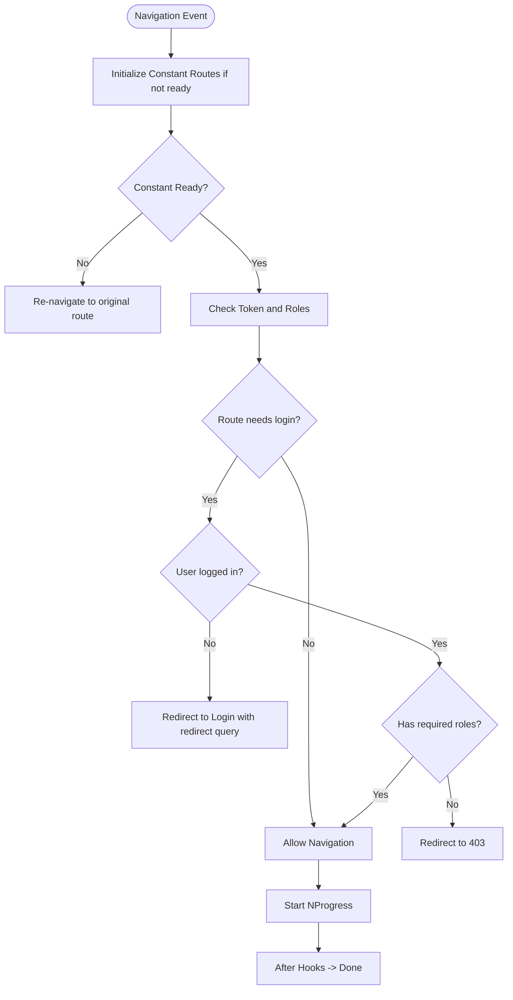
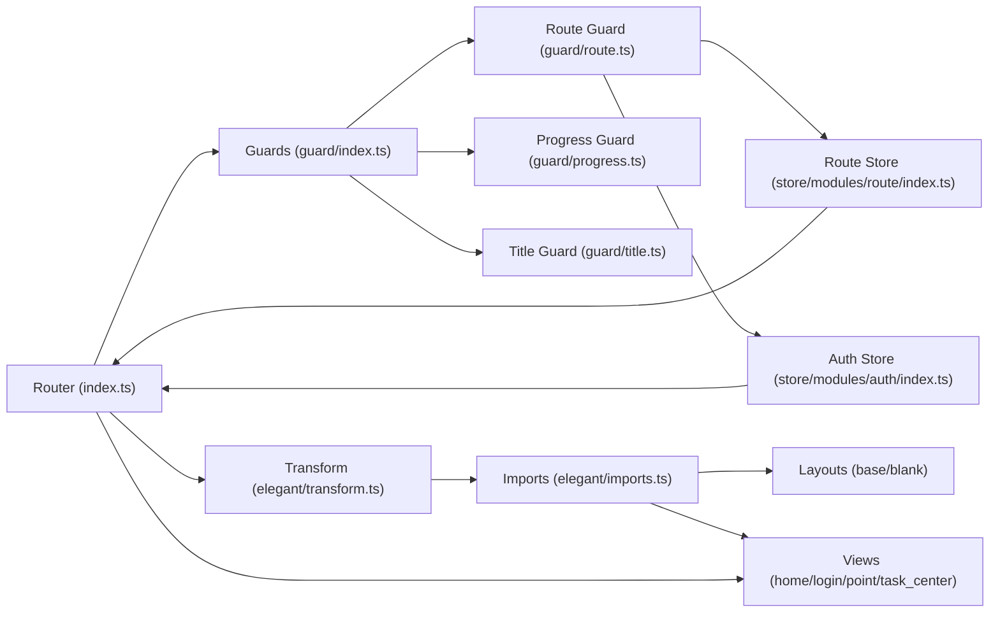

# Routing & Navigation

<cite>
**Referenced Files in This Document**
- [index.ts](file://admin-web-soybean/src/router/index.ts)
- [routes/index.ts](file://admin-web-soybean/src/router/routes/index.ts)
- [routes/builtin.ts](file://admin-web-soybean/src/router/routes/builtin.ts)
- [elegant/routes.ts](file://admin-web-soybean/src/router/elegant/routes.ts)
- [elegant/imports.ts](file://admin-web-soybean/src/router/elegant/imports.ts)
- [elegant/transform.ts](file://admin-web-soybean/src/router/elegant/transform.ts)
- [guard/index.ts](file://admin-web-soybean/src/router/guard/index.ts)
- [guard/route.ts](file://admin-web-soybean/src/router/guard/route.ts)
- [guard/progress.ts](file://admin-web-soybean/src/router/guard/progress.ts)
- [guard/title.ts](file://admin-web-soybean/src/router/guard/title.ts)
- [base-layout/index.vue](file://admin-web-soybean/src/layouts/base-layout/index.vue)
- [blank-layout/index.vue](file://admin-web-soybean/src/layouts/blank-layout/index.vue)
- [store/modules/route/index.ts](file://admin-web-soybean/src/store/modules/route/index.ts)
- [store/modules/auth/index.ts](file://admin-web-soybean/src/store/modules/auth/index.ts)
- [hooks/common/router.ts](file://admin-web-soybean/src/hooks/common/router.ts)
- [utils/storage.ts](file://admin-web-soybean/src/utils/storage.ts)
- [views/home/index.vue](file://admin-web-soybean/src/views/home/index.vue)
- [views/_builtin/login/index.vue](file://admin-web-soybean/src/views/_builtin/login/index.vue)
- [views/point/list/index.vue](file://admin-web-soybean/src/views/point/list/index.vue)
- [views/point/management_old/index.vue](file://admin-web-soybean/src/views/point/management_old/index.vue)
- [views/task_center/detail/index.vue](file://admin-web-soybean/src/views/task_center/detail/index.vue)
- [views/task_center/list/index.vue](file://admin-web-soybean/src/views/task_center/list/index.vue)
- [views/task_center/map/index.vue](file://admin-web-soybean/src/views/task_center/map/index.vue)
</cite>

## Update Summary
**Changes Made**
- Updated point management routing with new nested hierarchy under `/point/management`
- Simplified task center routing with streamlined navigation structure
- Enhanced navigation organization with improved route categorization
- Added new point management views and task center components
- Restructured route definitions for better maintainability

## Table of Contents
1. [Introduction](#introduction)
2. [Project Structure](#project-structure)
3. [Core Components](#core-components)
4. [Architecture Overview](#architecture-overview)
5. [Detailed Component Analysis](#detailed-component-analysis)
6. [Dependency Analysis](#dependency-analysis)
7. [Performance Considerations](#performance-considerations)
8. [Troubleshooting Guide](#troubleshooting-guide)
9. [Conclusion](#conclusion)
10. [Appendices](#appendices)

## Introduction
This document explains the Vue Router implementation integrated with elegant-router in the admin-web-soybean project. It covers routing architecture, route guards, navigation patterns, route configuration, lazy loading, dynamic route generation, authentication and permission-based routing, layout system, nested routing, breadcrumbs, programmatic navigation, route parameters and query handling, route meta properties, navigation optimization, and SEO considerations for a single-page application.

## Project Structure
The routing system is organized around:
- Router bootstrap and history selection
- Elegant-router configuration for static/dynamic routes
- Guard pipeline for progress, route resolution, and document title
- Store-driven route initialization and caching
- Layout components and nested routing
- Programmatic navigation helpers and storage utilities

```mermaid
graph TB
subgraph "Router Bootstrap"
RIndex["src/router/index.ts"]
RBuiltin["src/router/routes/builtin.ts"]
RElegantRoutes["src/router/elegant/routes.ts"]
RElegantImports["src/router/elegant/imports.ts"]
RElegantTransform["src/router/elegant/transform.ts"]
end
subgraph "Guards"
GIndex["src/router/guard/index.ts"]
GRoute["src/router/guard/route.ts"]
GProgress["src/router/guard/progress.ts"]
GTitle["src/router/guard/title.ts"]
end
subgraph "Stores"
SRoute["src/store/modules/route/index.ts"]
SAuth["src/store/modules/auth/index.ts"]
end
subgraph "Layouts"
BL["src/layouts/blank-layout/index.vue"]
BaseL["src/layouts/base-layout/index.vue"]
end
subgraph "Views"
VHome["src/views/home/index.vue"]
VLogin["src/views/_builtin/login/index.vue"]
VPointList["src/views/point/list/index.vue"]
VPointOld["src/views/point/management_old/index.vue"]
VTaskDetail["src/views/task_center/detail/index.vue"]
VTaskList["src/views/task_center/list/index.vue"]
VTaskMap["src/views/task_center/map/index.vue"]
end
RIndex --> RBuiltin
RIndex --> RElegantRoutes
RIndex --> RElegantImports
RIndex --> RElegantTransform
RIndex --> GIndex
GIndex --> GRoute
GIndex --> GProgress
GIndex --> GTitle
GRoute --> SRoute
GRoute --> SAuth
SRoute --> RIndex
SAuth --> RIndex
RElegantImports --> BL
RElegantImports --> BaseL
RElegantImports --> VPointList
RElegantImports --> VPointOld
RElegantImports --> VTaskDetail
RElegantImports --> VTaskList
RElegantImports --> VTaskMap
RIndex --> VHome
RIndex --> VLogin
```

**Diagram sources**
- [index.ts:1-92](file://admin-web-soybean/src/router/index.ts#L1-L92)
- [routes/builtin.ts:1-32](file://admin-web-soybean/src/router/routes/builtin.ts#L1-L32)
- [elegant/routes.ts:1-313](file://admin-web-soybean/src/router/elegant/routes.ts#L1-L313)
- [elegant/imports.ts:1-41](file://admin-web-soybean/src/router/elegant/imports.ts#L1-L41)
- [elegant/transform.ts:1-216](file://admin-web-soybean/src/router/elegant/transform.ts#L1-L216)
- [guard/index.ts:1-16](file://admin-web-soybean/src/router/guard/index.ts#L1-L16)
- [guard/route.ts:1-214](file://admin-web-soybean/src/router/guard/route.ts#L1-L214)
- [guard/progress.ts:1-12](file://admin-web-soybean/src/router/guard/progress.ts#L1-L12)
- [guard/title.ts:1-14](file://admin-web-soybean/src/router/guard/title.ts#L1-L14)
- [store/modules/route/index.ts:1-349](file://admin-web-soybean/src/store/modules/route/index.ts#L1-L349)
- [store/modules/auth/index.ts:1-203](file://admin-web-soybean/src/store/modules/auth/index.ts#L1-L203)
- [layouts/blank-layout/index.vue:1-14](file://admin-web-soybean/src/layouts/blank-layout/index.vue#L1-L14)
- [layouts/base-layout/index.vue:1-149](file://admin-web-soybean/src/layouts/base-layout/index.vue#L1-L149)
- [views/home/index.vue:1-152](file://admin-web-soybean/src/views/home/index.vue#L1-L152)
- [views/_builtin/login/index.vue:1-152](file://admin-web-soybean/src/views/_builtin/login/index.vue#L1-L152)
- [views/point/list/index.vue](file://admin-web-soybean/src/views/point/list/index.vue)
- [views/point/management_old/index.vue](file://admin-web-soybean/src/views/point/management_old/index.vue)
- [views/task_center/detail/index.vue](file://admin-web-soybean/src/views/task_center/detail/index.vue)
- [views/task_center/list/index.vue](file://admin-web-soybean/src/views/task_center/list/index.vue)
- [views/task_center/map/index.vue](file://admin-web-soybean/src/views/task_center/map/index.vue)

**Section sources**
- [index.ts:1-92](file://admin-web-soybean/src/router/index.ts#L1-L92)
- [routes/index.ts:1-245](file://admin-web-soybean/src/router/routes/index.ts#L1-L245)
- [routes/builtin.ts:1-32](file://admin-web-soybean/src/router/routes/builtin.ts#L1-L32)
- [elegant/routes.ts:1-313](file://admin-web-soybean/src/router/elegant/routes.ts#L1-L313)
- [elegant/imports.ts:1-41](file://admin-web-soybean/src/router/elegant/imports.ts#L1-L41)
- [elegant/transform.ts:1-216](file://admin-web-soybean/src/router/elegant/transform.ts#L1-L216)

## Core Components
- Router bootstrap and history modes: Selects hash/history/memory based on environment and registers built-in and legacy routes.
- Route configuration via elegant-router: Defines static/dynamic routes, transforms to Vue routes, and manages redirects and props.
- Guards: Progress bar, route initialization and authorization, and document title updates.
- Stores: Route store initializes constant and auth routes, caches and manages menus/breadcrumbs; Auth store handles tokens, user info, and login flows.
- Layouts: Base layout with header, siders, tabs, content, footer; Blank layout for modal-like pages.
- Programmatic navigation: Helpers for named routes, query/params, login redirection, and back navigation.

**Section sources**
- [index.ts:13-92](file://admin-web-soybean/src/router/index.ts#L13-L92)
- [routes/index.ts:11-245](file://admin-web-soybean/src/router/routes/index.ts#L11-L245)
- [routes/builtin.ts:5-31](file://admin-web-soybean/src/router/routes/builtin.ts#L5-L31)
- [elegant/imports.ts:9-40](file://admin-web-soybean/src/router/elegant/imports.ts#L9-L40)
- [elegant/transform.ts:16-158](file://admin-web-soybean/src/router/elegant/transform.ts#L16-L158)
- [guard/index.ts:11-15](file://admin-web-soybean/src/router/guard/index.ts#L11-L15)
- [guard/route.ts:19-89](file://admin-web-soybean/src/router/guard/route.ts#L19-L89)
- [guard/progress.ts:3-11](file://admin-web-soybean/src/router/guard/progress.ts#L3-L11)
- [guard/title.ts:5-12](file://admin-web-soybean/src/router/guard/title.ts#L5-L12)
- [store/modules/route/index.ts:26-349](file://admin-web-soybean/src/store/modules/route/index.ts#L26-L349)
- [store/modules/auth/index.ts:22-203](file://admin-web-soybean/src/store/modules/auth/index.ts#L22-L203)
- [hooks/common/router.ts:13-133](file://admin-web-soybean/src/hooks/common/router.ts#L13-L133)

## Architecture Overview
The routing architecture integrates elegant-router with Vue Router:
- Routes are authored as elegant routes (layouts/views mapping) and transformed into Vue routes.
- Initialization ensures constant routes are ready before navigation, then auth routes are conditionally added.
- Guards enforce authentication, authorization, and document title updates.
- Stores manage route caching, menus, breadcrumbs, and dynamic root redirect updates.

**Diagram sources**
- [index.ts:87-92](file://admin-web-soybean/src/router/index.ts#L87-L92)
- [guard/route.ts:19-183](file://admin-web-soybean/src/router/guard/route.ts#L19-L183)
- [guard/progress.ts:3-11](file://admin-web-soybean/src/router/guard/progress.ts#L3-L11)
- [store/modules/route/index.ts:151-230](file://admin-web-soybean/src/store/modules/route/index.ts#L151-L230)
- [store/modules/auth/index.ts:29-48](file://admin-web-soybean/src/store/modules/auth/index.ts#L29-L48)

## Detailed Component Analysis

### Router Bootstrap and History Modes
- History modes supported: hash, history, memory. Selected from environment variables and applied with optional base URL.
- Built-in routes (root and not-found) and legacy routes are registered during bootstrap.
- Additional migration routes are added dynamically via router.addRoute.

**Section sources**
- [index.ts:13-92](file://admin-web-soybean/src/router/index.ts#L13-L92)
- [routes/builtin.ts:5-31](file://admin-web-soybean/src/router/routes/builtin.ts#L5-L31)

### Elegant Router Configuration
- Static routes include custom routes and generated routes. Custom routes augment generated ones, with overrides by name.
- Transform logic converts layout/view references to actual components, injects props for parametrized routes, and sets redirects for parent routes.
- Route map utilities provide path/name lookup for route keys.

**Section sources**
- [routes/index.ts:11-245](file://admin-web-soybean/src/router/routes/index.ts#L11-L245)
- [elegant/routes.ts:8-313](file://admin-web-soybean/src/router/elegant/routes.ts#L8-L313)
- [elegant/imports.ts:9-40](file://admin-web-soybean/src/router/elegant/imports.ts#L9-L40)
- [elegant/transform.ts:16-158](file://admin-web-soybean/src/router/elegant/transform.ts#L16-L158)

### Restructured Point Management Routing
**Updated** The point management routing has been restructured with a new nested hierarchy under `/point/management` for improved organization and maintainability.

- New point management route hierarchy:
  - Parent route: `/point/management` with dedicated point management view
  - Child routes for different point management functions
  - Legacy point management route preserved for backward compatibility
- Enhanced navigation organization with clearer separation between old and new point management interfaces
- Improved route categorization for better developer experience

**Section sources**
- [elegant/routes.ts:151-168](file://admin-web-soybean/src/router/elegant/routes.ts#L151-L168)
- [elegant/imports.ts:28-28](file://admin-web-soybean/src/router/elegant/imports.ts#L28-L28)
- [views/point/list/index.vue](file://admin-web-soybean/src/views/point/list/index.vue)
- [views/point/management_old/index.vue](file://admin-web-soybean/src/views/point/management_old/index.vue)

### Simplified Task Center Routing
**Updated** The task center routing has been streamlined with a simplified navigation structure for improved user experience and reduced complexity.

- Streamlined task center route structure:
  - Task list route: `/task_center/list` for task overview
  - Task detail route: `/task_center/detail` for individual task information
  - Task map route: `/task_center/map` for geographic task visualization
- Removed redundant nested routes and consolidated similar functionality
- Improved navigation flow with logical grouping of task-related operations

**Section sources**
- [elegant/routes.ts:167-173](file://admin-web-soybean/src/router/elegant/routes.ts#L167-L173)
- [elegant/imports.ts:38-40](file://admin-web-soybean/src/router/elegant/imports.ts#L38-L40)
- [views/task_center/detail/index.vue](file://admin-web-soybean/src/views/task_center/detail/index.vue)
- [views/task_center/list/index.vue](file://admin-web-soybean/src/views/task_center/list/index.vue)
- [views/task_center/map/index.vue](file://admin-web-soybean/src/views/task_center/map/index.vue)

### Route Guards Implementation
- Progress guard starts a progress indicator on navigation and completes after the route changes.
- Route guard performs:
  - Constant route initialization and re-navigation if missing.
  - Auth route initialization and conditional redirect to login/not-found/403.
  - Role-based authorization using route meta roles and user roles.
  - Handling external links via meta.href.
- Document title guard updates the page title using i18n keys or raw titles.

**Diagram sources**
- [guard/route.ts:19-183](file://admin-web-soybean/src/router/guard/route.ts#L19-L183)
- [guard/progress.ts:3-11](file://admin-web-soybean/src/router/guard/progress.ts#L3-L11)
- [guard/title.ts:5-12](file://admin-web-soybean/src/router/guard/title.ts#L5-L12)

**Section sources**
- [guard/index.ts:11-15](file://admin-web-soybean/src/router/guard/index.ts#L11-L15)
- [guard/route.ts:19-183](file://admin-web-soybean/src/router/guard/route.ts#L19-L183)
- [guard/progress.ts:3-11](file://admin-web-soybean/src/router/guard/progress.ts#L3-L11)
- [guard/title.ts:5-12](file://admin-web-soybean/src/router/guard/title.ts#L5-L12)

### Authentication and Permission-Based Routing
- Token presence determines login state; roles and permissions are stored in the auth store.
- Static super role can bypass role checks in static mode.
- Route guard evaluates roles against route meta and redirects accordingly.
- Route store loads constant and auth routes, sorts by order, transforms to Vue routes, and adds them to the router.

**Section sources**
- [store/modules/auth/index.ts:29-48](file://admin-web-soybean/src/store/modules/auth/index.ts#L29-L48)
- [store/modules/auth/index.ts:110-139](file://admin-web-soybean/src/store/modules/auth/index.ts#L110-L139)
- [store/modules/auth/index.ts:141-178](file://admin-web-soybean/src/store/modules/auth/index.ts#L141-L178)
- [guard/route.ts:42-83](file://admin-web-soybean/src/router/guard/route.ts#L42-L83)
- [store/modules/route/index.ts:151-230](file://admin-web-soybean/src/store/modules/route/index.ts#L151-L230)

### Layout System and Nested Routing
- Layouts: Base layout composes header, sider, tab, menu, content, footer; Blank layout wraps content without decorations.
- Elegant routes define nested children; transform injects redirects and props for parametrized segments.
- Views are lazily imported via dynamic imports in the imports map.

**Section sources**
- [layouts/base-layout/index.vue:105-142](file://admin-web-soybean/src/layouts/base-layout/index.vue#L105-L142)
- [layouts/blank-layout/index.vue:9-11](file://admin-web-soybean/src/layouts/blank-layout/index.vue#L9-L11)
- [elegant/transform.ts:87-158](file://admin-web-soybean/src/router/elegant/transform.ts#L87-L158)
- [elegant/imports.ts:17-40](file://admin-web-soybean/src/router/elegant/imports.ts#L17-L40)

### Breadcrumb Navigation
- Breadcrumbs are derived from the current route and global menus maintained by the route store.
- Menus are built from auth routes and updated on locale changes.

**Section sources**
- [store/modules/route/index.ts:131-132](file://admin-web-soybean/src/store/modules/route/index.ts#L131-L132)
- [store/modules/route/index.ts:86-93](file://admin-web-soybean/src/store/modules/route/index.ts#L86-L93)

### Dynamic Route Generation and Caching
- Routes are added dynamically via router.addRoute and cached by route names.
- Root redirect is updated dynamically based on user home route in dynamic mode.
- Route store maintains remove functions to reset routes cleanly.

**Section sources**
- [index.ts:67-85](file://admin-web-soybean/src/router/index.ts#L67-L85)
- [store/modules/route/index.ts:254-268](file://admin-web-soybean/src/store/modules/route/index.ts#L254-L268)
- [store/modules/route/index.ts:275-287](file://admin-web-soybean/src/store/modules/route/index.ts#L275-L287)

### Programmatic Navigation and Query Management
- Named route navigation with optional query/params.
- Login redirection preserves redirect query; fallback to home if no redirect.
- Back navigation and module switching helpers.

**Section sources**
- [hooks/common/router.ts:26-121](file://admin-web-soybean/src/hooks/common/router.ts#L26-L121)
- [views/_builtin/login/index.vue:67-83](file://admin-web-soybean/src/views/_builtin/login/index.vue#L67-L83)

### Route Parameters and Meta Properties
- Parametrized routes automatically receive props: true for path segments with placeholders.
- Meta supports title, i18nKey, roles, icon, order, hideInMenu, activeMenu, href, constant, and keepAlive.
- Route map utilities support path/name lookups.

**Section sources**
- [elegant/transform.ts:87-90](file://admin-web-soybean/src/router/elegant/transform.ts#L87-L90)
- [elegant/routes.ts:56-60](file://admin-web-soybean/src/router/elegant/routes.ts#L56-L60)
- [elegant/routes.ts:264-277](file://admin-web-soybean/src/router/elegant/routes.ts#L264-L277)
- [elegant/transform.ts:163-203](file://admin-web-soybean/src/router/elegant/transform.ts#L163-L203)

### Navigation Optimization and SEO Considerations
- Progress indicator improves perceived performance.
- Document title updates per route enhance SEO and UX.
- Lazy-loaded views reduce initial bundle size.
- Keep-alive and cache route names enable efficient tab/page reuse.

**Section sources**
- [guard/progress.ts:3-11](file://admin-web-soybean/src/router/guard/progress.ts#L3-L11)
- [guard/title.ts:5-12](file://admin-web-soybean/src/router/guard/title.ts#L5-L12)
- [elegant/imports.ts:17-40](file://admin-web-soybean/src/router/elegant/imports.ts#L17-L40)
- [store/modules/route/index.ts:110-112](file://admin-web-soybean/src/store/modules/route/index.ts#L110-L112)

## Dependency Analysis
The routing system exhibits low coupling between concerns:
- Router depends on guards and stores.
- Guards depend on stores and storage utilities.
- Route store depends on router and API services.
- Views and layouts are decoupled from routing logic via imports.

**Diagram sources**
- [index.ts:87-92](file://admin-web-soybean/src/router/index.ts#L87-L92)
- [guard/index.ts:11-15](file://admin-web-soybean/src/router/guard/index.ts#L11-L15)
- [guard/route.ts:19-89](file://admin-web-soybean/src/router/guard/route.ts#L19-L89)
- [guard/progress.ts:3-11](file://admin-web-soybean/src/router/guard/progress.ts#L3-L11)
- [guard/title.ts:5-12](file://admin-web-soybean/src/router/guard/title.ts#L5-L12)
- [store/modules/route/index.ts:26-349](file://admin-web-soybean/src/store/modules/route/index.ts#L26-L349)
- [store/modules/auth/index.ts:22-203](file://admin-web-soybean/src/store/modules/auth/index.ts#L22-L203)
- [elegant/transform.ts:16-158](file://admin-web-soybean/src/router/elegant/transform.ts#L16-L158)
- [elegant/imports.ts:9-40](file://admin-web-soybean/src/router/elegant/imports.ts#L9-L40)
- [layouts/base-layout/index.vue:105-142](file://admin-web-soybean/src/layouts/base-layout/index.vue#L105-L142)
- [layouts/blank-layout/index.vue:9-11](file://admin-web-soybean/src/layouts/blank-layout/index.vue#L9-L11)
- [views/home/index.vue:1-152](file://admin-web-soybean/src/views/home/index.vue#L1-L152)
- [views/_builtin/login/index.vue:1-152](file://admin-web-soybean/src/views/_builtin/login/index.vue#L1-L152)
- [views/point/list/index.vue](file://admin-web-soybean/src/views/point/list/index.vue)
- [views/point/management_old/index.vue](file://admin-web-soybean/src/views/point/management_old/index.vue)
- [views/task_center/detail/index.vue](file://admin-web-soybean/src/views/task_center/detail/index.vue)
- [views/task_center/list/index.vue](file://admin-web-soybean/src/views/task_center/list/index.vue)
- [views/task_center/map/index.vue](file://admin-web-soybean/src/views/task_center/map/index.vue)

**Section sources**
- [index.ts:54-65](file://admin-web-soybean/src/router/index.ts#L54-L65)
- [routes/index.ts:214-245](file://admin-web-soybean/src/router/routes/index.ts#L214-L245)
- [elegant/transform.ts:16-158](file://admin-web-soybean/src/router/elegant/transform.ts#L16-L158)

## Performance Considerations
- Prefer lazy-loading views via dynamic imports to reduce initial payload.
- Use keepAlive and cache route names for frequently accessed pages.
- Minimize deep nested routes; leverage flat hierarchy with redirects where appropriate.
- Avoid unnecessary guards work; short-circuit when constant routes are ready.

## Troubleshooting Guide
- Navigation stuck on not-found: Ensure constant and auth routes are initialized; guards will re-navigate to the intended route after initialization.
- Login loop: Verify token storage and redirect query handling; confirm login route does not redirect to itself when logged in.
- Authorization failures: Confirm route meta roles match normalized user roles; static super role bypass applies only in static mode.
- Title not updating: Ensure meta.i18nKey or meta.title is present; confirm title guard runs after route changes.

**Section sources**
- [guard/route.ts:96-183](file://admin-web-soybean/src/router/guard/route.ts#L96-L183)
- [guard/route.ts:57-83](file://admin-web-soybean/src/router/guard/route.ts#L57-L83)
- [guard/title.ts:5-12](file://admin-web-soybean/src/router/guard/title.ts#L5-L12)
- [utils/storage.ts:5-9](file://admin-web-soybean/src/utils/storage.ts#L5-L9)

## Conclusion
The routing system leverages elegant-router to provide a clean separation between route definitions and Vue Router configuration. Guards enforce robust navigation policies, while stores manage initialization, caching, and dynamic updates. The layout system and lazy-loaded views contribute to a responsive and maintainable SPA. Recent restructuring improvements enhance navigation organization and maintainability through improved route hierarchies and simplified routing patterns.

## Appendices

### Example Navigation Patterns
- Programmatic navigation by key with query/params: see [routerPushByKey:26-42](file://admin-web-soybean/src/hooks/common/router.ts#L26-L42).
- Redirect from login with preserved redirect: see [redirectFromLogin:101-121](file://admin-web-soybean/src/hooks/common/router.ts#L101-L121).
- Login route with module switching: see [toLogin:67-83](file://admin-web-soybean/src/hooks/common/router.ts#L67-L83).

### Route Meta Reference
- Fields: title, i18nKey, roles, icon, order, hideInMenu, activeMenu, href, constant, keepAlive, query (used by helpers).
- Examples: [generated routes meta:56-60](file://admin-web-soybean/src/router/elegant/routes.ts#L56-L60), [custom routes meta:16-21](file://admin-web-soybean/src/router/routes/index.ts#L16-L21).

### Environment and Storage
- History mode and base URL: [router bootstrap:13-19](file://admin-web-soybean/src/router/index.ts#L13-L19).
- Token storage: [local storage utility:5-9](file://admin-web-soybean/src/utils/storage.ts#L5-L9).

### Restructured Routing Examples
- Point management nested hierarchy: see [point management routes:151-168](file://admin-web-soybean/src/router/elegant/routes.ts#L151-L168).
- Task center simplified structure: see [task center routes:167-173](file://admin-web-soybean/src/router/elegant/routes.ts#L167-L173).