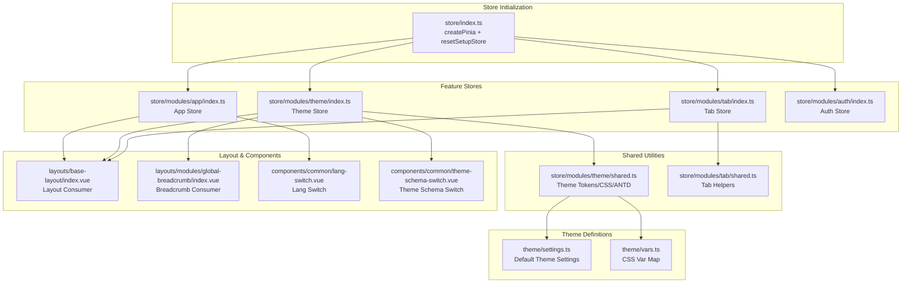
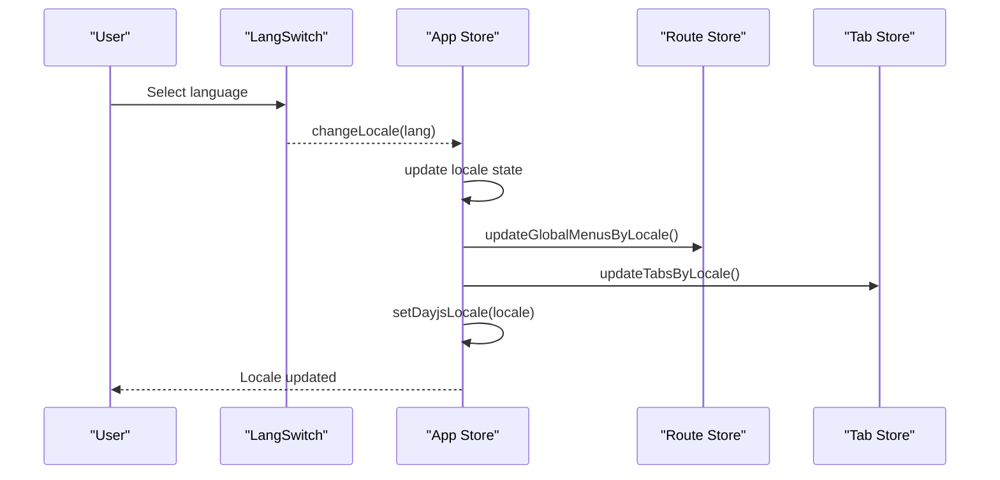
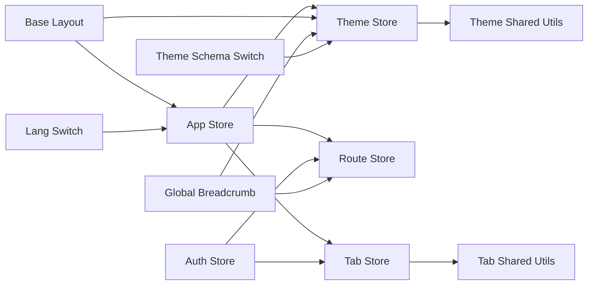

# App Store Module

<cite>
**Referenced Files in This Document**
- [index.ts](file://admin-web-soybean/src/store/index.ts)
- [index.ts](file://admin-web-soybean/src/store/modules/app/index.ts)
- [index.ts](file://admin-web-soybean/src/store/modules/theme/index.ts)
- [shared.ts](file://admin-web-soybean/src/store/modules/theme/shared.ts)
- [index.ts](file://admin-web-soybean/src/store/modules/tab/index.ts)
- [shared.ts](file://admin-web-soybean/src/store/modules/tab/shared.ts)
- [index.ts](file://admin-web-soybean/src/store/modules/auth/index.ts)
- [index.ts](file://admin-web-soybean/src/store/plugins/index.ts)
- [settings.ts](file://admin-web-soybean/src/theme/settings.ts)
- [vars.ts](file://admin-web-soybean/src/theme/vars.ts)
- [index.vue](file://admin-web-soybean/src/layouts/base-layout/index.vue)
- [index.vue](file://admin-web-soybean/src/layouts/modules/global-breadcrumb/index.vue)
- [index.vue](file://admin-web-soybean/src/components/common/dark-mode-container.vue)
- [index.vue](file://admin-web-soybean/src/components/common/lang-switch.vue)
- [index.vue](file://admin-web-soybean/src/components/common/theme-schema-switch.vue)
- [index.ts](file://admin-web-soybean/src/enum/index.ts)
</cite>

## Table of Contents
1. [Introduction](#introduction)
2. [Project Structure](#project-structure)
3. [Core Components](#core-components)
4. [Architecture Overview](#architecture-overview)
5. [Detailed Component Analysis](#detailed-component-analysis)
6. [Dependency Analysis](#dependency-analysis)
7. [Performance Considerations](#performance-considerations)
8. [Troubleshooting Guide](#troubleshooting-guide)
9. [Conclusion](#conclusion)

## Introduction
This document explains the App store module and application-wide state management in the admin-web-soybean frontend. It covers theme configuration, layout settings, language preferences, UI state, responsive behavior, and cross-component communication via Pinia stores. It also documents state definitions for sidebar collapse, breadcrumb visibility, and page loading states, along with practical usage patterns and persistence strategies.

## Project Structure
The state management is organized around Pinia stores with a modular structure:
- Root store initialization registers Pinia and a reset plugin.
- Feature stores: App, Theme, Tab, Auth, Route.
- Shared theme utilities for token generation, CSS variable injection, and Ant Design theme creation.
- Layout and components consume store state to adapt UI behavior.

**Diagram sources**
- [index.ts:1-13](file://admin-web-soybean/src/store/index.ts#L1-L13)
- [index.ts:1-170](file://admin-web-soybean/src/store/modules/app/index.ts#L1-L170)
- [index.ts:1-222](file://admin-web-soybean/src/store/modules/theme/index.ts#L1-L222)
- [shared.ts:1-233](file://admin-web-soybean/src/store/modules/theme/shared.ts#L1-L233)
- [index.ts:1-297](file://admin-web-soybean/src/store/modules/tab/index.ts#L1-L297)
- [shared.ts:1-251](file://admin-web-soybean/src/store/modules/tab/shared.ts#L1-L251)
- [settings.ts:1-87](file://admin-web-soybean/src/theme/settings.ts#L1-L87)
- [vars.ts:1-36](file://admin-web-soybean/src/theme/vars.ts#L1-L36)
- [index.vue:1-149](file://admin-web-soybean/src/layouts/base-layout/index.vue#L1-L149)
- [index.vue:1-55](file://admin-web-soybean/src/layouts/modules/global-breadcrumb/index.vue#L1-L55)
- [index.vue:1-55](file://admin-web-soybean/src/components/common/lang-switch.vue#L1-L55)
- [index.vue:1-57](file://admin-web-soybean/src/components/common/theme-schema-switch.vue#L1-L57)

**Section sources**
- [index.ts:1-13](file://admin-web-soybean/src/store/index.ts#L1-L13)
- [index.ts:1-170](file://admin-web-soybean/src/store/modules/app/index.ts#L1-L170)
- [index.ts:1-222](file://admin-web-soybean/src/store/modules/theme/index.ts#L1-L222)
- [shared.ts:1-233](file://admin-web-soybean/src/store/modules/theme/shared.ts#L1-L233)
- [index.ts:1-297](file://admin-web-soybean/src/store/modules/tab/index.ts#L1-L297)
- [shared.ts:1-251](file://admin-web-soybean/src/store/modules/tab/shared.ts#L1-L251)
- [settings.ts:1-87](file://admin-web-soybean/src/theme/settings.ts#L1-L87)
- [vars.ts:1-36](file://admin-web-soybean/src/theme/vars.ts#L1-L36)
- [index.vue:1-149](file://admin-web-soybean/src/layouts/base-layout/index.vue#L1-L149)
- [index.vue:1-55](file://admin-web-soybean/src/layouts/modules/global-breadcrumb/index.vue#L1-L55)
- [index.vue:1-55](file://admin-web-soybean/src/components/common/lang-switch.vue#L1-L55)
- [index.vue:1-57](file://admin-web-soybean/src/components/common/theme-schema-switch.vue#L1-L57)

## Core Components
- App Store: Manages responsive layout, language, theme drawer visibility, content scrolling, and page reload behavior. It watches responsive breakpoints and updates theme/layout accordingly, persists mix sider fixation, and synchronizes locale changes with menus and tabs.
- Theme Store: Centralizes theme settings, color palettes, dark mode, grayscale, color weakness, Ant Design theme, and CSS variable injection. It caches settings and toggles auxiliary color modes.
- Tab Store: Maintains global tabs, active tab, navigation actions, and persistence of tabs across sessions.
- Auth Store: Handles authentication state, user info, login flow, and resets stores on logout.
- Plugins: Provides a reset mechanism for setup-syntax stores.
- Theme Settings/Vars: Define defaults and CSS variable mapping for theme tokens.

Key state definitions:
- Sidebar collapse: appStore.siderCollapse and related setters/togglers.
- Breadcrumb visibility: themeStore.header.breadcrumb.visible and showIcon.
- Page loading/reload: appStore.reloadFlag and reloadPage method.
- Responsive: appStore.isMobile derived from breakpoints.
- Content scrolling: appStore.contentXScrollable and setContentXScrollable.
- Theme drawer: appStore.themeDrawerVisible with open/close/toggle.

**Section sources**
- [index.ts:14-170](file://admin-web-soybean/src/store/modules/app/index.ts#L14-L170)
- [index.ts:18-222](file://admin-web-soybean/src/store/modules/theme/index.ts#L18-L222)
- [index.ts:26-297](file://admin-web-soybean/src/store/modules/tab/index.ts#L26-L297)
- [index.ts:22-203](file://admin-web-soybean/src/store/modules/auth/index.ts#L22-L203)
- [shared.ts:13-36](file://admin-web-soybean/src/store/modules/theme/shared.ts#L13-L36)
- [settings.ts:2-87](file://admin-web-soybean/src/theme/settings.ts#L2-L87)
- [vars.ts:20-36](file://admin-web-soybean/src/theme/vars.ts#L20-L36)

## Architecture Overview
The App store orchestrates responsive behavior and integrates with Theme and Tab stores. Theme store manages theme tokens and CSS variables, while Tab store maintains navigation state. Layout components bind to store state to render UI consistently.

**Diagram sources**
- [index.vue:34-36](file://admin-web-soybean/src/components/common/lang-switch.vue#L34-L36)
- [index.ts:68-81](file://admin-web-soybean/src/store/modules/app/index.ts#L68-L81)
- [index.ts:119-133](file://admin-web-soybean/src/store/modules/app/index.ts#L119-L133)

**Section sources**
- [index.ts:68-81](file://admin-web-soybean/src/store/modules/app/index.ts#L68-L81)
- [index.ts:119-133](file://admin-web-soybean/src/store/modules/app/index.ts#L119-L133)
- [index.vue:34-36](file://admin-web-soybean/src/components/common/lang-switch.vue#L34-L36)

## Detailed Component Analysis

### App Store: Application-wide State
Responsibilities:
- Responsive layout: Watches breakpoints to switch layout mode and collapse sider on mobile; restores previous settings on desktop.
- Language: Holds current locale, options, and change handler; updates document title and synchronizes menus/tabs.
- UI state: Theme drawer visibility, full content mode, content X scrollability, and reload flag.
- Persistence: Persists mix sider fixation and language preference.

State and methods:
- Reactive refs: locale, reloadFlag, fullContent, contentXScrollable, siderCollapse, mixSiderFixed.
- Computed: isMobile.
- Methods: changeLocale, reloadPage, openThemeDrawer, closeThemeDrawer, toggleFullContent, setContentXScrollable, setSiderCollapse, toggleSiderCollapse, setMixSiderFixed, toggleMixSiderFixed.

Responsive behavior:
- Watches isMobile and adjusts themeStore.layout.mode and appStore.siderCollapse.
- Backs up and restores theme settings around mobile transitions.

Locale synchronization:
- Updates document title, global menus, and tabs on locale change.

Persistence:
- Saves mixSiderFixed on beforeunload.
- Saves language preference to storage.

Usage examples:
- Layout binds to appStore.siderCollapse and appStore.isMobile.
- Theme drawer toggles appStore.themeDrawerVisible.

**Section sources**
- [index.ts:14-170](file://admin-web-soybean/src/store/modules/app/index.ts#L14-L170)

### Theme Store: Theme Configuration and Tokens
Responsibilities:
- Centralizes theme settings, colors, dark mode, grayscale, color weakness.
- Generates theme tokens, CSS variables, and Ant Design theme.
- Applies dark mode and auxiliary color modes to the document.
- Caches theme settings on unload.

State and methods:
- Reactive settings: themeScheme, colors, tokens, layout, page, header, tab, footer, watermark.
- Computed: darkMode, grayscaleMode, colourWeaknessMode, themeColors, antdTheme, settingsJson.
- Methods: setThemeScheme, toggleThemeScheme, setGrayscale, setColourWeakness, setThemeLayout, setLayoutReverseHorizontalMix, updateThemeColors, setupThemeVarsToGlobal, cacheThemeSettings.

Persistence:
- Saves theme settings on beforeunload in production.

Dark mode and accessibility:
- Toggles CSS dark mode class and applies grayscale/invert filters.

Ant Design integration:
- Builds Ant Design theme tokens and algorithms based on current colors and dark mode.

**Section sources**
- [index.ts:18-222](file://admin-web-soybean/src/store/modules/theme/index.ts#L18-L222)
- [shared.ts:13-36](file://admin-web-soybean/src/store/modules/theme/shared.ts#L13-L36)
- [shared.ts:173-186](file://admin-web-soybean/src/store/modules/theme/shared.ts#L173-L186)
- [shared.ts:194-199](file://admin-web-soybean/src/store/modules/theme/shared.ts#L194-L199)
- [shared.ts:207-232](file://admin-web-soybean/src/store/modules/theme/shared.ts#L207-L232)

### Tab Store: Navigation Tabs Management
Responsibilities:
- Maintains global tabs, active tab, and navigation actions.
- Loads persisted tabs when enabled and caches tabs on unload.
- Updates tab labels on locale changes.

State and methods:
- Reactive: tabs, homeTab, activeTabId.
- Methods: initHomeTab, initTabStore, addTab, removeTab, removeActiveTab, removeTabByRouteName, clearTabs, clearLeftTabs, clearRightTabs, switchRouteByTab, setTabLabel, resetTabLabel, isTabRetain, updateTabsByLocale, getTabIdByRoute, cacheTabs.

Persistence:
- Reads/writes globalTabs to storage when tab caching is enabled.

**Section sources**
- [index.ts:26-297](file://admin-web-soybean/src/store/modules/tab/index.ts#L26-L297)
- [shared.ts:12-26](file://admin-web-soybean/src/store/modules/tab/shared.ts#L12-L26)
- [shared.ts:62-84](file://admin-web-soybean/src/store/modules/tab/shared.ts#L62-L84)
- [shared.ts:254-261](file://admin-web-soybean/src/store/modules/tab/shared.ts#L254-L261)

### Auth Store: Authentication State
Responsibilities:
- Manages token, user info, roles, permissions, and login flow.
- Resets stores and navigates to login when needed.
- Initializes user info from server.

State and methods:
- Reactive: token, userInfo.
- Computed: isStaticSuper, isLogin.
- Methods: resetStore, login, loginByToken, getUserInfo, initUserInfo.

**Section sources**
- [index.ts:22-203](file://admin-web-soybean/src/store/modules/auth/index.ts#L22-L203)

### Layout and Components: Consuming App State
- Base layout binds to appStore and themeStore to control layout mode, sider visibility, widths, header/tab/footer visibility, and scroll behavior.
- Breadcrumb reads themeStore.header.breadcrumb.visible and showIcon to render conditionally.
- Language switch component emits change events consumed by App Store.
- Theme schema switch component triggers theme scheme toggling.

**Section sources**
- [index.vue:25-102](file://admin-web-soybean/src/layouts/base-layout/index.vue#L25-L102)
- [index.vue:105-142](file://admin-web-soybean/src/layouts/base-layout/index.vue#L105-L142)
- [index.vue:40-52](file://admin-web-soybean/src/layouts/modules/global-breadcrumb/index.vue#L40-L52)
- [index.vue:34-36](file://admin-web-soybean/src/components/common/lang-switch.vue#L34-L36)
- [index.vue:28-30](file://admin-web-soybean/src/components/common/theme-schema-switch.vue#L28-L30)

## Dependency Analysis
Stores and their relationships:
- App Store depends on Theme, Route, and Tab stores for responsive behavior and synchronization.
- Theme Store depends on shared utilities for token creation and CSS injection.
- Tab Store depends on Route and Theme stores for tab persistence and UI settings.
- Auth Store depends on Route and Tab stores for navigation and persistence.

**Diagram sources**
- [index.ts:14-18](file://admin-web-soybean/src/store/modules/app/index.ts#L14-L18)
- [index.ts:18-222](file://admin-web-soybean/src/store/modules/theme/index.ts#L18-L222)
- [shared.ts:1-233](file://admin-web-soybean/src/store/modules/theme/shared.ts#L1-L233)
- [index.ts:26-297](file://admin-web-soybean/src/store/modules/tab/index.ts#L26-L297)
- [shared.ts:1-251](file://admin-web-soybean/src/store/modules/tab/shared.ts#L1-L251)
- [index.ts:22-203](file://admin-web-soybean/src/store/modules/auth/index.ts#L22-L203)
- [index.vue:1-149](file://admin-web-soybean/src/layouts/base-layout/index.vue#L1-L149)
- [index.vue:1-55](file://admin-web-soybean/src/layouts/modules/global-breadcrumb/index.vue#L1-L55)
- [index.vue:1-55](file://admin-web-soybean/src/components/common/lang-switch.vue#L1-L55)
- [index.vue:1-57](file://admin-web-soybean/src/components/common/theme-schema-switch.vue#L1-L57)

**Section sources**
- [index.ts:14-18](file://admin-web-soybean/src/store/modules/app/index.ts#L14-L18)
- [index.ts:18-222](file://admin-web-soybean/src/store/modules/theme/index.ts#L18-L222)
- [index.ts:26-297](file://admin-web-soybean/src/store/modules/tab/index.ts#L26-L297)
- [index.ts:22-203](file://admin-web-soybean/src/store/modules/auth/index.ts#L22-L203)
- [index.vue:1-149](file://admin-web-soybean/src/layouts/base-layout/index.vue#L1-L149)
- [index.vue:1-55](file://admin-web-soybean/src/layouts/modules/global-breadcrumb/index.vue#L1-L55)
- [index.vue:1-55](file://admin-web-soybean/src/components/common/lang-switch.vue#L1-L55)
- [index.vue:1-57](file://admin-web-soybean/src/components/common/theme-schema-switch.vue#L1-L57)

## Performance Considerations
- Reactive watchers are scoped to minimize unnecessary recomputations.
- CSS variable injection is centralized to avoid redundant DOM updates.
- Theme settings are cached on unload to reduce initialization cost in production.
- Tab persistence is conditional on themeStore.tab.cache to balance UX and performance.

[No sources needed since this section provides general guidance]

## Troubleshooting Guide
Common issues and resolutions:
- Theme not applying: Verify dark mode watcher and CSS class toggling are active; confirm themeVars mapping and addThemeVarsToGlobal are invoked.
- Tabs not persisting: Ensure themeStore.tab.cache is enabled and beforeunload event triggers cacheTabs.
- Locale mismatch: Confirm changeLocale updates document title, menus, and tabs; verify Dayjs locale update.
- Mobile layout unexpected: Check isMobile watcher logic and backup/restore of layout settings.

**Section sources**
- [shared.ts:173-186](file://admin-web-soybean/src/store/modules/theme/shared.ts#L173-L186)
- [shared.ts:146-171](file://admin-web-soybean/src/store/modules/theme/shared.ts#L146-L171)
- [index.ts:264-273](file://admin-web-soybean/src/store/modules/tab/index.ts#L264-L273)
- [index.ts:88-133](file://admin-web-soybean/src/store/modules/app/index.ts#L88-L133)
- [index.ts:88-117](file://admin-web-soybean/src/store/modules/app/index.ts#L88-L117)

## Conclusion
The App store module provides cohesive application-wide state management, integrating theme, layout, language, and UI state. It ensures responsive behavior, persistent preferences, and cross-component communication through Pinia. The Theme store centralizes design tokens and CSS variables, while Tab and App stores coordinate navigation and layout adaptation. Components consume these stores to render adaptive UIs efficiently.