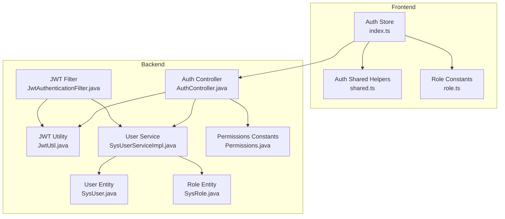
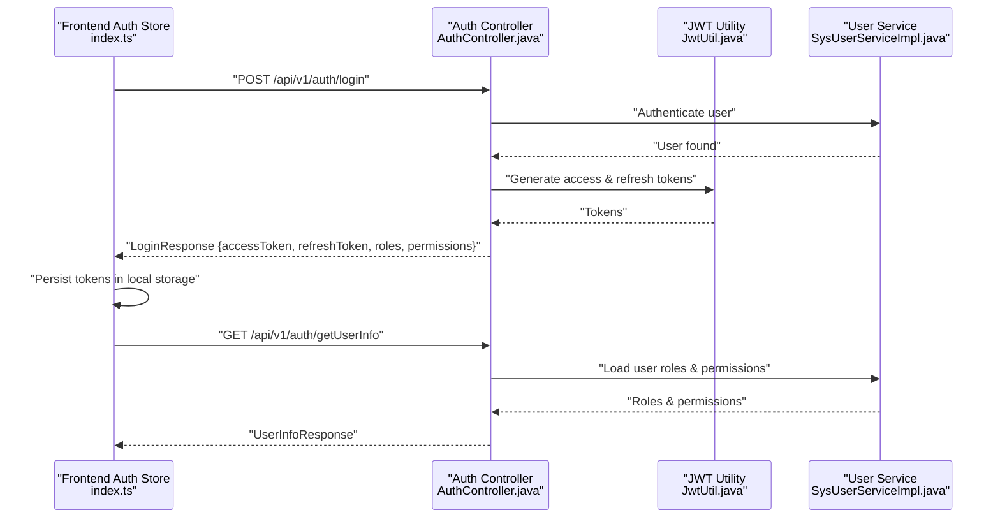
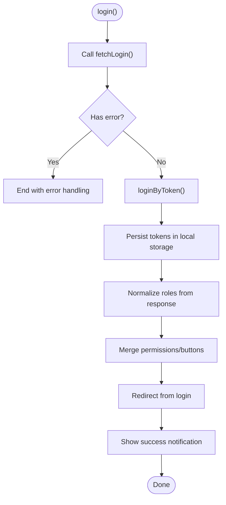
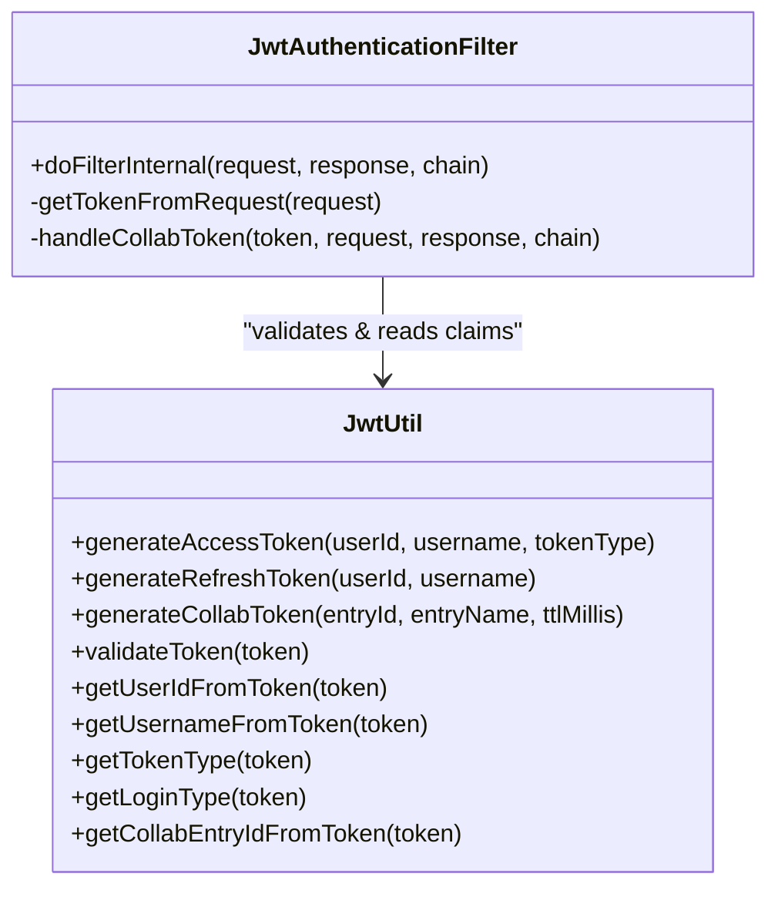
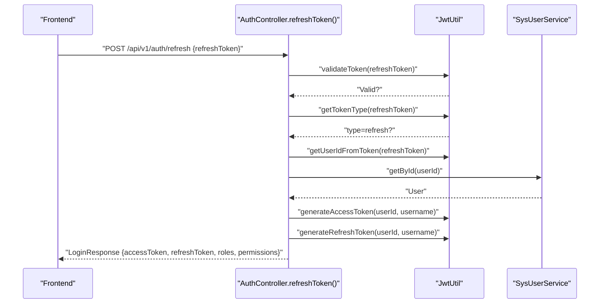
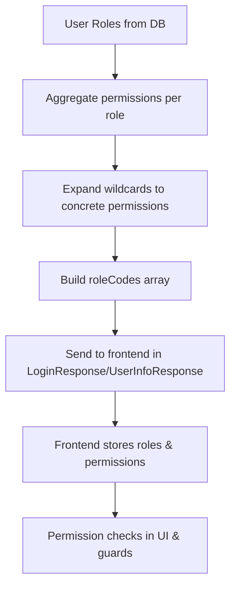
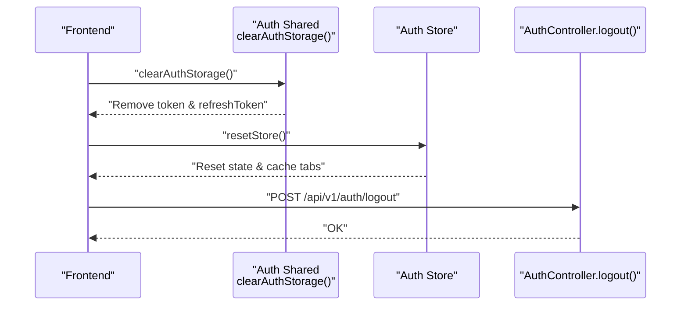
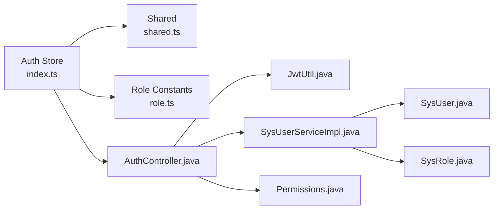

# Auth Store Module

<cite>
**Referenced Files in This Document**
- [index.ts](file://admin-web-soybean/src/store/modules/auth/index.ts)
- [shared.ts](file://admin-web-soybean/src/store/modules/auth/shared.ts)
- [role.ts](file://admin-web-soybean/src/constants/role.ts)
- [JwtAuthenticationFilter.java](file://admin-backend/src/main/java/com/qhiot/survey/security/JwtAuthenticationFilter.java)
- [JwtUtil.java](file://admin-backend/src/main/java/com/qhiot/survey/common/util/JwtUtil.java)
- [AuthController.java](file://admin-backend/src/main/java/com/qhiot/survey/controller/AuthController.java)
- [SysUserServiceImpl.java](file://admin-backend/src/main/java/com/qhiot/survey/service/impl/SysUserServiceImpl.java)
- [SysUser.java](file://admin-backend/src/main/java/com/qhiot/survey/entity/SysUser.java)
- [SysRole.java](file://admin-backend/src/main/java/com/qhiot/survey/entity/SysRole.java)
- [Permissions.java](file://admin-backend/src/main/java/com/qhiot/survey/common/constant/Permissions.java)
</cite>

## Table of Contents
1. [Introduction](#introduction)
2. [Project Structure](#project-structure)
3. [Core Components](#core-components)
4. [Architecture Overview](#architecture-overview)
5. [Detailed Component Analysis](#detailed-component-analysis)
6. [Dependency Analysis](#dependency-analysis)
7. [Performance Considerations](#performance-considerations)
8. [Troubleshooting Guide](#troubleshooting-guide)
9. [Conclusion](#conclusion)
10. [Appendices](#appendices)

## Introduction
This document describes the Auth store module responsible for managing user authentication state in the frontend (Vue + Pinia) and its integration with the backend (Spring Security + JWT). It covers login status, user profile, roles, permissions, token lifecycle, and session/logout behavior. It also documents the backend JWT utilities, filters, and controllers that implement authentication, role-based access control, and token refresh. Security considerations, state persistence, and extension guidelines are included to support safe and maintainable authentication features.

## Project Structure
The Auth store module spans the frontend and backend:

- Frontend (Vue + Pinia):
  - Auth store manages token, user info, roles, permissions, and login state.
  - Shared helpers manage token retrieval and clearing.
  - Role constants align with backend role codes.

- Backend (Spring Boot):
  - JWT utilities generate and validate tokens, including internal and collaboration login types.
  - A JWT filter extracts and validates tokens, authenticates users, and applies collaboration-specific access control.
  - An authentication controller handles login, SMS login, refresh, logout, and user info retrieval.
  - Services and entities model users, roles, and permissions.

**Diagram sources**
- [index.ts:1-203](file://admin-web-soybean/src/store/modules/auth/index.ts#L1-L203)
- [shared.ts:1-13](file://admin-web-soybean/src/store/modules/auth/shared.ts#L1-L13)
- [role.ts:1-16](file://admin-web-soybean/src/constants/role.ts#L1-L16)
- [AuthController.java:1-552](file://admin-backend/src/main/java/com/qhiot/survey/controller/AuthController.java#L1-L552)
- [JwtUtil.java:1-174](file://admin-backend/src/main/java/com/qhiot/survey/common/util/JwtUtil.java#L1-L174)
- [JwtAuthenticationFilter.java:1-135](file://admin-backend/src/main/java/com/qhiot/survey/security/JwtAuthenticationFilter.java#L1-L135)
- [SysUserServiceImpl.java:1-486](file://admin-backend/src/main/java/com/qhiot/survey/service/impl/SysUserServiceImpl.java#L1-L486)
- [SysUser.java:1-95](file://admin-backend/src/main/java/com/qhiot/survey/entity/SysUser.java#L1-L95)
- [SysRole.java:1-40](file://admin-backend/src/main/java/com/qhiot/survey/entity/SysRole.java#L1-L40)
- [Permissions.java:1-81](file://admin-backend/src/main/java/com/qhiot/survey/common/constant/Permissions.java#L1-L81)

**Section sources**
- [index.ts:1-203](file://admin-web-soybean/src/store/modules/auth/index.ts#L1-L203)
- [shared.ts:1-13](file://admin-web-soybean/src/store/modules/auth/shared.ts#L1-L13)
- [role.ts:1-16](file://admin-web-soybean/src/constants/role.ts#L1-L16)
- [AuthController.java:1-552](file://admin-backend/src/main/java/com/qhiot/survey/controller/AuthController.java#L1-L552)
- [JwtUtil.java:1-174](file://admin-backend/src/main/java/com/qhiot/survey/common/util/JwtUtil.java#L1-L174)
- [JwtAuthenticationFilter.java:1-135](file://admin-backend/src/main/java/com/qhiot/survey/security/JwtAuthenticationFilter.java#L1-L135)
- [SysUserServiceImpl.java:1-486](file://admin-backend/src/main/java/com/qhiot/survey/service/impl/SysUserServiceImpl.java#L1-L486)
- [SysUser.java:1-95](file://admin-backend/src/main/java/com/qhiot/survey/entity/SysUser.java#L1-L95)
- [SysRole.java:1-40](file://admin-backend/src/main/java/com/qhiot/survey/entity/SysRole.java#L1-L40)
- [Permissions.java:1-81](file://admin-backend/src/main/java/com/qhiot/survey/common/constant/Permissions.java#L1-L81)

## Core Components
- Frontend Auth Store
  - Maintains token, user info (userId, userName, realName, roles, permissions, buttons), and login state.
  - Provides login, login-by-token, user-info initialization, and reset-store routines.
  - Persists tokens in local storage and clears on logout/reset.

- Shared Auth Utilities
  - Retrieves token from local storage.
  - Clears token and refresh token entries.

- Role Constants
  - Defines role codes aligned with backend role codes for frontend checks.

- Backend JWT Utilities
  - Generates access and refresh tokens, collaboration tokens, validates tokens, and extracts claims.

- Backend JWT Filter
  - Extracts Authorization header, validates token, supports internal and collaboration login types, and applies whitelisted access for collaboration.

- Backend Auth Controller
  - Implements login (password and SMS), refresh, logout, and user info retrieval.
  - Aggregates roles and permissions for the response payload.

- User and Role Entities
  - Model users, roles, and permissions for RBAC.

- Permissions Constants
  - Centralized permission codes used for authorization checks.

**Section sources**
- [index.ts:22-202](file://admin-web-soybean/src/store/modules/auth/index.ts#L22-L202)
- [shared.ts:3-12](file://admin-web-soybean/src/store/modules/auth/shared.ts#L3-L12)
- [role.ts:1-16](file://admin-web-soybean/src/constants/role.ts#L1-L16)
- [JwtUtil.java:34-85](file://admin-backend/src/main/java/com/qhiot/survey/common/util/JwtUtil.java#L34-L85)
- [JwtAuthenticationFilter.java:44-81](file://admin-backend/src/main/java/com/qhiot/survey/security/JwtAuthenticationFilter.java#L44-L81)
- [AuthController.java:139-238](file://admin-backend/src/main/java/com/qhiot/survey/controller/AuthController.java#L139-L238)
- [SysUser.java:21-66](file://admin-backend/src/main/java/com/qhiot/survey/entity/SysUser.java#L21-L66)
- [SysRole.java:14-39](file://admin-backend/src/main/java/com/qhiot/survey/entity/SysRole.java#L14-L39)
- [Permissions.java:9-80](file://admin-backend/src/main/java/com/qhiot/survey/common/constant/Permissions.java#L9-L80)

## Architecture Overview
The authentication flow integrates frontend state management with backend JWT-based security:

- Frontend
  - On login, calls backend to authenticate and receive tokens.
  - Stores tokens and user info in the Auth store and local storage.
  - Uses tokens for subsequent requests via interceptors.
  - Initializes user info on app load if a token exists.

- Backend
  - Validates tokens via a filter; supports internal and collaboration login types.
  - Generates access and refresh tokens with appropriate claims.
  - Returns role codes and expanded permissions to the frontend.

**Diagram sources**
- [index.ts:75-108](file://admin-web-soybean/src/store/modules/auth/index.ts#L75-L108)
- [AuthController.java:139-238](file://admin-backend/src/main/java/com/qhiot/survey/controller/AuthController.java#L139-L238)
- [JwtUtil.java:34-51](file://admin-backend/src/main/java/com/qhiot/survey/common/util/JwtUtil.java#L34-L51)
- [SysUserServiceImpl.java:502-518](file://admin-backend/src/main/java/com/qhiot/survey/service/impl/SysUserServiceImpl.java#L502-L518)

**Section sources**
- [index.ts:75-108](file://admin-web-soybean/src/store/modules/auth/index.ts#L75-L108)
- [AuthController.java:139-238](file://admin-backend/src/main/java/com/qhiot/survey/controller/AuthController.java#L139-L238)
- [JwtUtil.java:34-51](file://admin-backend/src/main/java/com/qhiot/survey/common/util/JwtUtil.java#L34-L51)
- [SysUserServiceImpl.java:502-518](file://admin-backend/src/main/java/com/qhiot/survey/service/impl/SysUserServiceImpl.java#L502-L518)

## Detailed Component Analysis

### Frontend Auth Store (Pinia)
Responsibilities:
- Track login state via token presence.
- Persist tokens in local storage and clear on reset.
- Normalize backend role codes to lowercase for compatibility.
- Load user info and merge permissions/buttons from backend.
- Redirect after login and notify success.

Key behaviors:
- login(): Calls backend login, stores tokens, normalizes roles, merges permissions, and redirects.
- loginByToken(): Persists tokens and updates user info.
- getUserInfo(): Fetches roles and permissions from backend and merges into existing state.
- initUserInfo(): Loads user info if a token exists; resets store on failure.
- resetStore(): Clears storage, resets store state, caches tabs, and navigates to login if needed.

**Diagram sources**
- [index.ts:75-108](file://admin-web-soybean/src/store/modules/auth/index.ts#L75-L108)
- [index.ts:110-139](file://admin-web-soybean/src/store/modules/auth/index.ts#L110-L139)

**Section sources**
- [index.ts:22-202](file://admin-web-soybean/src/store/modules/auth/index.ts#L22-L202)
- [shared.ts:3-12](file://admin-web-soybean/src/store/modules/auth/shared.ts#L3-L12)
- [role.ts:1-16](file://admin-web-soybean/src/constants/role.ts#L1-L16)

### Backend JWT Utilities and Filter
JWT Utilities:
- Generate access and refresh tokens with expiration.
- Generate collaboration tokens with loginType and entryId.
- Validate tokens and extract claims (userId, username, tokenType, loginType, collabEntryId).

JWT Filter:
- Extracts Authorization header, validates token, and sets Spring Security context for internal users.
- Supports collaboration login type with separate authentication, whitelist checks, and access logging.

**Diagram sources**
- [JwtUtil.java:34-174](file://admin-backend/src/main/java/com/qhiot/survey/common/util/JwtUtil.java#L34-L174)
- [JwtAuthenticationFilter.java:44-135](file://admin-backend/src/main/java/com/qhiot/survey/security/JwtAuthenticationFilter.java#L44-L135)

**Section sources**
- [JwtUtil.java:34-174](file://admin-backend/src/main/java/com/qhiot/survey/common/util/JwtUtil.java#L34-L174)
- [JwtAuthenticationFilter.java:44-135](file://admin-backend/src/main/java/com/qhiot/survey/security/JwtAuthenticationFilter.java#L44-L135)

### Backend Auth Controller
Endpoints and responsibilities:
- GET /api/v1/auth/captcha: Generates and caches a 4-digit image captcha.
- POST /api/v1/auth/login: Authenticates by username/password, validates captcha, checks user status, records logs, generates tokens, and returns roles and permissions.
- POST /api/v1/auth/sms-login: Authenticates by phone and SMS code, generates tokens, and returns roles and permissions.
- POST /api/v1/auth/refresh: Validates refresh token, reissues new tokens, and returns roles and permissions.
- POST /api/v1/auth/logout: Clears security context.
- GET /api/v1/auth/getUserInfo: Returns current user’s roles and permissions.

Token refresh mechanism:
- Validates refresh token type and expiration.
- Confirms user existence and enabled status.
- Issues new access and refresh tokens.

**Diagram sources**
- [AuthController.java:399-427](file://admin-backend/src/main/java/com/qhiot/survey/controller/AuthController.java#L399-L427)
- [JwtUtil.java:45-51](file://admin-backend/src/main/java/com/qhiot/survey/common/util/JwtUtil.java#L45-L51)
- [SysUserServiceImpl.java:512-518](file://admin-backend/src/main/java/com/qhiot/survey/service/impl/SysUserServiceImpl.java#L512-L518)

**Section sources**
- [AuthController.java:139-238](file://admin-backend/src/main/java/com/qhiot/survey/controller/AuthController.java#L139-L238)
- [AuthController.java:240-299](file://admin-backend/src/main/java/com/qhiot/survey/controller/AuthController.java#L240-L299)
- [AuthController.java:399-427](file://admin-backend/src/main/java/com/qhiot/survey/controller/AuthController.java#L399-L427)
- [AuthController.java:480-550](file://admin-backend/src/main/java/com/qhiot/survey/controller/AuthController.java#L480-L550)

### Role-Based Access Control and Permissions
- Backend aggregates user roles and expands wildcard permissions into concrete codes.
- Frontend receives roleCodes and permissions arrays and normalizes roleCodes to lowercase.
- Permissions constants define canonical permission codes used across the system.

**Diagram sources**
- [AuthController.java:432-478](file://admin-backend/src/main/java/com/qhiot/survey/controller/AuthController.java#L432-L478)
- [SysUserServiceImpl.java:502-518](file://admin-backend/src/main/java/com/qhiot/survey/service/impl/SysUserServiceImpl.java#L502-L518)
- [Permissions.java:67-80](file://admin-backend/src/main/java/com/qhiot/survey/common/constant/Permissions.java#L67-L80)
- [index.ts:16-20](file://admin-web-soybean/src/store/modules/auth/index.ts#L16-L20)

**Section sources**
- [AuthController.java:432-478](file://admin-backend/src/main/java/com/qhiot/survey/controller/AuthController.java#L432-L478)
- [SysUserServiceImpl.java:502-518](file://admin-backend/src/main/java/com/qhiot/survey/service/impl/SysUserServiceImpl.java#L502-L518)
- [Permissions.java:9-80](file://admin-backend/src/main/java/com/qhiot/survey/common/constant/Permissions.java#L9-L80)
- [index.ts:16-20](file://admin-web-soybean/src/store/modules/auth/index.ts#L16-L20)

### Session Management and Logout
- Frontend logout/reset clears local storage tokens and resets the store, then navigates to login if needed.
- Backend logout clears the Spring Security context.
- Collaboration tokens are validated independently and logged; they do not rely on server-side sessions.

**Diagram sources**
- [shared.ts:8-12](file://admin-web-soybean/src/store/modules/auth/shared.ts#L8-L12)
- [index.ts:50-64](file://admin-web-soybean/src/store/modules/auth/index.ts#L50-L64)
- [AuthController.java:480-487](file://admin-backend/src/main/java/com/qhiot/survey/controller/AuthController.java#L480-L487)

**Section sources**
- [shared.ts:8-12](file://admin-web-soybean/src/store/modules/auth/shared.ts#L8-L12)
- [index.ts:50-64](file://admin-web-soybean/src/store/modules/auth/index.ts#L50-L64)
- [AuthController.java:480-487](file://admin-backend/src/main/java/com/qhiot/survey/controller/AuthController.java#L480-L487)

## Dependency Analysis
- Frontend Auth Store depends on:
  - Shared helpers for token retrieval and clearing.
  - Role constants for role comparisons.
  - API service wrappers for login and user info.
  - Route and tab stores for navigation and caching.

- Backend Auth Controller depends on:
  - JWT utility for token generation/validation.
  - User service for authentication and user info.
  - Role service for role and permission aggregation.
  - Redis for captcha and idempotency tokens.
  - Login log service for audit trails.

**Diagram sources**
- [index.ts:1-203](file://admin-web-soybean/src/store/modules/auth/index.ts#L1-L203)
- [shared.ts:1-13](file://admin-web-soybean/src/store/modules/auth/shared.ts#L1-L13)
- [role.ts:1-16](file://admin-web-soybean/src/constants/role.ts#L1-L16)
- [AuthController.java:1-552](file://admin-backend/src/main/java/com/qhiot/survey/controller/AuthController.java#L1-L552)
- [JwtUtil.java:1-174](file://admin-backend/src/main/java/com/qhiot/survey/common/util/JwtUtil.java#L1-L174)
- [SysUserServiceImpl.java:1-486](file://admin-backend/src/main/java/com/qhiot/survey/service/impl/SysUserServiceImpl.java#L1-L486)
- [SysUser.java:1-95](file://admin-backend/src/main/java/com/qhiot/survey/entity/SysUser.java#L1-L95)
- [SysRole.java:1-40](file://admin-backend/src/main/java/com/qhiot/survey/entity/SysRole.java#L1-L40)
- [Permissions.java:1-81](file://admin-backend/src/main/java/com/qhiot/survey/common/constant/Permissions.java#L1-L81)

**Section sources**
- [index.ts:1-203](file://admin-web-soybean/src/store/modules/auth/index.ts#L1-L203)
- [AuthController.java:1-552](file://admin-backend/src/main/java/com/qhiot/survey/controller/AuthController.java#L1-L552)

## Performance Considerations
- Token validation occurs per request via the JWT filter; keep token sizes minimal by avoiding excessive claims.
- Role and permission aggregation happens on login and refresh; avoid overly broad wildcard expansions to reduce payload size.
- Use Redis for short-lived items (captcha, idempotency) to minimize database load.
- Cache user lookups and role queries on the backend to reduce repeated DB hits during authentication.

## Troubleshooting Guide
Common issues and resolutions:
- Unauthorized responses after token expiration:
  - Trigger token refresh endpoint with a valid refresh token.
  - Ensure the refresh token is of type “refresh” and not expired.

- Role or permission mismatches:
  - Verify backend role assignments and permission JSON formatting.
  - Confirm frontend role normalization to lowercase and permission expansion.

- Collaboration token errors:
  - Check collaboration entry validity and whitelist access rules.
  - Review collaboration access logs for denied attempts.

- Login failures:
  - Confirm captcha validation and user status.
  - Check login failure counters and lockout logic.

**Section sources**
- [AuthController.java:399-427](file://admin-backend/src/main/java/com/qhiot/survey/controller/AuthController.java#L399-L427)
- [JwtAuthenticationFilter.java:86-122](file://admin-backend/src/main/java/com/qhiot/survey/security/JwtAuthenticationFilter.java#L86-L122)
- [SysUserServiceImpl.java:254-334](file://admin-backend/src/main/java/com/qhiot/survey/service/impl/SysUserServiceImpl.java#L254-L334)

## Conclusion
The Auth store module provides a robust, frontend-driven authentication state manager integrated with backend JWT-based security. It supports secure login, token lifecycle management, role and permission propagation, and collaboration access control. Following the guidelines below ensures consistent behavior and extensibility.

## Appendices

### State Definitions and Data Contracts
- User Credentials
  - Stored in local storage: token, refreshToken.
  - Provided by backend login endpoints.

- User Profile
  - Fields: userId, userName, realName.
  - Roles: roleCodes array normalized to lowercase.
  - Permissions: permissions array built from aggregated role permissions.
  - Buttons: buttons array (initially empty, populated by backend if applicable).

- Token Handling
  - Access token: short-lived, used for API requests.
  - Refresh token: longer-lived, used to obtain new access tokens.

- Role Assignments
  - roleCodes: derived from backend role codes.
  - Defaults to a user role if none assigned.

- Permission Matrices
  - permissions: expanded from role permissions.
  - Permissions constants define canonical codes.

**Section sources**
- [index.ts:110-139](file://admin-web-soybean/src/store/modules/auth/index.ts#L110-L139)
- [index.ts:141-178](file://admin-web-soybean/src/store/modules/auth/index.ts#L141-L178)
- [AuthController.java:432-478](file://admin-backend/src/main/java/com/qhiot/survey/controller/AuthController.java#L432-L478)
- [Permissions.java:9-80](file://admin-backend/src/main/java/com/qhiot/survey/common/constant/Permissions.java#L9-L80)

### Concrete Examples

- Authentication Flow (Password Login)
  - Steps: Request captcha → Submit credentials with captcha → Receive tokens and user info → Persist tokens → Load user info → Redirect and notify success.
  - References: [index.ts:75-108](file://admin-web-soybean/src/store/modules/auth/index.ts#L75-L108), [AuthController.java:139-238](file://admin-backend/src/main/java/com/qhiot/survey/controller/AuthController.java#L139-L238).

- Token Refresh Mechanism
  - Steps: Call refresh endpoint with refresh token → Validate token type and user status → Issue new tokens → Return updated user info.
  - References: [AuthController.java:399-427](file://admin-backend/src/main/java/com/qhiot/survey/controller/AuthController.java#L399-L427), [JwtUtil.java:45-51](file://admin-backend/src/main/java/com/qhiot/survey/common/util/JwtUtil.java#L45-L51).

- Permission Checking Patterns
  - Frontend: Compare roleCodes against ROLE constants and check permissions array membership.
  - Backend: Use @PreAuthorize with hasAuthority(permission) and v-permission directive in UI.
  - References: [role.ts:1-16](file://admin-web-soybean/src/constants/role.ts#L1-L16), [Permissions.java:9-80](file://admin-backend/src/main/java/com/qhiot/survey/common/constant/Permissions.java#L9-L80).

- Session Management and Logout
  - Frontend: clearAuthStorage() and resetStore().
  - Backend: clear Security context on logout.
  - References: [shared.ts:8-12](file://admin-web-soybean/src/store/modules/auth/shared.ts#L8-L12), [index.ts:50-64](file://admin-web-soybean/src/store/modules/auth/index.ts#L50-L64), [AuthController.java:480-487](file://admin-backend/src/main/java/com/qhiot/survey/controller/AuthController.java#L480-L487).

### Security Considerations
- Transport security: Use HTTPS to protect tokens in transit.
- Token storage: Store tokens in httpOnly cookies or secure storage; avoid exposing tokens in URLs.
- CSRF protection: Implement CSRF tokens for state-changing requests.
- Role and permission validation: Enforce both frontend and backend checks.
- Collaboration tokens: Restrict access via whitelists and audit logs.
- Rate limiting and account lockout: Prevent brute force attacks.

### Guidelines for Extending the Auth Module
- Add new permission codes in Permissions.java and ensure wildcard expansion covers them.
- Extend role constants in role.ts to match backend role codes.
- When adding new login methods, implement corresponding backend endpoints and update JWT utilities if needed.
- For collaboration features, define collab access rules and update the JWT filter whitelist.
- Keep token payloads minimal; avoid storing sensitive data in claims.
- Ensure logout clears both frontend and backend state consistently.