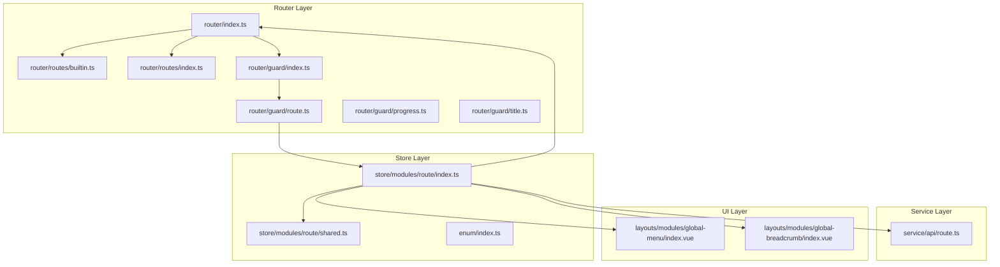
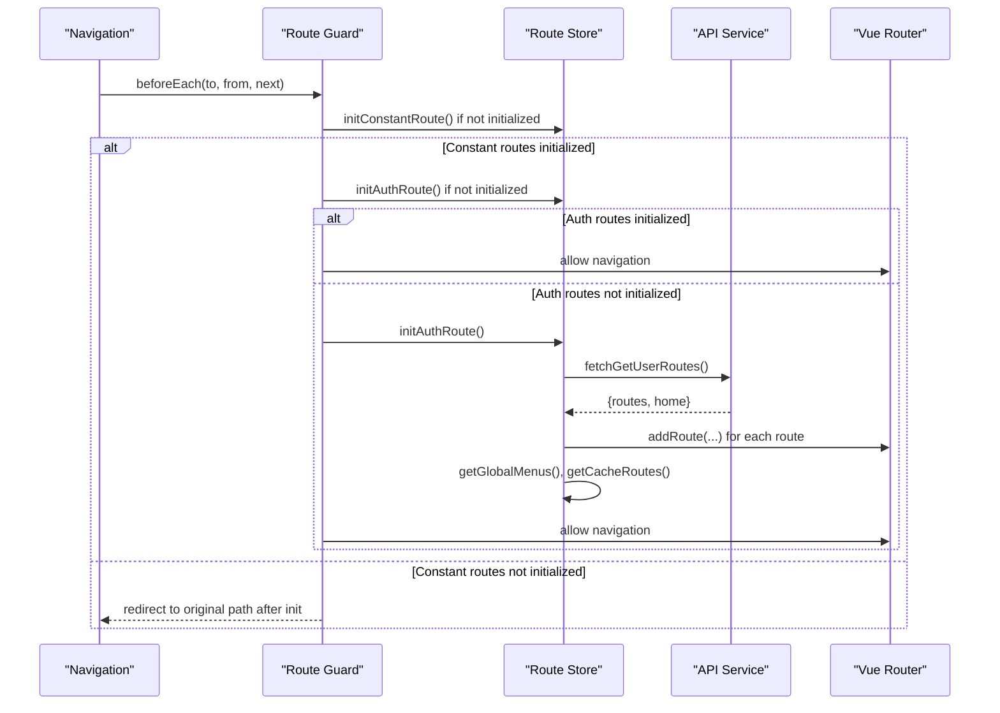
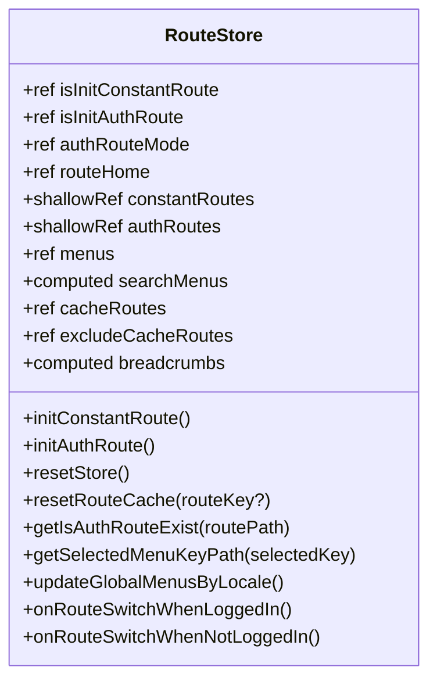
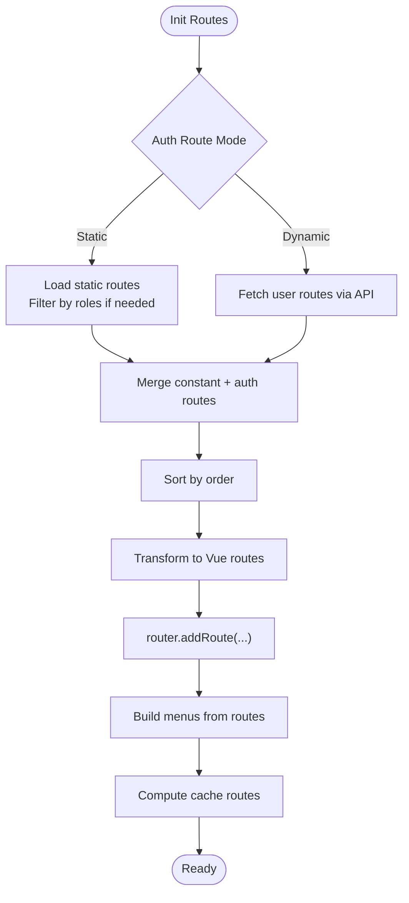
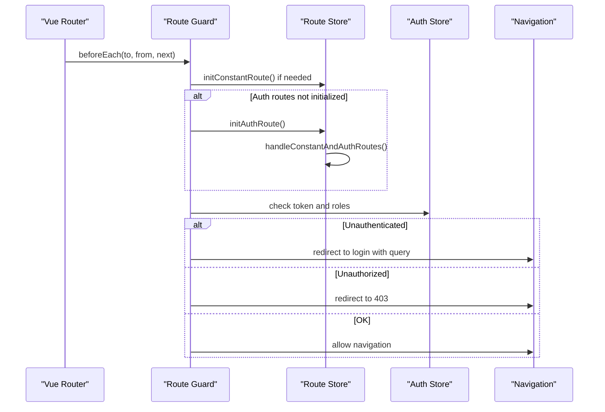
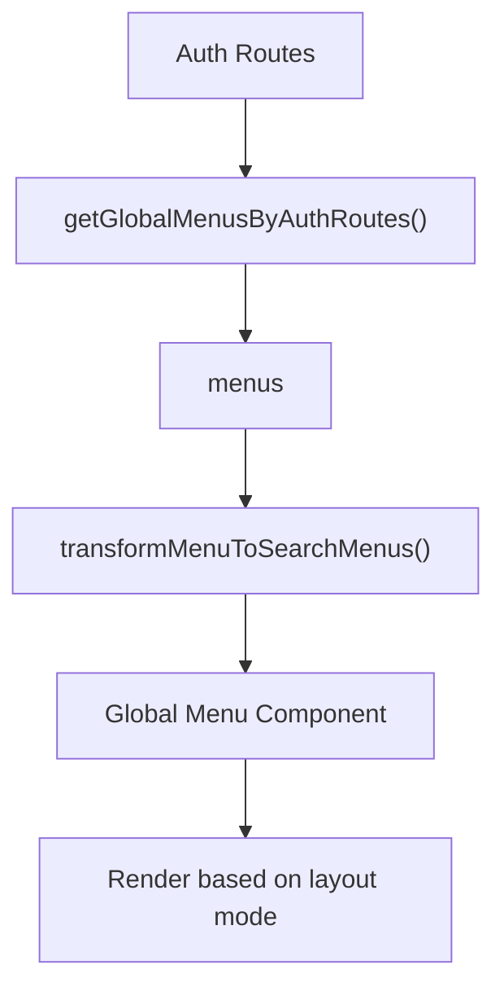
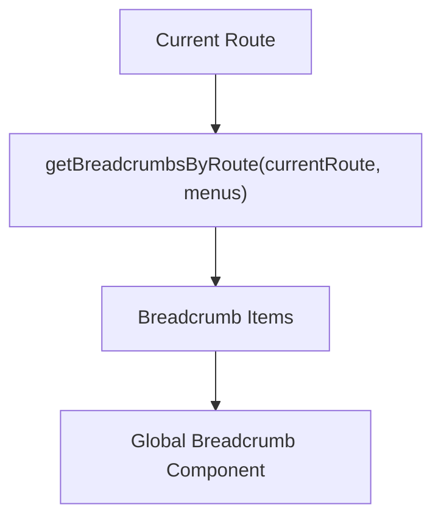
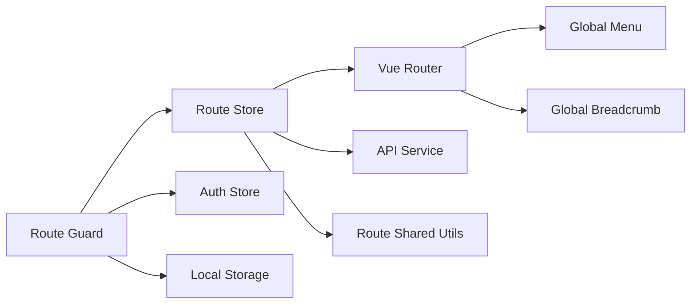

# Route Store Module

<cite>
**Referenced Files in This Document**
- [admin-web-soybean/src/store/modules/route/index.ts](file://admin-web-soybean/src/store/modules/route/index.ts)
- [admin-web-soybean/src/store/modules/route/shared.ts](file://admin-web-soybean/src/store/modules/route/shared.ts)
- [admin-web-soybean/src/router/index.ts](file://admin-web-soybean/src/router/index.ts)
- [admin-web-soybean/src/router/guard/index.ts](file://admin-web-soybean/src/router/guard/index.ts)
- [admin-web-soybean/src/router/guard/route.ts](file://admin-web-soybean/src/router/guard/route.ts)
- [admin-web-soybean/src/router/guard/progress.ts](file://admin-web-soybean/src/router/guard/progress.ts)
- [admin-web-soybean/src/router/guard/title.ts](file://admin-web-soybean/src/router/guard/title.ts)
- [admin-web-soybean/src/router/routes/index.ts](file://admin-web-soybean/src/router/routes/index.ts)
- [admin-web-soybean/src/router/routes/builtin.ts](file://admin-web-soybean/src/router/routes/builtin.ts)
- [admin-web-soybean/src/service/api/route.ts](file://admin-web-soybean/src/service/api/route.ts)
- [admin-web-soybean/src/layouts/modules/global-menu/index.vue](file://admin-web-soybean/src/layouts/modules/global-menu/index.vue)
- [admin-web-soybean/src/layouts/modules/global-breadcrumb/index.vue](file://admin-web-soybean/src/layouts/modules/global-breadcrumb/index.vue)
- [admin-web-soybean/src/typings/router.d.ts](file://admin-web-soybean/src/typings/router.d.ts)
- [admin-web-soybean/src/enum/index.ts](file://admin-web-soybean/src/enum/index.ts)
</cite>

## Table of Contents
1. [Introduction](#introduction)
2. [Project Structure](#project-structure)
3. [Core Components](#core-components)
4. [Architecture Overview](#architecture-overview)
5. [Detailed Component Analysis](#detailed-component-analysis)
6. [Dependency Analysis](#dependency-analysis)
7. [Performance Considerations](#performance-considerations)
8. [Troubleshooting Guide](#troubleshooting-guide)
9. [Conclusion](#conclusion)
10. [Appendices](#appendices)

## Introduction
This document explains the Route store module responsible for dynamic route state management in the frontend. It covers how routes are loaded and integrated with Vue Router, how menus and breadcrumbs are generated and synchronized, how active routes are tracked, and how navigation guards enforce authentication and permissions. It also documents state definitions, integration points, persistence and optimization strategies, and guidelines for extending the routing system.

## Project Structure
The Route store integrates with:
- Vue Router creation and built-in routes
- Route guards for initialization, authentication, authorization, and document title updates
- Elegant Router integration for transforming route definitions into Vue routes
- Pinia store for managing route metadata, menus, breadcrumbs, and cache lists
- API service layer for fetching constant and user-specific routes
- UI layout components for menu and breadcrumb rendering

**Diagram sources**
- [admin-web-soybean/src/router/index.ts:54-91](file://admin-web-soybean/src/router/index.ts#L54-L91)
- [admin-web-soybean/src/router/routes/builtin.ts:5-31](file://admin-web-soybean/src/router/routes/builtin.ts#L5-L31)
- [admin-web-soybean/src/router/routes/index.ts:1-245](file://admin-web-soybean/src/router/routes/index.ts#L1-L245)
- [admin-web-soybean/src/router/guard/index.ts:1-16](file://admin-web-soybean/src/router/guard/index.ts#L1-L16)
- [admin-web-soybean/src/router/guard/route.ts:1-214](file://admin-web-soybean/src/router/guard/route.ts#L1-L214)
- [admin-web-soybean/src/router/guard/progress.ts:1-12](file://admin-web-soybean/src/router/guard/progress.ts#L1-L12)
- [admin-web-soybean/src/router/guard/title.ts:1-14](file://admin-web-soybean/src/router/guard/title.ts#L1-L14)
- [admin-web-soybean/src/store/modules/route/index.ts:1-349](file://admin-web-soybean/src/store/modules/route/index.ts#L1-L349)
- [admin-web-soybean/src/store/modules/route/shared.ts:1-322](file://admin-web-soybean/src/store/modules/route/shared.ts#L1-L322)
- [admin-web-soybean/src/service/api/route.ts:1-21](file://admin-web-soybean/src/service/api/route.ts#L1-L21)
- [admin-web-soybean/src/layouts/modules/global-menu/index.vue:1-54](file://admin-web-soybean/src/layouts/modules/global-menu/index.vue#L1-L54)
- [admin-web-soybean/src/layouts/modules/global-breadcrumb/index.vue:1-56](file://admin-web-soybean/src/layouts/modules/global-breadcrumb/index.vue#L1-L56)

**Section sources**
- [admin-web-soybean/src/router/index.ts:1-92](file://admin-web-soybean/src/router/index.ts#L1-L92)
- [admin-web-soybean/src/router/routes/index.ts:1-245](file://admin-web-soybean/src/router/routes/index.ts#L1-L245)
- [admin-web-soybean/src/router/routes/builtin.ts:1-32](file://admin-web-soybean/src/router/routes/builtin.ts#L1-L32)
- [admin-web-soybean/src/router/guard/index.ts:1-16](file://admin-web-soybean/src/router/guard/index.ts#L1-L16)
- [admin-web-soybean/src/router/guard/route.ts:1-214](file://admin-web-soybean/src/router/guard/route.ts#L1-L214)
- [admin-web-soybean/src/store/modules/route/index.ts:1-349](file://admin-web-soybean/src/store/modules/route/index.ts#L1-L349)
- [admin-web-soybean/src/store/modules/route/shared.ts:1-322](file://admin-web-soybean/src/store/modules/route/shared.ts#L1-L322)
- [admin-web-soybean/src/service/api/route.ts:1-21](file://admin-web-soybean/src/service/api/route.ts#L1-L21)
- [admin-web-soybean/src/layouts/modules/global-menu/index.vue:1-54](file://admin-web-soybean/src/layouts/modules/global-menu/index.vue#L1-L54)
- [admin-web-soybean/src/layouts/modules/global-breadcrumb/index.vue:1-56](file://admin-web-soybean/src/layouts/modules/global-breadcrumb/index.vue#L1-L56)

## Core Components
- Route store (Pinia):
  - Manages route initialization modes (static vs dynamic), home route selection, constant and auth route sets, global menus, breadcrumbs, and cached route names.
  - Provides helpers to reset store and routes, compute breadcrumbs from current route and menus, and check route existence.
- Route guards:
  - Initialize routes on first navigation, enforce authentication and authorization, redirect to login or 403, and manage fallback to not-found handling.
  - Update document title and show progress indicator during navigation.
- Elegant Router integration:
  - Transforms route definitions into Vue routes and supports static generation with custom and generated routes.
- API service:
  - Fetches constant routes and user-specific routes, and checks route existence by name.
- UI components:
  - Global menu renders menus from the store and adapts to layout modes.
  - Global breadcrumb renders breadcrumbs derived from current route and menus.

**Section sources**
- [admin-web-soybean/src/store/modules/route/index.ts:26-349](file://admin-web-soybean/src/store/modules/route/index.ts#L26-L349)
- [admin-web-soybean/src/store/modules/route/shared.ts:1-322](file://admin-web-soybean/src/store/modules/route/shared.ts#L1-L322)
- [admin-web-soybean/src/router/guard/route.ts:1-214](file://admin-web-soybean/src/router/guard/route.ts#L1-L214)
- [admin-web-soybean/src/router/routes/index.ts:214-245](file://admin-web-soybean/src/router/routes/index.ts#L214-L245)
- [admin-web-soybean/src/service/api/route.ts:1-21](file://admin-web-soybean/src/service/api/route.ts#L1-L21)
- [admin-web-soybean/src/layouts/modules/global-menu/index.vue:1-54](file://admin-web-soybean/src/layouts/modules/global-menu/index.vue#L1-L54)
- [admin-web-soybean/src/layouts/modules/global-breadcrumb/index.vue:1-56](file://admin-web-soybean/src/layouts/modules/global-breadcrumb/index.vue#L1-L56)

## Architecture Overview
The Route store orchestrates route lifecycle and UI state synchronization:
- On first navigation, route guards initialize constant routes and, if needed, auth routes.
- The store merges and sorts routes, converts them to Vue routes, registers them with Vue Router, and builds menus and cache lists.
- Menus and breadcrumbs are derived from the consolidated route tree and react to locale changes.
- Navigation guards enforce auth and permissions and update UI state accordingly.

**Diagram sources**
- [admin-web-soybean/src/router/guard/route.ts:96-183](file://admin-web-soybean/src/router/guard/route.ts#L96-L183)
- [admin-web-soybean/src/store/modules/route/index.ts:151-230](file://admin-web-soybean/src/store/modules/route/index.ts#L151-L230)
- [admin-web-soybean/src/service/api/route.ts:8-11](file://admin-web-soybean/src/service/api/route.ts#L8-L11)

## Detailed Component Analysis

### Route Store State and Methods
- Initialization flags:
  - isInitConstantRoute, isInitAuthRoute track initialization state to avoid redundant work.
- Configurable settings:
  - authRouteMode selects static or dynamic route loading.
  - routeHome stores the home route key.
- Route collections:
  - constantRoutes and authRoutes hold route definitions.
  - removeRouteFns stores removal callbacks to reset routes cleanly.
- UI state:
  - menus holds global menu items derived from routes.
  - searchMenus is a flattened view of leaf menus for search.
  - cacheRoutes and excludeCacheRoutes manage keep-alive caching.
  - breadcrumbs is a computed array derived from current route and menus.
- Public methods:
  - initConstantRoute, initAuthRoute, handleConstantAndAuthRoutes, addRoutesToVueRouter, resetStore, resetVueRoutes, resetRouteCache, getIsAuthRouteExist, getSelectedMenuKeyPath, updateGlobalMenusByLocale, onRouteSwitchWhenLoggedIn, onRouteSwitchWhenNotLoggedIn.

**Diagram sources**
- [admin-web-soybean/src/store/modules/route/index.ts:26-349](file://admin-web-soybean/src/store/modules/route/index.ts#L26-L349)

**Section sources**
- [admin-web-soybean/src/store/modules/route/index.ts:26-349](file://admin-web-soybean/src/store/modules/route/index.ts#L26-L349)

### Dynamic Route Loading and Menu Generation
- Static mode:
  - Routes are generated from Elegant Router definitions and optionally filtered by user roles.
- Dynamic mode:
  - Routes and home are fetched via API and registered with Vue Router; root redirect is updated to the user’s home route.
- Menu generation:
  - Menus are derived from auth routes, excluding hidden entries, and icons are resolved from meta or defaults.
- Breadcrumb generation:
  - Breadcrumbs are computed from the current route and menus, supporting activeMenu overrides for nested routes.

**Diagram sources**
- [admin-web-soybean/src/store/modules/route/index.ts:177-247](file://admin-web-soybean/src/store/modules/route/index.ts#L177-L247)
- [admin-web-soybean/src/store/modules/route/shared.ts:76-147](file://admin-web-soybean/src/store/modules/route/shared.ts#L76-L147)
- [admin-web-soybean/src/router/routes/index.ts:214-245](file://admin-web-soybean/src/router/routes/index.ts#L214-L245)

**Section sources**
- [admin-web-soybean/src/store/modules/route/index.ts:177-247](file://admin-web-soybean/src/store/modules/route/index.ts#L177-L247)
- [admin-web-soybean/src/store/modules/route/shared.ts:76-147](file://admin-web-soybean/src/store/modules/route/shared.ts#L76-L147)
- [admin-web-soybean/src/router/routes/index.ts:214-245](file://admin-web-soybean/src/router/routes/index.ts#L214-L245)

### Route Guards and Navigation Control
- Initialization guard:
  - Ensures constant and auth routes are initialized before allowing navigation; redirects to the original path if initialization occurs mid-navigation.
- Authentication and authorization:
  - Redirects to login for protected routes when unauthenticated; redirects to 403 when authenticated but unauthorized.
- Document title and progress:
  - Updates document title using i18n keys and shows progress bar during navigation.

**Diagram sources**
- [admin-web-soybean/src/router/guard/route.ts:19-89](file://admin-web-soybean/src/router/guard/route.ts#L19-L89)
- [admin-web-soybean/src/store/modules/route/index.ts:177-230](file://admin-web-soybean/src/store/modules/route/index.ts#L177-L230)

**Section sources**
- [admin-web-soybean/src/router/guard/route.ts:1-214](file://admin-web-soybean/src/router/guard/route.ts#L1-L214)
- [admin-web-soybean/src/router/guard/progress.ts:1-12](file://admin-web-soybean/src/router/guard/progress.ts#L1-L12)
- [admin-web-soybean/src/router/guard/title.ts:1-14](file://admin-web-soybean/src/router/guard/title.ts#L1-L14)

### Menu Rendering Patterns
- Menu store:
  - menus populated from auth routes; searchMenus flattens leaf nodes for quick search.
- Menu component:
  - Renders different menu variants based on layout mode and theme; uses selected background color logic.
- Active menu tracking:
  - Breadcrumb logic uses activeMenu meta to highlight the intended menu item even when navigating nested routes.

**Diagram sources**
- [admin-web-soybean/src/store/modules/route/shared.ts:76-121](file://admin-web-soybean/src/store/modules/route/shared.ts#L76-L121)
- [admin-web-soybean/src/layouts/modules/global-menu/index.vue:1-54](file://admin-web-soybean/src/layouts/modules/global-menu/index.vue#L1-L54)

**Section sources**
- [admin-web-soybean/src/store/modules/route/shared.ts:76-121](file://admin-web-soybean/src/store/modules/route/shared.ts#L76-L121)
- [admin-web-soybean/src/layouts/modules/global-menu/index.vue:1-54](file://admin-web-soybean/src/layouts/modules/global-menu/index.vue#L1-L54)

### Breadcrumb Navigation
- Computed breadcrumbs:
  - Derived from current route and menus; supports activeMenu override for nested routes.
- UI integration:
  - Breadcrumb component displays hierarchical items and optional dropdown for nested children.

**Diagram sources**
- [admin-web-soybean/src/store/modules/route/shared.ts:265-302](file://admin-web-soybean/src/store/modules/route/shared.ts#L265-L302)
- [admin-web-soybean/src/layouts/modules/global-breadcrumb/index.vue:1-56](file://admin-web-soybean/src/layouts/modules/global-breadcrumb/index.vue#L1-L56)

**Section sources**
- [admin-web-soybean/src/store/modules/route/shared.ts:265-302](file://admin-web-soybean/src/store/modules/route/shared.ts#L265-L302)
- [admin-web-soybean/src/layouts/modules/global-breadcrumb/index.vue:1-56](file://admin-web-soybean/src/layouts/modules/global-breadcrumb/index.vue#L1-L56)

### Route Persistence and Navigation Optimization
- Route persistence:
  - Root redirect is dynamically updated to user home after auth route initialization.
- Cache optimization:
  - cacheRoutes tracks keep-alive enabled leaf routes; excludeCacheRoutes enables targeted cache resets.
- Initialization optimization:
  - Guard defers navigation until routes are ready; avoids repeated initialization.

**Section sources**
- [admin-web-soybean/src/store/modules/route/index.ts:275-287](file://admin-web-soybean/src/store/modules/route/index.ts#L275-L287)
- [admin-web-soybean/src/store/modules/route/index.ts:120-128](file://admin-web-soybean/src/store/modules/route/index.ts#L120-L128)
- [admin-web-soybean/src/router/guard/route.ts:96-183](file://admin-web-soybean/src/router/guard/route.ts#L96-L183)

### Guidelines for Implementing New Navigation Features
- Define route metadata:
  - Use RouteMeta fields (title, i18nKey, icon, localIcon, iconFontSize, order, hideInMenu, activeMenu, keepAlive, roles, constant, multiTab, fixedIndexInTab, query).
- Choose initialization mode:
  - Static mode for development or when routes are known at build time; dynamic mode for production with backend-driven routes.
- Integrate with guards:
  - Protected routes should not set constant; roles can be enforced in static mode; dynamic mode relies on backend permissions.
- Extend menus and breadcrumbs:
  - Ensure hideInMenu is set appropriately; use activeMenu for nested routes to highlight correct menu item.
- Optimize caching:
  - Enable keepAlive only for heavy components; use resetRouteCache to refresh when needed.
- Keep UI components in sync:
  - Menus and breadcrumbs derive from route definitions; avoid manual duplication.

**Section sources**
- [admin-web-soybean/src/typings/router.d.ts:4-72](file://admin-web-soybean/src/typings/router.d.ts#L4-L72)
- [admin-web-soybean/src/router/routes/index.ts:11-212](file://admin-web-soybean/src/router/routes/index.ts#L11-L212)
- [admin-web-soybean/src/store/modules/route/shared.ts:76-147](file://admin-web-soybean/src/store/modules/route/shared.ts#L76-L147)

## Dependency Analysis
- Route store depends on:
  - Vue Router for registration and current route access.
  - Elegant Router for transforming route definitions to Vue routes.
  - Auth store for user roles and superuser flag.
  - API service for dynamic route retrieval.
  - UI components for menu and breadcrumb rendering.
- Route guards depend on:
  - Route store for initialization and route existence checks.
  - Auth store for authentication and authorization.
  - Storage for token presence.

**Diagram sources**
- [admin-web-soybean/src/router/guard/route.ts:1-214](file://admin-web-soybean/src/router/guard/route.ts#L1-L214)
- [admin-web-soybean/src/store/modules/route/index.ts:1-349](file://admin-web-soybean/src/store/modules/route/index.ts#L1-L349)
- [admin-web-soybean/src/store/modules/route/shared.ts:1-322](file://admin-web-soybean/src/store/modules/route/shared.ts#L1-L322)
- [admin-web-soybean/src/service/api/route.ts:1-21](file://admin-web-soybean/src/service/api/route.ts#L1-L21)
- [admin-web-soybean/src/layouts/modules/global-menu/index.vue:1-54](file://admin-web-soybean/src/layouts/modules/global-menu/index.vue#L1-L54)
- [admin-web-soybean/src/layouts/modules/global-breadcrumb/index.vue:1-56](file://admin-web-soybean/src/layouts/modules/global-breadcrumb/index.vue#L1-L56)

**Section sources**
- [admin-web-soybean/src/router/guard/route.ts:1-214](file://admin-web-soybean/src/router/guard/route.ts#L1-L214)
- [admin-web-soybean/src/store/modules/route/index.ts:1-349](file://admin-web-soybean/src/store/modules/route/index.ts#L1-L349)

## Performance Considerations
- Prefer dynamic mode in production for scalability and reduced bundle size.
- Minimize keepAlive usage to lightweight components to reduce memory overhead.
- Use resetRouteCache selectively to refresh only affected routes after configuration changes.
- Avoid excessive nesting in routes to simplify breadcrumb computation and menu traversal.

## Troubleshooting Guide
- Routes not appearing:
  - Verify authRouteMode and ensure initConstantRoute/initAuthRoute are called by guards.
  - Confirm routes are added to Vue Router via handleConstantAndAuthRoutes/addRoutesToVueRouter.
- Incorrect menu or breadcrumb:
  - Check hideInMenu and activeMenu meta; ensure menus are rebuilt after locale changes via updateGlobalMenusByLocale.
- Navigation stuck on not-found:
  - Ensure getIsAuthRouteExist resolves correctly; guarded logic redirects to 403 for existing but unauthorized routes.
- Cache issues:
  - Use resetRouteCache to clear excluded cache routes after state changes.

**Section sources**
- [admin-web-soybean/src/router/guard/route.ts:170-183](file://admin-web-soybean/src/router/guard/route.ts#L170-L183)
- [admin-web-soybean/src/store/modules/route/index.ts:120-128](file://admin-web-soybean/src/store/modules/route/index.ts#L120-L128)
- [admin-web-soybean/src/store/modules/route/shared.ts:99-121](file://admin-web-soybean/src/store/modules/route/shared.ts#L99-L121)

## Conclusion
The Route store module centralizes dynamic route state management, integrating Vue Router, route guards, and UI components. It supports both static and dynamic route modes, generates menus and breadcrumbs from route definitions, and enforces authentication and authorization. Following the provided guidelines ensures maintainable and optimized navigation experiences.

## Appendices
- Store identifiers:
  - SetupStoreId includes Route as a store key for Pinia.

**Section sources**
- [admin-web-soybean/src/enum/index.ts:1-8](file://admin-web-soybean/src/enum/index.ts#L1-L8)