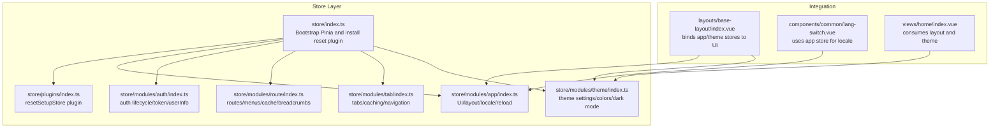
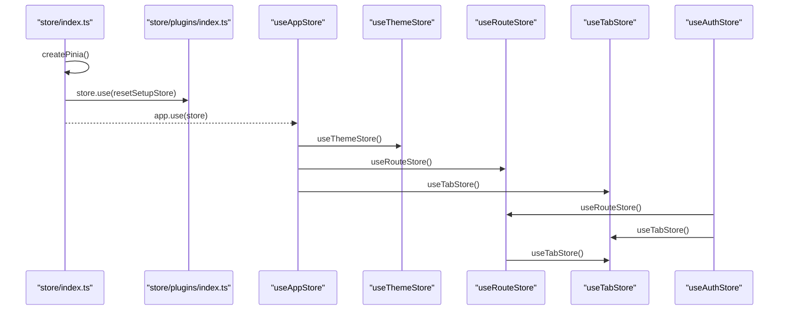
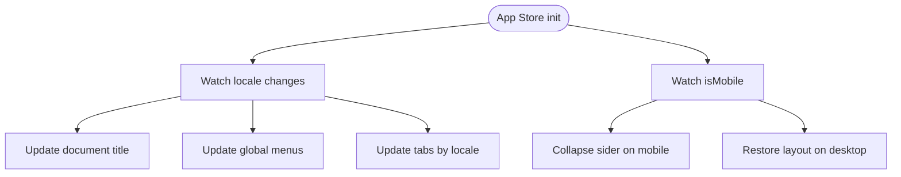
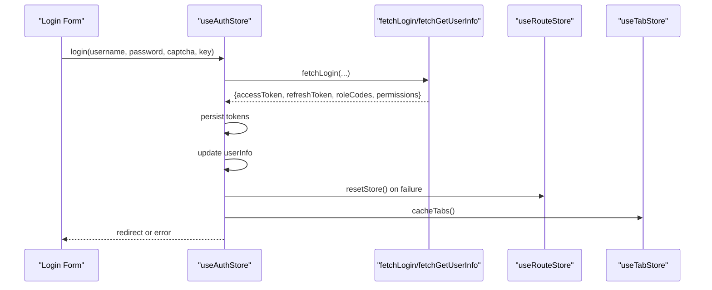
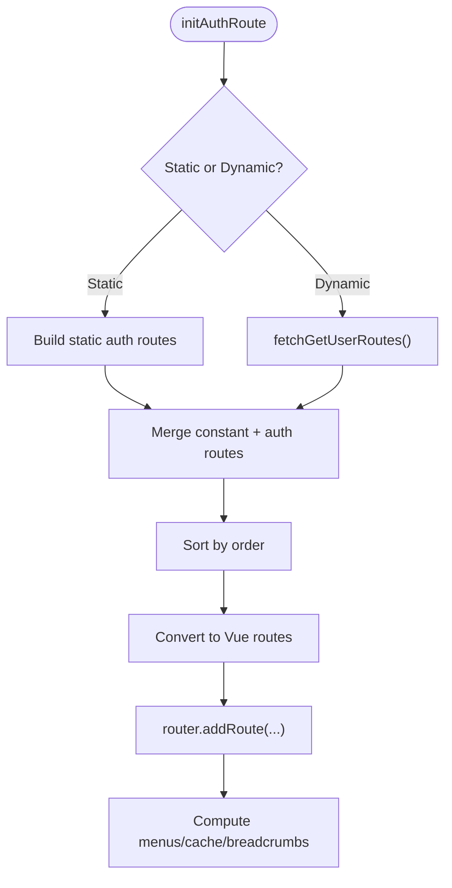
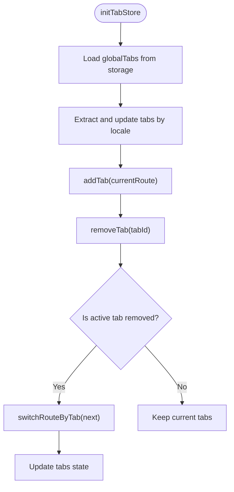
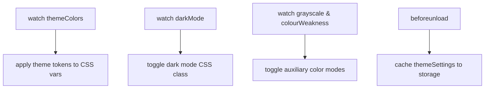
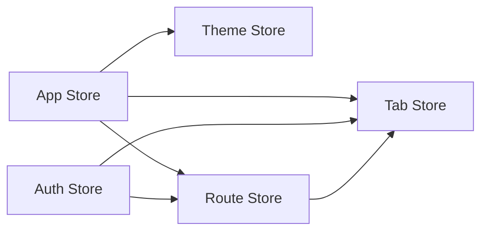

# State Management

<cite>
**Referenced Files in This Document**
- [store/index.ts](file://admin-web-soybean/src/store/index.ts)
- [store/plugins/index.ts](file://admin-web-soybean/src/store/plugins/index.ts)
- [store/modules/app/index.ts](file://admin-web-soybean/src/store/modules/app/index.ts)
- [store/modules/auth/index.ts](file://admin-web-soybean/src/store/modules/auth/index.ts)
- [store/modules/auth/shared.ts](file://admin-web-soybean/src/store/modules/auth/shared.ts)
- [store/modules/route/index.ts](file://admin-web-soybean/src/store/modules/route/index.ts)
- [store/modules/route/shared.ts](file://admin-web-soybean/src/store/modules/route/shared.ts)
- [store/modules/tab/index.ts](file://admin-web-soybean/src/store/modules/tab/index.ts)
- [store/modules/tab/shared.ts](file://admin-web-soybean/src/store/modules/tab/shared.ts)
- [store/modules/theme/index.ts](file://admin-web-soybean/src/store/modules/theme/index.ts)
- [layouts/base-layout/index.vue](file://admin-web-soybean/src/layouts/base-layout/index.vue)
- [components/common/lang-switch.vue](file://admin-web-soybean/src/components/common/lang-switch.vue)
- [views/home/index.vue](file://admin-web-soybean/src/views/home/index.vue)
</cite>

## Table of Contents
1. [Introduction](#introduction)
2. [Project Structure](#project-structure)
3. [Core Components](#core-components)
4. [Architecture Overview](#architecture-overview)
5. [Detailed Component Analysis](#detailed-component-analysis)
6. [Dependency Analysis](#dependency-analysis)
7. [Performance Considerations](#performance-considerations)
8. [Troubleshooting Guide](#troubleshooting-guide)
9. [Conclusion](#conclusion)
10. [Appendices](#appendices)

## Introduction
This document explains the Pinia-based state management system used in the frontend application. It focuses on the modular store architecture centered around four primary stores: app, auth, route, and tab. You will learn how state, actions, getters, and mutations are structured, how stores integrate with the Vue 3 Composition API, and how to persist and hydrate state across sessions. We also cover cross-component communication via stores, SSR considerations, debugging techniques, and best practices for organizing complex state management scenarios.

## Project Structure
The state management is organized under a dedicated store module with a clear separation of concerns:
- Central store bootstrap and plugin registration
- Modular stores for app, auth, route, tab, and theme
- Shared utilities for each store module to encapsulate pure logic
- Integration points in layout and components to consume reactive state

**Diagram sources**
- [store/index.ts:1-13](file://admin-web-soybean/src/store/index.ts#L1-L13)
- [store/plugins/index.ts:1-23](file://admin-web-soybean/src/store/plugins/index.ts#L1-L23)
- [store/modules/app/index.ts:1-170](file://admin-web-soybean/src/store/modules/app/index.ts#L1-L170)
- [store/modules/auth/index.ts:1-203](file://admin-web-soybean/src/store/modules/auth/index.ts#L1-L203)
- [store/modules/route/index.ts:1-349](file://admin-web-soybean/src/store/modules/route/index.ts#L1-L349)
- [store/modules/tab/index.ts:1-297](file://admin-web-soybean/src/store/modules/tab/index.ts#L1-L297)
- [store/modules/theme/index.ts:1-222](file://admin-web-soybean/src/store/modules/theme/index.ts#L1-L222)
- [layouts/base-layout/index.vue:1-149](file://admin-web-soybean/src/layouts/base-layout/index.vue#L1-L149)
- [components/common/lang-switch.vue:1-55](file://admin-web-soybean/src/components/common/lang-switch.vue#L1-L55)
- [views/home/index.vue:1-152](file://admin-web-soybean/src/views/home/index.vue#L1-L152)

**Section sources**
- [store/index.ts:1-13](file://admin-web-soybean/src/store/index.ts#L1-L13)
- [store/plugins/index.ts:1-23](file://admin-web-soybean/src/store/plugins/index.ts#L1-L23)
- [store/modules/app/index.ts:1-170](file://admin-web-soybean/src/store/modules/app/index.ts#L1-L170)
- [store/modules/auth/index.ts:1-203](file://admin-web-soybean/src/store/modules/auth/index.ts#L1-L203)
- [store/modules/route/index.ts:1-349](file://admin-web-soybean/src/store/modules/route/index.ts#L1-L349)
- [store/modules/tab/index.ts:1-297](file://admin-web-soybean/src/store/modules/tab/index.ts#L1-L297)
- [store/modules/theme/index.ts:1-222](file://admin-web-soybean/src/store/modules/theme/index.ts#L1-L222)

## Core Components
This section outlines the four core stores and their responsibilities.

- App Store
  - Manages UI-related flags (mobile detection, reload flag, content scrolling, sider collapse, theme drawer visibility), locale selection and synchronization, and integrates with theme and route/tab stores.
  - Provides actions to reload the page with optional animations and to update document titles based on locale.

- Auth Store
  - Handles authentication lifecycle: token retrieval, login initiation, user info hydration, and logout/reset.
  - Normalizes roles and permissions, supports static super role checks, and coordinates with route and tab stores during resets.

- Route Store
  - Initializes constant and authenticated routes, supports static and dynamic modes, computes global menus, breadcrumbs, and cached route names.
  - Exposes helpers to check route existence and to reset route cache.

- Tab Store
  - Maintains multi-tab navigation state, supports adding/removing/clearing tabs, switching routes by tab, and persists tabs to storage for recovery.

- Theme Store
  - Encapsulates theme settings, computed theme colors, dark mode, grayscale, and color weakness modes. Applies theme tokens globally and caches settings.

**Section sources**
- [store/modules/app/index.ts:14-170](file://admin-web-soybean/src/store/modules/app/index.ts#L14-L170)
- [store/modules/auth/index.ts:22-203](file://admin-web-soybean/src/store/modules/auth/index.ts#L22-L203)
- [store/modules/route/index.ts:26-349](file://admin-web-soybean/src/store/modules/route/index.ts#L26-L349)
- [store/modules/tab/index.ts:26-297](file://admin-web-soybean/src/store/modules/tab/index.ts#L26-L297)
- [store/modules/theme/index.ts:18-222](file://admin-web-soybean/src/store/modules/theme/index.ts#L18-L222)

## Architecture Overview
The stores are bootstrapped centrally and wired together to enable reactive UI updates and cross-store coordination.

**Diagram sources**
- [store/index.ts:6-12](file://admin-web-soybean/src/store/index.ts#L6-L12)
- [store/plugins/index.ts:10-22](file://admin-web-soybean/src/store/plugins/index.ts#L10-L22)
- [store/modules/app/index.ts:14-17](file://admin-web-soybean/src/store/modules/app/index.ts#L14-L17)
- [store/modules/auth/index.ts:22-26](file://admin-web-soybean/src/store/modules/auth/index.ts#L22-L26)
- [store/modules/route/index.ts:26-28](file://admin-web-soybean/src/store/modules/route/index.ts#L26-L28)
- [store/modules/tab/index.ts:26-29](file://admin-web-soybean/src/store/modules/tab/index.ts#L26-L29)

## Detailed Component Analysis

### App Store
- Responsibilities
  - Reactive UI flags and behaviors: mobile detection, reload cycle, content scrollability, sider collapse, mixed sider fixation.
  - Locale management: selectable languages, locale persistence, and cascading updates to document title, menus, and tabs.
  - Lifecycle integration: initializes dayjs locale and reacts to responsive changes to adjust layout and theme.

- Key Patterns
  - Composition API: refs, computed booleans, watchers, and event listeners.
  - Cross-store coordination: watches locale and triggers updates in route and tab stores; toggles theme layout on mobile transitions.

- Example Usage
  - Layout binds to app store flags to control sidebar collapse and full content mode.
  - Language switch component reads app store locale options and emits changes consumed by app store.

**Diagram sources**
- [store/modules/app/index.ts:87-133](file://admin-web-soybean/src/store/modules/app/index.ts#L87-L133)

**Section sources**
- [store/modules/app/index.ts:14-170](file://admin-web-soybean/src/store/modules/app/index.ts#L14-L170)
- [layouts/base-layout/index.vue:19-102](file://admin-web-soybean/src/layouts/base-layout/index.vue#L19-L102)
- [components/common/lang-switch.vue:34-36](file://admin-web-soybean/src/components/common/lang-switch.vue#L34-L36)

### Auth Store
- Responsibilities
  - Authentication lifecycle: login, token storage, user info hydration, and reset/cleanup.
  - Role normalization and permission handling; supports static super role mode.
  - Integration with route and tab stores to reset navigation and caches upon logout.

- Key Patterns
  - Composition API: refs for token, reactive object for user info, computed for login state and static super role.
  - Asynchronous actions: login and user info fetching with loading state management.
  - Storage utilities: token retrieval and cleanup helpers.

- Example Usage
  - Login action triggers token persistence and user info update, then redirects to the intended destination.
  - Reset action clears storage, resets store, navigates to login if needed, and resets route/tab stores.

**Diagram sources**
- [store/modules/auth/index.ts:75-108](file://admin-web-soybean/src/store/modules/auth/index.ts#L75-L108)
- [store/modules/auth/index.ts:110-139](file://admin-web-soybean/src/store/modules/auth/index.ts#L110-L139)
- [store/modules/auth/index.ts:141-178](file://admin-web-soybean/src/store/modules/auth/index.ts#L141-L178)
- [store/modules/auth/shared.ts:4-12](file://admin-web-soybean/src/store/modules/auth/shared.ts#L4-L12)

**Section sources**
- [store/modules/auth/index.ts:22-203](file://admin-web-soybean/src/store/modules/auth/index.ts#L22-L203)
- [store/modules/auth/shared.ts:1-13](file://admin-web-soybean/src/store/modules/auth/shared.ts#L1-L13)

### Route Store
- Responsibilities
  - Route initialization in static vs dynamic modes, merging constant and authenticated routes.
  - Computation of global menus, breadcrumbs, and cached route names.
  - Route existence checks and dynamic root redirect updates.

- Key Patterns
  - Composition API: refs for route home, flags for initialization, shallow refs for route lists.
  - Pure utilities: role-filtering, sorting, menu generation, breadcrumbs, cache name extraction, and route existence checks.

- Example Usage
  - After login, route store initializes user routes and sets home route and root redirect accordingly.
  - Menu updates react to locale changes via app store.

**Diagram sources**
- [store/modules/route/index.ts:177-230](file://admin-web-soybean/src/store/modules/route/index.ts#L177-L230)
- [store/modules/route/shared.ts:12-43](file://admin-web-soybean/src/store/modules/route/shared.ts#L12-L43)
- [store/modules/route/shared.ts:64-69](file://admin-web-soybean/src/store/modules/route/shared.ts#L64-L69)
- [store/modules/route/shared.ts:76-92](file://admin-web-soybean/src/store/modules/route/shared.ts#L76-L92)
- [store/modules/route/shared.ts:154-167](file://admin-web-soybean/src/store/modules/route/shared.ts#L154-L167)

**Section sources**
- [store/modules/route/index.ts:26-349](file://admin-web-soybean/src/store/modules/route/index.ts#L26-L349)
- [store/modules/route/shared.ts:1-322](file://admin-web-soybean/src/store/modules/route/shared.ts#L1-L322)

### Tab Store
- Responsibilities
  - Multi-tab state management: add/remove/clear tabs, switch routes by tab, and maintain active tab.
  - Persistence: caches tabs to storage and restores them on init when enabled by theme settings.
  - Localization: updates tab labels when locale changes.

- Key Patterns
  - Composition API: refs for tabs and active tab id, computed for derived tab lists.
  - Pure utilities: tab creation from routes, ID computation, filtering, fixed tabs, and localization updates.

- Example Usage
  - Layout initializes tabs from storage and adds the current route tab.
  - Removing the active tab switches to another tab and updates state.

**Diagram sources**
- [store/modules/tab/index.ts:62-71](file://admin-web-soybean/src/store/modules/tab/index.ts#L62-L71)
- [store/modules/tab/index.ts:98-117](file://admin-web-soybean/src/store/modules/tab/index.ts#L98-L117)
- [store/modules/tab/shared.ts:12-26](file://admin-web-soybean/src/store/modules/tab/shared.ts#L12-L26)
- [store/modules/tab/shared.ts:62-84](file://admin-web-soybean/src/store/modules/tab/shared.ts#L62-L84)

**Section sources**
- [store/modules/tab/index.ts:26-297](file://admin-web-soybean/src/store/modules/tab/index.ts#L26-L297)
- [store/modules/tab/shared.ts:1-251](file://admin-web-soybean/src/store/modules/tab/shared.ts#L1-L251)

### Theme Store
- Responsibilities
  - Centralizes theme settings, computed theme colors, and derived modes (dark, grayscale, color weakness).
  - Applies theme tokens globally and caches settings to storage.

- Key Patterns
  - Composition API: refs for settings, computed for derived modes and Ant Design theme.
  - Event-driven updates: watches dark mode and auxiliary modes to toggle CSS classes and apply theme tokens.

- Example Usage
  - Layout reads theme store to configure header, sider, and tab visibility and sizes.
  - App store toggles theme layout and drawer visibility.

**Diagram sources**
- [store/modules/theme/index.ts:172-199](file://admin-web-soybean/src/store/modules/theme/index.ts#L172-L199)
- [store/modules/theme/index.ts:158-169](file://admin-web-soybean/src/store/modules/theme/index.ts#L158-L169)

**Section sources**
- [store/modules/theme/index.ts:18-222](file://admin-web-soybean/src/store/modules/theme/index.ts#L18-L222)
- [layouts/base-layout/index.vue:106-141](file://admin-web-soybean/src/layouts/base-layout/index.vue#L106-L141)

## Dependency Analysis
The stores depend on each other to coordinate UI, routing, and navigation.

**Diagram sources**
- [store/modules/app/index.ts:14-17](file://admin-web-soybean/src/store/modules/app/index.ts#L14-L17)
- [store/modules/auth/index.ts:22-26](file://admin-web-soybean/src/store/modules/auth/index.ts#L22-L26)
- [store/modules/route/index.ts:26-28](file://admin-web-soybean/src/store/modules/route/index.ts#L26-L28)
- [store/modules/tab/index.ts:26-29](file://admin-web-soybean/src/store/modules/tab/index.ts#L26-L29)

**Section sources**
- [store/modules/app/index.ts:14-170](file://admin-web-soybean/src/store/modules/app/index.ts#L14-L170)
- [store/modules/auth/index.ts:22-203](file://admin-web-soybean/src/store/modules/auth/index.ts#L22-L203)
- [store/modules/route/index.ts:26-349](file://admin-web-soybean/src/store/modules/route/index.ts#L26-L349)
- [store/modules/tab/index.ts:26-297](file://admin-web-soybean/src/store/modules/tab/index.ts#L26-L297)

## Performance Considerations
- Prefer shallow refs for large route arrays to avoid deep reactivity overhead.
- Use computed derivations (e.g., theme colors, breadcrumbs) to minimize recomputations.
- Debounce or batch UI-triggered updates when toggling layout or theme settings.
- Limit watchers to essential state slices; scope watchers with effect scopes to prevent leaks.
- Cache heavy computations (e.g., theme tokens) and reuse across renders.

## Troubleshooting Guide
- Debugging state changes
  - Use the browser’s Vue DevTools to inspect store state and actions.
  - Temporarily add logging in actions (e.g., login, user info hydration) to trace async flows.
  - Verify token presence and expiration via storage inspection.

- Common issues
  - Routes not updating after login: ensure route store initialization is awaited and that reset flows are invoked on failures.
  - Tabs not restored: confirm theme tab cache setting and that beforeunload caching is triggered.
  - Locale mismatch: ensure locale updates cascade to menus and tabs via app store watchers.

**Section sources**
- [store/modules/auth/index.ts:75-108](file://admin-web-soybean/src/store/modules/auth/index.ts#L75-L108)
- [store/modules/tab/index.ts:264-273](file://admin-web-soybean/src/store/modules/tab/index.ts#L264-L273)
- [store/modules/app/index.ts:119-133](file://admin-web-soybean/src/store/modules/app/index.ts#L119-L133)

## Conclusion
The state management system leverages Pinia with a modular architecture that cleanly separates concerns across app, auth, route, tab, and theme stores. By combining Composition API primitives with targeted watchers and pure utilities, the system achieves reactive UI updates, robust cross-component communication, and maintainable state logic. Following the outlined patterns and best practices ensures scalability and reliability for complex state management scenarios.

## Appendices

### Store Usage Examples in Components
- Layout binding to app and theme stores
  - Base layout consumes app store flags and theme store settings to render responsive UI.
  - Reference: [layouts/base-layout/index.vue:19-102](file://admin-web-soybean/src/layouts/base-layout/index.vue#L19-L102)

- Language switch component using app store
  - Reads locale options and emits language changes handled by app store.
  - Reference: [components/common/lang-switch.vue:34-36](file://admin-web-soybean/src/components/common/lang-switch.vue#L34-L36)

- Home view consuming theme
  - Demonstrates theme-aware rendering in a view component.
  - Reference: [views/home/index.vue:1-152](file://admin-web-soybean/src/views/home/index.vue#L1-L152)

### State Persistence Strategies
- Token persistence
  - Tokens are persisted to storage and cleared on logout/reset.
  - References: [store/modules/auth/shared.ts:4-12](file://admin-web-soybean/src/store/modules/auth/shared.ts#L4-L12)

- Theme settings persistence
  - Theme settings are cached on beforeunload and restored on load.
  - References: [store/modules/theme/index.ts:158-169](file://admin-web-soybean/src/store/modules/theme/index.ts#L158-L169)

- Tab persistence
  - Tabs are cached to storage and restored on init when enabled.
  - References: [store/modules/tab/index.ts:62-71](file://admin-web-soybean/src/store/modules/tab/index.ts#L62-L71), [store/modules/tab/index.ts:264-273](file://admin-web-soybean/src/store/modules/tab/index.ts#L264-L273)

### Cross-Component Communication
- App store coordinates locale changes across route and tab stores.
  - References: [store/modules/app/index.ts:119-133](file://admin-web-soybean/src/store/modules/app/index.ts#L119-L133)

- Auth store resets route and tab stores on logout.
  - References: [store/modules/auth/index.ts:50-64](file://admin-web-soybean/src/store/modules/auth/index.ts#L50-L64)

### SSR Considerations
- Hydration
  - Initialize stores after app bootstrap; hydrate from storage only on client-side to avoid mismatches.
  - References: [store/modules/auth/index.ts:180-190](file://admin-web-soybean/src/store/modules/auth/index.ts#L180-L190), [store/modules/tab/index.ts:62-71](file://admin-web-soybean/src/store/modules/tab/index.ts#L62-L71)

- Route initialization
  - Ensure route store initialization respects server-rendered state and falls back to static routes when API calls are unavailable.
  - References: [store/modules/route/index.ts:152-175](file://admin-web-soybean/src/store/modules/route/index.ts#L152-L175), [store/modules/route/index.ts:211-230](file://admin-web-soybean/src/store/modules/route/index.ts#L211-L230)

### Naming Conventions and Best Practices
- Store naming
  - Use singular nouns for store names (e.g., app, auth, route, tab, theme).
- Actions
  - Prefix asynchronous actions with domain verbs (e.g., login, resetStore, initAuthRoute).
- Getters
  - Use computed for derived state and keep getters pure.
- Mutations
  - Prefer direct ref assignments for primitive state; use reactive objects for complex nested state.
- Utilities
  - Place pure logic in shared utilities to improve testability and reuse.
- Organization
  - Keep store modules self-contained with clear boundaries; expose only necessary state and actions.