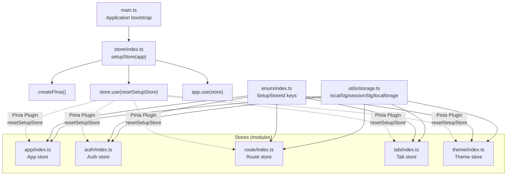
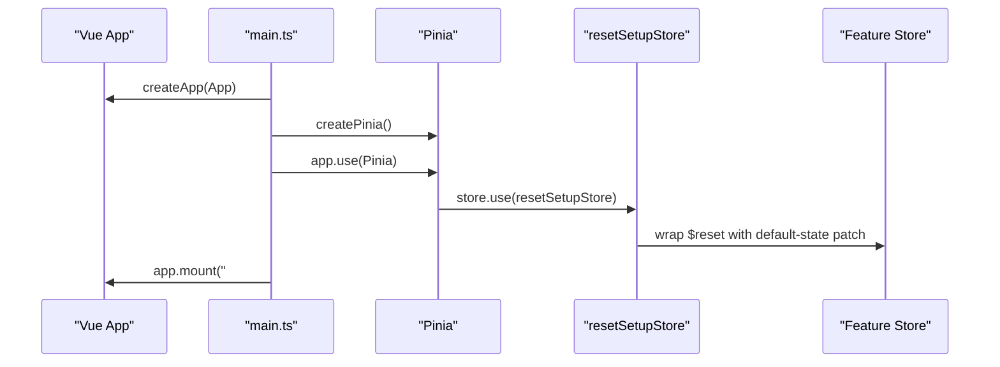
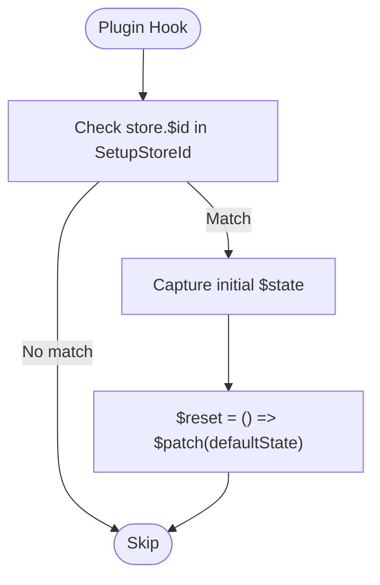
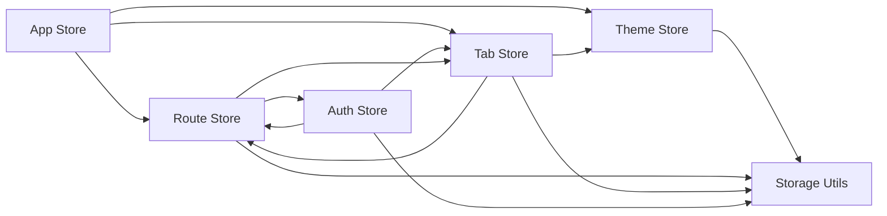

# Store Architecture

<cite>
**Referenced Files in This Document**
- [main.ts](file://admin-web-soybean/src/main.ts)
- [store/index.ts](file://admin-web-soybean/src/store/index.ts)
- [store/plugins/index.ts](file://admin-web-soybean/src/store/plugins/index.ts)
- [enum/index.ts](file://admin-web-soybean/src/enum/index.ts)
- [store/modules/app/index.ts](file://admin-web-soybean/src/store/modules/app/index.ts)
- [store/modules/auth/index.ts](file://admin-web-soybean/src/store/modules/auth/index.ts)
- [store/modules/auth/shared.ts](file://admin-web-soybean/src/store/modules/auth/shared.ts)
- [store/modules/route/index.ts](file://admin-web-soybean/src/store/modules/route/index.ts)
- [store/modules/route/shared.ts](file://admin-web-soybean/src/store/modules/route/shared.ts)
- [store/modules/tab/index.ts](file://admin-web-soybean/src/store/modules/tab/index.ts)
- [store/modules/tab/shared.ts](file://admin-web-soybean/src/store/modules/tab/shared.ts)
- [store/modules/theme/index.ts](file://admin-web-soybean/src/store/modules/theme/index.ts)
- [store/modules/theme/shared.ts](file://admin-web-soybean/src/store/modules/theme/shared.ts)
- [utils/storage.ts](file://admin-web-soybean/src/utils/storage.ts)
</cite>

## Table of Contents
1. [Introduction](#introduction)
2. [Project Structure](#project-structure)
3. [Core Components](#core-components)
4. [Architecture Overview](#architecture-overview)
5. [Detailed Component Analysis](#detailed-component-analysis)
6. [Dependency Analysis](#dependency-analysis)
7. [Performance Considerations](#performance-considerations)
8. [Troubleshooting Guide](#troubleshooting-guide)
9. [Conclusion](#conclusion)
10. [Appendices](#appendices)

## Introduction
This document explains the Pinia store architecture used in the Vue 3 admin frontend. It covers store initialization, the plugin system, and integration with the Vue 3 application lifecycle. It documents store configuration patterns, plugin registration, reset functionality, hydration and persistence strategies, and offers guidelines for organizing stores, naming conventions, and best practices for large-scale state management.

## Project Structure
The store is initialized during application bootstrap and registered as a Vue plugin. Stores are organized by domain features under a dedicated modules folder. A custom Pinia plugin augments setup-syntax stores with a robust reset mechanism. Persistence is handled via a thin storage abstraction that supports local/session storage and IndexedDB-like wrappers.

**Diagram sources**
- [main.ts:15-47](file://admin-web-soybean/src/main.ts#L15-L47)
- [store/index.ts:6-12](file://admin-web-soybean/src/store/index.ts#L6-L12)
- [store/plugins/index.ts:10-22](file://admin-web-soybean/src/store/plugins/index.ts#L10-L22)
- [enum/index.ts:1-8](file://admin-web-soybean/src/enum/index.ts#L1-L8)
- [utils/storage.ts:1-10](file://admin-web-soybean/src/utils/storage.ts#L1-L10)

**Section sources**
- [main.ts:15-47](file://admin-web-soybean/src/main.ts#L15-L47)
- [store/index.ts:6-12](file://admin-web-soybean/src/store/index.ts#L6-L12)
- [enum/index.ts:1-8](file://admin-web-soybean/src/enum/index.ts#L1-L8)
- [utils/storage.ts:1-10](file://admin-web-soybean/src/utils/storage.ts#L1-L10)

## Core Components
- Application bootstrap initializes plugins and mounts the app before creating and registering the Pinia store.
- The store initialization function creates Pinia, registers the reset plugin, and installs the store into the Vue app.
- A Pinia plugin extends setup-syntax stores by overriding $reset to restore initial state via deep cloning.
- Enumerated store identifiers are used consistently across stores to enable targeted plugin behavior.
- Persistence utilities provide typed access to local/session storage and IndexedDB-like storage.

Key implementation references:
- Application bootstrap and store registration: [main.ts:39](file://admin-web-soybean/src/main.ts#L39), [main.ts:41](file://admin-web-soybean/src/main.ts#L41), [main.ts:43](file://admin-web-soybean/src/main.ts#L43), [main.ts:47](file://admin-web-soybean/src/main.ts#L47)
- Store setup and plugin registration: [store/index.ts:6-12](file://admin-web-soybean/src/store/index.ts#L6-L12)
- Reset plugin logic: [store/plugins/index.ts:10-22](file://admin-web-soybean/src/store/plugins/index.ts#L10-L22)
- Store IDs: [enum/index.ts:1-8](file://admin-web-soybean/src/enum/index.ts#L1-L8)
- Storage utilities: [utils/storage.ts:1-10](file://admin-web-soybean/src/utils/storage.ts#L1-L10)

**Section sources**
- [main.ts:39](file://admin-web-soybean/src/main.ts#L39)
- [main.ts:41](file://admin-web-soybean/src/main.ts#L41)
- [main.ts:43](file://admin-web-soybean/src/main.ts#L43)
- [main.ts:47](file://admin-web-soybean/src/main.ts#L47)
- [store/index.ts:6-12](file://admin-web-soybean/src/store/index.ts#L6-L12)
- [store/plugins/index.ts:10-22](file://admin-web-soybean/src/store/plugins/index.ts#L10-L22)
- [enum/index.ts:1-8](file://admin-web-soybean/src/enum/index.ts#L1-L8)
- [utils/storage.ts:1-10](file://admin-web-soybean/src/utils/storage.ts#L1-L10)

## Architecture Overview
The store architecture follows a modular, domain-driven pattern:
- Initialization: The app bootstraps plugins, then creates and installs Pinia.
- Plugin system: A single Pinia plugin injects a deterministic $reset for setup-syntax stores.
- Domain stores: Feature-specific stores encapsulate state, derived data, and actions.
- Persistence: Stores leverage a unified storage abstraction for caching and hydration.

**Diagram sources**
- [main.ts:32-47](file://admin-web-soybean/src/main.ts#L32-L47)
- [store/index.ts:6-12](file://admin-web-soybean/src/store/index.ts#L6-L12)
- [store/plugins/index.ts:10-22](file://admin-web-soybean/src/store/plugins/index.ts#L10-L22)

## Detailed Component Analysis

### Store Initialization and Lifecycle
- The application creates the Vue app, sets up global plugins, and then initializes the Pinia store.
- The store is installed into the app, ensuring all components can access stores via composables.
- The store initialization function centralizes plugin registration and ensures consistent behavior across stores.

References:
- [main.ts:32-47](file://admin-web-soybean/src/main.ts#L32-L47)
- [store/index.ts:6-12](file://admin-web-soybean/src/store/index.ts#L6-L12)

**Section sources**
- [main.ts:32-47](file://admin-web-soybean/src/main.ts#L32-L47)
- [store/index.ts:6-12](file://admin-web-soybean/src/store/index.ts#L6-L12)

### Plugin System: Reset for Setup Stores
- The plugin inspects the store’s $id against known setup-syntax store identifiers.
- If matched, it captures the initial state and overrides $reset to patch back to the default snapshot.
- This guarantees deterministic resets for stores defined with the composition API.

**Diagram sources**
- [store/plugins/index.ts:10-22](file://admin-web-soybean/src/store/plugins/index.ts#L10-L22)
- [enum/index.ts:1-8](file://admin-web-soybean/src/enum/index.ts#L1-L8)

**Section sources**
- [store/plugins/index.ts:10-22](file://admin-web-soybean/src/store/plugins/index.ts#L10-L22)
- [enum/index.ts:1-8](file://admin-web-soybean/src/enum/index.ts#L1-L8)

### App Store: UI and Environment State
- Manages UI flags, responsive behavior, internationalization, and theme drawer visibility.
- Wires watchers to synchronize locale changes, document title updates, and layout adjustments.
- Uses scoped effects and event listeners to manage lifecycle and persistence.

Key references:
- Store definition and exports: [store/modules/app/index.ts:14-169](file://admin-web-soybean/src/store/modules/app/index.ts#L14-L169)
- Locale and title updates: [store/modules/app/index.ts:74-81](file://admin-web-soybean/src/store/modules/app/index.ts#L74-L81)
- Responsive behavior and watchers: [store/modules/app/index.ts:87-133](file://admin-web-soybean/src/store/modules/app/index.ts#L87-L133)

**Section sources**
- [store/modules/app/index.ts:14-169](file://admin-web-soybean/src/store/modules/app/index.ts#L14-L169)

### Auth Store: Authentication and User Info
- Holds token and user info, exposes login and reset flows.
- Hydrates from storage on startup and clears storage on logout/reset.
- Integrates with route and tab stores to maintain coherent navigation state.

Key references:
- Store definition and exports: [store/modules/auth/index.ts:22-202](file://admin-web-soybean/src/store/modules/auth/index.ts#L22-L202)
- Token and storage helpers: [store/modules/auth/shared.ts:1-13](file://admin-web-soybean/src/store/modules/auth/shared.ts#L1-L13)
- Reset flow and redirects: [store/modules/auth/index.ts:50-64](file://admin-web-soybean/src/store/modules/auth/index.ts#L50-L64)

**Section sources**
- [store/modules/auth/index.ts:22-202](file://admin-web-soybean/src/store/modules/auth/index.ts#L22-L202)
- [store/modules/auth/shared.ts:1-13](file://admin-web-soybean/src/store/modules/auth/shared.ts#L1-L13)

### Route Store: Dynamic Routing and Menus
- Supports static and dynamic route modes, hydrates constant and auth routes, and manages keep-alive caches.
- Provides helpers to compute menus, breadcrumbs, and cache invalidation.
- Resets Vue router state and re-initializes routes when needed.

Key references:
- Store definition and exports: [store/modules/route/index.ts:26-348](file://admin-web-soybean/src/store/modules/route/index.ts#L26-L348)
- Route initialization and mode switching: [store/modules/route/index.ts:151-230](file://admin-web-soybean/src/store/modules/route/index.ts#L151-L230)
- Menu and breadcrumb computation: [store/modules/route/index.ts:81-131](file://admin-web-soybean/src/store/modules/route/index.ts#L81-L131)
- Shared helpers: [store/modules/route/shared.ts:1-200](file://admin-web-soybean/src/store/modules/route/shared.ts#L1-L200)

**Section sources**
- [store/modules/route/index.ts:26-348](file://admin-web-soybean/src/store/modules/route/index.ts#L26-L348)
- [store/modules/route/shared.ts:1-200](file://admin-web-soybean/src/store/modules/route/shared.ts#L1-L200)

### Tab Store: Multi-Tab Navigation
- Maintains tab collection, active tab, and navigation actions.
- Hydrates tabs from storage and persists on unload when enabled.
- Provides operations to clear, switch, and filter tabs.

Key references:
- Store definition and exports: [store/modules/tab/index.ts:26-296](file://admin-web-soybean/src/store/modules/tab/index.ts#L26-L296)
- Hydration and caching: [store/modules/tab/index.ts:62-71](file://admin-web-soybean/src/store/modules/tab/index.ts#L62-L71), [store/modules/tab/index.ts:263-273](file://admin-web-soybean/src/store/modules/tab/index.ts#L263-L273)
- Shared helpers: [store/modules/tab/shared.ts:1-200](file://admin-web-soybean/src/store/modules/tab/shared.ts#L1-L200)

**Section sources**
- [store/modules/tab/index.ts:26-296](file://admin-web-soybean/src/store/modules/tab/index.ts#L26-L296)
- [store/modules/tab/shared.ts:1-200](file://admin-web-soybean/src/store/modules/tab/shared.ts#L1-L200)

### Theme Store: Visual Settings and CSS Variables
- Encapsulates theme settings, computed theme colors, and dark mode toggles.
- Applies CSS variables globally and persists settings to storage.
- Watches for changes to update DOM classes and filters.

Key references:
- Store definition and exports: [store/modules/theme/index.ts:18-221](file://admin-web-soybean/src/store/modules/theme/index.ts#L18-L221)
- Theme settings hydration and persistence: [store/modules/theme/shared.ts:14-36](file://admin-web-soybean/src/store/modules/theme/shared.ts#L14-L36), [store/modules/theme/index.ts:157-169](file://admin-web-soybean/src/store/modules/theme/index.ts#L157-L169)
- Shared helpers: [store/modules/theme/shared.ts:146-200](file://admin-web-soybean/src/store/modules/theme/shared.ts#L146-L200)

**Section sources**
- [store/modules/theme/index.ts:18-221](file://admin-web-soybean/src/store/modules/theme/index.ts#L18-L221)
- [store/modules/theme/shared.ts:14-36](file://admin-web-soybean/src/store/modules/theme/shared.ts#L14-L36)
- [store/modules/theme/shared.ts:146-200](file://admin-web-soybean/src/store/modules/theme/shared.ts#L146-L200)

### Storage Utilities and Persistence Patterns
- Unified storage abstraction supports local/session storage and IndexedDB-like storage.
- Stores persist UI and user state to storage and hydrate on load when enabled by theme/tab settings.

Key references:
- Storage utilities: [utils/storage.ts:1-10](file://admin-web-soybean/src/utils/storage.ts#L1-L10)

**Section sources**
- [utils/storage.ts:1-10](file://admin-web-soybean/src/utils/storage.ts#L1-L10)

## Dependency Analysis
The stores depend on each other to maintain a coherent application state:
- App store depends on theme, route, and tab stores for UI behavior.
- Auth store depends on route and tab stores to reset navigation state.
- Route store depends on auth store for user-aware routing and on tab store for home tab initialization.
- Tab store depends on route and theme stores for tab rendering and caching behavior.
- Theme store depends on storage utilities for persistence and DOM manipulation helpers.

**Diagram sources**
- [store/modules/app/index.ts:14-18](file://admin-web-soybean/src/store/modules/app/index.ts#L14-L18)
- [store/modules/auth/index.ts:22-26](file://admin-web-soybean/src/store/modules/auth/index.ts#L22-L26)
- [store/modules/route/index.ts:26-29](file://admin-web-soybean/src/store/modules/route/index.ts#L26-L29)
- [store/modules/tab/index.ts:26-29](file://admin-web-soybean/src/store/modules/tab/index.ts#L26-L29)
- [store/modules/theme/index.ts:18-23](file://admin-web-soybean/src/store/modules/theme/index.ts#L18-L23)
- [utils/storage.ts:1-10](file://admin-web-soybean/src/utils/storage.ts#L1-L10)

**Section sources**
- [store/modules/app/index.ts:14-18](file://admin-web-soybean/src/store/modules/app/index.ts#L14-L18)
- [store/modules/auth/index.ts:22-26](file://admin-web-soybean/src/store/modules/auth/index.ts#L22-L26)
- [store/modules/route/index.ts:26-29](file://admin-web-soybean/src/store/modules/route/index.ts#L26-L29)
- [store/modules/tab/index.ts:26-29](file://admin-web-soybean/src/store/modules/tab/index.ts#L26-L29)
- [store/modules/theme/index.ts:18-23](file://admin-web-soybean/src/store/modules/theme/index.ts#L18-L23)
- [utils/storage.ts:1-10](file://admin-web-soybean/src/utils/storage.ts#L1-L10)

## Performance Considerations
- Prefer shallow refs for large route collections to minimize reactive overhead.
- Use computed derivations (e.g., theme colors, breadcrumbs) to avoid recomputation.
- Keep $reset targets small by limiting mutable state to essential UI flags and settings.
- Persist only necessary state to storage to reduce IO and improve cold-start hydration.
- Avoid unnecessary watchers; group related watchers and dispose scopes on unmount.

[No sources needed since this section provides general guidance]

## Troubleshooting Guide
Common issues and remedies:
- Store not resetting: Ensure the store ID is registered in the enumeration and the reset plugin is applied during setup.
  - References: [enum/index.ts:1-8](file://admin-web-soybean/src/enum/index.ts#L1-L8), [store/plugins/index.ts:10-22](file://admin-web-soybean/src/store/plugins/index.ts#L10-L22)
- Auth state inconsistencies after logout: Verify storage cleanup and that $reset is invoked on the auth store.
  - References: [store/modules/auth/shared.ts:8-13](file://admin-web-soybean/src/store/modules/auth/shared.ts#L8-L13), [store/modules/auth/index.ts:50-64](file://admin-web-soybean/src/store/modules/auth/index.ts#L50-L64)
- Route cache not updating: Call the route store’s reset method and reinitialize routes after authentication changes.
  - References: [store/modules/route/index.ts:133-143](file://admin-web-soybean/src/store/modules/route/index.ts#L133-L143), [store/modules/route/index.ts:177-191](file://admin-web-soybean/src/store/modules/route/index.ts#L177-L191)
- Tabs not restored: Confirm theme tab cache is enabled and storage hydration runs before navigation.
  - References: [store/modules/tab/index.ts:62-71](file://admin-web-soybean/src/store/modules/tab/index.ts#L62-L71), [store/modules/tab/index.ts:263-273](file://admin-web-soybean/src/store/modules/tab/index.ts#L263-L273)

**Section sources**
- [enum/index.ts:1-8](file://admin-web-soybean/src/enum/index.ts#L1-L8)
- [store/plugins/index.ts:10-22](file://admin-web-soybean/src/store/plugins/index.ts#L10-L22)
- [store/modules/auth/shared.ts:8-13](file://admin-web-soybean/src/store/modules/auth/shared.ts#L8-L13)
- [store/modules/auth/index.ts:50-64](file://admin-web-soybean/src/store/modules/auth/index.ts#L50-L64)
- [store/modules/route/index.ts:133-143](file://admin-web-soybean/src/store/modules/route/index.ts#L133-L143)
- [store/modules/route/index.ts:177-191](file://admin-web-soybean/src/store/modules/route/index.ts#L177-L191)
- [store/modules/tab/index.ts:62-71](file://admin-web-soybean/src/store/modules/tab/index.ts#L62-L71)
- [store/modules/tab/index.ts:263-273](file://admin-web-soybean/src/store/modules/tab/index.ts#L263-L273)

## Conclusion
The Pinia store architecture in this project emphasizes modularity, predictable resets, and seamless persistence. By centralizing store initialization, leveraging a targeted reset plugin, and organizing stores by domain, the system remains maintainable and scalable. Following the provided guidelines ensures consistent behavior across large applications.

[No sources needed since this section summarizes without analyzing specific files]

## Appendices

### Best Practices and Guidelines
- Naming and organization
  - Use domain-based module folders (e.g., app/, auth/, route/, tab/, theme/).
  - Define store IDs in a centralized enum for consistent identification.
  - Reference: [enum/index.ts:1-8](file://admin-web-soybean/src/enum/index.ts#L1-L8)
- Store setup
  - Initialize Pinia and register plugins in the application bootstrap.
  - Reference: [main.ts:39](file://admin-web-soybean/src/main.ts#L39), [store/index.ts:6-12](file://admin-web-soybean/src/store/index.ts#L6-L12)
- Reset functionality
  - Apply the reset plugin to setup-syntax stores to ensure deterministic resets.
  - Reference: [store/plugins/index.ts:10-22](file://admin-web-soybean/src/store/plugins/index.ts#L10-L22)
- Hydration and persistence
  - Hydrate from storage on init; persist on beforeunload when appropriate.
  - Reference: [store/modules/app/index.ts:136-138](file://admin-web-soybean/src/store/modules/app/index.ts#L136-L138), [store/modules/tab/index.ts:263-273](file://admin-web-soybean/src/store/modules/tab/index.ts#L263-L273), [store/modules/theme/shared.ts:14-36](file://admin-web-soybean/src/store/modules/theme/shared.ts#L14-L36)
- Large-scale state management
  - Keep stores focused on single responsibilities; compose them via imports.
  - Use shallow refs for large arrays; compute derived values; dispose scopes to prevent leaks.
  - Reference: [store/modules/route/index.ts:54-77](file://admin-web-soybean/src/store/modules/route/index.ts#L54-L77), [store/modules/theme/index.ts:171-204](file://admin-web-soybean/src/store/modules/theme/index.ts#L171-L204)

[No sources needed since this section provides general guidance]