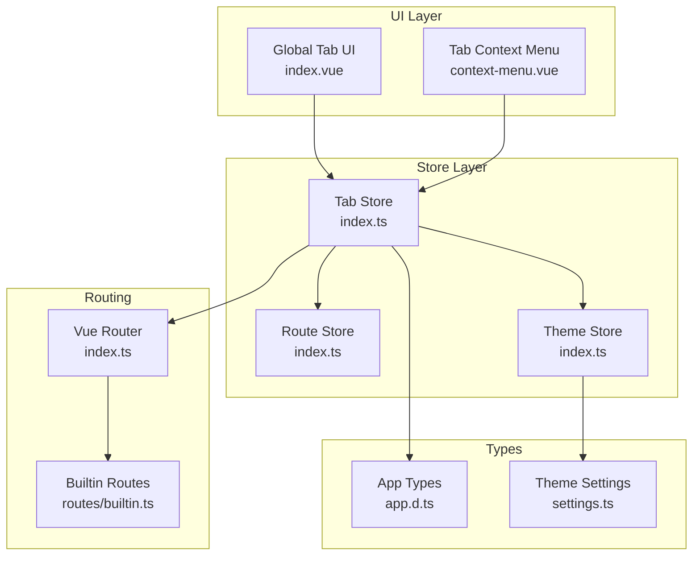
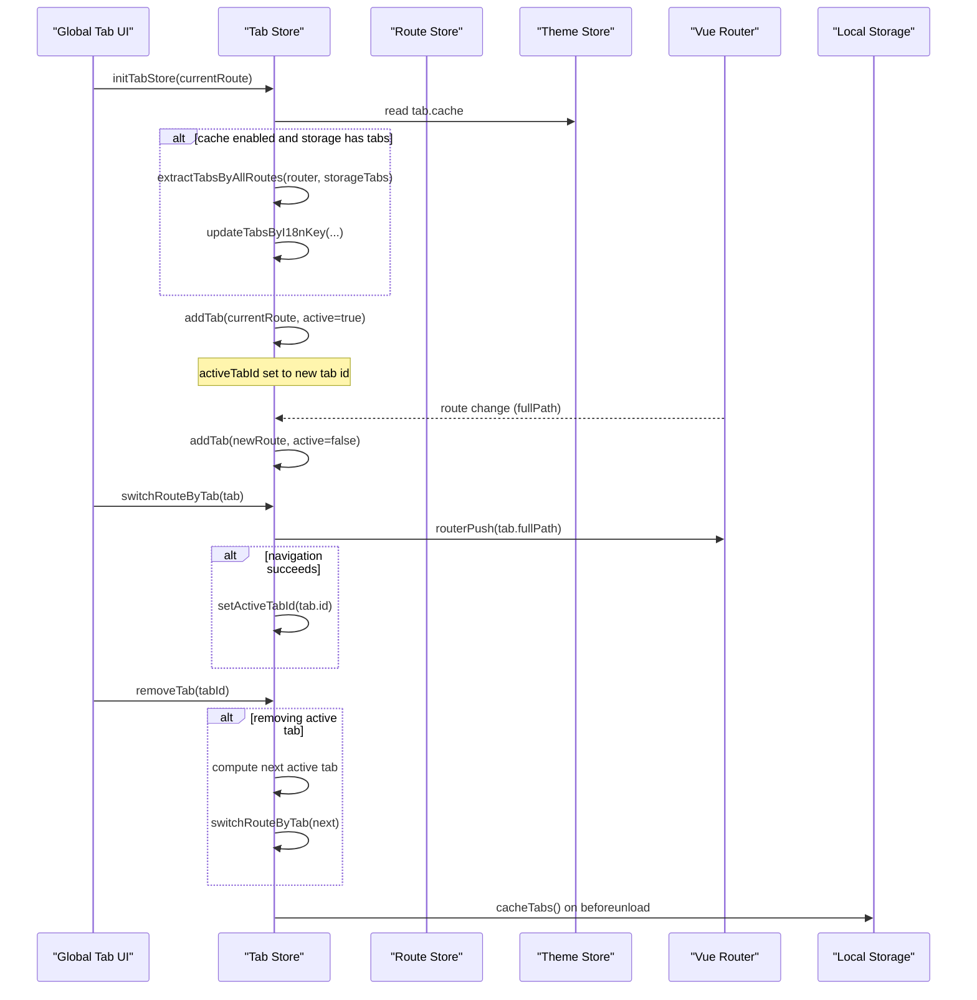
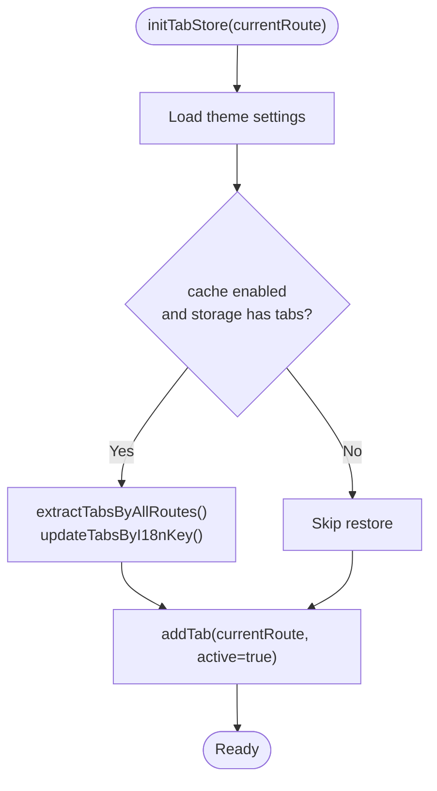
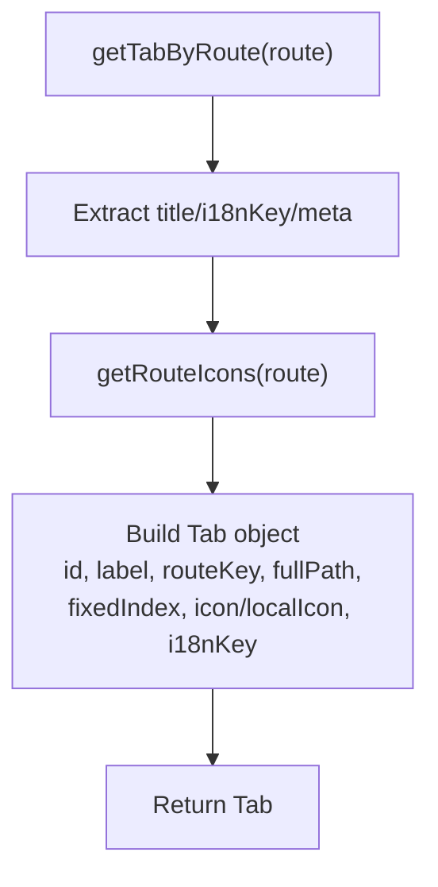
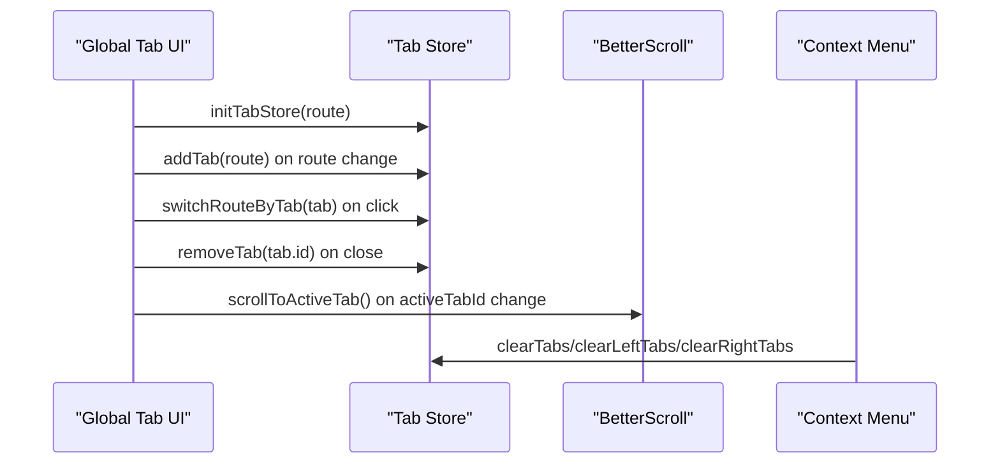
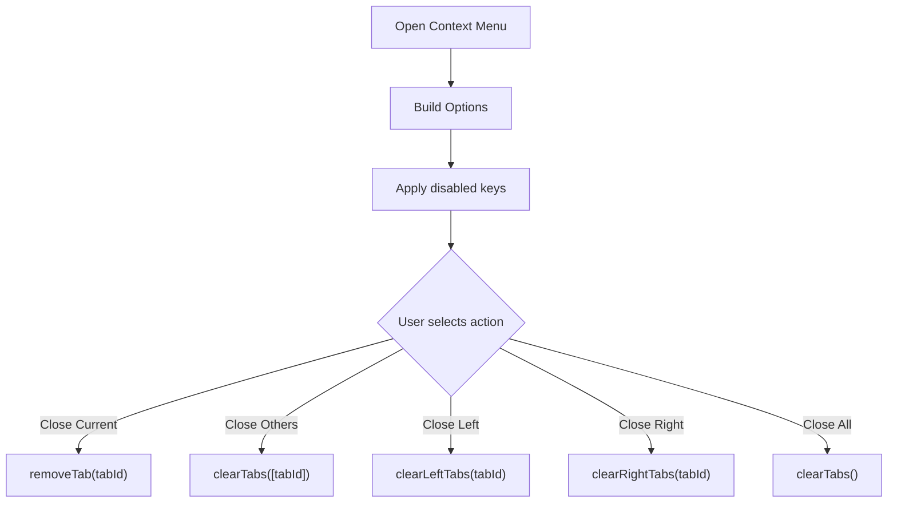
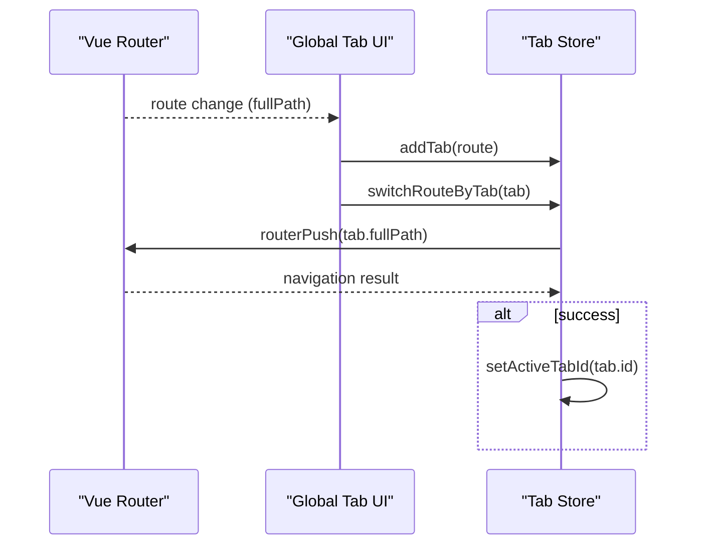
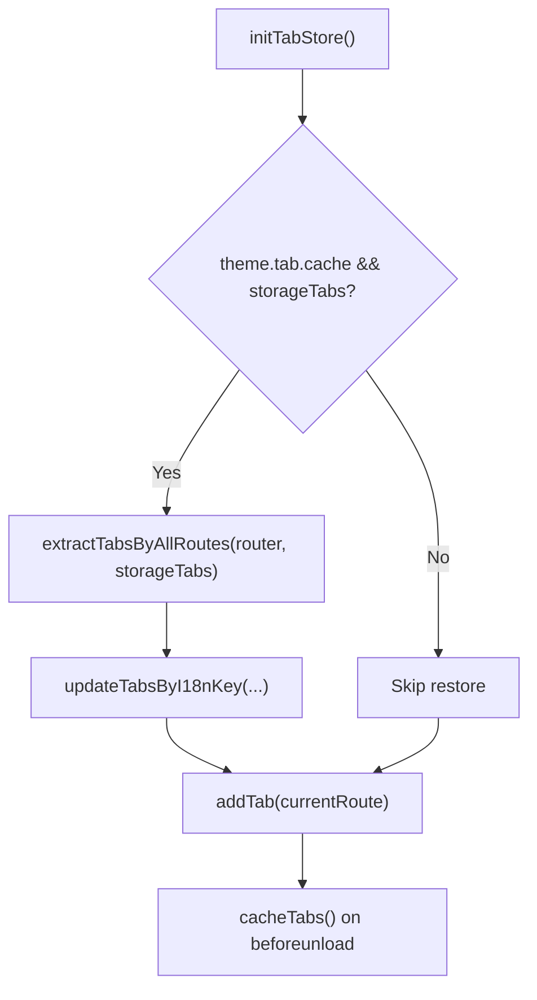
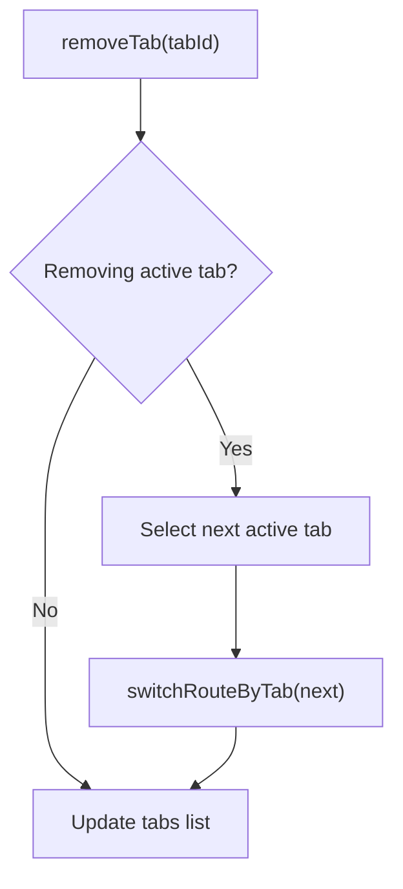
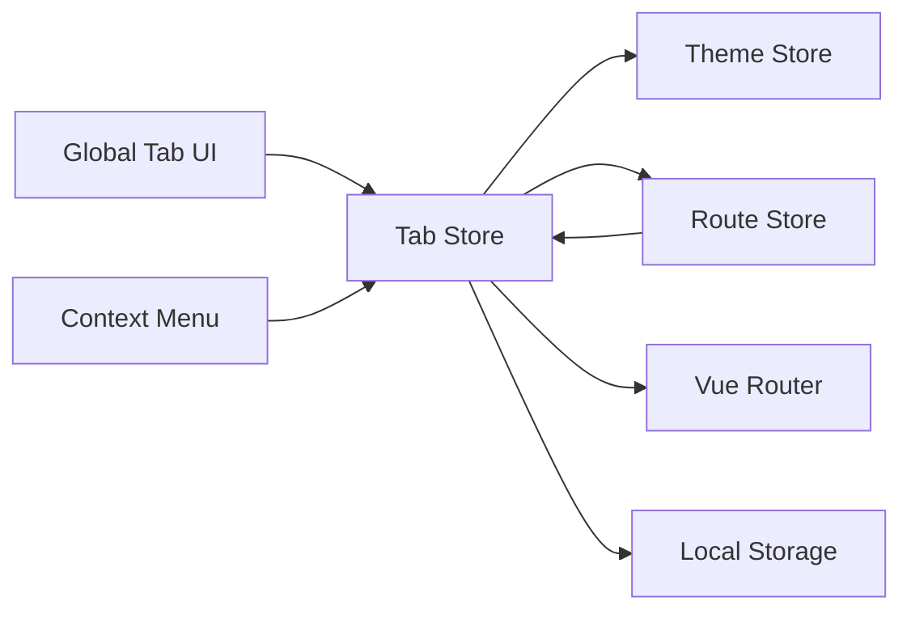

# Tab Store Module

<cite>
**Referenced Files in This Document**
- [index.ts](file://admin-web-soybean/src/store/modules/tab/index.ts)
- [shared.ts](file://admin-web-soybean/src/store/modules/tab/shared.ts)
- [index.vue](file://admin-web-soybean/src/layouts/modules/global-tab/index.vue)
- [context-menu.vue](file://admin-web-soybean/src/layouts/modules/global-tab/context-menu.vue)
- [app.d.ts](file://admin-web-soybean/src/typings/app.d.ts)
- [index.ts](file://admin-web-soybean/src/store/modules/theme/index.ts)
- [index.ts](file://admin-web-soybean/src/store/modules/route/index.ts)
- [index.ts](file://admin-web-soybean/src/router/index.ts)
- [settings.ts](file://admin-web-soybean/src/theme/settings.ts)
- [index.vue](file://admin-web-soybean/src/layouts/base-layout/index.vue)
</cite>

## Table of Contents
1. [Introduction](#introduction)
2. [Project Structure](#project-structure)
3. [Core Components](#core-components)
4. [Architecture Overview](#architecture-overview)
5. [Detailed Component Analysis](#detailed-component-analysis)
6. [Dependency Analysis](#dependency-analysis)
7. [Performance Considerations](#performance-considerations)
8. [Troubleshooting Guide](#troubleshooting-guide)
9. [Conclusion](#conclusion)
10. [Appendices](#appendices)

## Introduction
This document explains the Tab store module responsible for multi-tab state management in the admin-web-soybean frontend. It covers how tabs are created, tracked, persisted, navigated, and synchronized with the router and UI. It also documents state definitions, tab metadata, navigation patterns, persistence across browser sessions, cleanup mechanisms, and performance considerations. Finally, it provides guidelines for extending tab functionality safely.

## Project Structure
The Tab store lives under the Pinia store modules and integrates with the global layout, theme, route, and router systems.

**Diagram sources**
- [index.ts:1-297](file://admin-web-soybean/src/store/modules/tab/index.ts#L1-L297)
- [index.ts:1-349](file://admin-web-soybean/src/store/modules/route/index.ts#L1-L349)
- [index.ts:1-222](file://admin-web-soybean/src/store/modules/theme/index.ts#L1-L222)
- [index.vue:1-167](file://admin-web-soybean/src/layouts/modules/global-tab/index.vue#L1-L167)
- [context-menu.vue:1-117](file://admin-web-soybean/src/layouts/modules/global-tab/context-menu.vue#L1-L117)
- [index.ts:1-92](file://admin-web-soybean/src/router/index.ts#L1-L92)
- [settings.ts:1-87](file://admin-web-soybean/src/theme/settings.ts#L1-L87)
- [app.d.ts:211-251](file://admin-web-soybean/src/typings/app.d.ts#L211-L251)

**Section sources**
- [index.ts:1-297](file://admin-web-soybean/src/store/modules/tab/index.ts#L1-L297)
- [index.ts:1-349](file://admin-web-soybean/src/store/modules/route/index.ts#L1-L349)
- [index.ts:1-222](file://admin-web-soybean/src/store/modules/theme/index.ts#L1-L222)
- [index.vue:1-167](file://admin-web-soybean/src/layouts/modules/global-tab/index.vue#L1-L167)
- [context-menu.vue:1-117](file://admin-web-soybean/src/layouts/modules/global-tab/context-menu.vue#L1-L117)
- [index.ts:1-92](file://admin-web-soybean/src/router/index.ts#L1-L92)
- [settings.ts:1-87](file://admin-web-soybean/src/theme/settings.ts#L1-L87)
- [app.d.ts:211-251](file://admin-web-soybean/src/typings/app.d.ts#L211-L251)

## Core Components
- Tab Store (Pinia): Manages tab collection, active tab tracking, tab lifecycle, and persistence.
- Shared Utilities: Pure helpers for tab creation, ID computation, filtering, and i18n updates.
- Global Tab UI: Renders tabs, handles clicks, context menu, and scroll-to-active behavior.
- Context Menu: Provides tab actions (close current, close others, close left/right, close all).
- Route Store: Initializes home tab and integrates with tab store during route setup.
- Theme Store: Controls whether tabs are cached and influences UI rendering.
- Router: Drives navigation and route changes that trigger tab additions.

Key state definitions:
- Tab collection: An array of tab objects with id, label, route keys, paths, icons, i18n keys, and optional fixed index.
- Active tab id: A string identifier of the currently active tab.
- Home tab: A special tab representing the application’s home route, initialized from route store settings.
- Fixed tabs: Tabs with a fixed index that appear in a deterministic order among non-fixed tabs.

**Section sources**
- [index.ts:31-55](file://admin-web-soybean/src/store/modules/tab/index.ts#L31-L55)
- [shared.ts:12-26](file://admin-web-soybean/src/store/modules/tab/shared.ts#L12-L26)
- [app.d.ts:211-251](file://admin-web-soybean/src/typings/app.d.ts#L211-L251)

## Architecture Overview
The Tab store orchestrates tab lifecycle around route changes and user interactions. It reads theme settings to decide whether to cache tabs, persists tabs to local storage, and synchronizes with the router for navigation.

**Diagram sources**
- [index.ts:62-173](file://admin-web-soybean/src/store/modules/tab/index.ts#L62-L173)
- [index.ts:174-190](file://admin-web-soybean/src/store/modules/route/index.ts#L174-L190)
- [index.ts:1-222](file://admin-web-soybean/src/store/modules/theme/index.ts#L1-L222)
- [index.ts:1-92](file://admin-web-soybean/src/router/index.ts#L1-L92)

## Detailed Component Analysis

### Tab Store (Pinia)
Responsibilities:
- Initialize tabs from persisted storage if enabled by theme settings.
- Add/remove tabs on route changes and user actions.
- Track and switch active tab.
- Persist tabs on page unload.
- Provide utilities to clear subsets of tabs (left/right/all) and update labels.

Key APIs and behaviors:
- Initialization: Reads theme settings, restores tabs from local storage if present, then adds the current route as a tab.
- Adding tabs: Creates a tab from the route, avoids duplicates except for the home tab, and optionally activates it.
- Removing tabs: Handles active tab removal by selecting a fallback tab and navigating to it.
- Clearing tabs: Supports clearing left/right/all relative to a given tab id, with special handling for the home tab.
- Switching tabs: Uses router push to navigate and updates active tab id on success.
- Persistence: Writes tabs to local storage on window beforeunload when caching is enabled.

**Diagram sources**
- [index.ts:62-71](file://admin-web-soybean/src/store/modules/tab/index.ts#L62-L71)

**Section sources**
- [index.ts:26-296](file://admin-web-soybean/src/store/modules/tab/index.ts#L26-L296)

### Shared Utilities
Purpose-built helpers for tab manipulation:
- Tab creation: Builds tab objects from route metadata, computes id based on path and query when multi-tab is enabled.
- Icon resolution: Extracts icons from the matched route metadata to avoid conflicts from parent routes.
- Home tab: Constructs the home tab using the configured home route key and i18n label.
- Filtering and selection: Filters tabs by id(s), checks membership, extracts tabs by route names, and identifies fixed tabs.
- Label management: Updates labels based on i18n keys and supports temporary/new labels.

**Diagram sources**
- [shared.ts:62-84](file://admin-web-soybean/src/store/modules/tab/shared.ts#L62-L84)

**Section sources**
- [shared.ts:1-251](file://admin-web-soybean/src/store/modules/tab/shared.ts#L1-L251)

### Global Tab UI
Renders the tab bar, handles user interactions, and ensures the active tab remains visible:
- Watches route changes to add new tabs.
- Watches active tab id to scroll the active tab into view.
- Integrates with the context menu to provide tab actions.
- Delegates navigation and closing to the tab store.

**Diagram sources**
- [index.vue:101-120](file://admin-web-soybean/src/layouts/modules/global-tab/index.vue#L101-L120)
- [index.vue:36-72](file://admin-web-soybean/src/layouts/modules/global-tab/index.vue#L36-L72)
- [context-menu.vue:76-92](file://admin-web-soybean/src/layouts/modules/global-tab/context-menu.vue#L76-L92)

**Section sources**
- [index.vue:1-167](file://admin-web-soybean/src/layouts/modules/global-tab/index.vue#L1-L167)
- [context-menu.vue:1-117](file://admin-web-soybean/src/layouts/modules/global-tab/context-menu.vue#L1-L117)

### Tab Context Menu
Provides dropdown actions for each tab:
- Close current, close others, close left, close right, close all.
- Disables actions that would affect retained tabs (e.g., home tab).
- Delegates actions to the tab store.

**Diagram sources**
- [context-menu.vue:33-74](file://admin-web-soybean/src/layouts/modules/global-tab/context-menu.vue#L33-L74)
- [context-menu.vue:76-92](file://admin-web-soybean/src/layouts/modules/global-tab/context-menu.vue#L76-L92)

**Section sources**
- [context-menu.vue:1-117](file://admin-web-soybean/src/layouts/modules/global-tab/context-menu.vue#L1-L117)

### Integration with Router Navigation
- Route changes trigger tab addition via a watcher in the Global Tab UI.
- Tab switching uses router push to navigate to the tab’s full path and updates active tab id upon success.
- The route store initializes the home tab and sets the home route key, which the tab store uses to construct the home tab.

**Diagram sources**
- [index.vue:105-111](file://admin-web-soybean/src/layouts/modules/global-tab/index.vue#L105-L111)
- [index.ts:168-173](file://admin-web-soybean/src/store/modules/tab/index.ts#L168-L173)
- [index.ts:174-190](file://admin-web-soybean/src/store/modules/route/index.ts#L174-L190)

**Section sources**
- [index.ts:168-173](file://admin-web-soybean/src/store/modules/tab/index.ts#L168-L173)
- [index.ts:174-190](file://admin-web-soybean/src/store/modules/route/index.ts#L174-L190)

### Tab State Definitions
- Tab object fields:
  - id: Unique tab identifier (computed from path and query for multi-tab routes).
  - label: Display label, supports i18n and temporary/new labels.
  - routeKey: Last-level route key.
  - routePath/fullPath: Route path and full path.
  - fixedIndex: Optional index for fixed tabs.
  - icon/localIcon: Icon identifiers for rendering.
  - i18nKey: Optional i18n key for dynamic label updates.
- Active tab id: Tracks the currently active tab.
- Home tab: Special tab derived from the configured home route key and i18n label.

**Section sources**
- [app.d.ts:211-251](file://admin-web-soybean/src/typings/app.d.ts#L211-L251)
- [shared.ts:115-134](file://admin-web-soybean/src/store/modules/tab/shared.ts#L115-L134)

### Tab Persistence Across Browser Sessions
- Enabled by theme settings: When theme tab cache is enabled, tabs are written to local storage on window beforeunload.
- Restoration: On initialization, if storage contains tabs and cache is enabled, tabs are restored and filtered against current router routes.

**Diagram sources**
- [index.ts:62-71](file://admin-web-soybean/src/store/modules/tab/index.ts#L62-L71)
- [index.ts:264-273](file://admin-web-soybean/src/store/modules/tab/index.ts#L264-L273)
- [shared.ts:172-178](file://admin-web-soybean/src/store/modules/tab/shared.ts#L172-L178)

**Section sources**
- [index.ts:62-71](file://admin-web-soybean/src/store/modules/tab/index.ts#L62-L71)
- [index.ts:264-273](file://admin-web-soybean/src/store/modules/tab/index.ts#L264-L273)
- [settings.ts:32-37](file://admin-web-soybean/src/theme/settings.ts#L32-L37)

### Tab Cleanup Mechanisms
- Retained tabs: Home tab and tabs with fixed index are retained and cannot be closed.
- Clear left/right/all: Computes excluded tab ids and removes the rest; if the active tab is removed, navigates to a fallback tab.
- Route cache reset: When a tab is closed and reset cache strategy is set to close, the route cache for that tab is reset.

**Diagram sources**
- [index.ts:98-117](file://admin-web-soybean/src/store/modules/tab/index.ts#L98-L117)
- [index.vue:85-91](file://admin-web-soybean/src/layouts/modules/global-tab/index.vue#L85-L91)

**Section sources**
- [index.ts:98-161](file://admin-web-soybean/src/store/modules/tab/index.ts#L98-L161)
- [index.vue:74-91](file://admin-web-soybean/src/layouts/modules/global-tab/index.vue#L74-L91)

### Tab Navigation Patterns
- Programmatic navigation: switchRouteByTab uses router push and updates active tab id on success.
- Multi-tab support: Tabs can be differentiated by query parameters when a route is marked as multi-tab.
- Icon resolution: Icons are resolved from the matched route metadata to avoid conflicts.

**Section sources**
- [index.ts:168-173](file://admin-web-soybean/src/store/modules/tab/index.ts#L168-L173)
- [shared.ts:42-54](file://admin-web-soybean/src/store/modules/tab/shared.ts#L42-L54)
- [shared.ts:92-107](file://admin-web-soybean/src/store/modules/tab/shared.ts#L92-L107)

### Tab State Synchronization
- UI-to-state: Global Tab UI watches route changes and active tab id to update scroll position and render tabs.
- Store-to-ui: Computed tabs list is provided by the tab store, including home tab, fixed tabs, and remaining tabs in a deterministic order.
- Locale updates: Tabs can be updated by i18n keys when language changes.

**Section sources**
- [index.vue:105-117](file://admin-web-soybean/src/layouts/modules/global-tab/index.vue#L105-L117)
- [shared.ts:12-26](file://admin-web-soybean/src/store/modules/tab/shared.ts#L12-L26)
- [index.ts:255-261](file://admin-web-soybean/src/store/modules/tab/index.ts#L255-L261)

## Dependency Analysis
- Tab Store depends on:
  - Theme Store for cache settings.
  - Route Store for home tab initialization and route cache reset strategy.
  - Router for navigation and route metadata.
  - Local storage for persistence.
- Global Tab UI depends on:
  - Tab Store for state and actions.
  - BetterScroll for horizontal scrolling.
  - Context Menu for actions.
- Route Store depends on Tab Store for home tab initialization.

**Diagram sources**
- [index.ts:1-297](file://admin-web-soybean/src/store/modules/tab/index.ts#L1-L297)
- [index.ts:1-349](file://admin-web-soybean/src/store/modules/route/index.ts#L1-L349)
- [index.ts:1-222](file://admin-web-soybean/src/store/modules/theme/index.ts#L1-L222)
- [index.vue:1-167](file://admin-web-soybean/src/layouts/modules/global-tab/index.vue#L1-L167)
- [context-menu.vue:1-117](file://admin-web-soybean/src/layouts/modules/global-tab/context-menu.vue#L1-L117)

**Section sources**
- [index.ts:1-297](file://admin-web-soybean/src/store/modules/tab/index.ts#L1-L297)
- [index.ts:1-349](file://admin-web-soybean/src/store/modules/route/index.ts#L1-L349)
- [index.ts:1-222](file://admin-web-soybean/src/store/modules/theme/index.ts#L1-L222)
- [index.vue:1-167](file://admin-web-soybean/src/layouts/modules/global-tab/index.vue#L1-L167)
- [context-menu.vue:1-117](file://admin-web-soybean/src/layouts/modules/global-tab/context-menu.vue#L1-L117)

## Performance Considerations
- Rendering order: Tabs are sorted deterministically with fixed tabs first, then remaining tabs, minimizing layout thrashing.
- Scrolling: Horizontal scrolling uses BetterScroll with smooth scroll-by delta calculations to keep the active tab centered.
- Persistence: Tabs are cached only when enabled by theme settings to avoid unnecessary writes.
- Memory management: On tab removal, the tab store updates the internal array and triggers reactive updates; ensure no lingering references to removed tabs in UI slots.
- Navigation: Router push is used to avoid full page reloads, keeping tab state reactive.

[No sources needed since this section provides general guidance]

## Troubleshooting Guide
Common issues and resolutions:
- Tabs not persisting across refresh:
  - Verify theme tab cache is enabled and beforeunload handler runs.
  - Confirm local storage keys match expectations.
- Active tab not updating after navigation:
  - Ensure router push completes successfully and active tab id is updated.
  - Check that the tab store’s computed tabs reflect the new active tab id.
- Context menu actions not working:
  - Confirm disabled keys logic does not prevent intended actions (e.g., home tab retention).
  - Verify dropdown keys match the expected set.
- Icons not appearing:
  - Ensure route metadata includes icon/localIcon and that getRouteIcons resolves the correct values from matched routes.

**Section sources**
- [index.ts:264-273](file://admin-web-soybean/src/store/modules/tab/index.ts#L264-L273)
- [index.ts:168-173](file://admin-web-soybean/src/store/modules/tab/index.ts#L168-L173)
- [index.vue:74-91](file://admin-web-soybean/src/layouts/modules/global-tab/index.vue#L74-L91)
- [shared.ts:92-107](file://admin-web-soybean/src/store/modules/tab/shared.ts#L92-L107)

## Conclusion
The Tab store module provides robust multi-tab state management with clear separation of concerns. It integrates tightly with the router, theme, and UI layers to deliver a seamless tabbed browsing experience. Its design supports persistence, localization, and efficient navigation while maintaining performance and memory hygiene.

## Appendices

### Guidelines for Implementing New Tab Features
- Define tab metadata in route definitions:
  - Use multi-tab flag to differentiate tabs by query parameters.
  - Set fixed index for tabs that must appear in a specific order.
  - Provide i18n keys for dynamic labels.
- Extend tab store actions thoughtfully:
  - Add new actions in the tab store only if they fit the existing patterns (add/remove/clear).
  - Ensure new actions update active tab id and trigger navigation when necessary.
- Update UI components:
  - Modify Global Tab UI or context menu to expose new actions.
  - Keep scroll behavior consistent for active tab visibility.
- Respect retention rules:
  - Home tab and fixed tabs should remain non-closable.
- Test persistence:
  - Verify that new features work across page reloads when cache is enabled.

[No sources needed since this section provides general guidance]