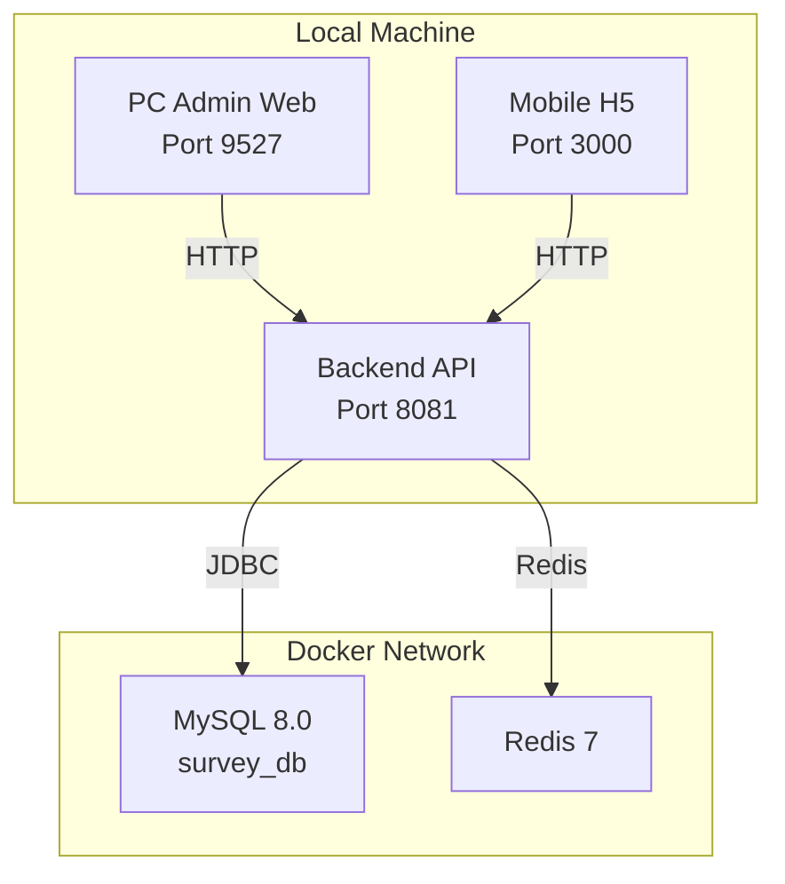
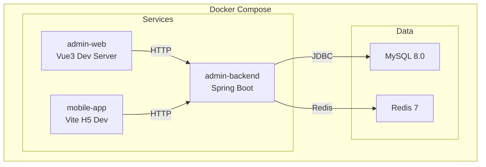
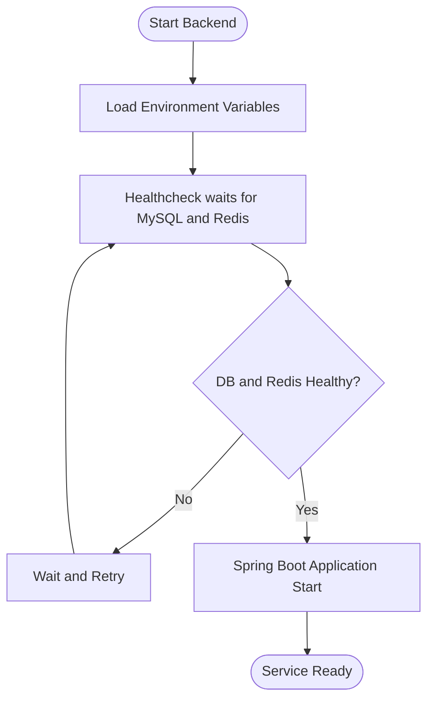
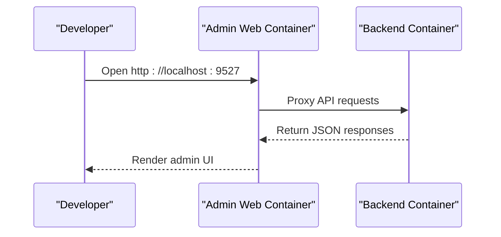
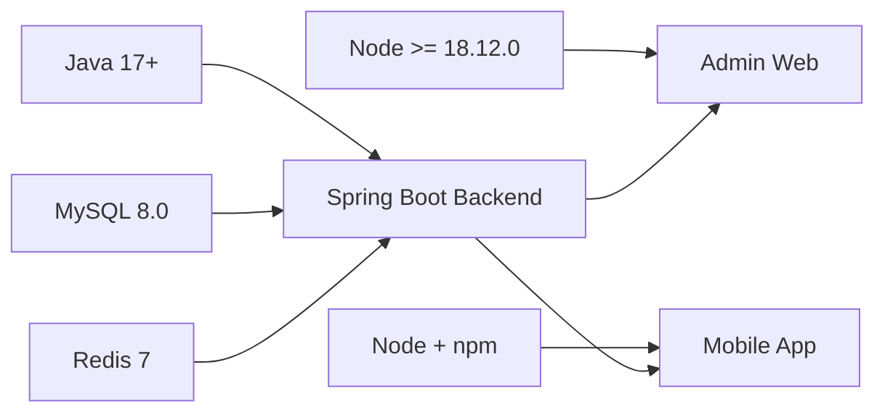

# Getting Started

<cite>
**Referenced Files in This Document**
- [README.md](file://README.md)
- [docker-compose.yml](file://docker-compose.yml)
- [deploy.sh](file://deploy.sh)
- [deploy-fast.sh](file://deploy-fast.sh)
- [admin-backend/README.md](file://admin-backend/README.md)
- [admin-backend/pom.xml](file://admin-backend/pom.xml)
- [admin-backend/Dockerfile](file://admin-backend/Dockerfile)
- [admin-backend/src/main/resources/application.yml](file://admin-backend/src/main/resources/application.yml)
- [admin-backend/src/main/resources/application-prod.yml](file://admin-backend/src/main/resources/application-prod.yml)
- [admin-backend/init-data/01-init.sql](file://admin-backend/init-data/01-init.sql)
- [admin-web-soybean/README.md](file://admin-web-soybean/README.md)
- [admin-web-soybean/package.json](file://admin-web-soybean/package.json)
- [admin-web-soybean/Dockerfile.dev](file://admin-web-soybean/Dockerfile.dev)
- [mobile-app/README.md](file://mobile-app/README.md)
- [mobile-app/package.json](file://mobile-app/package.json)
- [mobile-app/Dockerfile.dev](file://mobile-app/Dockerfile.dev)
</cite>

## Table of Contents
1. [Introduction](#introduction)
2. [Project Structure](#project-structure)
3. [Core Components](#core-components)
4. [Architecture Overview](#architecture-overview)
5. [Detailed Component Analysis](#detailed-component-analysis)
6. [Dependency Analysis](#dependency-analysis)
7. [Performance Considerations](#performance-considerations)
8. [Troubleshooting Guide](#troubleshooting-guide)
9. [Conclusion](#conclusion)
10. [Appendices](#appendices)

## Introduction
Survey-App is a cross-platform field inspection and auditing system with three components:
- Backend API built with Spring Boot
- PC management web built with Vue3
- Mobile H5 app built with uni-app

It supports standardized data capture, dynamic form templates, offline draft storage, precise positioning with manual correction, closed-loop audit workflows, and cross-end synchronization.

The recommended way to set up a local development environment is via Docker Compose, which provisions MySQL 8.0, Redis 7, and the three services with sensible defaults.

## Project Structure
The repository is organized into three primary modules plus supporting scripts and documentation:
- admin-backend: Spring Boot backend with database and cache dependencies
- admin-web-soybean: Vue3 admin web (PC)
- mobile-app: uni-app H5 mobile frontend
- Scripts and configs for Docker-based development and deployment

**Diagram sources**
- [docker-compose.yml:1-213](file://docker-compose.yml#L1-L213)
- [README.md:27-50](file://README.md#L27-L50)

**Section sources**
- [README.md:1-50](file://README.md#L1-L50)
- [docker-compose.yml:1-213](file://docker-compose.yml#L1-L213)

## Core Components
- Backend (Spring Boot 3.2.x, Java 17+, MyBatis-Plus, MySQL 8.0, Redis, JWT)
- Admin Web (Vue3, Vite, TypeScript, ElementPlus)
- Mobile App (uni-app, Vue3, Vite)

Ports and defaults:
- Backend API: 8081 (mapped from container 8080)
- Admin Web: 9527
- Mobile H5: 3000
- MySQL: 3306 (configurable via environment)
- Redis: 6379 (configurable via environment)

**Section sources**
- [README.md:27-50](file://README.md#L27-L50)
- [docker-compose.yml:11-138](file://docker-compose.yml#L11-L138)
- [admin-backend/pom.xml:19-29](file://admin-backend/pom.xml#L19-L29)
- [admin-web-soybean/package.json:30-33](file://admin-web-soybean/package.json#L30-L33)
- [mobile-app/package.json:4-5](file://mobile-app/package.json#L4-L5)

## Architecture Overview
The system uses a micro-service-like layout with three containers orchestrated by Docker Compose. The backend connects to MySQL and Redis, while the admin web and mobile app consume the backend API.

**Diagram sources**
- [docker-compose.yml:5-138](file://docker-compose.yml#L5-L138)

## Detailed Component Analysis

### Backend Setup (Spring Boot)
- Java requirement: Java 17 (explicitly configured in Maven)
- Database: MySQL 8.0 (containerized)
- Cache: Redis 7 (containerized)
- Ports: exposed 8080 inside container; mapped to 8081 on host
- Profiles: default prod profile active in Docker
- Health check: GET /api/v1/health

Key configuration highlights:
- Application YAML defines datasource URL, Redis connection, JWT, logging, and CORS
- Production YAML adjusts logging, cache, and disables Swagger UI by default

Initial database schema and seed data:
- Schema and indexes are provisioned via Docker init scripts
- Additional init SQL is included under admin-backend/init-data

**Diagram sources**
- [docker-compose.yml:124-138](file://docker-compose.yml#L124-L138)
- [admin-backend/Dockerfile:49-51](file://admin-backend/Dockerfile#L49-L51)

**Section sources**
- [admin-backend/pom.xml:19-29](file://admin-backend/pom.xml#L19-L29)
- [admin-backend/src/main/resources/application.yml:24-78](file://admin-backend/src/main/resources/application.yml#L24-L78)
- [admin-backend/src/main/resources/application-prod.yml:21-62](file://admin-backend/src/main/resources/application-prod.yml#L21-L62)
- [admin-backend/Dockerfile:1-69](file://admin-backend/Dockerfile#L1-L69)
- [admin-backend/init-data/01-init.sql:1-200](file://admin-backend/init-data/01-init.sql#L1-L200)

### Admin Web (Vue3) Setup
- Node.js requirement: >= 18.12.0 (as per package engines)
- Package manager: pnpm >= 8.7.0
- Dev server port: 9527
- Docker dev image exposes 9527 and runs dev:docker script

**Diagram sources**
- [docker-compose.yml:151-171](file://docker-compose.yml#L151-L171)
- [admin-web-soybean/Dockerfile.dev:1-20](file://admin-web-soybean/Dockerfile.dev#L1-L20)

**Section sources**
- [admin-web-soybean/README.md:85-92](file://admin-web-soybean/README.md#L85-L92)
- [admin-web-soybean/package.json:30-33](file://admin-web-soybean/package.json#L30-L33)
- [admin-web-soybean/Dockerfile.dev:1-20](file://admin-web-soybean/Dockerfile.dev#L1-L20)

### Mobile App (uni-app H5) Setup
- Node.js requirement: npm 10.9.2+ (as per package)
- Dev server port: 3000
- Docker dev image exposes 3000 and runs dev:h5 with host binding

**Diagram sources**
- [docker-compose.yml:176-196](file://docker-compose.yml#L176-L196)
- [mobile-app/Dockerfile.dev:1-13](file://mobile-app/Dockerfile.dev#L1-L13)

**Section sources**
- [mobile-app/README.md:23-28](file://mobile-app/README.md#L23-L28)
- [mobile-app/package.json:4-5](file://mobile-app/package.json#L4-L5)
- [mobile-app/Dockerfile.dev:1-13](file://mobile-app/Dockerfile.dev#L1-L13)

## Dependency Analysis
External dependencies and their roles:
- Java 17+ for backend compilation and runtime
- Node.js >= 18.12.0 for admin web
- Node.js/npm for mobile app
- MySQL 8.0 for persistence
- Redis 7 for caching and session-like features
- Docker Compose for orchestration

**Diagram sources**
- [admin-backend/pom.xml:19-29](file://admin-backend/pom.xml#L19-L29)
- [admin-web-soybean/package.json:30-33](file://admin-web-soybean/package.json#L30-L33)
- [mobile-app/package.json:4-5](file://mobile-app/package.json#L4-L5)
- [docker-compose.yml:5-68](file://docker-compose.yml#L5-L68)

**Section sources**
- [admin-backend/pom.xml:19-29](file://admin-backend/pom.xml#L19-L29)
- [admin-web-soybean/package.json:30-33](file://admin-web-soybean/package.json#L30-L33)
- [mobile-app/package.json:4-5](file://mobile-app/package.json#L4-L5)
- [docker-compose.yml:5-68](file://docker-compose.yml#L5-L68)

## Performance Considerations
- Backend JVM tuning is embedded in the Dockerfile (G1GC, heap sizing, timezone)
- MySQL and Redis resource limits and reservations are configurable via environment variables in Docker Compose
- Production profile reduces logging overhead and disables Swagger UI by default

Recommendations:
- Adjust BACKEND_CPU_LIMIT and BACKEND_MEM_LIMIT according to host capacity
- Tune DB buffer pool and max connections for your workload
- Configure Redis maxmemory policy and persistence to match expected traffic

**Section sources**
- [admin-backend/Dockerfile:56-68](file://admin-backend/Dockerfile#L56-L68)
- [docker-compose.yml:139-147](file://docker-compose.yml#L139-L147)
- [admin-backend/src/main/resources/application-prod.yml:111-122](file://admin-backend/src/main/resources/application-prod.yml#L111-L122)

## Troubleshooting Guide
Common setup issues and resolutions:

- Docker or Compose not installed
  - Run the deployment script to check prerequisites and guide you through setup
  - The script validates Docker and Compose presence and exits with clear messages if missing

- Port conflicts
  - Override default ports via environment variables (BACKEND_PORT, ADMIN_WEB_PORT, MOBILE_WEB_PORT, MYSQL_PORT, REDIS_PORT)
  - The deployment scripts print effective ports after startup

- Database initialization failures
  - Ensure MySQL initializes successfully; the compose healthcheck verifies connectivity
  - Verify DB credentials and database name match application.yml and Docker Compose

- Backend health check fails
  - Check backend logs for startup errors
  - Confirm MySQL and Redis are healthy before expecting backend readiness
  - Increase start_period or adjust health check thresholds if your machine is slow

- Admin Web or Mobile H5 not reachable
  - Confirm the respective dev servers are running inside containers
  - Ensure host ports are free and not blocked by firewall

- Production profile and Swagger UI
  - In production, Swagger UI is disabled by default; enable only during development if needed

**Section sources**
- [deploy.sh:22-32](file://deploy.sh#L22-L32)
- [deploy.sh:55-68](file://deploy.sh#L55-L68)
- [deploy.sh:82-123](file://deploy.sh#L82-L123)
- [docker-compose.yml:36-43](file://docker-compose.yml#L36-L43)
- [docker-compose.yml:69-75](file://docker-compose.yml#L69-L75)
- [docker-compose.yml:133-138](file://docker-compose.yml#L133-L138)
- [admin-backend/src/main/resources/application-prod.yml:101-110](file://admin-backend/src/main/resources/application-prod.yml#L101-L110)

## Conclusion
You can quickly bootstrap the entire Survey-App ecosystem using Docker Compose. The provided scripts and Dockerfiles encapsulate environment requirements, port mappings, and health checks. After initial setup, connect to the backend API at the documented URLs, and use the admin web and mobile H5 apps for management and field data capture.

## Appendices

### A. Development Environment Setup Checklist
- Install Docker and Docker Compose
- Copy .env.example to .env and review/adjust environment variables
- Start services with Docker Compose
- Access:
  - Backend API: http://localhost:8081
  - Admin Web: http://localhost:9527
  - Mobile H5: http://localhost:3000
  - Health check: http://localhost:8081/api/v1/health

**Section sources**
- [README.md:27-50](file://README.md#L27-L50)
- [deploy.sh:37-48](file://deploy.sh#L37-L48)
- [deploy.sh:134-140](file://deploy.sh#L134-L140)

### B. Local Deployment Without Docker (Alternative)
- Backend: Maven build and run Spring Boot application
- Admin Web: pnpm install and pnpm dev
- Mobile App: npm install and npm run dev:h5

Notes:
- These steps are supported but Docker Compose is the recommended approach for consistent environment alignment.

**Section sources**
- [admin-backend/README.md:23-28](file://admin-backend/README.md#L23-L28)
- [admin-web-soybean/README.md:111-116](file://admin-web-soybean/README.md#L111-L116)
- [mobile-app/README.md:23-28](file://mobile-app/README.md#L23-L28)

### C. Database Initialization Procedures
- Docker Compose mounts init SQL files to initialize schema and indexes
- Additional init SQL is also present under admin-backend/init-data

Steps:
- Start MySQL via Docker Compose
- Confirm health status
- Verify tables and indexes exist in survey_db

**Section sources**
- [docker-compose.yml:20-29](file://docker-compose.yml#L20-L29)
- [admin-backend/init-data/01-init.sql:1-200](file://admin-backend/init-data/01-init.sql#L1-L200)

### D. Configuration Files Preparation
- Backend configuration
  - application.yml: datasource, Redis, JWT, logging, CORS
  - application-prod.yml: production overrides (logging, cache, Swagger)
- Docker Compose environment variables supply DB and Redis credentials and ports

**Section sources**
- [admin-backend/src/main/resources/application.yml:15-137](file://admin-backend/src/main/resources/application.yml#L15-L137)
- [admin-backend/src/main/resources/application-prod.yml:12-129](file://admin-backend/src/main/resources/application-prod.yml#L12-L129)
- [docker-compose.yml:91-123](file://docker-compose.yml#L91-L123)

### E. Default Admin Credentials and First-Time Onboarding
- The provided documentation does not specify default admin credentials or initial onboarding steps
- Proceed to create an administrator account via the admin web interface after services are healthy
- Use the backend health endpoint to confirm readiness before logging in

**Section sources**
- [README.md:34-40](file://README.md#L34-L40)
- [deploy.sh:113-123](file://deploy.sh#L113-L123)