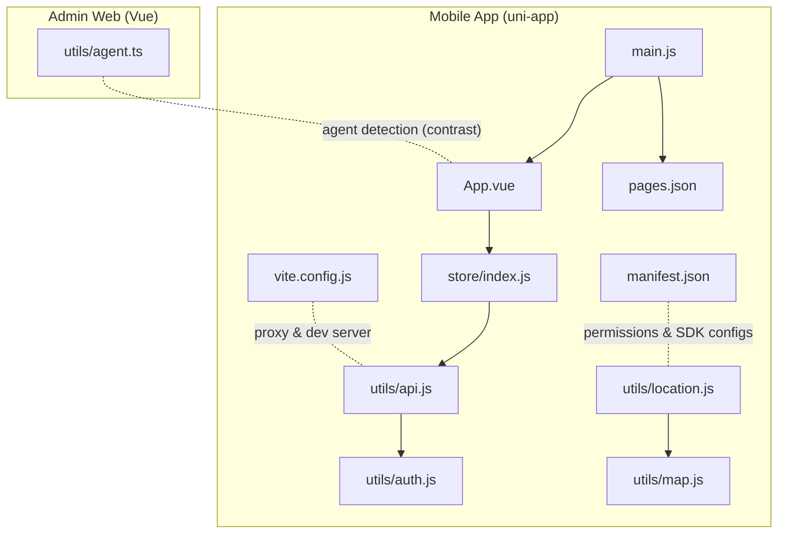
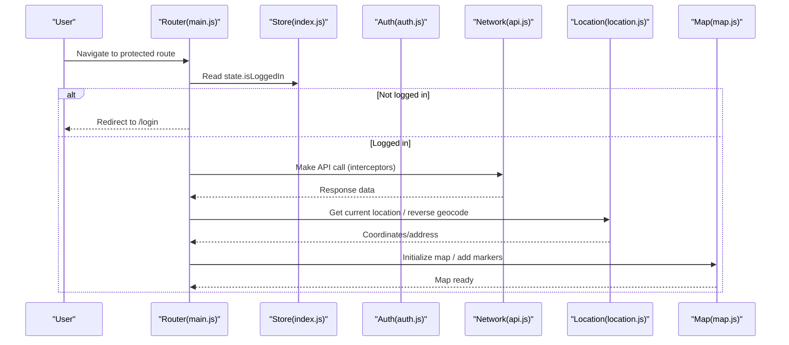
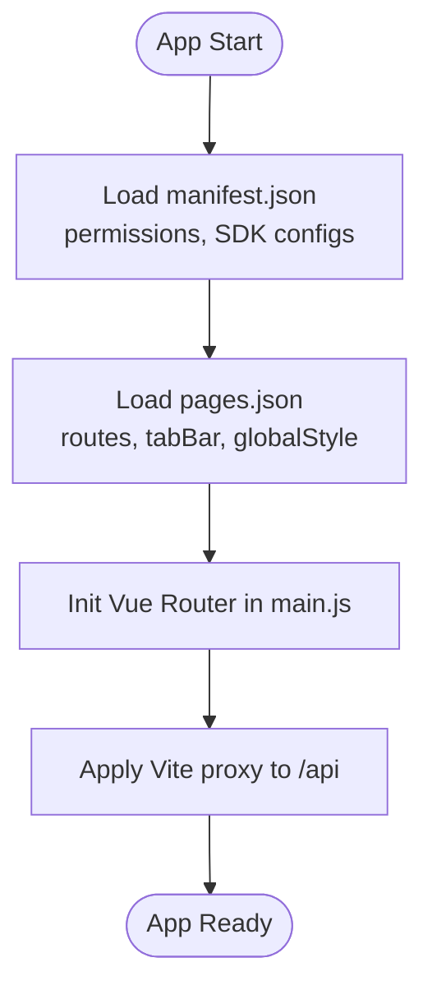
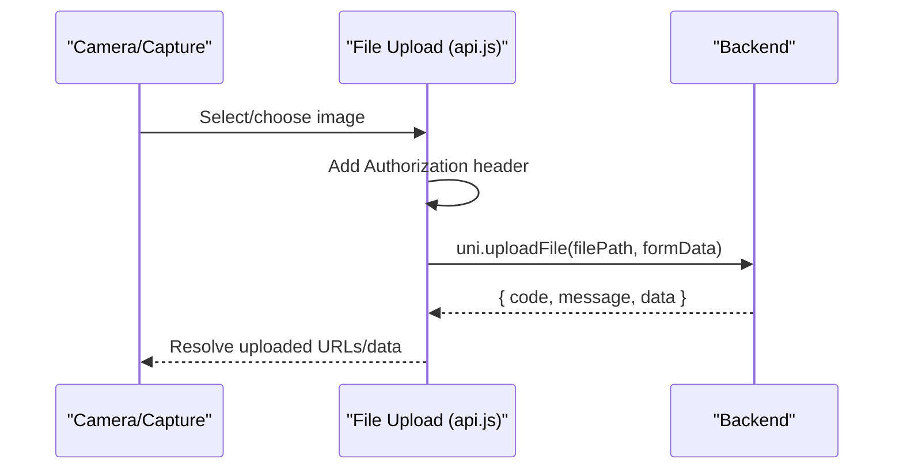
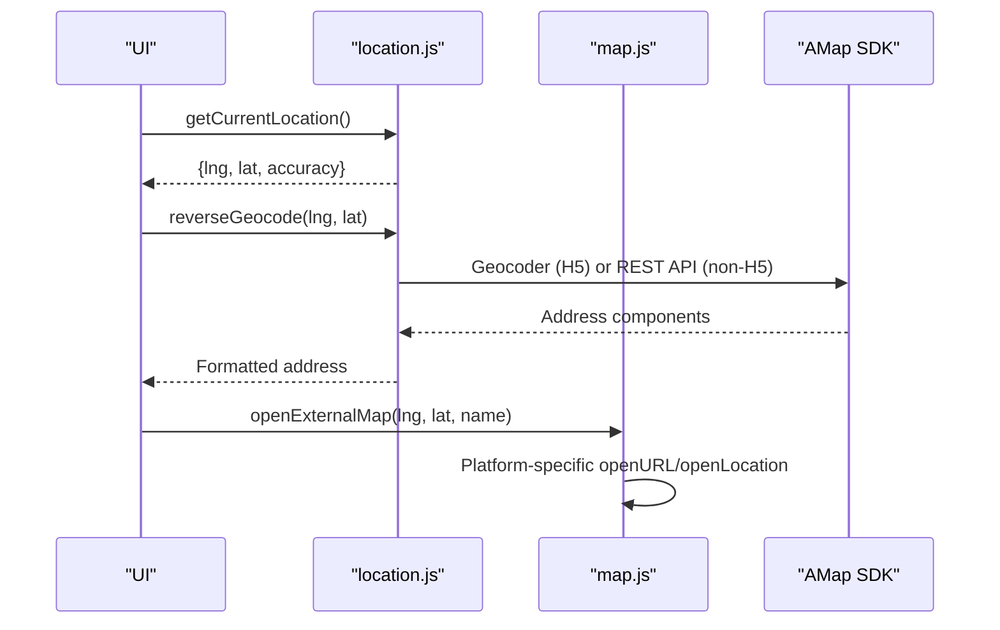
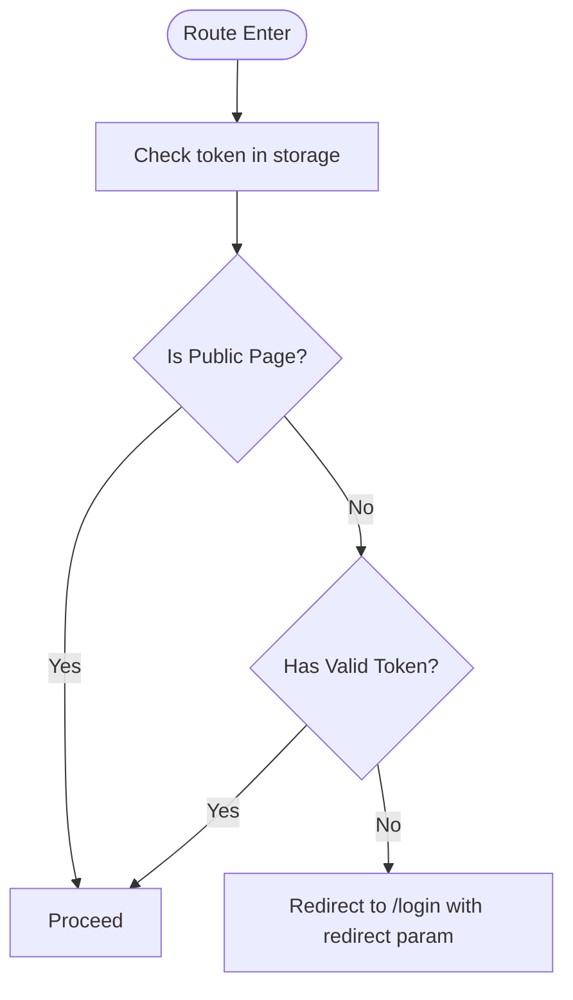
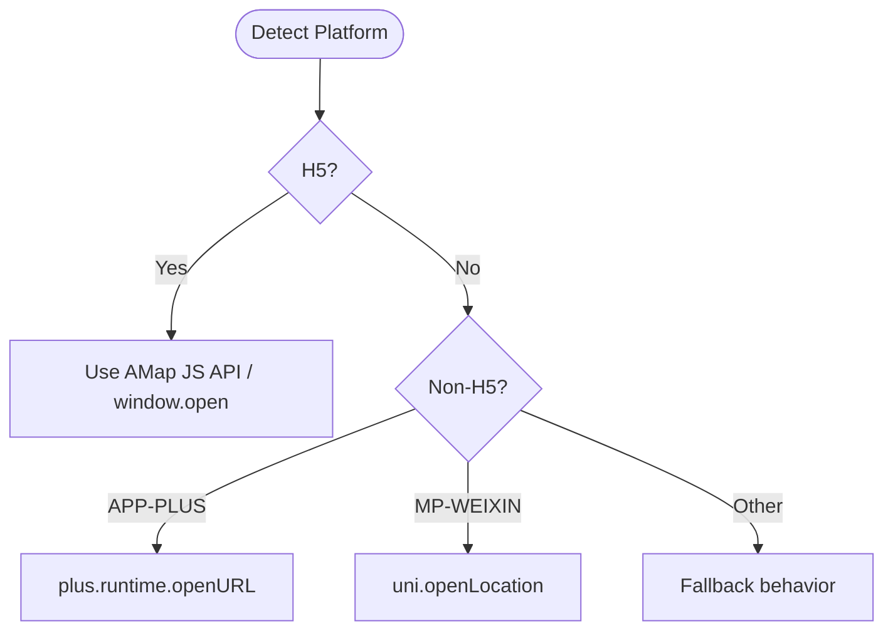
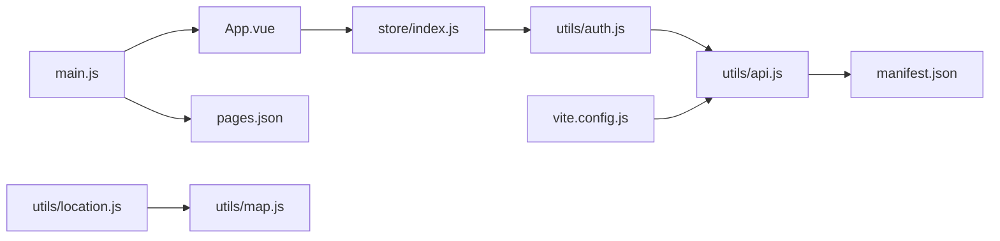

# Cross-Platform Features

<cite>
**Referenced Files in This Document**
- [mobile-app/src/manifest.json](file://mobile-app/src/manifest.json)
- [mobile-app/src/pages.json](file://mobile-app/src/pages.json)
- [mobile-app/src/main.js](file://mobile-app/src/main.js)
- [mobile-app/src/App.vue](file://mobile-app/src/App.vue)
- [mobile-app/package.json](file://mobile-app/package.json)
- [mobile-app/vite.config.js](file://mobile-app/vite.config.js)
- [mobile-app/src/utils/api.js](file://mobile-app/src/utils/api.js)
- [mobile-app/src/utils/auth.js](file://mobile-app/src/utils/auth.js)
- [mobile-app/src/utils/location.js](file://mobile-app/src/utils/location.js)
- [mobile-app/src/utils/map.js](file://mobile-app/src/utils/map.js)
- [mobile-app/src/store/index.js](file://mobile-app/src/store/index.js)
- [admin-web-soybean/src/utils/agent.ts](file://admin-web-soybean/src/utils/agent.ts)
- [mobile-app/generate-icons.js](file://mobile-app/generate-icons.js)
</cite>

## Table of Contents
1. [Introduction](#introduction)
2. [Project Structure](#project-structure)
3. [Core Components](#core-components)
4. [Architecture Overview](#architecture-overview)
5. [Detailed Component Analysis](#detailed-component-analysis)
6. [Dependency Analysis](#dependency-analysis)
7. [Performance Considerations](#performance-considerations)
8. [Troubleshooting Guide](#troubleshooting-guide)
9. [Conclusion](#conclusion)
10. [Appendices](#appendices)

## Introduction
This document explains how the project achieves cross-platform compatibility and integrates native features using the uni-app ecosystem. It covers framework configuration, platform-specific adaptations, build optimization strategies, native API integrations (camera, file system, device sensors), responsive design and viewport handling, touch interaction patterns, platform detection and conditional feature loading, performance optimization, and app store deployment considerations. The content is derived from the mobile app’s uni-app configuration and utilities, and cross-references the admin web’s client-side agent detection for comparative insights.

## Project Structure
The mobile application is built with uni-app and Vue 3, with Vite as the dev/build tool. The project organizes:
- Application bootstrap and routing in main.js
- Global styles and layout in App.vue
- Pages and navigation configuration in pages.json
- App metadata and permissions in manifest.json
- Build configuration in vite.config.js
- Utilities for API, authentication, location, map, and state management

**Diagram sources**
- [mobile-app/src/App.vue:1-44](file://mobile-app/src/App.vue#L1-L44)
- [mobile-app/src/main.js:1-49](file://mobile-app/src/main.js#L1-L49)
- [mobile-app/src/pages.json:1-152](file://mobile-app/src/pages.json#L1-L152)
- [mobile-app/src/manifest.json:1-38](file://mobile-app/src/manifest.json#L1-L38)
- [mobile-app/vite.config.js:1-23](file://mobile-app/vite.config.js#L1-L23)
- [mobile-app/src/store/index.js:1-91](file://mobile-app/src/store/index.js#L1-L91)
- [mobile-app/src/utils/api.js:1-370](file://mobile-app/src/utils/api.js#L1-L370)
- [mobile-app/src/utils/auth.js:1-186](file://mobile-app/src/utils/auth.js#L1-L186)
- [mobile-app/src/utils/location.js:1-357](file://mobile-app/src/utils/location.js#L1-L357)
- [mobile-app/src/utils/map.js:1-214](file://mobile-app/src/utils/map.js#L1-L214)
- [admin-web-soybean/src/utils/agent.ts:1-7](file://admin-web-soybean/src/utils/agent.ts#L1-L7)

**Section sources**
- [mobile-app/src/App.vue:1-44](file://mobile-app/src/App.vue#L1-L44)
- [mobile-app/src/main.js:1-49](file://mobile-app/src/main.js#L1-L49)
- [mobile-app/src/pages.json:1-152](file://mobile-app/src/pages.json#L1-L152)
- [mobile-app/src/manifest.json:1-38](file://mobile-app/src/manifest.json#L1-L38)
- [mobile-app/vite.config.js:1-23](file://mobile-app/vite.config.js#L1-L23)
- [mobile-app/package.json:1-22](file://mobile-app/package.json#L1-L22)

## Core Components
- Routing and navigation: configured via pages.json and Vue Router in main.js
- Authentication and session: token and user info persistence using uni-app storage APIs
- API layer: unified request wrapper around uni.request with interceptors
- Location and mapping: GPS, reverse geocoding, map picker, external navigation
- State management: reactive store using Vue 3 composition APIs
- Build and development: Vite with proxy to backend

Key capabilities:
- Platform abstraction via uni-app APIs (storage, network, location, map)
- Conditional compilation for H5, APP-PLUS, and mini-program platforms
- TabBar configuration and page-level navigation styles
- Proxy-based development workflow for backend integration

**Section sources**
- [mobile-app/src/main.js:16-43](file://mobile-app/src/main.js#L16-L43)
- [mobile-app/src/pages.json:106-139](file://mobile-app/src/pages.json#L106-L139)
- [mobile-app/src/utils/auth.js:104-115](file://mobile-app/src/utils/auth.js#L104-L115)
- [mobile-app/src/utils/api.js:76-101](file://mobile-app/src/utils/api.js#L76-L101)
- [mobile-app/src/utils/location.js:144-164](file://mobile-app/src/utils/location.js#L144-L164)
- [mobile-app/src/utils/map.js:153-172](file://mobile-app/src/utils/map.js#L153-L172)
- [mobile-app/src/store/index.js:9-25](file://mobile-app/src/store/index.js#L9-L25)
- [mobile-app/vite.config.js:12-21](file://mobile-app/vite.config.js#L12-L21)

## Architecture Overview
The uni-app runtime provides a unified interface across H5, APP-PLUS, and mini-program targets. Platform-specific branches are enabled using conditional compilation directives. The app uses:
- Storage APIs for auth persistence
- Network APIs for requests and uploads
- Map SDK integration for positioning and UI
- Navigation and tab bar configuration for UX

**Diagram sources**
- [mobile-app/src/main.js:34-43](file://mobile-app/src/main.js#L34-L43)
- [mobile-app/src/store/index.js:28-77](file://mobile-app/src/store/index.js#L28-L77)
- [mobile-app/src/utils/auth.js:104-115](file://mobile-app/src/utils/auth.js#L104-L115)
- [mobile-app/src/utils/api.js:76-101](file://mobile-app/src/utils/api.js#L76-L101)
- [mobile-app/src/utils/location.js:144-164](file://mobile-app/src/utils/location.js#L144-L164)
- [mobile-app/src/utils/map.js:23-38](file://mobile-app/src/utils/map.js#L23-L38)

## Detailed Component Analysis

### uni-app Framework Configuration
- Manifest and permissions: define app identity, SDK configurations (e.g., AMap keys), and permission scopes for camera, photos album, and location
- Pages and tab bar: centralized page routing, navigation bar styles, and platform-specific page animations
- Build tooling: Vite aliases and dev server proxy for backend integration

**Diagram sources**
- [mobile-app/src/manifest.json:1-38](file://mobile-app/src/manifest.json#L1-L38)
- [mobile-app/src/pages.json:1-152](file://mobile-app/src/pages.json#L1-L152)
- [mobile-app/src/main.js:28-31](file://mobile-app/src/main.js#L28-L31)
- [mobile-app/vite.config.js:15-21](file://mobile-app/vite.config.js#L15-L21)

**Section sources**
- [mobile-app/src/manifest.json:13-36](file://mobile-app/src/manifest.json#L13-L36)
- [mobile-app/src/pages.json:106-150](file://mobile-app/src/pages.json#L106-L150)
- [mobile-app/src/main.js:28-31](file://mobile-app/src/main.js#L28-L31)
- [mobile-app/vite.config.js:7-21](file://mobile-app/vite.config.js#L7-L21)

### Native API Integrations
- Camera and gallery: declared in manifest and pages permissions; used for taking photos and saving to album
- File system operations: upload API wrapper supports single and multiple file uploads
- Device sensors: GPS via uni.getLocation with high accuracy and coordinate system selection

**Diagram sources**
- [mobile-app/src/manifest.json:30-35](file://mobile-app/src/manifest.json#L30-L35)
- [mobile-app/src/pages.json:140-150](file://mobile-app/src/pages.json#L140-L150)
- [mobile-app/src/utils/api.js:162-191](file://mobile-app/src/utils/api.js#L162-L191)

**Section sources**
- [mobile-app/src/manifest.json:30-35](file://mobile-app/src/manifest.json#L30-L35)
- [mobile-app/src/pages.json:140-150](file://mobile-app/src/pages.json#L140-L150)
- [mobile-app/src/utils/api.js:162-191](file://mobile-app/src/utils/api.js#L162-L191)

### Location and Mapping
- Reverse geocoding: uses AMap JS API on H5 and REST API on non-H5
- Current location: uni.getLocation with gcj02 coordinates
- Map picker: navigates to a dedicated page and communicates via uni.$emit/$on with unique request IDs
- External navigation: opens AMap URI with platform-specific handlers

**Diagram sources**
- [mobile-app/src/utils/location.js:144-164](file://mobile-app/src/utils/location.js#L144-L164)
- [mobile-app/src/utils/location.js:92-138](file://mobile-app/src/utils/location.js#L92-L138)
- [mobile-app/src/utils/map.js:153-172](file://mobile-app/src/utils/map.js#L153-L172)

**Section sources**
- [mobile-app/src/utils/location.js:92-138](file://mobile-app/src/utils/location.js#L92-L138)
- [mobile-app/src/utils/location.js:144-164](file://mobile-app/src/utils/location.js#L144-L164)
- [mobile-app/src/utils/map.js:153-172](file://mobile-app/src/utils/map.js#L153-L172)

### Authentication and Session Management
- Token and user info stored via uni-app storage APIs
- Route guards enforce authentication for protected pages
- Role-based checks and login-type differentiation

**Diagram sources**
- [mobile-app/src/main.js:34-43](file://mobile-app/src/main.js#L34-L43)
- [mobile-app/src/utils/auth.js:104-115](file://mobile-app/src/utils/auth.js#L104-L115)

**Section sources**
- [mobile-app/src/main.js:34-43](file://mobile-app/src/main.js#L34-L43)
- [mobile-app/src/utils/auth.js:104-115](file://mobile-app/src/utils/auth.js#L104-L115)

### State Management
- Reactive store persists tokens and user info, exposes actions to update state, and maintains counts and online status

**Section sources**
- [mobile-app/src/store/index.js:9-77](file://mobile-app/src/store/index.js#L9-L77)

### Responsive Design and Touch Interactions
- Global styles and typography in App.vue
- Page-level navigation bar customization in pages.json
- Map interactions handled via AMap controls and click events

**Section sources**
- [mobile-app/src/App.vue:10-43](file://mobile-app/src/App.vue#L10-L43)
- [mobile-app/src/pages.json:134-139](file://mobile-app/src/pages.json#L134-L139)

### Platform Detection and Conditional Feature Loading
- Conditional compilation directives (#ifdef/#endif) enable platform-specific logic for H5, APP-PLUS, and MP-WEIXIN
- Example: map picker fallback, external navigation, and geocoding path selection
- Admin web agent detection utility demonstrates a similar concept for browser vs. mobile

**Diagram sources**
- [mobile-app/src/utils/location.js:94-137](file://mobile-app/src/utils/location.js#L94-L137)
- [mobile-app/src/utils/map.js:156-171](file://mobile-app/src/utils/map.js#L156-L171)
- [admin-web-soybean/src/utils/agent.ts:1-7](file://admin-web-soybean/src/utils/agent.ts#L1-L7)

**Section sources**
- [mobile-app/src/utils/location.js:94-137](file://mobile-app/src/utils/location.js#L94-L137)
- [mobile-app/src/utils/map.js:156-171](file://mobile-app/src/utils/map.js#L156-L171)
- [admin-web-soybean/src/utils/agent.ts:1-7](file://admin-web-soybean/src/utils/agent.ts#L1-L7)

### Build Optimization Strategies
- Vite configuration with alias and proxy for efficient local development
- Environment-aware base URL for API requests
- Minimizing payload sizes by avoiding unnecessary polyfills and leveraging platform-native capabilities

**Section sources**
- [mobile-app/vite.config.js:7-21](file://mobile-app/vite.config.js#L7-L21)
- [mobile-app/src/utils/api.js:7-8](file://mobile-app/src/utils/api.js#L7-L8)

### Deployment and Distribution Considerations
- Manifest defines app identity, permissions, and SDK configurations (e.g., AMap keys)
- Pages configuration controls navigation and tab bar appearance per platform
- TabBar icon generation guidance is provided via a script for placeholder icons

**Section sources**
- [mobile-app/src/manifest.json:1-38](file://mobile-app/src/manifest.json#L1-L38)
- [mobile-app/src/pages.json:106-133](file://mobile-app/src/pages.json#L106-L133)
- [mobile-app/generate-icons.js:1-64](file://mobile-app/generate-icons.js#L1-L64)

## Dependency Analysis
The following diagram shows module-level dependencies among core components:

**Diagram sources**
- [mobile-app/src/main.js:1-49](file://mobile-app/src/main.js#L1-L49)
- [mobile-app/src/App.vue:1-44](file://mobile-app/src/App.vue#L1-L44)
- [mobile-app/src/pages.json:1-152](file://mobile-app/src/pages.json#L1-L152)
- [mobile-app/src/store/index.js:1-91](file://mobile-app/src/store/index.js#L1-L91)
- [mobile-app/src/utils/auth.js:1-186](file://mobile-app/src/utils/auth.js#L1-L186)
- [mobile-app/src/utils/api.js:1-370](file://mobile-app/src/utils/api.js#L1-L370)
- [mobile-app/src/manifest.json:1-38](file://mobile-app/src/manifest.json#L1-L38)
- [mobile-app/src/utils/location.js:1-357](file://mobile-app/src/utils/location.js#L1-L357)
- [mobile-app/src/utils/map.js:1-214](file://mobile-app/src/utils/map.js#L1-L214)
- [mobile-app/vite.config.js:1-23](file://mobile-app/vite.config.js#L1-L23)

**Section sources**
- [mobile-app/src/main.js:1-49](file://mobile-app/src/main.js#L1-L49)
- [mobile-app/src/store/index.js:1-91](file://mobile-app/src/store/index.js#L1-L91)
- [mobile-app/src/utils/auth.js:1-186](file://mobile-app/src/utils/auth.js#L1-L186)
- [mobile-app/src/utils/api.js:1-370](file://mobile-app/src/utils/api.js#L1-L370)
- [mobile-app/src/utils/location.js:1-357](file://mobile-app/src/utils/location.js#L1-L357)
- [mobile-app/src/utils/map.js:1-214](file://mobile-app/src/utils/map.js#L1-L214)
- [mobile-app/vite.config.js:1-23](file://mobile-app/vite.config.js#L1-L23)

## Performance Considerations
- Prefer platform-native APIs (uni.getLocation, uni.uploadFile) to reduce overhead
- Use conditional compilation to avoid loading unused features per platform
- Minimize DOM manipulation in hot paths; leverage reactive state and declarative UI
- Keep map initialization and marker creation efficient; clear markers when leaving pages
- Cache frequently accessed user info and tokens to reduce storage reads

## Troubleshooting Guide
Common issues and remedies:
- Authentication redirects: ensure token presence and correct redirect handling in route guards
- Network errors: inspect request interceptor outcomes and handle 401/403 appropriately
- Location failures: verify permissions and coordinate system; fallback to system picker
- Map picker timeouts: confirm unique request IDs and event cleanup; implement timeouts and error handling
- Build proxy issues: verify Vite proxy target and CORS configuration

**Section sources**
- [mobile-app/src/main.js:34-43](file://mobile-app/src/main.js#L34-L43)
- [mobile-app/src/utils/api.js:47-71](file://mobile-app/src/utils/api.js#L47-L71)
- [mobile-app/src/utils/location.js:22-84](file://mobile-app/src/utils/location.js#L22-L84)
- [mobile-app/vite.config.js:15-21](file://mobile-app/vite.config.js#L15-L21)

## Conclusion
The project leverages uni-app to deliver a consistent cross-platform experience while enabling platform-specific optimizations. With manifest-defined permissions, pages.json-driven navigation, and robust utilities for authentication, networking, location, and mapping, the app adapts to H5, APP-PLUS, and mini-program environments. Conditional compilation and targeted build configuration further refine performance and user experience across devices.

## Appendices
- Platform detection utilities: compare uni-app conditional compilation with a simple browser agent detector
- TabBar icon generation: placeholder guidance for tab icons and testing strategies

**Section sources**
- [admin-web-soybean/src/utils/agent.ts:1-7](file://admin-web-soybean/src/utils/agent.ts#L1-L7)
- [mobile-app/generate-icons.js:1-64](file://mobile-app/generate-icons.js#L1-L64)