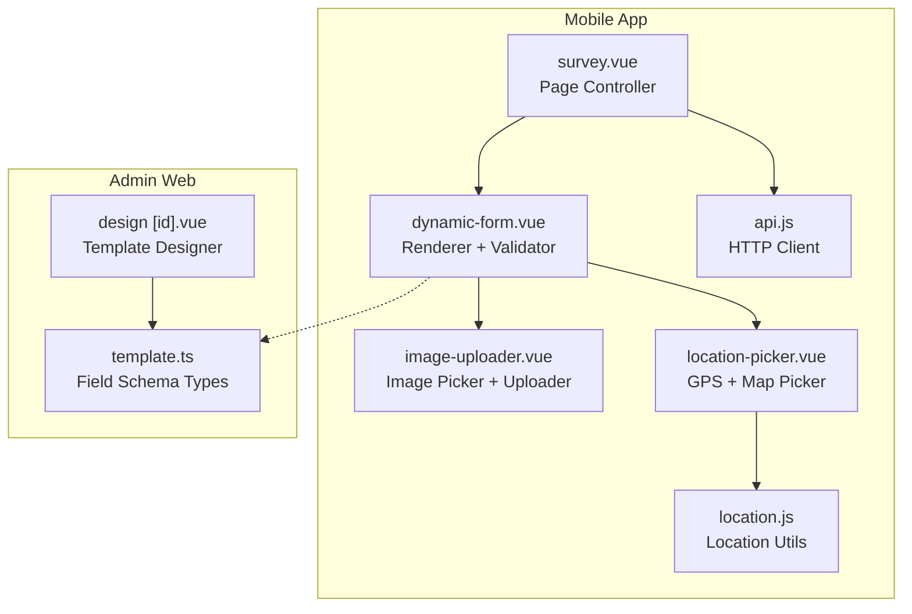
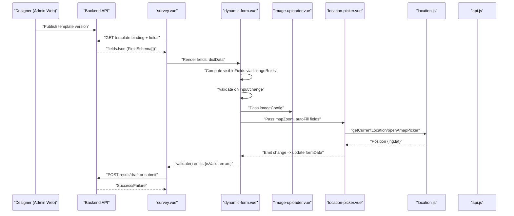
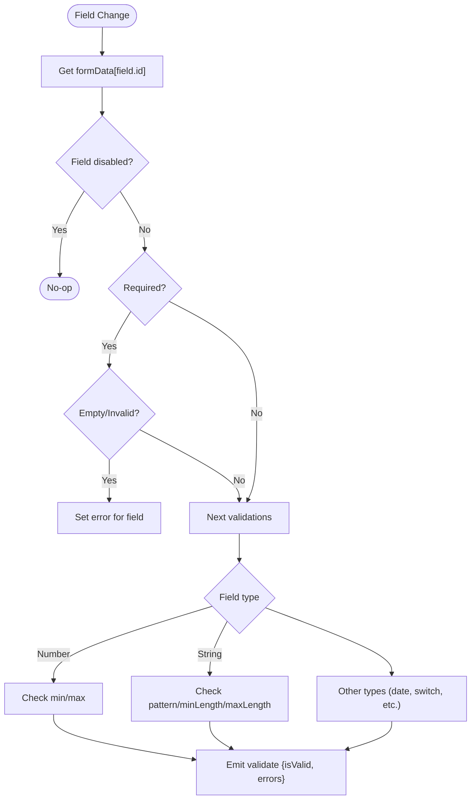
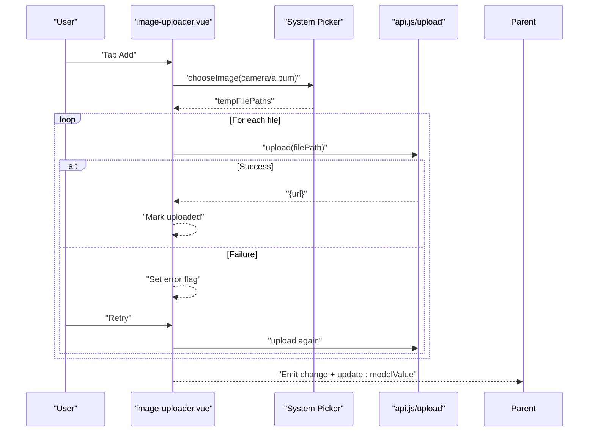
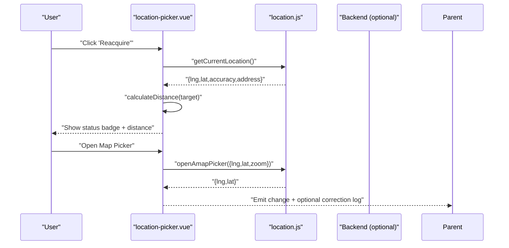
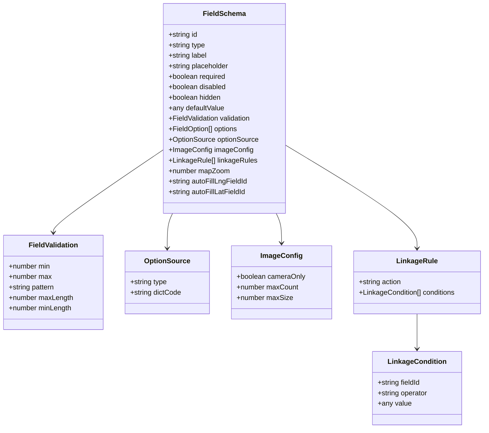
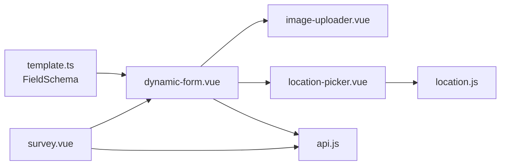

# Form Interface System

<cite>
**Referenced Files in This Document**
- [dynamic-form.vue](file://mobile-app/src/components/dynamic-form/dynamic-form.vue)
- [image-uploader.vue](file://mobile-app/src/components/image-uploader/image-uploader.vue)
- [location-picker.vue](file://mobile-app/src/components/location-picker/location-picker.vue)
- [location.js](file://mobile-app/src/utils/location.js)
- [api.js](file://mobile-app/src/utils/api.js)
- [survey.vue](file://mobile-app/src/pages/survey/survey.vue)
- [template.ts](file://admin-web-soybean/src/service/api/template.ts)
- [design [id].vue](file://admin-web-soybean/src/views/template/design/[id].vue)
</cite>

## Table of Contents
1. [Introduction](#introduction)
2. [Project Structure](#project-structure)
3. [Core Components](#core-components)
4. [Architecture Overview](#architecture-overview)
5. [Detailed Component Analysis](#detailed-component-analysis)
6. [Dependency Analysis](#dependency-analysis)
7. [Performance Considerations](#performance-considerations)
8. [Troubleshooting Guide](#troubleshooting-guide)
9. [Conclusion](#conclusion)

## Introduction
This document describes the dynamic form interface system used to render and validate survey forms across platforms. It covers:
- The form rendering engine that interprets template JSON configurations
- Field validation rules and conditional logic
- Mobile-optimized input components (text inputs, pickers, image uploader, location picker)
- Form state management, validation workflows, and error handling
- Examples of complex layouts, dynamic visibility, and real-time validation feedback
- Accessibility, keyboard handling, and cross-platform input compatibility

## Project Structure
The system spans two applications:
- Mobile app (UniApp/Vue 3): dynamic rendering, validation, and submission
- Admin web (Vue 3 + Ant Design): template design and preview

**Diagram sources**
- [survey.vue:1-159](file://mobile-app/src/pages/survey/survey.vue#L1-L159)
- [dynamic-form.vue:1-336](file://mobile-app/src/components/dynamic-form/dynamic-form.vue#L1-L336)
- [image-uploader.vue:1-319](file://mobile-app/src/components/image-uploader/image-uploader.vue#L1-L319)
- [location-picker.vue:1-314](file://mobile-app/src/components/location-picker/location-picker.vue#L1-L314)
- [location.js:1-357](file://mobile-app/src/utils/location.js#L1-L357)
- [api.js:1-370](file://mobile-app/src/utils/api.js#L1-L370)
- [design [id].vue](file://admin-web-soybean/src/views/template/design/[id].vue#L1-L514)
- [template.ts:1-214](file://admin-web-soybean/src/service/api/template.ts#L1-L214)

**Section sources**
- [survey.vue:1-159](file://mobile-app/src/pages/survey/survey.vue#L1-L159)
- [dynamic-form.vue:1-336](file://mobile-app/src/components/dynamic-form/dynamic-form.vue#L1-L336)
- [image-uploader.vue:1-319](file://mobile-app/src/components/image-uploader/image-uploader.vue#L1-L319)
- [location-picker.vue:1-314](file://mobile-app/src/components/location-picker/location-picker.vue#L1-L314)
- [location.js:1-357](file://mobile-app/src/utils/location.js#L1-L357)
- [api.js:1-370](file://mobile-app/src/utils/api.js#L1-L370)
- [design [id].vue](file://admin-web-soybean/src/views/template/design/[id].vue#L1-L514)
- [template.ts:1-214](file://admin-web-soybean/src/service/api/template.ts#L1-L214)

## Core Components
- Dynamic Form Renderer: Renders fields from a JSON schema, supports validation, linkage rules, and emits events for parent components.
- Image Uploader: Captures photos or selects from gallery, uploads to backend, previews, and handles retries.
- Location Picker: GPS acquisition, map-based selection, distance calculation, and optional纠偏 logging.
- Template Designer: Visual builder for form schemas, validation rules, linkage rules, and option sources.

Key capabilities:
- Real-time validation feedback and error propagation
- Conditional visibility and required-state changes via linkage rules
- Dictionary-backed dropdowns and radio/checkbox options
- Auto-fill of coordinates into separate text fields
- Draft persistence and submission lifecycle

**Section sources**
- [dynamic-form.vue:146-307](file://mobile-app/src/components/dynamic-form/dynamic-form.vue#L146-L307)
- [image-uploader.vue:50-224](file://mobile-app/src/components/image-uploader/image-uploader.vue#L50-L224)
- [location-picker.vue:55-202](file://mobile-app/src/components/location-picker/location-picker.vue#L55-L202)
- [template.ts:6-62](file://admin-web-soybean/src/service/api/template.ts#L6-L62)

## Architecture Overview
End-to-end flow from template design to form submission:

**Diagram sources**
- [design [id].vue](file://admin-web-soybean/src/views/template/design/[id].vue#L135-L184)
- [template.ts:144-150](file://admin-web-soybean/src/service/api/template.ts#L144-L150)
- [survey.vue:69-141](file://mobile-app/src/pages/survey/survey.vue#L69-L141)
- [dynamic-form.vue:180-302](file://mobile-app/src/components/dynamic-form/dynamic-form.vue#L180-L302)
- [image-uploader.vue:97-224](file://mobile-app/src/components/image-uploader/image-uploader.vue#L97-L224)
- [location-picker.vue:134-196](file://mobile-app/src/components/location-picker/location-picker.vue#L134-L196)
- [location.js:144-196](file://mobile-app/src/utils/location.js#L144-L196)
- [api.js:76-101](file://mobile-app/src/utils/api.js#L76-L101)

## Detailed Component Analysis

### Dynamic Form Engine
Responsibilities:
- Render fields based on FieldSchema
- Compute visible fields using linkage rules
- Validate fields in real time
- Manage form state and expose validation results

Rendering highlights:
- Text inputs, textarea, number, select, radio (with sub-fields), checkbox, switch, date, image, location, divider
- Placeholder, required, disabled, hidden flags
- Validation: required, numeric bounds, regex pattern, length checks
- Linkage rules: AND logic across conditions; actions: show/hide/clear/require

State and events:
- Reactive formData and errors
- Emits update:modelValue and validate events
- Supports readonly mode

**Diagram sources**
- [dynamic-form.vue:262-302](file://mobile-app/src/components/dynamic-form/dynamic-form.vue#L262-L302)

**Section sources**
- [dynamic-form.vue:146-307](file://mobile-app/src/components/dynamic-form/dynamic-form.vue#L146-L307)

### Image Uploader Component
Capabilities:
- Camera-only or album selection
- Multi-image preview grid
- Upload progress and error states with retry
- Max count enforcement
- Emits change events with uploaded URLs

**Diagram sources**
- [image-uploader.vue:97-224](file://mobile-app/src/components/image-uploader/image-uploader.vue#L97-L224)
- [api.js:162-191](file://mobile-app/src/utils/api.js#L162-L191)

**Section sources**
- [image-uploader.vue:50-224](file://mobile-app/src/components/image-uploader/image-uploader.vue#L50-L224)
- [api.js:162-191](file://mobile-app/src/utils/api.js#L162-L191)

### Location Picker Component
Features:
- GPS acquisition with accuracy and address lookup
- Map-based picker with configurable zoom
- Distance calculation vs target location
- Status badges and correction tips
- Optional纠偏 logging emission

**Diagram sources**
- [location-picker.vue:134-196](file://mobile-app/src/components/location-picker/location-picker.vue#L134-L196)
- [location.js:22-84](file://mobile-app/src/utils/location.js#L22-L84)
- [location.js:144-196](file://mobile-app/src/utils/location.js#L144-L196)

**Section sources**
- [location-picker.vue:55-202](file://mobile-app/src/components/location-picker/location-picker.vue#L55-L202)
- [location.js:1-357](file://mobile-app/src/utils/location.js#L1-L357)

### Template Designer (Admin Web)
The designer defines:
- FieldSchema with type, label, placeholders, defaults, validation, options, linkage rules
- ImageConfig (cameraOnly, maxCount)
- Location field configuration (mapZoom, autoFillLngFieldId, autoFillLatFieldId)
- Linkage rules with operators (eq/neq/in/contains) and actions (show/hide/clear/require)

**Diagram sources**
- [template.ts:6-62](file://admin-web-soybean/src/service/api/template.ts#L6-L62)

**Section sources**
- [design [id].vue](file://admin-web-soybean/src/views/template/design/[id].vue#L114-L187)
- [template.ts:1-214](file://admin-web-soybean/src/service/api/template.ts#L1-L214)

## Dependency Analysis
- Mobile form renderer depends on:
  - Template schema types (FieldSchema) from admin web
  - Image uploader and location picker components
  - HTTP client for API requests
- Location picker depends on location utilities for GPS and map interactions
- Page controller orchestrates template loading, dictionary loading, and submission

**Diagram sources**
- [template.ts:1-214](file://admin-web-soybean/src/service/api/template.ts#L1-L214)
- [dynamic-form.vue:146-307](file://mobile-app/src/components/dynamic-form/dynamic-form.vue#L146-L307)
- [image-uploader.vue:50-224](file://mobile-app/src/components/image-uploader/image-uploader.vue#L50-L224)
- [location-picker.vue:55-202](file://mobile-app/src/components/location-picker/location-picker.vue#L55-L202)
- [location.js:1-357](file://mobile-app/src/utils/location.js#L1-L357)
- [survey.vue:32-141](file://mobile-app/src/pages/survey/survey.vue#L32-L141)
- [api.js:1-370](file://mobile-app/src/utils/api.js#L1-L370)

**Section sources**
- [survey.vue:32-141](file://mobile-app/src/pages/survey/survey.vue#L32-L141)
- [dynamic-form.vue:146-307](file://mobile-app/src/components/dynamic-form/dynamic-form.vue#L146-L307)
- [template.ts:1-214](file://admin-web-soybean/src/service/api/template.ts#L1-L214)

## Performance Considerations
- Minimize reactivity churn by batching updates and avoiding unnecessary watchers.
- Debounce or throttle real-time validation for long text inputs.
- Limit dictionary loads to only requested codes.
- Use virtualized lists for large option sets.
- Cache uploaded image URLs to avoid redundant network calls.
- Avoid deep watchers on large form data; prefer targeted updates.

## Troubleshooting Guide
Common issues and resolutions:
- Validation not triggering: Ensure required fields are present and linkage rules do not hide them unexpectedly.
- Location acquisition fails: Verify permissions and fallback to system picker; check error messages for permission denials.
- Image upload failures: Confirm network connectivity, token presence, and server-side limits; use retry mechanism.
- Dictionary options missing: Confirm dictCode exists and endpoint returns data; ensure dictData is populated before rendering.
- Linkage rule conflicts: Validate operators and values; remember AND logic across conditions.

Operational checks:
- Network errors: Inspect HTTP client interceptors and error mappings.
- Token expiration: Implement automatic refresh and redirect to login.
- Cross-platform differences: Test on iOS/Android; adjust picker behavior accordingly.

**Section sources**
- [dynamic-form.vue:262-302](file://mobile-app/src/components/dynamic-form/dynamic-form.vue#L262-L302)
- [location.js:144-196](file://mobile-app/src/utils/location.js#L144-L196)
- [api.js:40-71](file://mobile-app/src/utils/api.js#L40-L71)

## Conclusion
The dynamic form system provides a robust, extensible foundation for building survey forms:
- Templates are designed visually and rendered declaratively
- Validation and linkage rules enable complex UX behaviors
- Mobile-first components deliver reliable input experiences
- Strong separation of concerns enables maintainability and scalability