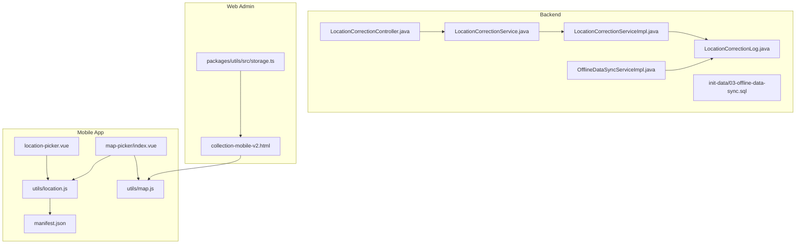
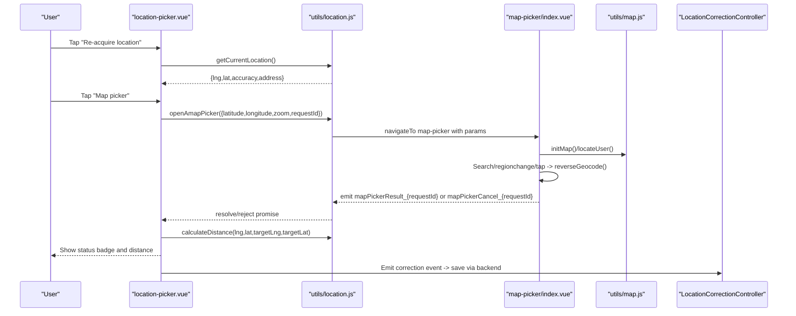
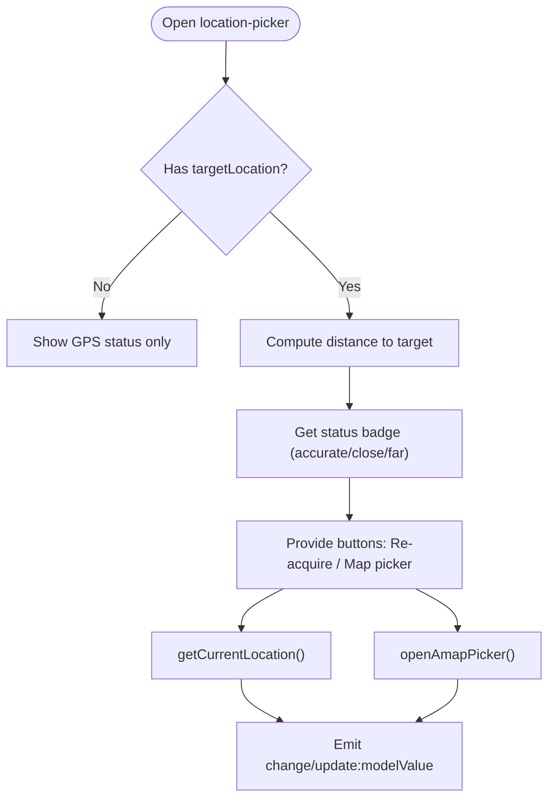
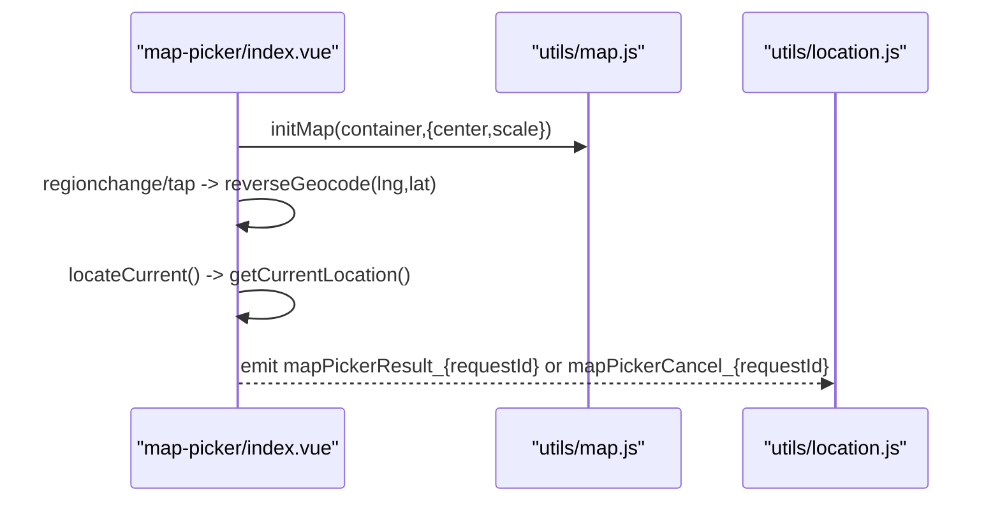
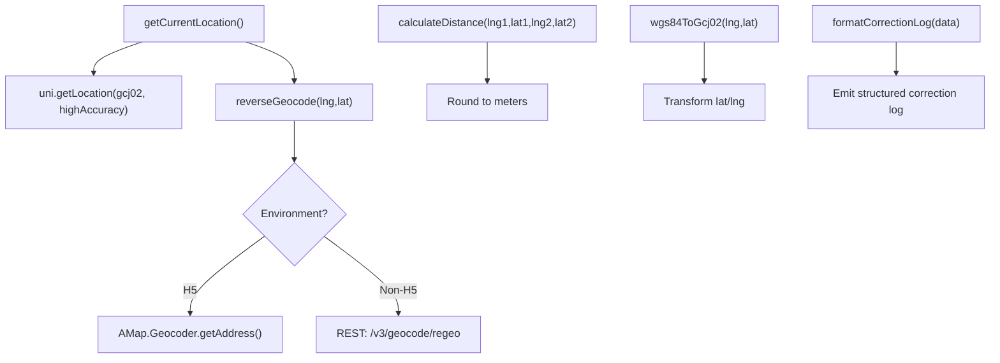
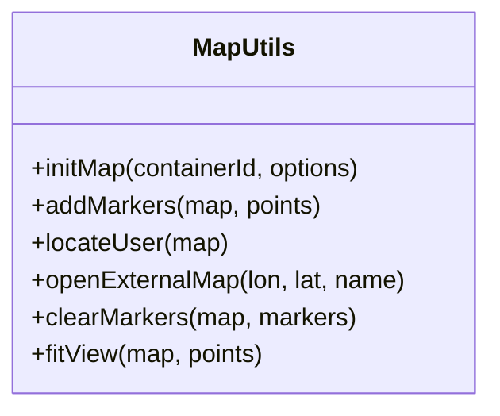
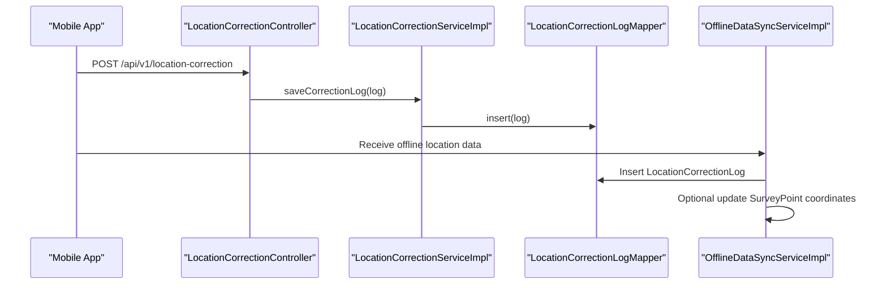
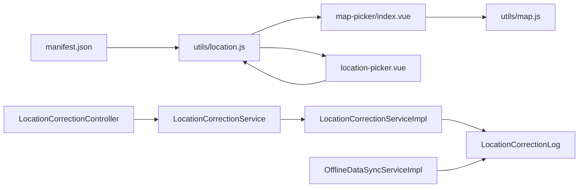

# GPS & Location Services

<cite>
**Referenced Files in This Document**
- [mobile-app/src/components/location-picker/location-picker.vue](file://mobile-app/src/components/location-picker/location-picker.vue)
- [mobile-app/src/pages/map-picker/index.vue](file://mobile-app/src/pages/map-picker/index.vue)
- [mobile-app/src/utils/location.js](file://mobile-app/src/utils/location.js)
- [mobile-app/src/utils/map.js](file://mobile-app/src/utils/map.js)
- [mobile-app/src/manifest.json](file://mobile-app/src/manifest.json)
- [admin-backend/src/main/java/com/qhiot/survey/controller/LocationCorrectionController.java](file://admin-backend/src/main/java/com/qhiot/survey/controller/LocationCorrectionController.java)
- [admin-backend/src/main/java/com/qhiot/survey/entity/LocationCorrectionLog.java](file://admin-backend/src/main/java/com/qhiot/survey/entity/LocationCorrectionLog.java)
- [admin-backend/src/main/java/com/qhiot/survey/service/LocationCorrectionService.java](file://admin-backend/src/main/java/com/qhiot/survey/service/LocationCorrectionService.java)
- [admin-backend/src/main/java/com/qhiot/survey/service/impl/LocationCorrectionServiceImpl.java](file://admin-backend/src/main/java/com/qhiot/survey/service/impl/LocationCorrectionServiceImpl.java)
- [admin-backend/src/main/java/com/qhiot/survey/service/impl/OfflineDataSyncServiceImpl.java](file://admin-backend/src/main/java/com/qhiot/survey/service/impl/OfflineDataSyncServiceImpl.java)
- [admin-backend/init-data/03-offline-data-sync.sql](file://admin-backend/init-data/03-offline-data-sync.sql)
- [admin-web-soybean/public/samples/collection-mobile-v2.html](file://admin-web-soybean/public/samples/collection-mobile-v2.html)
- [admin-web-soybean/packages/utils/src/storage.ts](file://admin-web-soybean/packages/utils/src/storage.ts)
</cite>

## Table of Contents
1. [Introduction](#introduction)
2. [Project Structure](#project-structure)
3. [Core Components](#core-components)
4. [Architecture Overview](#architecture-overview)
5. [Detailed Component Analysis](#detailed-component-analysis)
6. [Dependency Analysis](#dependency-analysis)
7. [Performance Considerations](#performance-considerations)
8. [Troubleshooting Guide](#troubleshooting-guide)
9. [Conclusion](#conclusion)
10. [Appendices](#appendices)

## Introduction
This document explains the GPS and location services integration across the mobile app and backend systems. It covers:
- Location detection algorithms and accuracy thresholds
- Battery optimization strategies via high-accuracy flags and fallbacks
- The location picker component with manual correction capabilities and coordinate conversion utilities
- Geolocation API usage, permission handling, and fallback mechanisms
- Examples of location validation, distance calculations, and proximity-based workflows
- Privacy considerations, location history management, and offline map integration

## Project Structure
The location stack spans three layers:
- Mobile app: location utilities, picker UI, and map integration
- Backend: REST APIs for location correction logs and offline synchronization
- Shared configuration: permissions and map SDK keys

**Diagram sources**
- [mobile-app/src/components/location-picker/location-picker.vue](file://mobile-app/src/components/location-picker/location-picker.vue)
- [mobile-app/src/pages/map-picker/index.vue](file://mobile-app/src/pages/map-picker/index.vue)
- [mobile-app/src/utils/location.js](file://mobile-app/src/utils/location.js)
- [mobile-app/src/utils/map.js](file://mobile-app/src/utils/map.js)
- [mobile-app/src/manifest.json](file://mobile-app/src/manifest.json)
- [admin-backend/src/main/java/com/qhiot/survey/controller/LocationCorrectionController.java](file://admin-backend/src/main/java/com/qhiot/survey/controller/LocationCorrectionController.java)
- [admin-backend/src/main/java/com/qhiot/survey/service/impl/LocationCorrectionServiceImpl.java](file://admin-backend/src/main/java/com/qhiot/survey/service/impl/LocationCorrectionServiceImpl.java)
- [admin-backend/src/main/java/com/qhiot/survey/entity/LocationCorrectionLog.java](file://admin-backend/src/main/java/com/qhiot/survey/entity/LocationCorrectionLog.java)
- [admin-backend/src/main/java/com/qhiot/survey/service/impl/OfflineDataSyncServiceImpl.java](file://admin-backend/src/main/java/com/qhiot/survey/service/impl/OfflineDataSyncServiceImpl.java)
- [admin-backend/init-data/03-offline-data-sync.sql](file://admin-backend/init-data/03-offline-data-sync.sql)
- [admin-web-soybean/public/samples/collection-mobile-v2.html](file://admin-web-soybean/public/samples/collection-mobile-v2.html)
- [admin-web-soybean/packages/utils/src/storage.ts](file://admin-web-soybean/packages/utils/src/storage.ts)

**Section sources**
- [mobile-app/src/components/location-picker/location-picker.vue](file://mobile-app/src/components/location-picker/location-picker.vue)
- [mobile-app/src/pages/map-picker/index.vue](file://mobile-app/src/pages/map-picker/index.vue)
- [mobile-app/src/utils/location.js](file://mobile-app/src/utils/location.js)
- [mobile-app/src/utils/map.js](file://mobile-app/src/utils/map.js)
- [mobile-app/src/manifest.json](file://mobile-app/src/manifest.json)
- [admin-backend/src/main/java/com/qhiot/survey/controller/LocationCorrectionController.java](file://admin-backend/src/main/java/com/qhiot/survey/controller/LocationCorrectionController.java)
- [admin-backend/src/main/java/com/qhiot/survey/service/impl/LocationCorrectionServiceImpl.java](file://admin-backend/src/main/java/com/qhiot/survey/service/impl/LocationCorrectionServiceImpl.java)
- [admin-backend/src/main/java/com/qhiot/survey/entity/LocationCorrectionLog.java](file://admin-backend/src/main/java/com/qhiot/survey/entity/LocationCorrectionLog.java)
- [admin-backend/src/main/java/com/qhiot/survey/service/impl/OfflineDataSyncServiceImpl.java](file://admin-backend/src/main/java/com/qhiot/survey/service/impl/OfflineDataSyncServiceImpl.java)
- [admin-backend/init-data/03-offline-data-sync.sql](file://admin-backend/init-data/03-offline-data-sync.sql)
- [admin-web-soybean/public/samples/collection-mobile-v2.html](file://admin-web-soybean/public/samples/collection-mobile-v2.html)
- [admin-web-soybean/packages/utils/src/storage.ts](file://admin-web-soybean/packages/utils/src/storage.ts)

## Core Components
- Location Picker Component: Vue component that displays current location, accuracy, and distance to a target; supports GPS re-acquisition and manual map selection.
- Map Picker Page: Full-screen map with search, drag-to-select, reverse geocoding, and confirmation/cancel events.
- Location Utilities: GPS acquisition, distance calculation, coordinate conversion (WGS84 to GCJ02), reverse geocoding, and correction logging helpers.
- Map Utilities: Map initialization, marker rendering, user location control, external navigation, and view fitting.
- Backend Controllers and Services: REST endpoints for querying correction logs and saving correction entries; offline sync pipeline supporting location data.

**Section sources**
- [mobile-app/src/components/location-picker/location-picker.vue](file://mobile-app/src/components/location-picker/location-picker.vue)
- [mobile-app/src/pages/map-picker/index.vue](file://mobile-app/src/pages/map-picker/index.vue)
- [mobile-app/src/utils/location.js](file://mobile-app/src/utils/location.js)
- [mobile-app/src/utils/map.js](file://mobile-app/src/utils/map.js)
- [admin-backend/src/main/java/com/qhiot/survey/controller/LocationCorrectionController.java](file://admin-backend/src/main/java/com/qhiot/survey/controller/LocationCorrectionController.java)
- [admin-backend/src/main/java/com/qhiot/survey/service/impl/LocationCorrectionServiceImpl.java](file://admin-backend/src/main/java/com/qhiot/survey/service/impl/LocationCorrectionServiceImpl.java)

## Architecture Overview
End-to-end flow:
- Mobile app acquires GPS (high-accuracy) and optionally reverse-geocodes to enrich address details.
- Users can manually select a point on the map; the system emits structured results and cancellation events.
- Distance to a target point is computed and presented with status indicators.
- Correction logs are formatted and emitted for parent components to persist.
- On backend, REST endpoints expose correction log queries and persistence.
- Offline synchronization supports location data with conflict resolution and correction log insertion.

**Diagram sources**
- [mobile-app/src/components/location-picker/location-picker.vue](file://mobile-app/src/components/location-picker/location-picker.vue)
- [mobile-app/src/utils/location.js](file://mobile-app/src/utils/location.js)
- [mobile-app/src/pages/map-picker/index.vue](file://mobile-app/src/pages/map-picker/index.vue)
- [mobile-app/src/utils/map.js](file://mobile-app/src/utils/map.js)
- [admin-backend/src/main/java/com/qhiot/survey/controller/LocationCorrectionController.java](file://admin-backend/src/main/java/com/qhiot/survey/controller/LocationCorrectionController.java)

## Detailed Component Analysis

### Location Picker Component
- Displays current coordinates, accuracy, and optional address.
- Computes distance to a target location and shows a status badge with color-coded proximity thresholds.
- Provides actions to re-acquire GPS and open the map picker.
- Emits correction data for backend logging and potential point updates.

**Diagram sources**
- [mobile-app/src/components/location-picker/location-picker.vue](file://mobile-app/src/components/location-picker/location-picker.vue)
- [mobile-app/src/utils/location.js](file://mobile-app/src/utils/location.js)

**Section sources**
- [mobile-app/src/components/location-picker/location-picker.vue](file://mobile-app/src/components/location-picker/location-picker.vue)

### Map Picker Page
- Initializes map (H5 vs native), adds a draggable center marker, and reverse-geocodes on move/tap.
- Supports search, “My Location”, and confirmation/cancel flows.
- Emits structured results or cancellation events using request IDs to avoid cross-page collisions.

**Diagram sources**
- [mobile-app/src/pages/map-picker/index.vue](file://mobile-app/src/pages/map-picker/index.vue)
- [mobile-app/src/utils/map.js](file://mobile-app/src/utils/map.js)
- [mobile-app/src/utils/location.js](file://mobile-app/src/utils/location.js)

**Section sources**
- [mobile-app/src/pages/map-picker/index.vue](file://mobile-app/src/pages/map-picker/index.vue)

### Location Utilities
- GPS acquisition with high-accuracy mode and GCJ02 coordinates.
- Reverse geocoding via AMap JS API (H5) or REST endpoint (non-H5).
- Distance calculation using spherical law of cosines approximation.
- Coordinate conversion utilities (WGS84 to GCJ02) and helper formatting/status functions.
- Correction log formatting for backend persistence.

**Diagram sources**
- [mobile-app/src/utils/location.js](file://mobile-app/src/utils/location.js)

**Section sources**
- [mobile-app/src/utils/location.js](file://mobile-app/src/utils/location.js)

### Map Utilities
- Initializes AMap instances, adds markers with status colors, opens info windows, and fits view to bounds.
- Provides user location control and external navigation via AMap URI.

**Diagram sources**
- [mobile-app/src/utils/map.js](file://mobile-app/src/utils/map.js)

**Section sources**
- [mobile-app/src/utils/map.js](file://mobile-app/src/utils/map.js)

### Backend: Location Correction and Offline Sync
- REST endpoints for listing correction logs by page, retrieving trajectory, and saving logs.
- Service layer persists logs and supports pagination and ordered retrieval.
- Offline synchronization pipeline parses incoming JSON, writes correction logs, and conditionally updates point coordinates with conflict resolution.

**Diagram sources**
- [admin-backend/src/main/java/com/qhiot/survey/controller/LocationCorrectionController.java](file://admin-backend/src/main/java/com/qhiot/survey/controller/LocationCorrectionController.java)
- [admin-backend/src/main/java/com/qhiot/survey/service/impl/LocationCorrectionServiceImpl.java](file://admin-backend/src/main/java/com/qhiot/survey/service/impl/LocationCorrectionServiceImpl.java)
- [admin-backend/src/main/java/com/qhiot/survey/entity/LocationCorrectionLog.java](file://admin-backend/src/main/java/com/qhiot/survey/entity/LocationCorrectionLog.java)
- [admin-backend/src/main/java/com/qhiot/survey/service/impl/OfflineDataSyncServiceImpl.java](file://admin-backend/src/main/java/com/qhiot/survey/service/impl/OfflineDataSyncServiceImpl.java)

**Section sources**
- [admin-backend/src/main/java/com/qhiot/survey/controller/LocationCorrectionController.java](file://admin-backend/src/main/java/com/qhiot/survey/controller/LocationCorrectionController.java)
- [admin-backend/src/main/java/com/qhiot/survey/service/LocationCorrectionService.java](file://admin-backend/src/main/java/com/qhiot/survey/service/LocationCorrectionService.java)
- [admin-backend/src/main/java/com/qhiot/survey/service/impl/LocationCorrectionServiceImpl.java](file://admin-backend/src/main/java/com/qhiot/survey/service/impl/LocationCorrectionServiceImpl.java)
- [admin-backend/src/main/java/com/qhiot/survey/entity/LocationCorrectionLog.java](file://admin-backend/src/main/java/com/qhiot/survey/entity/LocationCorrectionLog.java)
- [admin-backend/src/main/java/com/qhiot/survey/service/impl/OfflineDataSyncServiceImpl.java](file://admin-backend/src/main/java/com/qhiot/survey/service/impl/OfflineDataSyncServiceImpl.java)
- [admin-backend/init-data/03-offline-data-sync.sql](file://admin-backend/init-data/03-offline-data-sync.sql)

## Dependency Analysis
- Mobile app depends on:
  - AMap SDK for map and geolocation features.
  - UniApp APIs for location and navigation.
  - Event bus for inter-page communication in map picker.
- Backend depends on:
  - MyBatis-Plus for ORM and pagination.
  - JSON parsing for offline data payloads.
  - AMap REST endpoints for reverse geocoding.

**Diagram sources**
- [mobile-app/src/manifest.json](file://mobile-app/src/manifest.json)
- [mobile-app/src/utils/location.js](file://mobile-app/src/utils/location.js)
- [mobile-app/src/pages/map-picker/index.vue](file://mobile-app/src/pages/map-picker/index.vue)
- [mobile-app/src/utils/map.js](file://mobile-app/src/utils/map.js)
- [mobile-app/src/components/location-picker/location-picker.vue](file://mobile-app/src/components/location-picker/location-picker.vue)
- [admin-backend/src/main/java/com/qhiot/survey/controller/LocationCorrectionController.java](file://admin-backend/src/main/java/com/qhiot/survey/controller/LocationCorrectionController.java)
- [admin-backend/src/main/java/com/qhiot/survey/service/impl/LocationCorrectionServiceImpl.java](file://admin-backend/src/main/java/com/qhiot/survey/service/impl/LocationCorrectionServiceImpl.java)
- [admin-backend/src/main/java/com/qhiot/survey/entity/LocationCorrectionLog.java](file://admin-backend/src/main/java/com/qhiot/survey/entity/LocationCorrectionLog.java)
- [admin-backend/src/main/java/com/qhiot/survey/service/impl/OfflineDataSyncServiceImpl.java](file://admin-backend/src/main/java/com/qhiot/survey/service/impl/OfflineDataSyncServiceImpl.java)

**Section sources**
- [mobile-app/src/manifest.json](file://mobile-app/src/manifest.json)
- [mobile-app/src/utils/location.js](file://mobile-app/src/utils/location.js)
- [mobile-app/src/pages/map-picker/index.vue](file://mobile-app/src/pages/map-picker/index.vue)
- [mobile-app/src/utils/map.js](file://mobile-app/src/utils/map.js)
- [mobile-app/src/components/location-picker/location-picker.vue](file://mobile-app/src/components/location-picker/location-picker.vue)
- [admin-backend/src/main/java/com/qhiot/survey/controller/LocationCorrectionController.java](file://admin-backend/src/main/java/com/qhiot/survey/controller/LocationCorrectionController.java)
- [admin-backend/src/main/java/com/qhiot/survey/service/impl/LocationCorrectionServiceImpl.java](file://admin-backend/src/main/java/com/qhiot/survey/service/impl/LocationCorrectionServiceImpl.java)
- [admin-backend/src/main/java/com/qhiot/survey/entity/LocationCorrectionLog.java](file://admin-backend/src/main/java/com/qhiot/survey/entity/LocationCorrectionLog.java)
- [admin-backend/src/main/java/com/qhiot/survey/service/impl/OfflineDataSyncServiceImpl.java](file://admin-backend/src/main/java/com/qhiot/survey/service/impl/OfflineDataSyncServiceImpl.java)

## Performance Considerations
- Accuracy thresholds:
  - Proximity status thresholds are defined in the location utilities: accurate ≤10 m, close ≤50 m, far >50 m.
- Distance computation:
  - Uses a spherical distance formula optimized for mobile; rounding to integer meters for UI clarity.
- Battery optimization:
  - GPS acquisition uses high-accuracy mode; consider reducing frequency or disabling high-accuracy when continuous tracking is not required.
  - Map picker uses reverse geocoding on move/tap; debounce or throttle callbacks to reduce network calls.
- Offline map integration:
  - The map picker supports native map controls and H5 DOM markers; ensure appropriate zoom and center defaults to minimize unnecessary re-renders.

[No sources needed since this section provides general guidance]

## Troubleshooting Guide
- Permission handling:
  - The app manifest declares location scopes and descriptions; ensure runtime permission prompts are handled in the platform layer.
- GPS acquisition failures:
  - The location utilities reject on failure; surface user-friendly messages and offer manual map selection.
- Map picker timeouts/cancellations:
  - The picker sets a 120-second timeout and emits cancellation events; ensure parent components listen and provide fallbacks.
- Offline sync location updates:
  - The offline sync service writes correction logs and optionally updates point coordinates; verify conflict resolution and server/client wins policies.

**Section sources**
- [mobile-app/src/manifest.json](file://mobile-app/src/manifest.json)
- [mobile-app/src/utils/location.js](file://mobile-app/src/utils/location.js)
- [mobile-app/src/pages/map-picker/index.vue](file://mobile-app/src/pages/map-picker/index.vue)
- [admin-backend/src/main/java/com/qhiot/survey/service/impl/OfflineDataSyncServiceImpl.java](file://admin-backend/src/main/java/com/qhiot/survey/service/impl/OfflineDataSyncServiceImpl.java)

## Conclusion
The system integrates robust GPS acquisition, manual map selection, and backend-backed correction logging with offline synchronization. Clear accuracy thresholds, distance computations, and status badges support proximity-based workflows. Permissions and fallbacks ensure resilient operation across devices and environments.

[No sources needed since this section summarizes without analyzing specific files]

## Appendices

### Examples and Workflows
- Location validation and distance:
  - Use the distance calculator to compare current position against a target; present status badges and optional correction prompts.
- Manual correction:
  - Open the map picker, confirm selection, and emit a correction log payload for backend persistence.
- Offline map integration:
  - Initialize the map with default center/zoom; add markers and info windows; fit view to multiple points.

**Section sources**
- [mobile-app/src/utils/location.js](file://mobile-app/src/utils/location.js)
- [mobile-app/src/pages/map-picker/index.vue](file://mobile-app/src/pages/map-picker/index.vue)
- [mobile-app/src/utils/map.js](file://mobile-app/src/utils/map.js)
- [admin-web-soybean/public/samples/collection-mobile-v2.html](file://admin-web-soybean/public/samples/collection-mobile-v2.html)

### Privacy and History Management
- Permissions:
  - Declared in the app manifest with localized descriptions for user transparency.
- Data retention:
  - Correction logs capture timestamps and coordinates; manage retention via backend policies.
- Offline storage:
  - IndexedDB/localStorage utilities are available for caching; ensure sensitive data is encrypted or scoped appropriately.

**Section sources**
- [mobile-app/src/manifest.json](file://mobile-app/src/manifest.json)
- [admin-web-soybean/packages/utils/src/storage.ts](file://admin-web-soybean/packages/utils/src/storage.ts)