# Mobile Application

<cite>
**Referenced Files in This Document**
- [mobile-app/src/App.vue](file://mobile-app/src/App.vue)
- [mobile-app/src/main.js](file://mobile-app/src/main.js)
- [mobile-app/package.json](file://mobile-app/package.json)
- [mobile-app/vite.config.js](file://mobile-app/vite.config.js)
- [mobile-app/src/pages.json](file://mobile-app/src/pages.json)
- [mobile-app/src/utils/api.js](file://mobile-app/src/utils/api.js)
- [mobile-app/src/utils/auth.js](file://mobile-app/src/utils/auth.js)
- [mobile-app/src/utils/location.js](file://mobile-app/src/utils/location.js)
- [mobile-app/src/utils/map.js](file://mobile-app/src/utils/map.js)
- [mobile-app/src/utils/draft.js](file://mobile-app/src/utils/draft.js)
- [mobile-app/src/components/dynamic-form/dynamic-form.vue](file://mobile-app/src/components/dynamic-form/dynamic-form.vue)
- [mobile-app/src/components/image-uploader/image-uploader.vue](file://mobile-app/src/components/image-uploader/image-uploader.vue)
- [mobile-app/src/components/location-picker/location-picker.vue](file://mobile-app/src/components/location-picker/location-picker.vue)
- [mobile-app/src/pages/home/home.vue](file://mobile-app/src/pages/home/home.vue)
- [mobile-app/src/pages/survey/survey.vue](file://mobile-app/src/pages/survey/survey.vue)
</cite>

## Table of Contents
1. [Introduction](#introduction)
2. [Project Structure](#project-structure)
3. [Core Components](#core-components)
4. [Architecture Overview](#architecture-overview)
5. [Detailed Component Analysis](#detailed-component-analysis)
6. [Dependency Analysis](#dependency-analysis)
7. [Performance Considerations](#performance-considerations)
8. [Troubleshooting Guide](#troubleshooting-guide)
9. [Conclusion](#conclusion)
10. [Appendices](#appendices)

## Introduction
This document describes the uni-app mobile application for field survey data collection. It covers the mobile-first design approach, responsive layout strategies, offline data collection with local storage and sync mechanisms, GPS integration for location services and manual correction workflows, the form collection interface optimized for mobile input and validation, and cross-platform compatibility and performance characteristics. The application is built with Vue 3 and Vite, integrates with a backend API, and uses high-precision location services via Amap.

## Project Structure
The mobile application resides under the mobile-app directory and follows a uni-app/H5 project layout:
- Entry and routing: main.js defines routes and a global beforeEach guard using localStorage for authentication.
- Pages configuration: pages.json defines page routes, tabBar, navigation bar styles, and platform permissions.
- Utilities: api.js, auth.js, location.js, map.js, draft.js encapsulate network requests, authentication, location services, map interactions, and offline draft storage.
- Components: reusable UI components for dynamic forms, image uploads, and location picking.
- Pages: feature pages such as home dashboard, survey form, and others.

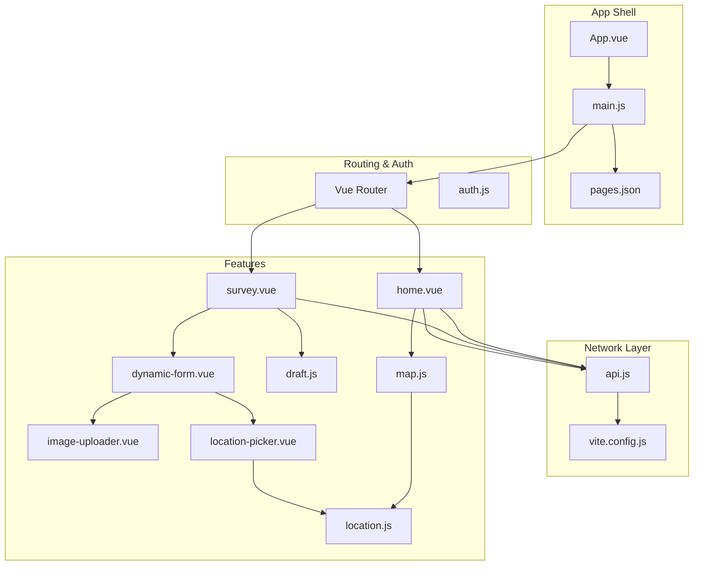

**Diagram sources**
- [mobile-app/src/App.vue:1-44](file://mobile-app/src/App.vue#L1-L44)
- [mobile-app/src/main.js:1-49](file://mobile-app/src/main.js#L1-L49)
- [mobile-app/src/pages.json:1-152](file://mobile-app/src/pages.json#L1-L152)
- [mobile-app/src/utils/api.js:1-370](file://mobile-app/src/utils/api.js#L1-L370)
- [mobile-app/vite.config.js:1-23](file://mobile-app/vite.config.js#L1-L23)
- [mobile-app/src/pages/home/home.vue:1-554](file://mobile-app/src/pages/home/home.vue#L1-L554)
- [mobile-app/src/pages/survey/survey.vue:1-159](file://mobile-app/src/pages/survey/survey.vue#L1-L159)
- [mobile-app/src/components/dynamic-form/dynamic-form.vue:1-336](file://mobile-app/src/components/dynamic-form/dynamic-form.vue#L1-L336)
- [mobile-app/src/components/image-uploader/image-uploader.vue:1-319](file://mobile-app/src/components/image-uploader/image-uploader.vue#L1-L319)
- [mobile-app/src/components/location-picker/location-picker.vue:1-314](file://mobile-app/src/components/location-picker/location-picker.vue#L1-L314)
- [mobile-app/src/utils/draft.js:1-206](file://mobile-app/src/utils/draft.js#L1-L206)
- [mobile-app/src/utils/location.js:1-357](file://mobile-app/src/utils/location.js#L1-L357)
- [mobile-app/src/utils/map.js:1-214](file://mobile-app/src/utils/map.js#L1-L214)

**Section sources**
- [mobile-app/src/App.vue:1-44](file://mobile-app/src/App.vue#L1-L44)
- [mobile-app/src/main.js:1-49](file://mobile-app/src/main.js#L1-L49)
- [mobile-app/src/pages.json:1-152](file://mobile-app/src/pages.json#L1-L152)
- [mobile-app/vite.config.js:1-23](file://mobile-app/vite.config.js#L1-L23)

## Core Components
- Authentication and routing: A global router guard checks for a stored access token and redirects unauthenticated users to the login page. Utility helpers manage token and user info persistence and role checks.
- Network layer: A unified request wrapper handles base URL, token injection, Content-Type, timeouts, and response normalization, with interceptors for 401/403 handling and business status codes.
- Location services: GPS acquisition, reverse geocoding, distance calculation, coordinate conversion, and a map picker workflow with fallbacks. A dedicated component integrates Amap selection and manual correction.
- Map integration: Amap initialization, marker rendering, info windows, external navigation, and view fitting.
- Offline drafts: Local storage of form data with lists, expiration, and cleanup; sync attempts against backend.
- Form collection: A dynamic form component supporting multiple input types, validation, linkage rules, and integration with image and location pickers.

**Section sources**
- [mobile-app/src/main.js:33-43](file://mobile-app/src/main.js#L33-L43)
- [mobile-app/src/utils/auth.js:1-186](file://mobile-app/src/utils/auth.js#L1-L186)
- [mobile-app/src/utils/api.js:1-370](file://mobile-app/src/utils/api.js#L1-L370)
- [mobile-app/src/utils/location.js:1-357](file://mobile-app/src/utils/location.js#L1-L357)
- [mobile-app/src/utils/map.js:1-214](file://mobile-app/src/utils/map.js#L1-L214)
- [mobile-app/src/utils/draft.js:1-206](file://mobile-app/src/utils/draft.js#L1-L206)
- [mobile-app/src/components/dynamic-form/dynamic-form.vue:1-336](file://mobile-app/src/components/dynamic-form/dynamic-form.vue#L1-L336)

## Architecture Overview
The application follows a layered architecture:
- Presentation layer: Vue 3 single-file components for pages and reusable UI components.
- Domain services: Utilities for auth, API, location, map, and draft management.
- Backend integration: RESTful API consumption with centralized request/response handling.
- Platform abstractions: uni-app APIs for navigation, storage, geolocation, and file upload.

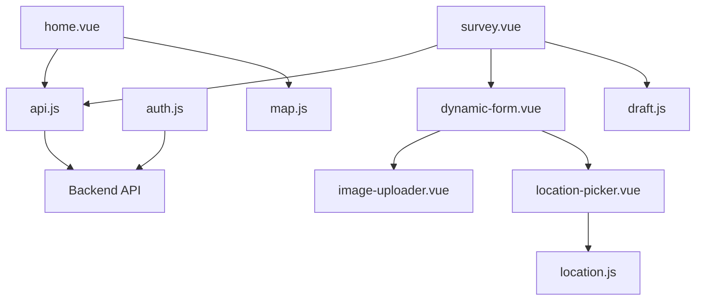

**Diagram sources**
- [mobile-app/src/pages/home/home.vue:1-554](file://mobile-app/src/pages/home/home.vue#L1-L554)
- [mobile-app/src/pages/survey/survey.vue:1-159](file://mobile-app/src/pages/survey/survey.vue#L1-L159)
- [mobile-app/src/components/dynamic-form/dynamic-form.vue:1-336](file://mobile-app/src/components/dynamic-form/dynamic-form.vue#L1-L336)
- [mobile-app/src/components/image-uploader/image-uploader.vue:1-319](file://mobile-app/src/components/image-uploader/image-uploader.vue#L1-L319)
- [mobile-app/src/components/location-picker/location-picker.vue:1-314](file://mobile-app/src/components/location-picker/location-picker.vue#L1-L314)
- [mobile-app/src/utils/auth.js:1-186](file://mobile-app/src/utils/auth.js#L1-L186)
- [mobile-app/src/utils/api.js:1-370](file://mobile-app/src/utils/api.js#L1-L370)
- [mobile-app/src/utils/location.js:1-357](file://mobile-app/src/utils/location.js#L1-L357)
- [mobile-app/src/utils/map.js:1-214](file://mobile-app/src/utils/map.js#L1-L214)
- [mobile-app/src/utils/draft.js:1-206](file://mobile-app/src/utils/draft.js#L1-L206)

## Detailed Component Analysis

### Authentication and Routing
- Global route guard reads a token from storage and redirects to login for protected routes.
- Auth utilities persist tokens and user info, expose role checks, and provide login-type awareness.
- Pages configuration includes permission declarations for user location, camera, and album access.

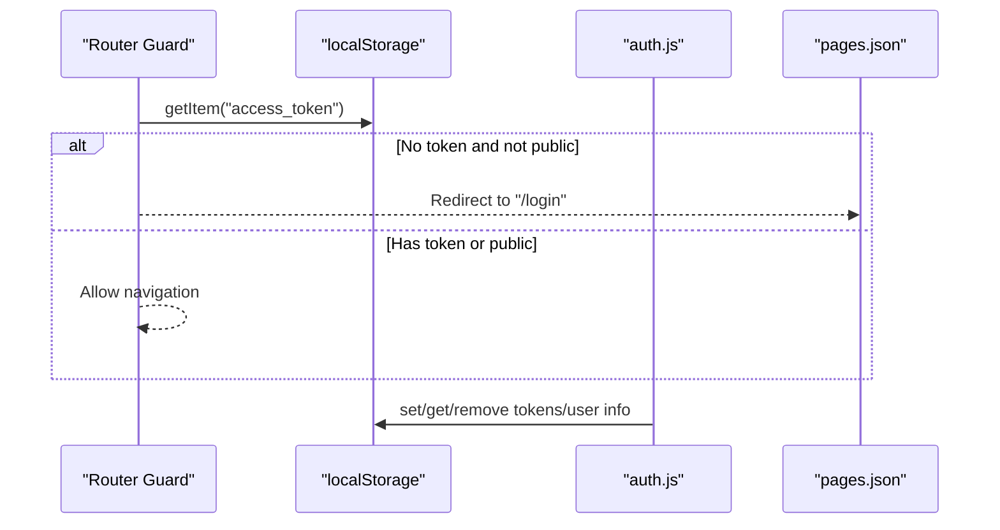

**Diagram sources**
- [mobile-app/src/main.js:33-43](file://mobile-app/src/main.js#L33-L43)
- [mobile-app/src/utils/auth.js:1-186](file://mobile-app/src/utils/auth.js#L1-L186)
- [mobile-app/src/pages.json:140-150](file://mobile-app/src/pages.json#L140-L150)

**Section sources**
- [mobile-app/src/main.js:33-43](file://mobile-app/src/main.js#L33-L43)
- [mobile-app/src/utils/auth.js:1-186](file://mobile-app/src/utils/auth.js#L1-L186)
- [mobile-app/src/pages.json:140-150](file://mobile-app/src/pages.json#L140-L150)

### Network Layer and API Abstraction
- Centralized request wrapper sets base URL, injects Authorization header, ensures Content-Type, applies timeout, and normalizes responses.
- Interceptors handle 401 (logout), 403 (no permission), non-200 HTTP statuses, and business code validation.
- Convenience methods for GET/POST/PUT/DELETE and file upload are exported, along with domain-specific API modules (auth, user, project, point, result, audit, message, location, dict, file).

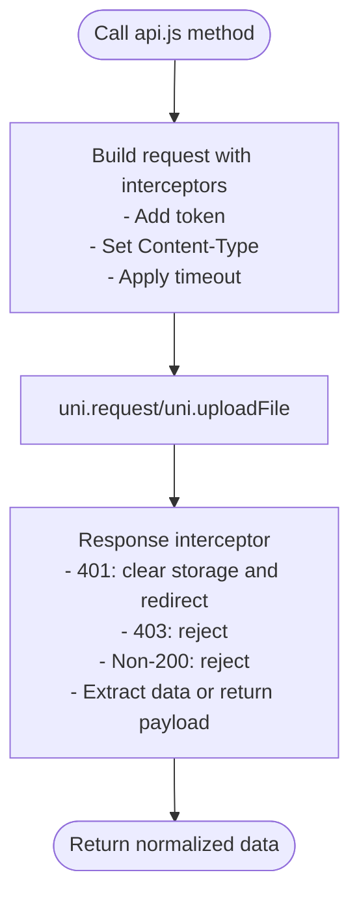

**Diagram sources**
- [mobile-app/src/utils/api.js:76-101](file://mobile-app/src/utils/api.js#L76-L101)
- [mobile-app/src/utils/api.js:43-71](file://mobile-app/src/utils/api.js#L43-L71)

**Section sources**
- [mobile-app/src/utils/api.js:1-370](file://mobile-app/src/utils/api.js#L1-L370)

### Offline Draft Management
- Drafts are persisted per point ID with metadata and timestamps.
- Draft list maintains a compact index for quick retrieval and UI display.
- Expiration policy supports cleanup after a configurable number of days.
- The survey page integrates draft saving and submission, clearing the draft upon successful submission.

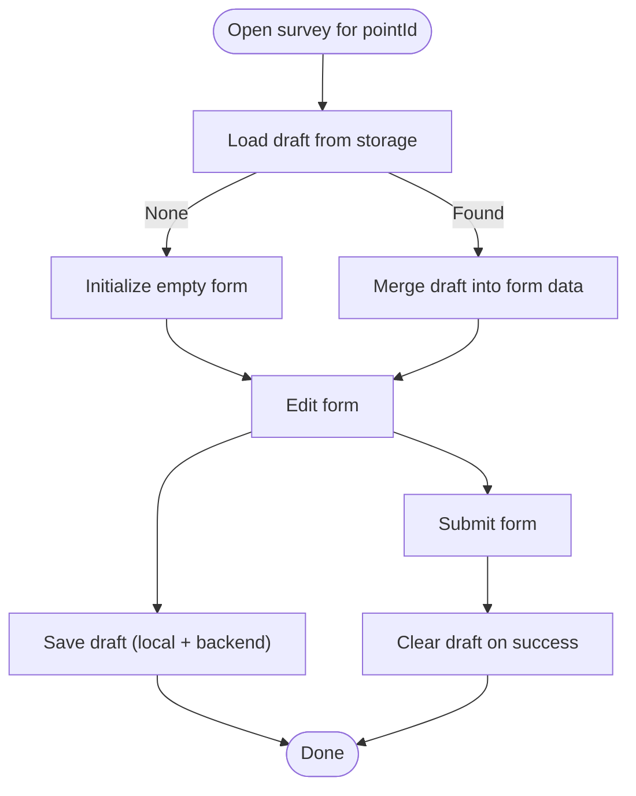

**Diagram sources**
- [mobile-app/src/utils/draft.js:14-34](file://mobile-app/src/utils/draft.js#L14-L34)
- [mobile-app/src/pages/survey/survey.vue:115-122](file://mobile-app/src/pages/survey/survey.vue#L115-L122)
- [mobile-app/src/pages/survey/survey.vue:134-136](file://mobile-app/src/pages/survey/survey.vue#L134-L136)

**Section sources**
- [mobile-app/src/utils/draft.js:1-206](file://mobile-app/src/utils/draft.js#L1-L206)
- [mobile-app/src/pages/survey/survey.vue:1-159](file://mobile-app/src/pages/survey/survey.vue#L1-L159)

### GPS Integration and Manual Correction
- Current location acquisition uses a high-accuracy coordinate system suitable for Amap.
- Reverse geocoding provides address components across H5 and non-H5 environments.
- Distance calculation and proximity checks support guidance for manual correction.
- A map picker workflow integrates Amap selection with event-based communication and fallbacks to system picker.
- The location picker component exposes methods for programmatic location retrieval and emits correction events.

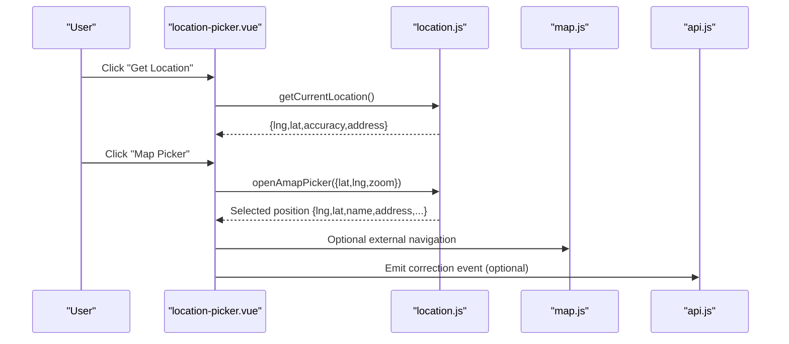

**Diagram sources**
- [mobile-app/src/components/location-picker/location-picker.vue:134-176](file://mobile-app/src/components/location-picker/location-picker.vue#L134-L176)
- [mobile-app/src/utils/location.js:144-164](file://mobile-app/src/utils/location.js#L144-L164)
- [mobile-app/src/utils/location.js:22-84](file://mobile-app/src/utils/location.js#L22-L84)
- [mobile-app/src/utils/map.js:153-172](file://mobile-app/src/utils/map.js#L153-L172)

**Section sources**
- [mobile-app/src/utils/location.js:1-357](file://mobile-app/src/utils/location.js#L1-L357)
- [mobile-app/src/utils/map.js:1-214](file://mobile-app/src/utils/map.js#L1-L214)
- [mobile-app/src/components/location-picker/location-picker.vue:1-314](file://mobile-app/src/components/location-picker/location-picker.vue#L1-L314)

### Form Collection Interface
- Dynamic form renders fields based on a schema, supports validation, linkage rules, and auto-fill for location fields.
- Integrated image uploader supports camera/album selection, compression, preview, and real-time upload with error handling and retry.
- Location picker integrates GPS, map selection, and distance-based guidance.

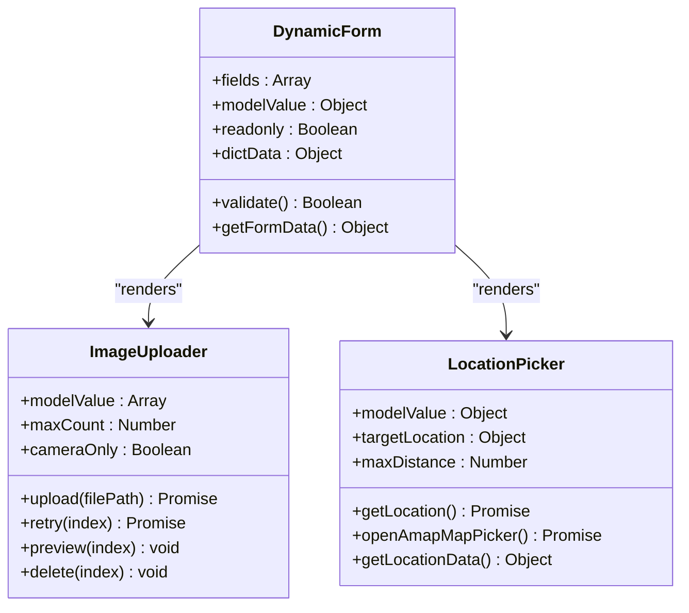

**Diagram sources**
- [mobile-app/src/components/dynamic-form/dynamic-form.vue:146-306](file://mobile-app/src/components/dynamic-form/dynamic-form.vue#L146-L306)
- [mobile-app/src/components/image-uploader/image-uploader.vue:50-224](file://mobile-app/src/components/image-uploader/image-uploader.vue#L50-L224)
- [mobile-app/src/components/location-picker/location-picker.vue:55-202](file://mobile-app/src/components/location-picker/location-picker.vue#L55-L202)

**Section sources**
- [mobile-app/src/components/dynamic-form/dynamic-form.vue:1-336](file://mobile-app/src/components/dynamic-form/dynamic-form.vue#L1-L336)
- [mobile-app/src/components/image-uploader/image-uploader.vue:1-319](file://mobile-app/src/components/image-uploader/image-uploader.vue#L1-L319)
- [mobile-app/src/components/location-picker/location-picker.vue:1-314](file://mobile-app/src/components/location-picker/location-picker.vue#L1-L314)

### Example Workflows

#### Offline Synchronization
- Save a draft locally and sync to backend; on success, clear the local draft.
- On subsequent visits, restore draft data from storage and optionally submit.

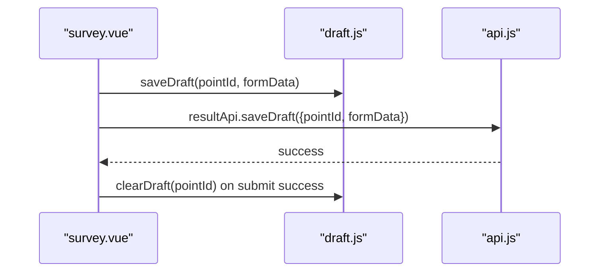

**Diagram sources**
- [mobile-app/src/pages/survey/survey.vue:115-122](file://mobile-app/src/pages/survey/survey.vue#L115-L122)
- [mobile-app/src/pages/survey/survey.vue:134-136](file://mobile-app/src/pages/survey/survey.vue#L134-L136)
- [mobile-app/src/utils/draft.js:14-34](file://mobile-app/src/utils/draft.js#L14-L34)

#### Location Tracking and Manual Correction
- Acquire current location and display status; if too far from target, prompt manual correction via map picker.

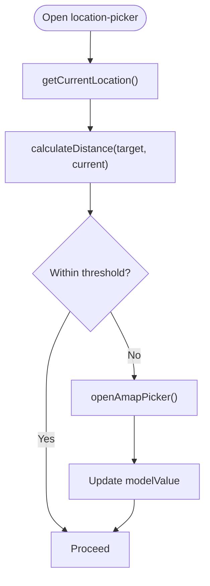

**Diagram sources**
- [mobile-app/src/components/location-picker/location-picker.vue:134-176](file://mobile-app/src/components/location-picker/location-picker.vue#L134-L176)
- [mobile-app/src/utils/location.js:206-235](file://mobile-app/src/utils/location.js#L206-L235)

#### Image Capture and Upload
- Choose camera or album, compress and upload immediately, show progress/error, and emit updates.

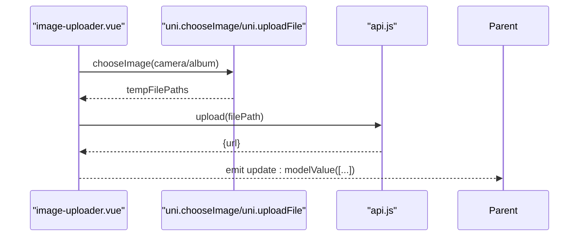

**Diagram sources**
- [mobile-app/src/components/image-uploader/image-uploader.vue:118-160](file://mobile-app/src/components/image-uploader/image-uploader.vue#L118-L160)
- [mobile-app/src/utils/api.js:162-191](file://mobile-app/src/utils/api.js#L162-L191)

#### Data Submission
- Validate form, confirm submission, submit to backend, clear draft, and navigate back.

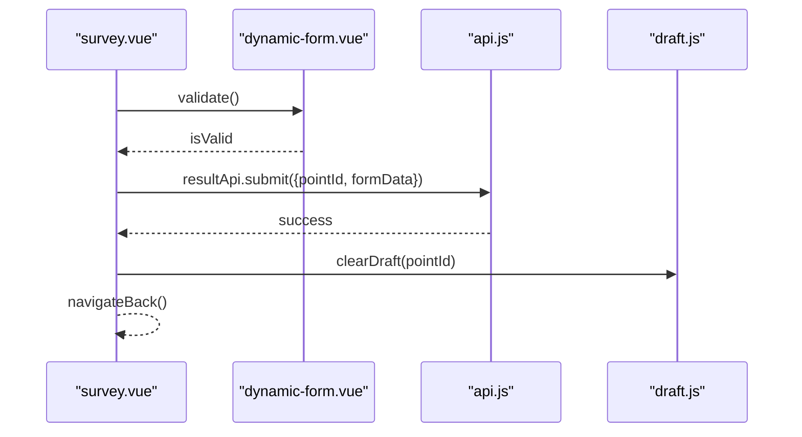

**Diagram sources**
- [mobile-app/src/pages/survey/survey.vue:124-141](file://mobile-app/src/pages/survey/survey.vue#L124-L141)

## Dependency Analysis
- Runtime dependencies: Vue 3, Vue Router, Axios.
- Dev dependencies: Vite, @vitejs/plugin-vue, sass.
- Aliasing: Vite alias @ -> src for imports.
- Proxy: Vite dev server proxies /api to backend.

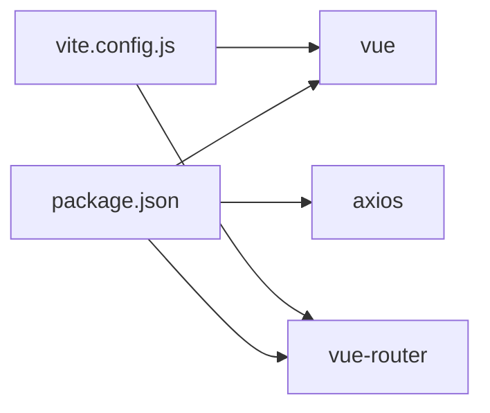

**Diagram sources**
- [mobile-app/package.json:11-21](file://mobile-app/package.json#L11-L21)
- [mobile-app/vite.config.js:1-23](file://mobile-app/vite.config.js#L1-L23)

**Section sources**
- [mobile-app/package.json:1-22](file://mobile-app/package.json#L1-L22)
- [mobile-app/vite.config.js:1-23](file://mobile-app/vite.config.js#L1-L23)

## Performance Considerations
- Use compressed image uploads to reduce payload sizes.
- Debounce or throttle location updates and avoid frequent reverse geocoding calls.
- Lazy-load heavy components and map initialization only when needed.
- Minimize DOM updates by using reactive refs and avoiding unnecessary watchers.
- Prefer native picker components for camera/album to leverage platform optimizations.

## Troubleshooting Guide
- Authentication failures: 401 triggers automatic logout and redirect to login; verify token lifecycle and refresh endpoints.
- Permission denials: Ensure user grants location, camera, and album permissions; check pages.json permission entries.
- Network errors: Inspect request interceptor messages and ensure backend availability and CORS configuration.
- Location issues: Verify GPS accuracy settings and Amap API keys; test fallback to system picker.
- Draft corruption: Validate JSON parsing and storage quotas; implement cleanup for expired drafts.

**Section sources**
- [mobile-app/src/utils/api.js:47-68](file://mobile-app/src/utils/api.js#L47-L68)
- [mobile-app/src/pages.json:140-150](file://mobile-app/src/pages.json#L140-L150)
- [mobile-app/src/utils/draft.js:179-187](file://mobile-app/src/utils/draft.js#L179-L187)

## Conclusion
The mobile application provides a robust, mobile-first solution for field survey data collection. It leverages uni-app’s cross-platform capabilities, integrates precise location services, offers a flexible dynamic form system, and implements reliable offline draft management with backend synchronization. The modular architecture and reusable components facilitate maintainability and scalability.

## Appendices

### Cross-Platform Compatibility Notes
- Platform-specific branches are used for H5, APP-PLUS, and MP-WEIXIN to adapt UI and native integrations.
- Permissions are declared in pages.json for consistent behavior across platforms.

**Section sources**
- [mobile-app/src/utils/map.js:156-172](file://mobile-app/src/utils/map.js#L156-L172)
- [mobile-app/src/pages.json:139-150](file://mobile-app/src/pages.json#L139-L150)