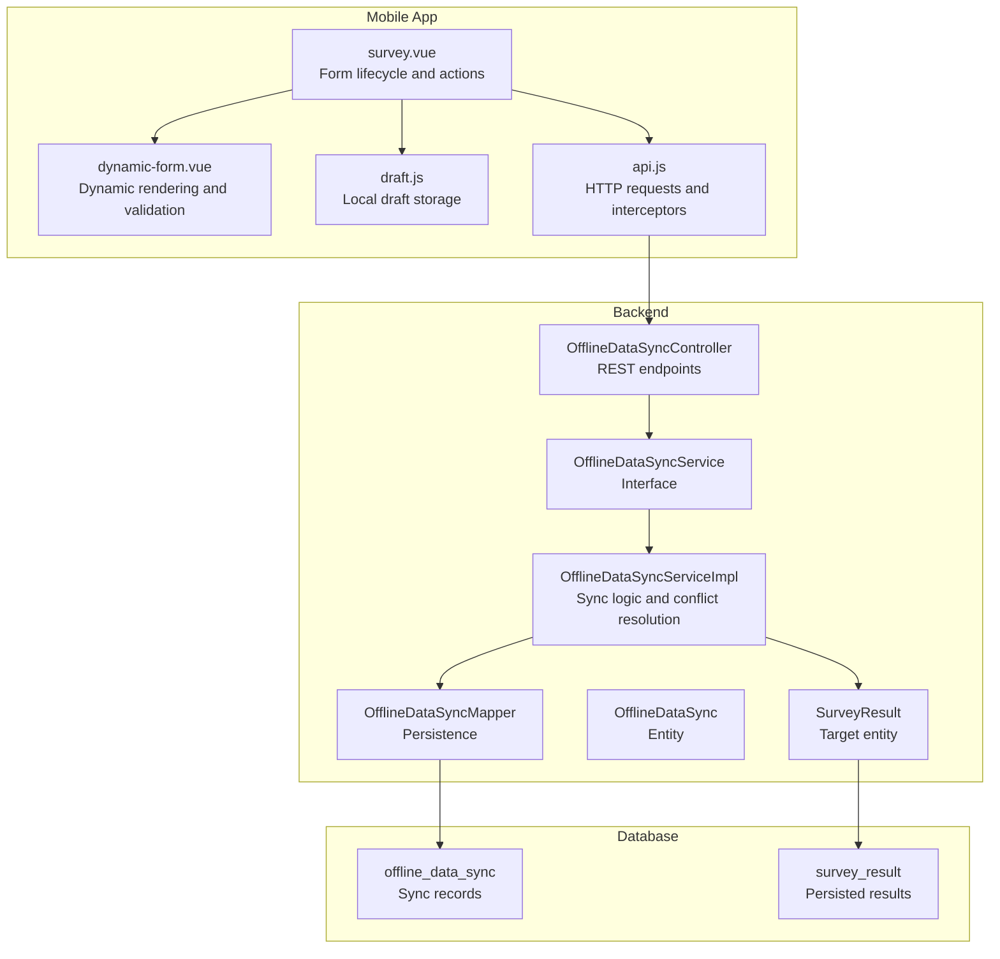
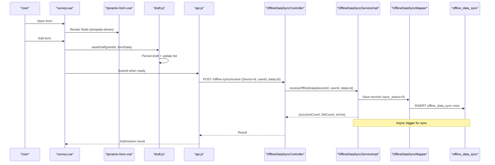
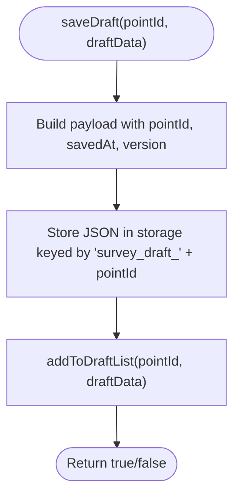
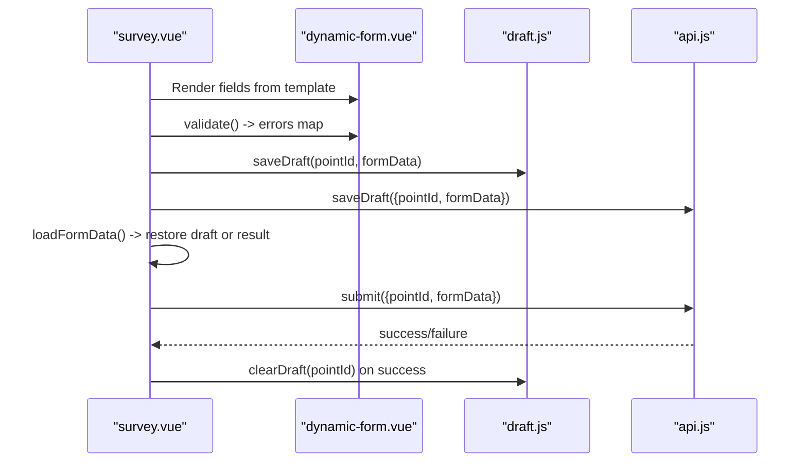
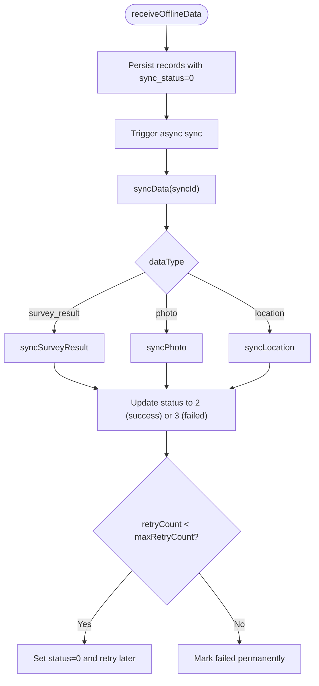
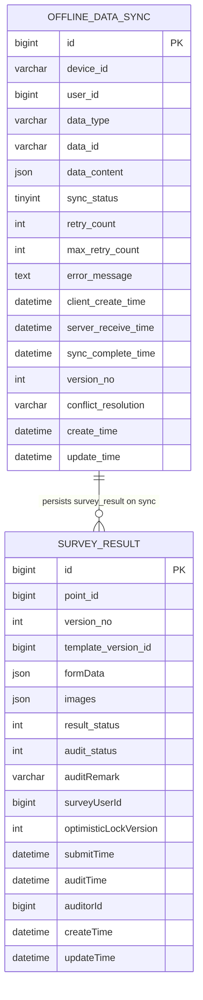
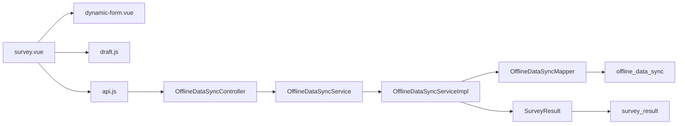

# Offline Data Collection

<cite>
**Referenced Files in This Document**
- [draft.js](file://mobile-app/src/utils/draft.js)
- [survey.vue](file://mobile-app/src/pages/survey/survey.vue)
- [dynamic-form.vue](file://mobile-app/src/components/dynamic-form/dynamic-form.vue)
- [api.js](file://mobile-app/src/utils/api.js)
- [OfflineDataSyncController.java](file://admin-backend/src/main/java/com/qhiot/survey/controller/OfflineDataSyncController.java)
- [OfflineDataSyncService.java](file://admin-backend/src/main/java/com/qhiot/survey/service/OfflineDataSyncService.java)
- [OfflineDataSyncServiceImpl.java](file://admin-backend/src/main/java/com/qhiot/survey/service/impl/OfflineDataSyncServiceImpl.java)
- [OfflineDataSyncMapper.java](file://admin-backend/src/main/java/com/qhiot/survey/mapper/OfflineDataSyncMapper.java)
- [OfflineDataSync.java](file://admin-backend/src/main/java/com/qhiot/survey/entity/OfflineDataSync.java)
- [SurveyResult.java](file://admin-backend/src/main/java/com/qhiot/survey/entity/SurveyResult.java)
- [03-offline-data-sync.sql](file://admin-backend/init-data/03-offline-data-sync.sql)
- [OfflineDataSyncServiceTest.java](file://admin-backend/src/test/java/com/qhiot/survey/service/OfflineDataSyncServiceTest.java)
</cite>

## Table of Contents
1. [Introduction](#introduction)
2. [Project Structure](#project-structure)
3. [Core Components](#core-components)
4. [Architecture Overview](#architecture-overview)
5. [Detailed Component Analysis](#detailed-component-analysis)
6. [Dependency Analysis](#dependency-analysis)
7. [Performance Considerations](#performance-considerations)
8. [Troubleshooting Guide](#troubleshooting-guide)
9. [Conclusion](#conclusion)

## Introduction
This document describes the offline data collection system for the Survey-App, focusing on draft saving, local storage strategies, offline form persistence, and the synchronization workflow between local data and server updates. It documents the draft management utilities (saveDraft, getDraft, clearDraft), offline form validation and persistence patterns, recovery mechanisms, conflict resolution strategies, and performance considerations for large forms and offline data integrity checks.

## Project Structure
The offline data collection spans three layers:
- Mobile app (UniApp): dynamic forms, draft utilities, and submission APIs
- Backend (Spring Boot): offline sync controller, service, and persistence
- Database: offline sync records and survey results

**Diagram sources**
- [survey.vue:1-159](file://mobile-app/src/pages/survey/survey.vue#L1-L159)
- [dynamic-form.vue:1-336](file://mobile-app/src/components/dynamic-form/dynamic-form.vue#L1-L336)
- [draft.js:1-206](file://mobile-app/src/utils/draft.js#L1-L206)
- [api.js:1-370](file://mobile-app/src/utils/api.js#L1-L370)
- [OfflineDataSyncController.java:1-95](file://admin-backend/src/main/java/com/qhiot/survey/controller/OfflineDataSyncController.java#L1-L95)
- [OfflineDataSyncService.java:1-84](file://admin-backend/src/main/java/com/qhiot/survey/service/OfflineDataSyncService.java#L1-L84)
- [OfflineDataSyncServiceImpl.java:1-694](file://admin-backend/src/main/java/com/qhiot/survey/service/impl/OfflineDataSyncServiceImpl.java#L1-L694)
- [OfflineDataSyncMapper.java:1-13](file://admin-backend/src/main/java/com/qhiot/survey/mapper/OfflineDataSyncMapper.java#L1-L13)
- [OfflineDataSync.java:1-71](file://admin-backend/src/main/java/com/qhiot/survey/entity/OfflineDataSync.java#L1-L71)
- [SurveyResult.java:1-93](file://admin-backend/src/main/java/com/qhiot/survey/entity/SurveyResult.java#L1-L93)
- [03-offline-data-sync.sql:1-27](file://admin-backend/init-data/03-offline-data-sync.sql#L1-L27)

**Section sources**
- [survey.vue:1-159](file://mobile-app/src/pages/survey/survey.vue#L1-L159)
- [dynamic-form.vue:1-336](file://mobile-app/src/components/dynamic-form/dynamic-form.vue#L1-L336)
- [draft.js:1-206](file://mobile-app/src/utils/draft.js#L1-L206)
- [api.js:1-370](file://mobile-app/src/utils/api.js#L1-L370)
- [OfflineDataSyncController.java:1-95](file://admin-backend/src/main/java/com/qhiot/survey/controller/OfflineDataSyncController.java#L1-L95)
- [OfflineDataSyncService.java:1-84](file://admin-backend/src/main/java/com/qhiot/survey/service/OfflineDataSyncService.java#L1-L84)
- [OfflineDataSyncServiceImpl.java:1-694](file://admin-backend/src/main/java/com/qhiot/survey/service/impl/OfflineDataSyncServiceImpl.java#L1-L694)
- [OfflineDataSyncMapper.java:1-13](file://admin-backend/src/main/java/com/qhiot/survey/mapper/OfflineDataSyncMapper.java#L1-L13)
- [OfflineDataSync.java:1-71](file://admin-backend/src/main/java/com/qhiot/survey/entity/OfflineDataSync.java#L1-L71)
- [SurveyResult.java:1-93](file://admin-backend/src/main/java/com/qhiot/survey/entity/SurveyResult.java#L1-L93)
- [03-offline-data-sync.sql:1-27](file://admin-backend/init-data/03-offline-data-sync.sql#L1-L27)

## Core Components
- Mobile draft utilities:
  - saveDraft(pointId, draftData): persists a draft locally and updates the draft list
  - getDraft(pointId): retrieves a draft by pointId
  - clearDraft(pointId)/deleteDraft(pointId): removes a draft and updates the list
  - hasDraft(pointId), getDraftList(), clearAllDrafts(), getDraftCount(), formatDraftTime(), isDraftExpired(pointId, maxDays), cleanExpiredDrafts(maxDays)
- Mobile form and submission:
  - survey.vue orchestrates template loading, draft recovery, validation, and submission
  - dynamic-form.vue renders fields, applies linkage rules, and validates according to FieldSchema
  - api.js provides unified request handling and interceptors
- Backend offline sync:
  - OfflineDataSyncController: endpoints for receiving, querying, syncing, resolving conflicts, retrying, and cleaning up
  - OfflineDataSyncService: interface for offline sync operations
  - OfflineDataSyncServiceImpl: implements receive, sync, batch sync, conflict resolution, and cleanup
  - OfflineDataSync entity and mapper persist sync records
  - SurveyResult entity represents persisted results

**Section sources**
- [draft.js:1-206](file://mobile-app/src/utils/draft.js#L1-L206)
- [survey.vue:1-159](file://mobile-app/src/pages/survey/survey.vue#L1-L159)
- [dynamic-form.vue:1-336](file://mobile-app/src/components/dynamic-form/dynamic-form.vue#L1-L336)
- [api.js:1-370](file://mobile-app/src/utils/api.js#L1-L370)
- [OfflineDataSyncController.java:1-95](file://admin-backend/src/main/java/com/qhiot/survey/controller/OfflineDataSyncController.java#L1-L95)
- [OfflineDataSyncService.java:1-84](file://admin-backend/src/main/java/com/qhiot/survey/service/OfflineDataSyncService.java#L1-L84)
- [OfflineDataSyncServiceImpl.java:1-694](file://admin-backend/src/main/java/com/qhiot/survey/service/impl/OfflineDataSyncServiceImpl.java#L1-L694)
- [OfflineDataSync.java:1-71](file://admin-backend/src/main/java/com/qhiot/survey/entity/OfflineDataSync.java#L1-L71)
- [SurveyResult.java:1-93](file://admin-backend/src/main/java/com/qhiot/survey/entity/SurveyResult.java#L1-L93)

## Architecture Overview
The offline data collection architecture supports:
- Local draft persistence and recovery
- Dynamic form rendering and validation
- Batch offline data reception and asynchronous sync
- Conflict detection via versioning and resolution strategies
- Retry and cleanup policies

**Diagram sources**
- [survey.vue:1-159](file://mobile-app/src/pages/survey/survey.vue#L1-L159)
- [dynamic-form.vue:1-336](file://mobile-app/src/components/dynamic-form/dynamic-form.vue#L1-L336)
- [draft.js:1-206](file://mobile-app/src/utils/draft.js#L1-L206)
- [api.js:1-370](file://mobile-app/src/utils/api.js#L1-L370)
- [OfflineDataSyncController.java:1-95](file://admin-backend/src/main/java/com/qhiot/survey/controller/OfflineDataSyncController.java#L1-L95)
- [OfflineDataSyncServiceImpl.java:61-106](file://admin-backend/src/main/java/com/qhiot/survey/service/impl/OfflineDataSyncServiceImpl.java#L61-L106)
- [OfflineDataSyncMapper.java:1-13](file://admin-backend/src/main/java/com/qhiot/survey/mapper/OfflineDataSyncMapper.java#L1-L13)
- [03-offline-data-sync.sql:1-27](file://admin-backend/init-data/03-offline-data-sync.sql#L1-L27)

## Detailed Component Analysis

### Draft Management Utilities
- Purpose: Provide robust local storage for drafts with metadata and lifecycle management
- Key functions:
  - saveDraft(pointId, draftData): merges metadata (pointId, savedAt, version), stores JSON, updates draft list
  - getDraft(pointId): retrieves and parses stored draft
  - deleteDraft/clearDraft(pointId): removes draft and updates list
  - hasDraft(pointId), getDraftList(), clearAllDrafts(), getDraftCount(): convenience and maintenance
  - formatDraftTime(timestamp): human-readable timestamps
  - isDraftExpired(pointId, maxDays), cleanExpiredDrafts(maxDays): retention and cleanup

**Diagram sources**
- [draft.js:14-34](file://mobile-app/src/utils/draft.js#L14-L34)
- [draft.js:98-116](file://mobile-app/src/utils/draft.js#L98-L116)

**Section sources**
- [draft.js:1-206](file://mobile-app/src/utils/draft.js#L1-L206)

### Offline Form Persistence and Recovery
- Dynamic form rendering:
  - dynamic-form.vue renders fields based on FieldSchema, supports linkage rules, validation, and auto-fill for location fields
  - Validation covers required fields, numeric bounds, pattern matching, and length constraints
- Persistence and recovery:
  - survey.vue loads templates and dictionaries, restores draft data when mode=draft, validates before submit, and clears draft upon successful submission
  - draft.js manages local persistence; survey.vue also calls backend draft endpoint for server-side draft records

**Diagram sources**
- [survey.vue:103-141](file://mobile-app/src/pages/survey/survey.vue#L103-L141)
- [dynamic-form.vue:262-306](file://mobile-app/src/components/dynamic-form/dynamic-form.vue#L262-L306)
- [draft.js:14-81](file://mobile-app/src/utils/draft.js#L14-L81)
- [api.js:264-286](file://mobile-app/src/utils/api.js#L264-L286)

**Section sources**
- [survey.vue:1-159](file://mobile-app/src/pages/survey/survey.vue#L1-L159)
- [dynamic-form.vue:1-336](file://mobile-app/src/components/dynamic-form/dynamic-form.vue#L1-L336)
- [draft.js:1-206](file://mobile-app/src/utils/draft.js#L1-L206)
- [api.js:264-286](file://mobile-app/src/utils/api.js#L264-L286)

### Synchronization Workflow and Conflict Resolution
- Reception:
  - Controller receives Device-Id, userId, and dataList
  - Service persists each item with sync_status=0 and triggers async sync
- Sync execution:
  - Service transitions record to sync_status=1, executes data-type-specific logic, then sets success/failed states with retry counts
- Conflict resolution:
  - Supported resolutions: server_wins, client_wins, merge
  - Versioning: version_no is used to compare client vs server; merged results compute max(version) appropriately
- Cleanup:
  - Expired records can be cleaned after a configurable retention period

**Diagram sources**
- [OfflineDataSyncController.java:26-60](file://admin-backend/src/main/java/com/qhiot/survey/controller/OfflineDataSyncController.java#L26-L60)
- [OfflineDataSyncServiceImpl.java:61-182](file://admin-backend/src/main/java/com/qhiot/survey/service/impl/OfflineDataSyncServiceImpl.java#L61-L182)
- [OfflineDataSyncServiceTest.java:100-155](file://admin-backend/src/test/java/com/qhiot/survey/service/OfflineDataSyncServiceTest.java#L100-L155)

**Section sources**
- [OfflineDataSyncController.java:1-95](file://admin-backend/src/main/java/com/qhiot/survey/controller/OfflineDataSyncController.java#L1-L95)
- [OfflineDataSyncService.java:1-84](file://admin-backend/src/main/java/com/qhiot/survey/service/OfflineDataSyncService.java#L1-L84)
- [OfflineDataSyncServiceImpl.java:61-182](file://admin-backend/src/main/java/com/qhiot/survey/service/impl/OfflineDataSyncServiceImpl.java#L61-L182)
- [OfflineDataSyncServiceTest.java:100-155](file://admin-backend/src/test/java/com/qhiot/survey/service/OfflineDataSyncServiceTest.java#L100-L155)

### Data Model and Schema
- offline_data_sync: tracks offline submissions, sync status, retries, error messages, timestamps, version_no, and conflict resolution
- survey_result: holds pointId, versionNo, templateVersionId, formData/images, statuses, audit info, and timestamps

**Diagram sources**
- [03-offline-data-sync.sql:1-27](file://admin-backend/init-data/03-offline-data-sync.sql#L1-L27)
- [OfflineDataSync.java:1-71](file://admin-backend/src/main/java/com/qhiot/survey/entity/OfflineDataSync.java#L1-L71)
- [SurveyResult.java:1-93](file://admin-backend/src/main/java/com/qhiot/survey/entity/SurveyResult.java#L1-L93)

**Section sources**
- [03-offline-data-sync.sql:1-27](file://admin-backend/init-data/03-offline-data-sync.sql#L1-L27)
- [OfflineDataSync.java:1-71](file://admin-backend/src/main/java/com/qhiot/survey/entity/OfflineDataSync.java#L1-L71)
- [SurveyResult.java:1-93](file://admin-backend/src/main/java/com/qhiot/survey/entity/SurveyResult.java#L1-L93)

## Dependency Analysis
- Mobile app depends on:
  - draft.js for local storage
  - dynamic-form.vue for rendering and validation
  - api.js for HTTP transport and interceptors
  - survey.vue for orchestration
- Backend depends on:
  - OfflineDataSyncController for REST exposure
  - OfflineDataSyncService for contract
  - OfflineDataSyncServiceImpl for implementation
  - OfflineDataSyncMapper for persistence
  - Entities for domain modeling

**Diagram sources**
- [survey.vue:1-159](file://mobile-app/src/pages/survey/survey.vue#L1-L159)
- [dynamic-form.vue:1-336](file://mobile-app/src/components/dynamic-form/dynamic-form.vue#L1-L336)
- [draft.js:1-206](file://mobile-app/src/utils/draft.js#L1-L206)
- [api.js:1-370](file://mobile-app/src/utils/api.js#L1-L370)
- [OfflineDataSyncController.java:1-95](file://admin-backend/src/main/java/com/qhiot/survey/controller/OfflineDataSyncController.java#L1-L95)
- [OfflineDataSyncService.java:1-84](file://admin-backend/src/main/java/com/qhiot/survey/service/OfflineDataSyncService.java#L1-L84)
- [OfflineDataSyncServiceImpl.java:1-694](file://admin-backend/src/main/java/com/qhiot/survey/service/impl/OfflineDataSyncServiceImpl.java#L1-L694)
- [OfflineDataSyncMapper.java:1-13](file://admin-backend/src/main/java/com/qhiot/survey/mapper/OfflineDataSyncMapper.java#L1-L13)
- [SurveyResult.java:1-93](file://admin-backend/src/main/java/com/qhiot/survey/entity/SurveyResult.java#L1-L93)

**Section sources**
- [survey.vue:1-159](file://mobile-app/src/pages/survey/survey.vue#L1-L159)
- [dynamic-form.vue:1-336](file://mobile-app/src/components/dynamic-form/dynamic-form.vue#L1-L336)
- [draft.js:1-206](file://mobile-app/src/utils/draft.js#L1-L206)
- [api.js:1-370](file://mobile-app/src/utils/api.js#L1-L370)
- [OfflineDataSyncController.java:1-95](file://admin-backend/src/main/java/com/qhiot/survey/controller/OfflineDataSyncController.java#L1-L95)
- [OfflineDataSyncService.java:1-84](file://admin-backend/src/main/java/com/qhiot/survey/service/OfflineDataSyncService.java#L1-L84)
- [OfflineDataSyncServiceImpl.java:1-694](file://admin-backend/src/main/java/com/qhiot/survey/service/impl/OfflineDataSyncServiceImpl.java#L1-L694)
- [OfflineDataSyncMapper.java:1-13](file://admin-backend/src/main/java/com/qhiot/survey/mapper/OfflineDataSyncMapper.java#L1-L13)
- [SurveyResult.java:1-93](file://admin-backend/src/main/java/com/qhiot/survey/entity/SurveyResult.java#L1-L93)

## Performance Considerations
- Large forms:
  - Minimize deep watchers and reactive updates by batching form changes and validating on demand
  - Use computed filters for visible fields to avoid unnecessary re-renders
  - Persist only essential data in drafts; avoid serializing large binary attachments in local drafts
- Offline storage:
  - draft.js uses synchronous storage APIs; consider chunking or compression for very large payloads
  - Maintain a draft list to limit enumeration and improve lookup performance
- Network and retries:
  - Backend defaults to a capped retry count; ensure clients handle transient failures gracefully
  - Use pagination for pending sync queries to avoid large payloads
- Integrity checks:
  - Validate JSON payloads before persisting
  - Use version_no comparisons to detect conflicts early
  - Indexes on offline_data_sync (device_id, user_id, sync_status, data_type, create_time) support efficient queries

[No sources needed since this section provides general guidance]

## Troubleshooting Guide
- Draft recovery not appearing:
  - Verify draft exists via getDraft(pointId) and list via getDraftList()
  - Confirm formatDraftTime(timestamp) displays a readable time
- Draft expired or missing:
  - Use isDraftExpired(pointId, maxDays) and cleanExpiredDrafts(maxDays) to prune stale drafts
- Submission fails:
  - Check network via api.js interceptors (401/403 handling)
  - Validate form via dynamic-form.validate() before submission
- Sync failures:
  - Inspect sync_status transitions and error_message in offline_data_sync
  - Retry via retrySync endpoint or re-run batch sync
- Conflict scenarios:
  - Resolve conflicts using resolveConflict with server_wins, client_wins, or merge
  - Merge logic preserves shared keys from server and overrides with client values where present

**Section sources**
- [draft.js:176-205](file://mobile-app/src/utils/draft.js#L176-L205)
- [survey.vue:115-141](file://mobile-app/src/pages/survey/survey.vue#L115-L141)
- [dynamic-form.vue:262-306](file://mobile-app/src/components/dynamic-form/dynamic-form.vue#L262-L306)
- [api.js:40-71](file://mobile-app/src/utils/api.js#L40-L71)
- [OfflineDataSyncController.java:68-93](file://admin-backend/src/main/java/com/qhiot/survey/controller/OfflineDataSyncController.java#L68-L93)
- [OfflineDataSyncServiceImpl.java:120-182](file://admin-backend/src/main/java/com/qhiot/survey/service/impl/OfflineDataSyncServiceImpl.java#L120-L182)
- [OfflineDataSyncServiceTest.java:100-155](file://admin-backend/src/test/java/com/qhiot/survey/service/OfflineDataSyncServiceTest.java#L100-L155)

## Conclusion
The offline data collection system integrates mobile form rendering and validation with robust local draft persistence and a backend-driven synchronization pipeline. Draft utilities provide reliable local storage and recovery, while the backend ensures resilient sync, conflict detection/resolution, and operational hygiene through retries and cleanup. Together, these components deliver a dependable offline-first experience for field data collection.