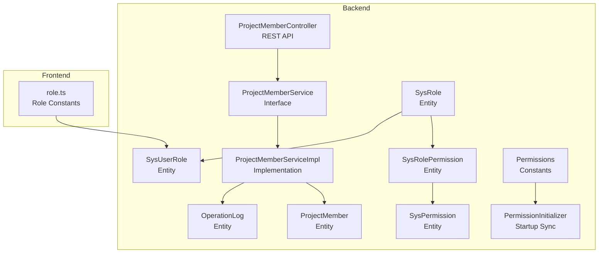
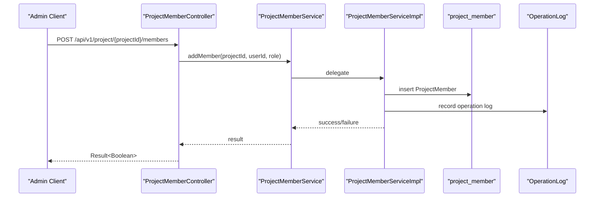
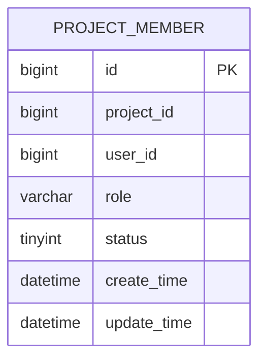
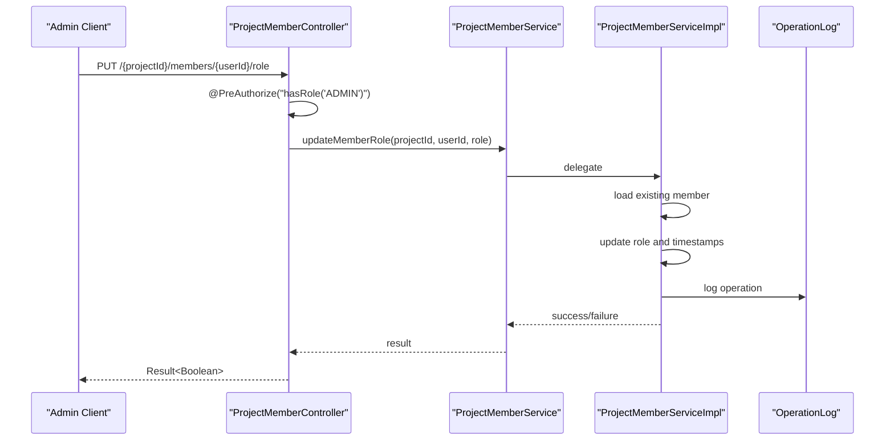
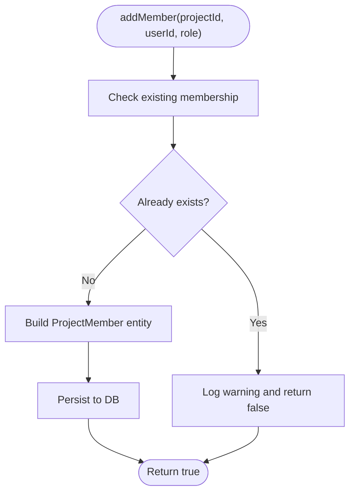
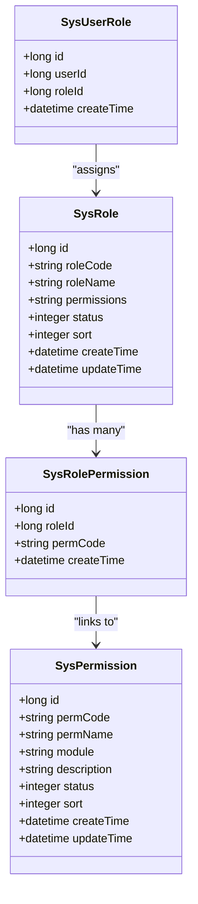
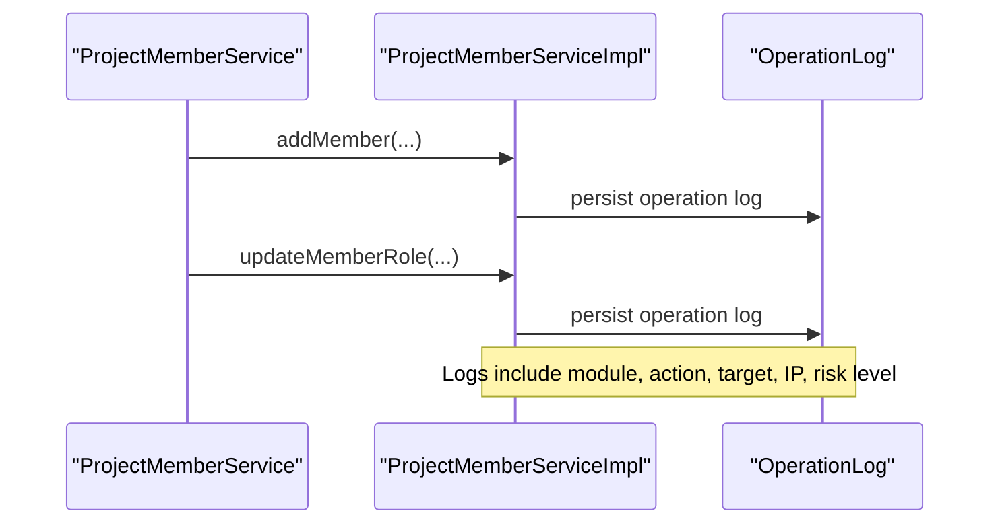
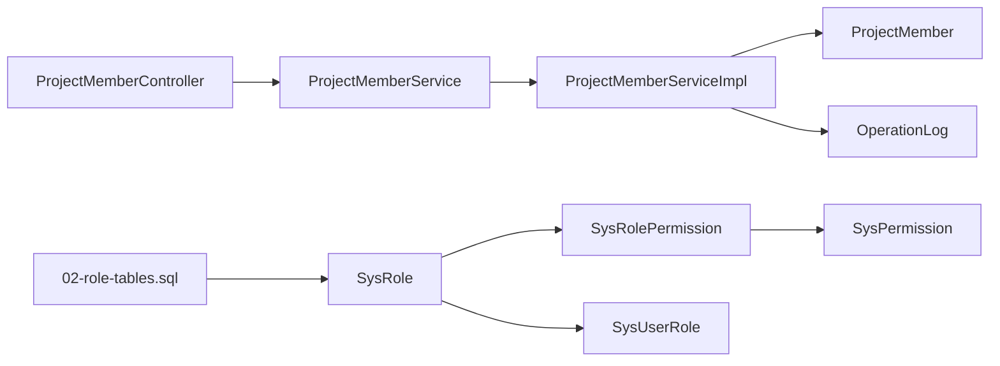

# Member Management & Roles

<cite>
**Referenced Files in This Document**
- [ProjectMember.java](file://admin-backend/src/main/java/com/qhiot/survey/entity/ProjectMember.java)
- [ProjectMemberController.java](file://admin-backend/src/main/java/com/qhiot/survey/controller/ProjectMemberController.java)
- [ProjectMemberService.java](file://admin-backend/src/main/java/com/qhiot/survey/service/ProjectMemberService.java)
- [ProjectMemberServiceImpl.java](file://admin-backend/src/main/java/com/qhiot/survey/service/impl/ProjectMemberServiceImpl.java)
- [project_member.sql](file://admin-backend/src/main/resources/db/project_member.sql)
- [SysRole.java](file://admin-backend/src/main/java/com/qhiot/survey/entity/SysRole.java)
- [SysPermission.java](file://admin-backend/src/main/java/com/qhiot/survey/entity/SysPermission.java)
- [SysRolePermission.java](file://admin-backend/src/main/java/com/qhiot/survey/entity/SysRolePermission.java)
- [SysUserRole.java](file://admin-backend/src/main/java/com/qhiot/survey/entity/SysUserRole.java)
- [Permissions.java](file://admin-backend/src/main/java/com/qhiot/survey/common/constant/Permissions.java)
- [PermissionInitializer.java](file://admin-backend/src/main/java/com/qhiot/survey/common/init/PermissionInitializer.java)
- [SysPermissionService.java](file://admin-backend/src/main/java/com/qhiot/survey/service/SysPermissionService.java)
- [02-role-tables.sql](file://admin-backend/init-data/02-role-tables.sql)
- [OperationLog.java](file://admin-backend/src/main/java/com/qhiot/survey/entity/OperationLog.java)
- [role.ts](file://admin-web-soybean/src/constants/role.ts)
</cite>

## Table of Contents
1. [Introduction](#introduction)
2. [Project Structure](#project-structure)
3. [Core Components](#core-components)
4. [Architecture Overview](#architecture-overview)
5. [Detailed Component Analysis](#detailed-component-analysis)
6. [Dependency Analysis](#dependency-analysis)
7. [Performance Considerations](#performance-considerations)
8. [Troubleshooting Guide](#troubleshooting-guide)
9. [Conclusion](#conclusion)

## Introduction
This document describes the member management and role assignment system for projects. It covers the project member entity, role hierarchies, permission inheritance, and activity tracking. It explains onboarding workflows, role assignments, and permission management, including integrations with project roles (manager, reviewer, surveyor) and their associated permissions. It also documents member activity monitoring, access control enforcement, and audit trails, with examples of invitation processes, role modifications, and access revocation. Finally, it clarifies how member roles relate to task assignment permissions.

## Project Structure
The member management system spans backend entities, services, controllers, and database initialization scripts. Frontend role constants align with backend role definitions to maintain consistency across the stack.

**Diagram sources**
- [ProjectMember.java:10-44](file://admin-backend/src/main/java/com/qhiot/survey/entity/ProjectMember.java#L10-L44)
- [ProjectMemberController.java:17-92](file://admin-backend/src/main/java/com/qhiot/survey/controller/ProjectMemberController.java#L17-L92)
- [ProjectMemberService.java:8-70](file://admin-backend/src/main/java/com/qhiot/survey/service/ProjectMemberService.java#L8-L70)
- [ProjectMemberServiceImpl.java:17-131](file://admin-backend/src/main/java/com/qhiot/survey/service/impl/ProjectMemberServiceImpl.java#L17-L131)
- [SysRole.java:10-40](file://admin-backend/src/main/java/com/qhiot/survey/entity/SysRole.java#L10-L40)
- [SysPermission.java:11-56](file://admin-backend/src/main/java/com/qhiot/survey/entity/SysPermission.java#L11-L56)
- [SysRolePermission.java:11-34](file://admin-backend/src/main/java/com/qhiot/survey/entity/SysRolePermission.java#L11-L34)
- [SysUserRole.java:10-26](file://admin-backend/src/main/java/com/qhiot/survey/entity/SysUserRole.java#L10-L26)
- [Permissions.java:3-81](file://admin-backend/src/main/java/com/qhiot/survey/common/constant/Permissions.java#L3-L81)
- [PermissionInitializer.java:11-38](file://admin-backend/src/main/java/com/qhiot/survey/common/init/PermissionInitializer.java#L11-L38)
- [OperationLog.java:10-45](file://admin-backend/src/main/java/com/qhiot/survey/entity/OperationLog.java#L10-L45)
- [role.ts:1-16](file://admin-web-soybean/src/constants/role.ts#L1-L16)

**Section sources**
- [ProjectMember.java:10-44](file://admin-backend/src/main/java/com/qhiot/survey/entity/ProjectMember.java#L10-L44)
- [ProjectMemberController.java:17-92](file://admin-backend/src/main/java/com/qhiot/survey/controller/ProjectMemberController.java#L17-L92)
- [ProjectMemberService.java:8-70](file://admin-backend/src/main/java/com/qhiot/survey/service/ProjectMemberService.java#L8-L70)
- [ProjectMemberServiceImpl.java:17-131](file://admin-backend/src/main/java/com/qhiot/survey/service/impl/ProjectMemberServiceImpl.java#L17-L131)
- [SysRole.java:10-40](file://admin-backend/src/main/java/com/qhiot/survey/entity/SysRole.java#L10-L40)
- [SysPermission.java:11-56](file://admin-backend/src/main/java/com/qhiot/survey/entity/SysPermission.java#L11-L56)
- [SysRolePermission.java:11-34](file://admin-backend/src/main/java/com/qhiot/survey/entity/SysRolePermission.java#L11-L34)
- [SysUserRole.java:10-26](file://admin-backend/src/main/java/com/qhiot/survey/entity/SysUserRole.java#L10-L26)
- [Permissions.java:3-81](file://admin-backend/src/main/java/com/qhiot/survey/common/constant/Permissions.java#L3-L81)
- [PermissionInitializer.java:11-38](file://admin-backend/src/main/java/com/qhiot/survey/common/init/PermissionInitializer.java#L11-L38)
- [OperationLog.java:10-45](file://admin-backend/src/main/java/com/qhiot/survey/entity/OperationLog.java#L10-L45)
- [role.ts:1-16](file://admin-web-soybean/src/constants/role.ts#L1-L16)

## Core Components
- ProjectMember: Represents a user’s membership in a project with role and status.
- ProjectMemberController: Exposes REST endpoints for managing project members and roles.
- ProjectMemberService and ProjectMemberServiceImpl: Implement CRUD operations for project memberships, including adding, removing, updating roles, and checking membership.
- SysRole, SysPermission, SysRolePermission, SysUserRole: Define system-wide roles, permissions, and associations.
- Permissions: Centralized constants for permission codes used across the system.
- PermissionInitializer: Synchronizes permission codes to the database after application startup.
- OperationLog: Tracks administrative actions for auditability.
- role.ts: Frontend role constants aligned with backend role codes.

**Section sources**
- [ProjectMember.java:10-44](file://admin-backend/src/main/java/com/qhiot/survey/entity/ProjectMember.java#L10-L44)
- [ProjectMemberController.java:17-92](file://admin-backend/src/main/java/com/qhiot/survey/controller/ProjectMemberController.java#L17-L92)
- [ProjectMemberService.java:8-70](file://admin-backend/src/main/java/com/qhiot/survey/service/ProjectMemberService.java#L8-L70)
- [ProjectMemberServiceImpl.java:17-131](file://admin-backend/src/main/java/com/qhiot/survey/service/impl/ProjectMemberServiceImpl.java#L17-L131)
- [SysRole.java:10-40](file://admin-backend/src/main/java/com/qhiot/survey/entity/SysRole.java#L10-L40)
- [SysPermission.java:11-56](file://admin-backend/src/main/java/com/qhiot/survey/entity/SysPermission.java#L11-L56)
- [SysRolePermission.java:11-34](file://admin-backend/src/main/java/com/qhiot/survey/entity/SysRolePermission.java#L11-L34)
- [SysUserRole.java:10-26](file://admin-backend/src/main/java/com/qhiot/survey/entity/SysUserRole.java#L10-L26)
- [Permissions.java:3-81](file://admin-backend/src/main/java/com/qhiot/survey/common/constant/Permissions.java#L3-L81)
- [PermissionInitializer.java:11-38](file://admin-backend/src/main/java/com/qhiot/survey/common/init/PermissionInitializer.java#L11-L38)
- [OperationLog.java:10-45](file://admin-backend/src/main/java/com/qhiot/survey/entity/OperationLog.java#L10-L45)
- [role.ts:1-16](file://admin-web-soybean/src/constants/role.ts#L1-L16)

## Architecture Overview
The system separates concerns across entities, services, and controllers. Access control is enforced via annotations and permission checks. Administrative actions are logged for auditability.

**Diagram sources**
- [ProjectMemberController.java:35-45](file://admin-backend/src/main/java/com/qhiot/survey/controller/ProjectMemberController.java#L35-L45)
- [ProjectMemberServiceImpl.java:25-45](file://admin-backend/src/main/java/com/qhiot/survey/service/impl/ProjectMemberServiceImpl.java#L25-L45)
- [project_member.sql:1-16](file://admin-backend/src/main/resources/db/project_member.sql#L1-L16)
- [OperationLog.java:10-45](file://admin-backend/src/main/java/com/qhiot/survey/entity/OperationLog.java#L10-L45)

## Detailed Component Analysis

### ProjectMember Entity and Database Schema
- Purpose: Associates a user with a project and stores their role and status.
- Fields: project_id, user_id, role, status, timestamps.
- Constraints: Unique constraint on (project_id, user_id); indexes on project_id, user_id, role, status.

**Diagram sources**
- [ProjectMember.java:18-44](file://admin-backend/src/main/java/com/qhiot/survey/entity/ProjectMember.java#L18-L44)
- [project_member.sql:2-16](file://admin-backend/src/main/resources/db/project_member.sql#L2-L16)

**Section sources**
- [ProjectMember.java:10-44](file://admin-backend/src/main/java/com/qhiot/survey/entity/ProjectMember.java#L10-L44)
- [project_member.sql:1-16](file://admin-backend/src/main/resources/db/project_member.sql#L1-L16)

### ProjectMemberController: Member Management APIs
- Endpoints:
  - GET /api/v1/project/{projectId}/members: List members.
  - POST /api/v1/project/{projectId}/members: Add a single member.
  - POST /api/v1/project/{projectId}/members/batch: Batch add members.
  - DELETE /api/v1/project/{projectId}/members/{userId}: Remove a member.
  - PUT /api/v1/project/{projectId}/members/{userId}/role: Update member role.
  - GET /api/v1/project/{projectId}/members/check/{userId}: Check membership and role.
- Access control: @PreAuthorize("hasRole('ADMIN')") on mutation endpoints.
- Logging: @OperationLog records administrative actions.

**Diagram sources**
- [ProjectMemberController.java:70-80](file://admin-backend/src/main/java/com/qhiot/survey/controller/ProjectMemberController.java#L70-L80)
- [ProjectMemberServiceImpl.java:97-111](file://admin-backend/src/main/java/com/qhiot/survey/service/impl/ProjectMemberServiceImpl.java#L97-L111)
- [OperationLog.java:10-45](file://admin-backend/src/main/java/com/qhiot/survey/entity/OperationLog.java#L10-L45)

**Section sources**
- [ProjectMemberController.java:17-92](file://admin-backend/src/main/java/com/qhiot/survey/controller/ProjectMemberController.java#L17-L92)

### ProjectMemberService and Implementation
- Responsibilities:
  - Add/remove members.
  - Batch add members with de-duplication.
  - Update member roles.
  - Check membership and fetch current role.
- Transactionality: Mutations are transactional to ensure consistency.
- Membership checks: Filter by status = 1 to consider only enabled members.

**Diagram sources**
- [ProjectMemberServiceImpl.java:25-45](file://admin-backend/src/main/java/com/qhiot/survey/service/impl/ProjectMemberServiceImpl.java#L25-L45)

**Section sources**
- [ProjectMemberService.java:8-70](file://admin-backend/src/main/java/com/qhiot/survey/service/ProjectMemberService.java#L8-L70)
- [ProjectMemberServiceImpl.java:17-131](file://admin-backend/src/main/java/com/qhiot/survey/service/impl/ProjectMemberServiceImpl.java#L17-L131)

### System Roles, Permissions, and Inheritance
- SysRole: Stores role definitions with permissions stored as a JSON field.
- SysPermission: Centralized permission registry with permCode, module, and status.
- SysRolePermission: Links roles to permissions.
- SysUserRole: Links users to system roles.
- Permissions constants: Declares all permission codes used across the system.
- PermissionInitializer: On application startup, synchronizes permission codes to sys_permission, inserting missing ones and disabling missing entries.

**Diagram sources**
- [SysRole.java:18-40](file://admin-backend/src/main/java/com/qhiot/survey/entity/SysRole.java#L18-L40)
- [SysPermission.java:19-56](file://admin-backend/src/main/java/com/qhiot/survey/entity/SysPermission.java#L19-L56)
- [SysRolePermission.java:19-34](file://admin-backend/src/main/java/com/qhiot/survey/entity/SysRolePermission.java#L19-L34)
- [SysUserRole.java:18-26](file://admin-backend/src/main/java/com/qhiot/survey/entity/SysUserRole.java#L18-L26)

**Section sources**
- [SysRole.java:10-40](file://admin-backend/src/main/java/com/qhiot/survey/entity/SysRole.java#L10-L40)
- [SysPermission.java:11-56](file://admin-backend/src/main/java/com/qhiot/survey/entity/SysPermission.java#L11-L56)
- [SysRolePermission.java:11-34](file://admin-backend/src/main/java/com/qhiot/survey/entity/SysRolePermission.java#L11-L34)
- [SysUserRole.java:10-26](file://admin-backend/src/main/java/com/qhiot/survey/entity/SysUserRole.java#L10-L26)
- [Permissions.java:3-81](file://admin-backend/src/main/java/com/qhiot/survey/common/constant/Permissions.java#L3-L81)
- [PermissionInitializer.java:11-38](file://admin-backend/src/main/java/com/qhiot/survey/common/init/PermissionInitializer.java#L11-L38)

### Role Definitions and Permission Sets
- Roles and their permission sets are initialized in SQL. Example roles include:
  - admin: full permissions (*)
  - project_manager: project and point operations plus exports
  - auditor: point and audit operations plus exports
  - surveyor: point and survey operations
  - collab: point and collaborative survey assistance
- These role definitions determine what actions a user can perform within the system.

**Section sources**
- [02-role-tables.sql:22-28](file://admin-backend/init-data/02-role-tables.sql#L22-L28)

### Frontend Role Constants
- Aligns with backend role codes to ensure consistent role handling across the stack.

**Section sources**
- [role.ts:1-16](file://admin-web-soybean/src/constants/role.ts#L1-L16)

### Activity Monitoring and Audit Trails
- OperationLog captures administrative actions with risk levels and metadata.
- ProjectMemberController uses @OperationLog to record member management actions.
- PermissionInitializer records synchronization events.

**Diagram sources**
- [ProjectMemberController.java:37-45](file://admin-backend/src/main/java/com/qhiot/survey/controller/ProjectMemberController.java#L37-L45)
- [ProjectMemberController.java:71-80](file://admin-backend/src/main/java/com/qhiot/survey/controller/ProjectMemberController.java#L71-L80)
- [OperationLog.java:10-45](file://admin-backend/src/main/java/com/qhiot/survey/entity/OperationLog.java#L10-L45)

**Section sources**
- [OperationLog.java:10-45](file://admin-backend/src/main/java/com/qhiot/survey/entity/OperationLog.java#L10-L45)
- [PermissionInitializer.java:22-36](file://admin-backend/src/main/java/com/qhiot/survey/common/init/PermissionInitializer.java#L22-L36)

### Access Control Enforcement
- Controllers enforce administrative access using @PreAuthorize("hasRole('ADMIN')") on mutation endpoints.
- Permission codes are declared centrally and synchronized to the database to support fine-grained authorization.

**Section sources**
- [ProjectMemberController.java:37](file://admin-backend/src/main/java/com/qhiot/survey/controller/ProjectMemberController.java#L37)
- [ProjectMemberController.java:49](file://admin-backend/src/main/java/com/qhiot/survey/controller/ProjectMemberController.java#L49)
- [ProjectMemberController.java:63](file://admin-backend/src/main/java/com/qhiot/survey/controller/ProjectMemberController.java#L63)
- [ProjectMemberController.java:72](file://admin-backend/src/main/java/com/qhiot/survey/controller/ProjectMemberController.java#L72)
- [Permissions.java:3-81](file://admin-backend/src/main/java/com/qhiot/survey/common/constant/Permissions.java#L3-L81)

### Examples

#### Member Invitation Process
- Admin invokes POST /api/v1/project/{projectId}/members with userId and role.
- Backend checks for duplicates and persists the membership if not present.
- An operation log entry is recorded.

**Section sources**
- [ProjectMemberController.java:35-45](file://admin-backend/src/main/java/com/qhiot/survey/controller/ProjectMemberController.java#L35-L45)
- [ProjectMemberServiceImpl.java:25-45](file://admin-backend/src/main/java/com/qhiot/survey/service/impl/ProjectMemberServiceImpl.java#L25-L45)

#### Role Modification
- Admin invokes PUT /api/v1/project/{projectId}/members/{userId}/role with new role.
- Backend loads the member, updates role and timestamps, and persists.
- An operation log entry is recorded.

**Section sources**
- [ProjectMemberController.java:70-80](file://admin-backend/src/main/java/com/qhiot/survey/controller/ProjectMemberController.java#L70-L80)
- [ProjectMemberServiceImpl.java:97-111](file://admin-backend/src/main/java/com/qhiot/survey/service/impl/ProjectMemberServiceImpl.java#L97-L111)

#### Access Revocation
- Admin invokes DELETE /api/v1/project/{projectId}/members/{userId}.
- Backend removes the membership record.
- An operation log entry is recorded.

**Section sources**
- [ProjectMemberController.java:61-69](file://admin-backend/src/main/java/com/qhiot/survey/controller/ProjectMemberController.java#L61-L69)
- [ProjectMemberServiceImpl.java:78-85](file://admin-backend/src/main/java/com/qhiot/survey/service/impl/ProjectMemberServiceImpl.java#L78-L85)

#### Relationship Between Member Roles and Task Assignment Permissions
- Project roles (manager, reviewer, surveyor) are defined in the system role initialization script.
- Permissions are declared in Permissions.java and synchronized to sys_permission.
- Users receive effective permissions via their system roles and role-to-permission mappings.

**Section sources**
- [02-role-tables.sql:22-28](file://admin-backend/init-data/02-role-tables.sql#L22-L28)
- [Permissions.java:3-81](file://admin-backend/src/main/java/com/qhiot/survey/common/constant/Permissions.java#L3-L81)
- [SysRole.java:18-40](file://admin-backend/src/main/java/com/qhiot/survey/entity/SysRole.java#L18-L40)
- [SysRolePermission.java:19-34](file://admin-backend/src/main/java/com/qhiot/survey/entity/SysRolePermission.java#L19-L34)

## Dependency Analysis
- Controllers depend on services for business logic.
- Services depend on repositories (not shown here) and entities.
- Entities define relationships among roles, permissions, and memberships.
- Frontend role constants mirror backend role codes.

**Diagram sources**
- [ProjectMemberController.java:17-92](file://admin-backend/src/main/java/com/qhiot/survey/controller/ProjectMemberController.java#L17-L92)
- [ProjectMemberServiceImpl.java:17-131](file://admin-backend/src/main/java/com/qhiot/survey/service/impl/ProjectMemberServiceImpl.java#L17-L131)
- [ProjectMember.java:10-44](file://admin-backend/src/main/java/com/qhiot/survey/entity/ProjectMember.java#L10-L44)
- [OperationLog.java:10-45](file://admin-backend/src/main/java/com/qhiot/survey/entity/OperationLog.java#L10-L45)
- [02-role-tables.sql:22-28](file://admin-backend/init-data/02-role-tables.sql#L22-L28)
- [SysRole.java:10-40](file://admin-backend/src/main/java/com/qhiot/survey/entity/SysRole.java#L10-L40)
- [SysRolePermission.java:11-34](file://admin-backend/src/main/java/com/qhiot/survey/entity/SysRolePermission.java#L11-L34)
- [SysPermission.java:11-56](file://admin-backend/src/main/java/com/qhiot/survey/entity/SysPermission.java#L11-L56)
- [SysUserRole.java:10-26](file://admin-backend/src/main/java/com/qhiot/survey/entity/SysUserRole.java#L10-L26)

**Section sources**
- [ProjectMemberController.java:17-92](file://admin-backend/src/main/java/com/qhiot/survey/controller/ProjectMemberController.java#L17-L92)
- [ProjectMemberServiceImpl.java:17-131](file://admin-backend/src/main/java/com/qhiot/survey/service/impl/ProjectMemberServiceImpl.java#L17-L131)
- [02-role-tables.sql:22-28](file://admin-backend/init-data/02-role-tables.sql#L22-L28)

## Performance Considerations
- Indexing: The project_member table includes indexes on project_id, user_id, role, and status to optimize lookups and filtering.
- Batch operations: Batch add members reduces round-trips by bulk-inserting eligible records.
- Status filtering: Queries filter by status = 1 to avoid disabled memberships in membership checks and listings.

**Section sources**
- [project_member.sql:11-15](file://admin-backend/src/main/resources/db/project_member.sql#L11-L15)
- [ProjectMemberServiceImpl.java:47-76](file://admin-backend/src/main/java/com/qhiot/survey/service/impl/ProjectMemberServiceImpl.java#L47-L76)
- [ProjectMemberServiceImpl.java:87-95](file://admin-backend/src/main/java/com/qhiot/survey/service/impl/ProjectMemberServiceImpl.java#L87-L95)

## Troubleshooting Guide
- Duplicate membership: Adding an existing member returns false; verify membership using the check endpoint.
- Nonexistent member during role update: Updating a role for a non-member returns false; confirm membership first.
- Access denied: Mutation endpoints require ADMIN role; ensure the caller has appropriate system role assignment.
- Permission discrepancies: Verify permissions are synchronized via PermissionInitializer and that sys_permission reflects current Permission constants.

**Section sources**
- [ProjectMemberServiceImpl.java:25-45](file://admin-backend/src/main/java/com/qhiot/survey/service/impl/ProjectMemberServiceImpl.java#L25-L45)
- [ProjectMemberServiceImpl.java:97-111](file://admin-backend/src/main/java/com/qhiot/survey/service/impl/ProjectMemberServiceImpl.java#L97-L111)
- [ProjectMemberController.java:37](file://admin-backend/src/main/java/com/qhiot/survey/controller/ProjectMemberController.java#L37)
- [PermissionInitializer.java:22-36](file://admin-backend/src/main/java/com/qhiot/survey/common/init/PermissionInitializer.java#L22-L36)

## Conclusion
The member management and role assignment system provides a robust foundation for project collaboration. It supports onboarding, role management, and access control enforcement while maintaining auditability through operation logging. Role hierarchies and permission sets are defined centrally and synchronized to the database, ensuring consistent authorization across the platform. The design enables clear workflows for invitations, role changes, and access revocation, with performance-conscious indexing and batch operations.