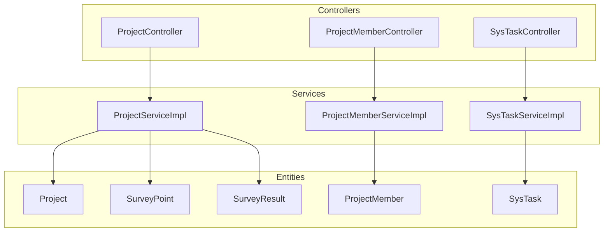
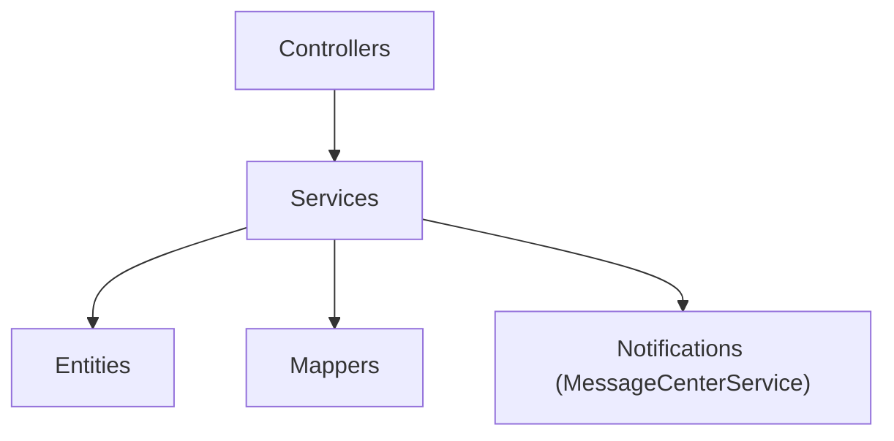
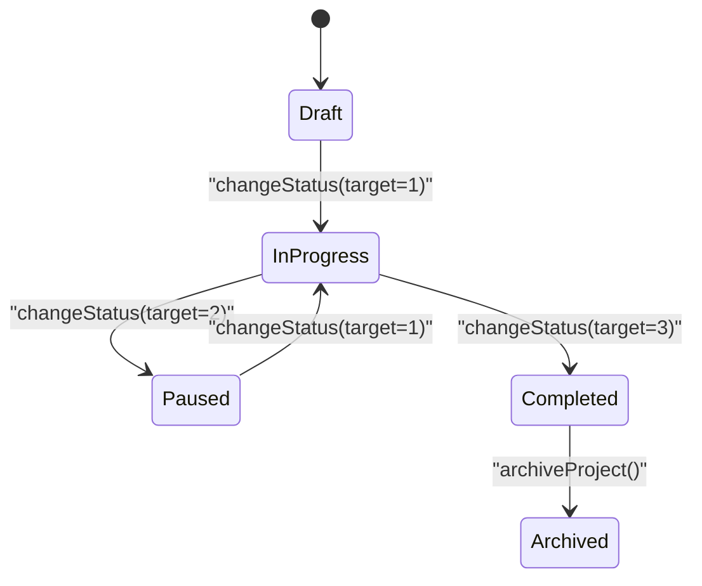
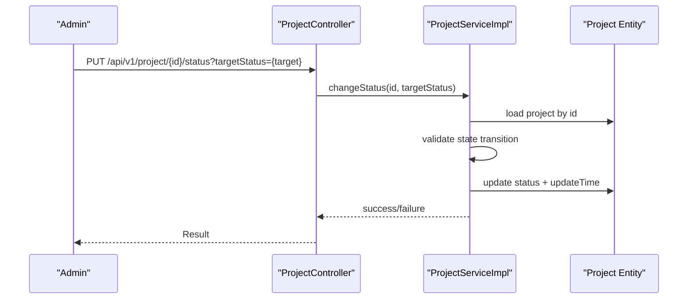
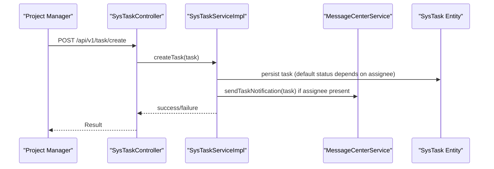
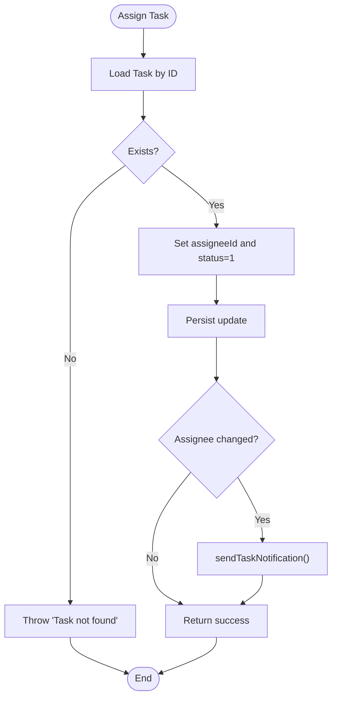
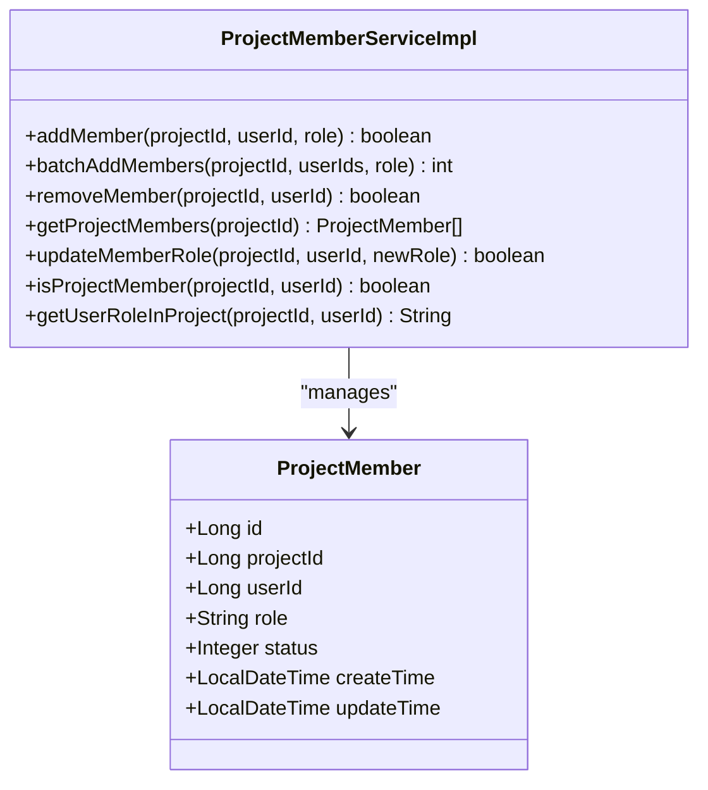
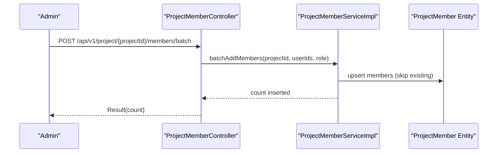
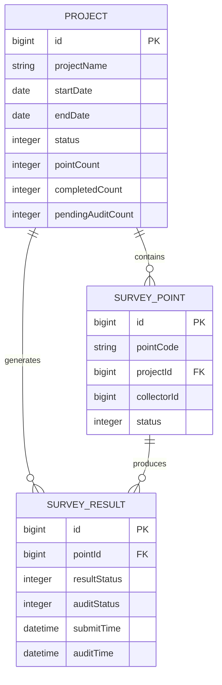
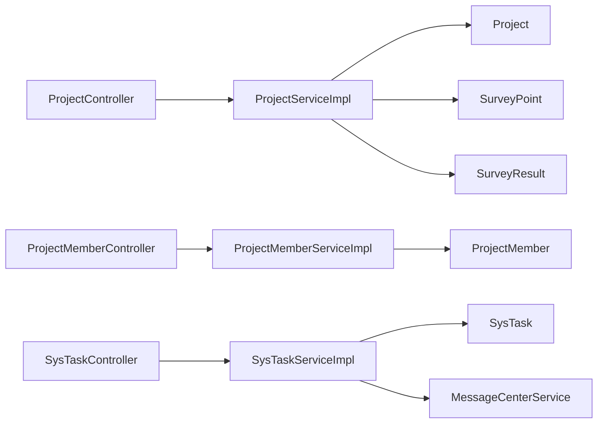

# Project & Task Management

<cite>
**Referenced Files in This Document**
- [Project.java](file://admin-backend/src/main/java/com/qhiot/survey/entity/Project.java)
- [ProjectMember.java](file://admin-backend/src/main/java/com/qhiot/survey/entity/ProjectMember.java)
- [SysTask.java](file://admin-backend/src/main/java/com/qhiot/survey/entity/SysTask.java)
- [SurveyPoint.java](file://admin-backend/src/main/java/com/qhiot/survey/entity/SurveyPoint.java)
- [SurveyResult.java](file://admin-backend/src/main/java/com/qhiot/survey/entity/SurveyResult.java)
- [ProjectController.java](file://admin-backend/src/main/java/com/qhiot/survey/controller/ProjectController.java)
- [ProjectMemberController.java](file://admin-backend/src/main/java/com/qhiot/survey/controller/ProjectMemberController.java)
- [SysTaskController.java](file://admin-backend/src/main/java/com/qhiot/survey/controller/SysTaskController.java)
- [ProjectServiceImpl.java](file://admin-backend/src/main/java/com/qhiot/survey/service/impl/ProjectServiceImpl.java)
- [ProjectMemberServiceImpl.java](file://admin-backend/src/main/java/com/qhiot/survey/service/impl/ProjectMemberServiceImpl.java)
- [SysTaskServiceImpl.java](file://admin-backend/src/main/java/com/qhiot/survey/service/impl/SysTaskServiceImpl.java)
- [ProjectCreateRequest.java](file://admin-backend/src/main/java/com/qhiot/survey/dto/ProjectCreateRequest.java)
- [SysRole.java](file://admin-backend/src/main/java/com/qhiot/survey/entity/SysRole.java)
- [SysUser.java](file://admin-backend/src/main/java/com/qhiot/survey/entity/SysUser.java)
- [SysRoleServiceImpl.java](file://admin-backend/src/main/java/com/qhiot/survey/service/impl/SysRoleServiceImpl.java)
</cite>

## Table of Contents
1. [Introduction](#introduction)
2. [Project Structure](#project-structure)
3. [Core Components](#core-components)
4. [Architecture Overview](#architecture-overview)
5. [Detailed Component Analysis](#detailed-component-analysis)
6. [Dependency Analysis](#dependency-analysis)
7. [Performance Considerations](#performance-considerations)
8. [Troubleshooting Guide](#troubleshooting-guide)
9. [Conclusion](#conclusion)
10. [Appendices](#appendices)

## Introduction
This document explains the project lifecycle and task management systems implemented in the backend module. It covers:
- Project entity structure, timeline management, status tracking, and member coordination
- Task assignment system with workflow automation and status propagation
- Member management functionality including role assignments, permission inheritance, and activity tracking
- Project phases from planning through completion, including milestone tracking and progress reporting
- Examples of project creation, member onboarding, task distribution, and progress monitoring
- Integration with survey point allocation and resource management workflows

## Project Structure
The project lifecycle and task management are centered around four core entities:
- Project: encapsulates project metadata, timeline, counts, and status
- ProjectMember: links users to projects with roles and status
- SysTask: represents field survey tasks with assignees, deadlines, and statuses
- SurveyPoint and SurveyResult: represent point allocation and result auditing

Controllers expose REST endpoints for CRUD, status transitions, and member/task operations. Services implement business logic, enforce state machines, and coordinate notifications.

**Diagram sources**
- [ProjectController.java:28-144](file://admin-backend/src/main/java/com/qhiot/survey/controller/ProjectController.java#L28-L144)
- [ProjectMemberController.java:24-91](file://admin-backend/src/main/java/com/qhiot/survey/controller/ProjectMemberController.java#L24-L91)
- [SysTaskController.java:24-97](file://admin-backend/src/main/java/com/qhiot/survey/controller/SysTaskController.java#L24-L97)
- [ProjectServiceImpl.java:26-263](file://admin-backend/src/main/java/com/qhiot/survey/service/impl/ProjectServiceImpl.java#L26-L263)
- [ProjectMemberServiceImpl.java:23-130](file://admin-backend/src/main/java/com/qhiot/survey/service/impl/ProjectMemberServiceImpl.java#L23-L130)
- [SysTaskServiceImpl.java:24-149](file://admin-backend/src/main/java/com/qhiot/survey/service/impl/SysTaskServiceImpl.java#L24-L149)
- [Project.java:18-84](file://admin-backend/src/main/java/com/qhiot/survey/entity/Project.java#L18-L84)
- [ProjectMember.java:15-44](file://admin-backend/src/main/java/com/qhiot/survey/entity/ProjectMember.java#L15-L44)
- [SysTask.java:16-65](file://admin-backend/src/main/java/com/qhiot/survey/entity/SysTask.java#L16-L65)
- [SurveyPoint.java:19-84](file://admin-backend/src/main/java/com/qhiot/survey/entity/SurveyPoint.java#L19-L84)
- [SurveyResult.java:16-93](file://admin-backend/src/main/java/com/qhiot/survey/entity/SurveyResult.java#L16-L93)

**Section sources**
- [ProjectController.java:28-144](file://admin-backend/src/main/java/com/qhiot/survey/controller/ProjectController.java#L28-L144)
- [ProjectMemberController.java:24-91](file://admin-backend/src/main/java/com/qhiot/survey/controller/ProjectMemberController.java#L24-L91)
- [SysTaskController.java:24-97](file://admin-backend/src/main/java/com/qhiot/survey/controller/SysTaskController.java#L24-L97)
- [ProjectServiceImpl.java:26-263](file://admin-backend/src/main/java/com/qhiot/survey/service/impl/ProjectServiceImpl.java#L26-L263)
- [ProjectMemberServiceImpl.java:23-130](file://admin-backend/src/main/java/com/qhiot/survey/service/impl/ProjectMemberServiceImpl.java#L23-L130)
- [SysTaskServiceImpl.java:24-149](file://admin-backend/src/main/java/com/qhiot/survey/service/impl/SysTaskServiceImpl.java#L24-L149)

## Core Components
- Project entity: stores project metadata, timeline (start/end), status, and aggregated counts (templateCount, pointCount, completedCount, pendingAuditCount). It supports status transitions via a controlled state machine.
- ProjectMember entity: binds users to projects with roles (admin, collector, auditor, viewer) and status (enabled/disabled).
- SysTask entity: defines survey tasks with priority, deadline, assignee, and status. It integrates with notification sending upon creation or reassignment.
- SurveyPoint and SurveyResult: support point allocation and result auditing, enabling milestone tracking and progress reporting.

Key responsibilities:
- Controllers: expose REST endpoints for project lifecycle, member management, and task operations with role-based authorization.
- Services: implement business rules, state validation, statistics computation, and cross-entity updates.

**Section sources**
- [Project.java:18-84](file://admin-backend/src/main/java/com/qhiot/survey/entity/Project.java#L18-L84)
- [ProjectMember.java:15-44](file://admin-backend/src/main/java/com/qhiot/survey/entity/ProjectMember.java#L15-L44)
- [SysTask.java:16-65](file://admin-backend/src/main/java/com/qhiot/survey/entity/SysTask.java#L16-L65)
- [SurveyPoint.java:19-84](file://admin-backend/src/main/java/com/qhiot/survey/entity/SurveyPoint.java#L19-L84)
- [SurveyResult.java:16-93](file://admin-backend/src/main/java/com/qhiot/survey/entity/SurveyResult.java#L16-L93)

## Architecture Overview
The system follows a layered architecture:
- Presentation: Spring MVC controllers handle HTTP requests and responses
- Application: Services orchestrate domain operations and enforce business rules
- Persistence: MyBatis-Plus mappers and entities map to relational tables

**Diagram sources**
- [ProjectController.java:28-144](file://admin-backend/src/main/java/com/qhiot/survey/controller/ProjectController.java#L28-L144)
- [ProjectMemberController.java:24-91](file://admin-backend/src/main/java/com/qhiot/survey/controller/ProjectMemberController.java#L24-L91)
- [SysTaskController.java:24-97](file://admin-backend/src/main/java/com/qhiot/survey/controller/SysTaskController.java#L24-L97)
- [ProjectServiceImpl.java:26-263](file://admin-backend/src/main/java/com/qhiot/survey/service/impl/ProjectServiceImpl.java#L26-L263)
- [ProjectMemberServiceImpl.java:23-130](file://admin-backend/src/main/java/com/qhiot/survey/service/impl/ProjectMemberServiceImpl.java#L23-L130)
- [SysTaskServiceImpl.java:24-149](file://admin-backend/src/main/java/com/qhiot/survey/service/impl/SysTaskServiceImpl.java#L24-L149)

## Detailed Component Analysis

### Project Lifecycle Management
Projects support a five-state lifecycle: Draft → In Progress → Paused → Completed → Archived. Transitions are validated to prevent invalid state changes.

**Diagram sources**
- [ProjectServiceImpl.java:189-197](file://admin-backend/src/main/java/com/qhiot/survey/service/impl/ProjectServiceImpl.java#L189-L197)

**Diagram sources**
- [ProjectController.java:112-118](file://admin-backend/src/main/java/com/qhiot/survey/controller/ProjectController.java#L112-L118)
- [ProjectServiceImpl.java:161-178](file://admin-backend/src/main/java/com/qhiot/survey/service/impl/ProjectServiceImpl.java#L161-L178)

Operational highlights:
- Creation initializes status to Draft and zeroed counters
- Deletion disallows archived or in-progress projects
- Archive/restore enforce strict preconditions
- Statistics compute completion rate from point counts

**Section sources**
- [ProjectServiceImpl.java:79-98](file://admin-backend/src/main/java/com/qhiot/survey/service/impl/ProjectServiceImpl.java#L79-L98)
- [ProjectServiceImpl.java:128-145](file://admin-backend/src/main/java/com/qhiot/survey/service/impl/ProjectServiceImpl.java#L128-L145)
- [ProjectServiceImpl.java:226-243](file://admin-backend/src/main/java/com/qhiot/survey/service/impl/ProjectServiceImpl.java#L226-L243)
- [ProjectServiceImpl.java:246-262](file://admin-backend/src/main/java/com/qhiot/survey/service/impl/ProjectServiceImpl.java#L246-L262)
- [ProjectServiceImpl.java:200-224](file://admin-backend/src/main/java/com/qhiot/survey/service/impl/ProjectServiceImpl.java#L200-L224)
- [ProjectController.java:108-134](file://admin-backend/src/main/java/com/qhiot/survey/controller/ProjectController.java#L108-L134)

### Task Assignment System
Tasks are created with optional assignees and statuses. Assignments trigger automated notifications. Status changes propagate across the system.

**Diagram sources**
- [SysTaskController.java:48-55](file://admin-backend/src/main/java/com/qhiot/survey/controller/SysTaskController.java#L48-L55)
- [SysTaskServiceImpl.java:62-77](file://admin-backend/src/main/java/com/qhiot/survey/service/impl/SysTaskServiceImpl.java#L62-L77)
- [SysTaskServiceImpl.java:138-148](file://admin-backend/src/main/java/com/qhiot/survey/service/impl/SysTaskServiceImpl.java#L138-L148)

**Diagram sources**
- [SysTaskServiceImpl.java:111-126](file://admin-backend/src/main/java/com/qhiot/survey/service/impl/SysTaskServiceImpl.java#L111-L126)
- [SysTaskServiceImpl.java:138-148](file://admin-backend/src/main/java/com/qhiot/survey/service/impl/SysTaskServiceImpl.java#L138-L148)

Key capabilities:
- Create/update tasks with automatic status inference
- Assign tasks to collectors and notify via message center
- Change task status across states (Pending, In Progress, Completed, Overdue, Terminated)
- Delete tasks with authorization checks

**Section sources**
- [SysTaskController.java:48-96](file://admin-backend/src/main/java/com/qhiot/survey/controller/SysTaskController.java#L48-L96)
- [SysTaskServiceImpl.java:29-50](file://admin-backend/src/main/java/com/qhiot/survey/service/impl/SysTaskServiceImpl.java#L29-L50)
- [SysTaskServiceImpl.java:79-95](file://admin-backend/src/main/java/com/qhiot/survey/service/impl/SysTaskServiceImpl.java#L79-L95)
- [SysTaskServiceImpl.java:98-136](file://admin-backend/src/main/java/com/qhiot/survey/service/impl/SysTaskServiceImpl.java#L98-L136)

### Member Management and Role Assignments
Members are associated with projects via ProjectMember records. Roles include admin, collector, auditor, and viewer. Users can be added individually or in batches, roles updated, and membership checked.

**Diagram sources**
- [ProjectMember.java:15-44](file://admin-backend/src/main/java/com/qhiot/survey/entity/ProjectMember.java#L15-L44)
- [ProjectMemberServiceImpl.java:23-130](file://admin-backend/src/main/java/com/qhiot/survey/service/impl/ProjectMemberServiceImpl.java#L23-L130)

**Diagram sources**
- [ProjectMemberController.java:47-59](file://admin-backend/src/main/java/com/qhiot/survey/controller/ProjectMemberController.java#L47-L59)
- [ProjectMemberServiceImpl.java:48-76](file://admin-backend/src/main/java/com/qhiot/survey/service/impl/ProjectMemberServiceImpl.java#L48-L76)

Permission inheritance and activity tracking:
- Roles are enforced via method-level PreAuthorize annotations on controllers
- Activity logging is integrated via operation log aspects
- User roles and permissions are managed via SysRole and SysUserRole entities, with permission lists stored per role

**Section sources**
- [ProjectMemberController.java:35-80](file://admin-backend/src/main/java/com/qhiot/survey/controller/ProjectMemberController.java#L35-L80)
- [ProjectMemberServiceImpl.java:25-95](file://admin-backend/src/main/java/com/qhiot/survey/service/impl/ProjectMemberServiceImpl.java#L25-L95)
- [SysRole.java:15-40](file://admin-backend/src/main/java/com/qhiot/survey/entity/SysRole.java#L15-L40)
- [SysUser.java:21-95](file://admin-backend/src/main/java/com/qhiot/survey/entity/SysUser.java#L21-L95)
- [SysRoleServiceImpl.java:114-165](file://admin-backend/src/main/java/com/qhiot/survey/service/impl/SysRoleServiceImpl.java#L114-L165)

### Survey Point Allocation and Resource Management
Survey points are allocated to projects and assigned to collectors. Results capture form data, images, and audit status. Projects maintain aggregated counts and completion metrics.

**Diagram sources**
- [Project.java:18-84](file://admin-backend/src/main/java/com/qhiot/survey/entity/Project.java#L18-L84)
- [SurveyPoint.java:19-84](file://admin-backend/src/main/java/com/qhiot/survey/entity/SurveyPoint.java#L19-L84)
- [SurveyResult.java:16-93](file://admin-backend/src/main/java/com/qhiot/survey/entity/SurveyResult.java#L16-L93)

Progress reporting:
- Projects compute completion rate from completedCount and pointCount
- Pending audit counts track items awaiting review
- Tasks can be filtered by project and assignee for resource utilization insights

**Section sources**
- [ProjectServiceImpl.java:200-224](file://admin-backend/src/main/java/com/qhiot/survey/service/impl/ProjectServiceImpl.java#L200-L224)
- [SysTaskController.java:28-39](file://admin-backend/src/main/java/com/qhiot/survey/controller/SysTaskController.java#L28-L39)

## Dependency Analysis
- Controllers depend on services for business operations
- Services depend on entities and mappers for persistence
- Task service integrates with a message center for notifications
- Role management coordinates user-role and role-permission mappings

**Diagram sources**
- [ProjectController.java:30-31](file://admin-backend/src/main/java/com/qhiot/survey/controller/ProjectController.java#L30-L31)
- [ProjectMemberController.java:26-27](file://admin-backend/src/main/java/com/qhiot/survey/controller/ProjectMemberController.java#L26-L27)
- [SysTaskController.java:26-27](file://admin-backend/src/main/java/com/qhiot/survey/controller/SysTaskController.java#L26-L27)
- [ProjectServiceImpl.java:11-13](file://admin-backend/src/main/java/com/qhiot/survey/service/impl/ProjectServiceImpl.java#L11-L13)
- [ProjectMemberServiceImpl.java:5-7](file://admin-backend/src/main/java/com/qhiot/survey/service/impl/ProjectMemberServiceImpl.java#L5-L7)
- [SysTaskServiceImpl.java:9-13](file://admin-backend/src/main/java/com/qhiot/survey/service/impl/SysTaskServiceImpl.java#L9-L13)

**Section sources**
- [ProjectServiceImpl.java:11-13](file://admin-backend/src/main/java/com/qhiot/survey/service/impl/ProjectServiceImpl.java#L11-L13)
- [ProjectMemberServiceImpl.java:5-7](file://admin-backend/src/main/java/com/qhiot/survey/service/impl/ProjectMemberServiceImpl.java#L5-L7)
- [SysTaskServiceImpl.java:9-13](file://admin-backend/src/main/java/com/qhiot/survey/service/impl/SysTaskServiceImpl.java#L9-L13)

## Performance Considerations
- Pagination is used for listing projects and tasks to limit payload sizes
- Query wrappers filter by indexed attributes (project ID, assignee ID, status) to improve lookup performance
- Batch operations (e.g., batchAddMembers) reduce round-trips for bulk member onboarding
- Logging and operation audit are integrated; ensure appropriate log levels in production to avoid overhead

## Troubleshooting Guide
Common issues and resolutions:
- Project not found: Operations throw exceptions when entities are missing; verify IDs and existence before invoking services
- Invalid state transition: Project status changes are validated; ensure transitions follow the allowed state machine
- Task not found: Creating/updating/deleting tasks requires existing records; confirm IDs and status values
- Member already exists: Adding members checks for duplicates; skip if already enrolled
- Authorization failures: Controllers enforce role-based access; ensure proper roles (ADMIN, PROJECT_MANAGER, SURVEYOR) are assigned

**Section sources**
- [ProjectServiceImpl.java:104-111](file://admin-backend/src/main/java/com/qhiot/survey/service/impl/ProjectServiceImpl.java#L104-L111)
- [ProjectServiceImpl.java:163-172](file://admin-backend/src/main/java/com/qhiot/survey/service/impl/ProjectServiceImpl.java#L163-L172)
- [SysTaskServiceImpl.java:83-85](file://admin-backend/src/main/java/com/qhiot/survey/service/impl/SysTaskServiceImpl.java#L83-L85)
- [ProjectMemberServiceImpl.java:32-35](file://admin-backend/src/main/java/com/qhiot/survey/service/impl/ProjectMemberServiceImpl.java#L32-L35)

## Conclusion
The system provides a robust foundation for managing projects, members, and field survey tasks. It enforces lifecycle states, automates notifications, and integrates point/result workflows to enable accurate progress tracking. Role-based controls and permission inheritance ensure secure and auditable operations across the platform.

## Appendices

### Example Workflows

- Project creation
  - Endpoint: POST /api/v1/project
  - Request body: ProjectCreateRequest (projectName, projectCode, manager, region, clientName, description, startDate, endDate)
  - Behavior: Creates a new project with status Draft and zeroed counters

- Member onboarding
  - Endpoint: POST /api/v1/project/{projectId}/members/batch
  - Request body: { userIds: [ids...], role: "collector|auditor|viewer|admin" }
  - Behavior: Adds users to the project with the specified role; skips existing memberships

- Task distribution
  - Endpoint: POST /api/v1/task/create
  - Request body: SysTask (taskName, projectId, plotCode, description, priority, deadline, assigneeId)
  - Behavior: Persists task; if assigneeId is present, sends a notification

- Progress monitoring
  - Endpoint: GET /api/v1/project/{id}/statistics
  - Behavior: Returns project metrics including completion rate derived from point counts

**Section sources**
- [ProjectController.java:52-68](file://admin-backend/src/main/java/com/qhiot/survey/controller/ProjectController.java#L52-L68)
- [ProjectCreateRequest.java:11-20](file://admin-backend/src/main/java/com/qhiot/survey/dto/ProjectCreateRequest.java#L11-L20)
- [ProjectMemberController.java:47-59](file://admin-backend/src/main/java/com/qhiot/survey/controller/ProjectMemberController.java#L47-L59)
- [SysTaskController.java:48-55](file://admin-backend/src/main/java/com/qhiot/survey/controller/SysTaskController.java#L48-L55)
- [ProjectController.java:120-125](file://admin-backend/src/main/java/com/qhiot/survey/controller/ProjectController.java#L120-L125)