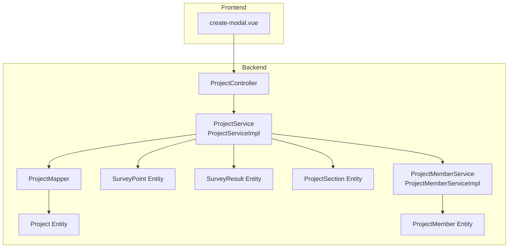
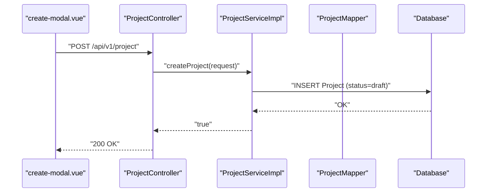
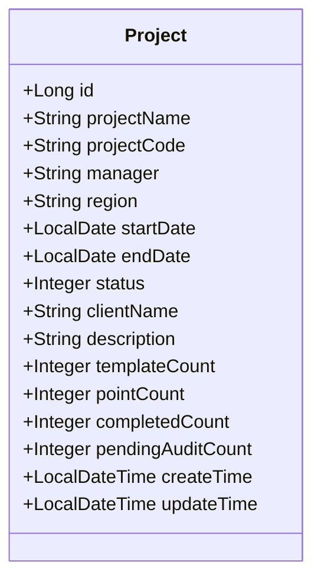
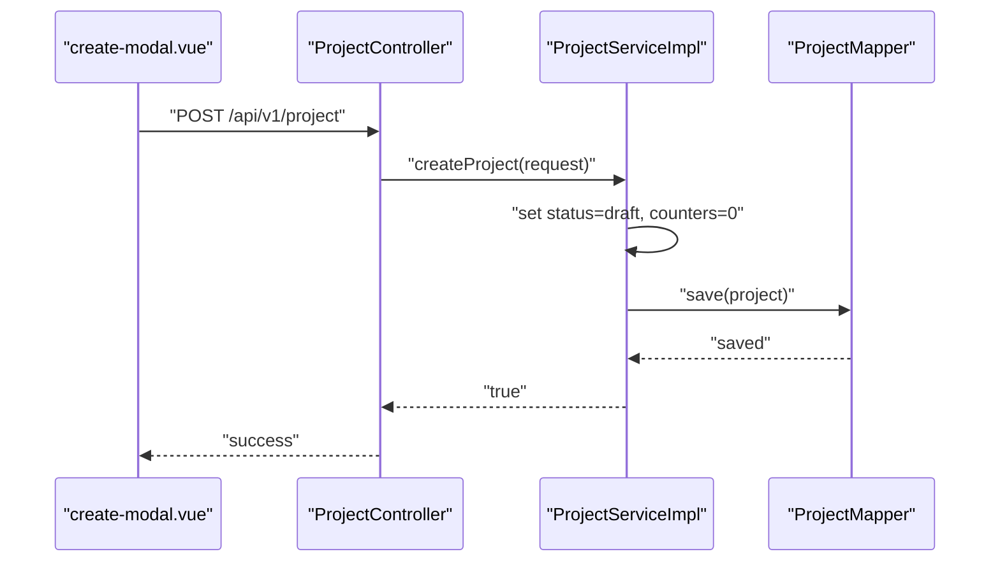
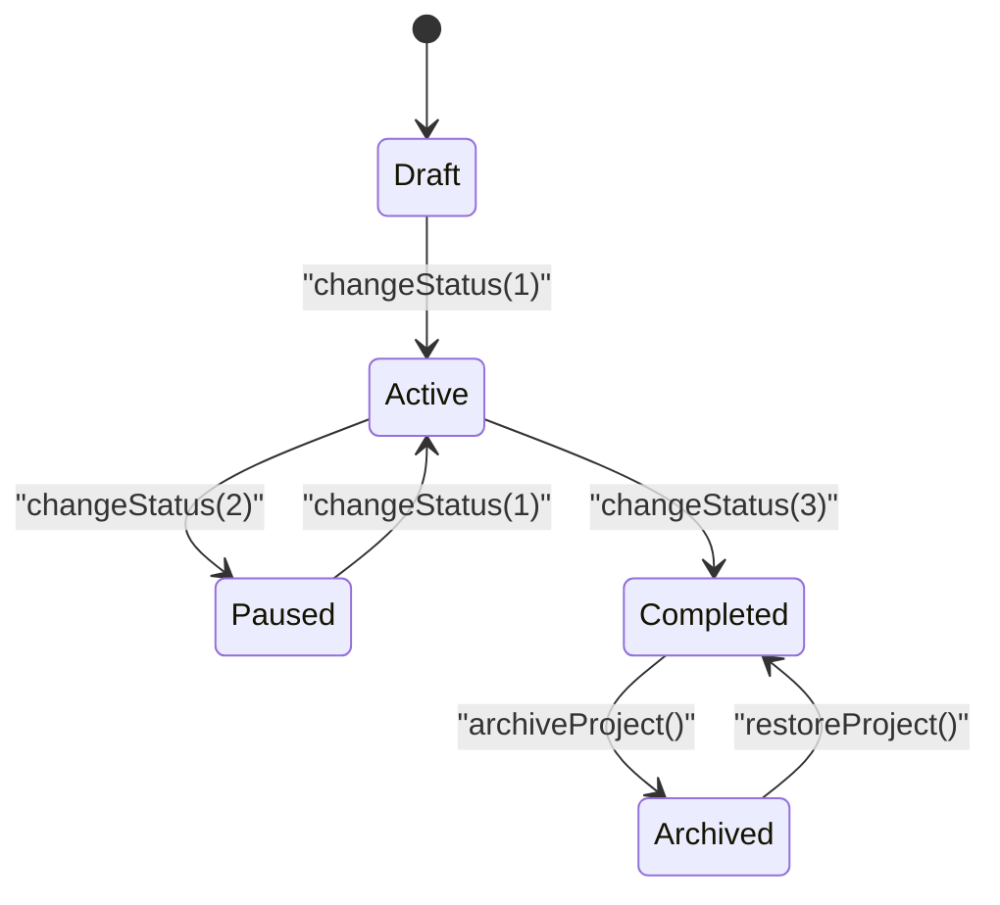
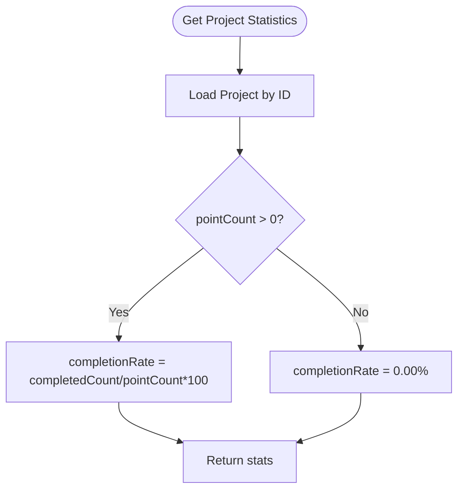
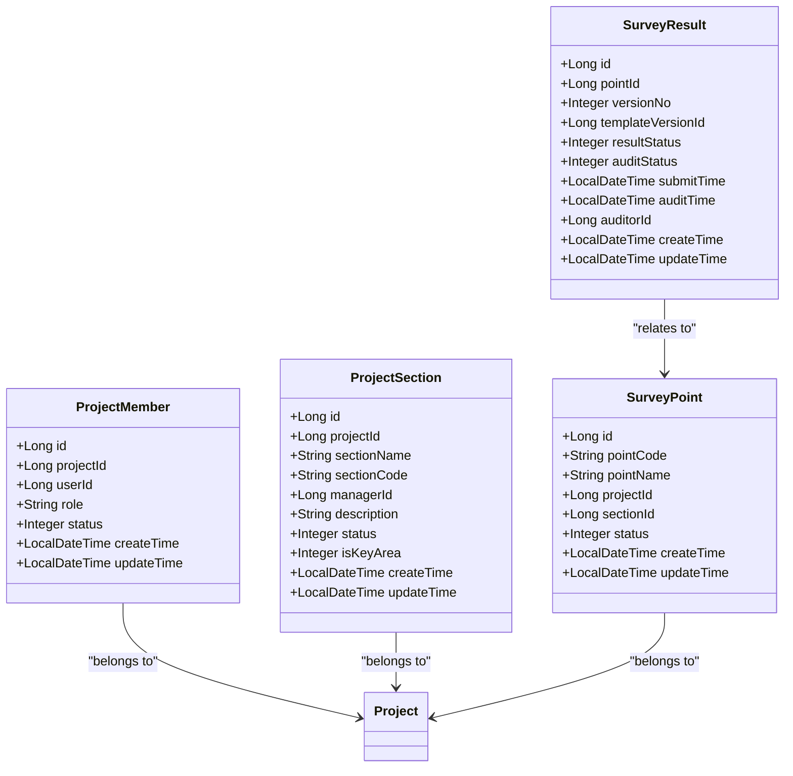
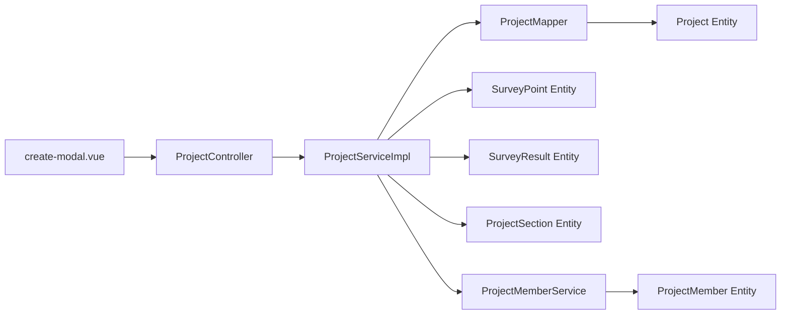

# Project Lifecycle Management

<cite>
**Referenced Files in This Document**
- [Project.java](file://admin-backend/src/main/java/com/qhiot/survey/entity/Project.java)
- [ProjectCreateRequest.java](file://admin-backend/src/main/java/com/qhiot/survey/dto/ProjectCreateRequest.java)
- [ProjectService.java](file://admin-backend/src/main/java/com/qhiot/survey/service/ProjectService.java)
- [ProjectServiceImpl.java](file://admin-backend/src/main/java/com/qhiot/survey/service/impl/ProjectServiceImpl.java)
- [ProjectController.java](file://admin-backend/src/main/java/com/qhiot/survey/controller/ProjectController.java)
- [SurveyPoint.java](file://admin-backend/src/main/java/com/qhiot/survey/entity/SurveyPoint.java)
- [SurveyResult.java](file://admin-backend/src/main/java/com/qhiot/survey/entity/SurveyResult.java)
- [ProjectMember.java](file://admin-backend/src/main/java/com/qhiot/survey/entity/ProjectMember.java)
- [ProjectMemberService.java](file://admin-backend/src/main/java/com/qhiot/survey/service/ProjectMemberService.java)
- [ProjectMemberServiceImpl.java](file://admin-backend/src/main/java/com/qhiot/survey/service/impl/ProjectMemberServiceImpl.java)
- [ProjectSection.java](file://admin-backend/src/main/java/com/qhiot/survey/entity/ProjectSection.java)
- [ProjectMapper.java](file://admin-backend/src/main/java/com/qhiot/survey/mapper/ProjectMapper.java)
- [create-modal.vue](file://admin-web-soybean/src/views/project/modules/create-modal.vue)
</cite>

## Table of Contents
1. [Introduction](#introduction)
2. [Project Structure](#project-structure)
3. [Core Components](#core-components)
4. [Architecture Overview](#architecture-overview)
5. [Detailed Component Analysis](#detailed-component-analysis)
6. [Dependency Analysis](#dependency-analysis)
7. [Performance Considerations](#performance-considerations)
8. [Troubleshooting Guide](#troubleshooting-guide)
9. [Conclusion](#conclusion)
10. [Appendices](#appendices)

## Introduction
This document describes the project lifecycle management functionality of the Survey Application. It covers the complete lifecycle from project creation to completion and archival, including project phases (draft, active, paused, completed, archived), timeline management, status tracking, progress metrics, creation workflows, milestone tracking, status transitions, approval processes, and automated state changes. It also explains integrations with survey point allocation and resource management during different project phases.

## Project Structure
The project lifecycle spans backend domain entities and services, a REST controller for API exposure, and a frontend modal for project creation/editing. The backend uses Spring Boot with MyBatis-Plus for persistence, and the frontend uses Vue 3 with Ant Design Vue for forms and modals.

**Diagram sources**
- [ProjectController.java:23-144](file://admin-backend/src/main/java/com/qhiot/survey/controller/ProjectController.java#L23-L144)
- [ProjectService.java:12-65](file://admin-backend/src/main/java/com/qhiot/survey/service/ProjectService.java#L12-L65)
- [ProjectServiceImpl.java:26-263](file://admin-backend/src/main/java/com/qhiot/survey/service/impl/ProjectServiceImpl.java#L26-L263)
- [ProjectMapper.java:7-9](file://admin-backend/src/main/java/com/qhiot/survey/mapper/ProjectMapper.java#L7-L9)
- [Project.java:18-84](file://admin-backend/src/main/java/com/qhiot/survey/entity/Project.java#L18-L84)
- [SurveyPoint.java:19-84](file://admin-backend/src/main/java/com/qhiot/survey/entity/SurveyPoint.java#L19-L84)
- [SurveyResult.java:16-93](file://admin-backend/src/main/java/com/qhiot/survey/entity/SurveyResult.java#L16-L93)
- [ProjectSection.java:15-39](file://admin-backend/src/main/java/com/qhiot/survey/entity/ProjectSection.java#L15-L39)
- [ProjectMemberService.java:11-70](file://admin-backend/src/main/java/com/qhiot/survey/service/ProjectMemberService.java#L11-L70)
- [ProjectMemberServiceImpl.java:23-131](file://admin-backend/src/main/java/com/qhiot/survey/service/impl/ProjectMemberServiceImpl.java#L23-L131)
- [ProjectMember.java:15-44](file://admin-backend/src/main/java/com/qhiot/survey/entity/ProjectMember.java#L15-L44)
- [create-modal.vue:1-316](file://admin-web-soybean/src/views/project/modules/create-modal.vue#L1-L316)

**Section sources**
- [ProjectController.java:23-144](file://admin-backend/src/main/java/com/qhiot/survey/controller/ProjectController.java#L23-L144)
- [ProjectService.java:12-65](file://admin-backend/src/main/java/com/qhiot/survey/service/ProjectService.java#L12-L65)
- [ProjectServiceImpl.java:26-263](file://admin-backend/src/main/java/com/qhiot/survey/service/impl/ProjectServiceImpl.java#L26-L263)
- [Project.java:18-84](file://admin-backend/src/main/java/com/qhiot/survey/entity/Project.java#L18-L84)
- [SurveyPoint.java:19-84](file://admin-backend/src/main/java/com/qhiot/survey/entity/SurveyPoint.java#L19-L84)
- [SurveyResult.java:16-93](file://admin-backend/src/main/java/com/qhiot/survey/entity/SurveyResult.java#L16-L93)
- [ProjectSection.java:15-39](file://admin-backend/src/main/java/com/qhiot/survey/entity/ProjectSection.java#L15-L39)
- [ProjectMemberService.java:11-70](file://admin-backend/src/main/java/com/qhiot/survey/service/ProjectMemberService.java#L11-L70)
- [ProjectMemberServiceImpl.java:23-131](file://admin-backend/src/main/java/com/qhiot/survey/service/impl/ProjectMemberServiceImpl.java#L23-L131)
- [ProjectMember.java:15-44](file://admin-backend/src/main/java/com/qhiot/survey/entity/ProjectMember.java#L15-L44)
- [create-modal.vue:1-316](file://admin-web-soybean/src/views/project/modules/create-modal.vue#L1-L316)

## Core Components
- Project entity encapsulates project metadata, timeline (start/end dates), status, and progress counters (templateCount, pointCount, completedCount, pendingAuditCount).
- ProjectService defines lifecycle operations: creation, updates, status changes, archiving, restoration, and statistics retrieval.
- ProjectServiceImpl implements lifecycle rules, including state machine validation, progress computation, and constraints (e.g., preventing edits on archived projects).
- ProjectController exposes REST endpoints for CRUD, status transitions, statistics, and archive/restore operations.
- Frontend create-modal.vue provides a form for project creation/editing with validation and submission to backend APIs.

**Section sources**
- [Project.java:18-84](file://admin-backend/src/main/java/com/qhiot/survey/entity/Project.java#L18-L84)
- [ProjectService.java:12-65](file://admin-backend/src/main/java/com/qhiot/survey/service/ProjectService.java#L12-L65)
- [ProjectServiceImpl.java:26-263](file://admin-backend/src/main/java/com/qhiot/survey/service/impl/ProjectServiceImpl.java#L26-L263)
- [ProjectController.java:23-144](file://admin-backend/src/main/java/com/qhiot/survey/controller/ProjectController.java#L23-L144)
- [create-modal.vue:1-316](file://admin-web-soybean/src/views/project/modules/create-modal.vue#L1-L316)

## Architecture Overview
The lifecycle is orchestrated via a REST controller that delegates to a service layer implementing business rules. Persistence is handled by MyBatis-Plus mappers. Entities model the project, survey points/results, sections, and project members. The frontend provides a modal-driven UX for project creation and editing.

**Diagram sources**
- [create-modal.vue:133-164](file://admin-web-soybean/src/views/project/modules/create-modal.vue#L133-L164)
- [ProjectController.java:52-68](file://admin-backend/src/main/java/com/qhiot/survey/controller/ProjectController.java#L52-L68)
- [ProjectServiceImpl.java:77-98](file://admin-backend/src/main/java/com/qhiot/survey/service/impl/ProjectServiceImpl.java#L77-L98)
- [ProjectMapper.java:7-9](file://admin-backend/src/main/java/com/qhiot/survey/mapper/ProjectMapper.java#L7-L9)

## Detailed Component Analysis

### Project Entity and Timeline Management
- Fields include identifiers, project metadata, region, timeline (startDate, endDate), status, clientName, description, and progress counters.
- Progress metrics include templateCount, pointCount, completedCount, and pendingAuditCount. Completion rate is computed in statistics.

**Diagram sources**
- [Project.java:18-84](file://admin-backend/src/main/java/com/qhiot/survey/entity/Project.java#L18-L84)

**Section sources**
- [Project.java:18-84](file://admin-backend/src/main/java/com/qhiot/survey/entity/Project.java#L18-L84)

### Project Creation Workflow
- The frontend modal collects project details and submits to the backend.
- The backend creates a project with status set to draft and initializes counters to zero.

**Diagram sources**
- [create-modal.vue:133-164](file://admin-web-soybean/src/views/project/modules/create-modal.vue#L133-L164)
- [ProjectController.java:52-68](file://admin-backend/src/main/java/com/qhiot/survey/controller/ProjectController.java#L52-L68)
- [ProjectServiceImpl.java:77-98](file://admin-backend/src/main/java/com/qhiot/survey/service/impl/ProjectServiceImpl.java#L77-L98)
- [ProjectMapper.java:7-9](file://admin-backend/src/main/java/com/qhiot/survey/mapper/ProjectMapper.java#L7-L9)

**Section sources**
- [create-modal.vue:133-164](file://admin-web-soybean/src/views/project/modules/create-modal.vue#L133-L164)
- [ProjectController.java:52-68](file://admin-backend/src/main/java/com/qhiot/survey/controller/ProjectController.java#L52-L68)
- [ProjectServiceImpl.java:77-98](file://admin-backend/src/main/java/com/qhiot/survey/service/impl/ProjectServiceImpl.java#L77-L98)

### Status Transitions and Approval Processes
- Allowed transitions are enforced by a state machine:
  - Draft → Active
  - Active → Paused or Completed
  - Paused → Active
  - Completed → Archived
- Additional constraints:
  - Archived projects cannot be modified or deleted.
  - Projects in progress cannot be deleted; pause or complete first.
  - Archive requires completed status; Restore sets status back to completed.

**Diagram sources**
- [ProjectServiceImpl.java:189-197](file://admin-backend/src/main/java/com/qhiot/survey/service/impl/ProjectServiceImpl.java#L189-L197)
- [ProjectServiceImpl.java:228-243](file://admin-backend/src/main/java/com/qhiot/survey/service/impl/ProjectServiceImpl.java#L228-L243)
- [ProjectServiceImpl.java:247-262](file://admin-backend/src/main/java/com/qhiot/survey/service/impl/ProjectServiceImpl.java#L247-L262)

**Section sources**
- [ProjectServiceImpl.java:189-197](file://admin-backend/src/main/java/com/qhiot/survey/service/impl/ProjectServiceImpl.java#L189-L197)
- [ProjectServiceImpl.java:228-243](file://admin-backend/src/main/java/com/qhiot/survey/service/impl/ProjectServiceImpl.java#L228-L243)
- [ProjectServiceImpl.java:247-262](file://admin-backend/src/main/java/com/qhiot/survey/service/impl/ProjectServiceImpl.java#L247-L262)

### Automated State Changes and Progress Metrics
- Progress metrics are computed in statistics:
  - Completion rate = completedCount / pointCount * 100
  - Returns project name, code, status, counts, and completion rate.
- Survey point and result entities support progress tracking:
  - SurveyPoint tracks point-level status and assignments.
  - SurveyResult tracks result status and audit status.

**Diagram sources**
- [ProjectServiceImpl.java:200-224](file://admin-backend/src/main/java/com/qhiot/survey/service/impl/ProjectServiceImpl.java#L200-L224)
- [SurveyPoint.java:66-68](file://admin-backend/src/main/java/com/qhiot/survey/entity/SurveyPoint.java#L66-L68)
- [SurveyResult.java:45-52](file://admin-backend/src/main/java/com/qhiot/survey/entity/SurveyResult.java#L45-L52)

**Section sources**
- [ProjectServiceImpl.java:200-224](file://admin-backend/src/main/java/com/qhiot/survey/service/impl/ProjectServiceImpl.java#L200-L224)
- [SurveyPoint.java:66-68](file://admin-backend/src/main/java/com/qhiot/survey/entity/SurveyPoint.java#L66-L68)
- [SurveyResult.java:45-52](file://admin-backend/src/main/java/com/qhiot/survey/entity/SurveyResult.java#L45-L52)

### Integration with Survey Point Allocation and Resource Management
- ProjectMemberService manages team composition and roles (admin, collector, auditor, viewer) per project.
- ProjectSection supports subdivision of projects into sections with managers and statuses.
- SurveyPoint and SurveyResult integrate with project lifecycle:
  - Points are associated to projects and sections.
  - Results track submission and audit status, impacting project-level pendingAuditCount.

**Diagram sources**
- [ProjectMember.java:15-44](file://admin-backend/src/main/java/com/qhiot/survey/entity/ProjectMember.java#L15-L44)
- [ProjectSection.java:15-39](file://admin-backend/src/main/java/com/qhiot/survey/entity/ProjectSection.java#L15-L39)
- [SurveyPoint.java:19-84](file://admin-backend/src/main/java/com/qhiot/survey/entity/SurveyPoint.java#L19-L84)
- [SurveyResult.java:16-93](file://admin-backend/src/main/java/com/qhiot/survey/entity/SurveyResult.java#L16-L93)

**Section sources**
- [ProjectMemberService.java:11-70](file://admin-backend/src/main/java/com/qhiot/survey/service/ProjectMemberService.java#L11-L70)
- [ProjectMemberServiceImpl.java:23-131](file://admin-backend/src/main/java/com/qhiot/survey/service/impl/ProjectMemberServiceImpl.java#L23-L131)
- [ProjectSection.java:15-39](file://admin-backend/src/main/java/com/qhiot/survey/entity/ProjectSection.java#L15-L39)
- [SurveyPoint.java:19-84](file://admin-backend/src/main/java/com/qhiot/survey/entity/SurveyPoint.java#L19-L84)
- [SurveyResult.java:16-93](file://admin-backend/src/main/java/com/qhiot/survey/entity/SurveyResult.java#L16-L93)

### Example Procedures
- Project Initialization
  - Create a project via the frontend modal; backend persists with status draft and zero counters.
- Phase Progression
  - Transition from draft to active, then to paused or completed based on operational needs.
- Completion and Archival
  - Complete the project, then archive it to make data read-only; restore to resume work.

**Section sources**
- [create-modal.vue:133-164](file://admin-web-soybean/src/views/project/modules/create-modal.vue#L133-L164)
- [ProjectController.java:108-143](file://admin-backend/src/main/java/com/qhiot/survey/controller/ProjectController.java#L108-L143)
- [ProjectServiceImpl.java:77-98](file://admin-backend/src/main/java/com/qhiot/survey/service/impl/ProjectServiceImpl.java#L77-L98)
- [ProjectServiceImpl.java:189-197](file://admin-backend/src/main/java/com/qhiot/survey/service/impl/ProjectServiceImpl.java#L189-L197)
- [ProjectServiceImpl.java:228-243](file://admin-backend/src/main/java/com/qhiot/survey/service/impl/ProjectServiceImpl.java#L228-L243)
- [ProjectServiceImpl.java:247-262](file://admin-backend/src/main/java/com/qhiot/survey/service/impl/ProjectServiceImpl.java#L247-L262)

## Dependency Analysis
- Controller depends on ProjectService for business operations.
- ProjectService extends MyBatis-Plus ServiceImpl and uses ProjectMapper for persistence.
- Entities are mapped to database tables and interconnected via foreign keys (e.g., SurveyPoint.projectId).
- Frontend modal integrates with backend APIs for create/update operations.

**Diagram sources**
- [create-modal.vue:1-316](file://admin-web-soybean/src/views/project/modules/create-modal.vue#L1-L316)
- [ProjectController.java:23-144](file://admin-backend/src/main/java/com/qhiot/survey/controller/ProjectController.java#L23-L144)
- [ProjectServiceImpl.java:26-263](file://admin-backend/src/main/java/com/qhiot/survey/service/impl/ProjectServiceImpl.java#L26-L263)
- [ProjectMapper.java:7-9](file://admin-backend/src/main/java/com/qhiot/survey/mapper/ProjectMapper.java#L7-L9)
- [Project.java:18-84](file://admin-backend/src/main/java/com/qhiot/survey/entity/Project.java#L18-L84)
- [SurveyPoint.java:19-84](file://admin-backend/src/main/java/com/qhiot/survey/entity/SurveyPoint.java#L19-L84)
- [SurveyResult.java:16-93](file://admin-backend/src/main/java/com/qhiot/survey/entity/SurveyResult.java#L16-L93)
- [ProjectSection.java:15-39](file://admin-backend/src/main/java/com/qhiot/survey/entity/ProjectSection.java#L15-L39)
- [ProjectMemberService.java:11-70](file://admin-backend/src/main/java/com/qhiot/survey/service/ProjectMemberService.java#L11-L70)
- [ProjectMember.java:15-44](file://admin-backend/src/main/java/com/qhiot/survey/entity/ProjectMember.java#L15-L44)

**Section sources**
- [ProjectController.java:23-144](file://admin-backend/src/main/java/com/qhiot/survey/controller/ProjectController.java#L23-L144)
- [ProjectServiceImpl.java:26-263](file://admin-backend/src/main/java/com/qhiot/survey/service/impl/ProjectServiceImpl.java#L26-L263)
- [ProjectMapper.java:7-9](file://admin-backend/src/main/java/com/qhiot/survey/mapper/ProjectMapper.java#L7-L9)
- [Project.java:18-84](file://admin-backend/src/main/java/com/qhiot/survey/entity/Project.java#L18-L84)
- [SurveyPoint.java:19-84](file://admin-backend/src/main/java/com/qhiot/survey/entity/SurveyPoint.java#L19-L84)
- [SurveyResult.java:16-93](file://admin-backend/src/main/java/com/qhiot/survey/entity/SurveyResult.java#L16-L93)
- [ProjectSection.java:15-39](file://admin-backend/src/main/java/com/qhiot/survey/entity/ProjectSection.java#L15-L39)
- [ProjectMemberService.java:11-70](file://admin-backend/src/main/java/com/qhiot/survey/service/ProjectMemberService.java#L11-L70)
- [ProjectMember.java:15-44](file://admin-backend/src/main/java/com/qhiot/survey/entity/ProjectMember.java#L15-L44)
- [create-modal.vue:1-316](file://admin-web-soybean/src/views/project/modules/create-modal.vue#L1-L316)

## Performance Considerations
- Use pagination and filtering in project queries to avoid large result sets.
- Keep progress counters updated efficiently; consider batch updates for bulk operations.
- Avoid frequent status transitions that trigger unnecessary audits or notifications.
- Index database columns frequently queried (e.g., status, region, projectCode) to improve query performance.

## Troubleshooting Guide
- Invalid state transition errors indicate an attempted transition outside the allowed state machine. Verify current project status and target status.
- Editing or deleting archived projects fails; restore the project first.
- Deleting an in-progress project is blocked; pause or complete the project before deletion.
- Statistics computation returns zero percent when pointCount is zero; ensure pointCount is populated.

**Section sources**
- [ProjectServiceImpl.java:169-172](file://admin-backend/src/main/java/com/qhiot/survey/service/impl/ProjectServiceImpl.java#L169-L172)
- [ProjectServiceImpl.java:108-111](file://admin-backend/src/main/java/com/qhiot/survey/service/impl/ProjectServiceImpl.java#L108-L111)
- [ProjectServiceImpl.java:134-142](file://admin-backend/src/main/java/com/qhiot/survey/service/impl/ProjectServiceImpl.java#L134-L142)
- [ProjectServiceImpl.java:215-221](file://admin-backend/src/main/java/com/qhiot/survey/service/impl/ProjectServiceImpl.java#L215-L221)

## Conclusion
The project lifecycle management system provides a robust, state-machine-driven workflow from creation to archival, with integrated progress tracking and resource management. The backend enforces lifecycle rules and computes meaningful metrics, while the frontend offers a streamlined UX for project creation and editing. Integrations with survey points and members enable efficient coordination across project phases.

## Appendices
- API Endpoints
  - GET /api/v1/project/page
  - GET /api/v1/project/{id}
  - POST /api/v1/project
  - PUT /api/v1/project/{id}
  - DELETE /api/v1/project/{id}
  - PUT /api/v1/project/{id}/status
  - GET /api/v1/project/{id}/statistics
  - PUT /api/v1/project/{id}/archive
  - PUT /api/v1/project/{id}/restore

**Section sources**
- [ProjectController.java:32-143](file://admin-backend/src/main/java/com/qhiot/survey/controller/ProjectController.java#L32-L143)