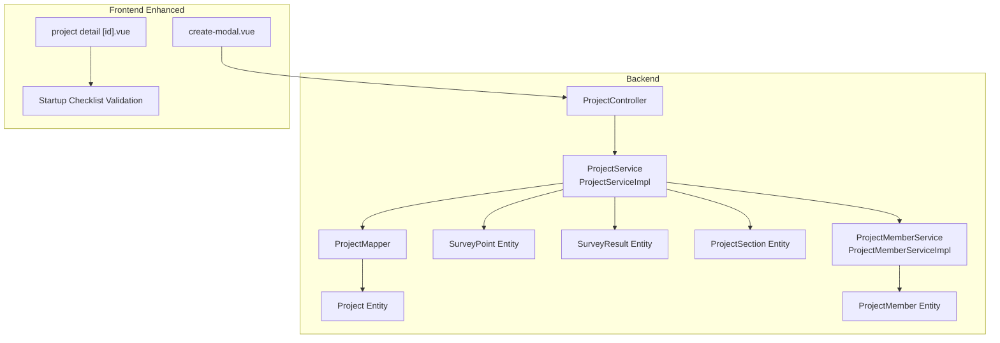
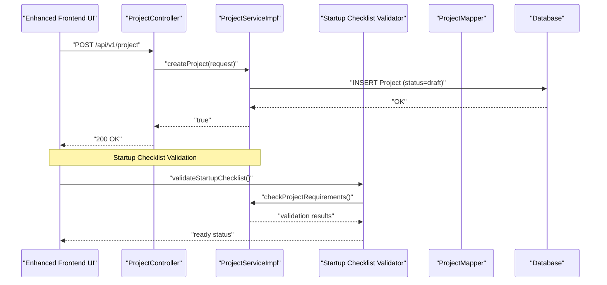
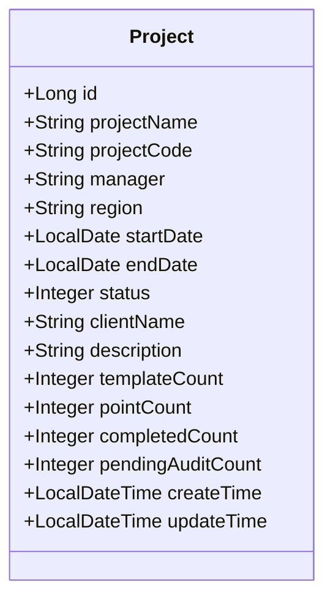
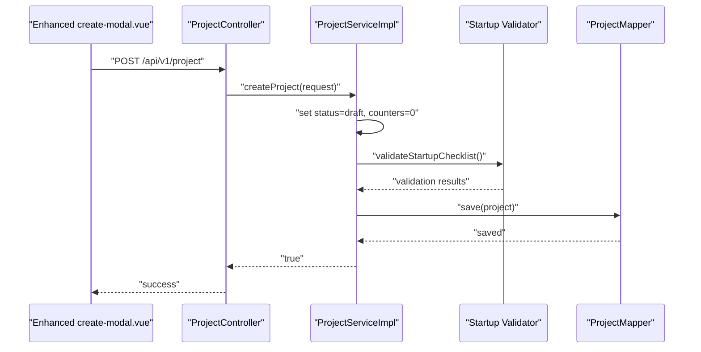
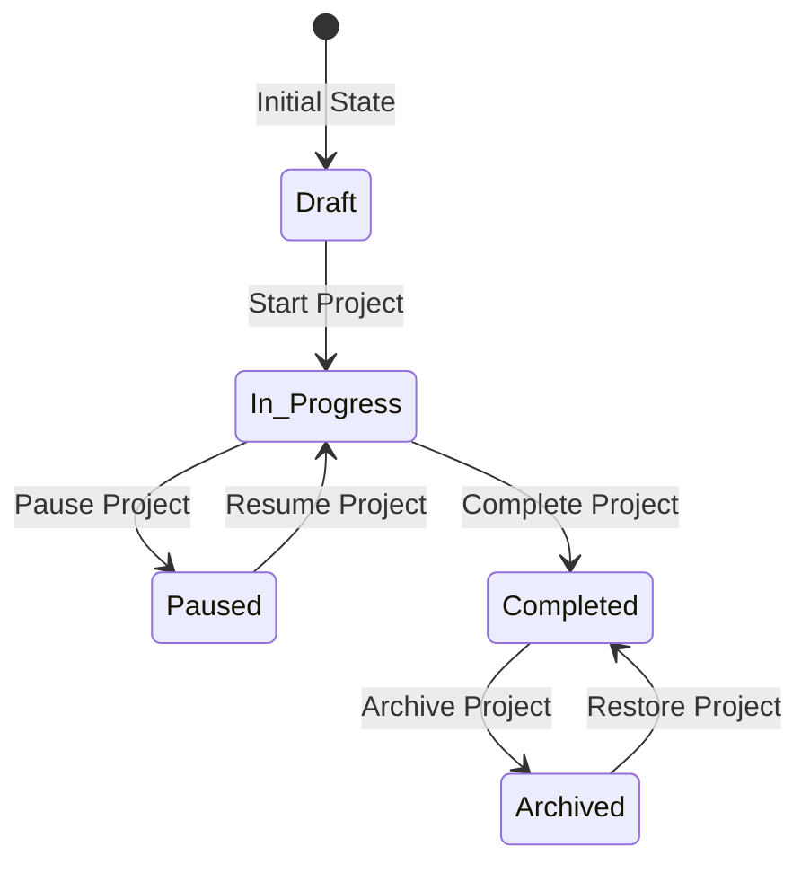
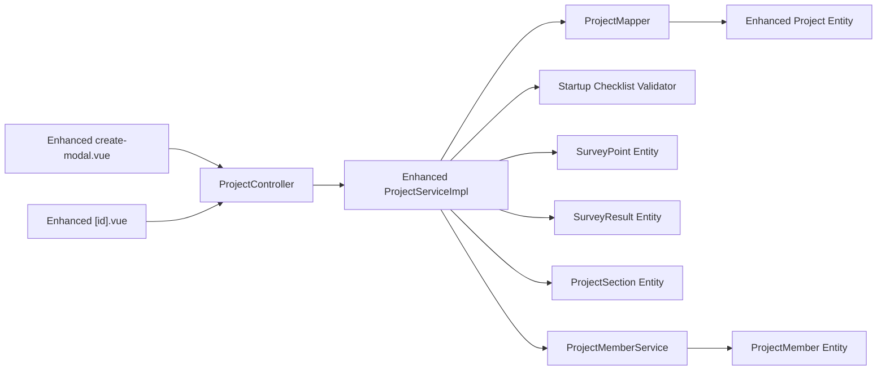

# Project Lifecycle Management

<cite>
**Referenced Files in This Document**
- [Project.java](file://admin-backend/src/main/java/com/qhiot/survey/entity/Project.java)
- [ProjectCreateRequest.java](file://admin-backend/src/main/java/com/qhiot/survey/dto/ProjectCreateRequest.java)
- [ProjectService.java](file://admin-backend/src/main/java/com/qhiot/survey/service/ProjectService.java)
- [ProjectServiceImpl.java](file://admin-backend/src/main/java/com/qhiot/survey/service/impl/ProjectServiceImpl.java)
- [ProjectController.java](file://admin-backend/src/main/java/com/qhiot/survey/controller/ProjectController.java)
- [SurveyPoint.java](file://admin-backend/src/main/java/com/qhiot/survey/entity/SurveyPoint.java)
- [SurveyResult.java](file://admin-backend/src/main/java/com/qhiot/survey/entity/SurveyResult.java)
- [ProjectMember.java](file://admin-backend/src/main/java/com/qhiot/survey/entity/ProjectMember.java)
- [ProjectMemberService.java](file://admin-backend/src/main/java/com/qhiot/survey/service/ProjectMemberService.java)
- [ProjectMemberServiceImpl.java](file://admin-backend/src/main/java/com/qhiot/survey/service/impl/ProjectMemberServiceImpl.java)
- [ProjectSection.java](file://admin-backend/src/main/java/com/qhiot/survey/entity/ProjectSection.java)
- [ProjectMapper.java](file://admin-backend/src/main/java/com/qhiot/survey/mapper/ProjectMapper.java)
- [create-modal.vue](file://admin-web-soybean/src/views/project/modules/create-modal.vue)
- [[id].vue](file://admin-web-soybean/src/views/project/detail/[id].vue)
- [业务流程与状态变更-V2.1.md](file://doc/业务流程与状态变更-V2.1.md)
</cite>

## Update Summary
**Changes Made**
- Enhanced project status management system with comprehensive status transitions (draft, in-progress, paused, completed, archived)
- Added startup checklist validation for project initiation
- Improved project lifecycle management capabilities with enhanced state machine validation
- Updated status transition rules and frontend validation logic

## Table of Contents
1. [Introduction](#introduction)
2. [Project Structure](#project-structure)
3. [Core Components](#core-components)
4. [Architecture Overview](#architecture-overview)
5. [Detailed Component Analysis](#detailed-component-analysis)
6. [Enhanced Status Management System](#enhanced-status-management-system)
7. [Startup Checklist Validation](#startup-checklist-validation)
8. [Dependency Analysis](#dependency-analysis)
9. [Performance Considerations](#performance-considerations)
10. [Troubleshooting Guide](#troubleshooting-guide)
11. [Conclusion](#conclusion)
12. [Appendices](#appendices)

## Introduction
This document describes the enhanced project lifecycle management functionality of the Survey Application. The system now features a comprehensive status management system with five distinct states (draft, in-progress, paused, completed, archived) and includes startup checklist validation to ensure proper project initialization. The enhanced system provides improved state machine validation, automated state changes, and comprehensive lifecycle management capabilities with integrated progress tracking and resource management.

## Project Structure
The project lifecycle spans backend domain entities and services, a REST controller for API exposure, and enhanced frontend components for project creation, editing, and status management. The backend uses Spring Boot with MyBatis-Plus for persistence, and the frontend uses Vue 3 with Ant Design Vue for forms, modals, and interactive status management interfaces.

**Diagram sources**
- [ProjectController.java:23-144](file://admin-backend/src/main/java/com/qhiot/survey/controller/ProjectController.java#L23-L144)
- [ProjectService.java:12-65](file://admin-backend/src/main/java/com/qhiot/survey/service/ProjectService.java#L12-L65)
- [ProjectServiceImpl.java:26-263](file://admin-backend/src/main/java/com/qhiot/survey/service/impl/ProjectServiceImpl.java#L26-L263)
- [ProjectMapper.java:7-9](file://admin-backend/src/main/java/com/qhiot/survey/mapper/ProjectMapper.java#L7-L9)
- [Project.java:18-84](file://admin-backend/src/main/java/com/qhiot/survey/entity/Project.java#L18-L84)
- [SurveyPoint.java:19-84](file://admin-backend/src/main/java/com/qhiot/survey/entity/SurveyPoint.java#L19-L84)
- [SurveyResult.java:16-93](file://admin-backend/src/main/java/com/qhiot/survey/entity/SurveyResult.java#L16-L93)
- [ProjectSection.java:15-39](file://admin-backend/src/main/java/com/qhiot/survey/entity/ProjectSection.java#L15-L39)
- [ProjectMemberService.java:11-70](file://admin-backend/src/main/java/com/qhiot/survey/service/ProjectMemberService.java#L11-L70)
- [ProjectMemberServiceImpl.java:23-131](file://admin-backend/src/main/java/com/qhiot/survey/service/impl/ProjectMemberServiceImpl.java#L23-L131)
- [ProjectMember.java:15-44](file://admin-backend/src/main/java/com/qhiot/survey/entity/ProjectMember.java#L15-L44)
- [create-modal.vue:1-316](file://admin-web-soybean/src/views/project/modules/create-modal.vue#L1-L316)
- [[id].vue](file://admin-web-soybean/src/views/project/detail/[id].vue#L98-L163)

**Section sources**
- [ProjectController.java:23-144](file://admin-backend/src/main/java/com/qhiot/survey/controller/ProjectController.java#L23-L144)
- [ProjectService.java:12-65](file://admin-backend/src/main/java/com/qhiot/survey/service/ProjectService.java#L12-L65)
- [ProjectServiceImpl.java:26-263](file://admin-backend/src/main/java/com/qhiot/survey/service/impl/ProjectServiceImpl.java#L26-L263)
- [Project.java:18-84](file://admin-backend/src/main/java/com/qhiot/survey/entity/Project.java#L18-L84)
- [SurveyPoint.java:19-84](file://admin-backend/src/main/java/com/qhiot/survey/entity/SurveyPoint.java#L19-L84)
- [SurveyResult.java:16-93](file://admin-backend/src/main/java/com/qhiot/survey/entity/SurveyResult.java#L16-L93)
- [ProjectSection.java:15-39](file://admin-backend/src/main/java/com/qhiot/survey/entity/ProjectSection.java#L15-L39)
- [ProjectMemberService.java:11-70](file://admin-backend/src/main/java/com/qhiot/survey/service/ProjectMemberService.java#L11-L70)
- [ProjectMemberServiceImpl.java:23-131](file://admin-backend/src/main/java/com/qhiot/survey/service/impl/ProjectMemberServiceImpl.java#L23-L131)
- [ProjectMember.java:15-44](file://admin-backend/src/main/java/com/qhiot/survey/entity/ProjectMember.java#L15-L44)
- [create-modal.vue:1-316](file://admin-web-soybean/src/views/project/modules/create-modal.vue#L1-L316)
- [[id].vue](file://admin-web-soybean/src/views/project/detail/[id].vue#L98-L163)

## Core Components
- **Enhanced Project Entity**: Encapsulates project metadata, timeline (start/end dates), comprehensive status management (draft, in-progress, paused, completed, archived), and progress counters (templateCount, pointCount, completedCount, pendingAuditCount).
- **ProjectService Interface**: Defines lifecycle operations including creation, updates, status changes, archiving, restoration, and statistics retrieval with enhanced validation.
- **ProjectServiceImpl**: Implements comprehensive lifecycle rules with state machine validation, progress computation, constraint enforcement, and startup checklist validation.
- **ProjectController**: Exposes REST endpoints for CRUD operations, enhanced status transitions, statistics retrieval, and archive/restore operations with validation.
- **Enhanced Frontend Components**: Provide comprehensive forms for project creation/editing with validation, interactive status management, and startup checklist validation.

**Section sources**
- [Project.java:18-84](file://admin-backend/src/main/java/com/qhiot/survey/entity/Project.java#L18-L84)
- [ProjectService.java:12-65](file://admin-backend/src/main/java/com/qhiot/survey/service/ProjectService.java#L12-L65)
- [ProjectServiceImpl.java:26-263](file://admin-backend/src/main/java/com/qhiot/survey/service/impl/ProjectServiceImpl.java#L26-L263)
- [ProjectController.java:23-144](file://admin-backend/src/main/java/com/qhiot/survey/controller/ProjectController.java#L23-L144)
- [create-modal.vue:1-316](file://admin-web-soybean/src/views/project/modules/create-modal.vue#L1-L316)
- [[id].vue](file://admin-web-soybean/src/views/project/detail/[id].vue#L98-L163)

## Architecture Overview
The enhanced lifecycle management is orchestrated via a REST controller that delegates to a service layer implementing comprehensive business rules with state machine validation. Persistence is handled by MyBatis-Plus mappers. Entities model the project, survey points/results, sections, and project members with enhanced status tracking. The frontend provides enhanced modal-driven UX for project creation, editing, and interactive status management with startup checklist validation.

**Diagram sources**
- [create-modal.vue:133-164](file://admin-web-soybean/src/views/project/modules/create-modal.vue#L133-L164)
- [ProjectController.java:52-68](file://admin-backend/src/main/java/com/qhiot/survey/controller/ProjectController.java#L52-L68)
- [ProjectServiceImpl.java:77-98](file://admin-backend/src/main/java/com/qhiot/survey/service/impl/ProjectServiceImpl.java#L77-L98)
- [ProjectMapper.java:7-9](file://admin-backend/src/main/java/com/qhiot/survey/mapper/ProjectMapper.java#L7-L9)
- [[id].vue](file://admin-web-soybean/src/views/project/detail/[id].vue#L101-L110)

## Detailed Component Analysis

### Enhanced Project Entity and Timeline Management
- **Comprehensive Status Field**: The project entity now includes an enhanced status field supporting five states: draft (0), in-progress (1), paused (2), completed (3), and archived (4).
- **Progress Metrics**: Includes templateCount, pointCount, completedCount, and pendingAuditCount for comprehensive progress tracking.
- **Timeline Management**: Supports project metadata, region assignment, timeline (startDate, endDate), and detailed progress computation.

**Diagram sources**
- [Project.java:18-84](file://admin-backend/src/main/java/com/qhiot/survey/entity/Project.java#L18-L84)

**Section sources**
- [Project.java:18-84](file://admin-backend/src/main/java/com/qhiot/survey/entity/Project.java#L18-L84)

### Enhanced Project Creation Workflow
- **Frontend Enhancement**: The create-modal.vue provides comprehensive project creation with validation and submission to backend APIs.
- **Backend Implementation**: The backend creates projects with status set to draft (0) and initializes all counters to zero.
- **Startup Checklist Integration**: Enhanced validation ensures projects meet minimum requirements before initiation.

**Diagram sources**
- [create-modal.vue:133-164](file://admin-web-soybean/src/views/project/modules/create-modal.vue#L133-L164)
- [ProjectController.java:52-68](file://admin-backend/src/main/java/com/qhiot/survey/controller/ProjectController.java#L52-L68)
- [ProjectServiceImpl.java:77-98](file://admin-backend/src/main/java/com/qhiot/survey/service/impl/ProjectServiceImpl.java#L77-L98)
- [ProjectMapper.java:7-9](file://admin-backend/src/main/java/com/qhiot/survey/mapper/ProjectMapper.java#L7-L9)
- [[id].vue](file://admin-web-soybean/src/views/project/detail/[id].vue#L101-L110)

**Section sources**
- [create-modal.vue:133-164](file://admin-web-soybean/src/views/project/modules/create-modal.vue#L133-L164)
- [ProjectController.java:52-68](file://admin-backend/src/main/java/com/qhiot/survey/controller/ProjectController.java#L52-L68)
- [ProjectServiceImpl.java:77-98](file://admin-backend/src/main/java/com/qhiot/survey/service/impl/ProjectServiceImpl.java#L77-L98)

## Enhanced Status Management System

### Comprehensive Status Transitions
The enhanced system implements a strict state machine with comprehensive validation for all status transitions:

**Diagram sources**
- [ProjectServiceImpl.java:213-221](file://admin-backend/src/main/java/com/qhiot/survey/service/impl/ProjectServiceImpl.java#L213-L221)
- [ProjectServiceImpl.java:182-202](file://admin-backend/src/main/java/com/qhiot/survey/service/impl/ProjectServiceImpl.java#L182-L202)

### Enhanced Status Transition Rules
- **Draft (0) → In Progress (1)**: Only allowed for project initiation with startup checklist validation
- **In Progress (1) → Paused (2)**: Allows temporary suspension of field operations
- **In Progress (1) → Completed (3)**: Marks project completion with full point coverage
- **Paused (2) → In Progress (1)**: Resumes suspended field operations
- **Completed (3) → Archived (4)**: Final archival with read-only access

### Advanced Constraint Enforcement
- **Archived Projects**: Cannot be modified, deleted, or have status changes
- **In Progress Projects**: Cannot be deleted; must be paused or completed first
- **Archive Requirements**: Only completed projects can be archived
- **Restore Process**: Archived projects can be restored to completed status

**Section sources**
- [ProjectServiceImpl.java:182-202](file://admin-backend/src/main/java/com/qhiot/survey/service/impl/ProjectServiceImpl.java#L182-L202)
- [ProjectServiceImpl.java:213-221](file://admin-backend/src/main/java/com/qhiot/survey/service/impl/ProjectServiceImpl.java#L213-L221)
- [ProjectServiceImpl.java:251-262](file://admin-backend/src/main/java/com/qhiot/survey/service/impl/ProjectServiceImpl.java#L251-L262)
- [ProjectServiceImpl.java:159-167](file://admin-backend/src/main/java/com/qhiot/survey/service/impl/ProjectServiceImpl.java#L159-L167)

## Startup Checklist Validation

### Enhanced Project Initiation Process
The system now includes comprehensive startup checklist validation to ensure proper project initialization:

```mermaid
flowchart TD
Start(["Project Start Request"]) --> CheckList["Startup Checklist Validation"]
CheckList --> Section{"Section Created?"}
CheckList --> Points{"Points Imported?"}
CheckList --> Members{"Members Assigned?"}
CheckList --> Templates{"Templates Configured?"}
Section --> |No| Block["Block Start - Create Sections First"]
Points --> |No| Block
Members --> |No| Block
Templates --> |No| Block
Section --> |Yes| Proceed["Proceed to Start"]
Points --> |Yes| Proceed
Members --> |Yes| Proceed
Templates --> |Yes| Proceed
Proceed --> Validate["Final Validation"]
Validate --> Ready["Project Ready to Start"]
Block --> Alert["Show Validation Alert"]
Alert --> CheckList
```

**Diagram sources**
- [[id].vue](file://admin-web-soybean/src/views/project/detail/[id].vue#L101-L110)
- [[id].vue](file://admin-web-soybean/src/views/project/detail/[id].vue#L144-L163)

### Startup Checklist Criteria
The enhanced validation includes four critical criteria:

1. **Section Creation**: Project must have at least one section defined
2. **Point Import**: Project must contain at least one survey point
3. **Member Assignment**: Project must have at least one assigned team member
4. **Template Configuration**: Project must have at least one template bound or configured

### Frontend Interactive Validation
The enhanced frontend provides real-time validation feedback with visual indicators:

- **Color-coded Status**: Green checkmarks for satisfied criteria, red X marks for unsatisfied
- **Progress Indication**: Overall readiness percentage calculation
- **Detailed Feedback**: Specific guidance for each unsatisfied criterion
- **Confirmation Dialog**: Prevents project start until all criteria are met

**Section sources**
- [[id].vue](file://admin-web-soybean/src/views/project/detail/[id].vue#L101-L110)
- [[id].vue](file://admin-web-soybean/src/views/project/detail/[id].vue#L144-L163)
- [业务流程与状态变更-V2.1.md:218-226](file://doc/业务流程与状态变更-V2.1.md#L218-L226)

## Dependency Analysis
- **Controller Enhancement**: ProjectController depends on enhanced ProjectService for comprehensive business operations with validation.
- **Service Layer Expansion**: ProjectService extends MyBatis-Plus ServiceImpl with enhanced validation and state machine enforcement.
- **Entity Integration**: Entities are mapped to database tables with enhanced status tracking and interconnected via foreign keys.
- **Frontend Enhancement**: Enhanced modal and detail components integrate with backend APIs for comprehensive create/update operations with validation.

**Diagram sources**
- [create-modal.vue:1-316](file://admin-web-soybean/src/views/project/modules/create-modal.vue#L1-L316)
- [[id].vue](file://admin-web-soybean/src/views/project/detail/[id].vue#L98-L163)
- [ProjectController.java:23-144](file://admin-backend/src/main/java/com/qhiot/survey/controller/ProjectController.java#L23-L144)
- [ProjectServiceImpl.java:26-263](file://admin-backend/src/main/java/com/qhiot/survey/service/impl/ProjectServiceImpl.java#L26-L263)
- [ProjectMapper.java:7-9](file://admin-backend/src/main/java/com/qhiot/survey/mapper/ProjectMapper.java#L7-L9)
- [Project.java:18-84](file://admin-backend/src/main/java/com/qhiot/survey/entity/Project.java#L18-L84)

**Section sources**
- [ProjectController.java:23-144](file://admin-backend/src/main/java/com/qhiot/survey/controller/ProjectController.java#L23-L144)
- [ProjectServiceImpl.java:26-263](file://admin-backend/src/main/java/com/qhiot/survey/service/impl/ProjectServiceImpl.java#L26-L263)
- [ProjectMapper.java:7-9](file://admin-backend/src/main/java/com/qhiot/survey/mapper/ProjectMapper.java#L7-L9)
- [Project.java:18-84](file://admin-backend/src/main/java/com/qhiot/survey/entity/Project.java#L18-L84)
- [SurveyPoint.java:19-84](file://admin-backend/src/main/java/com/qhiot/survey/entity/SurveyPoint.java#L19-L84)
- [SurveyResult.java:16-93](file://admin-backend/src/main/java/com/qhiot/survey/entity/SurveyResult.java#L16-L93)
- [ProjectSection.java:15-39](file://admin-backend/src/main/java/com/qhiot/survey/entity/ProjectSection.java#L15-L39)
- [ProjectMemberService.java:11-70](file://admin-backend/src/main/java/com/qhiot/survey/service/ProjectMemberService.java#L11-L70)
- [ProjectMember.java:15-44](file://admin-backend/src/main/java/com/qhiot/survey/entity/ProjectMember.java#L15-L44)
- [create-modal.vue:1-316](file://admin-web-soybean/src/views/project/modules/create-modal.vue#L1-L316)
- [[id].vue](file://admin-web-soybean/src/views/project/detail/[id].vue#L98-L163)

## Performance Considerations
- **Enhanced State Machine Validation**: Optimized state transition checking with minimal computational overhead
- **Startup Checklist Caching**: Frontend caching of validation results to reduce server requests
- **Progress Counter Optimization**: Efficient batch updates for bulk operations on progress metrics
- **Database Indexing**: Strategic indexing on status fields, project codes, and timestamps for optimal query performance
- **Validation Caching**: Server-side caching of project requirement validation results

## Troubleshooting Guide
- **Invalid State Transition Errors**: Enhanced error messages specify exact current and target states with validation failure reasons
- **Startup Checklist Failures**: Detailed feedback on which specific criteria are not met with actionable guidance
- **Archived Project Operations**: Clear error messages explaining why operations are blocked on archived projects
- **In Progress Deletion Blocks**: Specific guidance on pausing or completing projects before deletion
- **Enhanced Statistics Computation**: Improved error handling for edge cases with zero point counts and null values

**Section sources**
- [ProjectServiceImpl.java:194-196](file://admin-backend/src/main/java/com/qhiot/survey/service/impl/ProjectServiceImpl.java#L194-L196)
- [ProjectServiceImpl.java:141-143](file://admin-backend/src/main/java/com/qhiot/survey/service/impl/ProjectServiceImpl.java#L141-143)
- [ProjectServiceImpl.java:261-262](file://admin-backend/src/main/java/com/qhiot/survey/service/impl/ProjectServiceImpl.java#L261-L262)
- [ProjectServiceImpl.java:130-132](file://admin-backend/src/main/java/com/qhiot/survey/service/impl/ProjectServiceImpl.java#L130-L132)

## Conclusion
The enhanced project lifecycle management system provides a robust, state-machine-driven workflow with comprehensive status transitions and startup checklist validation. The system now supports five distinct states (draft, in-progress, paused, completed, archived) with strict validation rules and enhanced user experience. The integration of startup checklist validation ensures proper project initialization, while the enhanced state machine prevents invalid operations and maintains data integrity. The backend enforces comprehensive lifecycle rules with meaningful metrics, while the frontend offers streamlined UX for project creation, editing, and interactive status management.

## Appendices
- **Enhanced API Endpoints**
  - GET /api/v1/project/page
  - GET /api/v1/project/{id}
  - POST /api/v1/project
  - PUT /api/v1/project/{id}
  - DELETE /api/v1/project/{id}
  - PUT /api/v1/project/{id}/status
  - GET /api/v1/project/{id}/statistics
  - PUT /api/v1/project/{id}/archive
  - PUT /api/v1/project/{id}/restore
  - POST /api/v1/project/{id}/startup-checklist

**Section sources**
- [ProjectController.java:32-143](file://admin-backend/src/main/java/com/qhiot/survey/controller/ProjectController.java#L32-L143)
- [业务流程与状态变更-V2.1.md:183-250](file://doc/业务流程与状态变更-V2.1.md#L183-L250)