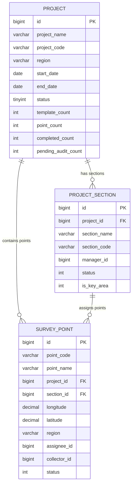
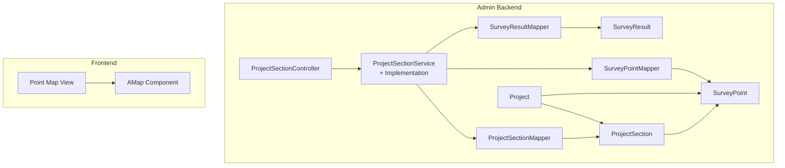
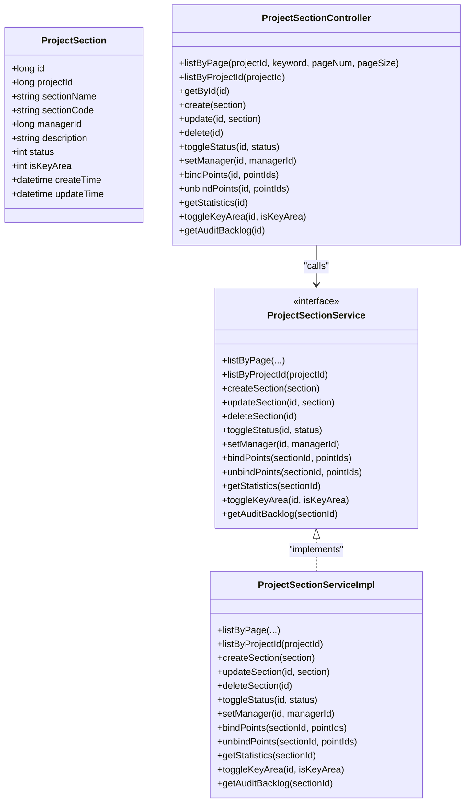
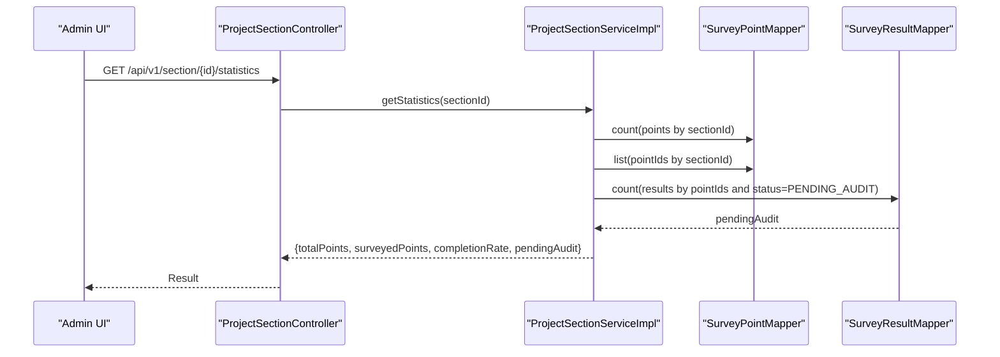
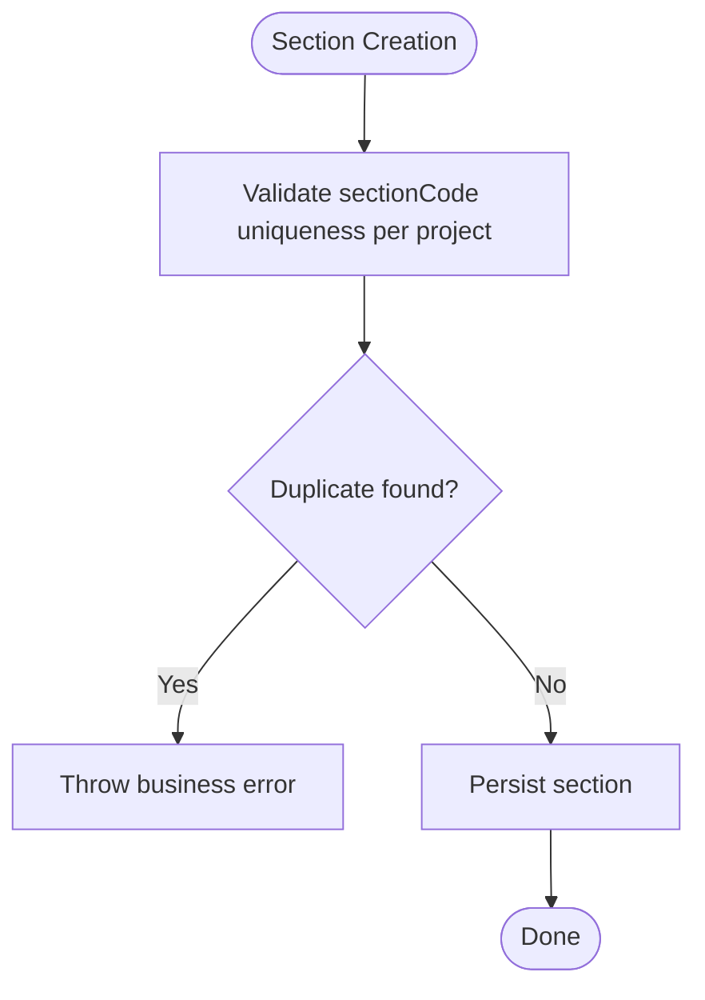
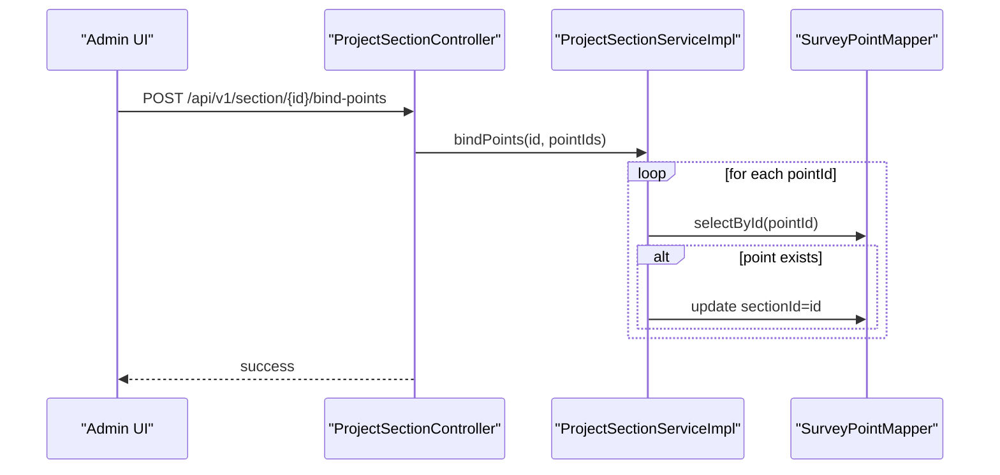
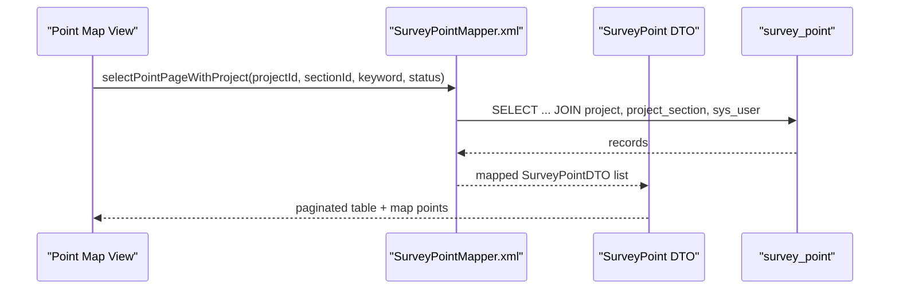
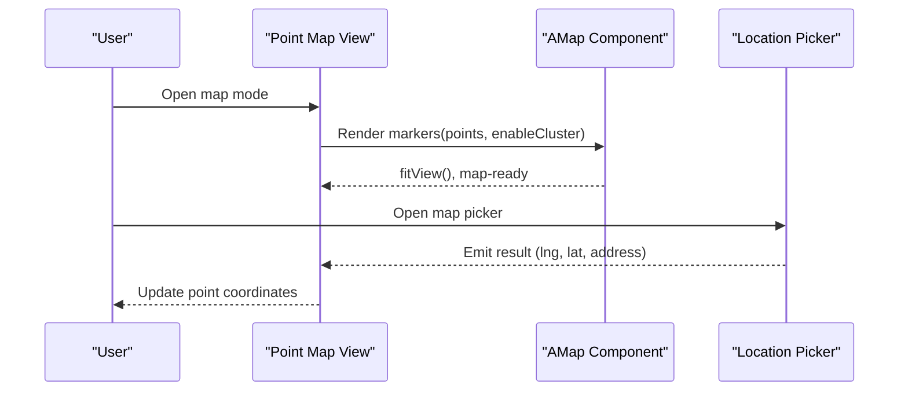
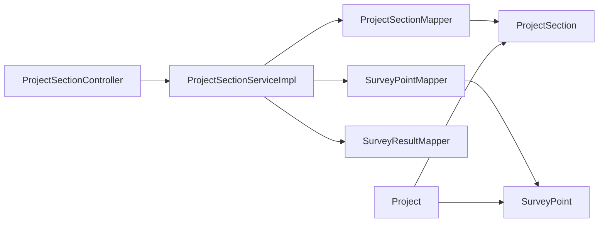

# Project Sections & Organization

<cite>
**Referenced Files in This Document**
- [ProjectSection.java](file://admin-backend/src/main/java/com/qhiot/survey/entity/ProjectSection.java)
- [ProjectSectionController.java](file://admin-backend/src/main/java/com/qhiot/survey/controller/ProjectSectionController.java)
- [ProjectSectionService.java](file://admin-backend/src/main/java/com/qhiot/survey/service/ProjectSectionService.java)
- [ProjectSectionServiceImpl.java](file://admin-backend/src/main/java/com/qhiot/survey/service/impl/ProjectSectionServiceImpl.java)
- [ProjectSectionMapper.java](file://admin-backend/src/main/java/com/qhiot/survey/mapper/ProjectSectionMapper.java)
- [Project.java](file://admin-backend/src/main/java/com/qhiot/survey/entity/Project.java)
- [SurveyPoint.java](file://admin-backend/src/main/java/com/qhiot/survey/entity/SurveyPoint.java)
- [SurveyPointMapper.java](file://admin-backend/src/main/java/com/qhiot/survey/mapper/SurveyPointMapper.java)
- [SurveyPointMapper.xml](file://admin-backend/src/main/resources/mapper/SurveyPointMapper.xml)
- [SurveyResult.java](file://admin-backend/src/main/java/com/qhiot/survey/entity/SurveyResult.java)
- [SurveyPointDTO.java](file://admin-backend/src/main/java/com/qhiot/survey/dto/SurveyPointDTO.java)
- [check_project_section.sql](file://init-sql/check_project_section.sql)
- [project_member.sql](file://admin-backend/src/main/resources/db/project_member.sql)
- [01-init.sql](file://admin-backend/init-data/01-init.sql)
- [05-database-indexes.sql](file://admin-backend/init-data/05-database-indexes.sql)
- [index.vue](file://admin-web-soybean/src/views/point/map/index.vue)
- [amap-component.vue](file://admin-web-soybean/src/components/custom/amap-component.vue)
- [location.js](file://mobile-app/src/utils/location.js)
- [create-modal.vue](file://admin-web-soybean/src/views/project/modules/create-modal.vue)
- [api.d.ts](file://admin-web-soybean/src/typings/api.d.ts)
</cite>

## Table of Contents
1. [Introduction](#introduction)
2. [Project Structure](#project-structure)
3. [Core Components](#core-components)
4. [Architecture Overview](#architecture-overview)
5. [Detailed Component Analysis](#detailed-component-analysis)
6. [Dependency Analysis](#dependency-analysis)
7. [Performance Considerations](#performance-considerations)
8. [Troubleshooting Guide](#troubleshooting-guide)
9. [Conclusion](#conclusion)
10. [Appendices](#appendices)

## Introduction
This document explains the project sections and organizational structure within the survey application. It covers how projects are subdivided into sections, how sections relate to survey points and team assignments, and how administrative boundaries and geographic segmentation are modeled. It also documents section-level reporting, resource allocation, performance tracking, mapping integration, and practical configuration examples.

## Project Structure
The organizational model centers around three primary entities:
- Project: Top-level administrative unit with metadata such as region, dates, and status.
- ProjectSection: Hierarchical subdivision of a project, optionally marked as a key area, with a manager and status.
- SurveyPoint: Field data collection points with geographic coordinates, administrative region, and status, linked to a project and section.

These entities connect via foreign keys:
- ProjectSection.projectId → Project.id
- SurveyPoint.projectId → Project.id
- SurveyPoint.sectionId → ProjectSection.id

**Diagram sources**
- [Project.java:18-84](file://admin-backend/src/main/java/com/qhiot/survey/entity/Project.java#L18-L84)
- [ProjectSection.java:15-39](file://admin-backend/src/main/java/com/qhiot/survey/entity/ProjectSection.java#L15-L39)
- [SurveyPoint.java:19-84](file://admin-backend/src/main/java/com/qhiot/survey/entity/SurveyPoint.java#L19-L84)

**Section sources**
- [Project.java:18-84](file://admin-backend/src/main/java/com/qhiot/survey/entity/Project.java#L18-L84)
- [ProjectSection.java:15-39](file://admin-backend/src/main/java/com/qhiot/survey/entity/ProjectSection.java#L15-L39)
- [SurveyPoint.java:19-84](file://admin-backend/src/main/java/com/qhiot/survey/entity/SurveyPoint.java#L19-L84)

## Core Components
- ProjectSection entity: Holds section identity, administrative linkage, manager, status, and key area flag.
- ProjectSectionController: Exposes REST endpoints for listing, creating, updating, deleting, toggling status, assigning managers, binding/unbinding points, retrieving statistics, marking key areas, and audit backlog.
- ProjectSectionService and implementation: Provide business logic for section management, including validation, persistence, and analytics.
- SurveyPoint: Contains geographic coordinates, administrative region, status, and links to project and section.
- Mapping integration: Frontend map view and AMap component render points and support cluster rendering and info windows.

**Section sources**
- [ProjectSection.java:15-39](file://admin-backend/src/main/java/com/qhiot/survey/entity/ProjectSection.java#L15-L39)
- [ProjectSectionController.java:20-127](file://admin-backend/src/main/java/com/qhiot/survey/controller/ProjectSectionController.java#L20-L127)
- [ProjectSectionService.java:13-75](file://admin-backend/src/main/java/com/qhiot/survey/service/ProjectSectionService.java#L13-L75)
- [ProjectSectionServiceImpl.java:31-255](file://admin-backend/src/main/java/com/qhiot/survey/service/impl/ProjectSectionServiceImpl.java#L31-L255)
- [SurveyPoint.java:19-84](file://admin-backend/src/main/java/com/qhiot/survey/entity/SurveyPoint.java#L19-L84)
- [SurveyPointMapper.xml:5-51](file://admin-backend/src/main/resources/mapper/SurveyPointMapper.xml#L5-L51)
- [index.vue:176-279](file://admin-web-soybean/src/views/point/map/index.vue#L176-L279)
- [amap-component.vue:86-164](file://admin-web-soybean/src/components/custom/amap-component.vue#L86-L164)

## Architecture Overview
The backend follows a layered architecture:
- Controllers expose REST APIs for section management and analytics.
- Services encapsulate business rules and data access.
- Mappers and MyBatis XML queries handle SQL operations.
- Entities represent domain objects.

**Diagram sources**
- [ProjectSectionController.java:20-127](file://admin-backend/src/main/java/com/qhiot/survey/controller/ProjectSectionController.java#L20-L127)
- [ProjectSectionServiceImpl.java:31-255](file://admin-backend/src/main/java/com/qhiot/survey/service/impl/ProjectSectionServiceImpl.java#L31-L255)
- [SurveyPointMapper.java:13-27](file://admin-backend/src/main/java/com/qhiot/survey/mapper/SurveyPointMapper.java#L13-L27)
- [SurveyPointMapper.xml:5-51](file://admin-backend/src/main/resources/mapper/SurveyPointMapper.xml#L5-L51)
- [index.vue:176-279](file://admin-web-soybean/src/views/point/map/index.vue#L176-L279)
- [amap-component.vue:86-164](file://admin-web-soybean/src/components/custom/amap-component.vue#L86-L164)

## Detailed Component Analysis

### ProjectSection Entity and Management
- Identity: id, projectId, sectionName, sectionCode, managerId, description, status, isKeyArea, timestamps.
- Administrative boundaries: sectionCode ensures uniqueness per project; isKeyArea flags priority areas.
- Manager assignment: separate endpoint to set managerId.
- Status control: toggle status between enabled/disabled.
- Point binding: bulk bind/unbind points to a section, updating SurveyPoint.sectionId.

**Diagram sources**
- [ProjectSection.java:15-39](file://admin-backend/src/main/java/com/qhiot/survey/entity/ProjectSection.java#L15-L39)
- [ProjectSectionController.java:20-127](file://admin-backend/src/main/java/com/qhiot/survey/controller/ProjectSectionController.java#L20-L127)
- [ProjectSectionService.java:13-75](file://admin-backend/src/main/java/com/qhiot/survey/service/ProjectSectionService.java#L13-L75)
- [ProjectSectionServiceImpl.java:31-255](file://admin-backend/src/main/java/com/qhiot/survey/service/impl/ProjectSectionServiceImpl.java#L31-L255)

**Section sources**
- [ProjectSection.java:15-39](file://admin-backend/src/main/java/com/qhiot/survey/entity/ProjectSection.java#L15-L39)
- [ProjectSectionController.java:20-127](file://admin-backend/src/main/java/com/qhiot/survey/controller/ProjectSectionController.java#L20-L127)
- [ProjectSectionService.java:13-75](file://admin-backend/src/main/java/com/qhiot/survey/service/ProjectSectionService.java#L13-L75)
- [ProjectSectionServiceImpl.java:31-255](file://admin-backend/src/main/java/com/qhiot/survey/service/impl/ProjectSectionServiceImpl.java#L31-L255)

### Section-Level Reporting and Analytics
- Statistics endpoint aggregates:
  - Total points under a section.
  - Surveyed points (excluding pending).
  - Completion rate.
  - Pending audit count derived from survey results.
- Audit backlog endpoint computes:
  - Total pending audits.
  - Pending over 3 days and 7 days.
  - Aggregated by auditor (service method signature indicates support; implementation returns totals).

**Diagram sources**
- [ProjectSectionController.java:106-110](file://admin-backend/src/main/java/com/qhiot/survey/controller/ProjectSectionController.java#L106-L110)
- [ProjectSectionServiceImpl.java:146-187](file://admin-backend/src/main/java/com/qhiot/survey/service/impl/ProjectSectionServiceImpl.java#L146-L187)
- [SurveyPointMapper.java:13-27](file://admin-backend/src/main/java/com/qhiot/survey/mapper/SurveyPointMapper.java#L13-L27)
- [SurveyResult.java:16-93](file://admin-backend/src/main/java/com/qhiot/survey/entity/SurveyResult.java#L16-L93)

**Section sources**
- [ProjectSectionController.java:106-110](file://admin-backend/src/main/java/com/qhiot/survey/controller/ProjectSectionController.java#L106-L110)
- [ProjectSectionServiceImpl.java:146-187](file://admin-backend/src/main/java/com/qhiot/survey/service/impl/ProjectSectionServiceImpl.java#L146-L187)

### Geographic Segmentation and Administrative Boundaries
- Geographic segmentation:
  - SurveyPoint includes longitude, latitude, and region fields to capture administrative region.
  - Project includes a region field for higher-level administrative grouping.
- Administrative boundaries:
  - ProjectSection is uniquely identified by (projectId, sectionCode) in the database schema and enforced by a unique index in the initialization script.
  - Data integrity checks include verifying project existence, manager existence, and duplicate combinations.

**Diagram sources**
- [ProjectSectionServiceImpl.java:56-66](file://admin-backend/src/main/java/com/qhiot/survey/service/impl/ProjectSectionServiceImpl.java#L56-L66)
- [check_project_section.sql:176-188](file://init-sql/check_project_section.sql#L176-L188)

**Section sources**
- [SurveyPoint.java:46-53](file://admin-backend/src/main/java/com/qhiot/survey/entity/SurveyPoint.java#L46-L53)
- [Project.java:34-34](file://admin-backend/src/main/java/com/qhiot/survey/entity/Project.java#L34-L34)
- [check_project_section.sql:176-188](file://init-sql/check_project_section.sql#L176-L188)
- [01-init.sql:11-30](file://admin-backend/init-data/01-init.sql#L11-L30)

### Team Assignments and Resource Allocation
- Manager assignment:
  - Dedicated endpoint to set managerId on a section.
- Point assignment:
  - Bulk bind/unbind points to a section updates SurveyPoint.sectionId.
- Team roles:
  - ProjectMember table defines roles (admin, collector, auditor, viewer) and status for users within a project.

**Diagram sources**
- [ProjectSectionController.java:90-96](file://admin-backend/src/main/java/com/qhiot/survey/controller/ProjectSectionController.java#L90-L96)
- [ProjectSectionServiceImpl.java:118-132](file://admin-backend/src/main/java/com/qhiot/survey/service/impl/ProjectSectionServiceImpl.java#L118-L132)
- [SurveyPointMapper.java:13-27](file://admin-backend/src/main/java/com/qhiot/survey/mapper/SurveyPointMapper.java#L13-L27)

**Section sources**
- [ProjectSectionController.java:82-88](file://admin-backend/src/main/java/com/qhiot/survey/controller/ProjectSectionController.java#L82-L88)
- [ProjectSectionController.java:90-104](file://admin-backend/src/main/java/com/qhiot/survey/controller/ProjectSectionController.java#L90-L104)
- [ProjectSectionServiceImpl.java:107-116](file://admin-backend/src/main/java/com/qhiot/survey/service/impl/ProjectSectionServiceImpl.java#L107-L116)
- [ProjectSectionServiceImpl.java:118-144](file://admin-backend/src/main/java/com/qhiot/survey/service/impl/ProjectSectionServiceImpl.java#L118-L144)
- [project_member.sql:2-16](file://admin-backend/src/main/resources/db/project_member.sql#L2-L16)

### Organizational Hierarchy and Data Flow
The hierarchy flows from Project to ProjectSection to SurveyPoint. The frontend map view integrates with backend data to visualize points by project and section.

**Diagram sources**
- [SurveyPointMapper.xml:5-51](file://admin-backend/src/main/resources/mapper/SurveyPointMapper.xml#L5-L51)
- [SurveyPointDTO.java:14-48](file://admin-backend/src/main/java/com/qhiot/survey/dto/SurveyPointDTO.java#L14-L48)
- [index.vue:176-214](file://admin-web-soybean/src/views/point/map/index.vue#L176-L214)

**Section sources**
- [SurveyPointMapper.xml:5-51](file://admin-backend/src/main/resources/mapper/SurveyPointMapper.xml#L5-L51)
- [SurveyPointDTO.java:14-48](file://admin-backend/src/main/java/com/qhiot/survey/dto/SurveyPointDTO.java#L14-L48)
- [index.vue:176-214](file://admin-web-soybean/src/views/point/map/index.vue#L176-L214)

### Mapping Systems and Location-Based Assignment
- Frontend map view supports:
  - List and map modes.
  - Filtering by project, status, and keyword.
  - Rendering points with status-specific icons and clustering.
- AMap component:
  - Initializes satellite-style map.
  - Renders markers with info windows and clustering for dense datasets.
- Mobile location picker:
  - Provides map-based selection with event-driven result handling for GPS/coordinate capture.

**Diagram sources**
- [index.vue:276-279](file://admin-web-soybean/src/views/point/map/index.vue#L276-L279)
- [amap-component.vue:86-164](file://admin-web-soybean/src/components/custom/amap-component.vue#L86-L164)
- [location.js:22-41](file://mobile-app/src/utils/location.js#L22-L41)

**Section sources**
- [index.vue:176-279](file://admin-web-soybean/src/views/point/map/index.vue#L176-L279)
- [amap-component.vue:86-164](file://admin-web-soybean/src/components/custom/amap-component.vue#L86-L164)
- [location.js:22-41](file://mobile-app/src/utils/location.js#L22-L41)

## Dependency Analysis
- Controllers depend on services for business logic.
- Services depend on mappers for persistence and on SurveyResult for audit analytics.
- Entities define relationships; mappers and XML queries join entities for reporting.
- Frontend depends on backend DTOs and map components for visualization.

**Diagram sources**
- [ProjectSectionController.java:20-127](file://admin-backend/src/main/java/com/qhiot/survey/controller/ProjectSectionController.java#L20-L127)
- [ProjectSectionServiceImpl.java:31-255](file://admin-backend/src/main/java/com/qhiot/survey/service/impl/ProjectSectionServiceImpl.java#L31-L255)
- [ProjectSectionMapper.java:10-12](file://admin-backend/src/main/java/com/qhiot/survey/mapper/ProjectSectionMapper.java#L10-L12)
- [SurveyPointMapper.java:13-27](file://admin-backend/src/main/java/com/qhiot/survey/mapper/SurveyPointMapper.java#L13-L27)
- [SurveyResult.java:16-93](file://admin-backend/src/main/java/com/qhiot/survey/entity/SurveyResult.java#L16-L93)

**Section sources**
- [ProjectSectionController.java:20-127](file://admin-backend/src/main/java/com/qhiot/survey/controller/ProjectSectionController.java#L20-L127)
- [ProjectSectionServiceImpl.java:31-255](file://admin-backend/src/main/java/com/qhiot/survey/service/impl/ProjectSectionServiceImpl.java#L31-L255)

## Performance Considerations
- Indexing:
  - Composite indexes on survey_point (project_id, status) and other frequently filtered columns improve query performance.
- Clustering:
  - Enabling marker clustering in the map component reduces rendering overhead for large point sets.
- Pagination:
  - Use paginated queries for point listings to avoid large result sets.
- Unique constraints:
  - Enforce (project_id, section_code) uniqueness to prevent duplicates and maintain referential integrity.

**Section sources**
- [05-database-indexes.sql:70-80](file://admin-backend/init-data/05-database-indexes.sql#L70-L80)
- [amap-component.vue:214-268](file://admin-web-soybean/src/components/custom/amap-component.vue#L214-L268)
- [SurveyPointMapper.xml:5-51](file://admin-backend/src/main/resources/mapper/SurveyPointMapper.xml#L5-L51)
- [check_project_section.sql:176-188](file://init-sql/check_project_section.sql#L176-L188)

## Troubleshooting Guide
- Section creation fails with duplicate section code:
  - Cause: Duplicate (project_id, section_code).
  - Resolution: Ensure unique sectionCode per project; consider adding unique index if missing.
- Section not found errors:
  - Cause: Accessing non-existent sectionId.
  - Resolution: Validate inputs and handle gracefully in controllers/services.
- Audit backlog returns zeros:
  - Cause: No points bound to the section or no pending results.
  - Resolution: Verify point binding and result statuses.
- Map rendering issues:
  - Cause: Missing AMap SDK or invalid API key.
  - Resolution: Confirm initialization and network connectivity; retry on error.

**Section sources**
- [ProjectSectionServiceImpl.java:56-66](file://admin-backend/src/main/java/com/qhiot/survey/service/impl/ProjectSectionServiceImpl.java#L56-L66)
- [ProjectSectionServiceImpl.java:146-187](file://admin-backend/src/main/java/com/qhiot/survey/service/impl/ProjectSectionServiceImpl.java#L146-L187)
- [amap-component.vue:158-164](file://admin-web-soybean/src/components/custom/amap-component.vue#L158-L164)

## Conclusion
The project sections and organization model provides a clear hierarchy from projects to sections to survey points, enabling geographic segmentation, administrative delegation, and robust reporting. The backend offers comprehensive CRUD and analytics capabilities, while the frontend integrates mapping for intuitive visualization and location-based assignment.

## Appendices

### Example Workflows

- Create a section within a project:
  - Call POST /api/v1/section with section payload including projectId, sectionName, sectionCode.
  - Validate uniqueness of sectionCode per project.
- Assign a manager to a section:
  - PUT /api/v1/section/{id}/manager with managerId.
- Bind points to a section:
  - POST /api/v1/section/{id}/bind-points with array of pointIds.
- Generate section-level reports:
  - GET /api/v1/section/{id}/statistics for counts and completion rate.
  - GET /api/v1/section/{id}/audit-backlog for pending audit metrics.

**Section sources**
- [ProjectSectionController.java:50-125](file://admin-backend/src/main/java/com/qhiot/survey/controller/ProjectSectionController.java#L50-L125)
- [ProjectSectionServiceImpl.java:56-66](file://admin-backend/src/main/java/com/qhiot/survey/service/impl/ProjectSectionServiceImpl.java#L56-L66)
- [ProjectSectionServiceImpl.java:107-116](file://admin-backend/src/main/java/com/qhiot/survey/service/impl/ProjectSectionServiceImpl.java#L107-L116)
- [ProjectSectionServiceImpl.java:118-144](file://admin-backend/src/main/java/com/qhiot/survey/service/impl/ProjectSectionServiceImpl.java#L118-L144)
- [ProjectSectionServiceImpl.java:146-187](file://admin-backend/src/main/java/com/qhiot/survey/service/impl/ProjectSectionServiceImpl.java#L146-L187)
- [ProjectSectionServiceImpl.java:201-253](file://admin-backend/src/main/java/com/qhiot/survey/service/impl/ProjectSectionServiceImpl.java#L201-L253)

### Frontend Integration Notes
- Map view supports filtering by project and status; points are clustered for performance.
- DTOs include project and section names for display in lists and map overlays.
- Project creation modal demonstrates project-level administrative fields.

**Section sources**
- [index.vue:176-214](file://admin-web-soybean/src/views/point/map/index.vue#L176-L214)
- [SurveyPointMapper.xml:5-51](file://admin-backend/src/main/resources/mapper/SurveyPointMapper.xml#L5-L51)
- [SurveyPointDTO.java:14-48](file://admin-backend/src/main/java/com/qhiot/survey/dto/SurveyPointDTO.java#L14-L48)
- [create-modal.vue:28-74](file://admin-web-soybean/src/views/project/modules/create-modal.vue#L28-L74)