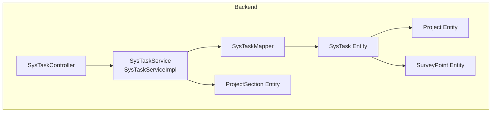
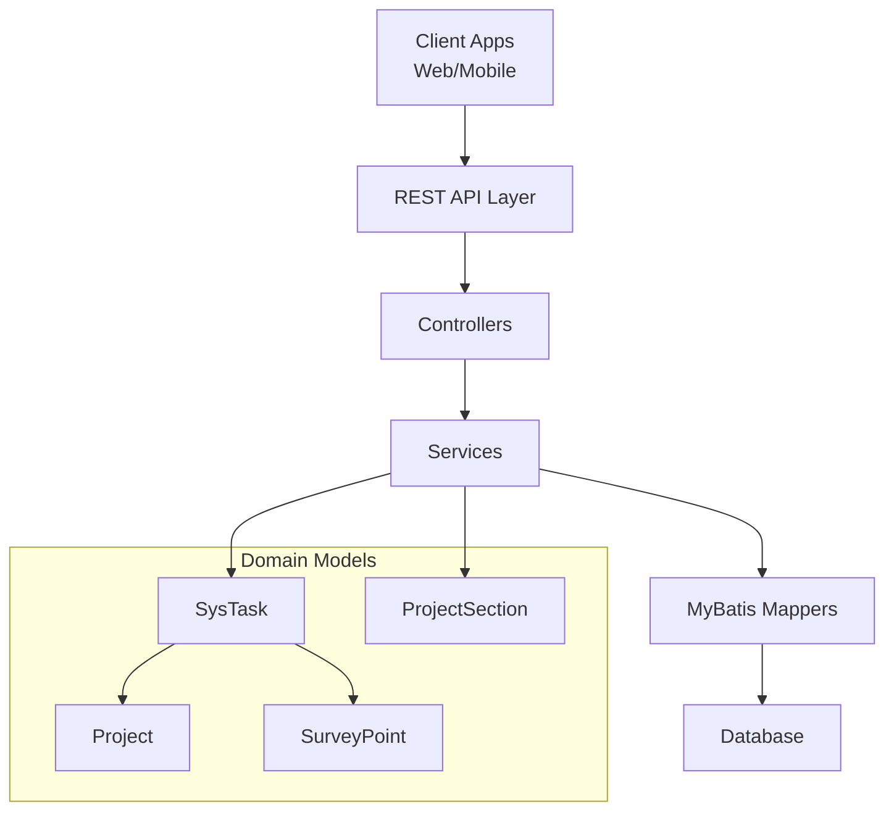
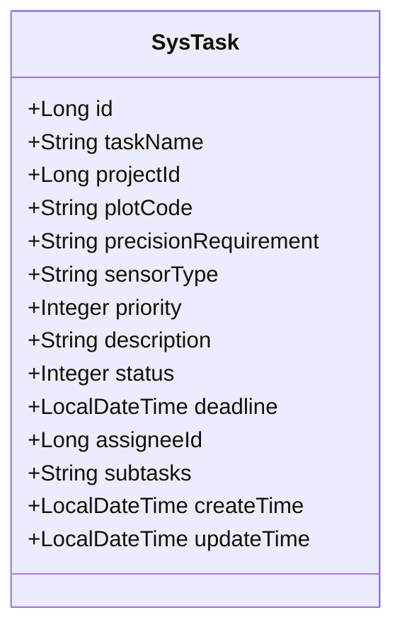
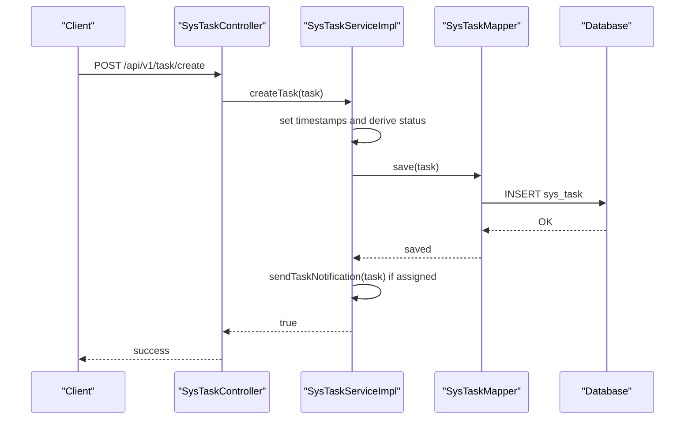
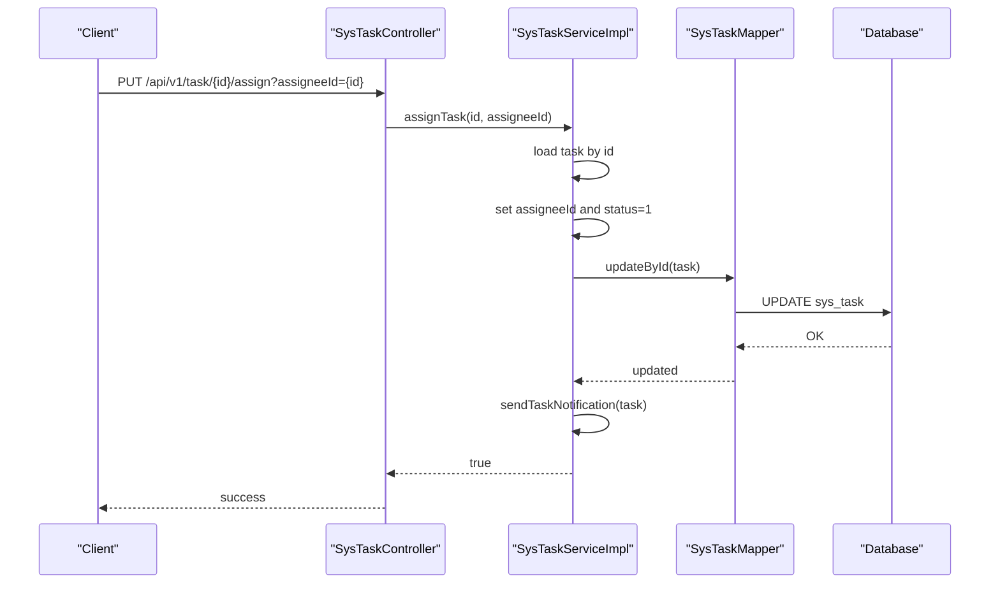
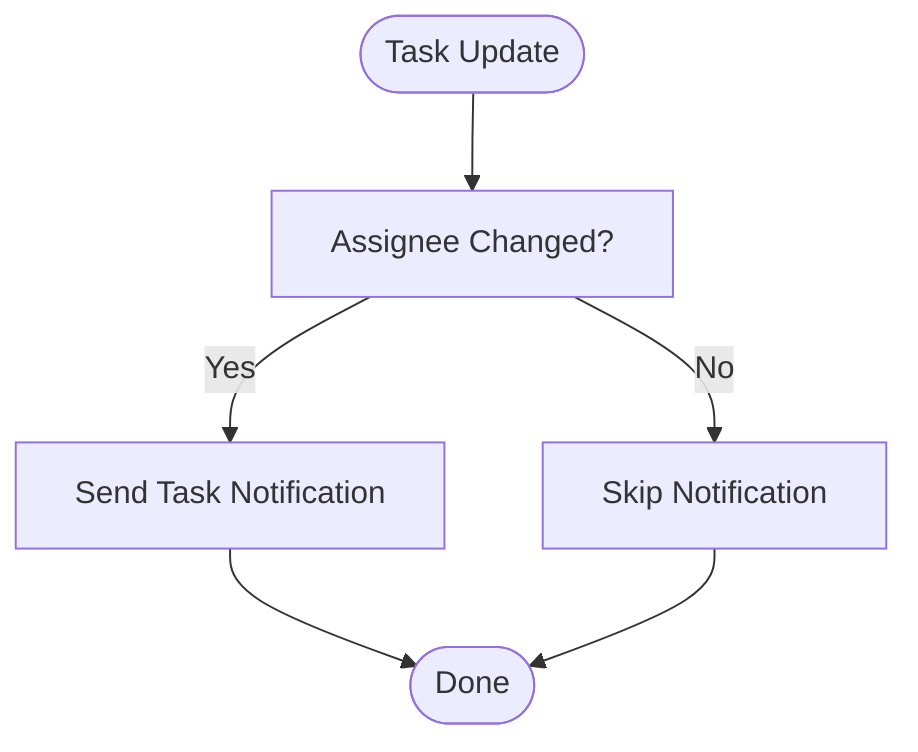
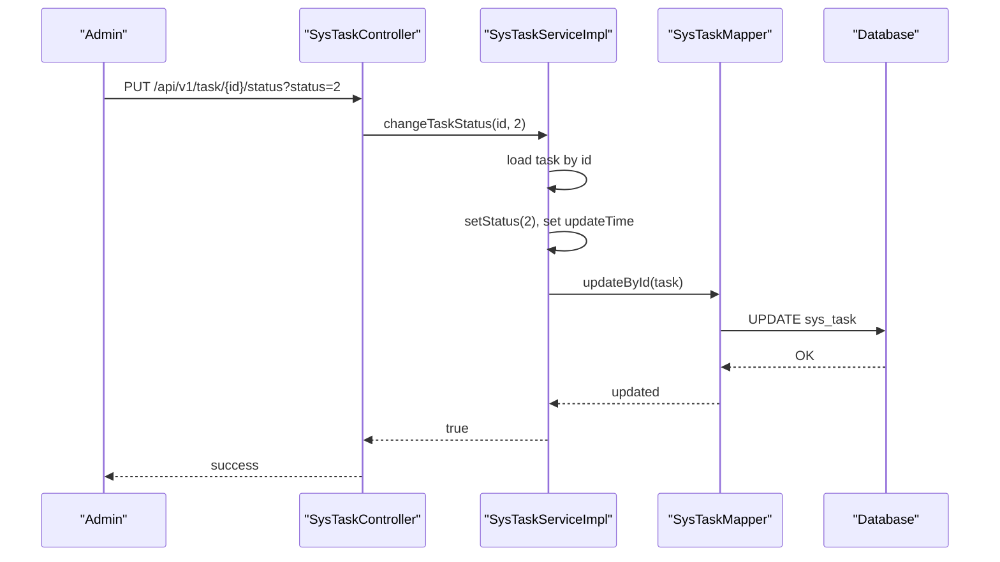
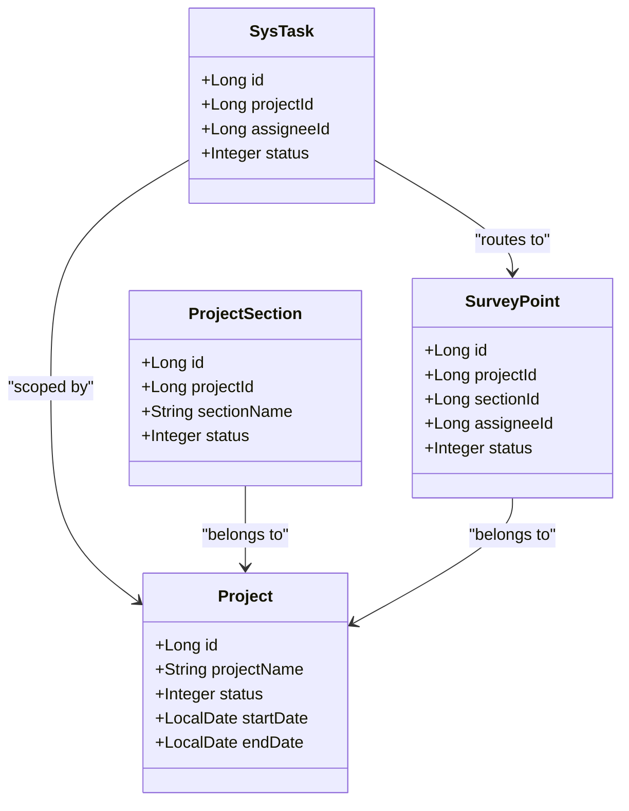
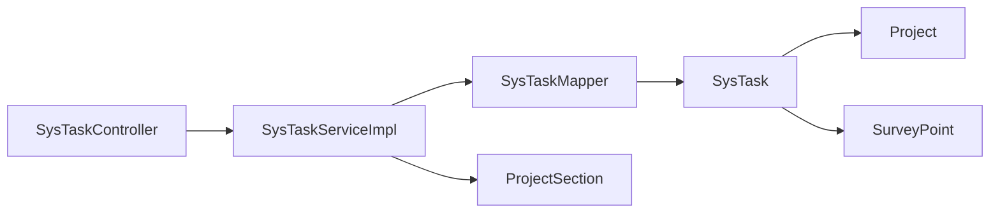

# Task Assignment & Workflow

<cite>
**Referenced Files in This Document**
- [SysTask.java](file://admin-backend/src/main/java/com/qhiot/survey/entity/SysTask.java)
- [SysTaskService.java](file://admin-backend/src/main/java/com/qhiot/survey/service/SysTaskService.java)
- [SysTaskServiceImpl.java](file://admin-backend/src/main/java/com/qhiot/survey/service/impl/SysTaskServiceImpl.java)
- [SysTaskController.java](file://admin-backend/src/main/java/com/qhiot/survey/controller/SysTaskController.java)
- [SysTaskMapper.java](file://admin-backend/src/main/java/com/qhiot/survey/mapper/SysTaskMapper.java)
- [Project.java](file://admin-backend/src/main/java/com/qhiot/survey/entity/Project.java)
- [ProjectSection.java](file://admin-backend/src/main/java/com/qhiot/survey/entity/ProjectSection.java)
- [SurveyPoint.java](file://admin-backend/src/main/java/com/qhiot/survey/entity/SurveyPoint.java)
- [SurveyPointService.java](file://admin-backend/src/main/java/com/qhiot/survey/service/SurveyPointService.java)
- [SurveyPointController.java](file://admin-backend/src/main/java/com/qhiot/survey/controller/SurveyPointController.java)
- [SurveyPointStatus.java](file://admin-backend/src/main/java/com/qhiot/survey/common/enums/SurveyPointStatus.java)
- [05-database-indexes.sql](file://admin-backend/init-data/05-database-indexes.sql)
</cite>

## Table of Contents
1. [Introduction](#introduction)
2. [Project Structure](#project-structure)
3. [Core Components](#core-components)
4. [Architecture Overview](#architecture-overview)
5. [Detailed Component Analysis](#detailed-component-analysis)
6. [Dependency Analysis](#dependency-analysis)
7. [Performance Considerations](#performance-considerations)
8. [Troubleshooting Guide](#troubleshooting-guide)
9. [Conclusion](#conclusion)
10. [Appendices](#appendices)

## Introduction
This document describes the task assignment and workflow system for the Survey Application. It covers the task entity model, assignment logic, priority and deadline management, workflow automation (routing, status propagation, notifications), task creation and progress tracking, integration with project phases and survey point workflows, examples of task distribution algorithms, automated status updates, escalation procedures, task dependencies, parallel processing capabilities, and resource allocation strategies.

## Project Structure
The task assignment system centers around the task domain (SysTask) and integrates with project and survey point domains. The backend exposes REST APIs for task management and leverages Spring Data MyBatis for persistence. Database indexes support efficient filtering and sorting for tasks and survey points.

**Diagram sources**
- [SysTaskController.java:25-97](file://admin-backend/src/main/java/com/qhiot/survey/controller/SysTaskController.java#L25-L97)
- [SysTaskService.java:10-46](file://admin-backend/src/main/java/com/qhiot/survey/service/SysTaskService.java#L10-L46)
- [SysTaskServiceImpl.java:24-149](file://admin-backend/src/main/java/com/qhiot/survey/service/impl/SysTaskServiceImpl.java#L24-L149)
- [SysTaskMapper.java:10-11](file://admin-backend/src/main/java/com/qhiot/survey/mapper/SysTaskMapper.java#L10-L11)
- [SysTask.java:14-65](file://admin-backend/src/main/java/com/qhiot/survey/entity/SysTask.java#L14-L65)
- [Project.java:16-83](file://admin-backend/src/main/java/com/qhiot/survey/entity/Project.java#L16-L83)
- [ProjectSection.java:13-38](file://admin-backend/src/main/java/com/qhiot/survey/entity/ProjectSection.java#L13-L38)
- [SurveyPoint.java:16-83](file://admin-backend/src/main/java/com/qhiot/survey/entity/SurveyPoint.java#L16-L83)

**Section sources**
- [SysTaskController.java:25-97](file://admin-backend/src/main/java/com/qhiot/survey/controller/SysTaskController.java#L25-L97)
- [SysTaskService.java:10-46](file://admin-backend/src/main/java/com/qhiot/survey/service/SysTaskService.java#L10-L46)
- [SysTaskServiceImpl.java:24-149](file://admin-backend/src/main/java/com/qhiot/survey/service/impl/SysTaskServiceImpl.java#L24-L149)
- [SysTaskMapper.java:10-11](file://admin-backend/src/main/java/com/qhiot/survey/mapper/SysTaskMapper.java#L10-L11)
- [SysTask.java:14-65](file://admin-backend/src/main/java/com/qhiot/survey/entity/SysTask.java#L14-L65)
- [Project.java:16-83](file://admin-backend/src/main/java/com/qhiot/survey/entity/Project.java#L16-L83)
- [ProjectSection.java:13-38](file://admin-backend/src/main/java/com/qhiot/survey/entity/ProjectSection.java#L13-L38)
- [SurveyPoint.java:16-83](file://admin-backend/src/main/java/com/qhiot/survey/entity/SurveyPoint.java#L16-L83)

## Core Components
- Task entity: encapsulates task metadata, priority, status, deadline, assignee, and subtasks.
- Task service: orchestrates task lifecycle operations (create, update, assign, change status, delete) and emits notifications.
- Task controller: exposes REST endpoints for task management.
- Persistence: MyBatis mapper and entity mapping for sys_task.
- Project and section entities: provide project-phase context for task scoping.
- Survey point integration: links tasks to field operations via project and point assignments.

Key responsibilities:
- Task creation and initial status derivation based on assignee presence.
- Assignment to team members with automatic notification.
- Status transitions with audit logging.
- Filtering and pagination for task lists.
- Notification dispatch to assignees.

**Section sources**
- [SysTask.java:14-65](file://admin-backend/src/main/java/com/qhiot/survey/entity/SysTask.java#L14-L65)
- [SysTaskService.java:10-46](file://admin-backend/src/main/java/com/qhiot/survey/service/SysTaskService.java#L10-L46)
- [SysTaskServiceImpl.java:24-149](file://admin-backend/src/main/java/com/qhiot/survey/service/impl/SysTaskServiceImpl.java#L24-L149)
- [SysTaskController.java:25-97](file://admin-backend/src/main/java/com/qhiot/survey/controller/SysTaskController.java#L25-L97)
- [SysTaskMapper.java:10-11](file://admin-backend/src/main/java/com/qhiot/survey/mapper/SysTaskMapper.java#L10-L11)
- [Project.java:16-83](file://admin-backend/src/main/java/com/qhiot/survey/entity/Project.java#L16-L83)
- [ProjectSection.java:13-38](file://admin-backend/src/main/java/com/qhiot/survey/entity/ProjectSection.java#L13-L38)
- [SurveyPoint.java:16-83](file://admin-backend/src/main/java/com/qhiot/survey/entity/SurveyPoint.java#L16-L83)

## Architecture Overview
The system follows a layered architecture:
- Presentation: REST controllers expose task and point endpoints.
- Application: Services implement business logic and coordinate persistence and notifications.
- Persistence: MyBatis mappers map entities to relational tables.
- Entities: define data models and relationships.

**Diagram sources**
- [SysTaskController.java:25-97](file://admin-backend/src/main/java/com/qhiot/survey/controller/SysTaskController.java#L25-L97)
- [SysTaskService.java:10-46](file://admin-backend/src/main/java/com/qhiot/survey/service/SysTaskService.java#L10-L46)
- [SysTaskServiceImpl.java:24-149](file://admin-backend/src/main/java/com/qhiot/survey/service/impl/SysTaskServiceImpl.java#L24-L149)
- [SysTaskMapper.java:10-11](file://admin-backend/src/main/java/com/qhiot/survey/mapper/SysTaskMapper.java#L10-L11)
- [SysTask.java:14-65](file://admin-backend/src/main/java/com/qhiot/survey/entity/SysTask.java#L14-L65)
- [Project.java:16-83](file://admin-backend/src/main/java/com/qhiot/survey/entity/Project.java#L16-L83)
- [ProjectSection.java:13-38](file://admin-backend/src/main/java/com/qhiot/survey/entity/ProjectSection.java#L13-L38)
- [SurveyPoint.java:16-83](file://admin-backend/src/main/java/com/qhiot/survey/entity/SurveyPoint.java#L16-L83)

## Detailed Component Analysis

### Task Entity Model
The task entity defines the core attributes for task assignment and workflow:
- Identity and metadata: id, taskName, projectId, plotCode, description.
- Priority and deadline: priority (0=normal, 1=important, 2=urgent), deadline.
- Execution and state: assigneeId, status (0=pending assignment, 1=in-progress, 2=completed, 3=overdue, 4=terminated), subtasks (JSON array string).
- Timestamps: createTime, updateTime.

**Diagram sources**
- [SysTask.java:14-65](file://admin-backend/src/main/java/com/qhiot/survey/entity/SysTask.java#L14-L65)

**Section sources**
- [SysTask.java:14-65](file://admin-backend/src/main/java/com/qhiot/survey/entity/SysTask.java#L14-L65)

### Task Lifecycle and Assignment Logic
The service layer implements the task lifecycle:
- Creation: sets timestamps, derives initial status based on assignee presence, persists, and sends a notification if assigned.
- Update: validates existence, updates timestamps, and notifies if assignee changed.
- Assignment: assigns an assignee, transitions status to in-progress, and notifies.
- Status change: updates status atomically with timestamp.
- Deletion: removes a task after validation.

**Diagram sources**
- [SysTaskController.java:48-55](file://admin-backend/src/main/java/com/qhiot/survey/controller/SysTaskController.java#L48-L55)
- [SysTaskServiceImpl.java:62-77](file://admin-backend/src/main/java/com/qhiot/survey/service/impl/SysTaskServiceImpl.java#L62-L77)
- [SysTaskMapper.java:10-11](file://admin-backend/src/main/java/com/qhiot/survey/mapper/SysTaskMapper.java#L10-L11)

Assignment flow:

**Diagram sources**
- [SysTaskController.java:78-87](file://admin-backend/src/main/java/com/qhiot/survey/controller/SysTaskController.java#L78-L87)
- [SysTaskServiceImpl.java:109-126](file://admin-backend/src/main/java/com/qhiot/survey/service/impl/SysTaskServiceImpl.java#L109-L126)

### Priority Levels and Deadline Management
- Priority: 0=normal, 1=important, 2=urgent. Can be used to drive task distribution and escalation.
- Deadline: supports overdue detection and status propagation to “overdue” when appropriate.

Operational guidance:
- Use priority to weight assignment algorithms (e.g., urgent tasks first).
- Compare deadline against current time to compute overdue status and trigger escalation.

**Section sources**
- [SysTask.java:32-50](file://admin-backend/src/main/java/com/qhiot/survey/entity/SysTask.java#L32-L50)

### Workflow Automation: Routing, Status Propagation, and Notifications
- Routing: tasks are filtered by projectId, assigneeId, status, and keywords for efficient routing to relevant users.
- Status propagation: status transitions are explicit (pending assignment → in-progress → completed/terminated/overdue).
- Notifications: upon creation with assignee or when assignee changes, a system message is sent to the assignee.

**Diagram sources**
- [SysTaskServiceImpl.java:89-92](file://admin-backend/src/main/java/com/qhiot/survey/service/impl/SysTaskServiceImpl.java#L89-L92)
- [SysTaskServiceImpl.java:138-148](file://admin-backend/src/main/java/com/qhiot/survey/service/impl/SysTaskServiceImpl.java#L138-L148)

**Section sources**
- [SysTaskController.java:28-39](file://admin-backend/src/main/java/com/qhiot/survey/controller/SysTaskController.java#L28-L39)
- [SysTaskServiceImpl.java:29-50](file://admin-backend/src/main/java/com/qhiot/survey/service/impl/SysTaskServiceImpl.java#L29-L50)
- [SysTaskServiceImpl.java:89-92](file://admin-backend/src/main/java/com/qhiot/survey/service/impl/SysTaskServiceImpl.java#L89-L92)
- [SysTaskServiceImpl.java:138-148](file://admin-backend/src/main/java/com/qhiot/survey/service/impl/SysTaskServiceImpl.java#L138-L148)

### Task Creation, Assignment, and Progress Tracking
- Creation: initializes timestamps and status; if assignee present, immediately notifies.
- Assignment: moves task to in-progress and notifies.
- Progress tracking: status changes are atomic; clients can poll or subscribe to notifications for updates.

**Diagram sources**
- [SysTaskController.java:66-76](file://admin-backend/src/main/java/com/qhiot/survey/controller/SysTaskController.java#L66-L76)
- [SysTaskServiceImpl.java:97-107](file://admin-backend/src/main/java/com/qhiot/survey/service/impl/SysTaskServiceImpl.java#L97-L107)

**Section sources**
- [SysTaskController.java:48-76](file://admin-backend/src/main/java/com/qhiot/survey/controller/SysTaskController.java#L48-L76)
- [SysTaskServiceImpl.java:62-107](file://admin-backend/src/main/java/com/qhiot/survey/service/impl/SysTaskServiceImpl.java#L62-L107)

### Integration with Project Phases and Survey Point Workflows
- Project-scoped tasks: tasks are associated with a projectId, enabling filtering and reporting per project phase.
- Section-awareness: project sections provide logical grouping for task distribution and workload balancing.
- Survey point alignment: survey points carry assignee and status fields, enabling correlation with field operations and potential task generation or routing.

**Diagram sources**
- [Project.java:16-83](file://admin-backend/src/main/java/com/qhiot/survey/entity/Project.java#L16-L83)
- [ProjectSection.java:13-38](file://admin-backend/src/main/java/com/qhiot/survey/entity/ProjectSection.java#L13-L38)
- [SurveyPoint.java:16-83](file://admin-backend/src/main/java/com/qhiot/survey/entity/SurveyPoint.java#L16-L83)
- [SysTask.java:14-65](file://admin-backend/src/main/java/com/qhiot/survey/entity/SysTask.java#L14-L65)

**Section sources**
- [Project.java:16-83](file://admin-backend/src/main/java/com/qhiot/survey/entity/Project.java#L16-L83)
- [ProjectSection.java:13-38](file://admin-backend/src/main/java/com/qhiot/survey/entity/ProjectSection.java#L13-L38)
- [SurveyPoint.java:16-83](file://admin-backend/src/main/java/com/qhiot/survey/entity/SurveyPoint.java#L16-L83)
- [SysTask.java:14-65](file://admin-backend/src/main/java/com/qhiot/survey/entity/SysTask.java#L14-L65)

### Examples of Task Distribution Algorithms
- Greedy assignment: assign the next urgent task to the least busy available collector.
- Priority-weighted round-robin: cycle through collectors while prioritizing higher-priority tasks.
- Region-based batching: group tasks by section or region to enable parallel field teams.
- Overdue-first policy: escalate overdue tasks to supervisors or reassign.

Note: These are conceptual strategies; implement within service logic using filters (projectId, assigneeId, status) and external coordination (e.g., queueing or scheduling services).

[No sources needed since this section provides conceptual guidance]

### Automated Status Updates and Escalation Procedures
- Automated updates: status transitions occur on explicit API calls; integrate scheduled jobs to detect overdue tasks and set status accordingly.
- Escalation: upon overdue detection, notify supervisors and optionally reassign tasks to higher-priority queues.

[No sources needed since this section provides conceptual guidance]

### Task Dependencies, Parallel Processing, and Resource Allocation
- Dependencies: subtasks stored as JSON string; orchestrate dependent steps in service logic before marking parent task complete.
- Parallel processing: distribute tasks across multiple collectors concurrently; use section/project filters to avoid contention.
- Resource allocation: balance workload by assignee and priority; monitor status and overdue metrics to adjust capacity.

[No sources needed since this section provides conceptual guidance]

## Dependency Analysis
The task domain depends on project and survey point entities for scoping and field operations. Controllers depend on services, which depend on mappers and entities.

**Diagram sources**
- [SysTaskController.java:25-97](file://admin-backend/src/main/java/com/qhiot/survey/controller/SysTaskController.java#L25-L97)
- [SysTaskServiceImpl.java:24-149](file://admin-backend/src/main/java/com/qhiot/survey/service/impl/SysTaskServiceImpl.java#L24-L149)
- [SysTaskMapper.java:10-11](file://admin-backend/src/main/java/com/qhiot/survey/mapper/SysTaskMapper.java#L10-L11)
- [SysTask.java:14-65](file://admin-backend/src/main/java/com/qhiot/survey/entity/SysTask.java#L14-L65)
- [Project.java:16-83](file://admin-backend/src/main/java/com/qhiot/survey/entity/Project.java#L16-L83)
- [ProjectSection.java:13-38](file://admin-backend/src/main/java/com/qhiot/survey/entity/ProjectSection.java#L13-L38)
- [SurveyPoint.java:16-83](file://admin-backend/src/main/java/com/qhiot/survey/entity/SurveyPoint.java#L16-L83)

**Section sources**
- [SysTaskController.java:25-97](file://admin-backend/src/main/java/com/qhiot/survey/controller/SysTaskController.java#L25-L97)
- [SysTaskServiceImpl.java:24-149](file://admin-backend/src/main/java/com/qhiot/survey/service/impl/SysTaskServiceImpl.java#L24-L149)
- [SysTaskMapper.java:10-11](file://admin-backend/src/main/java/com/qhiot/survey/mapper/SysTaskMapper.java#L10-L11)
- [SysTask.java:14-65](file://admin-backend/src/main/java/com/qhiot/survey/entity/SysTask.java#L14-L65)
- [Project.java:16-83](file://admin-backend/src/main/java/com/qhiot/survey/entity/Project.java#L16-L83)
- [ProjectSection.java:13-38](file://admin-backend/src/main/java/com/qhiot/survey/entity/ProjectSection.java#L13-L38)
- [SurveyPoint.java:16-83](file://admin-backend/src/main/java/com/qhiot/survey/entity/SurveyPoint.java#L16-L83)

## Performance Considerations
- Indexing: database indexes on project and survey_point tables improve filtering and pagination performance.
- Pagination: use pageNum/pageSize parameters to limit result sets.
- Selective queries: filter by projectId, assigneeId, status, and keywords to reduce payload sizes.
- Asynchronous notifications: offload notification sending to minimize request latency.

**Section sources**
- [05-database-indexes.sql:64-99](file://admin-backend/init-data/05-database-indexes.sql#L64-L99)
- [SysTaskController.java:28-39](file://admin-backend/src/main/java/com/qhiot/survey/controller/SysTaskController.java#L28-L39)
- [SysTaskServiceImpl.java:29-50](file://admin-backend/src/main/java/com/qhiot/survey/service/impl/SysTaskServiceImpl.java#L29-L50)

## Troubleshooting Guide
Common issues and resolutions:
- Task not found: operations validate task existence and raise exceptions; ensure correct IDs.
- Notification failures: notification sending is wrapped in try-catch; check logs for errors and retry mechanisms.
- Status inconsistencies: always use dedicated endpoints to change status to maintain auditability.

**Section sources**
- [SysTaskServiceImpl.java:52-59](file://admin-backend/src/main/java/com/qhiot/survey/service/impl/SysTaskServiceImpl.java#L52-L59)
- [SysTaskServiceImpl.java:81-85](file://admin-backend/src/main/java/com/qhiot/survey/service/impl/SysTaskServiceImpl.java#L81-L85)
- [SysTaskServiceImpl.java:99-103](file://admin-backend/src/main/java/com/qhiot/survey/service/impl/SysTaskServiceImpl.java#L99-L103)
- [SysTaskServiceImpl.java:138-148](file://admin-backend/src/main/java/com/qhiot/survey/service/impl/SysTaskServiceImpl.java#L138-L148)

## Conclusion
The task assignment and workflow system provides a robust foundation for managing field operations through structured task entities, clear assignment logic, and integrated notifications. By leveraging project and section contexts, aligning with survey point workflows, and applying priority and deadline controls, the system supports scalable, observable, and efficient task management. Extending with automated status updates, escalation policies, and distribution algorithms enables further operational maturity.

## Appendices

### API Definitions
- GET /api/v1/task/page: Filter tasks by projectId, assigneeId, status, keyword; paginate results.
- GET /api/v1/task/{id}: Retrieve task details.
- POST /api/v1/task/create: Create a task; optional assignee triggers immediate notification.
- PUT /api/v1/task/update: Update task metadata.
- PUT /api/v1/task/{id}/status?status={0..4}: Change task status.
- PUT /api/v1/task/{id}/assign?assigneeId={id}: Assign task to a collector.
- DELETE /api/v1/task/{id}: Remove a task.

**Section sources**
- [SysTaskController.java:28-96](file://admin-backend/src/main/java/com/qhiot/survey/controller/SysTaskController.java#L28-L96)

### Status Codes and Meanings
- Task status: 0=pending assignment, 1=in-progress, 2=completed, 3=overdue, 4=terminated.
- Survey point status: 0=pending, 1=draft, 2=pending audit, 3=audit passed, 4=rejected, 5=archived, 6=invalidated.

**Section sources**
- [SysTask.java:42-45](file://admin-backend/src/main/java/com/qhiot/survey/entity/SysTask.java#L42-L45)
- [SurveyPointStatus.java:9-16](file://admin-backend/src/main/java/com/qhiot/survey/common/enums/SurveyPointStatus.java#L9-L16)