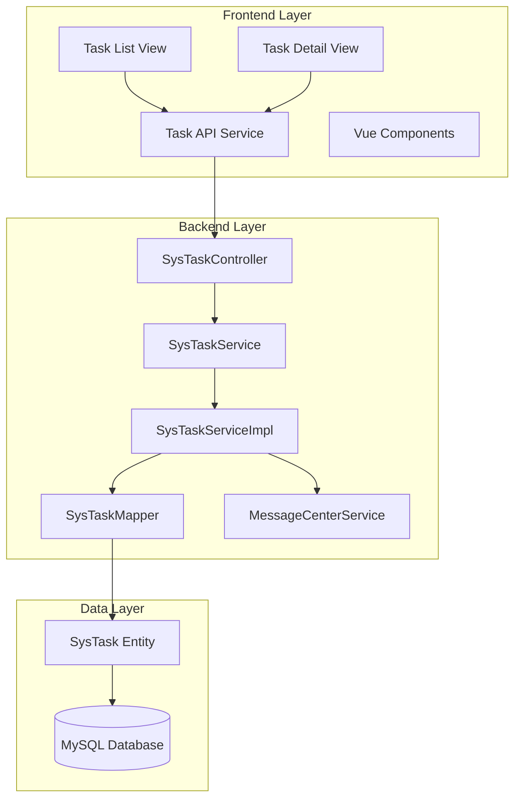
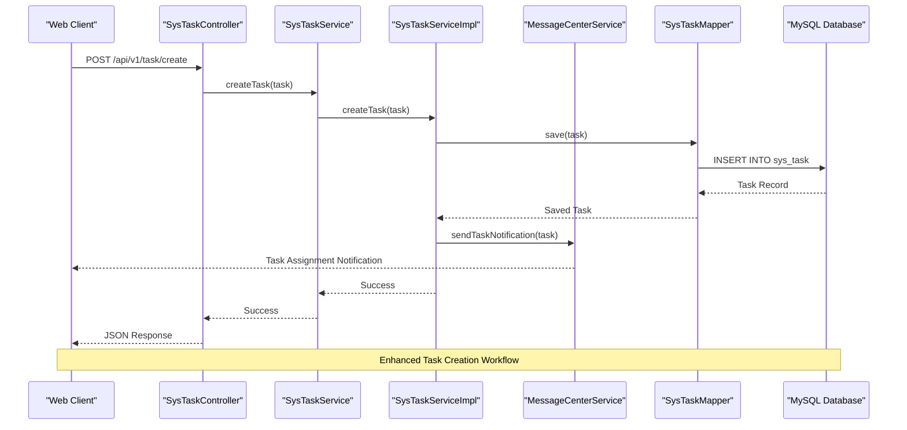
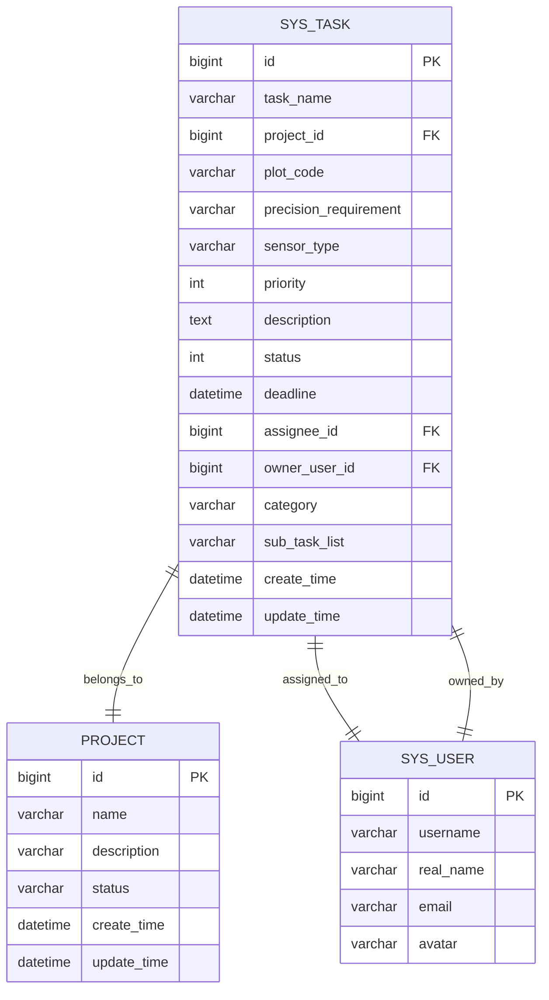

# Task Center System

<cite>
**Referenced Files in This Document**
- [SysTaskController.java](file://admin-backend/src/main/java/com/qhiot/survey/controller/SysTaskController.java)
- [SysTaskService.java](file://admin-backend/src/main/java/com/qhiot/survey/service/SysTaskService.java)
- [SysTaskServiceImpl.java](file://admin-backend/src/main/java/com/qhiot/survey/service/impl/SysTaskServiceImpl.java)
- [SysTaskMapper.java](file://admin-backend/src/main/java/com/qhiot/survey/mapper/SysTaskMapper.java)
- [SysTask.java](file://admin-backend/src/main/java/com/qhiot/survey/entity/SysTask.java)
- [index.vue](file://admin-web-soybean/src/views/task_center/list/index.vue)
- [task.ts](file://admin-web-soybean/src/service/api/task.ts)
- [task_center_detail.vue](file://admin-web-soybean/src/views/task_center/detail/index.vue)
- [SurveyApplication.java](file://admin-backend/src/main/java/com/qhiot/survey/SurveyApplication.java)
</cite>

## Update Summary
**Changes Made**
- Enhanced SysTask entity with comprehensive attributes including priority, deadline, assignee tracking, and owner user management
- Added full CRUD operations with advanced filtering and pagination capabilities
- Implemented comprehensive status tracking system with five distinct states (pending, ongoing, completed, overdue, terminated)
- Integrated messaging system for task assignment notifications
- Expanded frontend interface with enhanced task management capabilities
- Added priority management system with four priority levels (normal, important, urgent, critical)

## Table of Contents
1. [Introduction](#introduction)
2. [Project Structure](#project-structure)
3. [Core Components](#core-components)
4. [Architecture Overview](#architecture-overview)
5. [Detailed Component Analysis](#detailed-component-analysis)
6. [Task Management Workflow](#task-management-workflow)
7. [Data Model Analysis](#data-model-analysis)
8. [Frontend Implementation Details](#frontend-implementation-details)
9. [API Integration](#api-integration)
10. [Enhanced Features](#enhanced-features)
11. [Performance Considerations](#performance-considerations)
12. [Troubleshooting Guide](#troubleshooting-guide)
13. [Conclusion](#conclusion)

## Introduction

The Task Center System is a comprehensive task management solution integrated into the Survey-App ecosystem. This system provides centralized task tracking, assignment, monitoring, and completion capabilities for survey projects. The platform supports multiple task states (pending, ongoing, completed, overdue, terminated), priority levels (normal, important, urgent, critical), categorization, and team collaboration features with integrated messaging notifications.

The system consists of three main components:
- **Backend API Layer**: Java Spring Boot REST API providing enhanced task management functionality with comprehensive CRUD operations
- **Frontend Interface**: Vue.js single-page application with interactive task management interface and real-time updates
- **Database Layer**: Persistent storage for tasks, assignments, and related metadata with advanced filtering capabilities

## Project Structure

The Task Center System follows a layered architecture pattern with clear separation of concerns and enhanced service integration:



**Diagram sources**
- [SysTaskController.java:24-150](file://admin-backend/src/main/java/com/qhiot/survey/controller/SysTaskController.java#L24-L150)
- [SysTaskService.java:1-200](file://admin-backend/src/main/java/com/qhiot/survey/service/SysTaskService.java)
- [SysTaskServiceImpl.java:31-200](file://admin-backend/src/main/java/com/qhiot/survey/service/impl/SysTaskServiceImpl.java#L31-L200)

**Section sources**
- [SurveyApplication.java:1-100](file://admin-backend/src/main/java/com/qhiot/survey/SurveyApplication.java#L1-L100)

## Core Components

### Backend Task Management Components

The backend implements a robust task management system using Spring Boot's layered architecture with enhanced service integration:

**Controller Layer**: Handles HTTP requests and responses for task operations with comprehensive authorization and logging
**Service Layer**: Contains business logic and task processing workflows with data scope validation and notification integration
**Implementation Layer**: Provides concrete implementations of service interfaces with transaction management and messaging integration
**Mapper Layer**: Manages database operations and data persistence with advanced query capabilities
**Entity Layer**: Defines the comprehensive data model for task records with extended attributes

### Frontend Task Management Components

The frontend provides an intuitive interface for task visualization and management with enhanced interactivity:

**Task List Interface**: Kanban-style board displaying tasks across different states with real-time updates
**Task Detail Interface**: Comprehensive view for individual task information and actions with enhanced metadata display
**Interactive Components**: Assignment dropdowns, status indicators, priority badges, and action buttons
**Real-time Updates**: Dynamic task state changes, progress tracking, and notification integration

**Section sources**
- [SysTaskController.java:24-150](file://admin-backend/src/main/java/com/qhiot/survey/controller/SysTaskController.java#L24-L150)
- [index.vue:398-569](file://admin-web-soybean/src/views/task_center/list/index.vue#L398-L569)

## Architecture Overview

The Task Center System employs a modern microservice-friendly architecture with clear separation between presentation, business logic, and data access layers, enhanced with messaging integration:



**Diagram sources**
- [SysTaskController.java:60-120](file://admin-backend/src/main/java/com/qhiot/survey/controller/SysTaskController.java#L60-L120)
- [SysTaskServiceImpl.java:80-150](file://admin-backend/src/main/java/com/qhiot/survey/service/impl/SysTaskServiceImpl.java#L80-L150)

The architecture supports horizontal scaling, maintains data consistency through proper transaction management, provides extensible APIs for future enhancements, and integrates seamlessly with the messaging system for real-time notifications.

## Detailed Component Analysis

### Backend Controller Implementation

The SysTaskController serves as the primary entry point for task management operations, implementing RESTful endpoints for CRUD operations and task state management with comprehensive authorization and logging.

**Key Responsibilities**:
- Task retrieval with advanced filtering and pagination support
- Task creation, updates, and deletion operations with validation
- Bulk task operations and status transitions with authorization checks
- Task assignment operations with permission validation
- Validation and error handling for task-related requests

**Section sources**
- [SysTaskController.java:24-150](file://admin-backend/src/main/java/com/qhiot/survey/controller/SysTaskController.java#L24-L150)

### Service Layer Implementation

The SysTaskService defines the contract for task management operations, while SysTaskServiceImpl provides concrete implementations with business logic enforcement, data scope validation, and messaging integration.

**Core Service Methods**:
- `getTaskPage()`: Retrieves paginated tasks with advanced filtering and data scope validation
- `getTaskById(id)`: Fetches specific task details with access control
- `createTask(task)`: Validates and persists new task records with automatic status assignment
- `updateTask(task)`: Processes task modifications and state changes with transaction management
- `changeTaskStatus(id, status)`: Handles task status transitions with validation
- `assignTask(id, assigneeId)`: Manages task assignment with notification integration
- `deleteTask(id)`: Handles task removal with cascade operations

**Section sources**
- [SysTaskService.java:1-200](file://admin-backend/src/main/java/com/qhiot/survey/service/SysTaskService.java)
- [SysTaskServiceImpl.java:31-200](file://admin-backend/src/main/java/com/qhiot/survey/service/impl/SysTaskServiceImpl.java#L31-L200)

### Data Access Layer

The SysTaskMapper interface extends MyBatis-Plus functionality to provide efficient database operations for task records with advanced query capabilities.

**Database Operations**:
- Standard CRUD operations through MyBatis-Plus repository methods
- Custom queries for task filtering with project scope validation
- Batch operations for bulk task processing
- Optimized queries for task state reporting and priority management

**Section sources**
- [SysTaskMapper.java:1-150](file://admin-backend/src/main/java/com/qhiot/survey/mapper/SysTaskMapper.java)

### Entity Model Design

The SysTask entity represents the core data structure for task management, containing all essential fields for task tracking, collaboration, and enhanced functionality.

**Primary Attributes**:
- Task identification (id, taskName)
- Project association (projectId, projectName)
- Spatial data (plotCode, precisionRequirement, sensorType)
- Priority and timeline management (priority, deadline)
- Assignment tracking (assigneeId, assigneeName, ownerUserId, ownerUserName)
- Status and categorization (status, category, description)
- Advanced features (subTaskList for nested task management)

**Enhanced Features**:
- Priority system with four levels (0=normal, 1=important, 2=urgent, 3=critical)
- Comprehensive status tracking (0=pending, 1=ongoing, 2=completed, 3=overdue, 4=terminated)
- Owner user tracking for task accountability
- Sub-task management for complex project hierarchies
- Enhanced spatial data support for survey applications

**Section sources**
- [SysTask.java:15-200](file://admin-backend/src/main/java/com/qhiot/survey/entity/SysTask.java#L15-L200)

## Task Management Workflow

The Task Center System implements a comprehensive workflow for task lifecycle management with enhanced state tracking:

```mermaid
stateDiagram-v2
[*] --> Pending
Pending --> Ongoing : Assign Task
Ongoing --> Completed : Complete Task
Ongoing --> Overdue : Due Date Passed
Pending --> Terminated : Cancel Task
Overdue --> Ongoing : Work Resumed
Overdue --> Terminated : Task Abandoned
Completed --> [*]
Terminated --> [*]
state Pending {
[*] --> Created
Created --> Assigned : Assignee Selected
Assigned --> Ongoing : Start Work
}
state Ongoing {
[*] --> InProgress
InProgress --> Completed : Task Finished
InProgress --> Overdue : Due Date Passed
}
state Overdue {
Overdue --> Ongoing : Work Resumed
Overdue --> Completed : Task Finished
}
```

**Diagram sources**
- [SysTask.java:15-200](file://admin-backend/src/main/java/com/qhiot/survey/entity/SysTask.java#L15-L200)
- [index.vue:432-511](file://admin-web-soybean/src/views/task_center/list/index.vue#L432-L511)

### Workflow Features

**Enhanced Task States**: Pending, Ongoing, Completed, Overdue, Terminated
**Priority Levels**: Normal, Important, Urgent, Critical
**Assignment System**: Team member assignment with avatar display and notification integration
**Status Tracking**: Real-time status updates, overdue notifications, and automated state transitions
**Progress Monitoring**: Visual indicators for task completion percentage and priority-based coloring
**Spatial Data Integration**: Plot code tracking and survey-specific requirements

## Data Model Analysis

The task management system utilizes a normalized relational database design optimized for performance, scalability, and enhanced functionality:



**Diagram sources**
- [SysTask.java:15-200](file://admin-backend/src/main/java/com/qhiot/survey/entity/SysTask.java#L15-L200)

### Database Schema Features

**Primary Keys**: Auto-generated task identifiers for unique record management
**Foreign Key Relationships**: Project and user associations maintain referential integrity
**Enhanced Indexing**: Strategic indexing on frequently queried fields (status, priority, deadline, assigneeId)
**Data Scope Validation**: Integration with data scope service for project-level access control
**Audit Trail**: Automatic timestamp tracking for all data modifications
**Spatial Integration**: Plot code and survey-specific fields for geographic task management

**Section sources**
- [SysTask.java:15-200](file://admin-backend/src/main/java/com/qhiot/survey/entity/SysTask.java#L15-L200)

## Frontend Implementation Details

### Task List Interface

The frontend task list provides a comprehensive Kanban-style interface for task visualization and management with enhanced interactivity:

**Visual Components**:
- **Task Cards**: Individual task displays with priority indicators, due dates, and assignment status
- **Status Columns**: Separate columns for pending, ongoing, completed, overdue, and terminated tasks
- **Assignment Dropdowns**: Interactive assignment mechanisms for team collaboration with real-time updates
- **Action Buttons**: Contextual actions like completion, modification, and status changes
- **Priority Badges**: Color-coded priority indicators for quick visual scanning

**Interactive Features**:
- Drag-and-drop task state transitions with visual feedback
- Real-time status updates without page refresh
- Priority-based color coding and badge display
- Overdue task highlighting with warning indicators and automated notifications
- Enhanced filtering and search capabilities

**Section sources**
- [index.vue:398-569](file://admin-web-soybean/src/views/task_center/list/index.vue#L398-L569)

### Task Detail Interface

The task detail view provides comprehensive information display and action capabilities with enhanced metadata:

**Detail Components**:
- **Task Information Panel**: Complete task metadata including priority level, deadline, and spatial requirements
- **Timeline Visualization**: Creation, assignment, completion, and overdue date tracking
- **Assignment History**: Complete history of task assignments and ownership changes
- **Comment System**: Collaborative discussion and progress updates
- **Attachment Management**: File uploads and document sharing capabilities
- **Sub-task Management**: Nested task hierarchy for complex project structures

**Navigation Features**:
- Seamless navigation between list and detail views
- Quick action buttons for common operations with status validation
- History tracking for task state changes and assignment updates
- Audit trail for all task modifications with timestamps

**Section sources**
- [task_center_detail.vue:1-200](file://admin-web-soybean/src/views/task_center/detail/index.vue)

### API Integration Layer

The frontend integrates with backend services through a well-defined API layer with enhanced functionality:

**API Service Functions**:
- `fetchTasks()`: Retrieves paginated task lists with advanced filtering and data scope validation
- `createTask(taskData)`: Submits new task creation requests with automatic status assignment
- `updateTask(taskId, updates)`: Processes task modification operations with validation
- `changeTaskStatus(taskId, status)`: Handles task status transitions with authorization
- `assignTask(taskId, assigneeId)`: Manages task assignment with notification integration
- `deleteTask(taskId)`: Handles task removal with confirmation dialogs

**Integration Patterns**:
- Promise-based asynchronous operations with error handling
- Centralized error handling and user feedback with notification integration
- Loading states and progress indicators for long-running operations
- Caching strategies for improved performance and real-time updates

**Section sources**
- [task.ts:1-200](file://admin-web-soybean/src/service/api/task.ts)

## API Integration

The Task Center System provides comprehensive RESTful APIs for seamless frontend-backend communication with enhanced functionality:

### Core API Endpoints

| Endpoint | Method | Description | Authentication | Authorization |
|----------|--------|-------------|----------------|---------------|
| `/api/v1/task/page` | GET | Retrieve paginated tasks with filtering | Required | TASK_VIEW |
| `/api/v1/task/{id}` | GET | Get specific task details | Required | TASK_VIEW |
| `/api/v1/task/create` | POST | Create new task with automatic status | Required | TASK_EDIT |
| `/api/v1/task/update` | PUT | Update existing task | Required | TASK_EDIT |
| `/api/v1/task/{id}/status` | PUT | Change task status | Required | TASK_EDIT |
| `/api/v1/task/{id}/assign` | PUT | Assign task to user | Required | TASK_ASSIGN |
| `/api/v1/task/{id}` | DELETE | Remove task | Required | TASK_EDIT |

### Request/Response Formats

**Enhanced Task Creation Request**:
```json
{
  "taskName": "string",
  "projectId": "bigint",
  "plotCode": "string",
  "precisionRequirement": "string",
  "sensorType": "string",
  "priority": "integer",
  "description": "string",
  "deadline": "datetime",
  "assigneeId": "bigint",
  "category": "string"
}
```

**Enhanced Task Response Format**:
```json
{
  "id": "bigint",
  "taskName": "string",
  "projectId": "bigint",
  "projectName": "string",
  "plotCode": "string",
  "priority": "integer",
  "status": "integer",
  "deadline": "datetime",
  "assigneeId": "bigint",
  "assigneeName": "string",
  "ownerUserId": "bigint",
  "ownerUserName": "string",
  "category": "string",
  "description": "string",
  "createTime": "datetime",
  "updateTime": "datetime"
}
```

**Section sources**
- [SysTaskController.java:60-120](file://admin-backend/src/main/java/com/qhiot/survey/controller/SysTaskController.java#L60-L120)

## Enhanced Features

### Priority Management System

The system implements a comprehensive priority management system with four distinct levels:

**Priority Levels**:
- **Normal (0)**: Standard tasks with regular priority
- **Important (1)**: Higher priority tasks requiring attention
- **Urgent (2)**: Time-sensitive tasks requiring immediate action
- **Critical (3)**: Highest priority tasks affecting project timeline

**Priority Features**:
- Visual priority indicators in task cards
- Color-coded priority badges in task lists
- Priority-based sorting and filtering
- Automated priority assignment based on task characteristics

### Enhanced Status Tracking

The system provides comprehensive status tracking with five distinct states:

**Task States**:
- **Pending (0)**: Tasks awaiting assignment or approval
- **Ongoing (1)**: Active tasks currently being worked on
- **Completed (2)**: Tasks successfully finished
- **Overdue (3)**: Tasks past their deadline
- **Terminated (4)**: Tasks cancelled or terminated

**Status Features**:
- Automatic status transitions based on actions
- Overdue detection and notification system
- Status history tracking for audit purposes
- Status-based filtering and reporting

### Messaging Integration

The system integrates with the messaging center for real-time task notifications:

**Notification Features**:
- Automatic notifications when tasks are assigned
- Status change notifications for team members
- Overdue task reminders and alerts
- Customizable notification preferences

**Section sources**
- [SysTaskServiceImpl.java:132-135](file://admin-backend/src/main/java/com/qhiot/survey/service/impl/SysTaskServiceImpl.java#L132-L135)

## Performance Considerations

### Backend Optimization Strategies

**Database Performance**:
- Enhanced indexing strategy on status, priority, deadline, and assigneeId fields
- Connection pooling configuration for concurrent request handling
- Query optimization through MyBatis-Plus batch operations
- Caching strategies for frequently accessed task data and user information
- Data scope validation optimization for project-level access control

**API Performance**:
- Advanced pagination implementation for large task datasets
- Lazy loading for task detail information and nested sub-tasks
- Efficient filtering and sorting mechanisms with multi-field criteria
- Response compression for reduced bandwidth usage
- Transaction management optimization for concurrent operations

### Frontend Performance Enhancements

**Client-Side Optimization**:
- Virtual scrolling for large task lists with enhanced filtering
- Debounced search and filter operations for improved responsiveness
- Component lazy loading for improved initial load times
- Efficient state management with reactive updates
- Real-time update mechanisms for synchronized task state changes

**Network Optimization**:
- Request batching for multiple task operations
- Smart caching of task data with expiration policies
- Progressive loading for task detail components
- Optimized image handling for user avatars and spatial data
- WebSocket integration for real-time notifications

## Troubleshooting Guide

### Common Issues and Solutions

**Task Loading Problems**:
- Verify database connectivity and connection pool configuration
- Check API endpoint accessibility and response times
- Validate task data format and required field completeness
- Monitor database query performance and optimize slow queries
- Ensure proper data scope validation for project access

**Frontend Display Issues**:
- Confirm proper API integration and response handling
- Verify Vue component reactivity and state management
- Check CSS styling conflicts and responsive design issues
- Test cross-browser compatibility and JavaScript errors
- Validate real-time update mechanisms for task state changes

**Assignment and Collaboration Problems**:
- Validate user authentication and authorization levels
- Check team member data synchronization and availability
- Verify real-time update mechanisms for task assignments
- Test notification systems for task changes and status updates
- Ensure proper messaging service integration

**Priority and Status Management Issues**:
- Verify priority level validation and assignment logic
- Check status transition rules and authorization requirements
- Validate overdue detection and notification system
- Test automated status transitions and state changes

### Debugging Tools and Techniques

**Backend Debugging**:
- Enable detailed logging for API requests and database operations
- Use Spring Boot Actuator for health checks and metrics
- Implement structured error handling with meaningful error messages
- Monitor application performance through built-in metrics
- Test messaging service integration and notification delivery

**Frontend Debugging**:
- Utilize browser developer tools for network request inspection
- Implement Vue DevTools for component state analysis
- Use console logging for tracking user interactions
- Test responsive design across different screen sizes
- Validate real-time update mechanisms and WebSocket connections

**Section sources**
- [SysTaskController.java:24-150](file://admin-backend/src/main/java/com/qhiot/survey/controller/SysTaskController.java#L24-L150)
- [SysTaskServiceImpl.java:31-200](file://admin-backend/src/main/java/com/qhiot/survey/service/impl/SysTaskServiceImpl.java#L31-L200)

## Conclusion

The Task Center System represents a comprehensive and enhanced solution for task management within the Survey-App ecosystem. The system successfully combines modern frontend technologies with robust backend architecture to provide an intuitive, scalable, and maintainable task management platform with advanced features.

**Key Strengths**:
- Clean separation of concerns with layered architecture and enhanced service integration
- Comprehensive task lifecycle management with visual state tracking and priority management
- Intuitive frontend interface with real-time updates and enhanced user experience
- Scalable database design supporting growth and performance needs with advanced indexing
- Extensible API enabling future feature additions and integration capabilities
- Integrated messaging system for real-time notifications and collaboration
- Enhanced data model supporting spatial survey applications and complex project hierarchies

**Future Enhancement Opportunities**:
- Advanced analytics and reporting capabilities with priority and status insights
- Mobile application development for on-the-go task management with offline capabilities
- Integration with external project management tools and calendar systems
- Enhanced collaboration features including comments, file sharing, and version control
- AI-powered task recommendation, prioritization, and predictive scheduling systems
- Advanced spatial data visualization and geographic task management features

The system provides a solid foundation for task management that can evolve with organizational needs while maintaining high performance, reliability, user satisfaction, and comprehensive functionality for survey project management.