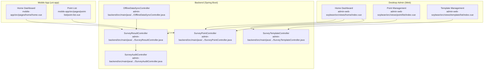
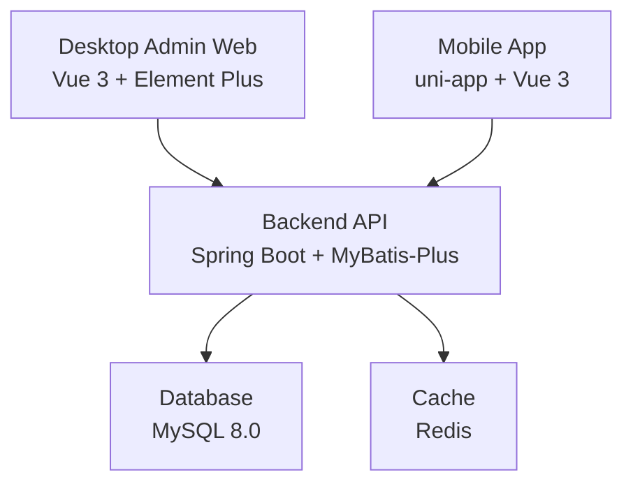
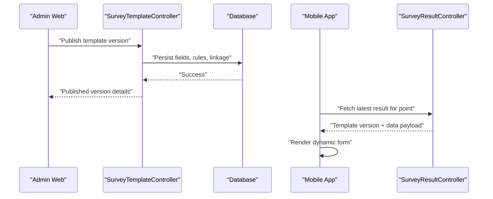
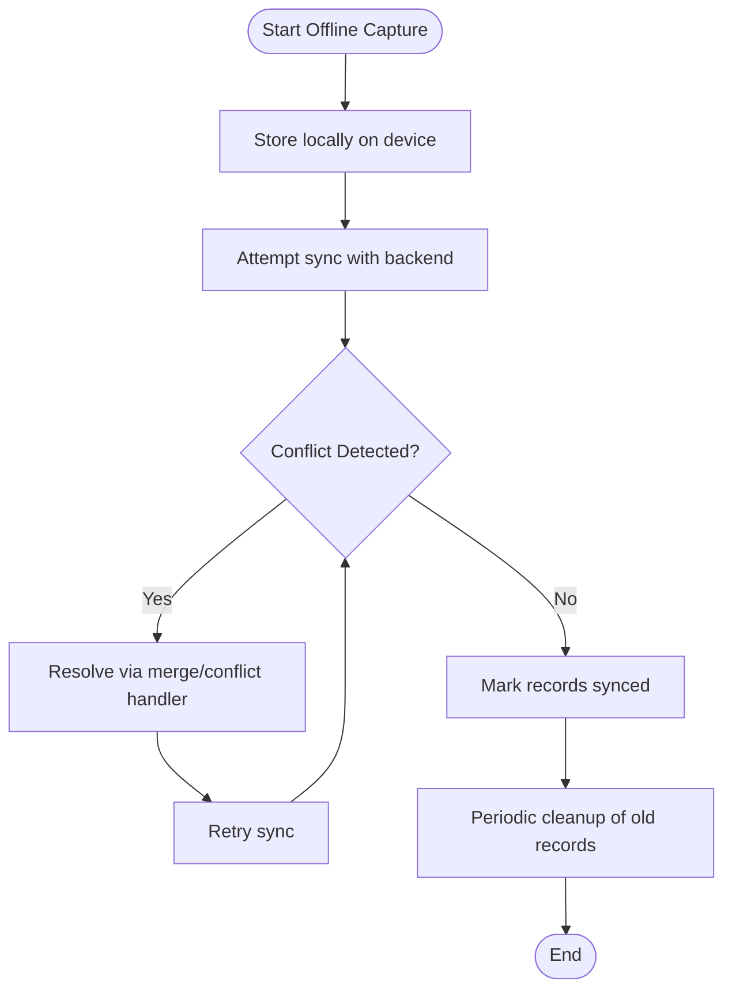
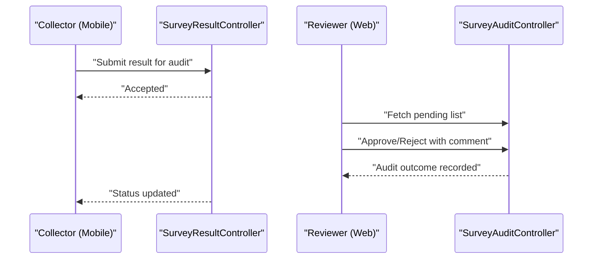
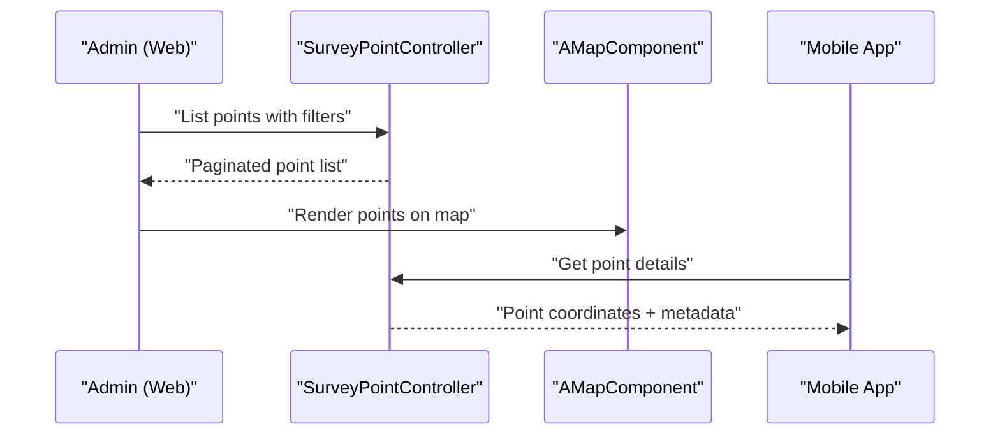
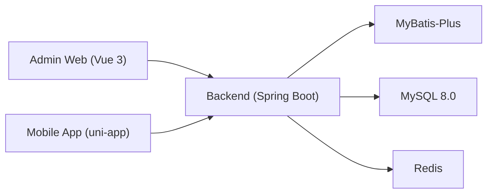

# Project Overview

<cite>
**Referenced Files in This Document**
- [README.md](file://README.md)
- [admin-backend/README.md](file://admin-backend/README.md)
- [admin-backend/src/main/resources/application.yml](file://admin-backend/src/main/resources/application.yml)
- [admin-backend/src/main/java/com/qhiot/survey/controller/SurveyPointController.java](file://admin-backend/src/main/java/com/qhiot/survey/controller/SurveyPointController.java)
- [admin-backend/src/main/java/com/qhiot/survey/controller/SurveyResultController.java](file://admin-backend/src/main/java/com/qhiot/survey/controller/SurveyResultController.java)
- [admin-backend/src/main/java/com/qhiot/survey/controller/SurveyTemplateController.java](file://admin-backend/src/main/java/com/qhiot/survey/controller/SurveyTemplateController.java)
- [admin-backend/src/main/java/com/qhiot/survey/controller/OfflineDataSyncController.java](file://admin-backend/src/main/java/com/qhiot/survey/controller/OfflineDataSyncController.java)
- [admin-backend/src/main/java/com/qhiot/survey/controller/SurveyAuditController.java](file://admin-backend/src/main/java/com/qhiot/survey/controller/SurveyAuditController.java)
- [admin-web-soybean/README.md](file://admin-web-soybean/README.md)
- [admin-web-soybean/package.json](file://admin-web-soybean/package.json)
- [admin-web-soybean/src/views/home/index.vue](file://admin-web-soybean/src/views/home/index.vue)
- [admin-web-soybean/src/views/point/list/index.vue](file://admin-web-soybean/src/views/point/list/index.vue)
- [admin-web-soybean/src/views/template/list/index.vue](file://admin-web-soybean/src/views/template/list/index.vue)
- [mobile-app/README.md](file://mobile-app/README.md)
- [mobile-app/package.json](file://mobile-app/package.json)
- [mobile-app/src/pages/home/home.vue](file://mobile-app/src/pages/home/home.vue)
- [mobile-app/src/pages/point-list/point-list.vue](file://mobile-app/src/pages/point-list/point-list.vue)
</cite>

## Table of Contents
1. [Introduction](#introduction)
2. [Project Structure](#project-structure)
3. [Core Components](#core-components)
4. [Architecture Overview](#architecture-overview)
5. [Detailed Component Analysis](#detailed-component-analysis)
6. [Dependency Analysis](#dependency-analysis)
7. [Performance Considerations](#performance-considerations)
8. [Troubleshooting Guide](#troubleshooting-guide)
9. [Conclusion](#conclusion)

## Introduction
The Survey-App is an environmental survey and monitoring data collection platform designed to streamline water quality assessment and infrastructure inspection workflows. It provides a unified, cross-platform solution enabling field surveyors to capture standardized data in the field, administrators to manage templates and users, and reviewers to audit submissions through a closed-loop workflow. The system emphasizes reliability, scalability, and real-time collaboration across devices.

Key capabilities include:
- Standardized data collection aligned with environmental inspection protocols
- Dynamic form templates with versioning and linkage rules
- Robust offline data synchronization with conflict resolution
- Integrated GPS location tracking and manual correction
- Closed-loop audit workflows from submission to approval or revision

## Project Structure
The project follows a three-tier architecture:
- Backend: Spring Boot REST API with MyBatis-Plus persistence
- Desktop Admin: Vue 3 + Element Plus admin web interface
- Mobile App: uni-app powered by Vue 3 for cross-platform mobile experiences

**Diagram sources**
- [admin-web-soybean/src/views/home/index.vue:1-152](file://admin-web-soybean/src/views/home/index.vue#L1-L152)
- [admin-web-soybean/src/views/point/list/index.vue:1-506](file://admin-web-soybean/src/views/point/list/index.vue#L1-L506)
- [admin-web-soybean/src/views/template/list/index.vue:1-385](file://admin-web-soybean/src/views/template/list/index.vue#L1-L385)
- [mobile-app/src/pages/home/home.vue:1-554](file://mobile-app/src/pages/home/home.vue#L1-L554)
- [mobile-app/src/pages/point-list/point-list.vue:1-380](file://mobile-app/src/pages/point-list/point-list.vue#L1-L380)
- [admin-backend/src/main/java/com/qhiot/survey/controller/SurveyPointController.java:1-140](file://admin-backend/src/main/java/com/qhiot/survey/controller/SurveyPointController.java#L1-L140)
- [admin-backend/src/main/java/com/qhiot/survey/controller/SurveyResultController.java:1-180](file://admin-backend/src/main/java/com/qhiot/survey/controller/SurveyResultController.java#L1-L180)
- [admin-backend/src/main/java/com/qhiot/survey/controller/SurveyTemplateController.java:1-193](file://admin-backend/src/main/java/com/qhiot/survey/controller/SurveyTemplateController.java#L1-L193)
- [admin-backend/src/main/java/com/qhiot/survey/controller/OfflineDataSyncController.java:1-95](file://admin-backend/src/main/java/com/qhiot/survey/controller/OfflineDataSyncController.java#L1-L95)
- [admin-backend/src/main/java/com/qhiot/survey/controller/SurveyAuditController.java:1-103](file://admin-backend/src/main/java/com/qhiot/survey/controller/SurveyAuditController.java#L1-L103)

**Section sources**
- [README.md:1-50](file://README.md#L1-L50)
- [admin-backend/README.md:1-45](file://admin-backend/README.md#L1-L45)
- [admin-web-soybean/README.md:1-200](file://admin-web-soybean/README.md#L1-L200)
- [mobile-app/README.md:1-46](file://mobile-app/README.md#L1-L46)

## Core Components
- Backend API server
  - Provides REST endpoints for point management, survey results, templates, audits, and offline synchronization
  - Implements role-based access control and operation logging
  - Uses MyBatis-Plus for data access and supports Swagger/OpenAPI documentation

- Desktop Admin Web
  - Home dashboard with metrics and charts
  - Point management with list and map views
  - Template management with versioning and publishing workflows
  - Responsive UI built with Vue 3 and Element Plus

- Mobile App
  - Home dashboard summarizing personal tasks and statuses
  - Point list with filtering and actions
  - Navigation to survey forms and map-based location features

**Section sources**
- [admin-backend/src/main/java/com/qhiot/survey/controller/SurveyPointController.java:1-140](file://admin-backend/src/main/java/com/qhiot/survey/controller/SurveyPointController.java#L1-L140)
- [admin-backend/src/main/java/com/qhiot/survey/controller/SurveyResultController.java:1-180](file://admin-backend/src/main/java/com/qhiot/survey/controller/SurveyResultController.java#L1-L180)
- [admin-backend/src/main/java/com/qhiot/survey/controller/SurveyTemplateController.java:1-193](file://admin-backend/src/main/java/com/qhiot/survey/controller/SurveyTemplateController.java#L1-L193)
- [admin-backend/src/main/java/com/qhiot/survey/controller/OfflineDataSyncController.java:1-95](file://admin-backend/src/main/java/com/qhiot/survey/controller/OfflineDataSyncController.java#L1-L95)
- [admin-backend/src/main/java/com/qhiot/survey/controller/SurveyAuditController.java:1-103](file://admin-backend/src/main/java/com/qhiot/survey/controller/SurveyAuditController.java#L1-L103)
- [admin-web-soybean/src/views/home/index.vue:1-152](file://admin-web-soybean/src/views/home/index.vue#L1-L152)
- [admin-web-soybean/src/views/point/list/index.vue:1-506](file://admin-web-soybean/src/views/point/list/index.vue#L1-L506)
- [admin-web-soybean/src/views/template/list/index.vue:1-385](file://admin-web-soybean/src/views/template/list/index.vue#L1-L385)
- [mobile-app/src/pages/home/home.vue:1-554](file://mobile-app/src/pages/home/home.vue#L1-L554)
- [mobile-app/src/pages/point-list/point-list.vue:1-380](file://mobile-app/src/pages/point-list/point-list.vue#L1-L380)

## Architecture Overview
The system employs a client-server model with three distinct frontends sharing a single backend:
- Desktop Admin: Full-featured management and analytics
- Mobile App: Field-centric data capture and navigation
- Backend: Centralized business logic, data persistence, and audit control

**Diagram sources**
- [admin-backend/src/main/resources/application.yml:1-149](file://admin-backend/src/main/resources/application.yml#L1-L149)
- [admin-backend/README.md:1-45](file://admin-backend/README.md#L1-L45)
- [admin-web-soybean/package.json:1-117](file://admin-web-soybean/package.json#L1-L117)
- [mobile-app/package.json:1-22](file://mobile-app/package.json#L1-L22)

## Detailed Component Analysis

### Data Collection and Templates
Dynamic form templates enable administrators to define field sets, validation rules, and linkage logic. The mobile app consumes published template versions to render forms, while the desktop admin manages template lifecycle and bindings to specific outfall types and projects.

**Diagram sources**
- [admin-backend/src/main/java/com/qhiot/survey/controller/SurveyTemplateController.java:1-193](file://admin-backend/src/main/java/com/qhiot/survey/controller/SurveyTemplateController.java#L1-L193)
- [admin-backend/src/main/java/com/qhiot/survey/controller/SurveyResultController.java:1-180](file://admin-backend/src/main/java/com/qhiot/survey/controller/SurveyResultController.java#L1-L180)
- [admin-web-soybean/src/views/template/list/index.vue:1-385](file://admin-web-soybean/src/views/template/list/index.vue#L1-L385)
- [mobile-app/src/pages/home/home.vue:1-554](file://mobile-app/src/pages/home/home.vue#L1-L554)

**Section sources**
- [admin-backend/src/main/java/com/qhiot/survey/controller/SurveyTemplateController.java:1-193](file://admin-backend/src/main/java/com/qhiot/survey/controller/SurveyTemplateController.java#L1-L193)
- [admin-web-soybean/src/views/template/list/index.vue:1-385](file://admin-web-soybean/src/views/template/list/index.vue#L1-L385)

### Offline Data Synchronization
Field surveyors often operate in low-connectivity environments. The offline synchronization module captures local submissions, associates them with device identifiers, and reconciles conflicts upon reconnect.

**Diagram sources**
- [admin-backend/src/main/java/com/qhiot/survey/controller/OfflineDataSyncController.java:1-95](file://admin-backend/src/main/java/com/qhiot/survey/controller/OfflineDataSyncController.java#L1-L95)

**Section sources**
- [admin-backend/src/main/java/com/qhiot/survey/controller/OfflineDataSyncController.java:1-95](file://admin-backend/src/main/java/com/qhiot/survey/controller/OfflineDataSyncController.java#L1-L95)

### Audit Workflow
The closed-loop audit process ensures data quality and compliance. Results move from collection to submission, reviewer assignment, and either approval or revision with comments.

**Diagram sources**
- [admin-backend/src/main/java/com/qhiot/survey/controller/SurveyResultController.java:1-180](file://admin-backend/src/main/java/com/qhiot/survey/controller/SurveyResultController.java#L1-L180)
- [admin-backend/src/main/java/com/qhiot/survey/controller/SurveyAuditController.java:1-103](file://admin-backend/src/main/java/com/qhiot/survey/controller/SurveyAuditController.java#L1-L103)

**Section sources**
- [admin-backend/src/main/java/com/qhiot/survey/controller/SurveyResultController.java:1-180](file://admin-backend/src/main/java/com/qhiot/survey/controller/SurveyResultController.java#L1-L180)
- [admin-backend/src/main/java/com/qhiot/survey/controller/SurveyAuditController.java:1-103](file://admin-backend/src/main/java/com/qhiot/survey/controller/SurveyAuditController.java#L1-L103)

### Point Management and Location Tracking
Administrators can manage survey points, assign them to projects, and visualize them on a map. Field teams can view point details, navigate to locations, and apply manual corrections when needed.

**Diagram sources**
- [admin-backend/src/main/java/com/qhiot/survey/controller/SurveyPointController.java:1-140](file://admin-backend/src/main/java/com/qhiot/survey/controller/SurveyPointController.java#L1-L140)
- [admin-web-soybean/src/views/point/list/index.vue:1-506](file://admin-web-soybean/src/views/point/list/index.vue#L1-L506)

**Section sources**
- [admin-backend/src/main/java/com/qhiot/survey/controller/SurveyPointController.java:1-140](file://admin-backend/src/main/java/com/qhiot/survey/controller/SurveyPointController.java#L1-L140)
- [admin-web-soybean/src/views/point/list/index.vue:1-506](file://admin-web-soybean/src/views/point/list/index.vue#L1-L506)

## Dependency Analysis
The system’s dependencies are organized by technology stack and responsibility:
- Backend runtime and persistence: Spring Boot, MyBatis-Plus, MySQL, Redis
- Frontend frameworks: Vue 3, Element Plus, uni-app
- Build and packaging: Maven (backend), Vite (web), npm/pnpm (mobile)
- Cross-cutting concerns: JWT authentication, CORS, logging, rate limiting

**Diagram sources**
- [admin-backend/src/main/resources/application.yml:1-149](file://admin-backend/src/main/resources/application.yml#L1-L149)
- [admin-web-soybean/package.json:1-117](file://admin-web-soybean/package.json#L1-L117)
- [mobile-app/package.json:1-22](file://mobile-app/package.json#L1-L22)

**Section sources**
- [admin-backend/src/main/resources/application.yml:1-149](file://admin-backend/src/main/resources/application.yml#L1-L149)
- [admin-web-soybean/package.json:1-117](file://admin-web-soybean/package.json#L1-L117)
- [mobile-app/package.json:1-22](file://mobile-app/package.json#L1-L22)

## Performance Considerations
- Use paginated queries for point and result lists to reduce payload sizes
- Implement efficient indexing on frequently filtered fields (project, status, timestamps)
- Cache template versions and user roles to minimize repeated network calls
- Optimize map rendering by clustering markers and lazy-loading point details
- Employ background synchronization for offline data to avoid UI blocking

## Troubleshooting Guide
Common operational checks:
- Verify backend health endpoint availability and database connectivity
- Confirm CORS settings and JWT configuration for secure cross-origin requests
- Validate Redis connectivity for caching and session-related features
- Ensure proper file upload limits and storage permissions for media assets
- Monitor audit logs and operation logs for failed transactions and retries

**Section sources**
- [admin-backend/README.md:1-45](file://admin-backend/README.md#L1-L45)
- [admin-backend/src/main/resources/application.yml:1-149](file://admin-backend/src/main/resources/application.yml#L1-L149)

## Conclusion
Survey-App delivers a cohesive, scalable platform for environmental survey data collection and review. Its three-tier architecture ensures consistent data across platforms, while dynamic templates, offline synchronization, and closed-loop audits support reliable field operations and centralized oversight. By leveraging modern frontend frameworks and robust backend services, the system enables real-time collaboration and improved data governance for water quality assessments and infrastructure inspections.