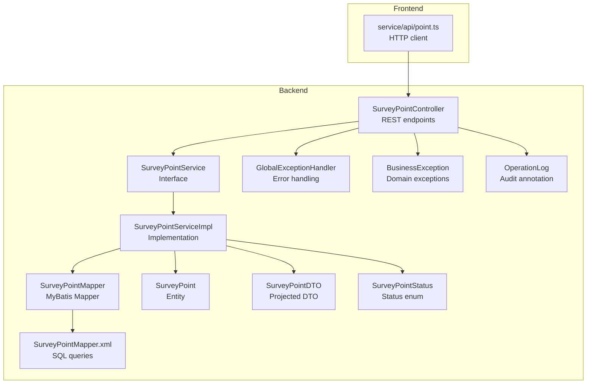
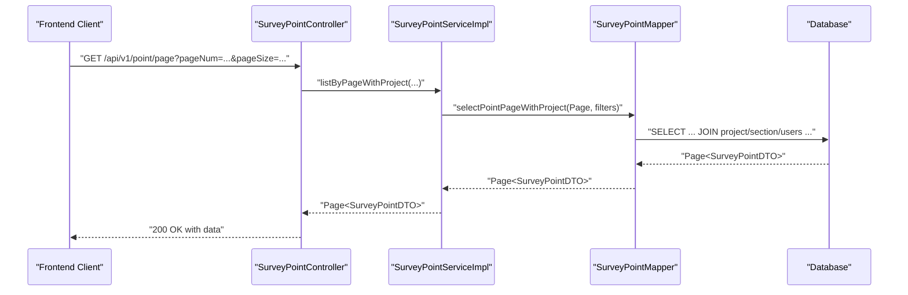
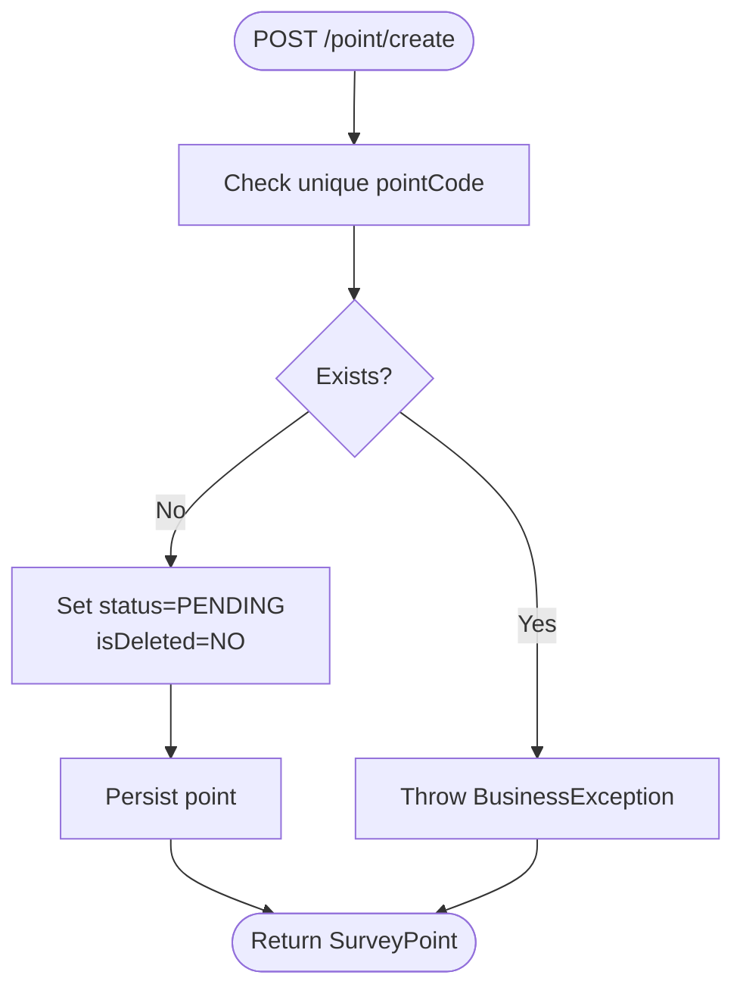
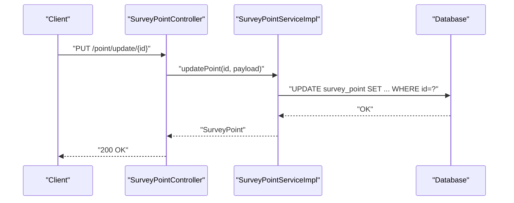
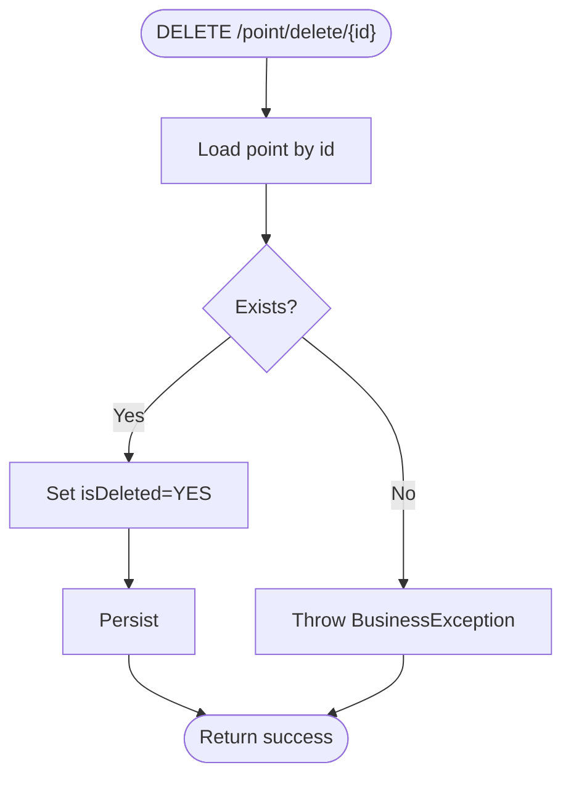
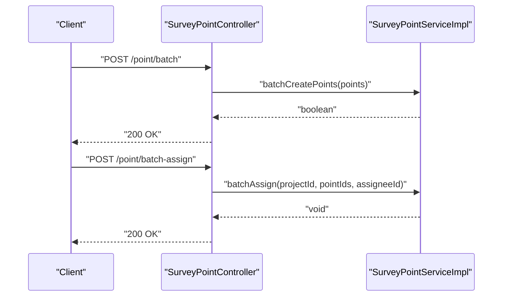
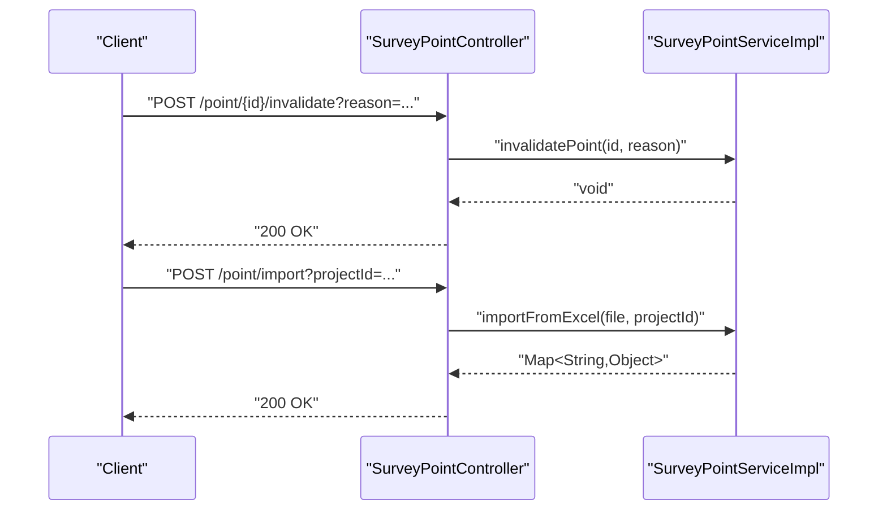
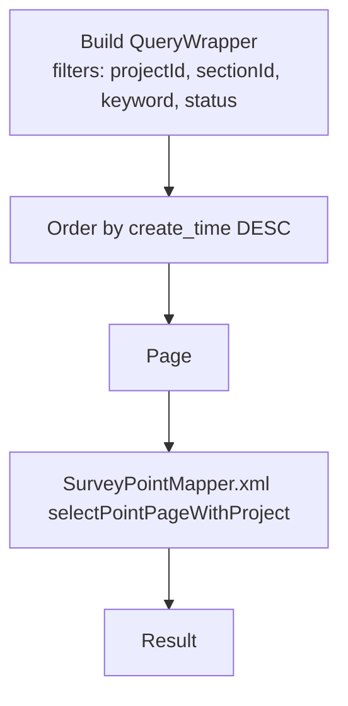
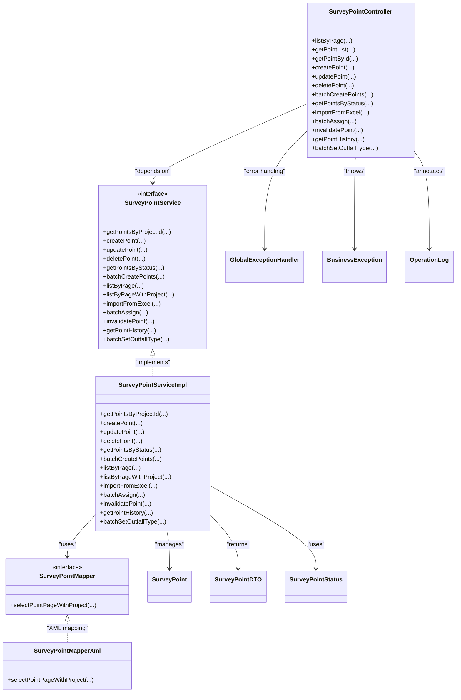

# CRUD Operations & Business Logic

<cite>
**Referenced Files in This Document**
- [SurveyPointController.java](file://admin-backend/src/main/java/com/qhiot/survey/controller/SurveyPointController.java)
- [SurveyPointService.java](file://admin-backend/src/main/java/com/qhiot/survey/service/SurveyPointService.java)
- [SurveyPointServiceImpl.java](file://admin-backend/src/main/java/com/qhiot/survey/service/impl/SurveyPointServiceImpl.java)
- [SurveyPointMapper.java](file://admin-backend/src/main/java/com/qhiot/survey/mapper/SurveyPointMapper.java)
- [SurveyPointMapper.xml](file://admin-backend/src/main/resources/mapper/SurveyPointMapper.xml)
- [SurveyPoint.java](file://admin-backend/src/main/java/com/qhiot/survey/entity/SurveyPoint.java)
- [SurveyPointDTO.java](file://admin-backend/src/main/java/com/qhiot/survey/dto/SurveyPointDTO.java)
- [SurveyPointStatus.java](file://admin-backend/src/main/java/com/qhiot/survey/common/enums/SurveyPointStatus.java)
- [GlobalExceptionHandler.java](file://admin-backend/src/main/java/com/qhiot/survey/common/GlobalExceptionHandler.java)
- [BusinessException.java](file://admin-backend/src/main/java/com/qhiot/survey/common/BusinessException.java)
- [OperationLog.java](file://admin-backend/src/main/java/com/qhiot/survey/common/annotation/OperationLog.java)
- [point.ts](file://admin-web-soybean/src/service/api/point.ts)
</cite>

## Table of Contents
1. [Introduction](#introduction)
2. [Project Structure](#project-structure)
3. [Core Components](#core-components)
4. [Architecture Overview](#architecture-overview)
5. [Detailed Component Analysis](#detailed-component-analysis)
6. [Dependency Analysis](#dependency-analysis)
7. [Performance Considerations](#performance-considerations)
8. [Troubleshooting Guide](#troubleshooting-guide)
9. [Conclusion](#conclusion)

## Introduction
This document provides comprehensive documentation for survey point CRUD operations and business logic. It covers all REST API endpoints for survey point management, including listing, creation, updates, deletion, and administrative functions such as batch assignment, invalidation, and Excel import. It also documents request/response schemas, parameter validation, error handling, pagination and filtering, and integration with projects and user roles. Transaction management, concurrency handling via optimistic locking, and data consistency measures are explained with practical examples and diagrams.

## Project Structure
The survey point feature is implemented in the backend Spring Boot module under the package com.qhiot.survey. The frontend client integrates with the backend via service APIs.

**Diagram sources**
- [SurveyPointController.java:24-142](file://admin-backend/src/main/java/com/qhiot/survey/controller/SurveyPointController.java#L24-L142)
- [SurveyPointService.java:12-78](file://admin-backend/src/main/java/com/qhiot/survey/service/SurveyPointService.java#L12-L78)
- [SurveyPointServiceImpl.java:29-261](file://admin-backend/src/main/java/com/qhiot/survey/service/impl/SurveyPointServiceImpl.java#L29-L261)
- [SurveyPointMapper.java:12-26](file://admin-backend/src/main/java/com/qhiot/survey/mapper/SurveyPointMapper.java#L12-L26)
- [SurveyPointMapper.xml:5-48](file://admin-backend/src/main/resources/mapper/SurveyPointMapper.xml#L5-L48)
- [SurveyPoint.java:17-84](file://admin-backend/src/main/java/com/qhiot/survey/entity/SurveyPoint.java#L17-L84)
- [SurveyPointDTO.java:14-48](file://admin-backend/src/main/java/com/qhiot/survey/dto/SurveyPointDTO.java#L14-L48)
- [SurveyPointStatus.java:8-34](file://admin-backend/src/main/java/com/qhiot/survey/common/enums/SurveyPointStatus.java#L8-L34)
- [GlobalExceptionHandler.java:21-103](file://admin-backend/src/main/java/com/qhiot/survey/common/GlobalExceptionHandler.java#L21-L103)
- [BusinessException.java:8-27](file://admin-backend/src/main/java/com/qhiot/survey/common/BusinessException.java#L8-L27)
- [OperationLog.java:9-39](file://admin-backend/src/main/java/com/qhiot/survey/common/annotation/OperationLog.java#L9-L39)
- [point.ts:1-84](file://admin-web-soybean/src/service/api/point.ts#L1-L84)

**Section sources**
- [SurveyPointController.java:24-142](file://admin-backend/src/main/java/com/qhiot/survey/controller/SurveyPointController.java#L24-L142)
- [SurveyPointService.java:12-78](file://admin-backend/src/main/java/com/qhiot/survey/service/SurveyPointService.java#L12-L78)
- [SurveyPointServiceImpl.java:29-261](file://admin-backend/src/main/java/com/qhiot/survey/service/impl/SurveyPointServiceImpl.java#L29-L261)
- [SurveyPointMapper.java:12-26](file://admin-backend/src/main/java/com/qhiot/survey/mapper/SurveyPointMapper.java#L12-L26)
- [SurveyPointMapper.xml:5-48](file://admin-backend/src/main/resources/mapper/SurveyPointMapper.xml#L5-L48)
- [SurveyPoint.java:17-84](file://admin-backend/src/main/java/com/qhiot/survey/entity/SurveyPoint.java#L17-L84)
- [SurveyPointDTO.java:14-48](file://admin-backend/src/main/java/com/qhiot/survey/dto/SurveyPointDTO.java#L14-L48)
- [SurveyPointStatus.java:8-34](file://admin-backend/src/main/java/com/qhiot/survey/common/enums/SurveyPointStatus.java#L8-L34)
- [GlobalExceptionHandler.java:21-103](file://admin-backend/src/main/java/com/qhiot/survey/common/GlobalExceptionHandler.java#L21-L103)
- [BusinessException.java:8-27](file://admin-backend/src/main/java/com/qhiot/survey/common/BusinessException.java#L8-L27)
- [OperationLog.java:9-39](file://admin-backend/src/main/java/com/qhiot/survey/common/annotation/OperationLog.java#L9-L39)
- [point.ts:1-84](file://admin-web-soybean/src/service/api/point.ts#L1-L84)

## Core Components
- SurveyPointController: Exposes REST endpoints for survey point CRUD and administrative operations.
- SurveyPointService: Defines the business interface for point operations.
- SurveyPointServiceImpl: Implements business logic, transactions, validations, and integrations.
- SurveyPointMapper and SurveyPointMapper.xml: Data access layer with SQL for paginated queries and joins.
- SurveyPoint Entity and DTO: Data models for persistence and projection with project/user joins.
- SurveyPointStatus Enum: Defines lifecycle states for points.
- GlobalExceptionHandler and BusinessException: Centralized error handling and domain exceptions.
- OperationLog Annotation: Audit logging for sensitive operations.

**Section sources**
- [SurveyPointController.java:24-142](file://admin-backend/src/main/java/com/qhiot/survey/controller/SurveyPointController.java#L24-L142)
- [SurveyPointService.java:12-78](file://admin-backend/src/main/java/com/qhiot/survey/service/SurveyPointService.java#L12-L78)
- [SurveyPointServiceImpl.java:29-261](file://admin-backend/src/main/java/com/qhiot/survey/service/impl/SurveyPointServiceImpl.java#L29-L261)
- [SurveyPointMapper.java:12-26](file://admin-backend/src/main/java/com/qhiot/survey/mapper/SurveyPointMapper.java#L12-L26)
- [SurveyPointMapper.xml:5-48](file://admin-backend/src/main/resources/mapper/SurveyPointMapper.xml#L5-L48)
- [SurveyPoint.java:17-84](file://admin-backend/src/main/java/com/qhiot/survey/entity/SurveyPoint.java#L17-L84)
- [SurveyPointDTO.java:14-48](file://admin-backend/src/main/java/com/qhiot/survey/dto/SurveyPointDTO.java#L14-L48)
- [SurveyPointStatus.java:8-34](file://admin-backend/src/main/java/com/qhiot/survey/common/enums/SurveyPointStatus.java#L8-L34)
- [GlobalExceptionHandler.java:21-103](file://admin-backend/src/main/java/com/qhiot/survey/common/GlobalExceptionHandler.java#L21-L103)
- [BusinessException.java:8-27](file://admin-backend/src/main/java/com/qhiot/survey/common/BusinessException.java#L8-L27)
- [OperationLog.java:9-39](file://admin-backend/src/main/java/com/qhiot/survey/common/annotation/OperationLog.java#L9-L39)

## Architecture Overview
The system follows a layered architecture:
- Presentation: REST endpoints in SurveyPointController.
- Application: Business logic in SurveyPointServiceImpl.
- Persistence: MyBatis mapper and XML SQL for queries and projections.
- Domain: Entity and DTO models, enums, and exception/error handling.

**Diagram sources**
- [SurveyPointController.java:30-40](file://admin-backend/src/main/java/com/qhiot/survey/controller/SurveyPointController.java#L30-L40)
- [SurveyPointServiceImpl.java:121-125](file://admin-backend/src/main/java/com/qhiot/survey/service/impl/SurveyPointServiceImpl.java#L121-L125)
- [SurveyPointMapper.xml:5-48](file://admin-backend/src/main/resources/mapper/SurveyPointMapper.xml#L5-L48)

## Detailed Component Analysis

### REST API Endpoints and Contracts
- Base Path: /api/v1/point
- Notes:
  - Pagination defaults are applied server-side.
  - Filtering supports project ID, section ID, keyword, and status.
  - Sorting is applied by creation time descending for paginated lists.

Endpoints:
- GET /point/page
  - Query Params:
    - projectId: Long (optional)
    - sectionId: Long (optional)
    - keyword: String (optional)
    - status: Integer (optional)
    - pageNum: Integer (default 1)
    - pageSize: Integer (default 10)
  - Response: Page<SurveyPointDTO> with projectName, projectCode, sectionName, collectorName, assigneeName
  - Filters: projectId, sectionId, keyword (name/code), status
  - Sorting: create_time DESC
  - Example usage: [fetchGetPointList:4-16](file://admin-web-soybean/src/service/api/point.ts#L4-L16)

- GET /point/list
  - Query Param:
    - projectId: Long (optional)
  - Response: List<SurveyPoint>
  - Behavior: If projectId provided, returns points filtered by project; otherwise all points.

- GET /point/{id}
  - Path Param:
    - id: Long
  - Response: SurveyPoint
  - Behavior: Returns point if exists, otherwise returns error.

- POST /point/create
  - Request Body: SurveyPoint
  - Response: SurveyPoint
  - Behavior: Creates a new point with initial status set to PENDING and isDeleted to NO.

- PUT /point/update/{id}
  - Path Param:
    - id: Long
  - Request Body: SurveyPoint
  - Response: SurveyPoint
  - Behavior: Updates point by ID.

- DELETE /point/delete/{id}
  - Path Param:
    - id: Long
  - Response: Void
  - Behavior: Performs logical deletion by setting isDeleted to YES.

- POST /point/batch
  - Request Body: List<SurveyPoint>
  - Response: Boolean (true on success)
  - Behavior: Batch inserts multiple points.

- GET /point/status/{status}
  - Path Param:
    - status: Integer
  - Response: List<SurveyPoint>
  - Behavior: Returns points filtered by status.

- POST /point/import
  - Form Params:
    - file: MultipartFile (Excel)
    - projectId: Long
  - Response: Map<String,Object> with successCount, failCount, errors
  - Behavior: Imports points from Excel rows into the given project.

- POST /point/batch-assign
  - Form Params:
    - projectId: Long
    - pointIds: List<Long> (JSON body)
    - assigneeId: Long
  - Response: Void
  - Behavior: Assigns multiple points to a collector within a project.

- POST /point/{id}/invalidate
  - Path Param:
    - id: Long
  - Query Param:
    - reason: String
  - Response: Void
  - Behavior: Marks point as INVALIDATED with abnormalTag set to reason.

- GET /point/{id}/history
  - Path Param:
    - id: Long
  - Response: List<Map<String,Object>> representing historical survey results
  - Behavior: Aggregates audit and result statuses per version.

- POST /point/batch-set-outfall-type
  - JSON Body:
    - pointIds: List<Long>
    - outfallType: String
  - Response: Void
  - Behavior: Sets outfallType for multiple points.

**Section sources**
- [SurveyPointController.java:30-141](file://admin-backend/src/main/java/com/qhiot/survey/controller/SurveyPointController.java#L30-L141)
- [SurveyPointServiceImpl.java:97-125](file://admin-backend/src/main/java/com/qhiot/survey/service/impl/SurveyPointServiceImpl.java#L97-L125)
- [SurveyPointMapper.xml:5-48](file://admin-backend/src/main/resources/mapper/SurveyPointMapper.xml#L5-L48)
- [point.ts:4-16](file://admin-web-soybean/src/service/api/point.ts#L4-L16)

### Request/Response Schemas
- SurveyPoint (Entity)
  - Fields: id, pointCode, pointName, projectId, sectionId, outfallType, longitude, latitude, region, assigneeId, collectorId, status, abnormalTag, isDeleted, createTime, updateTime
  - Notes: Uses logical deletion; numeric IDs serialized as strings for JSON safety.

- SurveyPointDTO (Projection)
  - Extends SurveyPoint and adds: projectName, projectCode, sectionName, collectorName, assigneeName
  - Used for paginated listing with joins.

- Import Result (Map<String,Object>)
  - Keys: successCount (Integer), failCount (Integer), errors (List<String>)

- History Record (Map<String,Object>)
  - Keys: versionNo (Integer), status (String), auditStatus (String), auditRemark (String), submitTime (DateTime), auditTime (DateTime)

**Section sources**
- [SurveyPoint.java:17-84](file://admin-backend/src/main/java/com/qhiot/survey/entity/SurveyPoint.java#L17-L84)
- [SurveyPointDTO.java:14-48](file://admin-backend/src/main/java/com/qhiot/survey/dto/SurveyPointDTO.java#L14-L48)
- [SurveyPointServiceImpl.java:127-185](file://admin-backend/src/main/java/com/qhiot/survey/service/impl/SurveyPointServiceImpl.java#L127-L185)
- [SurveyPointServiceImpl.java:211-234](file://admin-backend/src/main/java/com/qhiot/survey/service/impl/SurveyPointServiceImpl.java#L211-L234)

### Parameter Validation and Error Handling
- Validation:
  - Missing required parameters (e.g., missing query param) are handled centrally.
  - Business rules enforced in service layer (e.g., unique pointCode, existence checks).

- Error Handling:
  - GlobalExceptionHandler centralizes:
    - MethodArgumentNotValidException and BindException → BAD_REQUEST
    - MissingServletRequestParameterException → BAD_REQUEST
    - HttpRequestMethodNotSupportedException → 405
    - NoResourceFoundException → NOT_FOUND
    - AccessDeniedException → 403
    - Other exceptions → INTERNAL_ERROR
  - BusinessException carries a code and message for domain errors.

- Audit Logging:
  - OperationLog annotation records module, action, description, and risk level for sensitive endpoints.

**Section sources**
- [GlobalExceptionHandler.java:28-102](file://admin-backend/src/main/java/com/qhiot/survey/common/GlobalExceptionHandler.java#L28-L102)
- [BusinessException.java:8-27](file://admin-backend/src/main/java/com/qhiot/survey/common/BusinessException.java#L8-L27)
- [OperationLog.java:9-39](file://admin-backend/src/main/java/com/qhiot/survey/common/annotation/OperationLog.java#L9-L39)
- [SurveyPointController.java:62-81](file://admin-backend/src/main/java/com/qhiot/survey/controller/SurveyPointController.java#L62-L81)

### Business Rules and Workflows

#### Creation Workflow
- Enforces uniqueness of pointCode.
- Initializes status to PENDING and sets isDeleted to NO.
- Transactional to ensure atomicity.

**Diagram sources**
- [SurveyPointServiceImpl.java:44-58](file://admin-backend/src/main/java/com/qhiot/survey/service/impl/SurveyPointServiceImpl.java#L44-L58)

**Section sources**
- [SurveyPointServiceImpl.java:44-58](file://admin-backend/src/main/java/com/qhiot/survey/service/impl/SurveyPointServiceImpl.java#L44-L58)

#### Update Workflow
- Validates existence by ID.
- Applies updates atomically.

**Diagram sources**
- [SurveyPointController.java:68-73](file://admin-backend/src/main/java/com/qhiot/survey/controller/SurveyPointController.java#L68-L73)
- [SurveyPointServiceImpl.java:60-70](file://admin-backend/src/main/java/com/qhiot/survey/service/impl/SurveyPointServiceImpl.java#L60-L70)

**Section sources**
- [SurveyPointController.java:68-73](file://admin-backend/src/main/java/com/qhiot/survey/controller/SurveyPointController.java#L68-L73)
- [SurveyPointServiceImpl.java:60-70](file://admin-backend/src/main/java/com/qhiot/survey/service/impl/SurveyPointServiceImpl.java#L60-L70)

#### Deletion Workflow
- Logical deletion by toggling isDeleted to YES.

**Diagram sources**
- [SurveyPointController.java:75-81](file://admin-backend/src/main/java/com/qhiot/survey/controller/SurveyPointController.java#L75-L81)
- [SurveyPointServiceImpl.java:72-82](file://admin-backend/src/main/java/com/qhiot/survey/service/impl/SurveyPointServiceImpl.java#L72-L82)

**Section sources**
- [SurveyPointController.java:75-81](file://admin-backend/src/main/java/com/qhiot/survey/controller/SurveyPointController.java#L75-L81)
- [SurveyPointServiceImpl.java:72-82](file://admin-backend/src/main/java/com/qhiot/survey/service/impl/SurveyPointServiceImpl.java#L72-L82)

#### Batch Operations
- Batch Create: Inserts multiple points atomically.
- Batch Assign: Assigns multiple points to a collector within a project.
- Batch Set Outfall Type: Updates outfallType for multiple points.

**Diagram sources**
- [SurveyPointController.java:83-116](file://admin-backend/src/main/java/com/qhiot/survey/controller/SurveyPointController.java#L83-L116)
- [SurveyPointServiceImpl.java:91-95](file://admin-backend/src/main/java/com/qhiot/survey/service/impl/SurveyPointServiceImpl.java#L91-L95)
- [SurveyPointServiceImpl.java:187-197](file://admin-backend/src/main/java/com/qhiot/survey/service/impl/SurveyPointServiceImpl.java#L187-L197)

**Section sources**
- [SurveyPointController.java:83-116](file://admin-backend/src/main/java/com/qhiot/survey/controller/SurveyPointController.java#L83-L116)
- [SurveyPointServiceImpl.java:91-95](file://admin-backend/src/main/java/com/qhiot/survey/service/impl/SurveyPointServiceImpl.java#L91-L95)
- [SurveyPointServiceImpl.java:187-197](file://admin-backend/src/main/java/com/qhiot/survey/service/impl/SurveyPointServiceImpl.java#L187-L197)
- [SurveyPointServiceImpl.java:236-246](file://admin-backend/src/main/java/com/qhiot/survey/service/impl/SurveyPointServiceImpl.java#L236-L246)

#### Administrative Functions
- Invalidate Point: Transitions to INVALIDATED status and sets abnormalTag.
- Import from Excel: Parses rows, validates numeric coordinates, persists batch.
- Get History: Aggregates survey result versions for auditing.

**Diagram sources**
- [SurveyPointController.java:118-125](file://admin-backend/src/main/java/com/qhiot/survey/controller/SurveyPointController.java#L118-L125)
- [SurveyPointController.java:98-105](file://admin-backend/src/main/java/com/qhiot/survey/controller/SurveyPointController.java#L98-L105)
- [SurveyPointServiceImpl.java:199-209](file://admin-backend/src/main/java/com/qhiot/survey/service/impl/SurveyPointServiceImpl.java#L199-L209)
- [SurveyPointServiceImpl.java:127-185](file://admin-backend/src/main/java/com/qhiot/survey/service/impl/SurveyPointServiceImpl.java#L127-L185)

**Section sources**
- [SurveyPointController.java:118-125](file://admin-backend/src/main/java/com/qhiot/survey/controller/SurveyPointController.java#L118-L125)
- [SurveyPointController.java:98-105](file://admin-backend/src/main/java/com/qhiot/survey/controller/SurveyPointController.java#L98-L105)
- [SurveyPointServiceImpl.java:199-209](file://admin-backend/src/main/java/com/qhiot/survey/service/impl/SurveyPointServiceImpl.java#L199-L209)
- [SurveyPointServiceImpl.java:127-185](file://admin-backend/src/main/java/com/qhiot/survey/service/impl/SurveyPointServiceImpl.java#L127-L185)
- [SurveyPointServiceImpl.java:211-234](file://admin-backend/src/main/java/com/qhiot/survey/service/impl/SurveyPointServiceImpl.java#L211-L234)

### Pagination, Filtering, and Sorting
- Pagination:
  - Page<SurveyPointDTO> returned by listByPageWithProject.
  - pageNum and pageSize default applied in controller.
- Filtering:
  - projectId, sectionId, keyword (name/code), status supported.
- Sorting:
  - Default order by create_time DESC.
- Projection:
  - Left joins with project, project_section, and sys_user for names and codes.

**Diagram sources**
- [SurveyPointController.java:30-40](file://admin-backend/src/main/java/com/qhiot/survey/controller/SurveyPointController.java#L30-L40)
- [SurveyPointServiceImpl.java:121-125](file://admin-backend/src/main/java/com/qhiot/survey/service/impl/SurveyPointServiceImpl.java#L121-L125)
- [SurveyPointMapper.xml:5-48](file://admin-backend/src/main/resources/mapper/SurveyPointMapper.xml#L5-L48)

**Section sources**
- [SurveyPointController.java:30-40](file://admin-backend/src/main/java/com/qhiot/survey/controller/SurveyPointController.java#L30-L40)
- [SurveyPointServiceImpl.java:121-125](file://admin-backend/src/main/java/com/qhiot/survey/service/impl/SurveyPointServiceImpl.java#L121-L125)
- [SurveyPointMapper.xml:5-48](file://admin-backend/src/main/resources/mapper/SurveyPointMapper.xml#L5-L48)

### Integration with Projects and User Permissions
- Project Assignment:
  - Points belong to a project (projectId) and optional section (sectionId).
  - Batch assign validates that point belongs to the given project before updating assigneeId.
- User Roles:
  - assigneeId and collectorId fields indicate administrative and field collection roles respectively.
  - Listing projections include usernames via joins for visibility.
- Status Lifecycle:
  - SurveyPointStatus enum defines lifecycle states (PENDING, DRAFT, PENDING_AUDIT, AUDIT_PASSED, REJECTED, ARCHIVED, INVALIDATED).

**Section sources**
- [SurveyPoint.java:33-68](file://admin-backend/src/main/java/com/qhiot/survey/entity/SurveyPoint.java#L33-L68)
- [SurveyPointServiceImpl.java:187-197](file://admin-backend/src/main/java/com/qhiot/survey/service/impl/SurveyPointServiceImpl.java#L187-L197)
- [SurveyPointStatus.java:8-34](file://admin-backend/src/main/java/com/qhiot/survey/common/enums/SurveyPointStatus.java#L8-L34)
- [SurveyPointMapper.xml:23-32](file://admin-backend/src/main/resources/mapper/SurveyPointMapper.xml#L23-L32)

### Concurrency Handling and Transactions
- Transaction Management:
  - @Transactional on createPoint, updatePoint, deletePoint, batchCreatePoints, importFromExcel, batchAssign, invalidatePoint, batchSetOutfallType ensures atomicity.
- Optimistic Locking:
  - No explicit version field observed on SurveyPoint; logical deletion via isDeleted is used instead.
- Isolation:
  - Default isolation level applies; batch operations leverage saveBatch for efficient persistence.

**Section sources**
- [SurveyPointServiceImpl.java:44-58](file://admin-backend/src/main/java/com/qhiot/survey/service/impl/SurveyPointServiceImpl.java#L44-L58)
- [SurveyPointServiceImpl.java:60-70](file://admin-backend/src/main/java/com/qhiot/survey/service/impl/SurveyPointServiceImpl.java#L60-L70)
- [SurveyPointServiceImpl.java:72-82](file://admin-backend/src/main/java/com/qhiot/survey/service/impl/SurveyPointServiceImpl.java#L72-L82)
- [SurveyPointServiceImpl.java:91-95](file://admin-backend/src/main/java/com/qhiot/survey/service/impl/SurveyPointServiceImpl.java#L91-L95)
- [SurveyPointServiceImpl.java:127-185](file://admin-backend/src/main/java/com/qhiot/survey/service/impl/SurveyPointServiceImpl.java#L127-L185)
- [SurveyPointServiceImpl.java:187-197](file://admin-backend/src/main/java/com/qhiot/survey/service/impl/SurveyPointServiceImpl.java#L187-L197)
- [SurveyPointServiceImpl.java:199-209](file://admin-backend/src/main/java/com/qhiot/survey/service/impl/SurveyPointServiceImpl.java#L199-L209)
- [SurveyPointServiceImpl.java:236-246](file://admin-backend/src/main/java/com/qhiot/survey/service/impl/SurveyPointServiceImpl.java#L236-L246)

### Data Consistency Measures
- Unique Constraints:
  - pointCode uniqueness enforced in service layer.
- Logical Deletion:
  - isDeleted flag prevents physical removal while maintaining referential integrity.
- Projection Queries:
  - SQL joins ensure consistent reads of related project/section/user data.
- Audit Trail:
  - OperationLog annotation captures high-risk actions for compliance.

**Section sources**
- [SurveyPointServiceImpl.java:47-53](file://admin-backend/src/main/java/com/qhiot/survey/service/impl/SurveyPointServiceImpl.java#L47-L53)
- [SurveyPoint.java:78-79](file://admin-backend/src/main/java/com/qhiot/survey/entity/SurveyPoint.java#L78-L79)
- [SurveyPointMapper.xml:23-32](file://admin-backend/src/main/resources/mapper/SurveyPointMapper.xml#L23-L32)
- [OperationLog.java:9-39](file://admin-backend/src/main/java/com/qhiot/survey/common/annotation/OperationLog.java#L9-L39)

## Dependency Analysis

**Diagram sources**
- [SurveyPointController.java:24-142](file://admin-backend/src/main/java/com/qhiot/survey/controller/SurveyPointController.java#L24-L142)
- [SurveyPointService.java:12-78](file://admin-backend/src/main/java/com/qhiot/survey/service/SurveyPointService.java#L12-L78)
- [SurveyPointServiceImpl.java:29-261](file://admin-backend/src/main/java/com/qhiot/survey/service/impl/SurveyPointServiceImpl.java#L29-L261)
- [SurveyPointMapper.java:12-26](file://admin-backend/src/main/java/com/qhiot/survey/mapper/SurveyPointMapper.java#L12-L26)
- [SurveyPointMapper.xml:5-48](file://admin-backend/src/main/resources/mapper/SurveyPointMapper.xml#L5-L48)
- [SurveyPoint.java:17-84](file://admin-backend/src/main/java/com/qhiot/survey/entity/SurveyPoint.java#L17-L84)
- [SurveyPointDTO.java:14-48](file://admin-backend/src/main/java/com/qhiot/survey/dto/SurveyPointDTO.java#L14-L48)
- [SurveyPointStatus.java:8-34](file://admin-backend/src/main/java/com/qhiot/survey/common/enums/SurveyPointStatus.java#L8-L34)
- [GlobalExceptionHandler.java:21-103](file://admin-backend/src/main/java/com/qhiot/survey/common/GlobalExceptionHandler.java#L21-L103)
- [BusinessException.java:8-27](file://admin-backend/src/main/java/com/qhiot/survey/common/BusinessException.java#L8-L27)
- [OperationLog.java:9-39](file://admin-backend/src/main/java/com/qhiot/survey/common/annotation/OperationLog.java#L9-L39)

**Section sources**
- [SurveyPointController.java:24-142](file://admin-backend/src/main/java/com/qhiot/survey/controller/SurveyPointController.java#L24-L142)
- [SurveyPointService.java:12-78](file://admin-backend/src/main/java/com/qhiot/survey/service/SurveyPointService.java#L12-L78)
- [SurveyPointServiceImpl.java:29-261](file://admin-backend/src/main/java/com/qhiot/survey/service/impl/SurveyPointServiceImpl.java#L29-L261)
- [SurveyPointMapper.java:12-26](file://admin-backend/src/main/java/com/qhiot/survey/mapper/SurveyPointMapper.java#L12-L26)
- [SurveyPointMapper.xml:5-48](file://admin-backend/src/main/resources/mapper/SurveyPointMapper.xml#L5-L48)
- [SurveyPoint.java:17-84](file://admin-backend/src/main/java/com/qhiot/survey/entity/SurveyPoint.java#L17-L84)
- [SurveyPointDTO.java:14-48](file://admin-backend/src/main/java/com/qhiot/survey/dto/SurveyPointDTO.java#L14-L48)
- [SurveyPointStatus.java:8-34](file://admin-backend/src/main/java/com/qhiot/survey/common/enums/SurveyPointStatus.java#L8-L34)
- [GlobalExceptionHandler.java:21-103](file://admin-backend/src/main/java/com/qhiot/survey/common/GlobalExceptionHandler.java#L21-L103)
- [BusinessException.java:8-27](file://admin-backend/src/main/java/com/qhiot/survey/common/BusinessException.java#L8-L27)
- [OperationLog.java:9-39](file://admin-backend/src/main/java/com/qhiot/survey/common/annotation/OperationLog.java#L9-L39)

## Performance Considerations
- Indexing:
  - Database indexes exist for survey_result and related audit tables, supporting efficient filtering and sorting in audits and related queries.
- Batch Operations:
  - saveBatch used for bulk inserts to reduce round-trips.
- Projection Queries:
  - Single SQL join query returns enriched DTOs to avoid N+1 problems.
- Pagination:
  - Server-side pagination with default page sizes reduces payload sizes.

[No sources needed since this section provides general guidance]

## Troubleshooting Guide
Common issues and resolutions:
- Point Code Already Exists
  - Symptom: 400 error during creation.
  - Cause: Duplicate pointCode detected.
  - Resolution: Use a unique pointCode.

- Point Not Found
  - Symptom: 400 error on update/delete/get.
  - Cause: ID does not exist or logically deleted.
  - Resolution: Verify ID and project membership.

- Missing Parameters
  - Symptom: 400 error for missing query/body params.
  - Cause: Required params not provided.
  - Resolution: Ensure all required params are present.

- Permission Denied
  - Symptom: 403 error.
  - Cause: Insufficient privileges.
  - Resolution: Authenticate with appropriate role.

- Excel Import Failures
  - Symptom: Partial success with errors list.
  - Cause: Malformed rows or invalid numeric cells.
  - Resolution: Validate Excel format and numeric fields.

**Section sources**
- [SurveyPointServiceImpl.java:51-53](file://admin-backend/src/main/java/com/qhiot/survey/service/impl/SurveyPointServiceImpl.java#L51-L53)
- [SurveyPointServiceImpl.java:64-66](file://admin-backend/src/main/java/com/qhiot/survey/service/impl/SurveyPointServiceImpl.java#L64-L66)
- [SurveyPointServiceImpl.java:202-204](file://admin-backend/src/main/java/com/qhiot/survey/service/impl/SurveyPointServiceImpl.java#L202-L204)
- [GlobalExceptionHandler.java:37-65](file://admin-backend/src/main/java/com/qhiot/survey/common/GlobalExceptionHandler.java#L37-L65)
- [GlobalExceptionHandler.java:88-92](file://admin-backend/src/main/java/com/qhiot/survey/common/GlobalExceptionHandler.java#L88-L92)
- [SurveyPointServiceImpl.java:180-182](file://admin-backend/src/main/java/com/qhiot/survey/service/impl/SurveyPointServiceImpl.java#L180-L182)

## Conclusion
The survey point module provides a robust, transactional, and auditable CRUD surface with strong filtering and pagination support. Business rules enforce data integrity, while administrative endpoints streamline bulk operations and integrations. The architecture cleanly separates concerns and leverages MyBatis projections for efficient reads. Adhering to the documented endpoints, schemas, and validation rules ensures reliable operation across concurrent workloads.