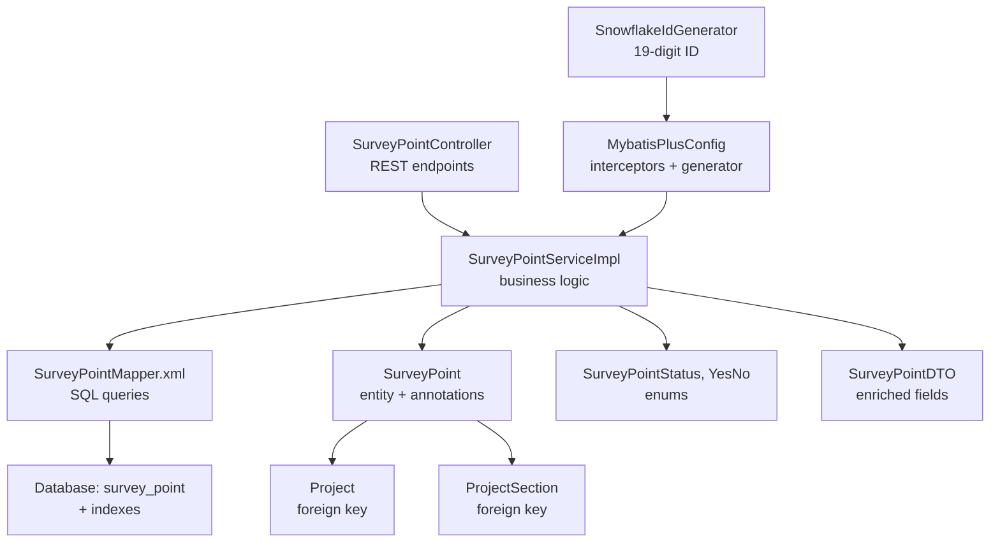
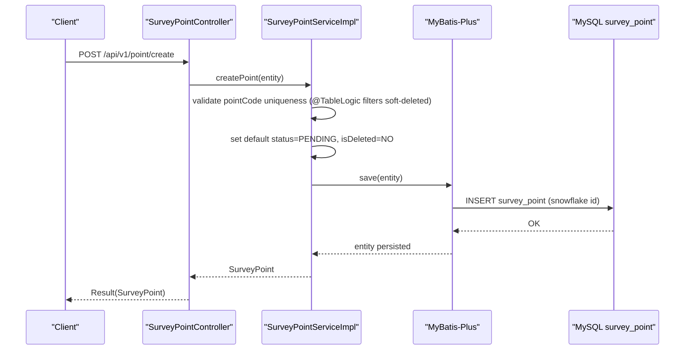
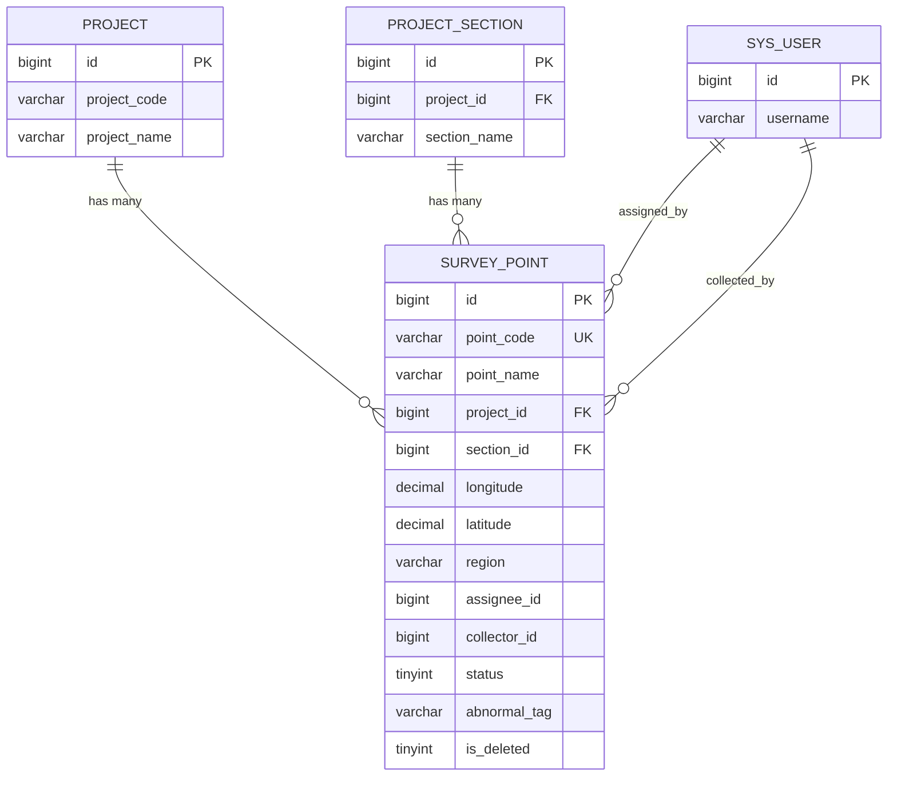
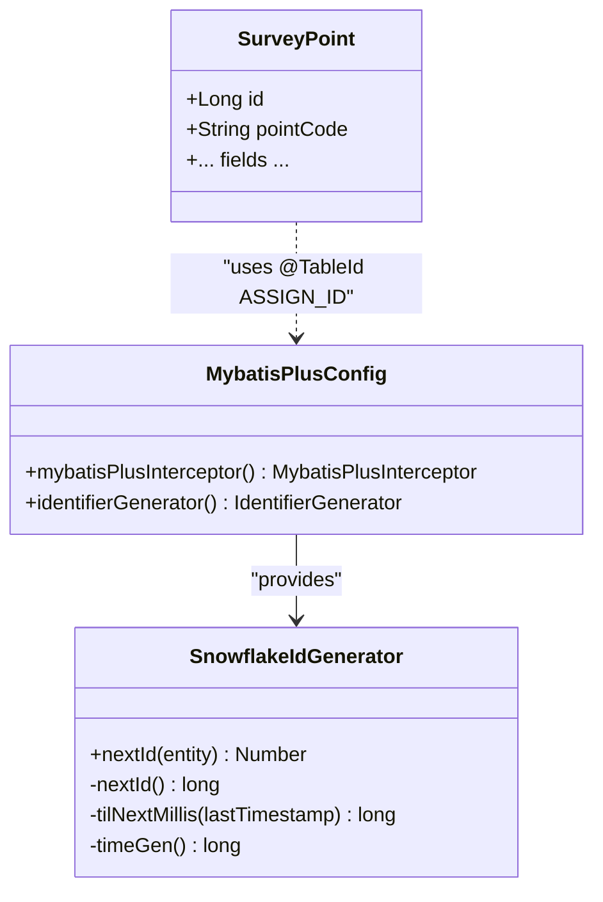
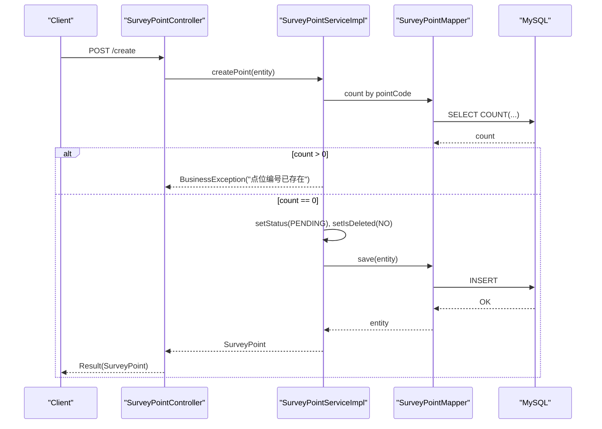
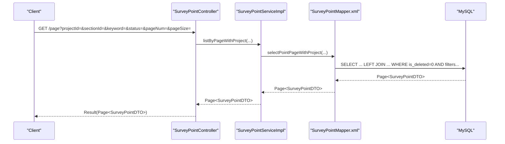
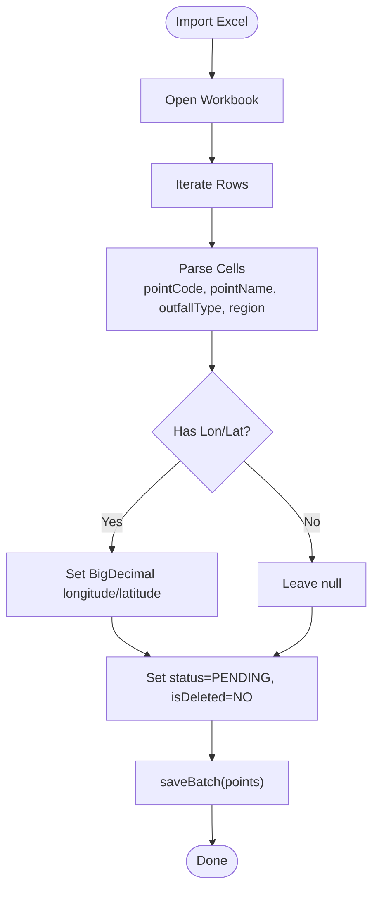
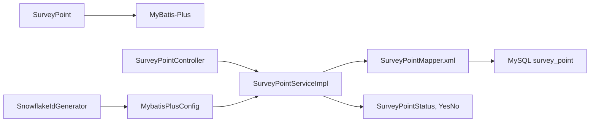

# Entity Modeling & Data Schema

<cite>
**Referenced Files in This Document**
- [SurveyPoint.java](file://admin-backend/src/main/java/com/qhiot/survey/entity/SurveyPoint.java)
- [SurveyPointMapper.xml](file://admin-backend/src/main/resources/mapper/SurveyPointMapper.xml)
- [SurveyPointServiceImpl.java](file://admin-backend/src/main/java/com/qhiot/survey/service/impl/SurveyPointServiceImpl.java)
- [SurveyPointController.java](file://admin-backend/src/main/java/com/qhiot/survey/controller/SurveyPointController.java)
- [SurveyPointDTO.java](file://admin-backend/src/main/java/com/qhiot/survey/dto/SurveyPointDTO.java)
- [SurveyPointStatus.java](file://admin-backend/src/main/java/com/qhiot/survey/common/enums/SurveyPointStatus.java)
- [YesNo.java](file://admin-backend/src/main/java/com/qhiot/survey/common/enums/YesNo.java)
- [Project.java](file://admin-backend/src/main/java/com/qhiot/survey/entity/Project.java)
- [ProjectSection.java](file://admin-backend/src/main/java/com/qhiot/survey/entity/ProjectSection.java)
- [MybatisPlusConfig.java](file://admin-backend/src/main/java/com/qhiot/survey/config/MybatisPlusConfig.java)
- [SnowflakeIdGeneratorConfig.java](file://admin-backend/src/main/java/com/qhiot/survey/config/SnowflakeIdGeneratorConfig.java)
- [01-init.sql](file://admin-backend/init-data/01-init.sql)
- [05-database-indexes.sql](file://admin-backend/init-data/05-database-indexes.sql)
</cite>

## Table of Contents
1. [Introduction](#introduction)
2. [Project Structure](#project-structure)
3. [Core Components](#core-components)
4. [Architecture Overview](#architecture-overview)
5. [Detailed Component Analysis](#detailed-component-analysis)
6. [Dependency Analysis](#dependency-analysis)
7. [Performance Considerations](#performance-considerations)
8. [Troubleshooting Guide](#troubleshooting-guide)
9. [Conclusion](#conclusion)
10. [Appendices](#appendices)

## Introduction
This document provides a comprehensive guide to the SurveyPoint entity model and its database schema. It details the entity structure, data types, constraints, validation rules, primary key strategy using snowflake ID generation, logical deletion mechanism, relationships with Project and Section entities, spatial coordinate handling, field descriptions, enumeration semantics, and practical examples for instantiation, validation, and mapping. It also covers data integrity constraints and referential relationships.

## Project Structure
The SurveyPoint domain spans Java entity and service layers, MyBatis XML mapping, and database initialization scripts. The key files include:
- Entity definition and annotations
- Mapper XML for queries and joins
- Service implementation for CRUD and business logic
- Controller endpoints for API exposure
- DTO for enriched listing
- Enumerations for status and flags
- Project and Section entities for relationships
- MyBatis-Plus configuration for ID generation and interceptors
- Database schema and indexes

**Diagram sources**
- [SurveyPointController.java:1-142](file://admin-backend/src/main/java/com/qhiot/survey/controller/SurveyPointController.java#L1-L142)
- [SurveyPointServiceImpl.java:1-261](file://admin-backend/src/main/java/com/qhiot/survey/service/impl/SurveyPointServiceImpl.java#L1-L261)
- [SurveyPointMapper.xml:1-51](file://admin-backend/src/main/resources/mapper/SurveyPointMapper.xml#L1-L51)
- [SurveyPoint.java:1-84](file://admin-backend/src/main/java/com/qhiot/survey/entity/SurveyPoint.java#L1-L84)
- [SurveyPointDTO.java:1-49](file://admin-backend/src/main/java/com/qhiot/survey/dto/SurveyPointDTO.java#L1-L49)
- [SurveyPointStatus.java:1-34](file://admin-backend/src/main/java/com/qhiot/survey/common/enums/SurveyPointStatus.java#L1-L34)
- [YesNo.java:1-29](file://admin-backend/src/main/java/com/qhiot/survey/common/enums/YesNo.java#L1-L29)
- [Project.java:1-84](file://admin-backend/src/main/java/com/qhiot/survey/entity/Project.java#L1-L84)
- [ProjectSection.java:1-39](file://admin-backend/src/main/java/com/qhiot/survey/entity/ProjectSection.java#L1-L39)
- [MybatisPlusConfig.java:1-42](file://admin-backend/src/main/java/com/qhiot/survey/config/MybatisPlusConfig.java#L1-L42)
- [SnowflakeIdGeneratorConfig.java:1-165](file://admin-backend/src/main/java/com/qhiot/survey/config/SnowflakeIdGeneratorConfig.java#L1-L165)

**Section sources**
- [SurveyPointController.java:1-142](file://admin-backend/src/main/java/com/qhiot/survey/controller/SurveyPointController.java#L1-L142)
- [SurveyPointServiceImpl.java:1-261](file://admin-backend/src/main/java/com/qhiot/survey/service/impl/SurveyPointServiceImpl.java#L1-L261)
- [SurveyPointMapper.xml:1-51](file://admin-backend/src/main/resources/mapper/SurveyPointMapper.xml#L1-L51)
- [SurveyPoint.java:1-84](file://admin-backend/src/main/java/com/qhiot/survey/entity/SurveyPoint.java#L1-L84)
- [SurveyPointDTO.java:1-49](file://admin-backend/src/main/java/com/qhiot/survey/dto/SurveyPointDTO.java#L1-L49)
- [SurveyPointStatus.java:1-34](file://admin-backend/src/main/java/com/qhiot/survey/common/enums/SurveyPointStatus.java#L1-L34)
- [YesNo.java:1-29](file://admin-backend/src/main/java/com/qhiot/survey/common/enums/YesNo.java#L1-L29)
- [Project.java:1-84](file://admin-backend/src/main/java/com/qhiot/survey/entity/Project.java#L1-L84)
- [ProjectSection.java:1-39](file://admin-backend/src/main/java/com/qhiot/survey/entity/ProjectSection.java#L1-L39)
- [MybatisPlusConfig.java:1-42](file://admin-backend/src/main/java/com/qhiot/survey/config/MybatisPlusConfig.java#L1-L42)
- [SnowflakeIdGeneratorConfig.java:1-165](file://admin-backend/src/main/java/com/qhiot/survey/config/SnowflakeIdGeneratorConfig.java#L1-L165)

## Core Components
- SurveyPoint entity: central domain object with ID, metadata, spatial coordinates, foreign keys, status, and logical deletion flag.
- MyBatis-Plus mapping: SQL queries and joins for paginated listing with enriched fields via DTO.
- Service layer: validation, creation defaults, logical deletion, batch operations, and Excel import.
- Controller endpoints: REST APIs for CRUD, filtering, and administrative actions.
- Enumerations: SurveyPointStatus for lifecycle states and YesNo for boolean-like flags.
- Relationships: foreign keys to Project and ProjectSection; optional join to users for assignee/collector.
- ID generation: snowflake-based 19-digit Long IDs via MyBatis-Plus configuration.
- Spatial data: longitude/latitude as DECIMAL(12,8) for precision.

**Section sources**
- [SurveyPoint.java:14-84](file://admin-backend/src/main/java/com/qhiot/survey/entity/SurveyPoint.java#L14-L84)
- [SurveyPointMapper.xml:5-48](file://admin-backend/src/main/resources/mapper/SurveyPointMapper.xml#L5-L48)
- [SurveyPointServiceImpl.java:36-261](file://admin-backend/src/main/java/com/qhiot/survey/service/impl/SurveyPointServiceImpl.java#L36-L261)
- [SurveyPointController.java:30-142](file://admin-backend/src/main/java/com/qhiot/survey/controller/SurveyPointController.java#L30-L142)
- [SurveyPointStatus.java:9-34](file://admin-backend/src/main/java/com/qhiot/survey/common/enums/SurveyPointStatus.java#L9-L34)
- [YesNo.java:9-29](file://admin-backend/src/main/java/com/qhiot/survey/common/enums/YesNo.java#L9-L29)
- [Project.java:13-84](file://admin-backend/src/main/java/com/qhiot/survey/entity/Project.java#L13-L84)
- [ProjectSection.java:10-39](file://admin-backend/src/main/java/com/qhiot/survey/entity/ProjectSection.java#L10-L39)
- [MybatisPlusConfig.java:15-42](file://admin-backend/src/main/java/com/qhiot/survey/config/MybatisPlusConfig.java#L15-L42)
- [SnowflakeIdGeneratorConfig.java:5-165](file://admin-backend/src/main/java/com/qhiot/survey/config/SnowflakeIdGeneratorConfig.java#L5-L165)

## Architecture Overview
The SurveyPoint domain follows a layered architecture:
- Presentation: REST endpoints expose operations.
- Application: Services encapsulate business rules and validations.
- Persistence: MyBatis-Plus maps entities to the database with automatic ID generation and logical deletion.
- Data: MySQL schema defines constraints, indexes, and spatial precision.

**Diagram sources**
- [SurveyPointController.java:62-66](file://admin-backend/src/main/java/com/qhiot/survey/controller/SurveyPointController.java#L62-L66)
- [SurveyPointServiceImpl.java:46-58](file://admin-backend/src/main/java/com/qhiot/survey/service/impl/SurveyPointServiceImpl.java#L46-L58)
- [SurveyPoint.java:22-24](file://admin-backend/src/main/java/com/qhiot/survey/entity/SurveyPoint.java#L22-L24)
- [SurveyPointMapper.xml:33](file://admin-backend/src/main/resources/mapper/SurveyPointMapper.xml#L33)

## Detailed Component Analysis

### SurveyPoint Entity Model
- Identity and serialization: Long id with ToStringSerializer for JSON safety.
- Metadata: pointCode (unique), pointName, outfallType, region, abnormalTag.
- Spatial coordinates: longitude and latitude as BigDecimal with DECIMAL(12,8) precision.
- Foreign keys: projectId (Long), sectionId (Long).
- Personnel: assigneeId (Long), collectorId (Long).
- Status: Integer mapped to SurveyPointStatus enum values.
- Lifecycle: isDeleted (Integer) with logical deletion semantics.
- Timestamps: createTime, updateTime managed by DB triggers.

Field-level descriptions:
- pointCode: Unique identifier for the point; validated for uniqueness during creation.
- pointName: Required human-readable name.
- outfallType: Descriptive type of discharge outlet.
- region: Administrative area.
- abnormalTag: Optional tag for anomaly classification.
- status: Lifecycle state (pending, draft, pending audit, passed, rejected, archived, invalidated).
- isDeleted: Logical deletion flag (0 not deleted, 1 deleted).

Primary key strategy:
- Snowflake ID generation via MyBatis-Plus ASSIGN_ID strategy, configured globally.

Logical deletion:
- @TableLogic marks isDeleted for automatic filtering in queries.

Spatial precision:
- DECIMAL(12,8) ensures ~0.1mm accuracy at equator, suitable for GIS applications.

Validation rules:
- pointCode uniqueness enforced in service layer.
- pointName mandatory per DB schema.
- longitude/latitude optional; when provided, parsed from Excel import.

Constraints and referential relationships:
- projectId references project.id.
- sectionId references project_section.id.
- assigneeId/collectorId reference sys_user.id (via joins in mapper).

**Section sources**
- [SurveyPoint.java:14-84](file://admin-backend/src/main/java/com/qhiot/survey/entity/SurveyPoint.java#L14-L84)
- [01-init.sql:100-122](file://admin-backend/init-data/01-init.sql#L100-L122)
- [SurveyPointMapper.xml:28-33](file://admin-backend/src/main/resources/mapper/SurveyPointMapper.xml#L28-L33)
- [SurveyPointServiceImpl.java:46-58](file://admin-backend/src/main/java/com/qhiot/survey/service/impl/SurveyPointServiceImpl.java#L46-L58)

### Database Schema
- Table: survey_point
- Columns and types:
  - id: BIGINT PRIMARY KEY AUTO_INCREMENT (managed by snowflake ID generator)
  - point_code: VARCHAR(50) UNIQUE
  - point_name: VARCHAR(100) NOT NULL
  - project_id: BIGINT NOT NULL
  - section_id: BIGINT
  - outfall_type: VARCHAR(50)
  - longitude: DECIMAL(12,8)
  - latitude: DECIMAL(12,8)
  - region: VARCHAR(100)
  - assignee_id: BIGINT
  - collector_id: BIGINT
  - status: TINYINT DEFAULT 0
  - abnormal_tag: VARCHAR(200)
  - is_deleted: TINYINT DEFAULT 0
  - create_time: DATETIME DEFAULT CURRENT_TIMESTAMP
  - update_time: DATETIME DEFAULT CURRENT_TIMESTAMP ON UPDATE CURRENT_TIMESTAMP
- Indexes:
  - idx_project (project_id)
  - idx_status (status)
  - idx_collector (collector_id)
  - idx_outfall_type (outfall_type)
  - Additional composite and selective indexes recommended by migration script

**Section sources**
- [01-init.sql:100-122](file://admin-backend/init-data/01-init.sql#L100-L122)
- [05-database-indexes.sql:75-81](file://admin-backend/init-data/05-database-indexes.sql#L75-L81)

### Relationship Mappings
- One-to-One/Many with Project via projectId.
- One-to-One/Many with ProjectSection via sectionId.
- Optional joins to sys_user for assigneeName and collectorName in DTO projection.

**Diagram sources**
- [Project.java:21-23](file://admin-backend/src/main/java/com/qhiot/survey/entity/Project.java#L21-L23)
- [ProjectSection.java:18-19](file://admin-backend/src/main/java/com/qhiot/survey/entity/ProjectSection.java#L18-L19)
- [SurveyPoint.java:33-39](file://admin-backend/src/main/java/com/qhiot/survey/entity/SurveyPoint.java#L33-L39)
- [SurveyPointMapper.xml:28-33](file://admin-backend/src/main/resources/mapper/SurveyPointMapper.xml#L28-L33)

### Spatial Data Handling
- Precision: DECIMAL(12,8) supports up to 8 decimal places for longitude/latitude.
- Accuracy: sufficient for parcel-level precision in most regions.
- Import: Excel parsing converts numeric cells to BigDecimal for coordinates.

**Section sources**
- [01-init.sql:108-109](file://admin-backend/init-data/01-init.sql#L108-L109)
- [SurveyPointServiceImpl.java:152-160](file://admin-backend/src/main/java/com/qhiot/survey/service/impl/SurveyPointServiceImpl.java#L152-L160)

### Enumeration Values for Status Codes
- Pending: 0
- Draft: 1
- Pending Audit: 2
- Audit Passed: 3
- Rejected: 4
- Archived: 5
- Invalidated: 6

Usage:
- Creation sets status to Pending.
- Invalidating a point sets status to Invalidated and records reason in abnormalTag.

**Section sources**
- [SurveyPointStatus.java:9-16](file://admin-backend/src/main/java/com/qhiot/survey/common/enums/SurveyPointStatus.java#L9-L16)
- [SurveyPointServiceImpl.java:54](file://admin-backend/src/main/java/com/qhiot/survey/service/impl/SurveyPointServiceImpl.java#L54)
- [SurveyPointServiceImpl.java:206-208](file://admin-backend/src/main/java/com/qhiot/survey/service/impl/SurveyPointServiceImpl.java#L206-L208)

### Field Descriptions
- pointCode: Unique identifier; validated for duplicates.
- pointName: Required; searchable in listings.
- outfallType: Free-text descriptor; indexed for filtering.
- region: Administrative area; useful for grouping.
- abnormalTag: Optional anomaly label; supports ad-hoc categorization.

**Section sources**
- [SurveyPoint.java:26-73](file://admin-backend/src/main/java/com/qhiot/survey/entity/SurveyPoint.java#L26-L73)
- [SurveyPointMapper.xml:40-43](file://admin-backend/src/main/resources/mapper/SurveyPointMapper.xml#L40-L43)

### Primary Key Strategy and Snowflake ID Generation
- Strategy: @TableId(type = IdType.ASSIGN_ID) with a custom IdentifierGenerator.
- Generator: SnowflakeIdGenerator produces 19-digit Long IDs with embedded timestamp, machine/data-center, and sequence.
- Configuration: MybatisPlusConfig registers the generator globally.

**Diagram sources**
- [MybatisPlusConfig.java:15-42](file://admin-backend/src/main/java/com/qhiot/survey/config/MybatisPlusConfig.java#L15-L42)
- [SnowflakeIdGeneratorConfig.java:18-165](file://admin-backend/src/main/java/com/qhiot/survey/config/SnowflakeIdGeneratorConfig.java#L18-L165)
- [SurveyPoint.java:22-24](file://admin-backend/src/main/java/com/qhiot/survey/entity/SurveyPoint.java#L22-L24)

**Section sources**
- [SurveyPoint.java:22-24](file://admin-backend/src/main/java/com/qhiot/survey/entity/SurveyPoint.java#L22-L24)
- [MybatisPlusConfig.java:33-40](file://admin-backend/src/main/java/com/qhiot/survey/config/MybatisPlusConfig.java#L33-L40)
- [SnowflakeIdGeneratorConfig.java:18-165](file://admin-backend/src/main/java/com/qhiot/survey/config/SnowflakeIdGeneratorConfig.java#L18-L165)

### Logical Deletion Mechanism
- Annotation: @TableLogic marks isDeleted for automatic filtering.
- Behavior: Queries exclude rows where isDeleted = 1; deletion sets flag instead of removing rows.
- Service usage: deletePoint toggles isDeleted to YES.

**Section sources**
- [SurveyPoint.java:75-79](file://admin-backend/src/main/java/com/qhiot/survey/entity/SurveyPoint.java#L75-L79)
- [SurveyPointMapper.xml:33](file://admin-backend/src/main/resources/mapper/SurveyPointMapper.xml#L33)
- [SurveyPointServiceImpl.java:74-82](file://admin-backend/src/main/java/com/qhiot/survey/service/impl/SurveyPointServiceImpl.java#L74-L82)
- [YesNo.java:9-11](file://admin-backend/src/main/java/com/qhiot/survey/common/enums/YesNo.java#L9-L11)

### API Workflows and Examples

#### Example: Creating a SurveyPoint
- Steps:
  - Controller receives SurveyPoint payload.
  - Service validates uniqueness of pointCode.
  - Sets default status to Pending and isDeleted to No.
  - Persists via MyBatis-Plus.
- Validation:
  - Duplicate pointCode throws business exception.
  - pointName is required by DB schema.

**Diagram sources**
- [SurveyPointController.java:62-66](file://admin-backend/src/main/java/com/qhiot/survey/controller/SurveyPointController.java#L62-L66)
- [SurveyPointServiceImpl.java:46-58](file://admin-backend/src/main/java/com/qhiot/survey/service/impl/SurveyPointServiceImpl.java#L46-L58)
- [SurveyPointMapper.xml:33](file://admin-backend/src/main/resources/mapper/SurveyPointMapper.xml#L33)

#### Example: Listing with Enriched Fields
- Mapper performs LEFT JOINs to project, project_section, and sys_user to populate projectName, sectionName, collectorName, and assigneeName.
- Filters include projectId, sectionId, keyword, and status; orders by create_time DESC.

**Diagram sources**
- [SurveyPointController.java:30-40](file://admin-backend/src/main/java/com/qhiot/survey/controller/SurveyPointController.java#L30-L40)
- [SurveyPointServiceImpl.java:122-125](file://admin-backend/src/main/java/com/qhiot/survey/service/impl/SurveyPointServiceImpl.java#L122-L125)
- [SurveyPointMapper.xml:5-48](file://admin-backend/src/main/resources/mapper/SurveyPointMapper.xml#L5-L48)

#### Example: Excel Import
- Reads first sheet; parses pointCode, pointName, outfallType, region, and optional longitude/latitude.
- Assigns default status and isDeleted; persists in batch.

**Diagram sources**
- [SurveyPointServiceImpl.java:129-185](file://admin-backend/src/main/java/com/qhiot/survey/service/impl/SurveyPointServiceImpl.java#L129-L185)

## Dependency Analysis
- Entities depend on MyBatis-Plus annotations for mapping and ID generation.
- Service depends on Mapper for persistence and on enums for state management.
- Mapper depends on DB schema and indexes for efficient queries.
- Controller depends on Service for orchestration.

**Diagram sources**
- [SurveyPoint.java:17-24](file://admin-backend/src/main/java/com/qhiot/survey/entity/SurveyPoint.java#L17-L24)
- [SurveyPointServiceImpl.java:10-14](file://admin-backend/src/main/java/com/qhiot/survey/service/impl/SurveyPointServiceImpl.java#L10-L14)
- [SurveyPointMapper.xml:3-4](file://admin-backend/src/main/resources/mapper/SurveyPointMapper.xml#L3-L4)
- [SurveyPointController.java:25-28](file://admin-backend/src/main/java/com/qhiot/survey/controller/SurveyPointController.java#L25-L28)
- [MybatisPlusConfig.java:33-40](file://admin-backend/src/main/java/com/qhiot/survey/config/MybatisPlusConfig.java#L33-L40)
- [SnowflakeIdGeneratorConfig.java:18-165](file://admin-backend/src/main/java/com/qhiot/survey/config/SnowflakeIdGeneratorConfig.java#L18-L165)

**Section sources**
- [SurveyPoint.java:17-24](file://admin-backend/src/main/java/com/qhiot/survey/entity/SurveyPoint.java#L17-L24)
- [SurveyPointServiceImpl.java:10-14](file://admin-backend/src/main/java/com/qhiot/survey/service/impl/SurveyPointServiceImpl.java#L10-L14)
- [SurveyPointMapper.xml:3-4](file://admin-backend/src/main/resources/mapper/SurveyPointMapper.xml#L3-L4)
- [SurveyPointController.java:25-28](file://admin-backend/src/main/java/com/qhiot/survey/controller/SurveyPointController.java#L25-L28)
- [MybatisPlusConfig.java:33-40](file://admin-backend/src/main/java/com/qhiot/survey/config/MybatisPlusConfig.java#L33-L40)
- [SnowflakeIdGeneratorConfig.java:18-165](file://admin-backend/src/main/java/com/qhiot/survey/config/SnowflakeIdGeneratorConfig.java#L18-L165)

## Performance Considerations
- Indexes:
  - Existing: idx_project, idx_status, idx_collector, idx_outfall_type.
  - Recommended: composite (project_id, status), assignee_id, outfall_type, create_time.
- Pagination:
  - MyBatis-Plus PaginationInnerInterceptor configured with max limit.
- Spatial queries:
  - Consider adding spatial indexes if geospatial predicates are introduced.

**Section sources**
- [01-init.sql:118-121](file://admin-backend/init-data/01-init.sql#L118-L121)
- [05-database-indexes.sql:75-81](file://admin-backend/init-data/05-database-indexes.sql#L75-L81)
- [MybatisPlusConfig.java:22-25](file://admin-backend/src/main/java/com/qhiot/survey/config/MybatisPlusConfig.java#L22-L25)

## Troubleshooting Guide
- Duplicate pointCode:
  - Symptom: Business exception during creation.
  - Resolution: Ensure unique pointCode; consider generating from a controlled sequence.
- Missing pointName:
  - Symptom: DB constraint violation.
  - Resolution: Provide pointName; it is required by schema.
- Unexpected soft-deleted records:
  - Symptom: Queries return empty despite existing rows.
  - Cause: isDeleted=1; MyBatis-Plus @TableLogic filters them.
  - Resolution: Un-delete or adjust query scope.
- Coordinate parsing failures:
  - Symptom: Import errors for longitude/latitude.
  - Resolution: Ensure numeric values; service handles BigDecimal conversion.

**Section sources**
- [SurveyPointServiceImpl.java:51-53](file://admin-backend/src/main/java/com/qhiot/survey/service/impl/SurveyPointServiceImpl.java#L51-L53)
- [01-init.sql:104](file://admin-backend/init-data/01-init.sql#L104)
- [SurveyPointMapper.xml:33](file://admin-backend/src/main/resources/mapper/SurveyPointMapper.xml#L33)
- [SurveyPointServiceImpl.java:152-160](file://admin-backend/src/main/java/com/qhiot/survey/service/impl/SurveyPointServiceImpl.java#L152-L160)

## Conclusion
The SurveyPoint entity model integrates robust ID generation, logical deletion, precise spatial handling, and clear lifecycle semantics. Its relationships with Project and Section enable structured project management, while the MyBatis-Plus configuration and database schema support scalable, maintainable persistence. Proper indexing and validation further enhance reliability and performance.

## Appendices

### Appendix A: Entity Field Reference
- id: Long, generated by snowflake ID generator.
- pointCode: String, unique.
- pointName: String, required.
- projectId: Long, foreign key to Project.
- sectionId: Long, foreign key to ProjectSection.
- outfallType: String.
- longitude: BigDecimal(DECIMAL 12,8).
- latitude: BigDecimal(DECIMAL 12,8).
- region: String.
- assigneeId: Long.
- collectorId: Long.
- status: Integer, mapped to SurveyPointStatus.
- abnormalTag: String.
- isDeleted: Integer, logical deletion flag.
- createTime/updateTime: Timestamps.

**Section sources**
- [SurveyPoint.java:22-84](file://admin-backend/src/main/java/com/qhiot/survey/entity/SurveyPoint.java#L22-L84)
- [01-init.sql:100-122](file://admin-backend/init-data/01-init.sql#L100-L122)

### Appendix B: API Endpoints for SurveyPoint
- GET /api/v1/point/page: Paginated list with filters and enriched fields.
- GET /api/v1/point/list: Optional filtered list by projectId.
- GET /api/v1/point/{id}: Retrieve by ID.
- POST /api/v1/point/create: Create a point with defaults.
- PUT /api/v1/point/update/{id}: Update point.
- DELETE /api/v1/point/delete/{id}: Soft-delete point.
- POST /api/v1/point/batch: Batch create.
- GET /api/v1/point/status/{status}: Filter by status.
- POST /api/v1/point/import: Import from Excel.
- POST /api/v1/point/batch-assign: Batch assign collectors.
- POST /api/v1/point/{id}/invalidate: Mark as invalidated.
- GET /api/v1/point/{id}/history: Historical audit trail.

**Section sources**
- [SurveyPointController.java:30-142](file://admin-backend/src/main/java/com/qhiot/survey/controller/SurveyPointController.java#L30-L142)