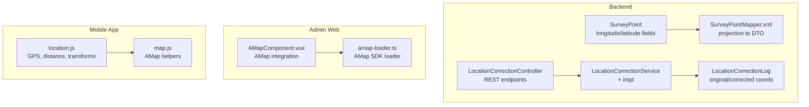
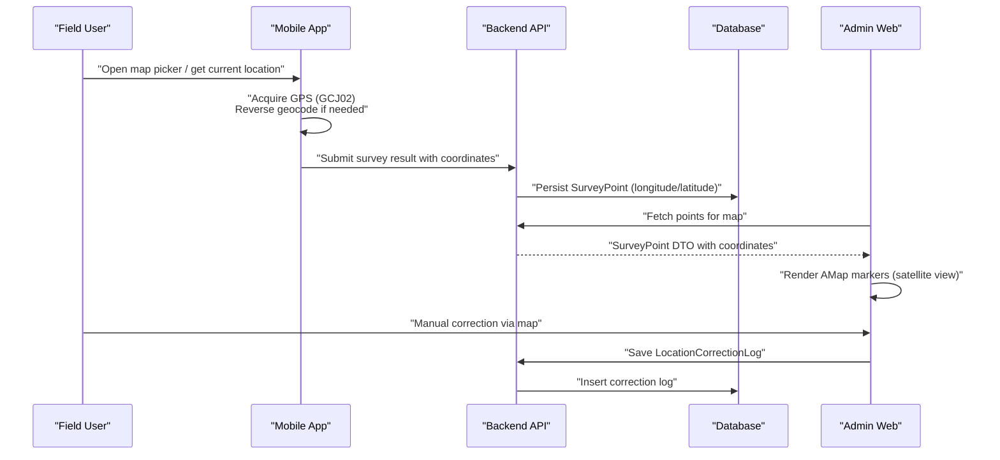
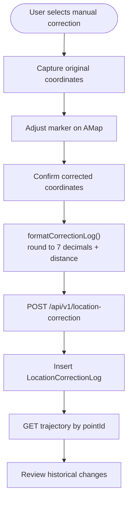
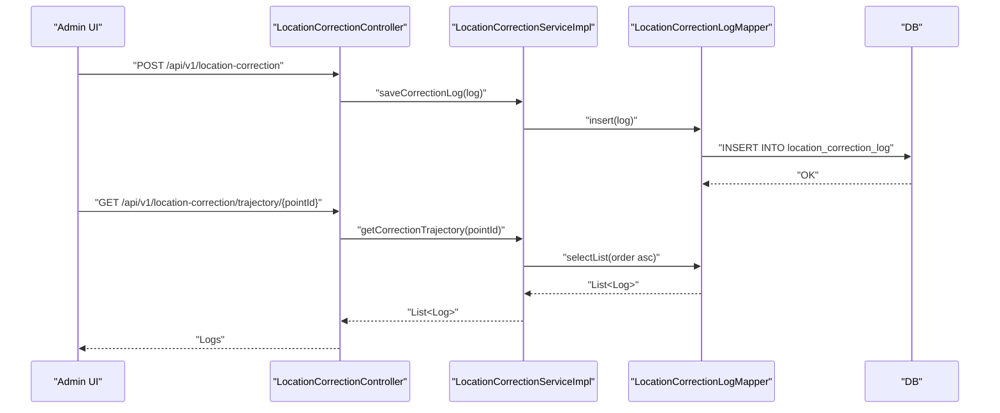
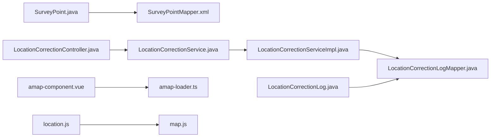

# GPS Coordinates & Mapping Integration

<cite>
**Referenced Files in This Document**
- [SurveyPoint.java](file://admin-backend/src/main/java/com/qhiot/survey/entity/SurveyPoint.java)
- [SurveyPointMapper.xml](file://admin-backend/src/main/resources/mapper/SurveyPointMapper.xml)
- [LocationCorrectionController.java](file://admin-backend/src/main/java/com/qhiot/survey/controller/LocationCorrectionController.java)
- [LocationCorrectionService.java](file://admin-backend/src/main/java/com/qhiot/survey/service/LocationCorrectionService.java)
- [LocationCorrectionServiceImpl.java](file://admin-backend/src/main/java/com/qhiot/survey/service/impl/LocationCorrectionServiceImpl.java)
- [LocationCorrectionLog.java](file://admin-backend/src/main/java/com/qhiot/survey/entity/LocationCorrectionLog.java)
- [LocationCorrectionLogMapper.java](file://admin-backend/src/main/java/com/qhiot/survey/mapper/LocationCorrectionLogMapper.java)
- [OfflineDataSyncServiceImpl.java](file://admin-backend/src/main/java/com/qhiot/survey/service/impl/OfflineDataSyncServiceImpl.java)
- [amap-component.vue](file://admin-web-soybean/src/components/custom/amap-component.vue)
- [amap-loader.ts](file://admin-web-soybean/src/utils/amap-loader.ts)
- [map.js](file://mobile-app/src/utils/map.js)
- [location.js](file://mobile-app/src/utils/location.js)
</cite>

## Table of Contents
1. [Introduction](#introduction)
2. [Project Structure](#project-structure)
3. [Core Components](#core-components)
4. [Architecture Overview](#architecture-overview)
5. [Detailed Component Analysis](#detailed-component-analysis)
6. [Dependency Analysis](#dependency-analysis)
7. [Performance Considerations](#performance-considerations)
8. [Troubleshooting Guide](#troubleshooting-guide)
9. [Conclusion](#conclusion)

## Introduction
This document explains how GPS coordinates are handled and integrated with mapping services across the backend, admin web, and mobile app. It covers coordinate precision and decimal limits, automatic validation and verification, manual correction workflows, integration with Google Maps API, coordinate conversions, distance calculations, proximity searches, coordinate system transformations, WGS84 compliance, correction logging and history, and troubleshooting for GPS and mapping connectivity issues.

## Project Structure
The coordinate and mapping pipeline spans three layers:
- Backend persistence and APIs for survey points and location correction logs
- Admin web mapping component integrating with AMap (高德地图)
- Mobile app utilities for GPS acquisition, coordinate transforms, distance/proximity checks, and AMap selection

**Diagram sources**
- [SurveyPoint.java:46-48](file://admin-backend/src/main/java/com/qhiot/survey/entity/SurveyPoint.java#L46-L48)
- [SurveyPointMapper.xml:6-48](file://admin-backend/src/main/resources/mapper/SurveyPointMapper.xml#L6-L48)
- [LocationCorrectionController.java:27-48](file://admin-backend/src/main/java/com/qhiot/survey/controller/LocationCorrectionController.java#L27-L48)
- [LocationCorrectionServiceImpl.java:23-47](file://admin-backend/src/main/java/com/qhiot/survey/service/impl/LocationCorrectionServiceImpl.java#L23-L47)
- [LocationCorrectionLog.java:26-32](file://admin-backend/src/main/java/com/qhiot/survey/entity/LocationCorrectionLog.java#L26-L32)
- [amap-component.vue:86-164](file://admin-web-soybean/src/components/custom/amap-component.vue#L86-L164)
- [amap-loader.ts:55-102](file://admin-web-soybean/src/utils/amap-loader.ts#L55-L102)
- [location.js:144-164](file://mobile-app/src/utils/location.js#L144-L164)
- [map.js:23-38](file://mobile-app/src/utils/map.js#L23-L38)

**Section sources**
- [SurveyPoint.java:14-84](file://admin-backend/src/main/java/com/qhiot/survey/entity/SurveyPoint.java#L14-L84)
- [SurveyPointMapper.xml:5-51](file://admin-backend/src/main/resources/mapper/SurveyPointMapper.xml#L5-L51)
- [LocationCorrectionController.java:16-49](file://admin-backend/src/main/java/com/qhiot/survey/controller/LocationCorrectionController.java#L16-L49)
- [LocationCorrectionServiceImpl.java:14-48](file://admin-backend/src/main/java/com/qhiot/survey/service/impl/LocationCorrectionServiceImpl.java#L14-L48)
- [LocationCorrectionLog.java:11-37](file://admin-backend/src/main/java/com/qhiot/survey/entity/LocationCorrectionLog.java#L11-L37)
- [amap-component.vue:1-388](file://admin-web-soybean/src/components/custom/amap-component.vue#L1-L388)
- [amap-loader.ts:55-102](file://admin-web-soybean/src/utils/amap-loader.ts#L55-L102)
- [location.js:1-357](file://mobile-app/src/utils/location.js#L1-L357)
- [map.js:1-214](file://mobile-app/src/utils/map.js#L1-L214)

## Core Components
- SurveyPoint entity defines longitude and latitude as precise numeric fields suitable for geographic computations.
- LocationCorrectionLog persists original and corrected coordinates along with user and timestamp for auditability.
- LocationCorrectionController exposes REST endpoints to list correction logs, fetch trajectories, and save logs.
- AMap integration in the admin web renders points, supports clustering, and emits map events.
- Mobile app utilities provide GPS acquisition, reverse geocoding, distance calculation, proximity checks, and coordinate transforms.

Key precision and decimal handling:
- Frontend formatting consistently rounds coordinates to six or seven decimals for display and logging.
- Distance calculations use the spherical law of cosines with Earth radius in meters.

Coordinate systems:
- Mobile app uses GCJ02 internally for device location and provides WGS84 to GCJ02 conversion.
- Backend stores coordinates as-is; mapping displays use AMap’s internal coordinate system.

**Section sources**
- [SurveyPoint.java:46-48](file://admin-backend/src/main/java/com/qhiot/survey/entity/SurveyPoint.java#L46-L48)
- [LocationCorrectionLog.java:26-32](file://admin-backend/src/main/java/com/qhiot/survey/entity/LocationCorrectionLog.java#L26-L32)
- [LocationCorrectionController.java:27-48](file://admin-backend/src/main/java/com/qhiot/survey/controller/LocationCorrectionController.java#L27-L48)
- [amap-component.vue:248-252](file://admin-web-soybean/src/components/custom/amap-component.vue#L248-L252)
- [location.js:332-337](file://mobile-app/src/utils/location.js#L332-L337)
- [location.js:256-259](file://mobile-app/src/utils/location.js#L256-L259)
- [location.js:206-221](file://mobile-app/src/utils/location.js#L206-L221)
- [location.js:272-294](file://mobile-app/src/utils/location.js#L272-L294)

## Architecture Overview
End-to-end flow from GPS capture to map display and correction logging:

**Diagram sources**
- [location.js:144-164](file://mobile-app/src/utils/location.js#L144-L164)
- [location.js:92-138](file://mobile-app/src/utils/location.js#L92-L138)
- [SurveyPointMapper.xml:6-48](file://admin-backend/src/main/resources/mapper/SurveyPointMapper.xml#L6-L48)
- [amap-component.vue:108-146](file://admin-web-soybean/src/components/custom/amap-component.vue#L108-L146)
- [LocationCorrectionController.java:42-48](file://admin-backend/src/main/java/com/qhiot/survey/controller/LocationCorrectionController.java#L42-L48)
- [LocationCorrectionServiceImpl.java:43-47](file://admin-backend/src/main/java/com/qhiot/survey/service/impl/LocationCorrectionServiceImpl.java#L43-L47)

## Detailed Component Analysis

### Coordinate Precision and Decimal Place Limits
- Backend fields:
  - longitude and latitude are stored as precise numeric types suitable for geographic calculations.
- Frontend display and logging:
  - Coordinates are formatted to six decimals for display.
  - Correction logs round to seven decimals for reproducibility and auditability.
- Distance calculations:
  - Uses a numerically stable spherical formula with Earth radius in meters, returning rounded meter distances.

Implications:
- Six decimals yield ~0.11 m precision at equator; seven decimals refine to ~0.01 m.
- Logging at seven decimals ensures deterministic comparisons and reduces noise in proximity checks.

**Section sources**
- [SurveyPoint.java:46-48](file://admin-backend/src/main/java/com/qhiot/survey/entity/SurveyPoint.java#L46-L48)
- [amap-component.vue:248-249](file://admin-web-soybean/src/components/custom/amap-component.vue#L248-L249)
- [location.js:332-337](file://mobile-app/src/utils/location.js#L332-L337)
- [location.js:256-259](file://mobile-app/src/utils/location.js#L256-L259)
- [location.js:206-221](file://mobile-app/src/utils/location.js#L206-L221)

### Automatic Validation and Verification
- Proximity thresholding:
  - isInRange compares current vs target coordinates using calculated distance; thresholds are configurable.
- Position status:
  - getLocationStatus maps distance buckets to status messages and colors for quick visual assessment.
- Reverse geocoding:
  - reverseGeocode enriches coordinates with administrative/address details for contextual verification.

Operational guidance:
- Use isInRange with a default threshold (e.g., 100 m) to gate submission or alert.
- Display status badges to guide field users on positioning accuracy.

**Section sources**
- [location.js:232-235](file://mobile-app/src/utils/location.js#L232-L235)
- [location.js:344-356](file://mobile-app/src/utils/location.js#L344-L356)
- [location.js:92-138](file://mobile-app/src/utils/location.js#L92-L138)

### Manual Location Correction Workflow
- UI:
  - Admin web map component renders markers and info windows; clicking a marker opens details with rounded coordinates.
  - Users can trigger manual correction via map interactions.
- Approval and audit:
  - Saved logs include original and corrected coordinates, user ID, and timestamps.
  - Trajectory retrieval enables historical change tracking per point.
- Backend endpoints:
  - Pagination and filtering by point ID for efficient auditing.
  - Save endpoint records correction events.

**Diagram sources**
- [amap-component.vue:235-252](file://admin-web-soybean/src/components/custom/amap-component.vue#L235-L252)
- [location.js:242-264](file://mobile-app/src/utils/location.js#L242-L264)
- [LocationCorrectionController.java:36-40](file://admin-backend/src/main/java/com/qhiot/survey/controller/LocationCorrectionController.java#L36-L40)
- [LocationCorrectionServiceImpl.java:34-41](file://admin-backend/src/main/java/com/qhiot/survey/service/impl/LocationCorrectionServiceImpl.java#L34-L41)

**Section sources**
- [amap-component.vue:169-218](file://admin-web-soybean/src/components/custom/amap-component.vue#L169-L218)
- [location.js:242-264](file://mobile-app/src/utils/location.js#L242-L264)
- [LocationCorrectionController.java:27-48](file://admin-backend/src/main/java/com/qhiot/survey/controller/LocationCorrectionController.java#L27-L48)
- [LocationCorrectionServiceImpl.java:23-47](file://admin-backend/src/main/java/com/qhiot/survey/service/impl/LocationCorrectionServiceImpl.java#L23-L47)

### Integration with Mapping Services
- Admin web:
  - AMap SDK is dynamically loaded; component initializes a satellite-style map, adds controls, and renders clustered markers.
  - Emits map and marker events for parent components to react.
- Mobile:
  - AMap-based map utilities support initialization, adding markers, info windows, geolocation, and external navigation.
  - Reverse geocoding leverages AMap JS API on H5 and REST fallback otherwise.

Note: The codebase integrates with AMap (not Google Maps). Ensure API keys and network access are configured accordingly.

**Section sources**
- [amap-loader.ts:55-102](file://admin-web-soybean/src/utils/amap-loader.ts#L55-L102)
- [amap-component.vue:86-164](file://admin-web-soybean/src/components/custom/amap-component.vue#L86-L164)
- [map.js:23-38](file://mobile-app/src/utils/map.js#L23-L38)
- [location.js:92-138](file://mobile-app/src/utils/location.js#L92-L138)

### Coordinate Conversion, Distance Calculations, and Proximity Searches
- Conversion:
  - WGS84 to GCJ02 transform is provided for device location alignment with AMap.
- Distance:
  - Spherical distance calculation returns meters; used for proximity checks and correction logging.
- Proximity:
  - isInRange compares current vs target positions within a configurable threshold.

Examples (paths):
- WGS84 to GCJ02: [location.js:272-294](file://mobile-app/src/utils/location.js#L272-L294)
- Distance formula: [location.js:206-221](file://mobile-app/src/utils/location.js#L206-L221)
- Proximity check: [location.js:232-235](file://mobile-app/src/utils/location.js#L232-L235)

**Section sources**
- [location.js:272-294](file://mobile-app/src/utils/location.js#L272-L294)
- [location.js:206-221](file://mobile-app/src/utils/location.js#L206-L221)
- [location.js:232-235](file://mobile-app/src/utils/location.js#L232-L235)

### Coordinate System Transformations and WGS84 Compliance
- Device acquisition:
  - getCurrentLocation uses GCJ02 (高德坐标系) for device positioning.
- Backend storage:
  - Coordinates are persisted as provided; no explicit transformation occurs in persistence.
- Frontend correction:
  - Logs normalize to seven decimals for consistency; mapping displays use AMap’s internal system.

Recommendation:
- Align all inputs to a single canonical system (e.g., WGS84) and convert at boundaries. If GCJ02 is required for device APIs, convert to WGS84 before persisting and convert back for display.

**Section sources**
- [location.js:144-164](file://mobile-app/src/utils/location.js#L144-L164)
- [location.js:272-294](file://mobile-app/src/utils/location.js#L272-L294)
- [SurveyPoint.java:46-48](file://admin-backend/src/main/java/com/qhiot/survey/entity/SurveyPoint.java#L46-L48)

### Location Correction Logging and Historical Changes Tracking
- Persistence:
  - LocationCorrectionLog captures pointId, resultId, original and corrected coordinates, userId, and timestamp.
- Retrieval:
  - Trajectory endpoint returns ordered logs by creation time for a given point.
  - Paginated listing supports filtering by pointId.
- Offline sync integration:
  - During offline data reconciliation, server-side logic may update point coordinates based on conflict resolution and corrected values.

**Diagram sources**
- [LocationCorrectionController.java:42-48](file://admin-backend/src/main/java/com/qhiot/survey/controller/LocationCorrectionController.java#L42-L48)
- [LocationCorrectionServiceImpl.java:34-47](file://admin-backend/src/main/java/com/qhiot/survey/service/impl/LocationCorrectionServiceImpl.java#L34-L47)
- [LocationCorrectionLogMapper.java:1-9](file://admin-backend/src/main/java/com/qhiot/survey/mapper/LocationCorrectionLogMapper.java#L1-L9)
- [LocationCorrectionLog.java:19-37](file://admin-backend/src/main/java/com/qhiot/survey/entity/LocationCorrectionLog.java#L19-L37)

**Section sources**
- [LocationCorrectionLog.java:19-37](file://admin-backend/src/main/java/com/qhiot/survey/entity/LocationCorrectionLog.java#L19-L37)
- [LocationCorrectionController.java:27-48](file://admin-backend/src/main/java/com/qhiot/survey/controller/LocationCorrectionController.java#L27-L48)
- [LocationCorrectionServiceImpl.java:23-47](file://admin-backend/src/main/java/com/qhiot/survey/service/impl/LocationCorrectionServiceImpl.java#L23-L47)
- [OfflineDataSyncServiceImpl.java:559-574](file://admin-backend/src/main/java/com/qhiot/survey/service/impl/OfflineDataSyncServiceImpl.java#L559-L574)

## Dependency Analysis
- Entities and mappers:
  - SurveyPoint provides coordinates; SurveyPointMapper projects to DTOs for UI consumption.
- Controllers and services:
  - LocationCorrectionController delegates to LocationCorrectionService; implementation persists logs via LocationCorrectionLogMapper.
- Frontend mapping:
  - AMapComponent depends on amap-loader for SDK availability and renders markers with info windows.
- Mobile mapping:
  - map.js and location.js encapsulate AMap operations and coordinate utilities.

**Diagram sources**
- [SurveyPoint.java:17-84](file://admin-backend/src/main/java/com/qhiot/survey/entity/SurveyPoint.java#L17-L84)
- [SurveyPointMapper.xml:6-48](file://admin-backend/src/main/resources/mapper/SurveyPointMapper.xml#L6-L48)
- [LocationCorrectionController.java:22-48](file://admin-backend/src/main/java/com/qhiot/survey/controller/LocationCorrectionController.java#L22-L48)
- [LocationCorrectionService.java:11-27](file://admin-backend/src/main/java/com/qhiot/survey/service/LocationCorrectionService.java#L11-L27)
- [LocationCorrectionServiceImpl.java:17-48](file://admin-backend/src/main/java/com/qhiot/survey/service/impl/LocationCorrectionServiceImpl.java#L17-L48)
- [LocationCorrectionLogMapper.java:1-9](file://admin-backend/src/main/java/com/qhiot/survey/mapper/LocationCorrectionLogMapper.java#L1-L9)
- [LocationCorrectionLog.java:14-37](file://admin-backend/src/main/java/com/qhiot/survey/entity/LocationCorrectionLog.java#L14-L37)
- [amap-component.vue:33-164](file://admin-web-soybean/src/components/custom/amap-component.vue#L33-L164)
- [amap-loader.ts:55-102](file://admin-web-soybean/src/utils/amap-loader.ts#L55-L102)
- [location.js:1-357](file://mobile-app/src/utils/location.js#L1-L357)
- [map.js:1-214](file://mobile-app/src/utils/map.js#L1-L214)

**Section sources**
- [SurveyPoint.java:17-84](file://admin-backend/src/main/java/com/qhiot/survey/entity/SurveyPoint.java#L17-L84)
- [SurveyPointMapper.xml:6-48](file://admin-backend/src/main/resources/mapper/SurveyPointMapper.xml#L6-L48)
- [LocationCorrectionController.java:22-48](file://admin-backend/src/main/java/com/qhiot/survey/controller/LocationCorrectionController.java#L22-L48)
- [LocationCorrectionServiceImpl.java:17-48](file://admin-backend/src/main/java/com/qhiot/survey/service/impl/LocationCorrectionServiceImpl.java#L17-L48)
- [LocationCorrectionLogMapper.java:1-9](file://admin-backend/src/main/java/com/qhiot/survey/mapper/LocationCorrectionLogMapper.java#L1-L9)
- [amap-component.vue:33-164](file://admin-web-soybean/src/components/custom/amap-component.vue#L33-L164)
- [amap-loader.ts:55-102](file://admin-web-soybean/src/utils/amap-loader.ts#L55-L102)
- [location.js:1-357](file://mobile-app/src/utils/location.js#L1-L357)
- [map.js:1-214](file://mobile-app/src/utils/map.js#L1-L214)

## Performance Considerations
- Rendering:
  - Enable marker clustering for large datasets to reduce DOM overhead.
- Distance computation:
  - Keep batch operations off the UI thread; cache frequent calculations where appropriate.
- Network:
  - Minimize repeated reverse geocoding requests; cache results per coordinate.
- Storage:
  - Index location_correction_log by pointId and createTime for fast trajectory queries.

## Troubleshooting Guide
- GPS accuracy issues:
  - Verify device location settings and permissions; ensure high-accuracy mode is enabled.
  - If coordinates appear off, confirm coordinate system alignment (GCJ02 vs WGS84) and apply conversion where needed.
- Mapping service connectivity:
  - Confirm AMap API key and network access; check loader error messages and retry logic.
  - For H5 environments, ensure AMap JS API is available; otherwise, rely on REST fallback.
- Backend logs:
  - Use paginated correction log endpoints to inspect recent corrections and timestamps.
  - For offline sync conflicts, review server-side resolution logic that may preserve or apply corrected coordinates.

**Section sources**
- [amap-loader.ts:63-68](file://admin-web-soybean/src/utils/amap-loader.ts#L63-L68)
- [location.js:144-164](file://mobile-app/src/utils/location.js#L144-L164)
- [location.js:92-138](file://mobile-app/src/utils/location.js#L92-L138)
- [LocationCorrectionController.java:27-48](file://admin-backend/src/main/java/com/qhiot/survey/controller/LocationCorrectionController.java#L27-L48)
- [OfflineDataSyncServiceImpl.java:559-574](file://admin-backend/src/main/java/com/qhiot/survey/service/impl/OfflineDataSyncServiceImpl.java#L559-L574)

## Conclusion
The system integrates GPS capture, coordinate transforms, mapping display, and robust correction logging. Consistent rounding to seven decimals in logs, proximity checks, and trajectory retrieval provide strong auditability and user guidance. While the current integration targets AMap, adopting a canonical coordinate system (e.g., WGS84) and centralizing conversions at boundaries would further improve compliance and maintainability.