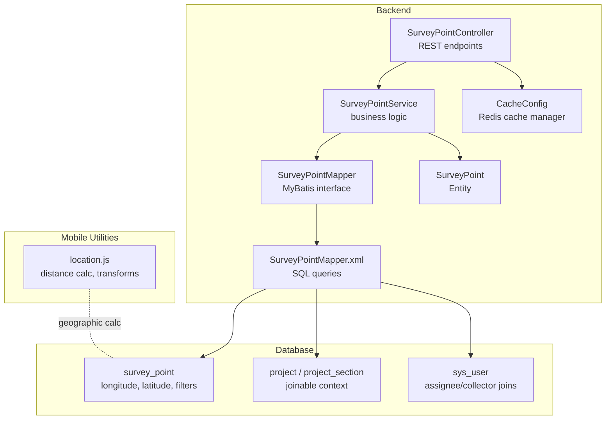
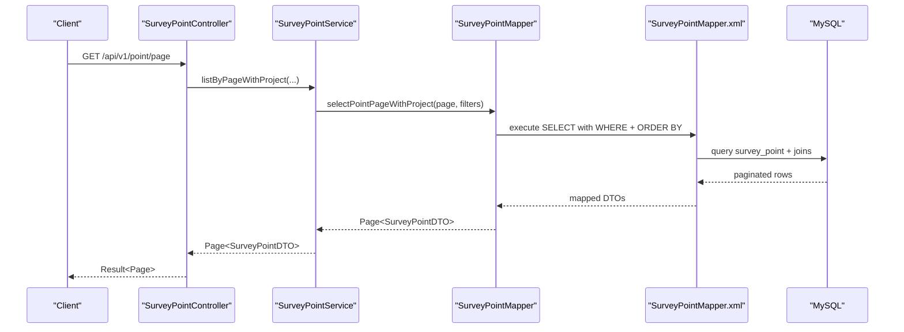
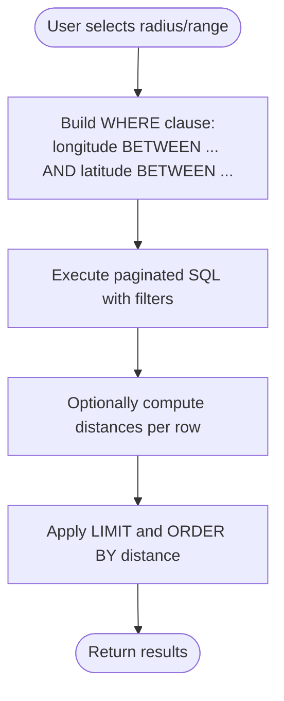
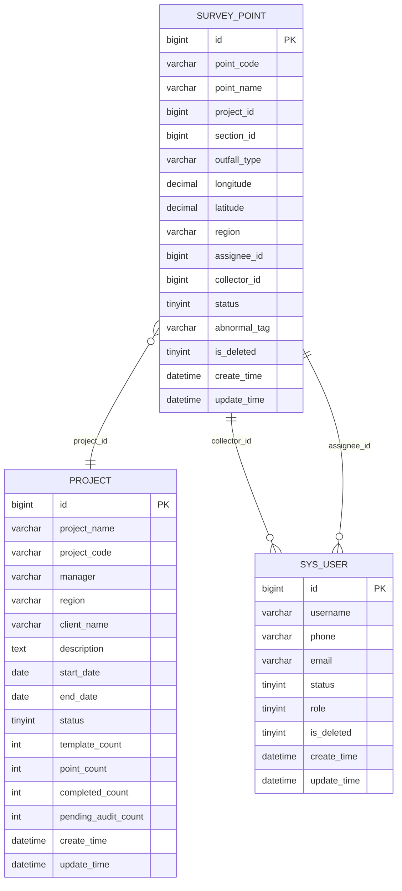
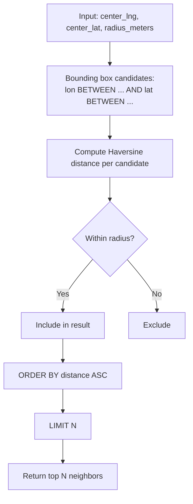
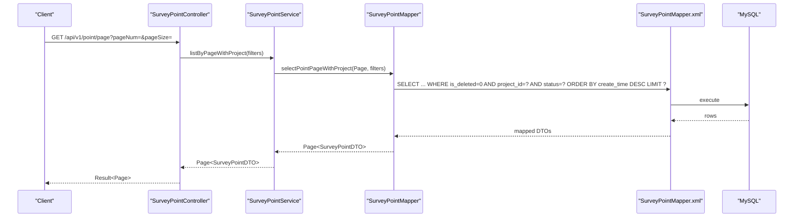
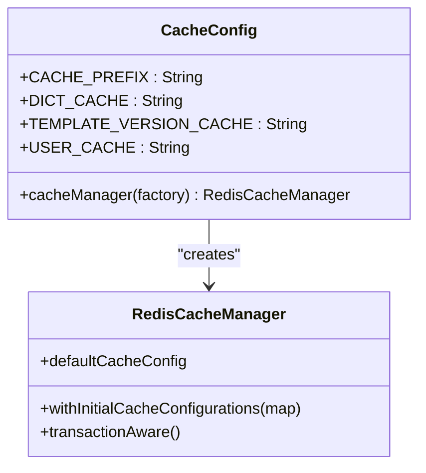
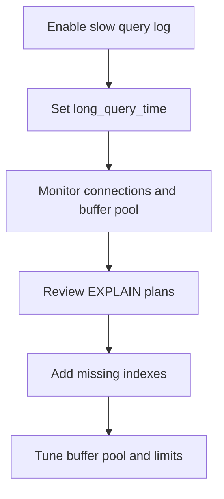
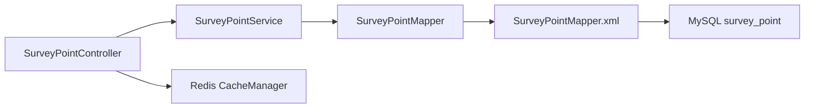

# Spatial Search & Performance Optimization

<cite>
**Referenced Files in This Document**
- [SurveyPoint.java](file://admin-backend/src/main/java/com/qhiot/survey/entity/SurveyPoint.java)
- [SurveyPointMapper.java](file://admin-backend/src/main/java/com/qhiot/survey/mapper/SurveyPointMapper.java)
- [SurveyPointMapper.xml](file://admin-backend/src/main/resources/mapper/SurveyPointMapper.xml)
- [SurveyPointService.java](file://admin-backend/src/main/java/com/qhiot/survey/service/SurveyPointService.java)
- [SurveyPointController.java](file://admin-backend/src/main/java/com/qhiot/survey/controller/SurveyPointController.java)
- [init.sql](file://init-sql/init.sql)
- [add-database-indexes.sql](file://admin-backend/add-database-indexes.sql)
- [05-database-indexes.sql](file://admin-backend/init-data/05-database-indexes.sql)
- [database_optimization.sql](file://init-sql/database_optimization.sql)
- [application.yml](file://admin-backend/src/main/resources/application.yml)
- [CacheConfig.java](file://admin-backend/src/main/java/com/qhiot/survey/config/CacheConfig.java)
- [location.js](file://mobile-app/src/utils/location.js)
</cite>

## Table of Contents
1. [Introduction](#introduction)
2. [Project Structure](#project-structure)
3. [Core Components](#core-components)
4. [Architecture Overview](#architecture-overview)
5. [Detailed Component Analysis](#detailed-component-analysis)
6. [Dependency Analysis](#dependency-analysis)
7. [Performance Considerations](#performance-considerations)
8. [Troubleshooting Guide](#troubleshooting-guide)
9. [Conclusion](#conclusion)
10. [Appendices](#appendices)

## Introduction
This document focuses on spatial search capabilities and database performance optimization for survey point management. It covers:
- Geographic query patterns supported by the current implementation (proximity/bounding box searches and distance calculations)
- Database indexing strategies for longitude/latitude and other frequently filtered/sorted columns
- Implementation of spatial functions and geographic calculations in MySQL
- Efficient query patterns for large datasets and pagination strategies for spatial data
- Caching mechanisms for frequently accessed point data and location-based recommendations
- Performance monitoring, query optimization, and database tuning for high-volume deployments
- Scaling considerations for thousands of survey points and geographic clustering strategies

## Project Structure
The spatial and performance-critical parts of the system are primarily located in:
- Backend domain model and persistence for survey points
- MyBatis mapper and XML SQL for paginated queries
- Application configuration for database and Redis caching
- Mobile utilities for distance calculation and coordinate transformations

**Diagram sources**
- [SurveyPointController.java:30-40](file://admin-backend/src/main/java/com/qhiot/survey/controller/SurveyPointController.java#L30-L40)
- [SurveyPointService.java:47-52](file://admin-backend/src/main/java/com/qhiot/survey/service/SurveyPointService.java#L47-L52)
- [SurveyPointMapper.java:12-26](file://admin-backend/src/main/java/com/qhiot/survey/mapper/SurveyPointMapper.java#L12-L26)
- [SurveyPointMapper.xml:6-48](file://admin-backend/src/main/resources/mapper/SurveyPointMapper.xml#L6-L48)
- [SurveyPoint.java:46-48](file://admin-backend/src/main/java/com/qhiot/survey/entity/SurveyPoint.java#L46-L48)
- [CacheConfig.java:75-92](file://admin-backend/src/main/java/com/qhiot/survey/config/CacheConfig.java#L75-L92)
- [location.js:206-221](file://mobile-app/src/utils/location.js#L206-L221)

**Section sources**
- [SurveyPointController.java:30-40](file://admin-backend/src/main/java/com/qhiot/survey/controller/SurveyPointController.java#L30-L40)
- [SurveyPointService.java:47-52](file://admin-backend/src/main/java/com/qhiot/survey/service/SurveyPointService.java#L47-L52)
- [SurveyPointMapper.java:12-26](file://admin-backend/src/main/java/com/qhiot/survey/mapper/SurveyPointMapper.java#L12-L26)
- [SurveyPointMapper.xml:6-48](file://admin-backend/src/main/resources/mapper/SurveyPointMapper.xml#L6-L48)
- [SurveyPoint.java:46-48](file://admin-backend/src/main/java/com/qhiot/survey/entity/SurveyPoint.java#L46-L48)
- [CacheConfig.java:75-92](file://admin-backend/src/main/java/com/qhiot/survey/config/CacheConfig.java#L75-L92)
- [location.js:206-221](file://mobile-app/src/utils/location.js#L206-L221)

## Core Components
- Entity: SurveyPoint defines longitude and latitude as numeric fields suitable for spatial indexing and distance calculations.
- Mapper/SQL: Paginated list query supports filtering by project, section, keyword, and status, and joins with project and user tables for richer context.
- Controller/Service: Expose REST endpoints for paginated listing and basic CRUD operations; service methods define pagination signatures.
- Database Initialization: survey_point table includes indexes on project_id, status, collector_id, and outfall_type.
- Index Scripts: Additional composite and single-column indexes are provisioned via idempotent stored procedures.
- Caching: Redis-backed cache manager configured with namespaces and TTLs for frequently accessed dictionaries and templates.

**Section sources**
- [SurveyPoint.java:46-48](file://admin-backend/src/main/java/com/qhiot/survey/entity/SurveyPoint.java#L46-L48)
- [SurveyPointMapper.xml:6-48](file://admin-backend/src/main/resources/mapper/SurveyPointMapper.xml#L6-L48)
- [SurveyPointService.java:47-52](file://admin-backend/src/main/java/com/qhiot/survey/service/SurveyPointService.java#L47-L52)
- [SurveyPointController.java:30-40](file://admin-backend/src/main/java/com/qhiot/survey/controller/SurveyPointController.java#L30-L40)
- [init.sql:101-122](file://init-sql/init.sql#L101-L122)
- [add-database-indexes.sql:54-66](file://admin-backend/add-database-indexes.sql#L54-L66)
- [05-database-indexes.sql:75-81](file://admin-backend/init-data/05-database-indexes.sql#L75-L81)
- [CacheConfig.java:75-92](file://admin-backend/src/main/java/com/qhiot/survey/config/CacheConfig.java#L75-L92)

## Architecture Overview
The backend exposes REST endpoints for survey point listing and management. The list endpoint delegates to a service method that uses a MyBatis mapper to execute a paginated SQL query joining survey_point with project and user tables. Filtering conditions are applied based on request parameters. Redis is configured for caching.

**Diagram sources**
- [SurveyPointController.java:30-40](file://admin-backend/src/main/java/com/qhiot/survey/controller/SurveyPointController.java#L30-L40)
- [SurveyPointService.java:50-52](file://admin-backend/src/main/java/com/qhiot/survey/service/SurveyPointService.java#L50-L52)
- [SurveyPointMapper.java:19-25](file://admin-backend/src/main/java/com/qhiot/survey/mapper/SurveyPointMapper.java#L19-L25)
- [SurveyPointMapper.xml:6-48](file://admin-backend/src/main/resources/mapper/SurveyPointMapper.xml#L6-L48)

## Detailed Component Analysis

### Geographic Query Patterns and Distance Calculations
- Supported patterns in current implementation:
  - Proximity search: Not implemented in SQL; however, the entity stores longitude and latitude as numeric types suitable for spatial indexing and distance computation.
  - Bounding box queries: Not implemented in SQL; can be modeled by adding range predicates on longitude and latitude.
  - Distance calculations: Implemented in the mobile utility using spherical law of cosines for meter-level distance between two WGS84 coordinates.
- Recommendations for future SQL-based proximity/bounding box:
  - Use MySQL’s built-in geographic functions (e.g., Haversine formula) to compute distances or filter by bounding boxes on longitude/latitude.
  - Add composite indexes on (longitude, latitude) or appropriate spatial indexes if using MySQL 8+ spatial extensions.
  - Apply LIMIT and ORDER BY distance to support “nearest N” queries.

[No sources needed since this diagram shows conceptual workflow, not actual code structure]

**Section sources**
- [SurveyPoint.java:46-48](file://admin-backend/src/main/java/com/qhiot/survey/entity/SurveyPoint.java#L46-L48)
- [location.js:206-221](file://mobile-app/src/utils/location.js#L206-L221)

### Database Indexing Strategies for Longitude/Latitude and Filters
- Current table-level indexes on survey_point:
  - Single-column: project_id, status, collector_id, outfall_type
- Additional indexes provisioned via idempotent scripts:
  - Composite: (project_id, status)
  - Single: assignee_id, outfall_type, create_time
- Recommendations for spatial optimization:
  - Add composite index on (project_id, status) to accelerate list queries
  - Consider adding (longitude, latitude) for bounding box scans
  - Evaluate spatial extensions in MySQL 8+ for R-tree/GIS indexes if precise geofencing is required
  - Ensure appropriate cardinality for status, outfall_type, and assignee_id to maximize index selectivity

**Diagram sources**
- [init.sql:101-122](file://init-sql/init.sql#L101-L122)
- [init.sql:11-30](file://init-sql/init.sql#L11-L30)
- [init.sql:173-185](file://init-sql/init.sql#L173-L185)

**Section sources**
- [init.sql:101-122](file://init-sql/init.sql#L101-L122)
- [add-database-indexes.sql:54-66](file://admin-backend/add-database-indexes.sql#L54-L66)
- [05-database-indexes.sql:75-81](file://admin-backend/init-data/05-database-indexes.sql#L75-L81)

### Implementation of Spatial Functions and Geographic Calculations in MySQL
- Current implementation:
  - Distance calculation is performed in the mobile utility using JavaScript with the spherical law of cosines.
- Recommended SQL-level implementation:
  - Use MySQL’s geographic functions to compute distances or filter by bounding boxes.
  - Example patterns:
    - Haversine formula in SELECT to compute meters between points
    - Range checks on longitude/latitude for bounding box filtering
    - ORDER BY computed distance for nearest neighbor queries
- Considerations:
  - Ensure proper indexing on longitude/latitude for bounding box scans
  - Use LIMIT to cap result sets for large-radius proximity searches
  - For very large datasets, consider partitioning by region or status

[No sources needed since this diagram shows conceptual workflow, not actual code structure]

**Section sources**
- [location.js:206-221](file://mobile-app/src/utils/location.js#L206-L221)

### Efficient Query Patterns for Large Datasets and Pagination
- Current paginated query:
  - Uses MyBatis Page with filters on project_id, section_id, keyword, and status
  - Joins with project and sys_user tables to enrich response
- Recommendations:
  - Add composite index (project_id, status) to improve list performance
  - For spatial pagination, add bounding box filters on longitude/latitude
  - Use cursor-based pagination or keyset pagination for better stability at scale
  - Apply LIMIT early and avoid SELECT *

**Diagram sources**
- [SurveyPointController.java:30-40](file://admin-backend/src/main/java/com/qhiot/survey/controller/SurveyPointController.java#L30-L40)
- [SurveyPointService.java:50-52](file://admin-backend/src/main/java/com/qhiot/survey/service/SurveyPointService.java#L50-L52)
- [SurveyPointMapper.java:19-25](file://admin-backend/src/main/java/com/qhiot/survey/mapper/SurveyPointMapper.java#L19-L25)
- [SurveyPointMapper.xml:6-48](file://admin-backend/src/main/resources/mapper/SurveyPointMapper.xml#L6-L48)

**Section sources**
- [SurveyPointMapper.xml:6-48](file://admin-backend/src/main/resources/mapper/SurveyPointMapper.xml#L6-L48)
- [SurveyPointService.java:47-52](file://admin-backend/src/main/java/com/qhiot/survey/service/SurveyPointService.java#L47-L52)
- [SurveyPointController.java:30-40](file://admin-backend/src/main/java/com/qhiot/survey/controller/SurveyPointController.java#L30-L40)

### Caching Mechanisms for Frequently Accessed Point Data and Location-Based Recommendations
- Redis cache configuration:
  - Namespaces: dict, templateVersion, user with TTLs tailored to data volatility
  - Transaction-aware cache manager to prevent dirty writes
- Recommendations for spatial data:
  - Cache frequently accessed project/section metadata and lookup tables
  - Cache point summaries for map overlays if read-mostly
  - Invalidate caches on write operations to maintain consistency
  - Consider caching recommendation lists (e.g., nearby points) with short TTLs

**Diagram sources**
- [CacheConfig.java:75-92](file://admin-backend/src/main/java/com/qhiot/survey/config/CacheConfig.java#L75-L92)

**Section sources**
- [CacheConfig.java:23-92](file://admin-backend/src/main/java/com/qhiot/survey/config/CacheConfig.java#L23-L92)

### Performance Monitoring, Query Optimization, and Database Tuning
- Monitoring and diagnostics:
  - Slow query logging enabled with threshold tuning
  - Connection statistics and buffer pool sizing inspection
- Recommendations:
  - Enable slow query log and set long_query_time appropriately
  - Monitor Threads_connected vs Max_used_connections and adjust max_connections
  - Tune innodb_buffer_pool_size based on dataset size and workload
  - Use EXPLAIN to analyze query plans for list and spatial queries

**Section sources**
- [database_optimization.sql:46-56](file://init-sql/database_optimization.sql#L46-L56)
- [application.yml:39-44](file://admin-backend/src/main/resources/application.yml#L39-L44)

## Dependency Analysis
- Controller depends on Service for business logic
- Service depends on Mapper for persistence
- Mapper executes SQL against survey_point and related tables
- Application configuration enables Druid datasource and Redis cache

**Diagram sources**
- [SurveyPointController.java:25-28](file://admin-backend/src/main/java/com/qhiot/survey/controller/SurveyPointController.java#L25-L28)
- [SurveyPointService.java:12-12](file://admin-backend/src/main/java/com/qhiot/survey/service/SurveyPointService.java#L12-L12)
- [SurveyPointMapper.java:12-12](file://admin-backend/src/main/java/com/qhiot/survey/mapper/SurveyPointMapper.java#L12-L12)
- [SurveyPointMapper.xml:6-48](file://admin-backend/src/main/resources/mapper/SurveyPointMapper.xml#L6-L48)
- [application.yml:64-78](file://admin-backend/src/main/resources/application.yml#L64-L78)

**Section sources**
- [SurveyPointController.java:25-28](file://admin-backend/src/main/java/com/qhiot/survey/controller/SurveyPointController.java#L25-L28)
- [SurveyPointService.java:12-12](file://admin-backend/src/main/java/com/qhiot/survey/service/SurveyPointService.java#L12-L12)
- [SurveyPointMapper.java:12-12](file://admin-backend/src/main/java/com/qhiot/survey/mapper/SurveyPointMapper.java#L12-L12)
- [SurveyPointMapper.xml:6-48](file://admin-backend/src/main/resources/mapper/SurveyPointMapper.xml#L6-L48)
- [application.yml:64-78](file://admin-backend/src/main/resources/application.yml#L64-L78)

## Performance Considerations
- Index coverage:
  - Ensure (project_id, status) exists to accelerate list queries
  - Add (longitude, latitude) for bounding box scans
- Query patterns:
  - Prefer selective filters and LIMIT
  - Avoid full scans on large tables
- Caching:
  - Cache lookup-heavy data and map overlays
  - Use short TTLs for near-real-time recommendations
- Monitoring:
  - Track slow queries and tune thresholds
  - Observe connection saturation and buffer pool utilization

[No sources needed since this section provides general guidance]

## Troubleshooting Guide
- Slow list queries:
  - Verify presence of (project_id, status) index
  - Confirm filters are selective and not causing full scans
- High connection usage:
  - Check Threads_connected vs Max_used_connections and adjust max_connections
- Distance calculation mismatches:
  - Validate coordinate systems (WGS84) and units (meters)
  - Compare JS-based distance with SQL-based Haversine for consistency

**Section sources**
- [05-database-indexes.sql:75-81](file://admin-backend/init-data/05-database-indexes.sql#L75-L81)
- [database_optimization.sql:53-56](file://init-sql/database_optimization.sql#L53-L56)
- [location.js:206-221](file://mobile-app/src/utils/location.js#L206-L221)

## Conclusion
The current system provides robust pagination and filtering for survey points with strong index coverage on key attributes. To enable true spatial search (proximity and bounding box), introduce bounding box filters and distance computations in SQL, complemented by appropriate indexes. Leverage Redis caching for frequently accessed metadata and map overlays. Continuously monitor and tune database performance using slow query logs and buffer pool metrics.

[No sources needed since this section summarizes without analyzing specific files]

## Appendices

### Appendix A: Geographic Calculation Reference
- Distance calculation uses spherical law of cosines in the mobile utility.

**Section sources**
- [location.js:206-221](file://mobile-app/src/utils/location.js#L206-L221)

### Appendix B: Database Initialization and Index Scripts
- survey_point table creation and indexes
- Idempotent index creation procedures for performance tuning

**Section sources**
- [init.sql:101-122](file://init-sql/init.sql#L101-L122)
- [add-database-indexes.sql:14-39](file://admin-backend/add-database-indexes.sql#L14-L39)
- [05-database-indexes.sql:21-62](file://admin-backend/init-data/05-database-indexes.sql#L21-L62)