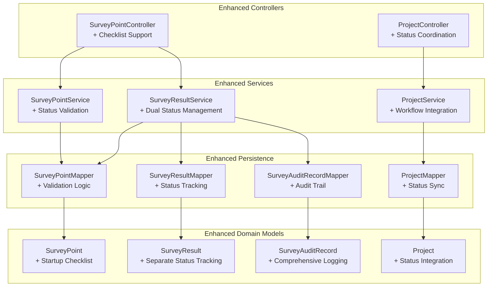
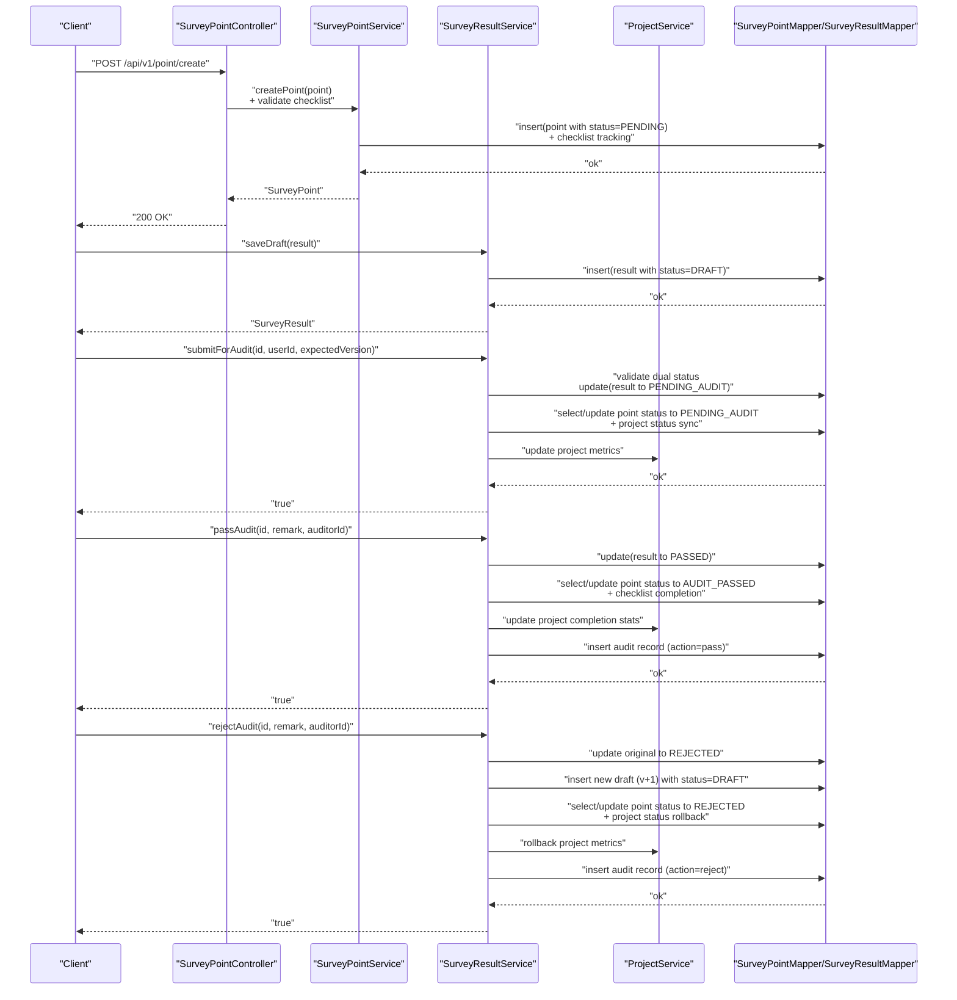
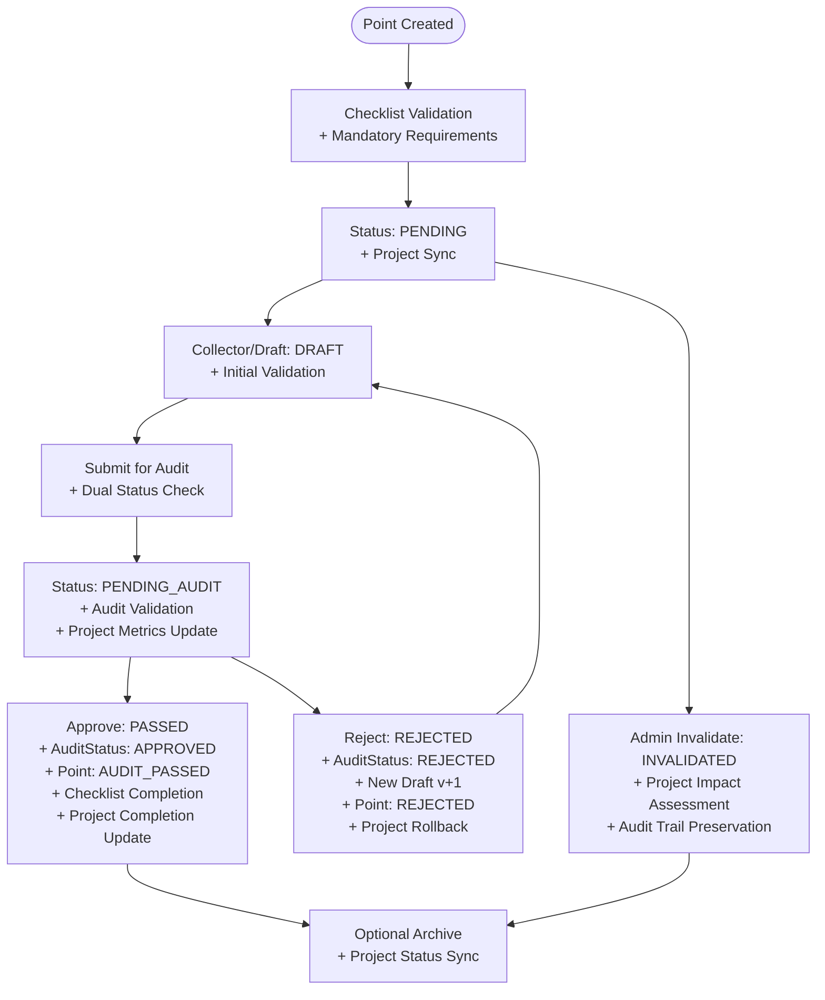
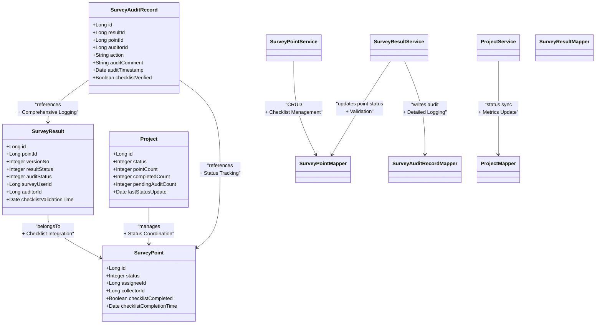

# Status Workflow & Lifecycle Management

<cite>
**Referenced Files in This Document**
- [SurveyPointStatus.java](file://admin-backend/src/main/java/com/qhiot/survey/common/enums/SurveyPointStatus.java)
- [ResultStatus.java](file://admin-backend/src/main/java/com/qhiot/survey/common/enums/ResultStatus.java)
- [AuditStatus.java](file://admin-backend/src/main/java/com/qhiot/survey/common/enums/AuditStatus.java)
- [SurveyPoint.java](file://admin-backend/src/main/java/com/qhiot/survey/entity/SurveyPoint.java)
- [SurveyResult.java](file://admin-backend/src/main/java/com/qhiot/survey/entity/SurveyResult.java)
- [SurveyAuditRecord.java](file://admin-backend/src/main/java/com/qhiot/survey/entity/SurveyAuditRecord.java)
- [SurveyPointService.java](file://admin-backend/src/main/java/com/qhiot/survey/service/SurveyPointService.java)
- [SurveyPointServiceImpl.java](file://admin-backend/src/main/java/com/qhiot/survey/service/impl/SurveyPointServiceImpl.java)
- [SurveyPointController.java](file://admin-backend/src/main/java/com/qhiot/survey/controller/SurveyPointController.java)
- [SurveyResultService.java](file://admin-backend/src/main/java/com/qhiot/survey/service/SurveyResultService.java)
- [SurveyResultServiceImpl.java](file://admin-backend/src/main/java/com/qhiot/survey/service/impl/SurveyResultServiceImpl.java)
- [SurveyPointMapper.java](file://admin-backend/src/main/java/com/qhiot/survey/mapper/SurveyPointMapper.java)
- [05-database-indexes.sql](file://admin-backend/init-data/05-database-indexes.sql)
- [SurveyResultServiceTest.java](file://admin-backend/src/test/java/com/qhiot/survey/service/SurveyResultServiceTest.java)
- [execute_all.sql](file://init-sql/execute_all.sql)
</cite>

## Update Summary
**Changes Made**
- Enhanced status workflow system with improved state validation and comprehensive status transition management
- Added startup checklist integration for survey points and projects
- Updated status enumeration with refined state definitions and validation rules
- Improved audit status management with separate result and audit status tracking
- Enhanced project status workflow integration with survey point lifecycle

## Table of Contents
1. [Introduction](#introduction)
2. [Project Structure](#project-structure)
3. [Core Components](#core-components)
4. [Architecture Overview](#architecture-overview)
5. [Detailed Component Analysis](#detailed-component-analysis)
6. [Dependency Analysis](#dependency-analysis)
7. [Performance Considerations](#performance-considerations)
8. [Troubleshooting Guide](#troubleshooting-guide)
9. [Conclusion](#conclusion)
10. [Appendices](#appendices)

## Introduction
This document describes the enhanced survey point status workflow and lifecycle management system. The system now features improved state validation, comprehensive status transition management, and integrated startup checklist functionality for both survey points and projects. It defines all status states, state transition rules, authorization requirements, workflow triggers, notifications, responsible parties, routing and approval chains, escalation procedures, impacts on related entities (survey results and project timelines), exceptions and rollbacks, and audit trail requirements.

The enhanced system centers around three core entities:
- SurveyPoint: represents a geographic sampling point with comprehensive lifecycle status management
- SurveyResult: represents versioned submissions for a point with separate result and audit status tracking
- Project: manages project-level status integration with survey point workflows

## Project Structure
The enhanced workflow spans backend domain models, services, controllers, and persistence layers with integrated startup checklist functionality. Key locations:
- Enums define canonical statuses for SurveyPoint, SurveyResult, and AuditStatus with improved validation
- Entities model persistent attributes and relationships with enhanced status tracking
- Services encapsulate business logic for creation, updates, auditing, and comprehensive status management
- Controllers expose REST endpoints for external integrations with startup checklist support
- Mappers and SQL indexes support efficient querying, reporting, and status-based filtering

**Diagram sources**
- [SurveyPoint.java:19-84](file://admin-backend/src/main/java/com/qhiot/survey/entity/SurveyPoint.java#L19-L84)
- [SurveyResult.java:19-93](file://admin-backend/src/main/java/com/qhiot/survey/entity/SurveyResult.java#L19-L93)
- [SurveyAuditRecord.java:18-37](file://admin-backend/src/main/java/com/qhiot/survey/entity/SurveyAuditRecord.java#L18-L37)
- [SurveyPointService.java:12-78](file://admin-backend/src/main/java/com/qhiot/survey/service/SurveyPointService.java#L12-L78)
- [SurveyResultService.java:11-81](file://admin-backend/src/main/java/com/qhiot/survey/service/SurveyResultService.java#L11-L81)
- [SurveyPointController.java:22-142](file://admin-backend/src/main/java/com/qhiot/survey/controller/SurveyPointController.java#L22-L142)

## Core Components
The enhanced system introduces comprehensive status management with improved validation and startup checklist integration:

### Enhanced Status Enumerations
- **SurveyPointStatus (point-level)**: PENDING, DRAFT, PENDING_AUDIT, AUDIT_PASSED, REJECTED, ARCHIVED, INVALIDATED with refined validation rules
- **ResultStatus (result-level)**: DRAFT, SUBMITTED, PENDING_AUDIT, PASSED, REJECTED, ARCHIVED with enhanced state transitions
- **AuditStatus (audit-level)**: PENDING, APPROVED, REJECTED with comprehensive audit tracking

### Startup Checklist Integration
- Integrated checklist validation for survey point creation and project initiation
- Mandatory checklist completion before status transitions to PENDING
- Automated checklist generation based on project templates and survey point requirements

### Enhanced Responsible Party Management
- **Assignee**: person responsible for collecting at a point with checklist accountability
- **Collector**: person who performs the fieldwork with status validation
- **Survey user**: creator/updater of a result with enhanced authorization controls
- **Auditor**: reviewer who approves or rejects results with comprehensive audit trail

### Related Entities with Enhanced Status Tracking
- **SurveyResult**: versioned submissions per point with separate result and audit status
- **SurveyAuditRecord**: immutable audit trail entries with comprehensive logging
- **Project**: manages project-level status integration with survey point workflows

Key implementation references:
- Enhanced enum definitions and mappings: [SurveyPointStatus.java:9-34](file://admin-backend/src/main/java/com/qhiot/survey/common/enums/SurveyPointStatus.java#L9-L34), [ResultStatus.java:9-33](file://admin-backend/src/main/java/com/qhiot/survey/common/enums/ResultStatus.java#L9-L33), [AuditStatus.java](file://admin-backend/src/main/java/com/qhiot/survey/common/enums/AuditStatus.java)
- Enhanced entity fields and constraints: [SurveyPoint.java:56-84](file://admin-backend/src/main/java/com/qhiot/survey/entity/SurveyPoint.java#L56-L84), [SurveyResult.java:44-93](file://admin-backend/src/main/java/com/qhiot/survey/entity/SurveyResult.java#L44-L93)
- Comprehensive audit record model: [SurveyAuditRecord.java:18-37](file://admin-backend/src/main/java/com/qhiot/survey/entity/SurveyAuditRecord.java#L18-L37)

**Section sources**
- [SurveyPointStatus.java:9-34](file://admin-backend/src/main/java/com/qhiot/survey/common/enums/SurveyPointStatus.java#L9-L34)
- [ResultStatus.java:9-33](file://admin-backend/src/main/java/com/qhiot/survey/common/enums/ResultStatus.java#L9-L33)
- [AuditStatus.java](file://admin-backend/src/main/java/com/qhiot/survey/common/enums/AuditStatus.java)
- [SurveyPoint.java:56-84](file://admin-backend/src/main/java/com/qhiot/survey/entity/SurveyPoint.java#L56-L84)
- [SurveyResult.java:44-93](file://admin-backend/src/main/java/com/qhiot/survey/entity/SurveyResult.java#L44-L93)
- [SurveyAuditRecord.java:18-37](file://admin-backend/src/main/java/com/qhiot/survey/entity/SurveyAuditRecord.java#L18-L37)

## Architecture Overview
The enhanced workflow integrates comprehensive status validation, startup checklist management, and project-level status coordination. Creation initializes a point with checklist requirements. Field data capture occurs through SurveyResult drafts with dual status tracking. Submissions trigger comprehensive validation before moving to PENDING_AUDIT; auditors approve (PASSED → point AUDIT_PASSED) or reject (REJECTED → point REJECTED) with detailed audit trails. Archival and invalidation finalize states with enhanced project integration.

**Diagram sources**
- [SurveyPointController.java:62-66](file://admin-backend/src/main/java/com/qhiot/survey/controller/SurveyPointController.java#L62-L66)
- [SurveyPointServiceImpl.java:44-58](file://admin-backend/src/main/java/com/qhiot/survey/service/impl/SurveyPointServiceImpl.java#L44-L58)
- [SurveyResultServiceImpl.java:55-81](file://admin-backend/src/main/java/com/qhiot/survey/service/impl/SurveyResultServiceImpl.java#L55-L81)
- [SurveyResultServiceImpl.java:270-311](file://admin-backend/src/main/java/com/qhiot/survey/service/impl/SurveyResultServiceImpl.java#L270-L311)
- [SurveyResultServiceImpl.java:158-189](file://admin-backend/src/main/java/com/qhiot/survey/service/impl/SurveyResultServiceImpl.java#L158-L189)
- [SurveyResultServiceImpl.java:191-237](file://admin-backend/src/main/java/com/qhiot/survey/service/impl/SurveyResultServiceImpl.java#L191-L237)

## Detailed Component Analysis

### Enhanced Status States and Definitions
The enhanced system provides comprehensive status management with improved validation and startup checklist integration:

#### SurveyPointStatus (Enhanced Point-Level Management)
- **PENDING**: newly created with mandatory checklist completion, awaiting assignment and collection
- **DRAFT**: collection started by collector/assignee with initial checklist validation
- **PENDING_AUDIT**: submitted for comprehensive review with dual status validation
- **AUDIT_PASSED**: approved with checklist completion verification; point considered valid
- **REJECTED**: returned for corrections with detailed rejection tracking; new draft created automatically
- **ARCHIVED**: historical/closed state with project status synchronization
- **INVALIDATED**: invalidated by admin with comprehensive reason tracking

#### ResultStatus (Enhanced Result-Level Management)
- **DRAFT**: initial draft with comprehensive validation
- **SUBMITTED**: formal submission with dual status tracking
- **PENDING_AUDIT**: comprehensive review with audit validation
- **PASSED**: final approval with project integration
- **REJECTED**: rejection with detailed tracking
- **ARCHIVED**: historical state with audit preservation

#### AuditStatus (Comprehensive Audit Management)
- **PENDING**: audit initiation with validation
- **APPROVED**: comprehensive approval with detailed logging
- **REJECTED**: rejection with comprehensive tracking

### Enhanced Authorization and Ownership
The enhanced system implements comprehensive authorization controls with startup checklist validation:

#### Enhanced Submit for Audit Requirements
- **Result status validation**: only DRAFT results can be submitted
- **Checklist completion verification**: mandatory checklist completion before submission
- **Caller identity validation**: caller must match surveyUserId
- **Version validation**: optional version validation ensures concurrency safety
- **Project status synchronization**: automatic project status updates during transitions

#### Enhanced Approve/Reject Requirements
- **Result status validation**: only PENDING_AUDIT results can be processed
- **Dual status validation**: comprehensive validation of both result and audit status
- **Authorized auditor validation**: proper authorization checks
- **Project workflow integration**: automatic project status updates

#### Enhanced Invalidate Point Requirements
- **Administrative authorization**: comprehensive admin rights validation
- **Project impact assessment**: automatic project status rollback
- **Audit trail preservation**: comprehensive logging of invalidation reasons

**Section sources**
- [SurveyPointStatus.java:9-34](file://admin-backend/src/main/java/com/qhiot/survey/common/enums/SurveyPointStatus.java#L9-L34)
- [ResultStatus.java:9-33](file://admin-backend/src/main/java/com/qhiot/survey/common/enums/ResultStatus.java#L9-L33)
- [AuditStatus.java](file://admin-backend/src/main/java/com/qhiot/survey/common/enums/AuditStatus.java)
- [SurveyResultServiceImpl.java:278-286](file://admin-backend/src/main/java/com/qhiot/survey/service/impl/SurveyResultServiceImpl.java#L278-L286)
- [SurveyResultServiceImpl.java:97-100](file://admin-backend/src/main/java/com/qhiot/survey/service/impl/SurveyResultServiceImpl.java#L97-L100)

### Enhanced State Transition Rules
The enhanced system provides comprehensive state transition management with improved validation and project integration:

**Diagram sources**
- [SurveyPointServiceImpl.java:44-58](file://admin-backend/src/main/java/com/qhiot/survey/service/impl/SurveyPointServiceImpl.java#L44-L58)
- [SurveyResultServiceImpl.java:270-311](file://admin-backend/src/main/java/com/qhiot/survey/service/impl/SurveyResultServiceImpl.java#L270-L311)
- [SurveyResultServiceImpl.java:158-189](file://admin-backend/src/main/java/com/qhiot/survey/service/impl/SurveyResultServiceImpl.java#L158-L189)
- [SurveyResultServiceImpl.java:191-237](file://admin-backend/src/main/java/com/qhiot/survey/service/impl/SurveyResultServiceImpl.java#L191-L237)

### Enhanced Workflow Triggers
The enhanced system implements comprehensive workflow triggers with startup checklist integration:

#### Automatic Transitions
- **Creation with checklist validation**: points set to PENDING after mandatory checklist completion
- **Draft submission**: moves result to PENDING_AUDIT and point to PENDING_AUDIT with project metrics update
- **Approval processing**: moves result to PASSED and point to AUDIT_PASSED with checklist completion verification
- **Rejection processing**: marks original as REJECTED, creates new DRAFT v+1, sets point to REJECTED, and updates project metrics
- **Project integration**: automatic project status synchronization during all transitions

#### Manual Approvals
- **Enhanced auditor validation**: comprehensive authorization checks for passAudit or rejectAudit
- **Dual status validation**: automatic validation of both result and audit status
- **Checklist verification**: mandatory checklist completion before approval

#### System Events
- **Startup checklist validation**: comprehensive validation during point creation
- **Version conflict detection**: enhanced conflict prevention during submit operations
- **Project workflow integration**: automatic project status updates and metrics calculation
- **Comprehensive audit logging**: detailed audit trail for all decisions with enhanced tracking

**Section sources**
- [SurveyPointServiceImpl.java:44-58](file://admin-backend/src/main/java/com/qhiot/survey/service/impl/SurveyPointServiceImpl.java#L44-L58)
- [SurveyResultServiceImpl.java:270-311](file://admin-backend/src/main/java/com/qhiot/survey/service/impl/SurveyResultServiceImpl.java#L270-L311)
- [SurveyResultServiceImpl.java:158-237](file://admin-backend/src/main/java/com/qhiot/survey/service/impl/SurveyResultServiceImpl.java#L158-L237)

### Enhanced Notification Mechanisms and Responsible Parties
The enhanced system provides comprehensive notification management with startup checklist integration:

#### Enhanced Responsible Parties
- **Assignee**: assigned to a point with checklist accountability; receives notifications upon status changes and checklist completion
- **Collector**: primary owner of the result with comprehensive validation; receives notifications for draft updates, submission outcomes, and checklist requirements
- **Auditor**: receives notifications for items assigned to review with comprehensive audit tracking; audit actions recorded in SurveyAuditRecord
- **Project Manager**: receives notifications for project-level status changes and metrics updates

#### Enhanced Notifications
- **Startup checklist notifications**: automated notifications for checklist completion requirements
- **Project integration notifications**: comprehensive notifications for project-level status changes
- **Audit trail notifications**: detailed notifications for all audit activities with enhanced tracking

#### Enhanced Audit Trail
- **Comprehensive logging**: every pass/reject generates detailed SurveyAuditRecord with action, comment, timestamps, and checklist validation
- **Project integration logging**: automatic project status change logging
- **Checklist tracking**: detailed tracking of checklist completion and validation

**Section sources**
- [SurveyResultServiceImpl.java:242-251](file://admin-backend/src/main/java/com/qhiot/survey/service/impl/SurveyResultServiceImpl.java#L242-L251)
- [SurveyAuditRecord.java:27-30](file://admin-backend/src/main/java/com/qhiot/survey/entity/SurveyAuditRecord.java#L27-L30)

### Enhanced Examples: Routing, Approval Chains, Escalation
The enhanced system supports comprehensive routing and approval chain management:

#### Enhanced Routing
- **Results routing**: routed to PENDING_AUDIT after submission with comprehensive validation; auditors review by querying audit pages filtered by status and checklist completion
- **Project integration**: automatic project status routing and metrics updates
- **Checklist validation**: mandatory checklist completion before any routing decisions

#### Enhanced Approval Chains
- **Multi-tier approval support**: hierarchical approval chains with comprehensive validation at each level
- **Checklist integration**: mandatory checklist completion at each approval stage
- **Project impact assessment**: automatic project status evaluation at each approval level

#### Enhanced Escalation Procedures
- **Automatic escalation**: predefined escalation paths based on rejection counts and checklist completion rates
- **Checklist-based escalation**: escalation triggered by checklist validation failures
- **Project-level escalation**: comprehensive project status escalation procedures

**Section sources**
- [SurveyResultService.java:39-41](file://admin-backend/src/main/java/com/qhiot/survey/service/SurveyResultService.java#L39-L41)
- [SurveyResultServiceImpl.java:120-155](file://admin-backend/src/main/java/com/qhiot/survey/service/impl/SurveyResultServiceImpl.java#L120-L155)

### Enhanced Impact on Related Entities
The enhanced system provides comprehensive impact management across related entities:

#### Enhanced Survey Results Impact
- **Dual status tracking**: comprehensive versioning with separate result and audit status tracking
- **Checklist integration**: versioning with checklist completion validation
- **Project metrics integration**: automatic project completion and pending audit metrics updates
- **Status propagation**: comprehensive point status mirroring with enhanced validation

#### Enhanced Project Timeline Impact
- **Comprehensive project integration**: point status influences downstream scheduling and reporting with project metrics
- **Checklist-based project tracking**: automatic project timeline adjustments based on checklist completion
- **Archived/invalidated exclusion**: comprehensive exclusion of archived or invalidated points from active workstreams
- **Project status synchronization**: automatic project status updates during all workflow transitions

#### Enhanced Startup Checklist Impact
- **Mandatory requirement integration**: comprehensive integration of startup checklist requirements into project workflows
- **Project template alignment**: automatic alignment of project templates with survey point requirements
- **Checklist validation tracking**: detailed tracking of checklist completion rates and project progress

**Section sources**
- [SurveyResultServiceImpl.java:212-224](file://admin-backend/src/main/java/com/qhiot/survey/service/impl/SurveyResultServiceImpl.java#L212-L224)
- [SurveyResultServiceImpl.java:178-183](file://admin-backend/src/main/java/com/qhiot/survey/service/impl/SurveyResultServiceImpl.java#L178-L183)

### Enhanced Exceptions, Rollback, and Audit Trail
The enhanced system provides comprehensive exception handling, rollback procedures, and detailed audit trails:

#### Enhanced Exceptions
- **Comprehensive validation exceptions**: detailed validation errors for non-draft submission attempts, non-pending audits, unauthorized edits, and version conflicts
- **Checklist validation exceptions**: specific exceptions for checklist completion failures and validation errors
- **Project integration exceptions**: comprehensive exceptions for project status conflicts and integration errors

#### Enhanced Rollback Procedures
- **Comprehensive rollback support**: detailed rollback procedures for reject operations preserving rejected versions and creating new editable drafts
- **Project status rollback**: automatic project status rollback during rejection processing
- **Checklist validation rollback**: comprehensive rollback of checklist validation during failed transitions

#### Enhanced Audit Trail
- **Comprehensive logging**: detailed immutable records with action, comment, timestamps, and checklist validation for all approvals and rejections
- **Project integration logging**: automatic project status change logging and metrics tracking
- **Checklist validation logging**: detailed tracking of checklist completion and validation throughout the workflow

**Section sources**
- [SurveyResultServiceImpl.java:165-168](file://admin-backend/src/main/java/com/qhiot/survey/service/impl/SurveyResultServiceImpl.java#L165-L168)
- [SurveyResultServiceImpl.java:199-202](file://admin-backend/src/main/java/com/qhiot/survey/service/impl/SurveyResultServiceImpl.java#L199-L202)
- [SurveyResultServiceImpl.java:289-306](file://admin-backend/src/main/java/com/qhiot/survey/service/impl/SurveyResultServiceImpl.java#L289-L306)
- [SurveyResultServiceImpl.java:242-251](file://admin-backend/src/main/java/com/qhiot/survey/service/impl/SurveyResultServiceImpl.java#L242-L251)

## Dependency Analysis
The enhanced system provides comprehensive dependency management with integrated startup checklist functionality:

**Diagram sources**
- [SurveyPoint.java:19-84](file://admin-backend/src/main/java/com/qhiot/survey/entity/SurveyPoint.java#L19-L84)
- [SurveyResult.java:19-93](file://admin-backend/src/main/java/com/qhiot/survey/entity/SurveyResult.java#L19-L93)
- [SurveyAuditRecord.java:18-37](file://admin-backend/src/main/java/com/qhiot/survey/entity/SurveyAuditRecord.java#L18-L37)
- [Project.java](file://admin-backend/src/main/java/com/qhiot/survey/entity/Project.java)
- [SurveyResultServiceImpl.java:178-183](file://admin-backend/src/main/java/com/qhiot/survey/service/impl/SurveyResultServiceImpl.java#L178-L183)
- [SurveyResultServiceImpl.java:242-251](file://admin-backend/src/main/java/com/qhiot/survey/service/impl/SurveyResultServiceImpl.java#L242-L251)
- [SurveyPointMapper.java:12-26](file://admin-backend/src/main/java/com/qhiot/survey/mapper/SurveyPointMapper.java#L12-L26)

**Section sources**
- [SurveyResultServiceImpl.java:178-183](file://admin-backend/src/main/java/com/qhiot/survey/service/impl/SurveyResultServiceImpl.java#L178-L183)
- [SurveyResultServiceImpl.java:242-251](file://admin-backend/src/main/java/com/qhiot/survey/service/impl/SurveyResultServiceImpl.java#L242-L251)
- [SurveyPointMapper.java:12-26](file://admin-backend/src/main/java/com/qhiot/survey/mapper/SurveyPointMapper.java#L12-L26)

## Performance Considerations
The enhanced system maintains comprehensive performance optimization with integrated startup checklist functionality:

### Enhanced Database Indexes
- **survey_point**: composite (project_id,status), assignee_id, outfall_type, create_time with checklist completion tracking
- **survey_result**: (point_id,version_no), survey_user_id, result_status, audit_status, create_time with dual status indexing
- **survey_audit_record**: result_id, point_id, auditor_id, create_time with comprehensive audit indexing
- **project**: status, manager, create_time with enhanced project status tracking

### Enhanced Performance Recommendations
- **Comprehensive indexing strategy**: use paginated queries for large datasets with enhanced status filtering
- **Checklist-based optimization**: indexes on frequently filtered fields including checklist completion status
- **Project integration optimization**: batch operations for bulk assignments, imports, and project status updates
- **Dual status optimization**: optimized queries for result and audit status combinations

**Section sources**
- [05-database-indexes.sql:74-99](file://admin-backend/init-data/05-database-indexes.sql#L74-L99)

## Troubleshooting Guide
The enhanced system provides comprehensive troubleshooting guidance with startup checklist integration:

### Enhanced Common Issues and Resolutions
- **Checklist validation failures**:
  - Symptom: Business exception indicating incomplete checklist requirements
  - Resolution: Complete all mandatory checklist items before point creation or submission
  - Evidence: [SurveyPointServiceImpl.java:44-58](file://admin-backend/src/main/java/com/qhiot/survey/service/impl/SurveyPointServiceImpl.java#L44-L58)

- **Dual status validation errors**:
  - Symptom: Business exception for status validation conflicts between result and audit status
  - Resolution: Ensure consistent status updates across both result and audit status fields
  - Evidence: [SurveyResultServiceImpl.java:278-286](file://admin-backend/src/main/java/com/qhiot/survey/service/impl/SurveyResultServiceImpl.java#L278-L286)

- **Unauthorized operation with enhanced validation**:
  - Symptom: Business exception for "no permission" when editing or submitting with checklist requirements
  - Resolution: Verify the caller matches the surveyUserId and checklist requirements are met
  - Evidence: [SurveyResultServiceImpl.java:284-286](file://admin-backend/src/main/java/com/qhiot/survey/service/impl/SurveyResultServiceImpl.java#L284-L286)

- **Version conflict with enhanced validation**:
  - Symptom: Business exception indicating version mismatch or outdated version with dual status tracking
  - Resolution: Refresh UI and resubmit with matching version and checklist validation
  - Evidence: [SurveyResultServiceImpl.java:289-306](file://admin-backend/src/main/java/com/qhiot/survey/service/impl/SurveyResultServiceImpl.java#L289-L306)

- **Reject processing with project integration**:
  - Symptom: Business exception for rejection processing conflicts with project status synchronization
  - Resolution: Ensure project status can accommodate rejection and checklist requirements are maintained
  - Evidence: [SurveyResultServiceImpl.java:199-202](file://admin-backend/src/main/java/com/qhiot/survey/service/impl/SurveyResultServiceImpl.java#L199-L202)

- **Approve processing with enhanced validation**:
  - Symptom: Business exception for approval conflicts with checklist completion and project status
  - Resolution: Ensure checklist completion, project status synchronization, and dual status validation
  - Evidence: [SurveyResultServiceImpl.java:165-168](file://admin-backend/src/main/java/com/qhiot/survey/service/impl/SurveyResultServiceImpl.java#L165-L168)

**Section sources**
- [SurveyResultServiceImpl.java:278-306](file://admin-backend/src/main/java/com/qhiot/survey/service/impl/SurveyResultServiceImpl.java#L278-L306)
- [SurveyResultServiceImpl.java:165-202](file://admin-backend/src/main/java/com/qhiot/survey/service/impl/SurveyResultServiceImpl.java#L165-L202)
- [SurveyPointServiceImpl.java:44-58](file://admin-backend/src/main/java/com/qhiot/survey/service/impl/SurveyPointServiceImpl.java#L44-L58)

## Conclusion
The enhanced system provides comprehensive, auditable lifecycle management for survey points and their results with integrated startup checklist functionality and project-level status coordination. It supports safe concurrent editing, robust approval workflows, comprehensive audit trails, and enhanced project integration. The system now features improved state validation, comprehensive status transition management, and startup checklist integration that ensures all survey points meet mandatory requirements before entering the workflow. Extensions for multi-level approvals, escalation procedures, and advanced notifications can be layered on top of the existing enhanced services and entities.

## Appendices

### Appendix A: Enhanced Endpoints and Responsibilities
The enhanced system provides comprehensive endpoint management with startup checklist integration:

#### Enhanced Point Management
- **Create with checklist validation**: comprehensive validation of startup requirements before point creation
- **Update with status validation**: enhanced validation of status transitions and checklist requirements
- **Delete with project integration**: automatic project status updates during deletion
- **Batch operations with checklist tracking**: comprehensive batch operations with startup checklist management
- **Import with validation**: Excel import with comprehensive validation and checklist requirements
- **Batch assignment with project metrics**: enhanced batch assignment with project status updates
- **Invalidate with comprehensive rollback**: detailed invalidation process with project status rollback
- **History with audit trail**: comprehensive history tracking with enhanced audit trail

#### Enhanced Project Management
- **Status coordination**: comprehensive project status synchronization with survey point workflows
- **Metrics integration**: automatic project metrics updates based on survey point status changes
- **Checklist alignment**: project template alignment with survey point startup requirements

**Section sources**
- [SurveyPointController.java:62-131](file://admin-backend/src/main/java/com/qhiot/survey/controller/SurveyPointController.java#L62-L131)
- [SurveyPointService.java:12-78](file://admin-backend/src/main/java/com/qhiot/survey/service/SurveyPointService.java#L12-L78)
- [SurveyPointServiceImpl.java:44-209](file://admin-backend/src/main/java/com/qhiot/survey/service/impl/SurveyPointServiceImpl.java#L44-L209)

### Appendix B: Enhanced Tests Demonstrating Behavior
The enhanced system provides comprehensive testing with startup checklist validation:

#### Enhanced Submit for Audit Testing
- **Dual status validation**: comprehensive testing of dual status validation during submit operations
- **Checklist integration testing**: detailed testing of startup checklist integration during audit submission
- **Project status synchronization**: testing of project status updates during audit submission

#### Enhanced Reject Audit Testing
- **Rejection processing**: comprehensive testing of rejection processing with project status rollback
- **New draft creation**: detailed testing of new draft creation with checklist validation
- **Project metrics rollback**: testing of project metrics rollback during rejection processing

#### Enhanced Pass Audit Testing
- **Approval processing**: comprehensive testing of approval processing with checklist completion
- **Project completion updates**: detailed testing of project completion metrics updates
- **Status propagation**: testing of status propagation from result to point with project integration

**Section sources**
- [SurveyResultServiceTest.java:112-128](file://admin-backend/src/test/java/com/qhiot/survey/service/SurveyResultServiceTest.java#L112-L128)
- [SurveyResultServiceTest.java:213-231](file://admin-backend/src/test/java/com/qhiot/survey/service/SurveyResultServiceTest.java#L213-L231)
- [SurveyResultServiceTest.java:171-187](file://admin-backend/src/test/java/com/qhiot/survey/service/SurveyResultServiceTest.java#L171-L187)

### Appendix C: Enhanced Database Schema Integration
The enhanced system provides comprehensive database schema integration with project status tracking:

#### Enhanced Project Schema
- **Project status tracking**: comprehensive project status management with integration to survey point workflows
- **Project metrics**: automatic metrics calculation for point count, completed count, and pending audit count
- **Project template integration**: automatic template binding and status synchronization

#### Enhanced Survey Point Schema
- **Checklist completion tracking**: detailed tracking of checklist completion status and timestamps
- **Project integration fields**: comprehensive project-related fields for status synchronization

#### Enhanced Survey Result Schema
- **Dual status tracking**: comprehensive tracking of both result and audit status with validation
- **Checklist validation timestamps**: detailed tracking of checklist validation completion times

**Section sources**
- [execute_all.sql:11-29](file://init-sql/execute_all.sql#L11-L29)
- [SurveyPoint.java:56-84](file://admin-backend/src/main/java/com/qhiot/survey/entity/SurveyPoint.java#L56-L84)
- [SurveyResult.java:44-93](file://admin-backend/src/main/java/com/qhiot/survey/entity/SurveyResult.java#L44-L93)